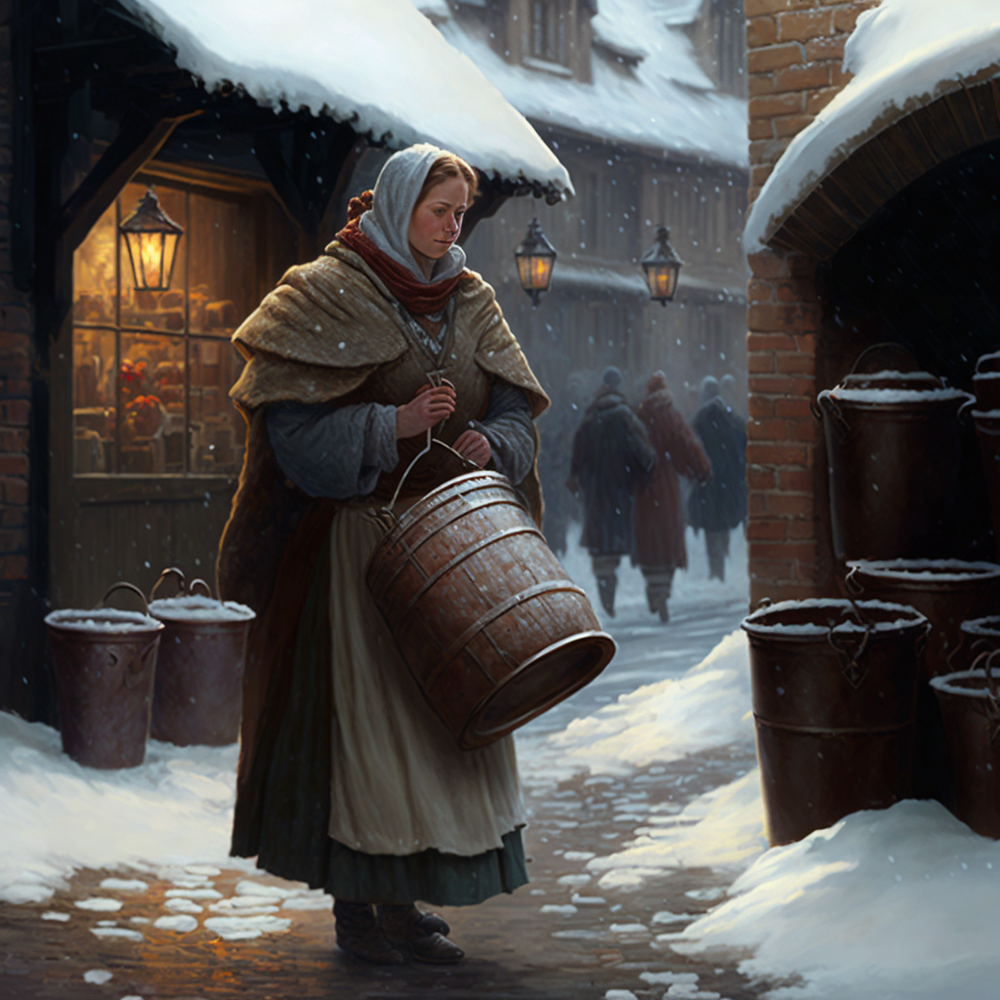

# Menschen

Menschen stellen die mit Abstand dominanteste Rasse in Orbis Astea dar. Abgesehen von den Köpfen kaum behaart, weniger muskulös und bulkig als Orks, dafür größer aber dümmer als Zwerge und nicht ganz so agil wie die Elfen, sind Menschen in keinen physischen Merkmalen den anderen Rassen überragend. Ihre größte Stärke hingegen ist die Fähigkeit, sich an scheinbar jede Situation anzupassen, oder so lang die Brüder und Schwestern zu opfern, bis die Situation passend wirkt. So kann ein Mensch fast alles lernen und ist körperlich nicht wirklich eingeschränkt wie Halblinge oder Goblins. Auch wirkt es so, als wäre eine gewisse Gleichgültigkeit gegenüber Fehlentscheidungen von Oberen, ebenso Vorteilhaft wie der Mangel an Intellekt um zu verstehen, dass sich vermutlich wirklich nur jeder selbst der Nächste ist, wie bei den Kleinwüchsigeren und gierigeren Zwergen.

Dies führt zu einer Situation, in der Menschen zwar in jedem Bereich "oben" mitspielen, aber in kaum einem Bereich zu den Besten gehören. Für die Spezies selbst scheint sich die Durchschnittlichkeit jedoch auszuzahlen. Sie besetzen die größte Fläche, sind zahlenmäßig allen anderen Rassen überlegen und mit Abstand die mächtigste Rasse. Letzteres lässt sich allerdings schwer nützen, wenn man den Groll gegenüber den Nachbarn über mehrere Jahrhunderte nicht ruhen lassen kann.

## Die Geschichte der Rasse

Die Geschichte der Menschen ist zu vielfältig, um wirklich von einer Rassengeschichte sprechen zu können. Dies liegt vor allem an der enormen Heterogenität zwischen den großen Gesellschaften der Rah Kari, Eldria's und des Kaiserreichs. Das Kaiserreich, Rah Kari und Eldria, bezeichnen beispielsweise ganz unterschiedliche Kulturen, obwohl sie der gleichen Rasse zugehörig sind. Das Seevolk wird von den Bewohnern Eldria's als verträumtes und verhungerndes Volk mit geistiger Seekrankheit bezeichnet, während die "freien" Menschen auf den Skaen nicht mehr sind als Bauern auf den eiskalten Feldern der ansässigen Kriegsherren.

Was man allerdings weiß, ist, dass die Menschen wohl eine der älteren Rassen sein müssen. Die über einen deutlich längeren Zeitraum dokumentierten Geschichtsschreibungen der Zwerge (bzw. ihre Geschäftsbücher), weisen von Anfang an auf Außenhandel mit Menschen hin. Zwergen Gelehrte hingegen würden darauf verweisen, dass zum einen Dörfer mit ein paar Hundert Menschen noch keine Zivilisation ist, und dass man mit Orks oder Goblins seltener Geschäftbeziehungen unterhält, wenn die Geschäftspartner, Händler essen, ausrauben oder schlichtweg nichts niederschreiben können.

## Bekannte Kulturen der Menschen

So bleibt den Wissbegierigen nur eine Auflistung von "reinen" Menschenkulturen beziehungsweise Kulturen, in denen Menschen einen hohen Bevölkerungsanteil haben:

-   Das [Kaiserreich](#Kaiserreich)
-   Die [Rah Kari](#RahKari)
-   Das [Fürstentümer von Eldria](#EldriaFaction)
-   Die [Skaen](#Skaen)
-   Die [Kultisten des Berma-Tals](#BermaTal)
-   Die [Seekulturen](#Seevolk)
-   Die [Eisenrote Wüste](#EisenroteWueste)
