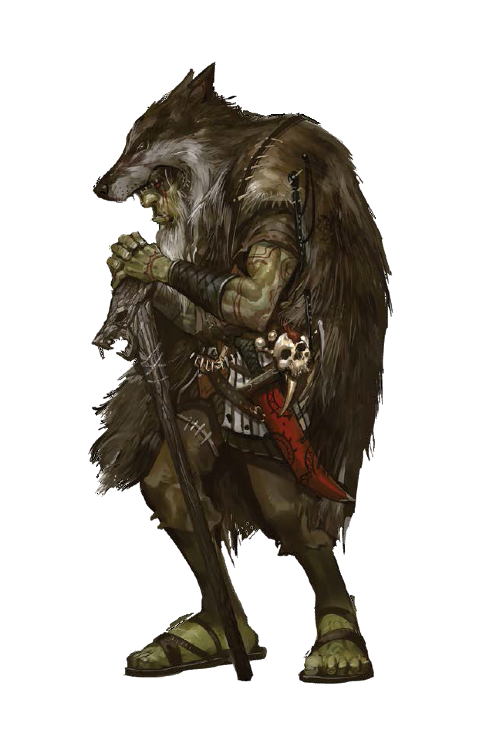

# Goblins

> "Wir hatten uns an ihr Nest angeschlichen, dachten wir, wir würden sie überraschen, dachten wir, das wird einfach, dachten wir, als wir umzingelt waren und die Bolzen von allen Seiten aus der Finsternis kamen wussten wir, dass nicht wir die Jäger waren."
>
> --- Die letzten Gedanken von Brago Tachus, Abenteuerer

Goblins sind etwas kleiner als Zwerge und ragen gleichweit hoch aus dem Boden wie die Halblinge aus Yondalla. Die geläufige Lehrmeinung ist, dass es sich um eine noch etwas basalere Kultur an humanoiden handelt als die der Orks oder Animali.

Ihr Alltag besteht, solange die Sonne scheint, aus dem versteckten Leben in ihren teils selbst gegrabenen Höhlen unter Tage. Dort zünden Sie Feuer, an spezifischen Feuerstellen an, schlafen in Schlafräumen wo diese Bette aus Felle und Stroh aufbauen. Gefressen wird um die Feuerstellen. Die Jagd nach Stainwürmern untertags ergänzt ihre sonst karges Nahrungsangebot. Goblins graben Tunnel um so jederzeit vor Gefahr zu fliehen um nicht von all den körperlich Überlegenen Kreationen dieser Welt verschlungen zu werden. Sie besitzen einigermaßen einheitliche Sprachen, weisen jedoch leicht unterschiedliche Dialekte auf. Das Oberhaupt bildet eine Matriachrin welche alle Kinder des Stammes gebärt und sich mit dem Stammeschamanen um Stammeshäuptling paart. Goblins bezeichnen ihre Gruppen oder Stämme gerne als "Dratin". Diese Dratins sind grob unterteilt in die drei oben genannten "Herrscher" ebenso wie in eine Arbeiter- und Kriegerkaste.

Speziell sind die herumreisenden Djunas, welche im Gegensatz zu den Dratintreuen Goblins, sich aktiv in anderen Dratinen einzugliedern versuchen und sich mit der Matriachin zu paaren. Dies ist nicht immer mit Erfolg gekrönt.

Tagsüber wandern Goblins durch die Oberwelt und jagen Wild und plündern teils nicht bewachte Dörfer und Häuser. Zum Leidweisen der Bauern stehlen Sie auch, sofern die Goblins nicht mit Menschen in irgendeiner Form affiliert sind, wie in den Norser Kanalsystemen, Nahrung aus den Speichern.

Inbesondere in Yondalla und dem Osten Eldrias verursacht diese immer wieder wütende Bauern Versammlungen.

Ihr Intellekt scheint denen von Menschen in nichts nachzustehen. Lediglich die Problematik der Destabilisierung der Dratine durch ein Überangebot an Nahrung und der darauf folgenden Sexuellen-sozialen Spannungen, scheint diese Spezies vom erreichen größerer zivilisatorischer Errungenschaften abzuhalten. Dadurch halten sich in weiten Teilen der Menschen die Haltung, dass man bettelnden Goblins keine Nahrung geben solle.

Die Abwertung in der zeitgenössischen Gesellschaft ist teils noch ärger als die von Elfen, womit Goblins Teils einen schweren Stand haben und für gewöhnlich nicht die regulären Rechte besitzen und maximal in dubiosen Geschäften verwickelt sind.

Im Kampf zeichnen sich Goblins durch besondere Fähigkeiten in lautlosen Überfällen mit Fernkampfwaffen und Blasrohren mit Giftpfeilen aus. Im direkten Kampf ist diese Spezies allerdings meist deutlich unterlegen. Lediglich Halblinge sind hier in der selben "Gewichtsklasse".

> "Diese kleinen und irgendwie hässlichen Wesen, sind weder robust noch stark, noch mit dem Intellekt anderer Rassen beschenkt, doch all diese Unfähigkeiten gleichen sie durch ihre agile und hinterhältige Natur aus. Goblins brillieren, wo andere Rassen verzweifeln - Nachts und in dunklen Tunneln. Nur jene, die noch nie auf eine Horde Goblins getroffen sind, halten Elfen für die Könige der Nacht. Denn im Unterschied zu den Elfen mit ihrer Nachtsicht gibt es vor den Goblins mit ihrer Thermalsicht kein verstecken."
>
> Travius Tandemus Sekundus Geistllicher der Ekkletia

## Die Geschichte der Rasse

Die Geschichtsschreibung der Goblins ist leider schwach ausgeprägt und basiert auf mündlichen Überlieferungen. Allerdings gäbe es auch nicht allzu viel zu erzählen. Da Goblins meistens in Stammesverbänden von meist 75-300, allerhöchstens 1000 Individuen leben, sind weder große Städte, noch große Bauwerke oder andere geschichtswürdige Werke von ihnen erschaffen worden.

Laut den sich grob deckendenmündlichen Überlieferungen der Goblins stammen diese Ursprünglich aus dem südlichen Teil der Himmelsspitzengebirgen. Von dort wurden Sie von "Gob" verjagt. Es ist nicht genau klar, was dieses "Gob" ist. Das Opfern der Toten, das Verbrennen von Leichen und das getötet werden von Mitgliedern der Dratins scheint allerdings ein kontinuierliches Merkmal zu sein.\
Kreaturen welche von den Goblins schlecht oder nicht gesehen werden können müssten die Temperatur der Umgebung annehmen. Das trifft abgesehen von Vielbeinern nur auf Knochenschädler zu.

Die Goblins bezeichnen dieses Unglück als "Schojoip" was soviel wie "Die Vertreibung" bedeutet.

Vertrieben von ihrer Heimat wanderten Goblins in unterschiedliche Regionen der bekannten Welt aus und sind nun inbesondere in zerklüfteten und Höhlenreichen Landschaften vertreten. In einigen Städten konnten sich kleinere Goblindratine niederlassen.

Die größte Tat der Goblins - und eine, die von Goblins nur allzu gerne erzählt wird - ist die Geschichte von MaHuk Korvax, dem wahrscheinlich erfolgreichsten MaHuk in der Geschichte von Orbis Astea. Durch seinen überlegenen Intellekt schaffte er es viele Goblinstämme unter sich zu einen und führte sie auf der Suche nach der bestmöglichen Interpretation der Vertreibung

Kreuzzug Rauchbomben

## Die Gesellschaft der Rasse

### Die Völkerbeziehungen der Rasse

Goblins sind in allen Landen zu finden, es gibt nirgends ein Loch, dass sie nicht bereit wären zu bewohnen, seien es Höhlen oder Katakomben - einem Goblin ist es recht. Aufgrund ihres Hangs zu dunklen Orten und ihrer Neigung zu Hinterhalten werden sie oft von anderen Völkern für Ungeziefer gehalten, das es zu entfernen gilt, jedoch scheitern diese Versuche nicht selten. Es existieren aber auch Berichte über Goblins in Koexistenz mit anderen Völkern.

## Fortpflanzung

<https://en.wikipedia.org/wiki/Naked_mole-rat>

((((((Brutmutter, grobschlächtig beharrte, dickliche,

wenige in anzahl, ein stamm ohne kann nicht wachsen, werden besser geschützt als der Häuptling, denn ein Hauptling kann ersetzt werden eine Brutmutter kaum.

Körperteile / glieder (finger, zehen, ohren) opfer für den brutkessel um die gene weiterzugeben, ehrenzeichen(nur die schlausten, talentieresten, usw...) (teilweise gefaked von reisenden)

2 Mal im Jahr Brutzeit, in der die Brutmutter den Brutkessel produziert und abgibt, sehr verwundbar, besonders gegenüber dem unsichtbaren feind. So sind einige Stämme nicht abgeneigt Hilfe von anderen Völkern in anspruch zu nehmen um die Brut zuschützen.

nach 4-5 jahren ausgewachsen und Reif, gesamtlebensdauer zwischen 35 und 50 Jahren.)))))))

In Goblin gemeinschaften führt für gewöhnlich die matriarichin den stamm an, die matriarchin ist die einzige in einer goblingruppe geläuftig genannt goblinstamm welche dazu fähig ist nachwuchs zu gebären.

Großbuchstabe

Matriarchin führen so eine gruppe von 75 bis 500 goblins an, die matriarchin selbst paart sich gewöhnlich mit dem stammesführer oder dem stammes schamanen. Selten kommt es auch vor das sich die matriarchin mit einem gruppenmitglied paart das besosndere leistungen für die Gruppe erbracht hat, diese werden Djunas (bosnisch für penis, indianischer vorname).

Djunas gehören zu den einizgen mitgliedern eines stammes, die aktiv andere stämme aufsuchen um aufgenommen zu werden. Djunas werden ohne das charakteristische merkmal ihres stammes geboren und verlassen diesen dann auf bald. Djunas versuchen dann in andere stämme aufgenommen zu werden und sich mit der matriarchin zu paaren. Die Stämme bezeichnen ihre Gruppen als Dratin. Es ist möglich in einem Stamm das normale Goblins der Arbeiter oder Kriegerklasse zum Stammesführer aufsteigen sei es durch akumulierte errungenschaften oder schlichtes wohlwollen der Matriarchin. Die Matriarchin ist im allgemeinen Fett und permanent schwanger, aufgrund der etwa vierfachen Nahrungsversorgung die ihr im vergleich zu einem normalen Goblin zugeführt wird. Der größte Teil eins Goblin Dratins besteht aus Arbeitern, 7 von 8 sind der Arbeiterklasse zugehörig, diese werden im allgemeinen mit etwas kärger nahrung großgezogen. Im gegensatz zu den Djunas die die meiste nahrung erhalten sogar noch etwas mehr als Krieger. Die Sexualität eines Goblins entwickelt sich erst bei einem gewissen Grad der Nahrungsverorgung. Dies führt in den Primalstämmen zu instablität. Dies führt auch dazu das kleinere Stämme im Fall eines spontanen überflusses an Nahrung viele Djunas bilden. Die Nahrung der Goblins besteht Primär aus erlegter Beute wodurch sich an der Oberfläche eine Nahrungskonkurenz mit anderen Rassen ergibt. Untertage jagen die Goblins für gewöhnlich Steinwürmer, zusätzlich ernähren sie sich noch von Pilzen welche Gelegentlich auch mit Menschen oder halblingen gehandelt werden. Goblins sind einzige Humanoiden die von natur aus selbst in der schwärzesten Nacht eine Warmblütige Nacht sehen können. Denn sie besitzen Thermalsicht. Neben der Thermosicht die allseits bekannt sind, sind diese auch äußerst unempflindlich gegenüber Säure was die Bejagung von Steinwürmern einfach macht. Goblins selbst sind äußert. Lebende Goblins sind zwar nicht entzündlicher als andere Wesen jedoch nach ihrem Ableben entwickelt sich in den Kadavern der Goblins eine leicht brennbare flüssigkeit. Goblinschamanen nutzen diesen Effekt, in dem sie einen ihrer Arme abbinden um so jederzeit Feuernutzen zu können.

Im gegensatz zu den anderen humanoiden Rassen haben die Goblins historisch gesehen kein bekanntes problem mit erwachten. Es ist zwar bekannt das getöte goblins als erwachte wiederauferstehen jedoch kommt das in Goblins Dratinis hingegen nicht vor da die Leichen Ritual verbrannt werden. Dies ist Aufgabe des Dratinis schamanen.

Steinwürmer essen erze, goblins essen steinwürmer, so brennen die goblinsstämme in unterschiedlichen farben =\> je nach dem welches minerial vorherschend in der region ist.

kopffüßler sind die kreaturen die die goblins vertrieben haben aus den himmelsspitzen und so für die verbreitung sorgten

blutlinien durch instezstös vererbtes körpermal, zum bsp dickbauch indianer

## Misc.

Rauchbomben Schlachten

Festung in Yondalla

5 Stämme nach Farben, diese färben flammen durch die zugabe von material ein, sowohl direkt in die flamme als auch durch verarreichung der substanzen an sterbende. diese Flammenbrennen auch auf verschiedenen Temperaturen was den Goblins ermöglicht makierungen und identifizierungen von anderen Stämmen zu erkennen.

-   [Selen](https://de.wikipedia.org/wiki/Selen "Selen"), blau

-   [Indium](https://de.wikipedia.org/wiki/Indium "Indium"), tiefblauviolett

-   [Kalium](https://de.wikipedia.org/wiki/Kalium "Kalium") und seine Salze färben die Flamme violett (768 und 404 nm).

-   [Lithium](https://de.wikipedia.org/wiki/Lithium) und seine Salze färben die Flamme rot (671 nm).

-   [Natrium](https://de.wikipedia.org/wiki/Natrium "Natrium") und seine Salze färben die Flamme gelb (589 nm).

-   [Rubidium](https://de.wikipedia.org/wiki/Rubidium "Rubidium") und seine Salze färben die Flamme rot (780 und 421 nm).

-   [Caesium](https://de.wikipedia.org/wiki/Caesium "Caesium") und seine Salze färben die Flamme blauviolett (458 nm).

-   [Calcium](https://de.wikipedia.org/wiki/Calcium "Calcium") und seine Salze färben die Flamme orange-rot (622 und 553 nm).

-   [Strontium](https://de.wikipedia.org/wiki/Strontium "Strontium") und seine Salze färben die Flamme rot (675 und 606 nm).

-   [Europium](https://de.wikipedia.org/wiki/Europium "Europium"), rot

-   [Radium](https://de.wikipedia.org/wiki/Radium "Radium"), karminrot

-   [Thallium](https://de.wikipedia.org/wiki/Thallium "Thallium"), grün

-   [Barium](https://de.wikipedia.org/wiki/Barium "Barium") und seine Salze färben die Flamme grün (524 und 514 nm).

Schamanen: Fähigkeiten, der Tote arm (ein halb abgestorbener arm der durch nur sehr spärliche versorgung die körperflüssigkeit bereits brennbar macht jedoch die funktionsfähigkeit eines armes komplett aufgibt. Zeichen ihres Glaubens und verbundenheit zum Feuer schon zu lebzeiten anders als ihre Artgenossen bereits flammenproduzieren zu können.

zusätzlich flammenreserven von toten.

## Die Religion der Rasse

Am Anfang war Gob und Gob war die Finsternis, die einen jeden Umgab, kalter toter Stein und warme lebende Beute doch eines hielt sich nicht an diese Regel, eines war kalt wie Stein und doch am Leben. Dieses eine oder dieses viele folgte wohin man auch ging, es folgte immer dem Tod, Tod durch Jagd oder Tod eines Freundes. Und so folgte auf Tod mehr Tod. So lernte man der Tod mochte es nicht einsam zu sein. Die Zeit verstrich und stets folgte auf Tod der Tod, bis zu jenem Tag an dem Freund Jegovha Stein auf Stein schlug und auf Tod nicht Tod folgte nur Licht und tanzende Schatten. Jegovha jedoch sah eines und erkannte die Wahrheit diese Gesandten des Schöpfers kamen, um sie zu strafen, unterhielt man Gob mit den tanzenden Schatten so forderte er kein weiteres Leben.

### Totenkult

> "Bei meinen Studien über diese kleinen hässlichen Wesen bin ich zu einer erstaunlichen Entdeckung gelangt, Goblins verbrannten ihre Toten, doch wie war das möglich so haben bereits frühere Befunde festgestellt, dass Goblins aus den Gebirgen stammen, aus kargen wenig bewachsenen Höhlen wie konnten sie dort genug Brennmaterial finden? Die Antwort ist ebenso einfach wie verblüffend Goblins waren brennbar, nicht im Sinne von man halte ihnen eine Fackel an den arm und sie lodern lichterloh auf, viel mehr scheint sich in ihrem Körper eine Flüssigkeit zu bilden die hochentzündlich ist. Ihr Stammesschamane nutz diese Eigenschaft geschickt aus und verwendet sie in ihrem Todesritual."
>
> --- Auszug aus "Leben die Goblins unter uns?" von Ferdinand Humbick

## Die Legenden der Rasse

## Die Eigenbegriffe der Rasse

## Stammesstruktur

Über jeden Stamm verfügt ein Stammesführer und jeder Stammführer verfügt über einen Stammesschamanen, dieses Zweiergespann leitet den Stamm. Als Stammesführer wird jener Goblin auserwählt, der dem Stamm durch eine Idee weiter bringt, daher ist es nahezu amüsant von außen mitanzusehen, wie eine dumme Idee die andere zu übertrumpfen versucht. Bei den Schamanen verhält es sich anders. Diese Rolle wird weitervererbt und bildet somit das solideste bestehende Glied in der Hierachie. Der Einfluss eines Schamanen ist nicht zu gering zu schätzen, so ist er nicht nur das Sprachrohr ihres Gottes Gob, sondern ist an Kampfkraft auch nicht zu unterschätzen, denn die brennbaren Flüssigkeiten, die bei den Totenritualen eingesetzt werden, weiß er auch im Kampf zu nutzen.

