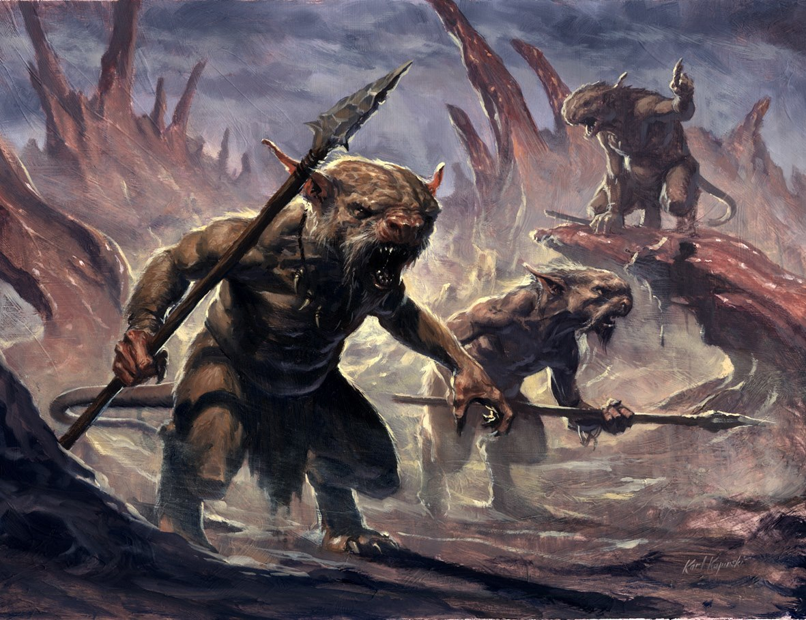
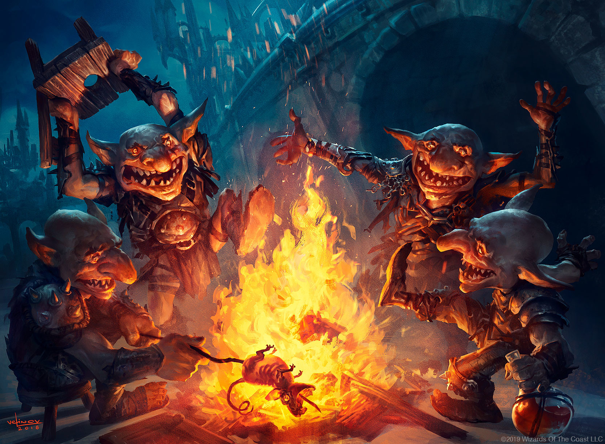
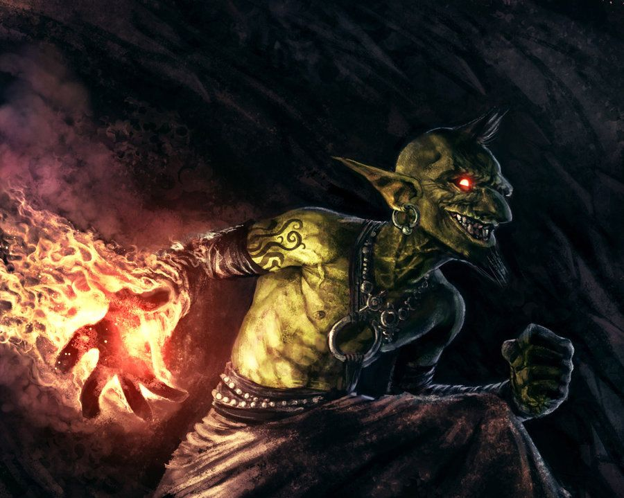

# Goblins

Diese kleinen und irgendwie hässlichen Wesen, sind weder robust noch stark, noch mit dem Intellekt anderer Rassen beschenkt, doch all diese Unfähigkeiten gleichen sie durch ihre agile und hinterhältige Natur aus. Goblins brillieren, wo andere Rassen verzweifeln - Nachts und in dunklen Tunneln. Nur jene, die noch nie auf eine Horde Goblins getroffen sind, halten Elfen für die Könige der Nacht. Denn im Unterschied zu den Elfen mit ihrer Nachtsicht gibt es vor den Goblins mit ihrer Thermalsicht kein verstecken.

> "Wir hatten uns an ihr Nest angeschlichen, dachten wir, wir würden sie überraschen, dachten wir, das wird einfach, dachten wir, als wir umzingelt waren und die Bolzen von allen Seiten aus der Finsternis kamen wussten wir, dass nicht wir die Jäger waren."
>
> --- Die letzten Gedanken von Brago Tachus, Abenteuerer

## Die Geschichte der Rasse

Die Geschichtsschreibung der Goblins ist leider - bis auf ein paar Sagen und Legenden - nonexistent. Allerdings gäbe es auch nicht allzu viel zu erzählen. Da Goblins meistens in Stammesverbänden von höchstens einigen tausend Individuen leben, sind weder große Städte, noch große Bauwerke oder andere geschichtswürdige Werke von ihnen erschaffen worden.

Die größte Tat der Goblins - und eine, die von Goblins nur allzu gerne erzählt wird - ist die Geschichte von MaHuk Korvax, dem wahrscheinlich erfolgreichsten MaHuk in der Geschichte von Orbis Astea. Durch seinen überlegenen Intellekt schaffte er es viele Goblinstämme unter sich zu einen und führte sie auf der Suche nach der bestmöglichen Interpretation

Kreuzzug Rauchbomben

## Die Gesellschaft der Rasse

### Die Völkerbeziehungen der Rasse

Goblins sind in allen Landen zu finden, es gibt nirgends ein Loch, dass sie nicht bereit wären zu bewohnen, seien es Höhlen oder Katakomben - einem Goblin ist es recht. Aufgrund ihres Hangs zu dunklen Orten und ihrer Neigung zu Hinterhalten werden sie oft von anderen Völkern für Ungeziefer gehalten, das es zu entfernen gilt, jedoch scheitern diese Versuche nicht selten. Es existieren aber auch Berichte über Goblins in Koexistenz mit anderen Völkern.

## Fortpflanzung

Brutmutter, grobschlächtig beharrte, dickliche,

wenige in anzahl, ein stamm ohne kann nicht wachsen, werden besser geschützt als der Häuptling, denn ein Hauptling kann ersetzt werden eine Brutmutter kaum.

Körperteile / glieder (finger, zehen, ohren) opfer für den brutkessel um die gene weiterzugeben, ehrenzeichen(nur die schlausten, talentieresten, usw...) (teilweise gefaked von reisenden)

2 Mal im Jahr Brutzeit, in der die Brutmutter den Brutkessel produziert und abgibt, sehr verwundbar, besonders gegenüber dem unsichtbaren feind. So sind einige Stämme nicht abgeneigt Hilfe von anderen Völkern in anspruch zu nehmen um die Brut zuschützen.

nach 4-5 jahren ausgewachsen und Reif, gesamtlebensdauer zwischen 35 und 50 Jahren.

## Misc.

Rauchbomben Schlachten

Festung in Yondalla

5 Stämme nach Farben, diese färben flammen durch die zugabe von material ein, sowohl direkt in die flamme als auch durch verarreichung der substanzen an sterbende. diese Flammenbrennen auch auf verschiedenen Temperaturen was den Goblins ermöglicht makierungen und identifizierungen von anderen Stämmen zu erkennen.

-   [Selen](https://de.wikipedia.org/wiki/Selen "Selen"), blau

-   [Indium](https://de.wikipedia.org/wiki/Indium "Indium"), tiefblauviolett

-   [Kalium](https://de.wikipedia.org/wiki/Kalium "Kalium") und seine Salze färben die Flamme violett (768 und 404 nm).

-   [Lithium](https://de.wikipedia.org/wiki/Lithium) und seine Salze färben die Flamme rot (671 nm).

-   [Natrium](https://de.wikipedia.org/wiki/Natrium "Natrium") und seine Salze färben die Flamme gelb (589 nm).

-   [Rubidium](https://de.wikipedia.org/wiki/Rubidium "Rubidium") und seine Salze färben die Flamme rot (780 und 421 nm).

-   [Caesium](https://de.wikipedia.org/wiki/Caesium "Caesium") und seine Salze färben die Flamme blauviolett (458 nm).

-   [Calcium](https://de.wikipedia.org/wiki/Calcium "Calcium") und seine Salze färben die Flamme orange-rot (622 und 553 nm).

-   [Strontium](https://de.wikipedia.org/wiki/Strontium "Strontium") und seine Salze färben die Flamme rot (675 und 606 nm).

-   [Europium](https://de.wikipedia.org/wiki/Europium "Europium"), rot

-   [Radium](https://de.wikipedia.org/wiki/Radium "Radium"), karminrot

-   [Thallium](https://de.wikipedia.org/wiki/Thallium "Thallium"), grün

-   [Barium](https://de.wikipedia.org/wiki/Barium "Barium") und seine Salze färben die Flamme grün (524 und 514 nm).

Schamanen: Fähigkeiten, der Tote arm (ein halb abgestorbener arm der durch nur sehr spärliche versorgung die körperflüssigkeit bereits brennbar macht jedoch die funktionsfähigkeit eines armes komplett aufgibt. Zeichen ihres Glaubens und verbundenheit zum Feuer schon zu lebzeiten anders als ihre Artgenossen bereits flammenproduzieren zu können.

zusätzlich flammenreserven von toten.

## Die Religion der Rasse

Am Anfang war Gob und Gob war die Finsternis, die einen jeden Umgab, kalter toter Stein und warme lebende Beute doch eines hielt sich nicht an diese Regel, eines war kalt wie Stein und doch am Leben. Dieses eine oder dieses viele folgte wohin man auch ging, es folgte immer dem Tod, Tod durch Jagd oder Tod eines Freundes. Und so folgte auf Tod mehr Tod. So lernte man der Tod mochte es nicht einsam zu sein. Die Zeit verstrich und stets folgte auf Tod der Tod, bis zu jenem Tag an dem Freund Jegovha Stein auf Stein schlug und auf Tod nicht Tod folgte nur Licht und tanzende Schatten. Jegovha jedoch sah eines und erkannte die Wahrheit diese Gesandten des Schöpfers kamen, um sie zu strafen, unterhielt man Gob mit den tanzenden Schatten so forderte er kein weiteres Leben.

### Totenkult

> "Bei meinen Studien über diese kleinen hässlichen Wesen bin ich zu einer erstaunlichen Entdeckung gelangt, Goblins verbrannten ihre Toten, doch wie war das möglich so haben bereits frühere Befunde festgestellt, dass Goblins aus den Gebirgen stammen, aus kargen wenig bewachsenen Höhlen wie konnten sie dort genug Brennmaterial finden? Die Antwort ist ebenso einfach wie verblüffend Goblins waren brennbar, nicht im Sinne von man halte ihnen eine Fackel an den arm und sie lodern lichterloh auf, viel mehr scheint sich in ihrem Körper eine Flüssigkeit zu bilden die hochentzündlich ist. Ihr Stammesschamane nutz diese Eigenschaft geschickt aus und verwendet sie in ihrem Todesritual."
>
> --- Auszug aus "Leben die Goblins unter uns?" von Ferdinand Humbick

## Die Legenden der Rasse

## Die Eigenbegriffe der Rasse

## Stammesstruktur

Über jeden Stamm verfügt ein Stammesführer und jeder Stammführer verfügt über einen Stammesschamanen, dieses Zweiergespann leitet den Stamm. Als Stammesführer wird jener Goblin auserwählt, der dem Stamm durch eine Idee weiter bringt, daher ist es nahezu amüsant von außen mitanzusehen, wie eine dumme Idee die andere zu übertrumpfen versucht. Bei den Schamanen verhält es sich anders. Diese Rolle wird weitervererbt und bildet somit das solideste bestehende Glied in der Hierachie. Der Einfluss eines Schamanen ist nicht zu gering zu schätzen, so ist er nicht nur das Sprachrohr ihres Gottes Gob, sondern ist an Kampfkraft auch nicht zu unterschätzen, denn die brennbaren Flüssigkeiten, die bei den Totenritualen eingesetzt werden, weiß er auch im Kampf zu nutzen.

