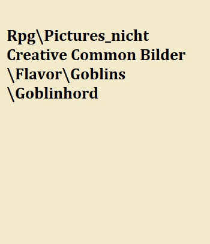
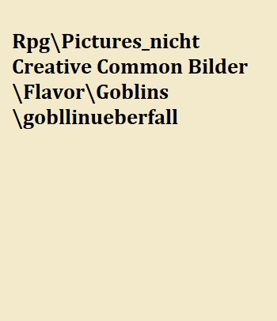

# Goblins

> "Wir hatten uns an ihr Nest angeschlichen. Wir würden sie überraschen, dachten wir, das wird einfach, dachten wir. Als wir umzingelt waren und die Bolzen von allen Seiten aus der Finsternis kamen wussten wir, dass nicht wir die Jäger waren."
>
> --- Die letzten Gedanken von Brago Tachus, Abenteurer

Goblins sind etwas kleiner als Zwerge und ragen genauso weit aus dem Boden wie die Halblinge aus Yondalla. Die geläufige Lehrmeinung ist, dass es sich um eine noch etwas basalere Kultur an Humanoiden handelt als die der Orks oder Animali es sind.

Ihr Alltag besteht, solange die Sonne scheint, aus dem versteckten Leben in ihren teils selbst gegrabenen Höhlen. Dort zünden sie Feuer an spezifischen Feuerstellen an, schlafen in Schlafräumen, wo diese Bette aus Fellen und Stroh aufbauen. Gefressen wird um die Feuerstellen. Die Jagd nach Steinwürmern untertags ergänzt ihre sonst karges Nahrungsangebot. Goblins graben Tunnel, um so jederzeit vor Gefahr fliehen zu können und nicht von all den körperlich überlegenen Kreationen dieser Welt verschlungen zu werden. Sie besitzen einigermaßen einheitliche Sprachen, weisen jedoch leicht unterschiedliche Dialekte auf. Das Oberhaupt bildet eine Matriarchin welche alle Kinder des Stammes gebärt und sich mit dem Stammeschamanen und dem Stammeshäuptling oder ausgewählten anderen Goblins paart. Goblins bezeichnen ihre Gruppen oder Stämme gerne als "Dratin". Diese Dratins sind grob unterteilt in die drei oben genannten "Herrscher" ebenso wie in eine Arbeiter- und Kriegerkaste.

Speziell sind die herumreisenden Djunas, welche sich im Gegensatz zu den Dratintreuen Goblins, aktiv in anderen Dratinen einzugliedern und mit der Matriachin zu paaren versuchen. Dies ist nicht immer mit Erfolg gekrönt.

Tagsüber wandern Goblins durch die Oberwelt, jagen Wild, plündern teils nicht bewachte Dörfer und Häuser. Zum Leidwesen der Bauern stehlen sie auch, sofern die Goblins keine positiven Beziehungen zu diesen haben, Nahrung aus den Speichern.

Inbesondere in Yondalla und dem Osten Eldrias verursacht dies immer wieder wütende Bauern-Versammlungen.

Ihr Intellekt scheint denen von Menschen in nichts nachzustehen. Lediglich die Problematik der Destabilisierung der Dratine durch ein Überangebot an Nahrung und der darauf folgenden sexuellen-sozialen Spannungen, scheint diese Spezies vom erreichen größerer zivilisatorischer Errungenschaften abzuhalten.

Die Problematik, um ein wenig genauer darauf einzugehen, besteht nämlich darin, dass die Goblins nach einem (zu) üppigen Mahl, sexuell deutlich aktiver werden. Demzufolge entstehen Machtkämpfe, da viele Goblins versuchen, sich mit der Matriarchin zu paaren.

Im Kampf zeichnen sich Goblins durch besondere Fähigkeiten bei lautlosen Überfällen mit Fernkampfwaffen aus. Im direkten Kampf ist diese Spezies den anderen allerdings meist deutlich unterlegen. Lediglich Halblinge sind hier in der selben "Gewichtsklasse".

> "Diese kleinen und irgendwie hässlichen Wesen, sind weder robust noch stark, doch all diese Unfähigkeiten gleichen sie durch ihre agile und hinterhältige Natur aus. Goblins brillieren, wo andere Rassen verzweifeln - Nachts und in dunklen Tunneln. Nur jene, die noch nie auf eine Horde Goblins getroffen sind, halten Elfen für die Könige der Nacht. Denn im Unterschied zu den Elfen gibt es vor den Goblins kein verstecken."
>
> Travius Tandemus Sekundus Geistllicher der Ekkletia

## Die Geschichte der Rasse

Die Geschichtsschreibung der Goblins ist leider schwach ausgeprägt und basiert auf mündlichen Überlieferungen. Allerdings gäbe es auch nicht allzu viel zu erzählen. Da Goblins meistens in Stammesverbänden von meist 75-300, allerhöchstens 1000 Individuen leben, sind weder große Städte, noch große Bauwerke oder andere geschichtswürdige Werke von ihnen erschaffen worden.

Laut den sich grob deckenden, mündlichen Überlieferungen der Goblins stammen diese ursprünglich aus dem südlichen Teil der Himmelsspitzengebirgen. Von dort wurden Sie von "Gob" verjagt. Es ist nicht genau klar, was dieses "Gob" ist. Das Opfern der Toten, das Verbrennen von Leichen und das getötet werden von Mitgliedern der Dratins scheint allerdings ein kontinuierliches Merkmal zu sein.\
Kreaturen welche von den Goblins schlecht oder nicht gesehen werden können müssten, aufgrund der Fähigkeit der Thermalsicht, welche Goblins aufweisen, die Temperatur der Umgebung annehmen, um sich vor ihnen verstecken zu können. Das trifft abgesehen von Vielbeinern nur auf Knochenschädler zu.

(was is da dazwischen passiert? wer hat se denn vertrieben?)

Die Goblins bezeichnen dieses Unglück als "Schojoip" was soviel wie "Die Vertreibung" bedeutet.

Vertrieben von ihrer Heimat wanderten Goblins in unterschiedliche Regionen der bekannten Welt aus und sind nun inbesondere in zerklüfteten und höhlenreichen Landschaften vertreten. In einigen Städten konnten sich kleinere Goblindratine niederlassen.

Besonders viele Goblinstämme kommen um die Berge in Yondalla, wie auch in den sich im Süden Eldrias befindenden Dunstspitzen vor. Im Gegensatz zu den Bergen um Yondalla haben sich in den Dunstspitzen keine Stämme mit längerer Geschichte durchgesetzt.

MaHuk ist die Goblin'sche Bezeichnung für "Held des Dratins" beziehungsweise "Held des Stammes." Geschichten werden entweder über MaHuks oder die Matriachirn erzählt und von regulären Goblins der Arbeiter- oder Kriegerkaste mehr beiläufig erwähnt, stehen aber nie im Zentrum der mündlichen Geschichten.

Die größte Tat der Goblins - und eine, die von Goblins nur allzu gerne erzählt wird - ist die Geschichte von MaHuk Korvax, dem wahrscheinlich erfolgreichsten MaHuk in der Geschichte von Orbis Astea. Durch seinen überlegenen Intellekt schaffte er es viele Goblinstämme unter sich zu einen und führte sie, auf der Suche nach der bestmöglichen Interpretation des Aktes des Schojoip (?) (Die Vertreibung) schließlich nach Yondalla, wo den Goblins angeblich eine rosige erste Epoche erwartete.\
Für Geschichtsgelehrte ist allerdings klar, dass dieser Zeitpunkt schon lange zurück liegen muss, da Yondalla bereits seit etlichen Jahrhunderten besiedelt ist und auch die Aufzeichnungen der Halblinge nie von größeren Goblinsiedlungen berichteten.

Eine häufig erzählte und folglich relevante Geschichte, ist die der Matriarchin "Seneai". Sie spielt vermutlich etwas später als die des MaHuk Korvax', und beschreibt die Vereinigung der fünf Stämme um Yondalla. Laut der Überlieferung konnte sie, dank ihres Dratinschamanen besondere Rauchbomben herstellen und konnte so die Früh-Yondall'sche Halblingsherrschaft beenden, was dazu führte dass die unterschiedlichen Dratine plötzlich genug Nahrung zur Verfügung hatten und die neuen Ableger der fünf Stämme sich in alle Himmelsrichtungen ausbreiten konnten. Gemeinhin bekannt ist dadurch den Goblins das "Fest der Feste", bei dem Goblins koordiniert in großer Zahl lokale Bauerndörfer Überfallen, Bauern drangsalieren, seltener Töten und dabei sämtliche wertvoll aussehenden Gegenstände zerstören.

Nach dem Tod besagter Matriarchin fiel die Allianz der Stämme wieder auseinander. Die Ursachen werden, laut Lehrmeinung eher in der Natur der Goblins zu finden sein als in gefinkelten, politischen Intrigen oder Kriegen mit anderen Spezies.

## Die Gesellschaft der Rasse

Die Kultur der Goblins ist schlicht gehalten. Die Matrarchin, der Dratinführer und der Dratinschamane bilden den kulturellen und exekutiven Kopf der Gemeinschaft. Arbeiter und Krieger sind im allgemeinen recht- und mittellos gegenüber dem Kopf des Dratins und werden meist nur durch extra Rationen an Nahrung oder einem Schlafplatz näher am nächtlichen Feuer belohnt.\
Bestrafungen bestehen aus dem Verbot von übermäßiger Nahrungsaufnahme und teils Drangsalierung durch andere Dratinmitglieder. Seltener werden Goblins als rituelle Opfer benutzt, um daraus extra Vorräte an Goblinöl zu erhalten.

Die Kriegerkaste ist lose organisiert und wird meist nur für spezifische Überfälle koordiniert. Ansonsten befinden sich an Ausgängen und bei wenigen Spähpunkten und Spähtunnels Goblins als vorgelagerte Augen. Aufgrund der Thermalsicht ist es äußerst schwer Goblinstämme vollkommen auszulöschen, da diese meist schon lange vorab sehen wo sich der Gegner befindet.

Die Nahrungslager werden meist in den Kammern der Matriarchin angelegt und somit ist es unmöglich Nahrung zu entwenden damit andere Goblins sexuell aktiv werden und zur Matriarchin heranreifen könnten. Dratinschamanen bilden das geschichtliche, kulturelle und ideologische Herz. Ein Goblinkind, welches aus der Vereinigung von Schamane und Matriarchin hervorgeht übernimmt die neue Rolle, sollte der alte Schamane sterben oder nicht ausreichend zum Gutdünken der Matriarchin handeln. Ein Dratinhäuptling kann aus dem regulären Goblinvolk gewählt werden, sofern dieser die Gunst der Matriarchin hat und bei den restlichen Goblins aufgrund besonderer Verdienste beliebt oder geschätzt ist.

Die Matriarchin selbst wird nur Dratinmitgliedern gezeigt und wird auch bei Problemen als erste evakuiert oder bis zum Tode gegen Eindringlinge oder Feinde verteidigt.

### Die Völkerbeziehungen der Rasse

Goblin unterhalten, nicht überraschender Weise, keine diplomatischen Beziehungen zu Großreichen, lediglich zu einzelnen Humanoiden der Oberwelt. Diese Beziehungen sind folglich unabhängig von großpolitischen Vorgängen, wie dem Krieg des Kaiserreiches gegen die Rah Kari.

Aufgrund ihres Hangs zu dunklen Orten und ihrer Neigung zu Hinterhalten sowie zum Einsatz von Giften, werden sie oft von anderen Völkern für Ungeziefer gehalten, das es zu entfernen gilt. Jedoch scheitern diese Versuche nicht selten. Inbesondere der Hass des Yondalles'schen Volks gegenüber den Goblins ist groß und auf Goblins ist in Yondalla ein allgemeines Kopfgeld ausgesetzt.

Seit der Besetzung durch das Kaiserreich ist dieser Hass abgeebt, da Goblins, nach herberen Verlusten, sich nicht gegen die schwerbewaffnete Kaiserliche Armee zu kämpfen trauen.

Besonders erwähnt werden sollte, dass einige Orkstämme Goblins als Nahrung ansehen und diese wie Halblinge auf ihren Festen verzehren.

## Biologie der Spezies

Matriarchinnen führen Gruppen von 75 bis 500 Goblins an, die Matriarchin selbst paart sich gewöhnlich mit dem Stammesführern oder dem Stammes Schamanen. Selten kommt es auch vor das sich die Matriarchin mit einem Gruppenmitglied paart das besosndere Leistungen für die Gruppe erbracht hat, diese werden Djunas (bosnisch für penis, indianischer Vorname) genannt. (wirklich den gleichen Abastz doppelt?)

Djunas gehören zu den einizgen Mitgliedern eines Stammes, die aktiv andere Stämme aufsuchen um aufgenommen zu werden. Djunas werden ohne das charakteristische Merkmal ihres Stammes geboren und verlassen diesen dann auf bald. Djunas versuchen dann in andere Stämme aufgenommen zu werden und sich mit der Matriarchin zu paaren. Es ist in einem Stamm oder "Dratin" möglich, dass normale Goblins, der Arbeiter oder Kriegerklasse zum Stammesführer aufsteigen, sei es durch akkumulierte Errungenschaften oder schlichtes Wohlwollen der Matriarchin. Die Matriarchin ist im allgemeinen fett und permanent schwanger, aufgrund der etwa vierfachen Nahrungsversorgung, die ihr im Vergleich zu einem normalen Goblin zugeführt werden muss. Der größte Teil eines Goblin Dratins besteht aus Arbeitern, 7 von 8 sind der Arbeiterklasse zugehörig, diese werden im Allgemeinen mit etwas kargerer Nahrung großgezogen. Im Gegensatz zu den Djunas, sollte ihnen die Paarung mit einer Matriarchin geglückt sein, die die meiste Nahrung erhalten sogar noch etwas mehr als Krieger. Die Sexualität eines Goblins entwickelt sich erst ab einem gewissen Grad der Nahrungsverorgung. Dies führt in den Primalstämmen (?) zu Instablität. Dies führt auch dazu, dass kleinere Stämme im Fall eines spontanen Überflusses an Nahrung viele Djunas bilden.

(aber is die vorraussetzung nit dass Djunas ohne typische stammesmerkmale geboren werden?)

Die Nahrung der Goblins besteht primär aus erlegter Beute, wodurch an der Oberfläche eine Nahrungskonkurrenz mit anderen Rassen entsteht. Untertage jagen die Goblins für gewöhnlich Steinwürmer, zusätzlich ernähren sie sich von Pilzen, um welche gelegentlich auch mit Menschen oder Halblingen gehandelt werden. Goblins sind die einzigen Humanoiden die von Natur aus selbst in der schwärzesten Nacht eine warmblütige Nacht sehen können. Denn sie besitzen Thermalsicht. Neben der Thermosicht die allseits bekannt ist, ist diese auch äußerst unempfindlich gegenüber Säure was das Jagen von Steinwürmern erheblich erleichtert. Lebende Goblins sind zwar nicht entzündlicher als andere Wesen, jedoch nach ihrem Ableben entwickelt sich in den Kadavern der Goblins eine leicht brennbare Flüssigkeit. Goblinschamanen nutzen diesen Effekt, indem sie einen ihrer Arme abbinden um so jederzeit Feuer entfachen zu können.

Im Gegensatz zu den anderen humanoiden Rassen haben die Goblins historisch betrachtet kein bekanntes Problem mit Erwachten. Es ist zwar bekannt das getötete Goblins als Erwachte wiederauferstehen, jedoch kommt das in Goblins Dratins nicht vor, da die Leichen ritualistisch verbrannt werden. Dies ist Aufgabe des Dratins Schamanen und benötigt, dank der Brennbarkeit der Goblinleichen kein Feuerholz.

Goblins jagen und verzehren Steinwürmer, welche aufgrund ihrer Nahrung eine hohe Konzentration an Mineralien enthalten. Dies führt dazu, dass die Goblinöle, welche aus den Kadavern gewonnen werden können, unterschiedliche Farben beim Verbrennen aufweisen. Laut kaiserlichen Alchemisten ist dies aufgrund der sich im Fettgewebe ansammelnden Erze und Metalle der Fall und dient zumindest bei den fünf Stämmen um Yondalla als Erkennungszeichen, und gleichzeitig als Hilfe zum Schmelzen von Erzen, für einfache Werkzeug- und Waffenherstellungen.

Ein weiteres Blutlinien spezifisches Merkmal der Goblins sind leicht unterschiedliche Körpermerkmale. Färbungen der Haut, Haarbüschel an den Schultern und die Ohrenform bilden hier die häufigsten und die am meisten definierten Merkmale.

## Misc.

Rauchbomben Schlachten

Festung in Yondalla

5 Stämme nach Farben, diese färben Flammen durch die Zugabe von Material ein, sowohl direkt in die Flamme als auch durch Verarreichung der Substanzen an Sterbende. (warum Zugabe / Verabreichung ? hab gedacht des haben de eh intus weil ses essen?) Diese Flammen brennen auch auf verschiedenen Temperaturen was den Goblins ermöglicht Makierungen und Identifizierungen von anderen Stämmen zu erkennen.

-   [Selen](https://de.wikipedia.org/wiki/Selen "Selen"), blau

-   [Indium](https://de.wikipedia.org/wiki/Indium "Indium"), tiefblauviolett

-   [Kalium](https://de.wikipedia.org/wiki/Kalium "Kalium") und seine Salze färben die Flamme violett (768 und 404 nm).

-   [Lithium](https://de.wikipedia.org/wiki/Lithium) und seine Salze färben die Flamme rot (671 nm).

-   [Natrium](https://de.wikipedia.org/wiki/Natrium "Natrium") und seine Salze färben die Flamme gelb (589 nm).

-   [Rubidium](https://de.wikipedia.org/wiki/Rubidium "Rubidium") und seine Salze färben die Flamme rot (780 und 421 nm).

-   [Caesium](https://de.wikipedia.org/wiki/Caesium "Caesium") und seine Salze färben die Flamme blauviolett (458 nm).

-   [Calcium](https://de.wikipedia.org/wiki/Calcium "Calcium") und seine Salze färben die Flamme orange-rot (622 und 553 nm).

-   [Strontium](https://de.wikipedia.org/wiki/Strontium "Strontium") und seine Salze färben die Flamme rot (675 und 606 nm).

-   [Europium](https://de.wikipedia.org/wiki/Europium "Europium"), rot

-   [Radium](https://de.wikipedia.org/wiki/Radium "Radium"), karminrot

-   [Thallium](https://de.wikipedia.org/wiki/Thallium "Thallium"), grün

-   [Barium](https://de.wikipedia.org/wiki/Barium "Barium") und seine Salze färben die Flamme grün (524 und 514 nm).

Schamanen: Fähigkeiten: der Tote Arm: ein halb abgestorbener Arm der durch nur sehr spärliche Versorgung die Körperflüssigkeit bereits brennbar macht jedoch die Funktionsfähigkeit eines Armes komplett zunichte macht.

Zeichen ihres Glaubens und Verbundenheit zum Feuer schon zu Lebzeiten anders als ihre Artgenossen bereits Flammen produzieren zu können. (?)

zusätzlich Flammenreserven von toten.

## Die Religion der Rasse

Am Anfang war Gob und Gob, die Finsternis, die einen jeden Umgab, kalter toter Stein und warme lebende Beute doch eines hielt sich nicht an diese Regel, eines war kalt wie Stein und doch am Leben. Dieses eine oder dieses viele folgte wohin man auch ging, es folgte immer dem Tod, Tod durch Jagd oder Tod eines Freundes. Und so folgte auf Tod mehr Tod. So lernte man der Tod mochte es nicht einsam zu sein. Die Zeit verstrich und stets folgte auf Tod der Tod, bis zu jenem Tag an dem Freund Jegovha Stein auf Stein schlug und auf Tod nicht Tod folgte nur Licht und tanzende Schatten. Jegovha jedoch sah eines und erkannte die Wahrheit, diese Gesandten des Schöpfers kamen, um sie zu strafen, unterhielt man Gob mit den tanzenden Schatten so forderte er kein weiteres Leben. (macht kan sinn)

### Totenkult

> "Bei meinen Studien über diese kleinen hässlichen Wesen bin ich zu einer erstaunlichen Entdeckung gelangt. Goblins verbrannten ihre Toten. Doch wie war das möglich? so haben bereits frühere Befunde festgestellt, dass Goblins aus den Gebirgen stammen, aus kargen wenig bewachsenen Höhlen. Wie konnten sie dort genug Brennmaterial finden? Die Antwort ist ebenso einfach wie verblüffend Goblins waren brennbar, nicht im Sinne von man halte ihnen eine Fackel an den Arm und sie brennen lichterloh, vielmehr scheint sich in ihrem Körper eine Flüssigkeit zu bilden die hoch entzündlich ist. Ihr Stammesschamane nutzt diese Eigenschaft geschickt aus und verwendet sie in ihrem Todesritual."
>
> --- Auszug aus "Leben die Goblins unter uns?" von Ferdinand Humbick

## Die Legenden der Rasse

## Die Eigenbegriffe der Rasse

## Stammesstruktur

Über jeden Stamm verfügt ein Stammesführer und jeder Stammführer verfügt über einen Stammesschamanen. Dieses Zweiergespann leitet den Stamm. Als Stammesführer wird jener Goblin auserwählt, der dem Stamm durch eine Idee weiterbringt, daher ist es nahezu amüsant von außen mitanzusehen, wie eine dumme Idee die andere zu übertrumpfen versucht. Bei den Schamanen verhält es sich anders. Diese Rolle wird weitervererbt und bildet somit das solideste bestehende Glied in der Hierachie. Der Einfluss eines Schamanen ist nicht zu gering zu schätzen, so ist er nicht nur das Sprachrohr ihres Gottes Gob, sondern ist an Kampfkraft auch nicht zu unterschätzen, denn die brennbaren Flüssigkeiten, die bei den Totenritualen eingesetzt werden, weiß er auch im Kampf zu nutzen.
