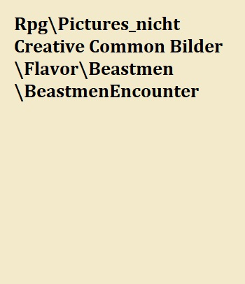
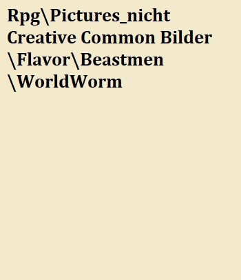
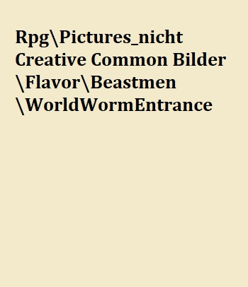

# Creatura Animali

## Überlick über die Animali

> "Durch meinen lebenslangen Dienst bei der Rasberger Handelsgesellschaft hatte ich sowohl das Vergnügen, als auch das Missfallen, alle Arten von Sehenswürdigkeiten und Anomalien dieser Welt zu sehen, wie zum Beispiel die Furcht in den Augen eines Mannes, der von der Ekklesia in die Dunkelheit gezogen wird, die rasende Stärke eines Orks, der einen Mann hinrichtet und den reinen Hass und die Herablassung, die von den Waldelfen ausgehen. Doch trotz all meiner Lebenserfahrungen hätte mich nichts auf meine erste Begegnung mit den Bestien vorbereiten können, die wir Animali nennen. Ich war völlig ehrfürchtig vor ihrer dominierenden Präsenz und ihren mutierten Körpern, doch mein zitternder Körper ließ mich unfähig werden, auf meine neu gefundene Neugier und Bestürzung zu reagieren."
>
> --- Raslan Agurious über seine erste Begegnung mit einem Animalus

Die Animali sind eine Rasse humanoider Lebewesen, die am äußersten Ende der Welt in der Region Eisland leben. Trotz der Tatsache, dass das Imperium mit der Rasse Handelsbeziehungen aufgebaut hat, ist der Öffentlichkeit verlässlich wenig über die Rasse bekannt und viele Mythen und erfundene Geschichten kursieren im Imperium. Die wenigen Menschen, die die Erfahrung gemacht haben, den Animali von Angesicht zu Angesicht zu begegnen, beschreiben sie als muskulöse Riesenkreaturen, die sich über die Menschen erheben und immer eine gewisse unbehagliche Atmosphäre mit sich bringen. Doch trotz der etwas blutigen Vergangenheit erweisen sich die Animali bis heute als ein wertvoller Handelspartner des Imperiums, da beide Seiten durch ihren angesehenen Handel von schwer zu beschaffenden Materialien profitieren.

Verglichen mit dem Imperium leben die Animali einen relativ konservativen Lebensstil, bevorzugen das Leben von Nomaden und leben in Stämmen. Es wird angenommen, dass die Animali diesen Lebensstil wählen, weil das sich ständig ändernde Wetter und Ökosystem bestimmte Teile des Eislandes  nur zu bestimmten Zeiten bewohnbar macht. Es wird auch geglaubt, dass ihre abgeschiedene und konservative Natur hauptsächlich für ihr langsames Fortschreiten als Gesellschaft verantwortlich ist und dass sie, kulturell und wissenschaftlich (falls man das bei den Animali so nennen kann), Jahrzehnte hinter den anderen Rassen zurückliegen.

![Ein für die Jagd bewaffneter Animalus[^JLazarusEBGoatman]](Pictures/Flavor/Animali/by_JLazarusLB_Ziege.jpg)

## Die Geschichte der Animali

## Herkunft der Rasse 

Die Animali waren eine gewöhnliche Gruppe von Menschen, die auf der Flucht vor jemandem oder etwas waren, das längst in Vergessenheit geraten ist. Sie flohen schließlich in die entlegenen Gebiete des Eislandes, wo sie in der Höhle von Khazak unterkamen. In dieser Höhle fanden sie Texte und Wandmalereien der Vorläufer. Sie versuchten, diese Texte zu übersetzen, interpretieren und zu verstehen, aber sie scheiterten dabei völlig. Als Folge ihres Missverständnisses formte sich eine neue Religion, die dazu führte, dass sie sich in die Kreaturen verwandelten, die wir heute sehen und als Creatura Animali, oder umgänglich Animali, bezeichnen.

### Der Erstkontakt mit dem Kaiserreich {#AnimaliKontaktKrieg}

Dass andere Animali-Stämme existieren ist bekannt, da es oftmals zu territorialen Konflikten, oder kämpfen um Ressourcen kommt. Es ist daher auch nicht unüblich, dass nach einem Kampf zwischen zwei Stämmen, einer dem anderen angeschlossen wird, um ein Aussterben eines Stammes zu verhindern. 
In der Welt der Animali gab es somit neben der Monster und Tiere des Eislandes ausschließlich andere Animali. 
Vereinzelt gab es Geschichten zu anderen Wesen, die keiner dieser Gruppen angehörten, doch, da Animali oftmals nicht die Fortschrittlichsten Kreaturen waren, wurde diesen Geschichten nie geglaubt. 

Eines Tages gingen ein paar Animali des Treprack Stammes der Spur eines großen Aufspießers nach als sie in einen heftigen Schneesturm gerieten. Da ihre Augen keine Wege mehr erkennen konnten, mussten sie sich auf andere Sinneswahrnehmungen wie das Hören und Riechen verlassen. 
Während ihrer Verfolgungsjagd wurden sie plötzlich von vielen, vermutlich kleineren Wesen attakiert. Besonders daran war, dass diese gut zu koordiniert zu sein schienen und sich in einer anderen Sprache absprechen konnten. 
Verwirrt von diesem unerwarteten Angriff, wussten die Animali nicht sofort, wie groß die Gefahr sein würde, die von dieser unbekannten Gruppe ausgehen würde. 
So entschieden sie sich zu Beginn, den großen Aufspießer weiter zu verfolgen, da sie sich sicher waren, dass dieser die größere Bedrohung für sie und ihren Stamm darstellen würde. 
Doch aufgrund des Lärms und der Bewegungen, ausgehend von der kleinen Gruppe, veränderte der große Aufspießer immer wieder seine Verhaltensmuster, indem er sich den Gruppen schnell näherte und sich wieder entfernte. 
Das Ziel fest im Blick nutzten die Animali jeden Chance auf eine Attacke des großen Aufspießers und konnten diesen, über die Zeit, zu Boden ringen und unter Hilfe der unbekannten Wesen ohne weitere Verluste bezwingen. 

Mit dem Tod des Monsters erkannten die Animali große Verluste auf Seiten der unbekannten Wesen. Waren sie doch sehr verwirrt, warum sie den Angriff auf das Monster unterstützten und die Attacken auf sie selbst einstellten. 
Da Najare, eine junge Kämpferin des Treprack Clans, jedoch großes Interesse an allem hatte, was außerhalb ihrer Erkenntniswelt lag, überzeugte sie ihre Stammesmitglieder davon, dass diese unbekannten Wesen sicherlich keine bösen Absichten ihnen gegenüber zu haben scheinen. Sie entwaffneten die Gruppe, um mehr über ihre Waffen und Lebensweise zu erfahren, entschieden sich jedoch dazu, entgegen der üblichen Handhabung der Animali, die unbekannten Wesen, die ihnen gar nicht so unähnlich zu sein schienen, nicht zu töten.
Ihr Ziel war es nun, eines der Wesen in Gefangenschaft zu nehmen, um mehr über sie erfahren zu können. Überraschenderweise trat einer der Unbekannten mehr oder weniger freiwillig aus der Gruppe hervir und ging mit ihnen mit. Über die Zeit entwickelte sich eine Art rudimentäre Kommunikation zwischen den beiden Völkern. Najare erkannte, in all ihrer Neugier, dass der Gefangene für sie eine Chance sein könnte, ihren Stamm verlassen und mehr über die Welt außerhalb ihres Lebensumfeldes erfahren zu können, wie ihre große Schwester dies bereits zuvor tat. 
Der Rest des Treprack Clans entgegnete diesem Interesse mit Ablehnung und Missgunst gegenüber dem Gefangenen.So würde dieser Unheil über den Clan bringen und ihn in aller Böswilligkeit zerstören wollen. 

Nachdem Najare alles von dem Gefangenen lernte, was sie kommunizieren konnten, entschied sie, ihn freizulassen und ein wiederholtes Treffen mit ihm zu vereinbaren. Sie konnte ihren Wunsch nicht aufgeben, mehr über diese Wesen zu erfahren. 
So vereinbarten sie ein Treffen, welches 3 Monde später am Ort des Kampfes stattfinden sollte. 

### Die große Jagd auf den Weltenwurm

> "So you want to know who was the greatest monster slayer in our history? Sadly I i have not acquired that knowledge yet, however I am able to tell you about the greatest monster hunt of our age that had an everlasting effect on our world.
>
> --- Jakob Lasmisimus - telling tales to partreons of the Thirsty Tankard Inn

In den nordwestlichen Teilen des Reichs ist allgemein bekannt, dass die Animali einige der besten Jäger unserer Welt hervorbringen und dass es diese Jäger sind, die die schrecklichsten aller Monster und Bestien zur Strecke bringen. Doch keine Beute kam je auch nur annähernd an die des Weltwurms Manisiqus heran, der mehr als drei Jahre lang gejagt wurde. 

Die [Weltenwürmer](#WeltenWurm) zählen zu den größten Lebewesen unserer Welt und viele Gelehrte spekulieren bis heute, wie ein Geschöpf dieser Größe in der Lage ist, sich selbst zu ernähren - geschweige denn nicht unter dem eigenen Gewicht zusammenzubrechen. Diese Kreaturen graben tief unter der Erde unserer Welt und sind oberirdisch nur selten zu sehen, Manisiquis allerdings grub sich immer und immer wieder aus dem Erdboden, wodurch er im Kaisereich als auch in Yondalla erheblichen Schaden und Angst auslöste, und auch im Eisland gesichtet wurde.
Der Kaiser selbst rief daher im Jahre 65 n. Riga eine [große Jagd]() aus.

Bis zu diesem Zeitpunkt glaubte man, dass die Animali seit 80 Jahren kein einheitliches, von ihrem Hauptschamanen festgelegtes Ziel mehr hatten. Doch schon bald nachdem Manisiqus vom Stamm der Rakhuls entdeckt worden war, erhielt der damals auserwählte Schamane Rinsimikak eine Vision der Götter, in der er die vielen Stämme der Animali sah, die glorreich auf dem Kopf des getöteten Weltwums standen. Mit dieser Vision setzte sich Rinsimikak das Ziel, die Animali wieder zu vereinen und den Weltenwurm zu jagen.

Nach vielen Wochen und Monaten der Vorbereitung traten die Animali schließlich in Aktion und jagten Manisiqus hinterher. Obwohl die Animali daran gewöhnt waren, im Untergrund zu überleben und die Abscheulichkeiten von Orbis Astea zu bekämpfen, soll die Jagdgruppe 36 % ihrer Mitglieder durch den Kampf gegen die anderen Kreaturen, die unter der Erde lebten, verloren haben. Laut den Schriften des verstorbenen Philip Bergsam heißt es außerdem, dass der Animalus Yukak - mit der Mutation des Riesenmaulwurfs - der einzige Grund dafür war, dass die Jagdgruppe Manisiqus über die Grenzen von Eisland hinaus verfolgen konnte. 
Allerdings waren die Jäger des Kaiserreichs - die dem Ruf der großen Jagd gefolgt waren - mehr als dankbar für die kompetente Unterstützung der Animali, da sie sich bisher absolut chancenlos gegen die Monstrosität erwiesen hatten. 

Nach 3 zermürbenden Jahren und vielen Verlusten gelang es den Animali schließlich, Manisiqus in der Region  die heute als Nebelhain bekannt ist, mit Mitteln in die Knie zu zwingen, die dem Imperium bis heute unbekannt sind. Es hieß, die Animali feierten 10 Tage lang ohne Ruhepause am Ruheplatz ihrer größten Beute und. Was die Animali jedoch nicht erkannten, war, dass das Höhlensystem, durch das sie nach Nebelhain gereist waren, durch den Ansturm auf Manisiqus hinter ihnen zusammengebrochen war. Nachdem ihr einziger bekannter Rückweg nach Hause versiegelt worden war, beschloss der Rest der Animali, das Gebiet, in dem sie sich nun befanden, zu kolonialisieren, und nach einigen Generationen wurden diese Animli zu den Echsenmenschen, die uns heute bekannt sind. 
 
## Die Gesellschaft der Animali

Die Animali sind in mehrere Nomadenstämme aufgeteilt, die durch das eiskalte Ödland von Eisland streifen und sich jeweils nur für kurze Zeit an einem Ort aufhalten. Die Animali haben nur einen festen Ort, den sie besetzen. Die  Höhle von Khazak. 

![Manche Animali sind perfekt ans Eisland angepasst[^EmnkunBearWarrior]](Pictures/Flavor/Animali/by_Emkun_Bear.png) 

Die einzelnen Stämme werden von einem Schamanen geführt. Jedes Jahr halten die Animali ein Fest ab, bei dem sich alle Stämme versammeln, die Götter ehren und ihr Volk feiern. Außerdem findet ein Turnier statt, bei dem alle Schamanen gegeneinander antreten, mit dem Ziel, Hauptschamane der Animali zu werden und die Höhle für sich beanspruchen zu können, eine Ehre, die nur dem Sieger obliegt. Der ausgewählte Schamane und sein Stamm leben ein Jahr lang in der Höhle, wo der Schamane mit Hilfe alchemistischer Gebräue mit den Göttern kommuniziert. Dadurch erfährt der Schamane von den besten Jagdgründen und erlangt andere wertvolle Informationen, um den Stamm zu mehr Größe zu führen.

### Der Ritus der Reife {#Mutation}

Beim Ritus der Reife wird ein Jungtier auf seine erte Jagd geschickt um zum vollwertigen Animalus zu werden. Der Schamane des Stammes entscheidet wann das Jungtier so weit ist und bereitet das damit verbundene Fest vor. 

Das Jungtier bricht ohne Waffen und Ausrüstung auf und kehrt erst zum Stamm zurück, wenn es eine vorzeigbare Beute erjagt hat. Dabei sterben besonders schwache Jungtiere meistens. 

Nach der ersten Jagd nimmt der Schamane des Stammes, dem das Jungtier angehört, die Jagdtrophäe des Jungtiers an sich. Er braut daraus einen Trank - das sogenannte Mutagen - und gibt dieses dem Jungtier zu trinken. Das Jungtier übernimmt dann bestimmte Merkmale der erlegten Beute und wird damit umso mächtiger, desto mächtiger seine Beute war. Dies determiniert auch den sozialen Status des Animalus in seinem Stamm.
Diesen Prozess kann ein Jungtier nur einmal durchlaufen.

![Ein frisch mutierter Animalus, die Mutationen hängen von seiner Beute als Jungtier ab[^Pixaby_Jungtier]](Pictures/Flavor/Animali/Pixaby_Jungtier.png)

### Die Völkerbeziehungen der Rasse

Die Stämme der Animali konkurrieren aufgrund ihrer natürlichen Jagdgewohnheiten oft miteinander um die Oberhand, wenn es um Jagdgründe oder Ressourcen geht. Wenn sie jedoch auf ein höheres Problem stoßen oder wenn der Hauptschamane der Animali eine Vereinigung dieser fordert, wird ein gemeinsames Bündniss geschmiedet, um externe Bedrohungen aufzuhalten oder sehr große Beute zu jagen.

## Die Religion der Rasse

## Die Legenden der Rasse

### Über Mantikore

Der erste Mantikor bestand aus Teilen von Bären, Fledermäusen und Skorpionen zusammen. 

Ein Mantikor ist eine Kreatur, die ursprünglich von dem Tierbändiger Rakrak vom Rikika-Stamm geschaffen wurde. Vor langer Zeit wurde Rakrak damit beauftragt, einen Weg zu finden, wie der Stamm den jährlichen "Altvorderen"-Wettbewerb gewinnen könnte, da man auf seinen Stamm herabsah, weil er den Wettbewerb seit über hundert Jahren nicht gewonnen hatte. 

Rakrak bat die Götter um Führung und wurde aufgefordert, ins Herzland zu reisen. Kurz darauf verließ Rakrak seinen Stamm und überließ seinem Lehrling die Leitung der Angelegenheiten, was unweigerlich zum Untergang des Stammes führte. Noch heute ist der Stamm nur noch ein Schatten seiner selbst. In den ersten Monaten seiner Reise kam Rakrak auf die Idee einem Animali eine weitere Mutation hinzuzufügen, um die Kampffähigkeit weiter zu verbessern. 

Viele Jahre vergingen, und Rakrak setzte seine Forschungen über weitere Mutation rigoros fort. Langsam etablierte sich um ihn eine Anhängerschaft von engagierten Forschern und verrückten Akademikern. 
Rakrak schuf auf seiner Reise viele gescheiterte Experimente mit dem Ziel den perfekten Krieger zu schaffen und wurde von Zeitzeugen teilweise für verrückt erklärt.
Den Aussagen der Zweifler zum trotze schuf er - nach vielen Jahrzehnten der Forschung und des Scheiterns - schließlich sein erstes Geschöpf, das sich fortpflanzen konnte. Der Mantikor. 

> "Um einen Mantikor zu erschaffen braucht es einen lebendigen Animalus. Ich habe einen Unwerten gefangen genommen. Seine Mutationen sind schwach, also wird er keinen guten Mantikor abgeben. Aber ich brauche Material zum experimentieren - und um diesen hier ist es nicht schade.
>
> --- Aus den Notizen von Rakrak

Obwohl es ihm endlich gelungen war, eine Kreatur zu erschaffen, die fähig war, sich fortzupflanzen, konnte man seine Schöpfung beim besten Willen nicht als intelligent erachten - die Kreatur war dermaßen aggressiv, dass sie die meisten Lebewesen - ausgenommen ihres Schöpfers - bei Sichtkontakt angriff.

Viele Jahre vergingen, und Rakrak war nie in der Lage, sein Ziel zu erreichen. Eines Tages verschwand er spurlos und sein Schicksal wurde nie bekannt. 
Ohne seine Führung verwandelte sich seine Forschungsgruppe mehr und mehr in einen fanatischen Kult. Viele Mitglieder waren sich über die Richtung, in die die Forschung gehen sollte, uneins. Als Folge davon entstanden viele verschiedene Untergruppen und Störungen, von denen es auch einige schafften, Unterarten des Mantikors zu schaffen.

Die Stämme der Animali empfanden die Mantikore als eine Ehrbeleidigung. Einen Affront, dessen bloße Existenz bereits eine Beleidigung darstellte. Die Animali zogen aus dem Eisland in den Krieg gegen diese Abominationen und töteten erbarmungslos jeden Mantikor den sie finden konnten, ebenso wie jeden von Rakraks Kultisten. Dies war eins der wenigen Male, als eine große Anzahl Animali das Eisland verließ. 
Obwohl auch Rakrak selbst auf ihrer Liste stand, blieb er verschollen und weder die Animali noch sonst irgendwer hat ihn seitdem gesehen.

## Die Eigenbegriffe der Rasse

Schamanen sind die Anführer der Animali-Stämme und haben auch die Aufgabe, die heiligen Tränke für den Stamm zu brauen.

Unwürdige werden Verräter oder inkompetente Animali genannt, die von den anderen ihrer Spezies verachtet werden. Unwürdige sind meist Animali, die mit einer niederen Beute während des Ritus der Reife zurückkamen.

Ritus der Reife - damit die Animali ins Erwachsenenalter übergehen können, müssen sie den Ritus der Reife vollziehen. Während dieses Ritus haben die Animali die Aufgabe, eine Bestie nur mit ihrer eigenen Kraft zu jagen, um ihrem Stamm ihren Wert und ihre Stärke zu beweisen. Sobald der Animalus mit seiner Trophäe zurückkehrt, bereitet der Schamane des Stammes mit der Beute einen Trank mit mutativer Wikung zu. 
Im letzten Teil des Rituals trinkt der Animalus den Trank und erlangt die Stärke und die Eigenschaften seiner Beute. Die Eindrücklichkeit der gejagten Beute entscheidet über die Stellung des Animalus in seinem Stamm.

[^JLazarusEBGoatman]: "Goatman" von [JLazarusEB](https://www.deviantart.com/jlazaruseb/art/Goatman-619607162). Dieses Artwork steht unter einer Creative Commons Attribution-Noncommercial-No Derivative Works 3.0 License zur verfügung.
[^EmnkunBearWarrior]: "Bear warrior" von [Emkun](https://www.deviantart.com/emkun/art/Bear-warrior-870124071). Dieses Artwork steht unter einer Creative Commons Attribution-Noncommercial-No Derivative Works 3.0 License zur Verfügung.
[^Pixaby_Jungtier]: von [pendleburyannette](https://pixabay.com/de/illustrations/kreatur-werwolf-stand-fu%C3%9F-3d-4955810/). Dieses Bild zur freien kommerziellen Nutzung zur Verfügung.
