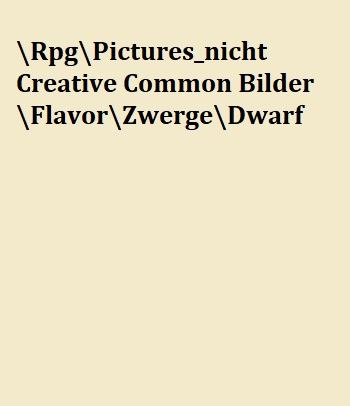
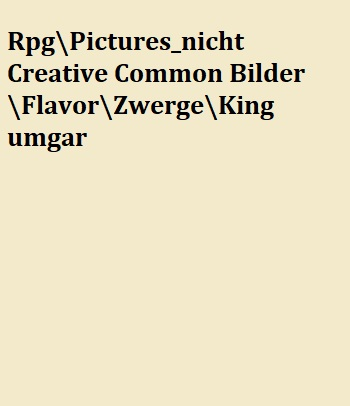
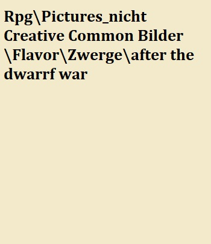
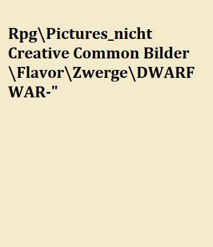
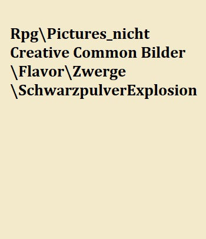
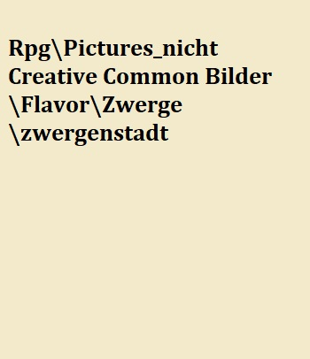
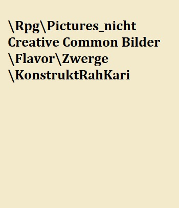
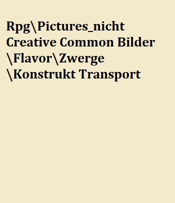
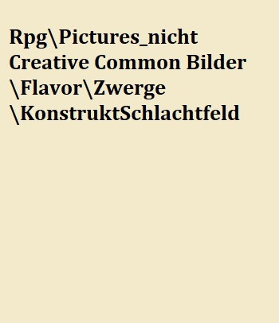
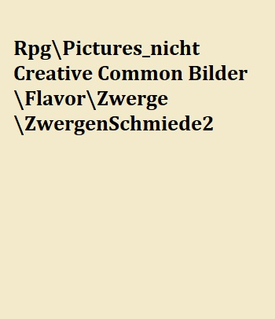

# Die Zwerge

Dieses weder große, noch sehr robuste Volk, überlebt nur Aufgrund seines überlegenen Intellekts. Dieser führt zu einer gewissen Überheblichkeit die noch verstärkt wird durch ihre weiteren wenig  charismatischen Eigenheiten. Durch ihren Hang zum Handel startet dieses Volk mit einem deutlich pralleren Geldbeutel als andere, den sie bereit sind mit allem was sie haben zu verteidigen. Die gewährt ihnen einen Vorteil bei Willpower checks, die in irgender einer Form Geld betreffen.

## Die Geschichte der Rasse

Die Zwerge beanspruchen den Titel der ältesten Rasse des Kontinents für sich, da es niemanden gibt der dies bestätigen kann wird heute allgemein angenommen das es sich dabei um eine große Marketing Aktion von Zwergenhändlern handelt.

Clan Umgar der rote  Clan des Königs niemand außer der königsfamilie wird in diese geboren in den clan wird man berufen, nur die treusten und besten hören diesen Ruf und ihn auszuschlagen gilt als Beleidigung dem Königshauses gegenüber.

Man sagt der erste des Geschlechts Umgar wurde mit einer Aufgabe betraut, man erinnert sich nicht mehr von wem diese ausging und man streitet um was für eine Aufgabe es sich handelte. Die einen meinen die Aufgabe sei es die Zwerge zum erfolgreichsten Konzern von Orbis zu machen, andere meinen es sei sicherlich gewesen alle Reichtümer anzuhäufen und wieder andere wenn auch deutlich leiser sprechen davon das Grauen in der Tiefe gefangen zu halten, dies sind die Donnerwächter.

Eines ist jedoch gewiss das Zwergenvolk einst vereint unter den roten Banner des Clan Umgar, widmete sich der Aufgabe Resourcen anzuhäufen Orbis zu erkunden und alles wertvolle an sich zu bringen dessen sie nur habhaft werden konnten,dabei galt ihr interesse im besonderen robusten Erzen weshalb sie oft Tief in den Berg gruben. In dieser Zeit wurde Brüderlich zwischen allen Zwergen geteilt, man versuchte für jeden genug zu haben und sich dennoch der Aufgabe zu widmen.
Doch mit den Jahren entwickelte sich Gier im Zwergenvolk jeder wollte mehr haben jedoch nicht für die Aufgabe sondern für sich allein! Was helfen die größten Schätze wenn man doch nur alles abgeben muss? Dem Clan Umgar wurde gar unterstellt all diese Schätze für sich zu behalten, dass gar keine Aufgabe existierte! Mit diesem Gedanken entzündete sich die Revolution. In jeder der Städte nun zahlreichen und gut vernetzten Städte der Zwerge entbrannte der Konflikt. "Progessive" gegen die Königstreuen die ihre stolzen Königsroten  roten Banner erhoben, wobei letztere deutlich in der minderheit waren, zu weit hatte sich die Gier in die Herzen der Zwerge eingebrannt. In dieser Zeit die unter Historikern nur als Ende des teilens bekannt ist füllten sich die Tunnel mit dem Blut der Zwerge. 

Viele Städte der Zwerge überstanden diesen Bürgerkrieg nicht und sind heute nur noch Ruinen die sich tief ins Reich der Erde bohren, andere sind unter der Last des Krieges gänzlich eingebrochen unverschütteten ganze Clans und wieder andere wurden so geschwächt dass sie sich den angriffen der anderen Völker die Reichtum witterten nicht mehr erwehren konnten. Der Clan Umgar selbst zerfiel in viele kleine Teile verstreut in allen Städten. Jedoch überlebte das Geschlecht des Königs wenn auch seiner Macht beraubt. 

Der letzte Versuch der Anhänger Umgars sich zu sammeln und das Blatt zu wenden, fand in der heutigen Region von Eldria statt, genauer in der Stadt Vandia. Die Zwerge hatten dort über die letzten 100 Jahre gute Beziehung mit den Menschen aufgebaut und dort eine gewaltige Stadt errichtet. Dieser letzte Widerstand sammelte seine Kräfte und Mittel für einen Gegenschlag. In erwartung auf die feindlichen Zwerge wurden die Konstrukte der Stadt so umgebaut das diese nur jene Zwerge mit einem Tattoo der Anhänger Umgars verschonen würde. Doch jede Hoffnung wurde zerschlagen, als der wahre Drache die Stadt zerstörte und die letzte große Zusammenrottung der Anhänger auslöschte.

Die Städte die noch übrig waren beobachteten dies und begaben sich in die abgeschiedenheit der Erde, verschütteten alle Eingänge um Invasoren abzuwehren und verloren fast vollständig den Kontakt zu ihren Vettern.

In ihrer isolation entwickelte sich ein ganz neues, ganz eigenes System dem Wunsch nach mehr Reichtum als Katalysator geschuldet. Doch konnte dieser Trieb wie bei anderen Völkern nicht durch expansion und eroberung gestillt werden. Die Zwerge mussten aus diesem begrenzten Raum das beste machen, so feilten sie an ihren Fähigkeiten, an ihrem Wissen, ihrem können und wurden zu wahren Meistern des Handelns und der Handwerkskunst.

Doch irgendwann als sich die Welt abgekühlt hatte nach dem heißen Zeitalter des unablässigen Kräfte ringens und sich einige halbwegs stabile Systeme in der außenwelt entwickelt hatten, sahen die Zwerge ihre chance zur wirtschaftlichen expansion.

> Die Geschichte der Zwerge ist wie jeder weiß eng verflochten mit der Geschichte von Balbobräu. Den für nichts gibt ein Zwerg lieber sein Geld aus als für Balbobräu. Hierbei einen umfassenden Gruß an den freundlichen und uneingennützen Sponsor Balbobräu ohne den diese Arbeit nicht möglich gewesen wäre.
Gänzlich unbeteiligt war Balbobräu natürlich am großen Sturz von Istval. Dieses gravierende Ereignis stellt einen Wendepunkt im Umgang mit explosivstoffen unter den Zwergen dar. Böse Zungen behaupten das die Arbeiter damals vor knapp 700 Jahren alkoholisiert nach einer fröhlichen Runde Balbobräu gewesen wären, doch jeder weis nur verantwortungsvolle Zwerge genießen diesen wohlschmeckenden Genuss. 
Eine Zwergenstadt wurde vor knapp 700 Jahren durch einen Fehler im Umgang mit explosiven Stoffen dem Erdboden gleichgemacht, aus dem Felssturz entstand das heutige [Nebelhain](#Nebelhain). Dies führte zum stammesübergreifenden Verbot von Schwarzpulver in den Städten der Zwerge, noch heute überläuft vielen Zwergen ein Schauer beim Anblick größerer Mengen an Schwarzpulver.
>
> --- Auszug aus einem Geschichtslehrbuch für Zwerge dessen Autor strikt behauptet nicht von Balbobräu beinflusst worden zu sein

## Die Gesellschaft der Rasse

Diese sozialdarwinistische kleine Rasse leidet unter einem enormen Geizproblem, Geld und Ressourcen sind alles für die Zwerge – und nichts davon wird unter irgendwelchen Umständen geteilt. Zwergenmütter würden ihre eigenen Kinder verhungern lassen, wenn sie berechtigte Gründe hätten zu glauben, dass ihr Nachwuchs der Familie mehr Kosten als Nutzen bringen würde. Es gibt keine sozialen Sicherungen, keinen Krankenstand und keine sozialen Leistungen, die man bekommt, wenn man sie nicht aus eigener Tasche zahlt.  

Das geht soweit, dass einem Schwerverbrecher (Den man nicht mit horrenden Geldstrafen abschrecken kann) anstatt einer Gefängnisstrafe, die Todesstrafe droht. Einwände, dass man deliquente auch ins Exil schicken könnte werden abgeschmettert mit dem Argument, dass wichtige handwerkliche Infos an andere Zwergenclans weitergegeben werden könnten, die dann aus den eigenen Innovationen mehr Profit schlagen würden als man selbst – bis heute ist dies die größte Angst, die über die zwergische Psyche bekannt ist. 

Trotz der ständigen Konkurrenz unter den Zwergen eines Clans heisst das nicht das sich diese permanent gegenseitig sabotieren würden viel mehr ist sich jeder Zwerg zwar der Konkurrenz bewusst jedoch weis auch ein jeder das sie nur zusammen wirklich viel verdienen können, den sowohl das wahre Vermögen als auch die wahre Konkurrenz liegt in der Oberwelt und ein Clan steht und fällt zusammen.
Um diesen zusammenhang zu verdeutlichen existiert eine beliebte Geschichte, jene von Baldor dem Tölpel

### Clans

[^Künstler7]

Zwergische Clans sollte man nicht mit liebevollen Familienverbänden der Menschen verwechseln viel mehr sollte man eher an riesige Unternehmen denken. Das heißt nicht, dass alle am selben Strang ziehen, sondern dass die Konkurrenz anderer Clans noch verhasster ist als der Nachbar aus der anderen Abteilung. 

Soziale Hierarchie setzt sich zusammen aus seinen handwerklichen Fähigkeiten und dem Vermögen eines Zwerges, wobei beides oft eng miteinander korreliert, da Konstruktschmiede ein vielfaches mehr verdienen als Schürfer.  

Im *Todesfall* gibt ein Zwerg sein gesamtes Vermögen an das Familienmitglied weiter, dass das beste Einkommen hat. Man geht davon aus, dass dieses Familienmitglied das Vermögen am besten vermehren könne.  

Die zwergische Familienstruktur ist ohnehin interessant, da auch verheiratete Paare unter keinen Umständen Ressourcen miteinander teilen würden. Sie führen getrennte Konten, verrechnen sich gegenseitig Nettigkeiten und stellen ihren eigenen Kindern von Geburt an jede Aufwendung in Rechnung – weswegen die meisten Zwerge mit einem kleinen Schuldenberg ins Arbeitsleben starten. 

Viele Zwergenfrauen verpfänden oder verkaufen ihre Kinder auch an verschiedene Firmen/industrien oder gar zur Schaffung von Konstruktkernen. 

Letzen endes ist jedoch jeder vernünftige Zwerg am Erfolg seines Clans interessiert, den jeder Zwerg weis
Zu diesem Zweck wird ein Clanchef erwählt dieser ist meist der Zwerg mit dem meisten Vermögen da davon ausgegangen wird das dieser am meisten zu verlieren hat, dieser Clanchef entscheidet über die Geschäftspolitik nach außen 

### Jobs

Die Karrieren in einem Zwergenleben werden teils schon früh entschieden, da manche von ihnen schon in jungen Jahren ins Exil geschickt oder verkauft werden. Diese Zwerge verlieren das Bürgerrecht in ihrem jeweiligen Clan, werden aber sehr gerne als Händler eingesetzt. Natürlich ist auch ein Zwerg ohne Bürgerrecht seinem Clan noch besonders verbunden und hat dort auch besondere Kontakte, aber auch bei anderen Clans ist er gerne gesehen solange er Profit bringt und nicht in der Lage ist wichtige Geschäftsgeheimnisse zu stehlen.

**Schürfer** die unterste mögliche Beschäftigung für einen Zwerg, haben keine feste Anstellung, sondern sind „Selbstständige Unternehmer“ die nach der geförderten Erzmenge und Rarität bezahlt werden. Für ihr Equipment müssen sie natürlich selber aufkommen. Falls man sich keine ordentliche Ausrüstung leisten kann, kann man sich natürlich eine Mieten – dafür muss nur die Kaution in Höhe eines durchschnittlichen halben Monatsverdienstes hinterlegen. Falls man die Kaution nicht aufbringen kann, nimmt die mitfühlende Firma natürlich auch gerne das Recht auf die Essenz naher Angehöriger/Kinder etc. an um daraus Konstruktkerne herzustellen. Der Traum eines jeden Schürfers ist es genug Geld anzusparen um die die Riege der Handwerker oder Händler aufsteigen zu können.

**Wächter** Nicht so angesehen wie andere Berufsgruppen jedoch besser bezahlt als die Schürfer dafür im Ausgleich auch weit gefährlicher, Wächer müssen nicht nur Gefahren die aus der Oberwelt drohen abwehren, sondern auch die Gefahren aus der Tiefe, Feuerspeiende Lindwürmer die sich durchs innere der Gebirge graben, forderten schon viele Zwergenleben bieten aber auch aufgrund der aus ihnen gewonnen hochwertigen  und gewinnbringenden Materialien eine aufstiegs Chance für die Wächter.

**Handwerker** Ein sehr angesehener Beruf unter dem Berg, schließlich ist eine der Hauptquellen des Vermögens, der Innovationsreichtum und die Fertigkeiten dieses tüchtigen Volkes.Seies es die berühmten Konstrukte, die revolutionäre verarbeitung seltener Erze den Zwergen Ingeneuren kann kein anderes Volk etwas vormachen.

**Händler** Sowohl über wie unter dem Berg sind Zwerge berühmt berüchtigte Feilscher, 

> "Ich hab mal einen Zwerg beobachtet wie er für eine Handvoll Reiks einen Animali davon überzeugt hat sein Leibwächter zu werden und trotzdem 80% seiner Einnahmen abzugeben" 
>
> --- Mikaeus Radoban, Wirt

**Essenzjäger** Wenig bekannt unter den anderen Völkern doch essentiell für die Produktion von Artefakten, durch ihren Zugang zu vielen Seelen sind die Oberweltzwerge die wichtigste Quelle für Essenzen. Dieser Beruf wird selten ausschließlich ausgeübt und ist meist eher als nebentätigkeit zu betrachten. Seien es **Söldner** die sich als Teil ihres Vertrages das Vorrecht auf die Leichen ihrer Feinde sichern oder fahrende **Händler** die sowieso mit Räubern kurzen Prozess machen.

### Die Völkerbeziehungen der Rasse

Während die meisten Völker Zwerge nur als Fahrende Händler oder an deren Wohnsitzen als Marktplatz kennen, pflegen die Rah Akari einen besonderen Handel insofern das eine ihre Hauptverteidigungen ,die Konstrukte, von den Zwergen kommen.

## Die Religion der Rasse

Fast jeder Zwerg ist nur von zwei Gedanken beseelt, dem anhäufen von Vermögen und einem kühlen Balbobräu nach getaner Arbeit.
Materielles ist das ein und alles, "das Allgeld regiert die Welt". Je mehr Vermögen ein Zwerg besitzt oder je erfolgreicher seine Geschäfte desto güter scheint das Glück auf diesen Sohn des Allgelds.

### Totenkult

Die Seele ist wie alles andere auch nur ein weiteres Mittel um an Geld zu kommen, durch die Verbrennung von empfindungsfähigen Wesen durch ein spezielles Öl, können ihre Seelen geerntet werden diese werden anschließend für die Fertigung von Konstruktkernen verwendet. Zwerge sprechen jedoch nicht über Seelen sondern lediglich über Essenzen da sie nicht an die Existenz einer Seele oder eines Lebens nach dem Tod glauben.
Das verbrennen von Untoten gewährt ebenso wenig die das von Monstern keine Essenzen, da diese keine Wahre Seele mehr besitzen.

## Die Legenden der Rasse

Jeder junge Zwerg kennt die Geschichte doch halten  sie nichts von Märchen, schließlich bringen diese 
kein Geld. Der Mythos der Herkunft der Zwergengier geht zurück bis auf die ernsten Männer unter dem Berg diese benötigten eine unheilige Menge an Ressourcen um das dunkle Grauen in der Tiefe Gefangen zu halten. Doch heute glaubt bis auf einige Wenige so genannte "Donnerwächter" niemand mehr an diese Legende.

## Die Eigenbegriffe der Rasse

**Jungblut** bezeichnet Zwerge die in erster Generation außer halb des Berges leben.

## Karawanen
In der Natur der Zwerge liegt das handeln und in der Natur der Logik liegt das eine Gruppe sicherer ist als der einzelene.Dementsprechend lag es nahe in Karawanen zu reisen, jedoch auf Grund des starken Konkurrenzdenkens und dem unwillen sich unter zu ordnen schließlich könnte man so bei einem Geschäft benachteiligt werden, gibt es nur wenige reine Zwergen Karawanen. Diese wenigen reisen in unterschiedlichen Größen, doch meist sind sie sogar mit großen Transportkonstrukten ausgestattet. Für andere Oberweltzwerge ist es jedoch auch üblich sich in Karawanen anderer anzuschließen.

## Konstrukte

Diese Wunder Mechanischer Handwerkskunst stellen den Zenit der Zwergischen Innovation dar. Sie sind aufgrund ihrer Religösen Ansichten als einziges Volk in der Lage diese teils Tonnenschweren Kollosse zum Leben zu erwecken. Die Konstrukte existieren in allen Formen und Farben und decken jeden nur möglichen Arbeitsbereich ab. So stellen sie zum Beispiel einen der schlagkräftigsten Teile des Rah Akari Heeres dar, Werden von Zwergenkarawanen zum Transport von tonnenschweren Waren benutzt und sind gleichzeitig mit schweren Ballisten bestückt. Fast jede Tätigkeit die ein Konstrukt übernimmt könnte genauso gut durch ein Tier, eine schlichte Mechanik oder einfach nur durch eine Person übernommen werden. Doch Konstrukte bieten neben vielen anderen Vorteilen einen bestimmten, bedinungslose Loyalität. 

### Kontrolle über Konstrukte

Kein Konstrukt wird seinen Meister Willentlich hintergehen denn sie sind in ermangelung von eben diesem. Wer einem Konstrukt befehle geben kann wird klar geregelt durch einen so genannten Meisterstein dieser wird zusammen mit dem Konstruktkern erschaffen und erhält dabei ein rein zufälliges und einmaliges Muster. Dieses Muster steht in Resonanz mit dem Kern, der das gleiche Muster trägt. Die Reichweite dieser Resonanz ist dabei jedoch begrenzt, doch innerhalb dieser Reichweite führt das Konstrukt jeden Befehl aus der vom besitzer des Meistersteins gegeben wird, dabei muss dieser Befehl nicht laut gesagt werden, ein explizieter Gedanke reicht bereits dafür, dies erfordert jedoch einiges an Übung, weshalb viele Nutzer es bevorzugen dem Konstrukt akkustische Befehle zu geben. So wichtig die Reichweite ist, als Meister sollte man sich da nichts so viele Sorgen machen, sollte ein Konstrukt die Reichweite verlassen so durchläuft das Konstrukt die aktuelle Routine fertig / den Befehl anschließend startet das Konstrukt automatisch eine vorher bestimmte "AFK Routine" die "Away From Konstruct Routine". Der Meisterstein trotz seines namens kann vielerlei Form haben, da das Muster erst bei der Erschaffung des Kerns aufgeprägt wird. Mögliche Meistersteine wären so zum Beispiel ein Amulett, Armreif oder tatsächlich ein verzierter Stein oder in ganz seltenen Fällen kann von Meistern ihres Handwerks das Muster sogar auf die Haut als Tattoo aufgetragen werden. Solche Tattoos bringen Vorteile wie Nachteile, so ist es quasi unmöglich die Kontrolle über das Konstrukt zu übertragen im Gegenzug ist es jedoch auch quasi unmöglich den Meisterstein von seinem Besitzer zu entwenden, dies wird also nur von den Misstrauischten genutzt. Zu beachten ist jedoch das die Nutzung von Konstrukten pro Meister limitiert ist denn zu viele Meistersteine unter einem Meister stören sich bei der Resonanz gegenseitig.

#### Vehicel Skill zur Kontrolle

### Die vielfalt der Möglichkeiten

Konstrukte unterscheiden in vielerlei Art. dabei werden grundsätzlich nur Grenzen durch die Handwerkskunst und die Kreativität seines Erbauers gesetzt.
Angefangen beim **Konstruktkern**, dieses Herzstück eines jeden Konstrukts bestimmt die späteren Anwendungsgebiete eines Konstrukts denn im gegensatz zu anderen Teilen des Konstrukts ist dieser später nicht mehr zu verändern. In die Kerne wird dabei nicht direkt ihre Aufgabe eingeprägt viel mehr stellt der Kern den möglichen Speicher und die Energiequelle dar, je besser der Kern desto mehr und Komplizierte Befehlte kann das spätere Konstrukt ausführen. Sogar selbst ständig mehrere Funktionen aneinander Reihen um den Befehl erfolgreich auszuführen. Konstruktkerne unterscheiden sich generell in ihrer Größe und ihrer Reinheit, generell gilt je größer ein Kern ist desto aufnahmerfähiger ist er benötigt aber auch entsprechend mehr Essenzen, sollte der Platz der für den Kern zur Verfügung steht limitiert sein so gäbe es ein weiterers Stellrad das bedient werden kann die Reinheit diese ermöglicht einen Kern bei gleicher Aufnahmefähigkeit zu verkleinern jedoch benötigt dieser Prozess deutlich mehr Essenz. 
Weiters existieren unterschiede in der Panzerung, wie man sich gut vorstellen kann ist ein Wesen dass auf Grund seiner Natur bereits ausschließlich aus Metallen besteht bereits gut gepanzert was bereits zu einem hohen Verteidigungswert führt, jedoch sind Teile des innenleben der Konstrukte aufgrund ihrer Filigranen und Präzisen Struktur leicht zu zerstören. Dies kann durch zusätzliche Panzerung an den Empfindlichen Stellen des Konstrukts verhindert werden, erhöht aber auch das Gewicht und den Preis.
Neben diesen Merkmalen gibt es natürlich noch zwei Offensichtliche, die Ausstattung und der Grundaufbau. die Ausstattung ist maßgeblich dafür welche Aufgaben überhaupt vom Konstrukt erledigt werden können und diese wird weiter durch den Aufbau des Konstrukts unterstützt.

### Konstruktarten

Grundsätzlich werden Konstrukte in fünf Klassen sortiert.

#### Utility: 

Konstrukte dieser Klasse sind hauptsächlich in Reichen Zwergen Haushalten anzutreffen, sie erfüllen Zwecke die auch ein Angestellter hätte verrichten können sind dabei aber deutlich Diskreter. Aufgabenfelder reichen hierbei von Handwerklichenaufgaben wie der Errichtung und Pfelge von Gebäuden bishin zu Verwaltungsaufgaben. Generell dienen sie zur Verbesserung der Lebensqualität. Die verwendenten Kerne sind meist nicht sehr groß und auch nicht sehr rein. Sie sind der Ausdruck purer Dekadenz.

#### Transport: 

Sowohl über als auch unter der Erde müssen oft größere Menge Ware oder große Lasten bewegt werden, hier für gibt es allerlei Möglichkeiten, die beste stellt natürlich auch hier wieder ein Konstrukt dar, hier ein Beispiel wo würden sie ihr Bargeld lieber aufbewahren, in einer Satteltasche eines Tieres das bereits für seine Sturheit und widerwilligkeit bekannt ist oder im Tresor im inneren ihres Loyalen Gefährten der ihnen ohne zu zögern in den Wurmfall folgen würde.
Diese Konstruktklasse unterscheidet sich stark in ihren Ausführungen obwohl sie doch alle das gleiche Ziel haben, von der Anzahl der Beine, Panzerung und nützliche Gadgets ist allen voran natürlich die mögliche Traglast ausschlaggebend.
Diese Konstrukte werden oft von den Oberflächen Zwergenkarawanen genutzt, in ihnen kann alles von mystischen Bestien bis Edelsteinen alles sicher Transportiert werden, oft werden diese dabei neben nützlichen Gadgets auch mit Waffen ausgestattet die dann von der Besesatzung genutzt werden können.

#### Kampf:

> Ich dachte nach Jahren auf all den Schlachtfeldern hätte ich alles gesehen, doch als meine Jungs von diesen vierarmigen Teufeln zerrissen wurden lief mir ein Schauer über den Rücken, kein Zucker überkam dieses Ungetüm als der alte Joshua es mit dem Kriegshammerschlug und keiner als es ihn in der Mitte Teilte.
>
>--- Abiter Kox Söldner Kapitän über eine Vorstoß Schlacht gegen die Rah Kari

Nichts ist auf einem Schlachtfeld effizienter als ein Nahkampf Konstrukt mit dem einfachen Befehl den Feind zu töten. Jeder weis nie ist der Mensch kreativer als im Krieg, die effektive zerstörung anderer scheint die Kreativität zu beflügeln und nichts ist effizienter als ein Konstrukt für diese Aufgabe. Die Panzerung scheint für viele Gegner oft undurchdringlich doch kaum ist man durch diese Panzerung gebrochen sind die meisten Konstrukte sehr zerbrechlich, doch dies stellt bereits eine Mammut Aufgabe dar. So hart der Kampf gegen sie ist so sehr kann sich die Belohnung auch sehen lassen, sollte der Konstruktkern unbeschädigt bleiben und der Meisterstein ergattert können beide auch ohne das Konstrukt zu einem hohen Preis an Zwergenclans verkauft werden, da diese ja wiederverwendbar sind.

Ein Fernkampf Konstrupt ist weit weniger adaptiert für den Nahkampf jedoch nicht zu unterschätzen zwar langsamer aber immer noch schlagkräftig, bestückt mit Ballisten oder Armbrüsten sind sie selbst auf große entfernung Tödlich. Zu beachten ist das beim Fernkampf deutlich mehr Ressourcen des Konstruktkerns beansprucht werden als es beim Nahkampf der Fall ist, schlicht auf Grund der höheren Komplexität.

#### Ornate Krieger:

Diese Konstrukte sind im Grunde nur Kampfkonstrukte jedoch nicht mit den herkömmlichen zu vergleichen, ihre Geschmeidigkeit und fließenden Bewegungen ohne Verluste in ihrer Stärke. Die Kerne dieser Konstrukte sind deutlich größer und auch reiner als die ihrer weit häufiger anzutreffenden Verwandeten. Durch die höheren Kapazitäten können genauere Bewegungsabläufe programmiert werden und den Konstrukten sogar eine art gefühl für Taktik geben um sich der aktuellen Kampf situation anzupassen.

Das bekannteste Beispiel für die Verwendung dieser Klasse stellen die Tempelwachen der Rah Kari dar.

#### Titan klasse Konstrukt: 
 
Diese Klasse ist die seltenste von ihr existieren selbst in den Aufzeichnungen nur eine handvoll Modelle. Diese teils riesigen Schöpfungen Tragen Kerne unglaublicher Ausmaße und immenser Reinheit in sich. Man möchte sich nicht ausmalen wie viel Essenz in die Erschaffung eines solchen Kernes gefloßen sein müssen, ganze Völker vom Angesicht der Erde getilgt. Was diese Konstrukte Gefährlich macht ist nicht Primär ihre Größe, Schlagkraft oder "Intelligenz" von denen alles in Maße vorhanden ist sondern viel mehr die Ausdauer. Ein jeder Militärstratege weis das Konstrukte gefährlich sind aber auch zerstört werden können wenn man ihre Rüstung durch dringt, dass mag auch hier Wahr sein, doch haben die gewitzten Erfinder dafür eine Lösungen gefunden. Die Konstrukte werden von vielen kleinen Konstrukten bewohnt, alle mit nur einem einzigen permaneten Befehl programmiert das Titanklasse Artefakt zu reparieren. Doch selbst diese benötigen auf Grund ihrer geringen größe, Kerne von großer Reinheit zwar wird Kapazität gespart durch die permanent  Installation des Befehls jedoch ist dieser immer noch hoch Komplex und erfordert stets mehrere Schritte.

### Bau

Was diese Konstrukte antreibt ist ein sogennanter Konstruktkern diese existieren in verschiedenen Größen und Reinheiten und werden mithilfe der Seelen von empfindsamen Wesen erschaffen. Je größer und reiner desto mehr Essenz wird benötigt, von diesen Stellschrauben hängt die spätere "Intelligenz" der Konstrukte ab da diese quasi die Speichergröße festlegen. Man munkelt die reinsten und größten Kerne können ein Bewusstsein entwickeln doch diese Theorie konnte bisher nicht bewiesen werden.

Um die Seelen für die teure Schaffung von Konstrukten zu besorgen gibt es für Oberflächenzwerge ein besonderes Werkzeug – den Seelenfänger – im Prozess die Seelen einzufangen müssen die Körper verbrannt werden. Dies stellt in einer Zwergenstadt mit einem Vulkan oder einer Schmiede kein Problem dar, für unterwegs ist das allerdings eher schwer zu bewerkstelligen. Daher kommt der  Seelenfänger mit einer Phiole gefüllt mit einem hochbrennbaren spezial Öl zur schnellen Einäscherung von Leichen. Dieses Öl wird von Enzymen des Feuerorgans der Linddrachen gewonnen, es produziert stetig neues Öl, diese verbrauchen sich jedoch auch mit der Zeit.

Die Inspiration für diese Wunderwerke fanden die Zwerge in den Überbleibseln von Forrunner Technologie, jedoch können selbst ihre heutigen meisterwerke den damaligen nicht das Wasser reichen.

## Die Donnerwächter

Kleine Fraktion unter den Zwergen die an das uralte dunkle Grauen glauben das in der Tiefe eingesperrt ist und irgendwann an die Oberfläche brechen wird um Verwüstung über die Welt zu bringen. Ihren Namen verdanken sie aus eigener Aussage den alten Tagen als noch der Donner in der Tiefe zu hören war, dieser ist jedoch schon seit Jahrhunderten verstummt und kein Zwerg weis mehr so genau wo im Gebirge er überhaupt zu hören war. Die Mitglieder sind nahe am Fanatismus so stehen manche sogar einige Zeit am Tag in der STadt und versuchen die Kunde zu verbreiten anstelle ihre Zeit mit einer Gewinnbringenden Tätigkeit zu nutzen, in höhrer Gesellschaft munkelt man das eine exekution dieser tu nicht gute angebracht wäre, jedoch existieren auch einige fleißige Mitglieder in höherer Position.
Die Mitglieder dieser Fraktion sind mit einem besonderen und komplizierten Tattoo gekennzeichnet, das sehr an die Resonanzkreise eines Konstrukttattoos ähneln

Es gibt gerüchte das dieses Tattoo noch immer jene versteckten Zwergentresore noch aus der Zeit der alten und der Revolution zu öffnen vermag.
Außerdem scheinen die Konstrukte in Vandia besitzer dieser Makierungen in Ruhe zu lassen.

## Bekannte Zwerge in der Oberwelt

**Baruuk Anführer des Groll Söldnercorps** eine lebende Legende unter Oberweltzwergen, bekannt für seine Kreativität, seinen Geschäftssinn und seinen Mut im Kampf.
Diese bekannte Söldner Truppe die ausschließlich aus Zwergen besteht arbeitet meist in kleinen Gruppen von 3-4 Mann, stets mit Fernwaffen ausgerüstet meist Musketen oder Armbrüste. Was diese Truppe besonders macht sind die kleinen Helfter der Truppe, jedes Mitglied der Truppe trägt ein Konstrukt bei sich.Bei diesen Konstrukten handelt es sich um eine Serienfertigung soweit diese möglich ist, im Grunde handelt es sich um einen eher kleinen Konstruktkern ohne jedwege Reinheit, dieser steckt in einer etwa Kopf großen Stahlkugel. Die Fortbewegung erfolgt mithilfe von 3 Beinen die über eine sehr starke Feder mit der Kugel verbunden sind. Diese selbstspannende Feder dient dem Hauptzweck des Konstrukts dem kraftvollen Katapultieren seiner selbst. 

> Der schaden den diese Schätzchen anrichten mag nicht groß sein aber schon mal eine 50kg Stahlkugel unters Kinn, gegen das Knie oder in die Edelsteine bekommen? Es gibt keinen Mann der da nicht ins stolpern kommt!
> --- Baruuk über die seine Konstrukte

Die durch die Konstrukte erkaufte Zeit Wissen die geschickten Schützen stets gut zu nutzen, dies erklärt die außerordentlich hohe Erfolgsquote der Truppe. Diese Strategie würde in großen Schlachten keinen großen Wert haben jedoch zur Abwehr von kleinen Gruppen Räubern ist sie perfekt. Jeder Zwerg der Teil der Gruppe sein möchte hat sich einzukaufen und erhält im Gegenzug eines dieser Konstrukte verpflichtet sich jedoch auch zur Treue gegenüber des Corps.

Baruuk der selbst nur Teil eines kleinen Zwergenclans ist hält an diesen kleinen Konstrukten zusammen mit seinem Clan ein Patent.

##Überbleibsel der Zwergenhochzeit in der Oberwelt

In der Zeit des Untergangs versuchten beide Fraktionen so viele Schätze wie möglich vor der anderen zu Verstecken und zu sichern. So entstanden auf dem gesamten Kontinent versteckte Schatzkammern, doch welcher Zwerg würde seine Schätze schon unbewacht lassen? Diese Anlagen die sich teils tief in die Erde fressen sind meist schwer bewacht, sei es durch Fallen oder sogar Konstrukte. Dies löste in allen Völkern folgend auf die Zeit des Untergangs Zwergenreichs eine Zeit der Abenteuer und unerhoffter Reichtümer als sich die Kunde über diese Verstecke herumsprach. Über die Jahre verfielen einige Kammern, andere wurde von Monstern oder von Goblins zur Heimat erklärt.
Noch heute verlassen abenteuerlustige Zwerge die Reiche unter den Bergen um Reichtum nach diesen legendären Tresoren zu suchen auch die anderen Völker hatten mit der Suche begonnen.Doch werden sie nie die Kammern der Donnerwächter betreten können den ihre größten Schätze offenbaren sie nur Donnerwächtern. Doch als sich dies herum Sprach begann auch die Jagt nach eben diesen Erben auch in der Oberwelt. Doch je weniger die Wächter und die Kammern wurden desto mehr geriet dieses Wissen in Vergessenheit heute wissen nur noch wenige über die notwendigkeit der Donnerwächter.

Manche Dungeons in Eldria sind in einer besonderen Position, auf Grund der antiken Beziehungen mit den Zwergen schützen noch heutige manche Adelige diese verschlossenen Kammern auch wenn sie bereits meist vergessen haben für wen sie diese schützen. Andere Adelige errichten Anwesen und Feriendomiziele auf ihnen da sie es für eine Art Statussymbol halten.

[^Künstler7]: "Niagara-falls" von [Butteredbap](https://www.deviantart.com/butteredbap/art/Niagara-falls-358961474). Dieser Artwork steht unter einer Creative Commons Attribution 3.0 License zur verfügung.

