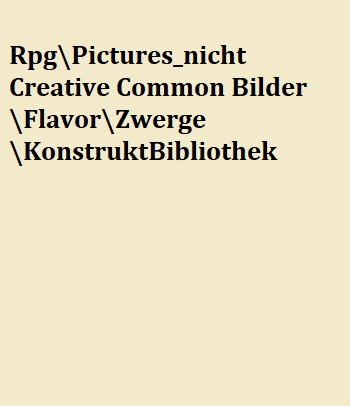

# Die Zwerge

Dieses weder große noch sehr robuste Volk, überlebt nur Aufgrund seines überlegenen Intellekts. Dieser führt zu einer gewissen Überheblichkeit, die noch verstärkt wird durch ihre weiteren wenig charismatischen Eigenheiten. Durch ihren Hang zum Handel startet dieses Volk mit einem deutlich pralleren Geldbeutel als andere, den sie bereit sind mit allem was sie haben zu verteidigen. Die gewährt ihnen einen Vorteil bei allen Verhandlungen, die in irgendeiner einer Form Geld betreffen.

## Die Geschichte der Rasse

Die Zwerge beanspruchen den Titel der ältesten humanoide Rasse des Kontinents für sich. Es gibt  allerdings niemanden der dies bestätigen kann. Im Allgemeinen wird von weniger wohlwollenden Gelehrten angenommen, dass dies aus einer Kampagne hervorgegangen ist, welche vor rund 270 Jahren das Ansehen der Zwerge erhöhen sollte. Damit sollte diese körperlich schmächtige Rasse als seriöser, weißer und „allwissend“ dargestellt werden.
Werbeschriften von Balbobräu, dem vermutlich größten Getränkehersteller der bekannten Welt, ließen verlautbaren:
> „Wir kennen den Anbeginn der Zeit! Schmeckt die gesammelte Erfahrung von hunderten Generationen von Meisterbrauern!“
> Balbobräu.

Zweifelslos sind die Zwerge eine sehr alte Rasse. Ruinen ihrer früher deutlich weiter verbreiteten Städte, welche Sie in die Gänge von Würmern unteridisch anlegten, belegen eindeutig längere nachweisliche Spuren. Jedoch gilt es zu bedenken, dass Orks zwar keine derart fundamentalen Bauten hinterlassen, jedoch niemand daran zweifelt, dass Orks schon längerer auf dieser Welt leben als das Reich der Rahkari bestand hat.

Zwerge hinterließen in verlassenen Zwergenstädten allerdings selten Dinge von Belang. Kritzeleien über „In diesem Haus wohnt ein Schuldner“ zu „Meißel bestehen nicht aus Zwergenstahl. Möge der Lindwurm dich beim Scheißen Fressen“ verraten hier Grundzüge des alten zwergischen Lebens.
Es ist allerdings nicht leicht, aus Zwergen Informationen herauszubekommen, verlangen diese doch durch die Bank Geld für den einseitigen Austausch an Informationen.
Alten Inschriften, wie auch bezahlten Zwergenhistorikern zufolge, ist das „erste“ Königsgeschlecht Umgar „der Rote“ genannt. Allerdings ist eine Datierung nicht möglich, da Erdbeben ein Archiv einstürzen und abrennen haben lassen.
Aller Voraussicht nach, lebten die Zwerge unter der eisernen Hand des Geschlecht Umgar’s in sehr starker Kooperation. Reichtum und Schätze wurden gemeinschaftlich, auch mit fernsten Verwandten geteilt, sofern dies Umgar’s Machtapparat verlangte. 
Die Gründe für Umgar’s „Gier“ sind allerdings nicht genau bekannt. Er war weder prunksüchtig, noch zettelte das Geschlecht häufig Kriege um Prestige an.  Dementsprechend gibt es Gerüchte was die Umgars tatsächlich wollten.
Man sagt der erste des Geschlechts Umgar wurde mit einer Aufgabe betraut. Die einen meinen die Aufgabe sei es die Zwerge zum erfolgreichsten Konzern von Orbis Astea zu machen, andere meinen es sei sicherlich gewesen alle Reichtümer anzuhäufen und wieder andere, wenn auch deutlich leiser sprechen davon, das Grauen in der Tiefe gefangen zu halten. Die in Vandia, einer halb verlorenen Zwergenstadt, noch aktiven Donnerwächter vertreten diese Ansicht.

Eines ist jedoch gewiss das Zwergenvolk einst vereint unter dem roten Banner des Clan Umgar, widmete sich der Aufgabe Ressourcen anzuhäufen, Orbis zu erkunden und alles Wertvolle an sich zu bringen dessen sie nur habhaft werden konnten. Dabei galt ihr Interesse im Besonderen Erzen für robuste Metalle, weshalb sie oft tief in den Berg gruben und Wurmgängen tiefer folgten als es Menschen mit klarem Verstand je tun würden. In dieser Zeit wurde brüderlich zwischen allen Zwergen geteilt, man versuchte für jeden genug zu haben und sich dennoch der Aufgabe zu widmen.
Doch mit den Jahren entwickelte sich die Gier im Zwergenvolk hin zu einer sehr egoistischen Angelegenheit. Wodurch der Umbruch ausgelöst wird, ist unklar. Möglicherweise verloren die Umgar’s Einfluss, oder plötzlich war nicht mehr genügend für jeden da. Das Ergebnis blieb gleich: Jeder wollte mehr haben jedoch nicht für die Aufgabe, sondern für sich allein. 
> Was helfen die größten Schätze, wenn man doch nur alles abgeben muss? 
> Weit verbreitete Schmierereien in verlassenen Zwergenstädten.
 
Dem Clan Umgar wurde gar unterstellt all diese Schätze für sich zu behalten, dass gar keine Aufgabe existiere. Mit diesem Gedanken entzündete sich die Revolution. In jeder der nun zahlreichen und gut vernetzten Städte der Zwerge entbrannte der Konflikt. "Progressive" gegen die Königstreuen die stolz ihre königsroten Banner erhoben, wobei letztere deutlich in der Minderheit waren. Zu weit hatte sich die Gier in die Herzen der Zwerge eingebrannt. In dieser Zeit die unter Historikern nur als Ende des Teilens bekannt ist füllten sich die Tunnel mit dem Blut der Zwerge. 

Viele Städte der Zwerge überstanden diesen Bürgerkrieg nicht und sind heute nur noch Ruinen, die sich tief ins Reich der Erde bohren, andere sind unter der Last des Krieges gänzlich eingebrochen und verschütteten ganze Clans und wieder andere wurden so geschwächt, dass die Städte sich den Angriffen der anderen Völker, die Reichtum witterten nicht mehr erwehren konnten. Der Clan Umgar selbst zerfiel in viele kleine Teile verstreut in allen Städten. Jedoch überlebte das Geschlecht des Königs, wenn auch seiner Macht beraubt. 

Der letzte Versuch der Anhänger Umgars sich zu sammeln und das Blatt zu wenden, fand in der heutigen Region von Eldria statt, genauer in der Stadt Vandia. Die Zwerge hatten dort über hunderte Jahre gute Beziehungen mit den Menschen aufgebaut und dort eine gewaltige Stadt errichtet. Dieser letzte Widerstand sammelte seine Kräfte und Mittel für einen Gegenschlag. In Erwartung auf die feindlichen Zwerge wurden die Konstrukte der Stadt so umgebaut das diese nur jene Zwerge mit einem Tattoo der Anhänger Umgars verschonen würde. Doch jede Hoffnung wurde zerschlagen, als der einzig bekannte wahre Drache die Stadt zerstörte und die letzte große Zusammenrottung der Anhänger Umgars auslöschte.

Die Städte, die noch übrig waren, beobachteten dies und begaben sich in die Abgeschiedenheit der Erde, verschütteten fast alle Eingänge, um Invasoren abzuwehren und verloren fast vollständig den Kontakt zu ihren Vettern.

In ihrer Isolation entwickelte sich ein ganz neues, ganz eigenes System dem Wunsch nach mehr Reichtum als Katalysator geschuldet. Doch konnte dieser Trieb wie bei anderen Völkern nicht durch Expansion und Eroberung gestillt werden. Die Zwerge mussten aus diesem begrenzten Raum das beste machen, so feilten sie an ihren Fähigkeiten, an ihrem Wissen und ihrem Können. Die Armut an Ressourcen verlangten eine exakte Einschätzung des Preises und der Nützlichkeit von allerlei Gegenständen und Dienstleistungen. Dadurch wurden Zwerge zu wahren Meistern des Handelns und der Handwerkskunst.

Die Zeiten der freiwilligen Isolation erschufen mit neuen Ideen „frisch geschlüpfte Zwerge“. So nannten Orks und Rahkari den frappierenden Unterschied der Zwerge. Ein jedes Wort und jeder Stein wurden auf die Goldwaage gelegt. Es musste alles genau dokumentiert werden um exakt zu wissen, wann , wo , wie viel von was benötigt werden könnte. Das war selbst für die gut organisiert Händlerkaste der Rahkari ein Novum. Dies führte ganz Nebenbei zur Beschränkung der Genehmigungen an Zwergenhändlern welche sich abseits der Hauptstädte bewegen dürfen. Zu sehr setzten diese lokale „unorganisierte“ Händler unter Druck. Dem Kaiserreich und dem losen Bunde der Eldrier erging es ähnlich. Wo Zwerge geduldet wurden, sammelte sich plötzlich der ganze Reichtum des Dorfes in zwei kleinen Händen.

Diese führten zu Absurditäten wie der Werbung in falschen Zwergengeschichtsbüchern:

> Die Geschichte der Zwerge ist wie jeder weiß eng verflochten mit der Geschichte von Balbobräu. Den für nichts gibt ein Zwerg lieber sein Geld aus als für Balbobräu. Hierbei einen umfassenden Gruß an den freundlichen und uneigennützigen Sponsor Balbobräu ohne den diese Arbeit nicht möglich gewesen wäre.
Gänzlich unbeteiligt war Balbobräu natürlich am großen Sturz von Istval. Dieses gravierende Ereignis stellt einen Wendepunkt im Umgang mit Explosivstoffen unter den Zwergen dar. Böse Zungen behaupten das die Arbeiter damals vor knapp 700 Jahren alkoholisiert nach einer fröhlichen Runde Balbobräu gewesen wären, doch jeder weiß nur verantwortungsvolle Zwerge genießen diesen wohlschmeckenden Genuss. 
Eine Zwergenstadt wurde vor knapp 700 Jahren durch einen Fehler im Umgang mit explosiven Stoffen dem Erdboden gleichgemacht, aus dem Felssturz entstand das heutige [Nebelhain](#Nebelhain). Dies führte zum stammesübergreifenden Verbot von Schwarzpulver in den Städten der Zwerge, noch heute überläuft vielen Zwergen ein Schauer beim Anblick größerer Mengen an Schwarzpulver.
>
> --- Auszug aus einem Geschichtslehrbuch für Zwerge dessen Autor strikt behauptet nicht von Balbobräu beinflusst worden zu sein

## Die Gesellschaft der Rasse

Diese mittlerweile unsoziale und kaltherzige kleine Rasse leidet unter einem enormen Geizproblem - Geld und Ressourcen sind alles für die Zwerge. Nichts davon wird unter irgendwelchen Umständen uneigennützig geteilt. Zwergenmütter würden ihre eigenen Kinder verhungern lassen, wenn sie berechtigte Gründe hätten zu glauben, dass ihr Nachwuchs der Familie mehr Kosten als Nutzen bringen würde. Es gibt keine sozialen Absicherungen, keinen gepflegten Krankenstand, wenn denn die Wahrscheinlichkeit später wieder den Verlust mit Zinsen wieder hereinzubringen. „Soziale“ Leistungen, die man bekommt, wenn man sie nicht aus eigener Tasche zahlt.  

Das geht so weit, dass einem Schwerverbrecher, welchen man nicht mit horrenden Geldstrafen abschrecken kann, anstatt einer Gefängnisstrafe, die sofortige Todesstrafe droht. Einwände, dass man Delinquente auch ins Exil schicken könnte, werden abgeschmettert mit dem Argument, dass wichtige handwerkliche Informationen an andere Zwergenclans weitergegeben werden könnten, welche im Zuge daraus dann aus den eigenen Innovationen mehr Profit schlagen würden als man selbst. Bis heute ist ein derartiger Verrat dies die größte Angst der zwergischen Psyche welche bekannt ist. Die Ausläufer dieser Paranoia zeigen sich in teils unverhohlen hohen „Absicherungen“ seitens Geschäftspartner.

Trotz der ständigen Konkurrenz unter den Zwergen eines Clans heißt das nicht, dass sich diese permanent gegenseitig sabotieren würden. Vielmehr ist sich jeder Zwerg zwar der Konkurrenz bewusst jedoch weiß auch ein jeder das sie nur zusammen wirklich viel verdienen können, den sowohl das wahre Vermögen als auch die wahre Konkurrenz liegt in der Oberwelt. Schließlich ist ein Clan häufig auf Gedeih und Verderb aneinander gekettet um komplexe Werkstücke, Nahrung oder gar Konstrukte zu erschaffen.

### Clans

![Die Zwergenstadt Tendar[^ButteredbapNiagaraFalls]](Pictures/Flavor/Zwerge/ZwergenstadtUeberirdisch_butteredbap.jpg)

Zwergische Clans sollte man nicht mit liebevollen Familienverbänden der Menschen verwechseln. Weitaus korrekter ist der Vergleich zum militärischen Arm des Kaiserreichs akkurat. Man sollte also eher an riesige Unternehmen denken. Das heißt nicht, dass alle am selben Strang ziehen, sondern, dass die Konkurrenz anderer Clans noch verhasster ist als der Nachbar aus dem Bergbau. 

Die Position in der sozialen Hierarchie in der Zwergenwelt setzt sich zusammen aus handwerklichen Fähigkeiten und dem Vermögen eines Zwerges - wobei beides oft eng miteinander korreliert. Dadurch ist theoretisch die zwergische Gesellschaft sehr viel offener für den Aufstieg des Einzelnen als dies die Reiche der Menschen wären. Für gewöhnlich leben aber bleibt es eine Minderheit an Zwergen, welche den größten Reichtum aufweisen.

Verstärkt wird dieser Effekt dadurch, dass im Todesfall ein Zwerg sein gesamtes Vermögen an das Familienmitglied weitergibt, dass das beste Einkommen hat. Man geht davon aus, dass dieses Familienmitglied das Vermögen am besten vermehren könne. Gleichzeitig ist diese Tradition ein Mitgrund warum manche Zwerge, welche als unproduktiv gelten könnten in jüngsten Jahren aus der Familie ausgeschlossen oder verkauft werden. Weniger Konkurrenz um das Erbe.  

Die zwergische Familienstruktur ist ohnehin interessant, da auch verheiratete Paare unter keinen Umständen Ressourcen miteinander teilen würden. Sie führen getrennte Konten, verrechnen sich gegenseitig Nettigkeiten und stellen ihren eigenen Kindern von Geburt an jede Aufwendung in Rechnung – weswegen die meisten Zwerge mit einem kleinen Schuldenberg ins Arbeitsleben starten.  Viele Zwergenfrauen verpfänden oder verkaufen ihre Kinder auch an verschiedene Betriebe oder gar zur Schaffung von Konstruktkernen- wobei die Kinder getötet werden können. 

Letzen Endes ist jedoch jeder vernünftige Zwerg am Erfolg seines Clans interessiert, den jeder Zwerg weiß – andere Völker können Zwerge nicht leiden – und nur gemeinsam hindert man Menschenhorden davor sich an den mehr oder weniger hart erarbeiteten Reichtümern zu bereichern.
Zu diesem Zweck wird ein Clanchef erwählt. Dieser ist meist der Zwerg mit dem meisten Vermögen, da davon ausgegangen wird, dass dieser am meisten zu verlieren hat, sollte uneffektiv gehandelt werden.  Gewöhnlicherweise entscheidet dieser Clanchef über die Geschäftspolitik nach außen. 

### Jobs

Die Karrieren in einem Zwergenleben werden teils schon früh entschieden, da manche von ihnen schon in jungen Jahren ins Exil geschickt oder verkauft werden. Diese Zwerge verlieren das Bürgerrecht in ihrem jeweiligen Clan, werden aber sehr gerne als Händler eingesetzt. Natürlich ist auch ein Zwerg ohne Bürgerrecht seinem Clan noch besonders verbunden und hat dort auch besondere Kontakte, aber auch bei anderen Clans ist er gerne gesehen, zumindest solange er Profit bringt und nicht in der Lage ist wichtige Geschäftsgeheimnisse zu stehlen.

**Schürfer** 
Die unterste mögliche Beschäftigung für einen Zwerg. Schürfer haben keine feste Anstellung, sondern sind „Selbstständige Unternehmer“ die nach der geförderten Erzmenge und Rarität bezahlt werden. Für ihr Equipment müssen sie natürlich selber aufkommen. Falls man sich keine ordentliche Ausrüstung leisten kann, kann man sich natürlich welche mieten – dafür muss nur die Kaution in Höhe eines durchschnittlichen halben Monatsverdienstes hinterlegen. Falls man die Kaution nicht aufbringen kann, nimmt die mitfühlende Firma natürlich auch gerne das Recht auf die Essenz naher Angehöriger/Kinder etc. an, um daraus wertvolleres, auch Konstruktkerne, herzustellen. Der Traum eines jeden Schürfers ist es genug Geld anzusparen, um die die Riege der Handwerker oder Händler aufsteigen zu können.

**Handwerker** 
Ein sehr angesehener Beruf unter dem Berg, schließlich ist eine der Hauptquellen des Vermögens, der Innovationsreichtum und die Fertigkeiten dieses tüchtigen Volkes. Sei es die berühmten Konstrukte, die revolutionäre Verarbeitung seltener Erze oder schlichtweg technische Errungenschaften, in welchen Zwergenhandwerkern kein anderes Volk etwas vormachen.

**Wächter** 
Wächter sind nicht so angesehen wie andere Berufsgruppen. Zwerge in den sicheren Bereichen einer Zwergenstadt bezeichnen Wächter meist als „Nichtstützende Säulen“. Allerdings sind Wächter besser bezahlt als die Schürfer. Im Ausgleich dafür leben Wächter auch weit gefährlicher. Wächter müssen nicht nur Gefahren, die aus der Oberwelt drohen abwehren, sondern auch die Gefahren aus der Tiefe. Feuerspeiende Lindwürmer, welche Steinwürmer jagen welches sich durchs innere der Gebirge graben. Beide forderten schon viele Zwergenleben bieten aber auch aufgrund der aus ihnen gewonnen hochwertigen und gewinnbringenden Materialien eine Aufstiegs Chance für die Wächter. So kommt es häufig vor, dass besonders verschuldete Zwerge Waghalsige Angriffe durchführen um als Lindwurmerleger sich aus Schulden, bis zu einem gewissen Betrag natürlich, zu befreien. 

**Händler** 
Sowohl über wie unter dem Berg sind Zwerge berühmt berüchtigte Feilscher, welche einer bettelnden Großmutter noch mit derselben Geschäftshärte begegnen wie einem hochnäsigen Adeligen.

> "Ich hab‘ mal einen Zwerg beobachtet wie er für eine Handvoll Reiks einen Animali davon überzeugt hat sein Leibwächter zu werden und trotzdem 80% seiner Einnahmen abzugeben. Ich glaube die Zwerg sind einfach alle gleich." 
>
> --- Mikaeus Radoban, Wirt

**Essenzjäger** 
Weniger bekannt unter den anderen Völkern, jedoch essenziell für die Produktion von Artefakten und Konstrukten. Durch ihren Zugang zu vielen Seelen sind die Oberweltzwerge die wichtigste Quelle für Essenzen. Dieser Beruf wird selten ausschließlich ausgeübt und ist meist eher als Nebentätigkeit zu betrachten. Seien es Söldner die sich als Teil ihres Vertrages das Vorrecht auf die Leichen ihrer Feinde sichern oder fahrende Händler, die sowieso mit Räubern kurzen Prozess machen.

Das besondere an Essenzjägern ist, dass diese den schlechten Ruf von Zwergen sogar nochmal auf eine tiefere Stufe stellen konnten. Essenzen sammeln Zwerge direkt von frisch verstorbenen. Spezielle Vorrichtungen ermöglichen das, was Priester als „Absaugen der Seele“ bezeichnen.
Zwerge sind dadurch meist schon auf Schlachtfeldern anwesend, bevor eine Schlacht stattfindet. Dies führte dazu, dass die lokale Bevölkerung und Soldaten diese Essenzjäger als „Boten des Todes“ bezeichnen – zu häufig sind die kleinen Gestalten vor einem Gemetzel zu sehen, zu häufig laufen sich durch die Toten Massen.
Dabei schrecken die Zwerge auch nicht davor zurück Offiziere oder Geistliche zu bestechen. Für beide Seiten ein lukratives Geschäft. Wer kann schließlich nachvollziehen, wo Soldaten während eines Kampfs überall hin fliehen? Wilde Tiere würden auch sowieso einige Kadaver verspeisen.

Ihr übriges am schlechten Ruf tun Zwerge mit dem Abkaufen von Leichen von Räubern, nachdem diese ihre Opfer auch ihr wertvollstes Gut genommen haben – deren Leben.

### Die Völkerbeziehungen der Rasse

Während die meisten Völker Zwerge nur als Fahrende Händler oder in und an deren Wohnsitzen am Marktplatz kennen, pflegen die Rahkari einen besonderen Handel mit der vermeintlich ältesten Rasse. Die Rahkari verwenden als eine ihrer Hauptverteidigungenstrategien die Konstrukte, welche sie von den Zwergen kommen.

Die Beziehungen zum Kaiserreich sind seit dem Vorwurf, dass das Kaiserreich ein Zechpreller sei, beinahe vollständig erloschen. Das Kaiserreich weist diese Anschuldigungen nach wie vor zurück.

Zu den Orks gestalten sich die Beziehungen je nach Clan und Stamm sehr unterschiedlich. Manche werden als Bergführer gewonnen, andere fressen Zwerge, wieder andere schenken ihnen Edelsteine für sehr wenig Zwergenstahl.

Zu den Goblins werden, wie zu den Orks keine Formalen Beziehungen geführt, mangels relevanterer Strukturen auf Seiten der Goblins.

Das Verhältnis zu den Halblingen ist, im Allgemeinen gut. Können Zwerge doch Nahrungsüberschüsse aus Yondalla äußerst effektiv verwalten und somit für beide Seiten mehr Profite herausschlagen. Seit der Annexion von Yondalla durch das Kaiserreich hat sich der Einfluss, insbesondere aus den Zwergen aus Vandia und dem Fall von Vandia auf einen Schatten früheren Größe reduziert.

## Die Religion der Rasse

Fast jeder Zwerg ist nur von zwei Gedanken beseelt, dem Anhäufen und halten von Vermögen. Natürlich deknen Zwerge auch oft an ihre Errungenschaften und danken sich selbst nach verrichteter Arbeit mit Balbobräu.
> Materielles, was ebenso als Vermögen angesehen wird ist das ein und alles. "Das Allgeld regiert die Welt" 
> „Je mehr Vermögen ein Zwerg besitzt oder je erfolgreicher seine Geschäfte desto gütiger scheint das Glück auf diesen Sohn des Allgelds.“
> - zwei beliebte Zwergensprüche. 

Da das Sammeln von Essenz obligatorisch ist für die mächtigste und gewinnträchtigste Errungenschaft der Zwerge, den Konstrukten, ist es zu einem religiösen Ritus mutiert.
Die „Geistlichen“ der Zwerge predigen im engeren Sinne nichts anderes als Essenzen zu sammeln und diese armen Seelen so vor den Fallen der brennenden Länder zu schützen. Allerdings weiß jeder Zwerg, dass der Teil mit den armen Seelen nur ein Versuch ist, zwergische Essenzjäger in ein besseres Licht zu Rücken.
Die brennenden Länder liegen laut den Zwergen hinter den Nachtbergen wo Wahnsinnige Götter alle unwürdigen Seelen foltern und auf ewig Schmerz leiden lassen.

Unter Gelehrten ist die Meinung dazu einhellig: Es handelt sich um eine Kampagne um das Bild von Zwergen zu verbessern.
So entstand unter manchen Völkern das Gerücht, das Zwerge sich an Blutvergießen erfreuen und Leichen als Opfergaben für ihre Unheilvollengötter sehen und durch dieses Hoffen entlohnt zu werden.
Zwerge sehen selten Gründe diese Gerüchte zu zerstreuen, da sie fürchten das die Wahrheit noch schlechter aufgenommen würde oder noch schlimmer - sie ihre Profite daraus teilen müssten. 
Der Begriff Essenz anstatt Seele wurde aus diesen Gründen geprägt.

### Totenkult

Die Seele ist wie alles andere auch nur ein weiteres Mittel, um an Geld zu kommen, durch die Verbrennung von empfindungsfähigen Wesen durch ein spezielles Öl, können ihre Seelen geerntet werden diese werden anschließend für die Fertigung von Konstruktkernen verwendet. Zwerge sprechen jedoch nicht über Seelen, sondern lediglich über Essenzen da sie nicht an die Existenz einer Seele oder eines Lebens nach dem Tod glauben.
Das Verbrennen von Untoten gewährt, ebenso wenig die das von Monstern, keine Essenzen, da diese keine Wahre Seele mehr besitzen.

## Die Legenden der Rasse

Jeder junge Zwerg kennt die Geschichten, welche alle Völker untereinander erzählen. Jedoch wird Zwergen schnell eingebläut, dass jeder der eine Geschichte erzählt, etwas verkaufen will. Dadurch halten sich die lyrischen Ergüsse von Zwergen, abseits von Werbung für Güter oder Firmen stark in Grenzen.  Schließlich bringt diese Geschichte kein Geld.
Dies mag verwundern, da Geschichten das Blut sind, welches durch die Adern der großen Reiche fließt, um diese zu binden und allen eine gemeinsame Vision zu geben. Zwerge benötigen dies aufgrund ihres materialistischen Weltbildes nicht. Ihr „Glaube“ wird jeden Tag von allen gelebt. Erfolg, Effizienz, Wirtschaft und Reichtum kann man leben. Legenden nicht.

## Die Eigenbegriffe der Rasse

**Jungblut** bezeichnet Zwerge, die in erster Generation außer halb des Berges leben.
** Stützlose Säule** bezeichnet abfällig die Wächter in Zwergenstädten
** Scheißewühler ** bezeichnet junge Schürfer Zwerge welche nur Steinwurmexkremente schaufeln können.

## Karawanen
In der Natur der Zwerge liegt das Handeln und in der Natur der Logik liegt das eine Gruppe sicherer ist als der Einzelne. Dementsprechend lag es nahe in Karawanen zu reisen, jedoch auf Grund des starken Konkurrenzdenkens und dem Unwillen sich unterzuordnen, schließlich könnte man so bei einem Geschäft benachteiligt werden, gibt es nur wenige reine Zwergen Karawanen. Diese wenigen reisen in unterschiedlichen Größen, doch meist sind sie sogar mit großen Transportkonstrukten ausgestattet. Für andere Oberweltzwerge ist es jedoch auch üblich sich in Karawanen anderer anzuschließen.

## Konstrukte

Diese Wunder mechanischer Handwerkskunst stellen den Zenit der zwergischen Innovation dar. Sie sind angeblich aufgrund ihrer religiösen Ansichten als einziges Volk in der Lage diese teils tonnenschweren Kolosse zum Leben zu erwecken. Die Konstrukte existieren in allen Formen und Farben und decken jeden nur möglichen Arbeitsbereich ab. So stellen sie zum Beispiel einen der schlagkräftigsten Teile des Rahkari Heeres dar, werden von Zwergenkarawanen zum Transport von tonnenschweren Waren benutzt und sind gleichzeitig auch mit schweren Ballisten bestückbar. Fast jede Tätigkeit, die ein Konstrukt übernimmt, könnte genauso gut durch ein Tier, eine schlichte Mechanik oder einfach nur durch eine Person übernommen werden. Doch Konstrukte bieten neben vielen anderen Vorteilen einen bestimmten für Zwerge unschätzbar wertvollen Vorteil - bedingungslose Loyalität. 

### Kontrolle über Konstrukte

Kein Konstrukt wird seinen Meister willentlich hintergehen denn sie sind in Ermangelung von eben diesem. Wer einem Konstrukt befehle geben kann wird klar geregelt durch einen so genannten Meisterstein dieser wird zusammen mit dem Konstruktkern erschaffen und erhält dabei ein rein zufälliges und einmaliges Muster. Dieses Muster steht in Resonanz mit dem Kern, der das gleiche Muster trägt. Die Reichweite dieser Resonanz ist dabei jedoch begrenzt, doch innerhalb dieser Reichweite führt das Konstrukt jeden Befehl aus, der vom Besitzer des Meistersteins gegeben wird, dabei muss dieser Befehl nicht laut gesagt werden, ein expliziter Gedanke reicht bereits dafür, dies erfordert jedoch einiges an Übung, weshalb viele Nutzer es bevorzugen dem Konstrukt akustische Befehle zu geben. So wichtig die Reichweite ist, als Meister sollte man sich da nicht so viele Sorgen machen, sollte ein Konstrukt die Reichweite verlassen so durchläuft das Konstrukt die aktuelle Handlungsanweisung fertig. Anschließend startet das Konstrukt automatisch eine vorher bestimmte "AFK Routine" die "Außerhalb Führungsreichsweite d. Konstruktmeisters Routine". Der Meisterstein kann, trotz seines Namens, vielerlei Form haben, da das Muster erst bei der Erschaffung des Kerns aufgeprägt wird. Mögliche Meistersteine wären so zum Beispiel ein Amulett, Armreif oder tatsächlich ein verzierter Stein oder in ganz seltenen Fällen kann von Meistern ihres Handwerks das Muster sogar auf die Haut als Tattoo aufgetragen werden. Solche Tattoos bringen Vorteile wie Nachteile, so ist es quasi unmöglich die Kontrolle über das Konstrukt zu übertragen im Gegenzug ist es jedoch auch quasi unmöglich den Meisterstein von seinem Besitzer zu entwenden, dies wird also nur von den Misstrauischsten Zwergen genutzt – senkt es doch den Wiederverkaufswert. Zu beachten ist jedoch das die Nutzung von Konstrukten pro Meister limitiert ist denn zu viele Meistersteine unter einem Meister stören sich bei der Resonanz gegenseitig.

#### Vehicle Skill zur Kontrolle

### Die Vielfalt der Möglichkeiten

Konstrukte unterscheiden in vielerlei Art. dabei werden grundsätzlich nur Grenzen durch die Handwerkskunst und die Kreativität seines Erbauers gesetzt.
Angefangen beim **Konstruktkern**, dieses Herzstück eines jeden Konstrukts bestimmt die späteren Anwendungsgebiete eines Konstrukts denn im Gegensatz zu anderen Teilen des Konstrukts ist dieser später nicht mehr zu verändern. In die Kerne wird dabei nicht direkt ihre Aufgabe eingeprägt viel mehr stellt der Kern den möglichen Speicher und die Energiequelle dar, je besser der Kern desto mehr und Komplizierte Befehle kann das spätere Konstrukt ausführen. Sogar selbstständig mehrere Funktionen aneinanderreihen, um den Befehl erfolgreich auszuführen. Konstruktkerne unterscheiden sich generell in ihrer Größe und ihrer Reinheit, generell gilt je größer ein Kern ist desto aufnahmefähiger ist er benötigt aber auch entsprechend mehr Essenzen, sollte der Platz, der für den Kern zur Verfügung steht, limitiert sein so gäbe es ein weiteres Stellrad, das bedient werden kann - die Reinheit. Diese ermöglicht einen Kern bei gleicher Aufnahmefähigkeit zu verkleinern jedoch benötigt dieser Prozess deutlich mehr Essenz und ist vermutlich auch Fehleranfälliger. 
Weiters existieren Unterschiede in der Panzerung. Wie man sich gut vorstellen kann, ist ein „Wesen“, dass auf Grund seiner Natur bereits fast ausschließlich aus Metallen besteht, bereits gut gepanzert, was unweigerlich zu einer hohen Robustheit führt. Die Teile des Innenlebens der Konstrukte aufgrund ihrer filigranen und präzisen Struktur leicht zu zerstören. Häufig wird dies durch zusätzliche Panzerung an den empfindlichen Stellen des Konstrukts verhindert. Dies erhöht aber auch das Gewicht und den Preis.
Neben diesen Merkmalen gibt es natürlich noch zwei Offensichtliche, die Ausstattung und der Grundaufbau. die Ausstattung ist maßgeblich dafür welche Aufgaben überhaupt vom Konstrukt erledigt werden können und diese wird weiter durch den Aufbau des Konstrukts unterstützt.

### Konstruktarten

Grundsätzlich werden Konstrukte in fünf Klassen sortiert.

#### Alltagshilfen: 

Konstrukte dieser Klasse sind hauptsächlich in reichen Zwergen Haushalten anzutreffen. Sie erfüllen Zwecke die auch ein Angestellter hätte verrichten können sind dabei aber deutlich Diskreter bei diversen Schrulligkeiten der Besitzer. Aufgabenfelder reichen hierbei von handwerklichen Aufgaben, wie der Errichtung und Pflege von Gebäuden, bis hin zu Verwaltungsaufgaben. Generell dienen sie zur Verbesserung der Lebensqualität. Die verwendeten Kerne sind meist nicht sehr groß und auch nicht sehr rein. Sie sind der Ausdruck purer Dekadenz und dem Vertrauen in Technik und Wissen.

#### Transport: 

Sowohl über als auch unter der Erde müssen oft größere Menge Waren oder große Lasten bewegt werden. Hierfür gibt es allerlei Möglichkeiten. Die beste stellt selbstverständlich auch hier wieder ein Konstrukt dar. Hier ein Beispiel: Wo würden sie ihr Bargeld lieber aufbewahren, in einer Satteltasche eines Tieres, das bereits für seine Sturheit und Widerwilligkeit bekannt ist oder im Tresor im inneren ihres Loyalen Gefährten der ihnen, ohne zu zögern in den Wurmfall folgen würde?
Diese Konstruktklasse unterscheidet sich stark in ihren Ausführungen, obwohl sie doch alle das gleiche Ziel haben. Ausschlaggebend ist natürlich die Traglast. Die Anzahl der Beine oder die Geschwindigkeit sind eher sekundär.
Diese Konstrukte werden oft von den Oberflächen-Zwergenkarawanen genutzt, in ihnen kann alles von mystischen Bestien bis Edelsteinen sicher transportiert werden. Oft werden diese dabei neben nützlichen Nebeneigenschaften, wie gepolsterten Sitzen, auch mit Waffen ausgestattet die dann von der Besatzung genutzt werden können.

#### Kampf:

> Ich dachte nach Jahren auf all den Schlachtfeldern hätte ich alles gesehen, doch als meine Jungs von diesen vierarmigen Teufeln zerrissen wurden lief mir ein Schauer über den Rücken. Kein Zucker überkam dieses Ungetüm als der alte Joshua es mit dem Kriegshammer schlug und auch keiner als es ihn in der Mitte auseinanderriss.
>
>--- Abiter Kox Söldner Kapitän über einen Vorstoß gegen die Rahkari

Nichts ist auf einem Schlachtfeld effizienter als ein Nahkampf Konstrukt mit dem einfachen Befehl den Feind zu töten. Jeder weiß: Nie ist der Mensch kreativer als im Krieg. Die effektive Zerstörung anderer scheint die Kreativität zu beflügeln. Nichts ist effizienter als ein Konstrukt für diese Aufgabe. Die Panzerung scheint für viele Gegner oft undurchdringlich, doch kaum ist man durch diese Panzerung gebrochen sind die meisten Konstrukte sehr zerbrechlich, doch dies stellt bereits eine Mammutaufgabe dar. So hart der Kampf gegen sie ist so sehr kann sich die Belohnung auch sehen lassen, sollte der Konstruktkern unbeschädigt bleiben und der Meisterstein ergattert können beide auch ohne das Konstrukt zu einem hohen Preis an Zwergenclans verkauft werden, da diese ja wiederverwendbar sind – also sofern ein Konstrukt mit identer Funktion neu erschaffen wird.

Ein Fernkampf Konstrukt ist weit weniger adaptiert für den Nahkampf jedoch nicht zu unterschätzen. Zwar deutlich langsamer aber immer noch schlagkräftig genug, um Orks Problemlos das Fürchten zu lernen. Bestückt mit Ballisten oder Armbrüsten sind Konstrukte selbst auf große Entfernung tödlich. Zu beachten ist das beim Fernkampf deutlich mehr Ressourcen des Konstruktkerns beansprucht werden als es beim Nahkampf der Fall ist. Aufgrund der Tatsache, dass sowohl Nahkampfmanöver als auch das komplexe Nachladen der Bolzen in Kooperation mit um das Konstrukt herumlaufende Menschen resultiert das schlicht in einer höheren Komplexität.

#### Ornate Krieger:

Diese Konstrukte sind im Grunde nur Kampfkonstrukte jedoch nicht mit den herkömmlichen zu vergleichen, ihre Geschmeidigkeit und fließenden Bewegungen ohne Verluste in ihrer Stärke. Die Kerne dieser Konstrukte sind deutlich größer und auch reiner als die ihrer weit häufiger anzutreffenden Verwandten. Durch die höheren Kapazitäten können genauere Bewegungsabläufe programmiert werden und den Konstrukten sogar eine Art „Gefühl“ für Taktik geben, um sich der aktuellen Kampf Situation anzupassen.

Das bekannteste Beispiel für die Verwendung dieser Klasse stellen die Tempelwachen der Rah Kari dar.

#### Titan klasse Konstrukt: 
 
Diese Klasse ist die seltenste von ihr existieren selbst in den Aufzeichnungen nur eine Handvoll Modelle. Diese teils riesigen Schöpfungen Tragen Kerne unglaublicher Ausmaße und immenser Reinheit in sich. Man möchte sich nicht ausmalen wie viel Essenz in die Erschaffung eines solchen Kernes geflossen sein müssen. Vermutlich wurden ganze Völker vom Angesicht der Erde getilgt. Was diese Konstrukte so gefährlich macht ist nicht primär ihre Größe, Schlagkraft oder "Intelligenz" von denen alles in Massen vorhanden ist, sondern viel mehr die Ausdauer. Ein jeder Militärstratege weiß das Konstrukte gefährlich sind aber auch zerstört werden können, wenn man ihre Rüstung durchdringt. Das mag auch hier wahr sein, doch haben die gewitzten Erfinder dafür eine Lösung gefunden. Die Konstrukte werden von vielen kleinen Konstrukten bewohnt, alle mit nur einem einzigen permanenten Befehl programmiert das Titanklasse Konstrukt zu reparieren. Doch selbst diese benötigen auf Grund ihrer geringen Größe, Kerne von großer Reinheit zwar wird Kapazität gespart durch die permanente Installation des Befehls jedoch ist dieser immer noch hoch Komplex und erfordert stets mehrere Schritte. Dadurch bekämpft man hier einen ganzen „Schwarm“ an Konstrukten. Im inneren sind ganze Ersatzteillager angelegt. Wird von einer Großkanone ein Teil der Schulter wegschossen, so, laut Zwergenbauern, soll innerhalb weniger Minuten diese automatisch ersetzt sein.
Was hier Zwergische Werbung, rahkarische Propganda ist lässt sich schwer auseinanderhalten. Zu selten sind diese Hühnen der Technik. Das Kaiserreich hält die Fähigkeiten für übertrieben und im Preis-Leistungsverhältnis sind die „Massenproduktionen“ der regulären Kampfkonstrukte ein größeres Problem.

### Bau

Was diese Konstrukte antreibt ist ein sogenannter Konstruktkern. Diese existieren in verschiedenen Größen und Reinheiten und werden mithilfe der Seelen von empfindsamen Wesen erschaffen. Je größer und reiner desto mehr Essenz wird benötigt. Von diesen „Stellschrauben“ hängt die spätere "Intelligenz" der Konstrukte ab, da diese quasi die Menge an erlernbaren Verhaltensmustern festlegen. In weniger seriösen angeheiterten Abenden von Gelehrten munkelt man, dass die reinsten und größten Kerne können ein Bewusstsein entwickeln, da doch nicht zwangsläufig ein Unterschied zu einer, bis jetzt nicht gefunden, Menschenseele gegeben sein muss. Offiziell sprechen weder Zwerge noch Rahkari davon.

Um die Seelen für die teure Schaffung von Konstrukten zu besorgen, gibt es für Oberflächenzwerge ein besonderes Werkzeug – den Seelenfänger – im Prozess die Seelen einzufangen müssen die Körper verbrannt werden. Dies stellt in einer Zwergenstadt mit einem Vulkan oder einer Schmiede kein Problem dar, für unterwegs ist das allerdings eher schwer zu bewerkstelligen. Daher kommt der Seelenfänger mit einer Phiole gefüllt mit einem hochbrennbaren Spezial-Öl zur schnellen Einäscherung von Leichen. Dieses Öl wird von Enzymen des Feuerorgans der Lindwürmer gewonnen, es produziert relativ lange nach dem Ableben des Lindwurms stetig neues Öl, sofern ständig eine Geheimgehaltene Rezeptur nachgeschüttet wird. Die Feuerorgane verbrauchen sich jedoch auch mit der Zeit, wodurch eine stete Nachfrage nach Lindwürminnerein gegeben ist.

## Die Donnerwächter

Donnerwächter stellen eine kleine Fraktion unter den Zwergen dar, die an das uralte dunkle Grauen glauben, das in der Tiefe eingesperrt ist und irgendwann an die Oberfläche brechen wird, um Verwüstung über die Welt zu bringen. Ihren Namen verdanken sie, laut eigener Aussage den alten Tagen als noch der Donner in der Tiefe zu hören war, dieser ist jedoch schon seit Jahrhunderten verstummt und kein Zwerg weiß mehr so genau wo im Gebirge er überhaupt zu hören war. Die Mitglieder sind nahe am Fanatismus so stehen manche sogar einige Zeit am Tag in der Stadt und versuchen die Kunde zu verbreiten anstelle ihrer Zeit mit einer Gewinnbringenden Tätigkeit zu nutzen. In höherer Gesellschaft munkelt man das eine Exekution dieser Tunichtgute angebracht wäre. Bis jetzt kam es allerdings nicht dazu, denn es existieren auch fleißige Mitglieder in höherer Position.
Die Mitglieder dieser Fraktion sind mit einem besonderen und komplizierten Tattoo gekennzeichnet, die sehr an die Resonanzkreise eines Konstrukttattoos erinnern.

Es gibt Gerüchte, dass dieses Tattoo noch immer jene versteckten Zwergentresore noch aus der Zeit der alten Zwerge, vor der Revolution zu öffnen vermag.
Außerdem scheinen die Konstrukte in Vandia Besitzer dieser Maskierungen in Ruhe zu lassen.

Da sich Teile der Kultur der Donnerwächter aus der früher vorherrschenden Mentalität des „geteiltem Reichtum“ ergeben, haben diese Zwerge dementsprechend auch eine etwas andere Betrachtungsweise ihrer Religion dem Allgeld. Wie bei normalen Zwergen dreht es sich auch bei ihnen um einen Mehrgewinn, sei es Reichtum oder Macht, doch muss dieser nicht zwingend für sie allein bestehen. Viel mehr wird alles einem größeren Ziel untergeordnet oder der großen Mehrheit zu dienen. 

Die Zwerge als vermutlich älteste aller Rassen sind dementsprechend auch älter als alle anderen Religionen, doch dieses Wissen ist nur den Donnerwächtern erhalten geblieben, den in ihren Sagen wird noch beschrieben, dass sie ihren Auftrag von einem alten mächtigen Geschöpf erhalten hatten. Als dieses von ähnlichen Geschöpfen gestürzt wurde, verfiel ihr Volk in dem Wahnsinn.

In der Zeit des Untergangs versteckten viele dem Untergang geweihte Donnerwächter ihre Schätze und versiegelten diese mit dem Donnerwächtersiegel, auf dass Donnerwächter selbst so wenigstens in der Zukunft dann den Wiederaufbau ihrer Gruppierung unterstützen konnten. In diesen Tresoren und Festungsartigen Verstecken sollen auch strategische Informationen über andere Donnerwächter Niederlassungen zu finden sein.

Im allgemeinen Verständnis der aktuellen Zwergengeschichte wird dieser Teil der Geschichte als missglückte Aktion das Prestige des Donnerwächterverbandes zu erhöhen, betrachtet. Schließlich nennt sich keine Fraktion freiwillig verrückt. Auch fehlen nach wie vor handfeste Beweise für diese Geschichten. Mehr als Hören-sagen konnten Gelehrte auch bei besten Absichten nicht feststellen. Naheliegender ist es, leichtgläubige Abenteurer in hochgefährliche Zwergenruinen zu schicken, oder gar im ewigen Blutbad Vandias ertrinken zu lassen.

Die Inqusition der Lehre des Allgotts, sieht in den Donnerwächtern eher Verrücktgeworden und finanziell ruinierte Zwerge, welche sich dem Blutgott „Saath Valar“ verschrieben haben. Aufgrund möglicher Technologischer Relevanz dürfen Donnerwächter, sofern diese ihren „Glauben“ nicht zu öffentlich ausleben für Blasphemie gehängt, aber sehr wohl inhaftiert werden. Dieses Dekret des Kaisers „zum Wahren der zwergischen Kulturen“ wird von der Inquisition zähneknirschend toleriert.

##Überbleibsel der Zwergenhochzeit in der Oberwelt

In der Zeit des Untergangs versuchten beide Fraktionen so viele Schätze wie möglich vor der anderen zu Verstecken und zu sichern. So entstanden auf dem gesamten Kontinent versteckte Schatzkammern, doch welcher Zwerg würde seine Schätze schon unbewacht lassen? Diese Anlagen, die sich teils tief in die Erde fressen, sind meist schwer bewacht. Sei es durch Fallen oder sogar Konstrukte. Dies löste in allen Völkern folgend auf die Zeit des Untergangs des geeinten Zwergenreiches eine Zeit der Abenteuer und unverhoffter Reichtümer nach sich, als sich die Kunde über diese Verstecke herumsprach. Über die Jahre verfielen einige Kammern, andere wurde von Monstern oder von Goblins zur Heimat erklärt.
Noch heute verlassen abenteuerlustige Zwerge die Reiche unter den Bergen, um Reichtum nach diesen legendären Tresoren zu suchen auch die anderen Völker hatten mit der Suche begonnen. Den Donnerwächtern zufolge werden diese Abenteurer jedoch werden sie nie die Kammern der Donnerwächter betreten können, denn ihre größten Schätze offenbaren sie nur Donnerwächtern. Doch als sich dies herum sprach begann auch die Jagd nach eben diesen Erben auch in der Oberwelt. Doch je weniger die Wächter und die Kammern wurden, desto mehr geriet dieses Wissen in Vergessenheit. Heute wissen nur noch wenige über die Geschichten dieser Donnerwächter.

Manche Gewölbe in Eldria sind, aufgrund der antiken Beziehungen mit den Zwergen, in einer besonderen Position. So schützen noch heute manche Adelige diese verschlossenen Kammern, auch wenn sie bereits vergessen haben für wen und warum sie diese eigentlich schützen. Andere Adelige errichten Anwesen und Feriendomiziele auf ihnen da sie es für eine Art Statussymbol halten. Zurückzuführen ist dies auf die Tatsache, dass Traditionen in Eldria kaum sterben.

## Bekannte Zwerge in der Oberwelt

**Baruuk Anführer des Groll Söldnercorps** eine lebende Legende unter Oberweltzwergen, bekannt für seine Kreativität, seinen Geschäftssinn und seinen Mut im Kampf.
Diese bekannte Söldner Truppe die ausschließlich aus Zwergen besteht arbeitet meist in kleinen Gruppen von 3-4 Mann, stets mit Fernwaffen ausgerüstet meist Musketen oder Armbrüste. Was diese Truppe besonders macht sind die kleinen Helfer der Truppe, jedes Mitglied der Truppe trägt ein Konstrukt bei sich. Bei diesen Konstrukten handelt es sich um eine Serienfertigung soweit diese möglich ist - im Grunde handelt es sich um einen eher kleinen Konstruktkern ohne jedwede relevante Reinheit, dieser steckt in einer etwa Kopf großen Stahlkugel. Die Fortbewegung erfolgt mithilfe von 3 Beinen, welche über eine sehr starke Feder mit der Kugel verbunden sind. Diese selbstspannende Feder dient dem Hauptzweck des Konstrukts dem kraftvollen Katapultieren seiner selbst. Dies dient den Fernkämpfern sich vor unliebsamen Bekanntschaften aus nächster Nähe zu schützen.

> Der Schaden, den diese Schätzchen anrichten mag, nicht groß sein aber schon mal eine 50kg Stahlkugel unters Kinn, gegen das Knie oder in die Edelsteine bekommen? Es gibt keinen Mann, der da nicht ins Stolpern kommt!
> --- Baruuk über die seine Konstrukte

Die durch die Konstrukte erkaufte Zeit Wissen die geschickten Schützen stets gut zu nutzen, dies erklärt die außerordentlich hohe Erfolgsquote der Truppe. Diese Strategie würde in großen Schlachten keinen großen Wert haben jedoch zur Abwehr von kleinen Gruppen Räubern ist sie perfekt. Jeder Zwerg der Teil der Gruppe sein möchte hat sich einzukaufen und erhält im Gegenzug eines dieser Konstrukte verpflichtet sich jedoch auch zur Treue gegenüber des Corps. Als Pfand werden von ausreichend betuchten Zwergen das gesamte ab und Gut übernommen.

Baruuk der selbst nur Teil eines kleinen Zwergenclans ist hält an diesen kleinen Konstrukten zusammen mit seinem Clan ein Patent.

[^ButteredbapNiagaraFalls]: "Niagara-falls" von [Butteredbap](https://www.deviantart.com/butteredbap/art/Niagara-falls-358961474). Dieser Artwork steht unter einer Creative Commons Attribution 3.0 License zur verfügung.
