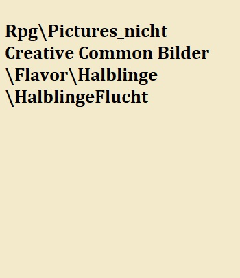

# Die Halblinge

> "Das erste, was mich die Halblinge gefragt haben, als ich stolz eine Großkanone präsentiert habe, ist, ob man sie auch umfunktionieren könnte, um Feuerwerke für verschiedene Feste abzufeuern."
>
> --- Strategoi der fünften Legion Alius Sulla

Die Halbinge von Orbis Astea sind ein eigentümliches Volk, das südlich des Herzlandes in Yondalla lebt. Diese kleinen Geschöpfe sind für ihre charismatischen Züge bekannt, da sie keine Schwierigkeiten haben, sich mit anderen Rassen anzufreunden. Einzige Ausnahme sind die Tiermenschen, denn jeder kultivierte Mensch sollte wissen, dass ein Tiermensch Stärke und einen guten rechten Handschlag mit über die meisten anderen Dinge stellt. Daher sollte es nicht überraschen, dass ein Halbling von der Größe eines Kindes einen schlechten ersten Eindruck hinterlässt. Halblinge haben jedoch keine allzu hohe Lebenserwartung, was dazu führt, dass sie häufig nervös sind und daher auch eine hektische Ausstrahlung haben können.

## Die Geschichte der Rasse

Aufgrund der Tatsache, dass Halblinge dazu neigen im Moment zu leben und insgesamt nicht allzu lang auf der Welt verweilen, ist nur sehr wenig über ihre Geschichte bekannt. Erst nachdem die Menschen, um 130 nach der Schlacht von Riga, zum ersten Mal mit ihnen in Kontakt kamen, wurden systematische Aufzeichnungen über sie und ihre Kultur angefertigt. 
Die einzigen Informationen vor dieser Zeit sind Gerüchte oder Geschichten, die mündlich von Halbling zu Halbling weitergegeben wurden. Wie immer bei Märchen ist es auch hier schwierig, verlässliche Informationen von erfundenen zu trennen. Eine Geschichte, die zumindest von vielen Ältesten Yondallas erzählt wird, ist die Geschichte, wie einige kleine Gruppen von Halblingen versuchten, die Gebiete nördlich von ihnen zu erkunden. Diese wurden jedoch nie wieder gesehen und diejenigen, die es zurückgeschafft haben, erzählten, wie ihre Brüder von den Orks als leckere Zwischenmahlzeit verspeist wurden. Diese Geschichten werden noch heute von Eltern als Schauermärchen an ihre Kinder weitergegeben, besonders, wenn sie sich nicht angemessen verhalten. 

Die Landwirtschaft war schon immer ein großer Teil der Kultur der Halblinge, was sich - als der Kontakt mit dem Kaiserreich begann - für alle Beteiligten als sehr vorteilhaft herausgestellte. Da sich das Volk der Halblinge primär auf die Landwirtschaft konzentriert und anderen Bereichen, wie Schmiedekunst und Handwerk, weniger Bedeutung beimisst, kam es in der Vergangenheit weniger zu großartigen Innovationen, da ihnen schlichtweg die Mittel dazu fehlten. Hinzukommt, dass die Halblinge stets auf schnellen Erfolg abzielen, weshalb es nicht in ihrer Natur liegt langfristige Projekte zu beginnen, die einen technologischen Fortschritt hätten begünstigen können. 
Mit Hilfe der Zusammenarbeit mit dem Kaiserreich wurden die Halblinge mit vielen neuen Technologien bekannt gemacht, die zu einer deutlich effizienteren Ernte führten. Daraus resultierend wurde eine neue Ära für Yondalla eingeleitet, welche auch als die Ära der Landwirtschaft beschrieben wird. 
In dieser Zeit vereinte [Endeldra](#Endeldra) die Dörfer Yondallas und setzte sich dafür ein, dass viele Ideen und Strukturen des Kaiserreichs eingeführt werden. Somit kam es zu einer Ausweitung der Felder und Dörfer. Darüber hinaus wurde auch die Hauptstadt Endeldor gegründet. 

Für die Halblinge schien sich alles optimal zu entwickeln, weshalb sich eine große Erleichterung innerhalb Yondallas ausbreitete. Aufgrund der neu gewonnenen wirtschaftlichen Stärke wurden manche Halblinge dazu motiviert ihr Dorf zu verlassen und ihre Fähigkeiten als Landwirt weiter im inneren des Herzlandes anzubieten. 

Diese Idylle sollte den Halblingen jedoch nicht allzu lange vergönnt sein, da sich die Armeen Eldrias dazu entschlossen in Yondalla einzufallen. Ziel dieser Angriffe war es die Nahrungsmittelexporte an das Kaiserreich zu unterbinden. 
Dieser Krieg, welcher zwischen dem Kaiserreich und Eldria ausgetragen wurde, hielt für lange Zeit an und sorgte dafür, dass der Ertrag Yondallas zunehmend vermindert wurde. 
Auch, wenn den Halbligen selbst kaum Einbußen durch die Angriffe entstanden, schmerzte sie der Gedanke sehr, ihrem neuen Verbündeten nicht zur Seite stehen zu können, da ihre militärischen Fähigkeiten lediglich zum Jagen wirklich ausreichten. 

Dennoch wurden einige Dörfer Yondallas von den Folgen des Krieges getroffen, da neu gewonnenes -, sowie bereits vorher besessenes Land durch die Kriege vollkommen verwüstet wurden. Dies lies ihnen keine andere Wahl als vorübergehend andere Felder zu bewirtschaften und ihren bisherigen Standort vorerst hinter sich zu lassen.

Die Halblinge waren für die Zusammenarbeit mit dem Kaiserreich äußerst dankbar, da ihnen viele Neuerungen gebracht wurden. Diese Dankbarkeit drückte das Volk nicht nur durch Tauschgüter aus. Auch die Integration der kaiserlichen Gepflogenheiten in den eigenen Alltag war ein Zeichen der Anerkennung. 
Aus diesem Grund fingen die Halblinge an den kaiserlichen Allgott anzubeten und vernachlässigten somit ihren Gott der Fruchtbarkeit. Diese Anpassung missfiel vielen Halblingen, da sie weiterhin für ihre Fruchtbarkeit danken und beten wollten. 
Dieser Wunsch rührt daher, dass Halblinge aufgrund ihrer, vergleichsweise, kurzen Lebenserwartung viele Kinder bekamen, sodass die Felder anständig bestellt werden konnten und die Familien über ausreichend Güter verfügten, um große Feste feiern zu können. 
Im Verlauf der Zeit blieben jedoch zunehmend die Erträge aus und viele Felder begannen brach zu liegen.

Dieser Umstand überraschte die Halblinge sehr, da es bisher nie dazu kam, dass so viele Felder auf einmal nicht mehr bewirtschaftet werden konnten. 
In einer kurzen Zusammenkunft beschlossen der Vertreter des Kaiserreichs, sowie die Ältesten der Dörfer Yondallas vorübergehend auf die Technologien der Halblinge zurückzugreifen, da angenommen wurde, dass es sich hierbei lediglich um eine Folge der neuen Technologien handele. Es schien naheliegend zu sein, dass sich im Umgang mit den neuen Technologien allgemein verschiedene Anpassungen in der Landwirtschaft ergeben müssten, dass der Prozess optimal verlaufen könnte. 
Die erhofften Anpassungen blieben jedoch aus, sodass mehr und mehr skeptische Stimmen der Halblinge laut wurden, welche anmerkten, dass dies mit dem Verbot zusammenhängt ihren Gott der Fruchtbarkeit, Celedor, anzubeten. 

## Die Gesellschaft der Rasse

Halblinge sind bekannt für ihre Liebe zu Konsumgütern, wie ausgefallenen Getränken oder feinem Käse. Sie schätzen Feiern, Musik und kulinarischen Genuss mehr als Krieg und Heldentaten, sind aber auch Geld und Habseligkeiten nicht abgetan.

Die Bewohner Yondallas neigen dazu, sich in kleinen Dörfern niederzulassen, da ihre entspannte Art dazu führt, dass große Industriebetriebe eine sehr ungewöhnliche Sache sind. Es wurde jedoch eine Großstadt gegründet. Endeldor - auch "Herz von Yondalla" genannt - verführt mit seinen großen Gewürzplantagen und Festen an jeder Ecke. Endeldor ist auch der einzige Ort in Yondalla, in dem Handel mit anderen Rassen im großen Stil durchgeführt wird.

In den kleineren Dörfern von Yondalla ist es üblich, dass das Volk einen Vertreter wählt. Dieser wird "Ältester" genannt und ist für die Kommunikation und den Handel zwischen seinem Dorf und anderen Dörfern, bzw. der Hauptstadt Endeldor, zuständig. Außerdem koordiniert er eine kleine Bürgerwehr zur Verteidigung und deren Kooperation mit den kaiserlichen Truppen.

Obwohl es in der Natur der Hablinge liegt, charismatische Züge und im Allgemeinen ein fröhliches Wesen zu zeigen, ist dies nicht bei allen in Yondalla der Fall. Manche Halblinge haben es auf sich genommen, das Land von Orbis Astea zu erkunden oder ihr Land vor Monstern und anderen bösen Kreaturen zu schützen. Diese Halblinge sind unter ihren Brüdern als "Griesgrämige" bekannt, da sich ihre Prioritäten von der sorglosen Standard-Kultur deutlich unterscheiden.

### Völkerbeziehungen

Aufgrund der geographischen Lage von Yondalla waren die Halblinge nur sehr selten in irgendeine Art von Kriegsführung verwickelt. Dies liegt vor allem daran, dass nur zwei andere Rassen direkten geographischen Kontakt mit Yondalla haben - das Kaiserreich im Norden und einige Goblinstämme im Westen. Obwohl die Halblinge zunächst schlecht gegen die Goblinstämme ankamen, dauerte es nicht lange, bis sie erkannten, dass sie mit etwas charismatischen Witz die Spannung zwischen den beiden Rassen lockern konnten. Auch wenn Goblins als Geschöpfe bekannt sind, die nicht gut mit anderen fühlenden Wesen zurechtkommen, ist es den Halblingen gelungen fast hundert Jahre lang jährlich eine Feier zu veranstalten, um ihre Wertschätzung für das andere kleine Volk Aesteas zu zeigen. 

Das Kaiserreich fungiert seit Beginn des Handels zwischen den beiden Gruppen als der große Bruder von Yondalla. Als Zeichen der Anerkennung für den Schutz, den die Soldaten des Herzlandes den Halblingen von Yondalla vor wilden Kreaturen und anderen Bedrohungen gewährt haben, fand ein Handel mit feinsten Gewürzen und Kräutern statt, die direkt im Herzen von "Endeldor" angebaut wurden. Diese Zutaten werden von den Adligen, von Civis Primae und anderen großen Haushalten in den umliegenden Regionen gern konsumiert und sind bei anderen Rassen als wahrer Genuss bekannt, außerhalb des Herzlandes und Yondalla sind sie aber nur selten zu finden. 

Obwohl Halblinge als die fröhliche Rasse in Orbis Astea angesehen werden, gibt es die Griesgrämigen, die dafür sorgen, dass es auch bei den Halblingen Charaktere gibt, die einiges erleben. Dadurch, dass die Griesgrämigen nicht die unschuldigen Freuden des Lebens suchen, haben sie die Möglichkeit, das allgemeine Vertrauen, das viele andere Rassen in sie setzen, zu missbrauchen. Manche sehen dies als Chance und heuern sie für spezifische Aufgaben wie Infiltration oder Überzeugungsarbeit bei anderen Adelsfamilien oder Unternehmen an. 

Aufgrund der Tatsache, dass Halblinge oft nicht verdächtig erscheinen, haben sich viele der Griesgrämigen in die Reihen des kaiserlichen Geheimdienstes und der Spione des Kaiserreiches eingereiht. Diese Halblinge haben das Kaiserreich schon häufig auf bedeutsame Weise zu unterstützt. Sie trugen beispielsweise dazu bei, die Armeen Eldrias davon zu überzeugen, dass die Hauptstreitmacht ihrer Feinde auf Austen marschierte. Durch diesen Akt der Überzeugungsarbeit verlor Eldria den Krieg, was auch dazu führte, dass manche eldrische Adelige Halblingen nicht besonders wohlgesonnen sind.  

## Die Religion der Rasse

Da die Halblinge ihren Fokus auf das Feiern und die Landwirtschaft legen... Gott der Fruchtbarkeit

### Totenkult

Aufgrund der langen Lebensdauer und der geringen Anzahl von Kämpfen, an denen das Rennen teilnimmt, ist es sehr ungewöhnlich, dass in Yondalla eine große Zahl von Halblinge gleichzeitig sterben. Für die Halblinge, die zufällig sterben, findet jedoch ein großes Fest statt, bei dem sich das ganze Dorf versammelt, um das lange Leben ihres verstorbenen Freundes zu feiern. Die Leichen werden in einem riesigen Feuer in Brand gesteckt, um das die Halblinge herumtanzen und ihre traditionellen Lieder singen. Somit ist der Tod eines Halblings für sein Dorf kein Grund zum Trauern, sondern wird als Anlass zum Feiern seines Lebens gesehen. 

## Die Legenden der Rasse

Endeldra war der Gründer von Endeldor und derjenige, der die anfängliche freundschaftliche Kommunikation mit dem Kaiserreich übernahm. Außerdem war er derjenige, der die meisten Dörfer von Yondalla vereinte. In Endeldor benutzen die Leute das Wort Endel, um "text"

## Die Eigenbegriffe der Rasse

**ironvale**: Dorfvertreter

**Bror**: Übersetzt bedeutet dieses Wort großer Bruder, denn die menschliche Rasse weist viele physische Ähnlichkeiten mit den Halblingen auf, abgesehen von der größe. Aufgrund der Tatsache, dass das Kaiserreich sie vor den meisten Feinden beschützt hat, haben viele Halblinge begonnen, Menschen als ihre großen Brüder zu bezeichnen, um so ihre Wertschätzung für ihre Nachbarn zu zeigen.

**Endel**: word for cheers, which Haflings use to show appreciation for Endeldra

**Griesgrämig**: Haflings that have chosen an alternative and more aggressive lifestyle, such as fighting monsters or other races. 

## Individuelle Eigenschaften der Halblinge

Unsuspected: Aufgrund ihres unschuldigen und charismatischen Charakters und ihrer geringen Größe werden sie sehr oft von den meisten Menschen beaufsichtigt. Dies kann dazu benutzt werden, um andere zu beschleichen oder davon zu überzeugen, dass sie nichts Böses getan haben.

## Änderungen: 

* Schnelllebig, hektisch
* leben auf pump, alles auf kurzfristigen Erfolg ausgelegt
* demokratische leader alle 1 jahre neuwahl machen viel kurzfristigen scheiß
* Boden wird ausgebeutet, sodass es zu unfruchtbarem Boden kommt und hier nicht mehr gepflanzt werden kann
* Nervös, weil wirklich kurzlebig --> schneller Stoffwechsel (work hard & play hard)
* Gott der Fruchtbarkeit
* Halblinge auch durch Glauben an den Gott der Fruchtbarkeit so hohe Geburtenrate, Verbot durch Kaiserreich führt zu Rückgang der Geburtenrate und zu unfruchtbaren Feldern --> Daher wurde der Gott der Fruchtbarkeit als Heiligen in den Glauben des Allgotts aufgenommen 
* Felder schneller brach, da zum einen neue Technologien den Ertrag erhöhen konnten und zum anderen der Glaube an ihren Gott untersagt wurde, der ihnen die ertragreichen Ernten bescherte.

* Planting Kalender Hintergrund Pergament ändern

