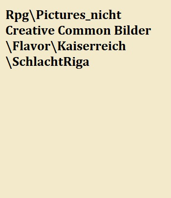
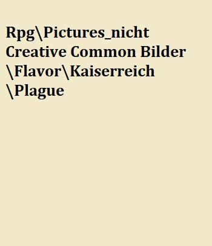
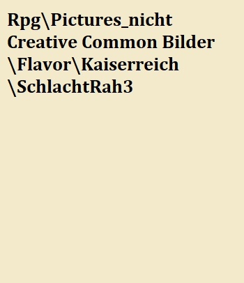

# Das Kaiserreich {#Kaiserreich}

Das Kaiserreich ist das größte Reich in der bekannten Welt. Primär ein menschlich dominiertes Reich, erstreckt sich das Kaiserreich vom Himmelsspitzengebirge im Süden bis zum Eisland im Norden. Es hält Eldria besetzt und hat Yondalla als ein Protektorat. 

Das Kaiserreich besteht seit 426 Jahren und der momentane Kaiser, Licinius Proximus, ist seit 10 Jahren an der Macht und hat das Reich trotz seines jungen Alters relativ fest in der Hand. 

Obwohl der Kalte Krieg mit den Rah Kari und die Aufstände in Eldria dem Kaiserreich zusetzen sieht es sich selbst noch immer als die mächtigste Fraktion auf der Karte.

## Die Geschichte des Kaiserreichs {#GeschichteKaiser}

### Die Vorgeschichte - Nors und das Herzland

Vor dem Kaiserreich wurde das Gebiet von Adeligen beherrscht, die ähnlich wie der Adel in Eldria ihr Gebiet quasi absolutistisch beherrscht haben. 
Nors und das Herzland - die beiden Hauptgebiete des Kaiserreichs - haben schon früh begonnen miteinander Handel zu treiben. Das liegt hauptsächlich daran, dass im kargen Nors wenig Landwirtschaft möglich ist, Nors jedoch im Gegenzug dafür eine Menge an Metall liefern kann, welches im Herzland eher selten zu finden ist. 
Durch diese Handelsbeziehungen profitierten vor allem grenznahe Fürstentümer, allen vorran Riga, die Zölle von Händlern erheben konnten.

Auch die Ekklesiarchie, welche zu der Zeit im Herzland schon relativ organisiert war, profitierte von den neuen gemeinsamen Straßen und der Infrastruktur, die durch den Handel entstanden. In mehreren Wellen wurden Missionare ausgeschickt um das Wort des Allgotts zu verbreiten. Durch den Einsatz der Missionare wandten sich nach und nach viele Einwohner von Nors dem Allgott zu. Ein großer Einflussfaktor war selbstverständlich, dass nach den Riten des Allgotts bestattete Tote zumeist tot blieben, wenn ihre Grabstätten nicht gestört wurden.   

### Der Anfang des Reichs

Das Kaiserreich wurde vor 426 Jahren gegründet. Es entstand aus einer Konföderation der schon länger kooperierenden Ministaaten einiger Adeliger aus den Regionen Nors und dem Herzland. Aus dieser erwuchs - dank den produktiven Mienen Nors und den fruchtbaren Feldern des Herzlandes - schnell eine militärisch und wirtschaftlich starke Nation. Adelige und deren Gebiete, die bis dahin noch kein Teil der Konföderation waren schlossen sich ihr bald, entweder freiwillig oder unfreiwillig, an - wobei letztere Titel, Ländereien und Reichtümer verloren. 

Der letzte Widerstand des regionalen Adels wurde in der Schlacht von Riga niedergeschlagen, als eine vereinigte Armee des rebellischen Adels unter der Führung von Manilius Thrax der Armee der Konföderation unter Virius Proximus - dem Caesarius Unificatorus - unterlag. An diesem Tag rief sich Proximus selbst zum Kaiser aus und gestaltete die Konföderation zum heute bekannten Kaiserreich um. Riga wurde die Hauptstadt des Kaiserreichs.

Obwohl der Adel anfangs stark gegen Proximus Neuerungen - die mit großem Machtverlust ihrerseits einhergingen - protestierte, überzeugte die unerschütterliche Loyalität, die die Armee gegenüber ihrem Kaiser aufgebaut hatte sie schnell davon, dass einlenken die klügste Option war. Die Folgen davon sind bis heute zu spüren: Während in Eldria der Adel bis heute das Heft in der Hand hat, ist der Adel im Kaiserreich weit weniger mächtig und meistens nur Aufgrund monetären Besitzes noch in Machtpositionen stärker vertreten als das gemeine Volk.

> "Sie werden schreiben das Reich sei durch Verträge und Verhandlungen entstanden, aber ihr wisst es besser, Militates! Denn euer Stahl und euer Blut sind es, die dieses Reich erschaffen haben und am Leben halten werden!"
>
> --- Virius Proximus - der Caesarius Unificatorus - in seiner Rede nach der Schlacht von Riga

Nach der Schlacht von Riga hat das Kaiserreich erst einige Jahre gebraucht um sich vom blutigen Bürgerkrieg zu erholen, neue Institutionen zu erschaffen und die Verwaltung des Landes aufzubauen. Zu oft musste der ungestüme Kaiser lernen, dass sich nicht jedes Problem mit einer Legion lösen lässt. Hungersnöte, Krankheiten und die Erweckten machten dem logistisch schlecht organisiertem jungen Reich schwer zu schaffen. Durch den Krieg sind viele Männer gestorben, die gebraucht wurden um Ernten einzubringen und Familien zu ernähren. Dieser Mangel an Arbeitskraft machte sich schnell bemerkbar. 
Auf diese neuen Probleme reagierte Kaiser Proximus so, wie man es hätte erwarten können. Anstatt seine Legionen zu verkleinern und auf Arbeiter statt Soldaten zu setzen ließ er sie antreten, formieren und startete den Feldzug der als ["Die Entwurzelung"]() in die Geschichte eingehen sollte.

### Die Versklavung der Elfen 

Der Pontifex Maximus der Ekklesia gab im Jahre 17 nach der Schlacht von Riga ein Postulat zum Umgang mit anderen Rassen aus,
3 Jahre später wurde dieses Dokument von der kaiserlichen Regierung als Vorwand zur Unterwerfung sämtlicher Elfenreiche im kaiserlichen Einflussgebiet benutzt.

> "Der Elf an sich ist ein schwaches Wesen, das zeigt schon die Statur. Seine größte Schwäche ist aber der schwache Wille. Ein Elf ist nicht in der Lage Entscheidungen alleine zu treffen, noch ist er befähigt logisch zu denken. Das beste für den Elfen wäre es, er müsste dies nicht mehr tun."
>
> --- Der Pontifex Maximus in "De ceterius Gentibus"

Die kaiserliche Armee war gut ausgerüstet, ausgebildet und bestand zum großen Teil aus Veteranen des Bürgerkriegs. Ihnen gegenüber standen zahlenmäßig unterlegene Elfen, die meist ohne Kampferfahrung mit Werkzeugen statt Waffen ins Feld ziehen mussten. Jahre des Friedens hatten sie nicht gerade gut vorbereitet auf das, was sie erwarten würde.
Da die Elfen weder Zeit hatten sich mit anderen Waldreichen zu konföderieren, noch dies in ihrer Natur liegt, traten sie den Armeen des Kaiserreichs einzeln gegenüber. 

In den folgenden 10 Jahren wurden die Elfen Wald für Wald unterworfen, daher gibt es heute kaum mehr Waldelfen im Kaiserreich, da nur die wenigsten der Armee entkommen konnten. 
Nach den ersten Massakern (als Schlacht könnte man das beim besten Willen nicht bezeichnen) gaben die meisten Elfenreiche schnell klein bei und unterwarfen sich der Armee. Andere hielten etwas länger durch, nur um schlussendlich auch das Knie zu beugen. 
Sie wussten nicht, dass sie damit den Verlust ihrer Kultur und ihrer Idendität langfristig besiegelt hatten, die kaiserliche Armee nahm die gefangenen Elfen als Sklaven, brachte sie in die Städte und auf die Felder des Reichs und gründete somit die Rasse und Kultur der [Stadtelfen](#StadtElfen). Mit ihnen entstanden auch die Gesindeviertel bzw. die Unterstadt in Civis Primae (damals noch Civis Nova).

### Die Goldenen Jahre

Die nächsten 100 Jahre liefen sehr gut für das Kaiserreich, die territoriale Ausdehnung setzte sich fort, bis das Kaiserreich an den Silva Nacia im Süden und an das Eisland im Norden grenzte. 
Wirtschaftliche Stabilität und Frieden waren für diese Zeit charakteristisch und die Anzahl der Legionen wurde von 17 auf 6 verringert. Stabile Verträge mit den Grenzgrafen Eldrias erlaubten ein relativ ruhiges Leben sogar an der Grenze. 

In den goldenen Jahren des Kaiserreichs begann das Reich, seine Grenzen auszudehnen, wo immer es konnte und in dieser Zeit fanden die ersten Expeditionen ins Eisland statt. Vor dieser Zeit waren die Menschen, die in der als Herzland bekannten Region lebten, nicht daran interessiert, die kalte Einöde von Eisland zu erforschen. Sie dachten, dass man nichts durch die Besiedlung eines, für Menschen ungeeigneten, Lebensraums gewinnen könne. In der Region Nors jedoch, wo sich die Menschen an das Leben in einer kälteren Umgebung angepasst hatten, wurden mehrere Expeditionen ins Eisland unternommen. Diese waren jedoch alle nur von kurzer Dauer, da es keiner Expedition gelang, weit ins Eisland vorzudringen, bevor sie mit einem der gefährlichen Monster des Eislandes Bekanntschaft machten. Erst nach der Gründung des Kaiserreichs wurden Ressourcen in eine weitere Expedition des Eislands gesteckt, die von einem Abkömmling der Familie Thrax - Argenius - geleitet wurde. Viele Leute hielten den unerfahrenen Argenius für ungeeignet, die neu gegründete Expedition zu leiten, aber aufgrund der vielen militärischen Errungenschaften und des Einflusses der Familie Thrax wurde ihm die Erlaubnis erteilt, die Expedition ins Eisland zu leiten.

![Argenius in Eisland[^FritzVicariBalticSea]](Pictures/Flavor/Animali/by_fritzvicari_ArgeniusImEisland.jpg)

Im Gegensatz zu den vielen Expeditionen vor ihm, war Argenius mit genügend Ressourcen und Arbeitskraft ausgestattet, um weiter ins Eisland vorzudringen, als jeder Mann vor ihm. Nach Wochen und vielen getöteten Bestien hatte das Expeditionsteam schließlich die erste Begegnung mit den Animali. Diese erste Begegnung zwischen den beiden Rassen sollte jedoch nicht friedlich verlaufen, da die Arroganz und die Unerfahrenheit Argenius die Animali als nichts anderes sehen lies als eine unintelligente Gruppe von Monstern, die zwischen ihm und seinem Ruhm standen. Und alsbald er die Animali sah, gab er seinen Truppen das Signal zum Angriff. Infolge seiner Handlungen löste er den Beginn dessen aus, was wir heute als den [Animali-Kontaktkrieg](#AnimaliKontaktKrieg) kennen. Obwohl die Animali zahlenmäßig unterlegen waren, hatten sie den Vorteil, auf eigenem Territorium zu kämpfen. Nicht lange nachdem die Kämpfe begonnen hatten, ordnete Argenius den Rückzug seiner Truppen an. Bei seiner Rückkehr ins Reich wurde Argenius - der seine Männer in den Tod geführt und seine Aufgabe, die Regionen von Eisland zu erforschen nicht erfüllt hatte  - degradiert und seiner militärischen Titel enthoben. 

In den folgenden Jahren fanden viele Scharmützel zwischen Animali und den entferntesten Außenposten des Reiches statt, und erst nachdem der Animalus Valsak als führender Schamane gewählt hatte, kam es zu friedlichen Auflösungen zwischen den beiden Rassen. 

Nach dem Ende des Kontaktkrieges der Animali wurde die Idee von Handelsabkommen als Lösung zur Stabilisierung der zerbrechlichen Beziehungen zwischen den Rassen ins Gespräch gebracht. Obwohl bei den ersten Handelsgeschäften zwischen Herzland und Eisland viel Unbehagen herrschte, führte dies zu einem Ende der Spannungen zwischen den Rassen und schließlich dazu, dass das Imperium mit den Animali gute Beziehungen schuf.

Des weiteren schaffte es der damalige Kaiser, Dorocletian Secundus, das landwitrtschaftlich enorm ertragreiche Gebiet [Yondalla](#Yondalla) unter sein Protektorat zu bringen. 

Aufgrund der sehr guten wirtschaftlichen und polititschen Lage - und Druck aus der Ekklesia, die inzwischen ihre Position gegenüber der Sklaverei der Elfen geändert hatte, wurde die Sklaverei in diesen Jahren ebenfalls von Dorocletian abgeschafft. Viele Stadtelfen bezeichnen ihn bis heute dafür noch als "einen der wenigen guten Kaiser".

### Die Strafe des Allgotts {#SchleifungRiga}

Nach dem Tod von Dorocletian durch die Hand seines Zweitgeborenen Nematus Dorocletianus kamen die "Goldenen Jahre" - nach heutiger Lehrmeinung - zum Ende. 

Viele einflussreiche Kommandeure und Würdenträger wollten den Kaisermörder nicht selbst zum Kaiser machen und zogen gegen ihn ins Feld. Der daraus resultierende Bürgerkrieg wurde zur Zerreißprobe für das Reich.
Nach 3 Jahren Bürgerkrieg und daraus resultierende Hungersnot wurde Nematus im belagerten Riga von seiner eigenen Leibgarde verraten und getötet. Diese erstmals gute Nachricht kam jedoch mit üblen Folgen: Es gab keinen legitimen Erben für den Thron.
Bereits am nächsten Tag zerfiel die Koalition aus Legaten und Edelmännern in Fraktionen, die nur versuchten ihre eigene Macht auszubauen und zu festigen. Bürgerkrieg folgte auf Bürgerkrieg.

Durch den Bürgerkrieg im Kaiserreich wurden Grenzen und Beziehungen mit anderen Staaten grob vernachlässigt, dies führte zur ersten eldrischen Invasion. Der Lord von Aerlham - Thedisius VI. - formte eine Koalition mit Hasting und Austen und fiel mit einer Armee ins kaiserliche Grenzland ein. Allein die dritte Legion stellte sich ihm entgegen - eine Tat für die sie noch immer den Namen "Protectoria Patria" hält - und erlitt eine empfindliche Niederlage. Fast vollständig vernichtet brachte alleine der heldenhafte Einsatz einer Zenturia aus Nors die Überlebenden der Schlacht und die Standarte der Legion in Sicherheit.

Die erste Tat der Eldrier war die Annexion Yondallas und damit die Einstellung sämtlicher Lebenmittellieferungen ans Reich.
Da viele Felder des Herzlandes durch den Bürgerkrieg zerstört waren und Yondalla die einzige verlässliche Quelle an Lebensmitteln darstellte folgte eine große Hungersnot und sogar manche Adelige schafften es nicht jeden Tag genug auf den Teller zu bekommen um ihre Familien zu ernähren.

> Spürt ihn! Spürt den Zorn des Allgotts! Unsere Handlungen und unsere schändliche Hochmut hat uns in den Ruin getrieben! Tut Buße vor dem Allgott!
>
> --- Auszug aus "dem Palmphlet des Straßenpriesters" von 340 nach der Schlacht von Riga 

Auf den Hunger und den Krieg folgte allerdings was weit schlimmeres: Eine Krankheit, die als "Irae Omdideus" bekannt wurde, streckte ihre Finger durch das Reich. Bereits in den ersten Monaten verstarben mehr Menschen an der Krankheit als die Ekklesiarchie begraben konnte. Geschätzt sind der Krankheit bis sie  zu wüten aufhörte 3 von 10 Menschen zu Opfer gefallen, allen vorran Greise und Kinder. 
Die Krankheit hatte allerdings zwei "positive" Effekte für das Kaiserreich: Die Armee der Eldrier zog sich aus Angst vor der Krankheit schnell zurück hinter die Grenze. Außerdem hatten die machthungrigen Fraktionen im Kaiserreich nicht mehr genug Soldaten um sich zu bekämpfen. Es wurde ruhig im Reich.

Diese Ruhe nutzte ein aufstrebender Strategoi namens Lucillus Prodius, um Allianzen zu schmieden und die Stategoi der zweiten und vierten Legion hinter sich zu versammeln. Er selbst führte die fünfte Legion. Mit drei von fünf verbliebenen Legionen schaffte er es, eine größere und schlagkräftigere Armee als seine Kontrahenten unter sich zu vereinen.

Im Lichte dieser neuen Entwicklungen und des schlechten Zustands des Reiches schaffte es Lucillus alle einflussreichen Fraktionen des Reichs zu Friedensverhandlungen zu überzeugen. Diese sollten in Riga stattfinden und jeder Teilnehmer schwor Waffen- und Gewaltfreiheit, die Ehrung des Waffenstillstandes und mit nicht mehr als 30 Männern unter Waffen anzureisen.

Die Friedensverhandlungen kamen nach 3 Wochen zu Ergebnissen. Die Fraktionen einigten sich auf einen neuen Kaiser namens Flavius Servarius. Im Gegenzug dafür wurde den Regionalherrschern mehr Autonomie und Macht zugesichert - auch das Recht auf eigene Streitkräfte und Innenpolitik. Lucillus wurde als "der Friedensbinger" gelobt. Zum Abschluss der Verhandlungen wurde in der ganzen Stadt bis tief in die Nacht wild gefeitert - die Zeiten würden besser werden! Weder die nun unachtsamen, betrunken und ausgelassen feiernden Wachen und Einwohner Rigas, noch die Edelmänner der verhandelnden Fraktionen bekamen mit, wie die fünfte Legion in der Nacht vor der Stadt aufmarschierte.

Mit diesem Schritt des "Friedensbringers" Lucillus hatte keiner gerechnet. Die fünfte Legion kam über die Stadt wie ein Sturm über ein Schiff zur See. Noch bevor man in Riga wusste was passierte, wurden die Mauern erstürmt. Schreie und Flammen überzogen die Stadt. Die fünfte Legion legte die Stadt in Schutt und Asche. "Die Schleifung Rigas" war gekommen. Diejenigen, die nicht von Soldaten massakriert wurden, starben durch den Rauch oder die Flammen, man sagt, dass man das Hauptforum nicht überqueren konnte ohne über mehrere Leichen zu fallen - und das Blut der Leute, die dumm genug waren in die Ekklesia zu fliehen, so hoch auf dem Kirchenboden stand, dass man bis zu den Knien darin watete.
Lucillus höchstselbst führte eine Kohorte in den Kaiserlichen Palast und tötete den neuen Kaiser, sowie alle nicht ihn unterstützenden Machthaber. Als die Sonne über der zerstörten Stadt wieder aufging war er - Lucillus Prodius - der unangefochtene Kaiser des Reichs. Der Vertrag von Riga wurde genauso wie Riga selbst für nichtig erklärt. Die knapp 55000 Einwohner Rigas erlebten diesen Tag nicht mehr.

Kaiser Lucillus zog mit seinen Truppen nach Civis Nova und machte sie zur Hauptstadt des Reiches - zu Civis Primae. Er etablierte eine neue Dynastie und erhöhte die Anzahl der Legionen stark. Bürger wie Elfen wurden zum Wiederaufbau des Reiches teilweise in Zwangsarbeit genommen.
Nachdem die Gefahr durch die Krankheit vorrüber war versuchte Thedisius VI. von Aerlham wieder Yondalla für sich zu beanspruchen. Dieses Mal stieß er auf 8 bis an die Zähne bewaffnete Legionen unter Lucillus I. - weder Theodisius noch seine Armee überlebten ihre Expedition. Man sagt sich Lucillus ließ ihre Köpfe von Karren bis nach Aerlham bringen. Für die Rettung des Reichs erklärte die Ekklesia ihn zum "Restitutor Orbis" - dem der die Ordnung der Welt wiederherstellte.

Lucillus Dynastie überdauert bis heute und der momentane Kaiser Licinius Proximus entstammt seiner Linie. Unter dieser Dynastie kam das Reich wieder zu kräften, allerdings war der Preis dafür ein hoher.

### Die Eroberung Eldrias

Im Jahre 408 kam es zu einer bahnbrechenden Erfindung in der Militärgeschichte des Kaiserreichs - der Großkanone. Diese mächtige Waffe war in der Lage Mauern sowohl aus Stein, als auch aus Soldaten zu vernichten. 

Der junge Kaiser Licinius Proximus, der erst kürzlich den Thron bestiegen hatte und allen seine Stärke demonstrieren wollte erkannte das Potential dieser Waffe sofort. Nach knapp einem Jahr Vorbereitung zog er mit 243 gefechtsbereiten Großkanonen und 15 seiner 22 Legionen nach Eldria.

Eldrias Adelige reagierten schnell, sie wussten dass ein Angriff der Kaiserlichen bevorstand und die Landsknechte Eldrias standen Soldaten des Kaiserreichs in nichts nach. Als Kaiser Licinius Proximus in Eldria ankam hatten die eine Armee versammelt die sogar das kaiserliche Aufgebot zahlenmäßig übertraf. Fast alle Fürstentümer Eldrias hatten ihre Soldaten geschickt - ein farbenfrohes Meer aus Lanzen Rüstungen und Flaggen - in einer offenen Feldschlacht den Kaiserlichen mehr als ebenbürtig.

Dem jungen Kaiser Proximus war die Stärke seines Feindes bewusst, daher sand er fünf Kohorten unter einem Strategoi aus um Austen anzugreifen und dort möglichst viel Chaos anzustiften - ein Köder. 
Die Eldrier schluckten den Köder der ihnen hingeworfen wurde. Fest davon ausgehend, dass es sich dabei um die Hauptstreitmacht der Kaiserlichen handelte, marschierten sie nach Austen, um Proximus Armee zu stellen. Auf halbem Wege erfuhren sie, dass Proxiumus die Belagerung Aerlhams begonnen hatte.

Nachdem es wenige strategisch bessere Situationen gibt, als einer feindlichen Armee während einer Belagerung in den Rücken zu fallen, machte die Armee Eldrias sofort kehrt und marschierte auf das belagerte Aerlham, sie würden dem jungen Kaiser schmerzvoll beibringen wie man eine Armee führt. In ihrer Siegesgewissheit liefen sie genau in die Falle von Proximus.
Wer Großkanonen noch nicht im Einsatz gesehen hat versteht nicht, wieso diese Stahlrohre so gefürchtet sind. Gegen Infanterie nimmt man zwei kleine durch eine Kette verbundene Kugeln und schießt sie mit voller Wucht in die gegnerischen Reihen. Die Kugeln durchbrechen beinahe jede Formation und hinterlassen einen Haufen aus abgetrennten Gliedmaßen. 
Proximus hatte seine Kanonen genau so positioniert dass sie den Eldriern in die Flanke schießen konnten. Da er die Falle gestellt hatte wusste er von wo die eldrische Armee kommen musste und angreifen würde. Seine Vorhersage erwieß sich als korrekt.
Siegesgewiss stürmte die eldrische Armee in Richtung der vermeintlich verletzlichen Kaiserlichen Armee - nur, um sich im Kreuzfeuer der 243 Großkanonen wiederzufinden. Noch nie in der Geschichte der Welt wurde eine so große Armee so schnell vernichtet. Auf Seiten der Eldrier Starben 75000 Menschen, die Kaiserlichen verloren gerade einmal 4000 bis die Eldrier kapitulierten. 

> "Das war keine Schlacht, das war ein Verbrechen. Woher hätten wir wissen sollen was diese Teufelsgeräte können? Ich werde den Anblick nie vergessen, wie meine Kameraden neben mir zerfetzt wurden."
>
> --- Eldrischer Überlebender der Schlacht von Aerlham

Proximus besetzte Aerlham und benannte es um in Civis Principes. Er stellte ein kaiserliches Truppenkontingent in jedem Fürstentum in Eldria ab und ließ Festungen für seine Truppen errichten. Er plünderte die Schatzkammern der Fürstentümer und ließ zwei Legionen in Gent abstellen. 

Obwohl das Kaiserreich Eldria heute besetzt hält, hat es nicht die Mannstärke, um wirkliche Kontrolle zu erlangen. Es schafft es die Hauptstraßen und die Hauptstädte unter Kontrolle zu halten, das ist jedoch auch schon die Grenze des Möglichen. Viele Militärberater haben dem Kaiser deswegen empfohlen sein Prestigeprojekt abzubrechen und die Besatzung zu beenden, dieser will davon allerdings nichts hören. 
Doch in Eldria regt sich der Widerstand - noch aktiver seit dem Großen Krieg.

### Der große Krieg {#KaisGroKrieg}

3 Jahre nach der Besetzung Eldrias schlugen die Rah Kari los. Das seltsame Wüstenvolk fühlte sich alsbald vom expansiven Kaiserreich bedroht. Dieser Krieg sollte auf eine dem Kaiserreich gänzlich unbekannte Weise gefochten werden. 

Ohne formale Kriegserklärung begannen die Rah Kari einen Krieg an zwei Fronten. Ihre Hauptstreitkraft durchquerte im Jahre 858 die Knochenfeld-Schlucht und fügte der nichtsahnenden 13. Legion schwere Verluste zu sie, die sie bis an die Reik zurückfallen ließen.
Zum Glück für die 13. Legion hatten sich in Nors bereits fünf andere Legionen eingefunden, die - nachdem dem Kaiser bewusst wurde was geschehen war - hastig zur Verteidigung des Reiches abgestellt wurden. Der Kaiser selbst übernahm das Kommando über die nördliche Streitkraft und ließ nach weiterer Verstärkung senden. 

Obwohl der Kaiser zahlenmäßig unterlegen war suchte er den Kampf, doch egal welche strategischen Tricks er anzuwenden versuchte, er schaffte es nicht die Rah Kari zu täuschen. Sie schienen zu jedem Zeitpunkt genau zu wissen wie es um Truppenbewegungen, Nachschubslinien und Versorgungssituation der Armee bestellt war. Sie verstanden es immer genau dort zuzuschlagen wo die kaiserliche Armee am schwächsten war, und so verlor die Armee, obwohl die kaiserlichen Soldaten denen der Rah Kari weit überlegen waren, Scharmützel um Scharmützel. Nachschublieferungen wurden immer öfter Ziel für Überfälle durch die Rah Kari und bald war die Ressourcensituation der Streitkraft in Nors so schlecht, dass großere Aktionen nicht mehr möglich waren. Die Streitmacht der Rah Kari umkreiste sie, wie ein Aasgeier ein sterbendes Tier. 

Doch auch das Informationsnetz der Rah Kari war nicht Fehlerfrei. Tullius Agrepios - der Strategoi der überbleibsel der 13. Legion schaffte es der Streitmacht der Rah Kari nach einem Plünderzug in Nors den Rückweg abzuschneiden, indem er die Brücke zum Knochenfeld besetzte. Diese Chance nahm die große kaiserliche Armee wahr und fiel den Rah Kari von Nors aus in den Rücken. Und obwohl Agrepios und die gesamte 13. Legion an dieser Brücke fielen war es doch ihr Opfer, das dazu führte, dass die Armee der Rah Kari das erste mal schwere Verluste einstecken musste. Die Rah Kari zogen sich noch im selben Jahr durch die Schlucht zurück, um Verstärkung zu holen und einer vollständigen Vernichtung ihrer Armee vorzubeugen.

Das Kaiserreich machte den Fehler den Rah Kari direkt nachzuziehen und stellte fest, dass die Rah Kari auf ihrer Seite der Knochenfeld-Schlucht eine mächtige Verteidigungsanlage errichtet hatte. In der folgenden Schlacht verlor das Reich zwei Legionen und zog sich zurück, um auch auf ihrer Seite der Schlucht eine Festung zu errichten. Die Festung wurde zu Ehren des Strategoi der 13. Legion "Obex Agrepios" genannt.

Dadurch, dass der Weg durch die Schlucht nun auf beiden Seiten "zu" war kam es - nach ein paar weiteren Versuchen mit starken Verlusten auf beiden Seiten - zu einem Ende des Krieges an dieser Front.

Die andere Front entstand in Eldria. Zeitgleich mit dem Einfall in Nors setzte eine kleinere, sehr kavallerielastige Armee ins besetzte Eldria über. Die kaiserlichen Soldaten, die bereits mehr als genug Probleme mit aufständigen Eldirern und marodierenden Elfen, Orks und Banditen hatten, waren von der, sie koordieniert, attackierenden Armee schnell absolut in die Enge getrieben. Zugleich schwangen sich - unterstützt vom Geld der Rah Kari - mehrere Regionale Fürsten gegen die kaiserliche Besetzung auf. 

Eingekesselt von verschiedenen Gefahrenquellen verbarrikadierten sich die kaiserlichen Truppen in den Städten, während ihre Feinde über Kontrolle über alles außerhalb der Städte rangen. Viele kaiserlich gehaltene Städte wurden belagert und kapitulierten - die Gefangenen wurden schlimmstenfalls von Eldriern exekutiert oder von den Rah Kari versklavt. Einzig die Brigaden in Gent und Aerlham hielten - dank der Großkanonen - der Belagerung stand, wobei Aerlham von den Eldriern und Gent von den Rah Kari belagert wurde.

Nach einem Jahr kam Verstärkung aus dem Kaiserreich. Der Onkel des Kaisers - Arminius Prodius - versammelte 8 Legionen um sich und fiel über die rebellierenden Eldrier her. Ihre Armeen wurden schnell zerschlagen, da sie zahlenmäßig unterlegen und schlechter ausgebildet waren als die kaiserlichen Legionen. 
Nachdem Aerlham gesichert war machte sich Prodius nach Gent auf um die Belagerung der Stadt durch die Rah Kari zu beenden.

Als die Gefangenen der Rah Kari - die nach Süden transportiert werden sollten, um dort als Sklaven zu dienen - von Arminius Prodius Verstärkung erfuhren fassten sie neuen Mut. Ein Soldat namens Georg Handler schaffte es sich und ein paar Kameraden zu befreien und mit ihnen eine Gruppe Wachen zu überwältigen. Schnell schaukelte sich die Situation zu einem handfesten Gefangenenaufstand hoch. Die Armee der Rah Kari wurde dadurch genug verlangsamt, dass sich für die Brigade aus Gent und Prodius Armee eine Chance für einen fast simultanen Angriff ergab. 
Die Armee der Rah Kari wurde vernichtend geschlagen.

Mit der Niederlage der Rah Kari kehrte allerdings keine Ruhe ein, bis heute versucht das Imperium die Grenze am Nebelhain zu sichern, aber der Nebalhain ist nicht überschaubar, immer wieder schaffen es Truppen der Rah Kari überzusetzen und Chaos zu stiften. 

> "Diese Hüter sitzen überall. Diese kleinen Schädlinge setzen ganze Landstriche in Brand wenn sie die Option dazu sehen, sie wollen nur Chaos schüren und das Kaiserreich daran zerbrechen sehen. Das schlimme ist - ihr Plan funktioniert"
>
> --- Bericht des Arminius Proditus zum Kaiser

Der Krieg ist mittlerweile abgekühlt zu einer Situation in der beide Reiche sich beäugen und schauen, wie sie sich am besten schaden können. [Der Hüterkult]() hat sein Netzwerk im Kaiserreich, ebenso wie in Eldria, aufgebaut und unterstützt Kriminelle sowie Rebellen um das Kaiserreich möglichst zu schwächen. Der kaiserliche Geheimdienst hat ihnen nur wenig entgegenzusetzen. 
Der Großteil der Kämpfe wird mittlerweile über Guerillia-Taktiken oder im Nebelhain ausgetragen und keine Seite schafft es die Überhand zu erringen. Bis heute ist dies der größte und prägendste Konflikt in Orbis Astea.

## Die Kaiserliche Gesellschaft

### Der Adel

Der Adel im Kaiserreich ist, anders als der Adel in Eldria, keine feste Institution - mit der Zugehörigkeit zum Adel kommen keine automatischen Sonderrechte, noch eine bessere Position in der Gesellschaft. Trotzdessen sind Adelige meist deutlich erfolgreicher und wohlhabender als der Bürgerstand. Dies liegt daran, dass der Adel im Durchschnitt trotzdem ein deutlich höheres Vermögen und bessere Verbindungen besitzt - die im Gegenzug dazu wiederrum zu mehr Erfolg und mehr Geld des Adeligen führen. 

Es gibt viele kleinere und einige wenige große Adelsgeschlechter. Die großen sind jene, die große Politiker, Strategoi, Beamte oder gar Kaiser gestellt haben. 

Zu den großen Geschlechtern gehören:
 
* Prodius
* Thrax
* Ancira
* Stellter
* Sevarius

Interessant ist dabei vor allem die Familie Thrax, die als Einzige vom Caesarius Unificatorus nicht enteignet wurde, obwohl sie sich gegen die Unifikation des Reiches gestellt hat.

Manche Adelige, ebenso wie andere reiche Individuuen, sind im Besitz einer eigenen Söldnerschaft, also einer persönlichen Miliz. Obwohl das vom Kaiserreich nicht gerne gesehen wird, lassen sie eigene Milizen unter 500 Mann normalerweise zu.

### Der Kaiser

Als höchstes Amt im Kaiserreich ist der Kaiser automatisch das Oberhaupt des Militärs, der Judikatur und des Staates. Seine Macht ist absolut und Befehle werden nur höchst selten hinterfragt. Beleidigungen gegen die Ehre des Kaisers können im Reich mit dem Tod bestraft werden. 

Alleine die Ekklesia ist vom Kaiser unabhängig und ein starker eigenständiger Teil im Kaiserreich. 

### Die Allgemeinbevölkerung

Die meisten Bürger des Kaiserreichs sind eher schlecht gebildet und 

### Die Ekklesia

Die Ekklesiarchie existiert schon länger als das Kaiserreich selbst. Bereits als die Beziehungen zwischen Nors und dem Herzland anfingen startete die Ekklesiarchie Missionen, die im Endeffekt zu einer monotheistischen Stellung des Glaubens des Allgottes führten.

Die Ekklesia schafft es auch politisch sehr relevant zu sein. Ihr Vorsitzender - der Pontifex Maximus - wird als die zweiteinflussreichste Person im ganzen Kaiserreich gehandelt. Die Leitmeinungen der Ekklesia leiten zum Teil die Tagespolitik und haben schon häufiger gesellschaftliche Veränderungen mit sich gebracht. Durch die große politische Kontrolle schaffte es die Ekklesia andere Glaubensrichtungen im Kaiserreich verbieten zu lassen und eine eigene Streitmacht mit weitreichenden Berechtigungen zugesprochen zu bekommen.

Die Ekklesia ist verantwortlich für die Bestattung der Toten und das Verbreiten und Bewahren des Glaubens. Ihre Priester nehmen Segnungen, Beichten und Messen vor. 

Des weiteren finanziert die Ekklesia viele Forschungsteams, die in sämtlichen wissenschaftlichen Bereichen - vor allem aber in der Erforschung der [Blutgötter](#Blutkult) führend sind.

Jedes Jahr nimmt jede Kirche eine Reihe junger Männer und Frauen - sogenannte Gottesdiener - auf und bildet sie zu Priestern, Inquisitoren oder - in den meisten Fällen - zu 

#### Die Inquisiton

> "Wir wissen nun dass es das Böse gibt, der Kaiser wird - nein kann - es nicht aufhalten. Nur die heilige Ekklesia vermag dies zu tun. Tapfere Männer und Frauen - stark im Kampfe und noch stärker im Glauben, unkorrumpierbare Seelen braucht es damit unser Reich überleben kann. Diese Unverderblichkeit bietet nur die Kirche. Daher hat der Kaiser eingelenkt und uns erlaubt die Inquisition zu gründen - und ebenjener die volle Unterstützung der Armee zugesagt. 
Wir werden nicht ruhen, bis jede Form der Anbetung trügerischer Dämonen ausgemerzt ist und das Licht des Allgottes obsiegt hat!"
>
> --- Pontifex Boroius im Konzil von Riga

5 Jahre nach dem [Vorfall in Darada Uld](#Grimand) und durch das Konzil von Riga ins Leben gerufen ist die Inquisition die Privatarmee der Kirche, deren Hauptzweck in der Abwehr sämtlicher Blutkultaktivitäten besteht. Sie sind befugt unabhängig von Beweisen Privatpersonen zu inhaftieren und zu verhören, sollte ein Verdacht zu Verbindungen mit dem Blutkult bestehen. Sie können auch Truppen von kaiserlichen Garnisonen oder Armeen anfordern, sollte es nachweislich notwendig sein. Allerdings wird dieses "nachweislich" von verschiedenen kaiserlichen Kommandanten sehr unterschiedlich ausgelegt. Während manche Kommandanten einem Inquisitor absolut hörig sind und alleine bei Vermutung alles was sie an Ressourcen besitzen zur Verfügung stellen, verlangen andere handfeste Beweise auf einen Kult bevor sie auch nur einen Finger krumm machen. 
Doch obwohl die Armee nicht immer folgsam ist, ist das Amt des Inquisitors eines der befugtesten im Kaiserreich. Die Vorteile dieser Machtfülle hat die Ekklesia - der die Inquisition untersteht - schnell bemerkt und so wird die Inquisition unter der Hand gerne verwendet um Feinde der Kirche auszuschalten und die Interessen ebenjener durchzusetzen. So kam es schon häufig vor dass der Verdacht gegen einen Bauern zufällig genau dann aufgehoben wurde, als sich dieser entschlossen hatte sein Land zu einem Spottpreis an die Ekklesia zu verkaufen.

Zum Inquisitor bildet die Ekklesia nur diejenigen aus, die absolute Loyalität und Hingabe bewiesen haben. Damit ist die Zahl der Inquisitoren nicht allzu hoch. Inquisitoren rekrutieren sich dabei zumeist direkt aus den Gottesdienern, die besonderes kriegerisches Geschick aufweisen.

#### Totenkult

### Die Stadtelfen {#StadtElfen}

Vor circa 600 Jahren hat Kaiser Doracletian die Sklaverei im Kaiserreich für widerrechtlich erklärt. Vielen Elfen, die damals Sklaven waren, wurde an diesem Tag die Freiheit geschenkt. Obwohl sich das Leben für die Elfen in vielen Bereichen verbessert hat, ist es immernoch nicht leicht für sie und die Unterschiede zwischen Menschen und Elfen sind deutlich spürbar. 
Elfen sind im Durchschnitt deutlich ärmer, haben schlechtere Jobs und weniger Chancen im Leben. Sie wohnen fast ausschließlich in den schlechteren Vierteln der Städte, in Civis Primae beispielsweise in der, um ein vielfaches gefährlicheren, Unterstadt. Sie sind also sozusagen nach wie vor in einer Form von Skaverei 2.0 gefangen.
Die meisten Stadtelfen sind Abkömmlinge der Elfen, die früher im Herzland und Middenreich die Wälder bewohnt haben. Durch viele Rodungen seitens der Menschen kam es zwischen Elfen und Menschen immer wieder zu Konflikten, die die Menschen, ob ihrer größeren Zahl, zumeist für sich gewinnen konnten. Durch diese Konflikte kam es zu vielen Kriegsgefangenen Elfen, die versklavt wurden.
Für viele Waldelfen ist die kulturelle Nähe und Gewöhnung der Stadtelfen an die Menschen ein Dorn im Auge, die die Stadtelfen zu Aussätzigen, und je nach Waldelfenstamm, auch zu einer Schande für die Rasse macht. Daher sind Stadtelfen bei ihren Artgenossen im Wald in der Regel nicht willkommen.

### Orks im Kaiserreich

Orks sind im Kaiserreich eher selten anzutreffen. Zumindest außerhalb der Armee. Innerhalb der Armee dienen sie meistens als schwere Truppen.

## Die Kaiserliche Armee {#KaisArmee}

> Andere Nationen haben eine Armee für ihren Staat, wir haben einen Staat für unsere Armee!
>
> --- Ein berühmter Kaiserlicher Witz

obwohl viele Teile des Kaiserreichs kaputt sind und tiefe strukturelle Probleme haben, blieb das Militär weitestgehend davon verschont – was tatsächlich sehr sinnvoll für das Reich an sich ist. Man kann behaupten, dass das Kaiserreich mehr eine Armee mit einem Staat, als ein Staat mit einer Armee ist – Wobei die Armee bisher immer als loyales Werkzeug zum Kaiser stand und im Gegensatz zum kaiserlichen Geheimdienst – dem Penitius Oculatus - nie versucht hat den Kaiser zu ersetzen oder zu enttrohnen.  Die kaiserliche Armee hat sowohl die Pflicht einer Armee, als auch einer Polizei. 

 
Die Struktur der kaiserlichen Armee ist eng angelehnt an das römische System und wurde schon vor dem Zusammenschluss mit Nors verwendet. 
Die Armee umfasst 21 Legionen. In etwa 210000 Mann. Damit ist sie eine der größten, wenn nicht die größte stehende Armee der Welt. Die ersten vier Legionen sind die Legiones Praetoriae und sind im Herzland stationiert. Es wird behauptet sie wären die besten Legionen der Armee, allerdings ist das sehr unwahrscheinlich, da die 16-21. Legionen die letzten 10 Jahre durchgängig im Krieg gegen alle möglichen Feinde des Imperiums waren und daher kampfgehärtet sind, während die Legiones Praetoriae im Herzland ein eher ruhiges Leben führen.
Eine Legion besteht aus 8000 Mann Infanterie, 1000 Mann Kavallerie (300 Schwer/700 Leicht) und 1000 Mann variable Kräfte, die meistens auch die Artillerie beinhalten. 
Eine Legion (geführt von einem Strategoi) umfasst 10 Kohorten (a 1000 geführt von einem Praefectus) – diese aus vier Manipeln (250 Mann geführt von einem Legaten) – die aus zwei Zenturien und einem Hilfstrupp besteht (Hilfstrupp ist Kavallerie und variable Kräfte – 2 Zenturios, ein Equitos mögl auch ein Zenturio tormentorum) – diese bestehen jeweils aus 10-Mann Trupps ( geführt von einem Decimus) sog. Dezime. Innerhalb einer Zenturie haben alle Truppen dieselbe Waffengattung im Kriegsfall – im Friedensfall zählt das für ein Dezim. Der Oberbefehlshaber der Armee ist der Kaiser selbst.

### Waffengattungen Der Imperialen Armee

#### Infanterie {- #KaisInfanterie}

##### Speerträger {-}
Speerträger sind in der Armee kaum zu sehen, nur schnell zusammengeworfene/ausgehobene und schlecht ausgebildete Truppen werden so schlecht bewaffnet.

##### Hellebardisten {-}
Der Hellebardist ist die Waffe des Imperiums gegen Kavallerie. Sie sind gut ausgebildet an der Langwaffe und negieren jede Form von Ansturm, auch gegen Infanterie sind sie – solange sie in Formation sind – nützlich, allerdings ist ihr Fokus auf dem Kampf gegen Kavallerie.

##### Militates {-}

Militates werden wegen ihres Schildes so genannt, sie sind mit Kurzspeer, Schild und Schwert ausgestattet und sind das Rückgrat der kaiserlichen Armee. Die meisten kaiserlichen Soldaten sind Militates.

##### Schwere Infanterie {-}

Liebevoll auch Stahlkrabben genannt ist die schwere infanterie des Imperiums das Mittel um Formationen im deckigen Frontkampf zu brechen. Schwere Waffen, schwere Rüstung und eine Einzelkämpferausbildung machen sie zu einer gefährlichen Waffe gegen alles, was ihnen im Weg steht. Am besten gegen sie hilft Artilleriebeschuss oder Musketen, ansonsten sollte man ihnen nicht im Feld begegnen. Viele kaiserliche Orks dienen in der schweren Infanterie.

#### Fernkampf-Infanterie {- #KaisFernkampf}

##### Armbrustschützen {-}
Armbrustschützen sind sie flexibe Fernkampftruppe der Imperialen. Diese sehr genauen Waffen sind zwar nicht allzu gut gegen schwere Panzerung, sind jedoch sehr hilfreich gegen normal gepanzerte oder leicht gepanzerte Feinde und brauchen wenig Ausbildung. Kaiserliche Armbrustschützen verwenden leichte Armbrüste und schaffen 5-6 Schuss die Minute.

##### Musketiere {-}
Musketiere sind das kaiserliche Mittel gegen alles, obwohl sie alleine sehr unnütz sind, in einer Feuerreihe zerstören sie leichte und schwere Infanterie, Fernkämpfer, Kavallerie, etc. 
Sie schaffen 2-3 Schüsse die Minute, dennoch ist die Zerstörungskraft enorm. Allerdings sind sie sehr teuer und unflexibel, brauchen eine gute Organisation und sollten von Infanterie geschützt werden.

#### Kavallerie {- #KaisKavallerie}

##### Leichte Kavallerie {-}
Meistens verwendet um gegnerische Formationen zu stören, zu flankieren oder Aufgaben zu erfüllen die Schnelligkeit brauchen. Normalerweise führen sie eine Nah und eine Fernkampfwaffe (meistens Schwert und Armbrust/Leichte Muskete) zusammen mit einem speer.

##### Schwere Kavallerie {-}
Langsamer als die leichte Kavallerie, allerdings Schwer gepanzert und mit Goßschwertern oder Lanzen ausgestattet, ist diese Einheit dafür gemacht gegnerische Formationen einfach nur niederzureiten. 

#### Artillerie {- #KaisArtillerie}

##### Balliste {-}
Die Balliste ist die älteste Version imperialer Artillerie, sie ist gut gegen Einzelziele, und kann alles vernichten was nicht von Steinmauern geschützt wird. Auch die größten Wesen sind nach ein bis zwei Schüssen von einer Balliste tödlich verletzt bzw. kampfunfähig. Gegen Infanteriemassen ist sie allerdings gänzlich ungeeignet, weswegen die Balliste großteils von der Kanone ersetzt wurde.
Die Balliste braucht 1-2 Mann Besatzung, wenn sie nicht maximalbesetzt ist schafft sie nur 33% ihrer Feuerrate von 3 Schuss die Minute.

##### Großkanone {-}

Die Großkanone ist das Rückgrat der kaiserlichen Artillerie, mit verschiedenen Munitionstypen kann sie sowohl gegen Infanterie, als auch gegen Einzelziele eingesetzt werden. Ihre große Reichweite und ihre immense Durchschlagskraft ermöglicht es ihr mittelgroße schiffe in einem Schuss zu versenken.
Allerdings ist sie teurer als die Balliste und braucht regelmäßige Wartung. Sie braucht drei Mann Besatzung und schafft in 2 Minuten 5 Schuss, die Feuerrate sinkt linear zur Besatzung.

## Die Wirtschaft des Kaiserreichs

Im Kaiserreich lassen sich Berufe in zwei große Teile zusammenfassen – zunftgebundene und freie Gewerbe. Die Zünfte, bzw. Gilden, sind gegliedert nach Berufsgruppen und jede Siedlung hat ihre eigenen Zünfte und Zunftgruppen. In kleinen Dörfern gibt es möglicherweise nur eine Gilde, in Civis Primae im Gegenzug dazu mehrere tausend. 

Die größten und mächtigsten Zünfte sind dabei klassischerweise die größten Berufsgruppen – in Civis Primae beispielsweise die Schmiede, Weber, Gerber, etc.
Der Auftrag der Gilden ist einfach, sie stellen den Zusammenschluss einer Berufsgruppe zur Marktkontrolle dar. Festpreise für Güter werden festgelegt, wer der Zunft beitreten – und damit den Beruf ausüben darf, wie Zuwiderhandlungen bestraft werden und schreiben zusammen das örtliche Wirtschaftsrecht. 

Gilden haben je Stadt einen von den Mitgliedern gewählten Gildenmeister, dieser ist automatisch Teil der städtischen Regierung und bekommt für gewöhnlich eine kleine Leibgarde kaiserlicher Soldaten. Von allen Gildenmeistern wird der Großmeister einer Region gewählt, dieser ist dann Regional für die Wirtschaft zuständig, plant Handelsrouten und finalisiert das Wirtschaftsrecht in der Region.
Alle Großmeister unterstehen dem kaiserlichem Handelsbeauftragten (Sowas wie ein Wirtschaftsminister) in Civis Primae.
Die meisten gildengefertigten Güter innerhalb einer Stadt werden von der jeweiligen Gilde markiert, was es schwer macht (zumindest außerhalb von Großstädten) sie zu klauen und zu verkaufen. 
Da man, um billigere waren oder besondere Waren zu bekommen, langfristig nicht am Schwarzmarkt vorbei kommt floriert er dementsprechend in den imperialen Großstädten/Gebieten und ist manchmal Komplize/manchmal Feind der Gilden.

[^FritzVicariBalticSea]: "Across the Frozen Baltic Sea, 1227" von [FritzVicari](https://www.deviantart.com/fritzvicari/art/Across-the-Frozen-Baltic-Sea-1227-853125129). Dieses Artwork steht unter einer Creative Commons Attribution-Noncommercial-Share Alike 3.0 License zur verfügung.
