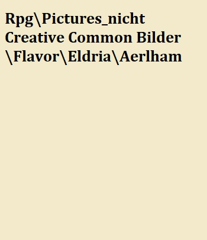
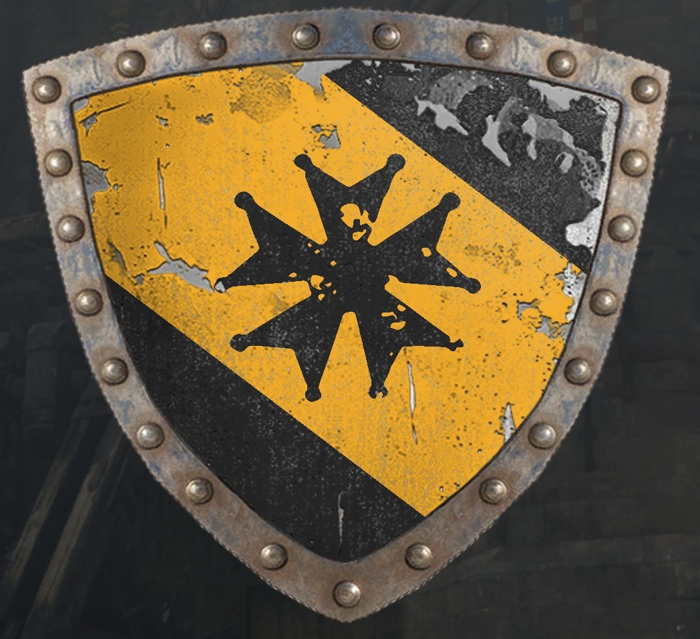
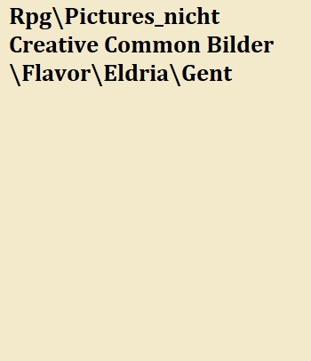
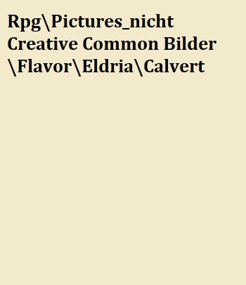

# Die Fürstentümer von Eldria {#EldriaFaction}

> "Ein Mensch kann von den Steppen Appothis' bis ins Eisland reisen, doch nirgends wird man solche Schönheit finden wie die der Landschaft und der Aussicht, die man in Eldria genießen kann."
>
> --- Aus "Die Reisen des Emhyr na Ren"

Eldria ist mehr ein Name für eine Region als eine Fraktion: eine Region, die östlich des Himmelsspitzen-Gebirges liegt.
Allerdings sehen sich die verschiedenen Fürstentümer Eldrias als Verbündete - ja fast als Verwandte. Doch wie jede Familie kommen die Fürstentümer ohne Streitereien nicht aus. Ständig ändern sich die Bündnisse und die Feindseligkeiten. 
Die größten und mächtigsten Fürstentümer sind [Aerlham](#Aerlham) und [Gent](#Gent). Für gewöhnlich werden gemeinsame eldrische Aktionen von dort gesteuert. Doch auch Austen und Hasting sind große und einflussreiche Fürstentümer.

Einschätzungen zufolge besteht Eldria aus über 300 Fürstentümern, wobei nur die größten 6-10 relevant sind. Manche der Fürstentümer sind nur Unterfürstentümer wichtigerer Fürstentümer, denen sie Treue und Loyalität schulden. Andere sind eigenständige Kleinfürstentümer, die sich - um nicht von den anderen, größeren Fürstentümern übernommen zu werden - in Allianzen zusammenschließen.

## Die Geschichte von Eldria {#DieGeschichtevonEldria} 

### Das Königreich Eldrias

Wann genau Eldria entstand, ist ein Wissen, welches leider verloren gegangen ist. Allerdings vermutet man heutzutage, dass Eldria ein Großprojekt des ominösen Zwergenclans war, den man [die Donnerwächter](#Donnerwächter) nennt. 
Ebenso wie die Gesellschaft der Donnerwächter war auch Eldria ein Königreich, dessen riesenhafte Hauptstadt [Wandia](#Wandia) zu ihren Glanzzeiten um ein vielfaches größer und beeindruckender war als Atumpet und Civis Primae zusammen. Wandia wurde an der Oberfläche von den Eldriern und im Untergrund von den Zwergen bewohnt und in vielerlei Hinsicht gemeinsam geführt. 

Der Herrscher von Wandia war gleichsam auch der Herrscher über ganz Eldria. Er schaffte die Verwaltungsstrukturen und Herrschaftsbereiche, die heute den Adel, die Fürstentümer und die Vasallenleiter ausmachen. Alles geeint unter der Krone von Wandia. 

In diesem goldenen Zeitalter Eldrias - lange bevor das Kaiserreich überhaupt existierte - war Eldria das wohl stärkste und größte Menschenreich, welches Orbis Astea jemals gesehen hatte. Durch die Donnerwächter erblühte es technologisch und wirtschaftlich, durch die eldrische Ritterkultur wurde es zu einer militärischen Macht, welche sogar in der Lage war diplomatische Beziehungen zu den [Elfen von Silva Nacia](#Donnerwächter) aufzubauen - eine Freundschaft die darin gipfelte, dass die Elfen der Königsfamilie Wandias eine Saat des heiligen Baumes schenkten. 
Es grenzte an ein Wunder, dass diese Saat in Wandia aufging und dort der bis heute einzige Ableger des heiligen Baumes spross - ein Wunder, welches die Elfen und das Königreich Eldrias in Freundschaft verband.

Das Königreich Eldria war wenig expansiv und hatte abgesehen vom Handel mit den Bewohnern der unteren Steppe wenig Kontakt zu den anderen - großteils noch nicht existenten - Menschenreichen.

Der Fall des Königreichs kam mit dem Fall von Wandia, als im Jahre 1150 vor Riga ein mächtiger wahrer Drache über Wandia herfiel und die Stadt in einen Trümmerhaufen verwandelte. Auch die Tiefstadt wurde vernichtet, wobei viele Donnerwächter und das gesamte Königshaus Eldrias ihr Leben verloren.

### Die Aufsplitterung {#DieAufsplitterung}

Ohne die Macht Wandias und die Führung des Königshauses brachen die Fürstentümer Eldrias außeinander und der erste eldrische Bürgerkrieg um Macht, Territorium und Ressourcen begann. Die Unruhen wurden weiter verstärkt durch den wahren Drachen, der alles einäscherte, was sich Wandia zu sehr näherte, und durch die Elfen des Silva Nacia, die den Eldriern den Verlust des Baumsätzlings nicht verzeihen konnten und mit ihren eigenen Truppen nun regelmäßig in Eldria einfielen.

Bald konnten sich zwei Fraktionen im Bürgerkrieg durchsetzen. Aerlham im Norden Eldrias und Gent im Süden - die bis heute größten Fürstentümer Eldrias. 

Mit der Zeit erstarkten auch andere lokale Fürstentümer durch kluges Ausnutzen von Allianzen und gegenseitige Rückendeckung. So wurden auch Calvert, Austen, Darcy, Hasting, Rinton und Haag politisch eigenständig und relevant.

Langfristig schafften es alle Fürstentümer Vasallenfürsten und Ritter an sich zu binden - manche mehr, manche weniger stabil - und damit die eigene Macht zu festigen. 

In den nächsten Jahrhunderten gab es mehr und mehr Bürgerkriege in Eldria. Dies sorgte dafür, dass die Eldrier sich mehr um ihre inneren Streitigkeiten als um außenpolitische Expansionen sorgten, weswegen es keine großen Feldzüge Eldrias gibt, von denen man hier berichten könnte.
Gent und Aerlham hielten sich die Waage und immer, wenn es so aussah als würde sich eines der Fürstentümer durchsetzen können, korrigierten das die wechselnden Allianzen der kleineren Fürstentümer, die Angst davor hatten, dass eine der Seiten zu stark werden könnte.

Um 950 vor Riga kam es zum sogenannten [Kampf der Kolosse](#Donnerwächter), welcher dafür sorgte, dass der wahre Drache Eldria nicht mehr terrorisieren konnte.

### Die Wirkung des Felssturzes

Nach mehreren Jahrhunderten kam es zum Felssturz von Istval. Ein Zwergenkönigreich explodierte und mit ihm ein Teil der Himmelsspitzen. Die dadurch gewaltsam umgeleiteten Flüsse und Ströme flossen ins Tal und schufen den [Nebelhain](#Nebelhain), der das Reich der Rah Kari heute von Eldria trennt. 

Eine weitere Wirkung des Felssturzes war die Verwüstung und großflächige Vernichtung der Fürstentümer südlich von Gent. Große Teile von Haag wurden vernichtet, während andere Fürstentümer vollständig untergingen. Dies war eine große Schwächung der Position Gents, da die betroffenen Fürstentümer großteils Vasallen von Gent waren. 

Dadurch übernahm Aerlham die Führungsrolle unter den Fürstentümern - wobei man es nicht mit tatsächlicher Führung gleichsetzen kann. Aerlham ist nur das größte und einflussreichste der Fürstentümer. Allerdings folgen die anderen nur so weit, wie sie wollen. Gent ist noch immer enorm mächtig und einer der größten Widersacher Aerlhams.

Allerdings besetzte Aerlham kurzzeitig die Heimat der Halblinge, Yondalla, im Jahre 190 nach Riga.

### Die kaiserliche Besatzung {#DiekaiserlicheBesatzungEldrias}

Seit nunmehr 8 Jahren ist Eldria von den Kaiserlichen besetzt. In der Schlacht um Aerlham ging die eldrische Großarmee verloren, eine Art zusammengerufene Armee sämtlicher Fürstentümer. 
Obwohl sich Eldria nicht allzu bald von diesem Schlag erholen können wird, ist der Widerstand gegen das Kaiserreich allgegenwärtig spürbar. Während manche Teile Eldrias in offener Rebellion stehen, sind in den meisten Guerilliaorganisationen unterwegs, welche versuchen die Kaiserlichen aufzuhalten oder zu behindern. Wieder andere Fürsten stellen sich aktiv auf die Seite des Kaiserreichs in der Hoffnung die eigene Position und Macht zu erweitern.

## Eldrias Gesellschaft

### Die Fürsten

Adeliger in Eldria wird man meist durch Erbschaft. Manchmal wird einem der Titel allerdings auch dadurch vergeben, dass man von einem größeren Fürsten Land und einen Titel gestellt bekommt. Diesen Vorgang nennt man "Erhebung" und sie geht für gewöhnlich mit einem Schuldverhältnis gegenüber dem Fürsten einher, der einen erhoben hat. 

Obwohl es in Eldria sehr viele Adelige gibt, ist ihnen ihr Status sehr wichtig. Auch kleine und völlig unbedeutende Adelige, die sich in ihrem Einfluss nicht wirklich von Bürgerlichen unterscheiden, werden darauf beharren, dass sie Fürsten sind, und daher Respekt verlangen, den andere Adelige ihnen auch entgegenbringen werden. So werden Adelige in Kriegsgefangenschaft oder Prozessen im Allgemeinen bevorzugt behandelt.

### Die Ritterschaft

Die Krieger Eldrias gehören zu den besten der Welt. Sowohl beritten als auch zu Fuße sind sie tödlich und die Disziplinen des Individualkampfes sind tief in der eldrischen Kultur eingebettet. Ein Ritter Eldrias kann prinzipiell jeder werden, der sich als solcher bezeichnet. Allerdings ist es von Vorteil, wenn man ein Reittier und passende Ausrüstung besitzt, wenn man ernstgenommen werden möchte.

Ritter suchen oft Arbeit bei Fürsten, die sie auch bezahlen können. Obwohl sie sich oftmals als Helden stilisieren, sind sie eigentlich nicht viel besser als bedungene Söldner. Es gibt mehr als genug Beispiele, in denen Ritter aufgrund von Bezahlung oder Land die Seiten gewechselt haben oder in denen Ritter Zivilisten misshandelt oder massakriert haben. Trotz dessen gibt es mehrere Formen der Heldenepik über die Ritter und sie werden als Helden betrachtet, sodass sie von Schaulustigen in Dörfern durchaus einmal umringt werden.

![Ein Ritter Eldrias, der Löwe von Calvert ziert sein Wappen[^UmbatmanBlackmoorsKnight]](Pictures/Flavor/Eldria/blackmoors_knight_by_umbatman.jpg)

Die meisten Ritter tragen einen Überwurf über ihrer Rüstung, der in leuchtenden Farben sowohl das Wappen des Ritters selbst als auch die Insignien des Fürstendarstellt, dem sie dienen - sofern sie sich in einem Dauerverhältnis befinden.

Meist sind es besonders treue Ritter, die in den Adelsstand erhoben werden. So ist der Ritterstand gerade für viele soziale Aufsteiger oder niedere Adelige attraktiv, die nach mehr Land und Macht streben und sich durch eine mögliche Erhebung erhoffen an tatsächlichen Einfluss zu kommen.

## Die Fürstentümer

### Aerlham {#Aerlham}

Aerlham ist das mächtigste und größte der Fürstentümer. Es wird oft als die Hauptstadt Eldrias bezeichnet.
Gleichsam ist Aerlham das nördlichste Fürstentum und grenzt direkt an das kaiserliche Grenzland. Aerlham hat die größte Bevölkerung aller Fürstentümer und ist die beste Stadt, wenn man nach ausgefallenem Handwerk sucht. Ein weiteres, wenn auch eher ungewöhnliches, Alleinstellungsmerkmal ist, dass Aerlham eine der einzigen Städte Eldrias ist, die über eine funktionierende Kanalisation verfügen.

Das Fürstentum verdankt seine Macht und seinen Rang der strategisch guten Position nahe am Grenzland. Durch die neue Feindschaft mit den Elfen kam es zum Verlust der Route durch den Silva Nacia. Damit wurden die Straßen durch Aerlham die einzige sinnvoll nutzbare Route in den Norden, was Aerlham mit Zöllen und Handelsverträgen voll auszunutzen wusste. Durch den Felssturz von Istval gewann diese Route noch mehr an Bedeutung, was die Vormachtstellung Aerlhams zementierte. Obwohl Aerlham in seiner Geschichte häufig inneren Machtkämpfen ausgesetzt war, schaffte die Familie Graham es vor 200 Jahren sich (mit viel Hilfe aus Darcy) zu etablieren. Daher ist Aerlham bis heute eines der treusten Mitglieder der Liga des Lichtes.

Aerlham wurde bis zur Übernahme durch das Kaiserreich durch die Familie Graham kontrolliert. Momentan hat allerdings der imperiale Stadthalter - und Onkel des Kaisers - Arminius Prodius das Sagen in Aerlham. Er und seine Garnison regieren die unter Kriegsrecht stehende Stadt mit eiserner Hand, was zur Folge hat, dass auch unschuldige in Aerlham in einer Zelle landen und Prozesse eine eher untergeordnete Bedeutung haben.

Trotz dieser widrigen Umstände lebt die Elite Aerlhams ein mehr als extravagantes Leben, in dem Bälle, Opern, Maskeraden und andere Gelegenheiten sich zu profilieren zum Alltag gehören. An kaum einem Ort ist die soziale Ungleichheit so groß wie in Aerlham.

Bis heute gibt es eine erstarkende Widerstandsbewegung unter Argus Graham, dem jüngsten Spross des früheren Herrschaftshauses. Dieser baute den Widerstand gegen das Kaiserreich in Aerlham auf.

### Gent {#Gent}  

Gent war neben Calvert eines der beiden Fürstentümer, welche zum Schutz Wandias gegründet wurden und schon früh einen militärischen Schwerpunkt hatten. Gents Armeen waren elementar beim Rückschlag der Feinde der Donnerwächter im [Zwergenkrieg](#Zwergenkrieg). Allerdings zeigte sich Gent schon bald eigenwilliger als andere Fürstentümer. 
Nach dem Untergang Wandias erklärte Gent beinahe unmittelbar seine Unabhängigkeit und begann seinen Einfluss in umliegende Fürstentümer auszuweiten.

Diese expansionistische Politik Gents führte schon bald zu einer bis heute andauernden Rivalität und Feindschaft mit Aerlham. Diese Feindschaft mündete in unzählbare Scharmützel und Kriege. 
Durch den Felssturz von Istval wurde Gent geschwächt und musste dadurch sämtliche Hoffnungen aufgeben in näherer Zeit die Führungsrolle in Eldria zu übernehmen.

Gent war eines der Fürstentümer - das größte, um genau zu sein -, welche sich nach dem Krieg dem Kaiserreich anschlossen. Dies hatte vor allem den Vorteil, dass die Familie Strake weiterhin die Herrschaft über Gent behalten durfte. Natürlich ist Gent dem Kaiserreich gegenüber nicht *wirklich* Loyal. So haben sie im großen Krieg die Kaiserlichen mit allem bekämpft, was sie hatten. Viel mehr geht es ihnen darum ihre Macht unkompliziert zu halten und weiter auszubauen, während das Kaiserreich hinterrücks mit allen verfügbaren Mitteln bekämpft wird. 

Von sämtlichen Fürstentümern Eldrias ist Gent sicherlich das, dessen Militär am beeindruckendsten ist. Bereits im jungen Alter müssen die Männer Gents zum Militärdienst antreten und werden in die Armee integriert. Dabei ist Gent das einzige Fürstentum, welches nicht nur auf den Ritterstand für professionelle Soldaten setzt sondern auch auf den klassischen Soldaten und die Zusammenarbeit von Einheiten und Truppen, was Gent unglaublich kampfstark macht. 
Das bedeutet natürlich nicht, dass der Ritterstand Gents in irgendeiner Form den anderen Fürstentümern nachsteht: Die Ritter Gents sind besonders gefürchtet und werden als besonders kampfstark angesehen, wenn auch nicht als besonders ehrenhaft. 

Kulturell ist Gent eher unterentwickelt. Während die meisten anderen Fürstentümer immerhin einen gewissen Teil ihrer Ressourcen in die Wissenschaft, Künste und in die Erhaltung von Wissen stecken, wird man in Gent nichts dergleichen finden. 

Aufgrund der zentralen Lage Gents ist es eines der einkommensreichsten Fürstentümer Eldrias. Die meisten Händler müssen auf dem Weg durch Eldria auch durch Gent hindurch oder zumindest durch Gebiete, die Gent kontrolliert. Aufgrund der Tatsache, dass Gent jeden Händler Zölle zahlen lässt, bezahlen diese ihre teure Armee und ihre im Allgemeinen eher unproduktive Wirtschaft.

Gent ist zudem jenes Fürstentum, welches religiös am wenigsten von der Kirche Darcys berührt wurde. Obwohl es einige Anhänger des Lichts gibt, sind die meisten Menschen in Gent Anhänger einer polytheistischen Urreligion, die an den Kampf der grauen Götter glaubt.

### Austen {#Austen}

> "Wenn es in Austen nicht wächst, dann wächst es nirgendwo."
>
> --- Altes eldrisches Sprichwort

Austen ist das landwirtschaftlich nutzbarste Gebiet in Eldria, weswegen der Großteil der Bewohner aus Bauern besteht. Dieser Ressourcenreichtum hat Austen zwar immer zu einem wichtigen Knotenpunkt gemacht, allerdings auch zu einem Ziel, das andere Fürstentümer zu beherrschen suchten. Deswegen verbrachte Austen den Großteil seiner Geschichte unter der Besetzung von Aerlham oder Gent bis es schließlich zu einer eigenen kaiserlichen Verwaltungszone wurde. Aufgrund dieser Gewöhnung an Besetzungen ist in Austen die Feindseligkeit dem Kaiserreich gegenüber mit am geringsten. 

In Austen gibt es keinen herkömmlichen Fürsten, sondern nur die Vorherrschaft des Großbauernverbandes, in dem die Bauern mit den 10 größten Höfen ein Stimmrecht haben.

### Hasting {#Hasting}

Hasting ist das Fürstentum, welches am nähesten an Silva Nacia liegt und daher auch am meisten Probleme mit den Elfen dort hat. Daher sind die Ritter und die jungen Männer Hastings oft auf Elfenjagd, egal ob es sich um Elfen des Silva Nacia oder um arme Stadtelfen handelt.

### Darcy  {#Darcy}

In Darcy ist die größte Kathedrale Eldrias beheimatet: Die Chromatia Narista wird von den meisten, die Darcy einmal besucht haben, als eines der beeindruckensten Wunder der Welt bezeichnet. Sie ist Mittelpunkt der Religion des Lichts von Darcy, die an die Göttlichkeit in der Einhaltung des ritterlichen Ehrenkodex glauben. 
Darcy beherbergt die größten Schulen für junge Geistliche und wird im Gegensatz zu den üblichen Fürstentümern Eldrias nicht von einem Adeligen beherrscht, sondern von einem geistlichen Herrscher, der von allen Priestern der Chromatia Narista gewählt wird.

Darcy versucht kriegerischen Außeinandersetzungen meistens aus dem Weg zu gehen und hat daher verschiedenste Friedensverträge mit umliegenden Fürstentümern, Elfengemeinschaften und sogar mit einigen Orkstämmen. 
Des Weiteren hat Darcy eine Menge an indirektem Einfluss auf andere Fürstentümer, da in Darcy eine Lösung hergestellt wird, die die Erweckung verhindert. Diese Lösung wird "Traum der Seeligen" genannt und ist ein speziell von Priestern der Chromatia Narista geweihtes Wasser, welches die effizienteste bekannte Lösung darstellt, um die Erweckung zu verhindern. 
Darcy versucht den Verkauf dieses Mittels zu verwenden, um andere Fürstentümer zur Zusammenarbeit und zu Friedensverträgen zu nötigen, obwohl zum Teil keine der streitenden Parteien Frieden will - geschweige denn eine Einmischung Darcys in ihre Affären. Diese aggressive Politik hat auch dafür gesorgt, dass Darcy und dessen Religion in der Außenwelt bei weitem nicht so beliebt und einflussreich sind wie andere Konfessionen in Orbis Astea, deren Lösung für die Erweckung komplexer sind als die der Religion Darcys.

Die meisten Adeligen schicken ihre Zweitgeborenen als symbolischen Akt zur Ausbildung nach Darcy. Zum einen ist es ein Zeichen des Friedens und der Verständigung der Fürstentümer untereinander. Zum anderen stellen die Zweitgeborenen dann gebildete, loyale und gute Berater für ihre großen Brüder dar. 

### Calvert {#Calvert}

Das Fürstentum Calvert ist das älteste Kleinfürstentum in ganz Eldria und wird seit über 1000 Jahren von der Familie Calvert beherrscht.
Die Calverts wurden damals von der Königsfamilie als Schutzfürstentum Wandias instituiert und sind bis heute an einen Eid zum Schutz der Königsfamilie gebunden, der bei der Erhebung zum Fürsten geschworen werden muss. 
Diese lange Blutlinie und Tradition - ebenso wie der geschworene Eid - sorgen auch dafür, dass Calvert deutlich interessierter an der Rückeroberung Wandias ist als andere Fürstentümer Eldrias. Allzu oft senden die Calverts halbe Armeen in den Tod auf der Jagd nach Orks, Elfen und allen anderen, die Wandia für sich beanspruchen wollen. 

### Rintom und Haag {#Rintom und Haag}

Obwohl Rintom und Haag an sich zwei unterschiedliche Fürstenrümer sind, sind sie sich sehr verwandt, weswegen sie in diesem Buch gemeinsam behandelt werden. Beide Stadtstaaten liegen direkt am Nebelhain. Dieser hat über die Zeit die Psyche und Gesellschaft der Bewohner ebenso wie die Politik der Stadtstaaten, stark beeinflusst. Während im übrigen Eldria das Gastrecht eine wichtige Tugend ist, ist es in Rinton oder Haag sehr unwahrscheinlich, dass man als Gast freundlich aufgenommen wird. Die Macht der Sicherheitkräfte ist beinahe unendlich und Durchsuchungen von Passanten sind an der Tagesordnung. Die Paranoia innerhalb der Städte wird nur noch von der fanatischen Anhängerschaft der "Wahrer des Hains" übertroffen, die tägliche und verpflichtende Messen zur Läuterung abhält, die vor den Ausdünstungen des Hains schützen sollen. 

In beiden Städten gab und gibt es immer wieder systematische Hexenjagden, die vor allem Drogensüchtige und Alchemisten treffen. Die größte davon war im Jahr 184 nach Riga, in der über 400 Personen öffentlich verbrannt wurden - alles unter Aufsicht der Wahrer des Hains. 

> "Von allen Fürstentümern, die du besuchen kannst, meide jene, die am Nebelhain liegen. Die Bewohner sind kalt und unfreundlich und überall liegt ein grüner Dunst in den Straßen. An manchen Tagen ist der Nebel so dick, dass man nicht mal zwei handbreit sehen kann. Während der Rest Eldrias eher sonnig und warm ist, sind Rintom und Haag auch an den hellsten Sommertagen noch düster und unlebsam."
>
> --- Aus "Die Reisen des Emhyr na Ren"

Die Fürstentümer am Nebelhain haben im Gegensatz zu den anderen Fürstentümern eine kleine Bevölkerung und wenig militärische Macht. Der einzige Grund, warum ein stärkeres Fürstentum sie sich noch nicht einverleibt hat, ist die Ambivalenz des Nebelhains. Diese macht es möglicht bei der richtigen Nebelentwicklung eine enorme Menge von unerwarteten Überraschungsattacken auszuführen und ganze Armeen, sowohl während eines Rückzugs als auch beim Marschieren unauffindbar zu machen - vorausgesetzt man kennt das Gebiet. 
Trotz der geringen militärischen Macht sind die beiden Stadtstaaten aber enorm wichtige politische und wirtschaftliche Standorte, da die Nähe zum Reich des Südens sowohl aufgrund von Handelsbeziehungen als auch aus militärischen Gründen nicht zu unterschätzen ist.

## Das eldrische Militär

Das eldrische Militär besteht aus Rittern und Eingezogenen. Während die Ritterschaft teilweise die besten Krieger in Orbis Astea darstellt, sind die Eingezogenen oft miserabel ausgebildet und ausgerüstet. 

## Eldrische Legenden

Eldria ist ein Land voller Mythen und Legenden: von Heckenrittern und aufrechten Recken, die Raubritter und Monster erschlagen, bis hin zu Legenden über den [Nebelhain](#Donnerwächter) und [Wandia](#Donnerwächter), die in den jeweiligen Kapiteln nachzulesen sind.

[^UmbatmanBlackmoorsKnight]: "Blackmoors Knight" von [Umbatman](https://www.deviantart.com/umbatman/art/Blackmoors-Knight-846222925). Dieses Artwork steht unter einer Creative Commons Attribution-Noncommercial-No Derivative Works 3.0 License zur Verfügung.
