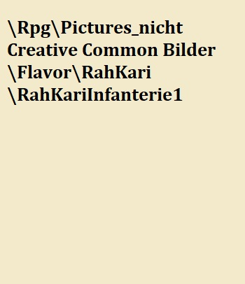
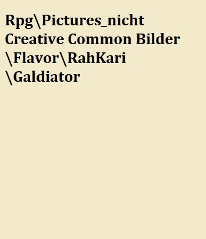

# Rah Kari {#RahKari}

## Die Geschichte der Rah Kari

Die Rah Kari stammen aus der Wüste westlich von Atumpet - jene Wüste die man heute als "Eid' Rah Kari" nennt. Ursprünglich mehrere nicht zusammenhängende Stämme, die sich selbst bei jeder Gelegenheit bekämpften, wurden die früheren Rah Kari von ihren östlichen Nachbarn - dem heutigen Atumpet - mit Verachtung als unzivilisierte Barbaren bezeichnet. Sie waren schon damals bekannt für eine ausgezeichnete Zucht an Reittieren, obwohl es sich damals zumeist um Kamele handelte - die für die Wüste deutlich geeigneter waren, als die Pferde, für die sie heute bekannt sind. Von Handelstransaktionen zwischen den Stämmen und Atumpet um jene Kamele stammen auch die ersten Aufzeichnungen um die Rah Kari - da die Stämme zum damaligen Zeitpunkt keine Geschichtsschreibung oder sonstige Dokumentation hatten. Wichtig zu erwähnen ist wohl, dass sie erst später als Rah Kari bekannt wurden, bis dahin waren sie einfache Nomaden aus der oberen Wüste.

### Aus Blut wächst Treue

Einer der Stämme erhielt an einem Tag, an dem die Sonne von Dunkelheit umhüllt war, ein Kind und dem Kind wurde der Name Kha'fan gegeben. Schon im Alter von sechs Jahren stellte Kha'fan sich als etwas Besonderes raus. Er besiegte die Dorfältesten in komplizierten Spielen des Geistes und stellte Rätsel, die keiner seines Stammes zu lösen vermochte. Mit 10 Jahren erfand Kha'fan die Schleuder, eine Waffe die die Rah Kari bis heute nutzen. Den Omen seiner Geburt treu wuchs er heran und übernahm früh die wichtigsten Aufgaben des Stammes, für die man einen schnellen Geist braucht. 
Als Kha'fan 15 wurde, wurde ein plündernder Stammes in der Nähe ausgemacht und Kha'fan musste das erste mal ins Feld ziehen. Die Schleudern, welche Kha'fan erfunden hatte erwiesen sich als unschlagbar. Gepaart mit der Gescchwindigkeit der Kamele und Dromedare töteten er und sein Stamm schnell einen großen Teil der Plünderer, die nach und nach in die Flucht geschlagen wurden und rannten - nicht dass das von Nutzen war, da man der Reichweite der Schleudern und der Geschwindigkeit der Reiter kaum entkommen konnte. Bald war nur noch einer der Plünderer übrig, ein Junge nicht älter als Kha'fan, der weder Rüstung noch Helm trug und einen rostiges Schwert als Waffe führte. Als die Reiter ihn umringten und verhöhnten und Stein um Stein nach ihm schleuderten Warf er den ersten Stein zurück. 

Der geworfene Stein durchschlug den Helm des Sharifen - dem Obersten von Kha'fans Stamm - und trat durch seinen Hinterkopf wieder aus. Die Reiter schauten geschockt als der Jüngling mit seinem Schwert auf sie zustürmte und Reiter um Reiter mit Leichtigkeit tötete. Seine Kraft und Geschwindigkeit war unübertroffen. Mit bloßen Händen riss er einem Dromedar ein Bein aus und schleuderte es auf den Reiter der daran verstarb. Hiebe und geschleuderte Steine die weit größere Männer getötet hätten verlangsamten den Jüngling nicht einmal - und die Kraft seiner Beine war ausreichend um mit der Geschwindigkeit berittener Krieger mitzuhalten.

Während der junge Plünderer in den Truppen seines Stamms wütete wurde Kha'fan klar, dass sie ihn im Kampf nicht würden besiegen können. Mit seiner Scharfsinnigkeit als Waffe übernahm er die Führung über die Krieger und wies sie an auf einer Route zu reiten, auf der sie den jungen Plünderer in ein ihnen bekannten Treibsandwirbel locken konnten. Die Krieger hörten auf ihn, denn niemand sonst wusste etwas tu tun und Kha'fan war bekannt für seinen schnellen Geist. Tatsächlich gelang es ihnen, den Jüngling wie geplant in den Treibsand zu locken. Der Jüngling verstand nicht, dass er nur schneller und weiter einsank umso mehr er zappelte und sich wehrte - und so hatten die Reiter Zeit ihn zu umringen und so lange mit Steinen zu beschießen bis er bewusstlos zusammensackte - ein Unterfangen, dass mehrere Minuten und mehrere hundert Steine in anspruch nehmen sollte.

Kha'fan - der dank seiner erfolgreichen Strategie von den Soldaten zum neuen Sharif ausgerufen wurde - befahl, den bewusstlosen Jüngling als Gefangenen mitzunehmen und mit den dicksten Seilen zu fesseln. Als der Jüngling aus der Ohnmacht erwachte war er im Zelt Kha'fans und dieser blickte ihn an wie auch er ihn anblickte.

> "Wer bist du, dass du dem Tode zu trotzen vermagst und nicht ein ganzes Heer ausreicht dich zu richten?"
>
> --- Kha'fan zu Tarkus Rah

Der Plünderer und Kha'fan tauschten nur wenige Worte, bis der Plünderer das Seil das ihn hielt mit übermenschlicher Kraft zerrissen hatte. Eines dieser Worte war sein Name - Tarkus Rah. Erschrocken ob der übermenschlichen Kraft des Tarkus Rah zog Kha'fan sein Schwert und die beiden umkreisten sich bereit den anderen zu töten, doch des Tarkus Rahs unglaubliche Stärke imponierte Kha'fan, ebenso wie dessen Schläue dem Tarkus Rah imponierte, und als sie sich tief ansahen erfüllte sie beide das Gefühl und das Wissen der gegenseitigen Zugehörigkeit durch den Willen des Schicksals und sie fielen sich in die Arme und teilten das Bett ebenso wie das Mahl sie schwuren sich die ewige Treue und würden all dies bis ans Ende ihrer Tage tun. Aus Blut und Hass entstand wahre Liebe, die die Ewigkeit überdauern sollte.

### Der Wanderer und der Träumende

Die Menschen des Stammes des Kah'fan akzeptierten weder das überleben des Tarkus Rah, der ihrem Stamm so viel Leid zugefügt hatte, noch die Tatsache, dass der Plünderer und ihr Sharif Bett und Leben teilten. Und so entschlossen sich die beiden jungen Männer dazu gemeinsam den Stamm zu verlassen und sich ein neues Leben aufzubauen. Doch in Tarkus Rah brannte das verlangen nach Kampf und Blut ebenso stark wie in Kha'fan das verlangen nach Gesprächen und Rätseln.

Als es die beiden immer weiter in die Steppe zog trafen sie auf zwei weitere alleine wandernde Gestalten, eine davon war ein Alter man namens Asb'Kartes, der sich auf die Kunst des gesitteten Gespräches verstand und mit dem sich Kah'fan schnell anfreundete. Trotz des heißen Wetters, welches in der Wüste tagsüber vorherrschend war trug Asb'Kartes immer eine dicke braune Robe - denn, so erklärte er ihnen, er litt an einer Hautkrankheit, die seine Haut grau färbte und seinem Gesicht ein schauriges Aussehen geben würde, und er wolle andere Menschen nicht ängstigen.
Der andere Wanderer des Zweigespannes redete viel doch kaum einer verstand je was er sagen wollte, so kryptisch war die Ausdrucksweise - nur Asb'Kartes schien seinen Worten hin und wieder folgen zu können. Der vierte wurde Amdju genannt, was nach jedem Standart ein ungewöhnlicher - doch sicherlich kein echter Name war.

> "Der Sand ist ein armer Tropf, wäre er doch gerne blau und hold wie sein Bruder. Doch die Zeit verdammet ihn zu einem Dasein als totes Geschöpf, das niemandem wirkliche Wärme bringet, so sehr er es auch versuchen mag. So ist es heiß in seinem Schoß obwohl es nicht warm ist, und warm ist es in des kalten Bruders Schoß."
>
> --- Amdju über die Dünen der oberen Wüste

Schnell bemerkten die beiden, das alles was Amdju anrührte, ihre Sinne berührte - egal ob es seine Worte waren oder seine Lieder, egal ob es eine Skizze war oder eine angerichtete Malzeit war, war seine Gegenwart ein ständiger Einfluss voller unbekannter Emotionen und aufgewühlter Gefühle. Tarkus Rah, der Gefühle einfach passieren ließ, war davon beeindruckt - ganz im Gegenzug zu Kha'fan dem es unbehagen bereitete die Dinge nicht zu verstehen. Doch da jeder sich mit einem aus der anderen Gruppe gut verstand wurde aus zwei Zweiergespannen bald ein Vierergespann.

Meistens war es Asb'Kartes, der den Weg vorgab, da er die Gegend sehr gut kannte. Und er führte sie in ein Dorf namens Nustain, in dem es niemandem an Essen mangelte und auch für Gäste reichlich zur Verfügung stand. In der Wüste war ein solcher Ort ein Wunder, und sogar fließendes Wasser war an diesem Ort zu finden und grüne Bäume ebenso wie ein vergnügtes Volk. 

Amdju war sofort begeistert und mischte sich unter das feiernde Volk, das von seinen Gesängen in noch bessere Stimmung versetzt wurde. Und während Tarsus Rah die Festivitäten nutzte um sich mit den starken Männern des Dorfes zu prügeln machte sich Kha'fan in begleitung von Asb'Kartes auf um die Quelle des überflusses dieses Ortes zu finden.

So fanden sie Pseptha, die von den Leuten des Dorfes fast wie eine Göttin behandelt wurde.

### Die Oase und die nördliche Wüste

Pseptha war jung und schön von Gestalt, und alles was sie berührte und pflegte ward Grün und fruchtbar - so war es ihre Fürsorge, die dafür sorgte, dass das Dorf in Glück und Überfluss leben konnte. 
Als sie Kha'fan sah schaute sie ihn jedoch traurig an und sie sprachen - denn sie beide wussten dass sie einander zugehörig waren.

> "Ich trauere, denn ich weiß dass es mir bestimmt sei dich zu begleiten obwohl ich hier mein Glück erschaffen habe. Doch wo ich gehe mag diese Oase für immer bestehen und den Kindern und Kindeskindern dieses Ortes Freude und Frucht bringen bis dass die Welt wie eine glühede Fliege in der Dunkelheit verlischt und Nusrain soll sie genannt werden vom heutigen Tage an."
>
> --- Pseptha zu Kha'fan

Zur trauer der Bewohner verließ Pseptha zusammen mit Kha'fan und seinen Freunden das Oasendorf Nusrain und obwohl diese bitterlich weinten wusste Pseptha dass sie gehen musste. So wanderten sie 40 Tage und 40 Nächte durch die Wüste und folgten Asb'Kartes bis dieser Zusammenbrach und nicht mehr vermochte aufzustehen. Seine Krankheiten und sein Alter ließen nicht zu, dass er weiterging und vom Leben besiegt kreisten alsbald die Geier über seinem Körper. Kha'fan und Pseptha waren darüber sehr bestürzt, war er doch ihre Landkarte ihr Gesprächspartner und ihr Freund. Und so hielt die Reisegemeinschaft gemeinsam Wacht und versuchte ihn zu stärken mit Speiß und Trank - doch trotz ihren besten Bemühungen stand er nicht mehr auf.

Es begab sich dass nach mehreren Tagen der Wacht und des Hoffens eine Karawane vorbeizog. Und obwohl die Meisten von ihnen nicht Helfen wollten und direkt weiterzogen war doch eine Junge Frau dabei - mit Namen Sha'fra - als sie den Kranken erblickte brachte sie es nicht über das Herz und ging zu ihm hin und pflegte ihn unter Beschwerde ihres Bruders. Bereits nach wenigen Minuten stand Asb'Kartes wieder auf seinen Beinen und war so vital und kräftig wie schon seit Monaten nicht mehr. Er erkannte ihr unglaubliches Potential sofort und bat sie, alles hinter sich zu lassen und mit ihnen zu kommen. 
Obwohl sie ein großes Bedürfniss hatte die Gruppe zu begleiten lehnte sie die Bitte des Asb'Kartes ab - war sie doch ihrem Bruder verpflichtet. Doch dieser Gesellte sich zu den Reisenden und sprach mit Kha'fan und Pseptha - und als er über ihre unglaublichen Talente erfuhr wusste er dass er daraus viel Wert machen könnte und so bat er an mitzukommen. Obwohl Tarkus Rah an seinen Motiven zweifelte und ihn niederschlagen wollte nahmen sie ihn auf Drängen des Asb'Kartes mit. So wurden der Händler Meliodas und die Heilerin Shafra Teil der Gruppe.

### Der graue Berg

Asb'Kartes führte die Reisegemeinschaft weit in den Westen, bis an das Ende der oberen Wüste. Die Reise war gefährlich, aber der Scharfe Verstand von Kha'fan und die mächtige Kampfkraft des Tarkus Rah waren mehr als genug um die Gruppe beschützen zu können. Auf dem Weg installierte Meliodas Handlesbeziehungen und Handelsposten in fast jedem Dorf, er zeigte den Dorfbewohnern wie sie ihr Leben verbessern könnten und errang dadurch die Dankbarkeit vieler Stämme. 
Auch Kha'fan, Shafra und Pseptha schafften es sich eine Anhängerschaft mit ihren Gaben aufzubauen, während Tarkus Rah von den Männern und Frauen der Stämme eher Bewunderung für seine Stärke erntete.

Asb'Kartes legte den grauen Berg als Ziel für die Gruppe fest. Sie wussten nicht warum, aber obwohl er es auch nicht für nötig hielt es seiner Gruppe zu erklären, folgten sie ihm.
Nach mehreren Monaten des harten Fußwegs durch die Dünen der oberen Wüste erreichten sie die Graue Ödnis. Ein Ort der derart desolat war, dass nicht mal die Talente der Pseptha Fruchtbarkeit an diesem Ort schaffen konnten. 
Sie wussten bereits nach dem ersten Kilometer, dass sie auf diese Art und Weise niemals lebendig zum grauen Berg gelangen würden, und so fragten sie Asb'Kartes ob das wirklich die Beste Option wäre zum Berg zu gelangen. Nach kurzem überlegen lächelte dieser und führte sie wieder aus der Grauen Ödnis heraus - in ein Dorf das die Menschen Tirach nannten. 

In Tirach gab es einen berühmten Tierflüsterer, es wurde gesagt dass er die besten Dromedare in der gesamten oberen Wüste ausbildete und sie nannten ihn Hestua. Als Meliodas einen fairen Preis für die Pferde ausgehandelt hatte äußerte Hestua, dass er das Gefühl habe mit ihnen gehen zu müssen. Da er es am besten verstand die Reittiere zu kontrollieren und sie in seiner gegenwart deutlich ruhiger als gewöhnlich waren, nahm die Gruppe ihn mit. Er verstand sich wundervoll mit Tarkus Rah, und die beiden wurden schnell so gute Freunde dass Kha'fan - würde er Tarkus Rah nicht blind vertrauen - wahrscheinlich Eifersüchtig geworden wäre.

Mit den Reittieren des Hestua kamen sie alsbald an in der Grauen Ödnis an und begannen sich durch das unwirtliche Gebiet vor dem H'Abunaptra durchzuschlagen.  
Nach mehreren Tagen erreichten sie unter mannigfaltigen Entbehrungen den heiligen Berg.

> "Ein einsamer Riese steht im grauen Meer und schläft, kein Mensch kann ihn besteigen. Wer es tut sieht klar, sieht wie Orbis Aestea sein könnte und sein sollte."
>
> --- Amdju über den H'Abunaptra

Den Berg zu besteigen war keine leichte Aufgabe, und so brauchten sie dafür mehrere Tage. Sie fanden auf dem Berg essbare Früchte, welche sie noch nie gesehen hatten, und nährten sich davon. Und obwohl sie pausieren wollten drang Asb'Kartes darauf sie weiter und weiter hinauf zu führen. 

Dann erreichten sie den Gipfel. Was genau dort geschah weiß keiner genau, nur dass sich ihr Leben und ihr Zweck von da aus Grundlegend ändern sollte und sie danach anfingen das Reich des Südens aufzubauen.

> "Keiner hätte die Gemeinschaft auf das vorbereiten können was sie sahen. Sie sahen die Vergangenheit und erlangten ihr Wissen, sie sahen, wie die Zukunft aussehen könnte und wie man diesen Zustand erreichen könnte. Aber das interessanteste an dem ganzen war, dass wir alle das gleiche sahen, das gleiche dachten und das gleiche fühlten. Wir bekamen eins."
>
> --- Meliodas

Nach zwei Wochen wachten sie gemeinsam wieder auf. Jeder von ihnen merkte innerlich dss die anderen seine Mitstreiter waren, aber auch das einige Puzzleteile noch fehlten. Sie hatten eine Vision für die Welt und wie diese aussehen soll und sie waren determiniert dies  umzusetzen. Sie merkten dass ihre Eigenschaften Kräfte und ihre Zugehörigkeit stärker waren als zuvor, genau so als wäre ein Damm gebrochen, der davor existent war und nun fließt der Fluss frei.

Von diesem Tag an nannten sie sich die "Rah Kari" - die, die das Wissen erworben haben.

### Die ersten Schritte

Die Rückreise durch die Graue Ödnis war beschwerlich und sie redeten wenig miteinander. Die Tiere waren aufgrund ihrer langen Zeit auf dem H'Abunaptra verendet, so mussten sie zu Fuß gehen. 
Sie wussten dass - bis auf Tarkus Rah - jeder von ihnen verletzlich war, sollten sie angegriffen werden - ein Risiko, welches sie ob ihrer neugefundenen Mission nicht eingehen wollten. 
So suchten sie die ersten Stämme und überzeugten sie von ihrem Weg, und obwohl die Stämme ihren Weg weder verstehen noch sehen konnten folgten sie ihnen ob ihrer gottgleichen Fähigkeiten. So nahmen sie sich jeweils einige Männer der überzeugten Stämme zum Schutze mit und teilten sich auf das Wort zu verbreiten.

> "Sie glauben nicht an das, was wir glauben. Sie folgen uns, doch sind sie keine Rah Kari, keine Wissenden. Das können sie auch gar nicht sein, sie, die nicht den H'Abunaptra bestiegen haben. Aber das ist nicht wichtig. Wir brauchen sie nicht zum wissen, wir brauchen sie als Augen und Ohren, als Mittel zum Zweck. Nur durch die Gläubigen können wir unseren Traum zu jedermannes Wohl verwirklichen. Der Individuelle Gläubige ist dabei nicht wichtig. Außer er ist eine Schlüssel.
>
> --- Kha'fan zu Beginn der Expansion

So begab es sich, dass nach wenigen Monaten die großen Stämme der oberen Wüste unter dem Banner der Rah Kari vereint waren. Entweder hatten sie sich verneigt, oder Tarkus Rah und seine wachsende Abteilung Soldaten sorgte dafür, dass sich ihre Nachfolger den Rah Kari anschlossen. So schlossen sich die Stämme den Rah Kari an und die Sharifen wichen der vollständigen Herrschaft durch die Schlüssel der Rah Kari - einen Titel den sich Asb'Kartes, Kha'fan, Tarkus Rah, Pseptha, Hestua, Shafra, Meliodas und Amdju gegeben hatten.

Durch die Talente der Schlüssel florierte das Reich der Rah Kari schnell. Mediolas schaffte es die wirtschaftliche Lage der zuvor unverbundenen Stämme anzukurbeln wie nie zuvor, Pseptha ernährte zum Teil davor hungernde Völker, Kha'fan stattete sie mit nie zuvor gesehener Technologie aus, die alle bisherigen Arbeiten vereinfachte und Tarkus Rah vernichtete Banditen und andere Übeltäter, die die Stämme bedrohten, aber eine der größten Vorteile war der Erlass des Asb'Kartes, Leichen zum H'Abunaptra zu transportieren. Dass die Leichen nie erwachten war selbst für die hartnäckigsten Zweifler ein beweis der Göttlichkeit der Schlüssel.

Doch obwohl das kleine Reich der oberen Wüste gedeihte - insofern dies in einer ressourcenarmen und wirtschaftlich schwachen Wüste möglich ist - waren die Schlüssel der Rah Kari nicht zufrieden. Denn jenes, nach dem sie suchten, hatten sie noch nicht gefunden. 

Und so richteten sie ihren Blick nach 3 Jahren intensiver Suche im eigenen Reich auf die Festungsstadt Atumpet.

### Die Belagerung von Atumpet

Atumpet war eine beeindruckende Stadt - zumindest für eine Wüstenstadt. Natürlich ist es nicht vergleichbar mit Atumpet heutzutage, aber schon damals war die Stadt groß, die Mauern stark und es war genug an Wasser und Essen vorhanden damit sie lebensfähig war. Damals wurde Atumpet von einem Volksstamm bewohnt, der sich Kartin nannte. 
Die Kartiner waren allen außerhalb ihres Volkes feindlich genannt und begrüßten die Botschafter der Rah Kari unfreundlich und unter Waffen. Schon bald hatten die Schlüssel genug und sandten eine Armee unter Tarkus Rah und Kha'fan aus um die Stadt unter ihre Kontrolle zu bringen. 

Die ersten Schlachten gestalteten sich als sehr schwierig, die Armee der Rah Kari war kleiner, schlechter ausgebildet und schlechter ausgerüstet. Und während die Dromedarreiter in der Wüste unübertroffen waren, waren sie den Kriegselefanten und Pferden der Armee Atumpets weit unterlegen. 
zu allem Überfluss besaß Atumpet Artillerie und Bogenschützen, Vorteile, die die Rah Kari nicht hatten. 

Obwohl die Schlachten überall dort gut für die Rah Kari waren, wo Tarkus Rah selbst kämpfte, verloren sie sehr schnell an Boden, was die übrigen Fronten anging. Nach einer Woche hatten sie einen großen Teil der Truppen verloren, und so zogen Kha'fan und Tarkus Rah sich zurück und warteten auf Verstärkung für einen zweiten Feldzug.

Dieser zweite Feldzug sollte zwei Jahre später stattfinden. Dieses mal waren alle der Schlüssel beteiligt - und mit ihnen eine deutlich größere Armee als beim ersten Versuch, da sie jeden bewaffnet und eingezogen hatten, der in der Lage war eine Waffe zu halten. 
Aufgrund der Überzahl der Gegner versuchte die Armee Atumpets ihre bessere Ausbildung und Ausrüstung auszuspielen, indem sie für viele kleine Teilschlachten sorgte. Bei einer dieser Versuche traf die Elitekavallerie Atumpets, geführt vom Sohn des Sharifen, gegen die Vorhut der Rah Kari, geführt von Tarkus Rah. 
Dieses Pech raubte Atumpet an einem einzelnen Tag ihre besten Truppen als auch ihren Thronfolger und zerstörte die Moral der Verteidiger. Nach diesem Vorfall versteckten sich die Truppen Atumpets hinter ihren Mauern.

Drei Jahre lang belagerten die Rah Kari Atumpet, ohne die Mauern durchbrechen zu können. diese Zeit nutzten die Schlüssel um ihre Talente in vollem Umfang auszunutzen: Meliodas etablierte feste Handelsverbindungen und ließ Straßen zu allen wichtigen Siedlungen der oberen Wüste bauen. Hestua fing an die verfügbaren Pferde und Elefanten in seine Zucht zu integrieren - woraus die heute berühmten Pferde der Rah Kari entstanden. Letzten Endes war es eine kooperation aus Pseptha und Kha'fan, die das Schicksal Atumpets besiegelten. Gemeinsam leiteten sie die Setra so um, dass die reißenden Fluten die Mauern und die halbe Stadt niederrissen. Dadurch entstand der Flussarm der Setra, der heute als Psepthara bekannt ist. Die Truppen von Tarkus Rah hatten nach der Zerstörung der Verteidigungsanlagen leichtes Spiel und vernichteten der Rest der Armee, und so übernahmen die Rah Kari die Kontrolle über das, was von Atumpet noch übrig war.

Es würde 15 Jahre dauern bis der Schaden durch die Umleitung des Flusses behoben war. Allerdings schaffte der neue Flussarm der Setra - die Pseptha - eine Möglichkeit Landwirtschaft zu betreiben. Diese wurde von Psephta voll genutzt und schon bald war die Gegend um Atumpet fruchtbarer als irgendeine andere Region der heutigen Welt. Damit ist Atumpet bis heute die Lebensader der Rah Kari. 

Über die Jahrhunderte sollte Atumpet zum Juwel des Südens werden. Keine andere Stadt der Welt soll so groß, beeindruckend und schön sein, wie das Kunstwerk welches Atumpet darstellt. Und noch nie hat es ein Reisender betreten ohne zu staunen, es sei denn er war schon viele Male da.

### Die Suche nach dem Schlüssel

Trotz dem Erfolg der Kah Kari über Atumpet und dem gedeihen der jungen Nation waren die Schlüssel nicht zufrieden. Nach wie vor fehlte ihnen das was sie suchten - und auch Atumpets Eroberung hatte ihnen nicht die gewünschten Informationen gebracht.

Währenddessen wurde die Verehrung der Schlüssel durch die Rah Kari immer fanatischer, sie wurden nicht als Menschen, sondern als lebende Götter gesehen und anstatt dass die Menschen ihre Vision anbeteten und begehrten - wie die Schlüssel es taten - beteten sie die Schlüssel höchstselbst an. 
Manche der Rah Kari versuchten den Schlüsseln nachzueifern und den H'Abunaptra zu besteigen, doch nie schaffte es einer lebendig auf den Berg, es schien als würde der H'Abunaptra nur die Schlüssel auf sich dulden - wenngleich auch sie ihn nur einmal bestiegen hatten.

So kam es dass Asb'Kartes mit einigen der besten Krieger der Rah Kari aufbrach um sich auf die Suche nach dem zu machen, was die Schlüssel suchten. 

Nach vielen Jahren der Reise und der Suche kam Asb'Kartes in der Nähe der Zwergenstadt "" an, die bis heute die größte und einflussreichsteder Zwergenstädte, ob ihrer besonderen Schmiede, ist. Das Vorland der Zwergenstadt war fruchtbar und stategisch wertvoll für die neue Nation der Rah Kari - doch das interessierte Asb'Kartes nicht, er war nur da um seine Aufgabe zu erfüllen. 

> "Ohne den letzten der Schlüssel werden wir den Traum nie aufleben lassen können. Ich habe bereits 7 von 8 der Schlüssel versammelt, doch wo ist die letzte Komponente? Sie kann mit nicht abhanden gekommen sein, dafür bin ich zu gut vorbereitet gewesen."
>
> --- Asb'Kartes

Es zogen weitere drei Jahre ins Land, als Asb'Kartes in den Hinterhalt eines kleinen Stammes geriet. Auf einmal wurden er und seine Soldaten hinterrücks und vollkommen unerwartet angegriffen, doch die Leibgarde des Asb'Kartes war von Tarkus Rah selbst ausgewählt worden. Die gut ausgerüsteten Soldaren des Asb'Kartes schafften es schnell, den angreifenden Stamm auszuschalten. Überrascht reagierte Asb'Kartes allerdings, als er mitbekam, dass der Angriff von einem 14-jährigen Jungen geplant und durchgeführt wurde - und Asb'Kartes ahnte sofort, dass dieser Junge der letzte der Schlüssel sein musste. So nahm er den Jungen, der Unas Utet genannt wurde, mit sich - Unas Utet, der den selben Ruf verspürte wie alle anderen der Stimmen vor ihm, kam bereitwillig mit - denn er wusste, dass er dem Asb'Kartes folgen sollte.

Es stellte sich schnell heraus, dass Unas Utet ein Gespür für das extrahieren und bewerten von Informationen hatte und sehr schnell Informationsnetzte aufbauen und Nutzen könnte. 

Asb'Kartes brachte den Jungen zum H'Abunaptra, denn um ein vollwertiger Schlüssel werden zu können müsste auch er die Vision sehen, die die anderen gesehen hatten - und ihr mit selbiger Inbrunst folgen.
Nach langer Reise kamen sie endlich am H'Abunaptra an und Asb'Kartes führte Unas Utet auf den Berg und der Berg zeigte ihm das gleiche, was er auch den anderen Schlüsseln gezeigt hatte. 

Während Unas Utet die Visionen des Berges empfing erforschte Asb'Kartes das Wesen des Berges genauer - dort sollte er etwas finden, was seine Seele verdarb und ihn gegen die Vision der übrigen Schlüssel wandte - und ihn dazu brachte alles zu verraten, was er bisher aufgebaut hatte.

### Der Tod eines Traumes

Nach der Erleuchtung des Unas Utet brach dieser gemeinsam mit Kha'fan in Richtung der anderen Schlüssel in Atumpet auf, dort trafen sie sich und Unas Utet lernte seine Mitstreiter kennen. 
Sie wussten dass sie wichtige Artefakte sichern und anschließend gemeinsam den H'Abunaptra besteigen mussten. 

Niemand wusste wo die Artefakte sich befanden, doch hier kamen die speziellen Talente des Unas Utet ins Spiel. Er baute sich schnell ein Informantennetzwerk auf, und innerhalb von zwei Jahren hatten sie die notwendigen Artefakte zusammen. 
Doch noch wärend er nach den Artefakten suchte fiel Unas Utet auf, dass jemand der eingeweiht war in den heiligen Plan gegen sie arbeitete. Da er nie davon ausging dass einer der Schlüssel sie verraten konnte, hielt er es aber für eher unwahrscheinlich aber dennoch wurde die Evidenz dafür mit jedem Tag größer, denn Asb'Kartes versuchte durch Beauftragte, die ihm Treu waren die Artefakte zu zerstören - scheiterte dabei jedoch gegen das Netzwerk des Unas Utet. 

Als die Artefakte in der Stadt waren und die Schlüssel sich zur Beratung und zur Vorbereitung des Aufbruches trafen merkte Asb'Kartes, dass er einen direkteren Weg brauchte, um seine Mitstreiter aufzuhalten. Und so bedang er Attentäter um die Schlüssel zu stoppen.

Asb'Kartes rief Kha'fan zu sich, um über die beste Route zum H'Abunaptra zu beraten, und auf dem Rückweg von Asb'Kartes lauerten die Attentäter Kha'fan auf. Überrascht und ohne allzu viel Kampferfahrung überwältigten sie ihn - und so fiel Kha'fan, einer der größten aller Menschen, unter dem Messer einer verräterischen Schlange. 
Sein Tod wurde schnell bemerkt, als er nicht nach Hause zu Tarkus Rah kam. Seine Leiche fanden sie am folgenden Tage und Tarkus Rah drehte durch vot Schmerz und Zorn. Die Schlüssel entschlossen sich schnell zu handeln, sofort versammelten sie sich und brachen mit der Leiche des Kha'fan zum H'Abunaptra auf.

> "Zeit ist jetzt von größter Wichtigkeit, vielleicht ist noch genug Leben in ihm, um seine Aufgabe zu erfüllen. Wir brauchen alle Schlüssel und alle Artefakte um den Traum wahr werden zu lassen und den Berg zu erwecken. Schnell holt die Artefakte! Hestua hol die schnellsten Tiere die du hast! Wir müssen umgehend los, sonst war es das mit der ganzen Arbeit für unseren Traum einer besseren Welt!"
>
> --- Mediolas zu den Schlüsseln

Asb'Kartes versuchte die ganze Reise über die Gruppe zu verlangsamen, wollte er ein doch ein rechtzeitiges Eintreffen der Gruppe am Berg verhindern. Dies viel Unas Utet auf, der Asb'Kartes ohnehin verdächtigte und so konfrontierte er Asb'Kartes. Als der Verrat des Asb'Kartes aufkam, wurde dieser von Tarkus Rah in einem Wutanfall getötet, ohne dass irgendwer der Anwesenden etwas dagegen hättte tun können - denn der Hass aufgrund des Verlustes seines Geliebten machte Tarkus Rah mehr als rasend. Und so ließen sie den durch die Hautkrankeit grauen Kadaver des Asb'Kartes in der Wüste zurück und beeilten sich den H'Abunaptra zu erreichen.

Zwei Tage später bestieg die Gruppe mit der Leiche des Kha'fan den Berg. 
Seitdem hat man nichts mehr von ihnen gehört, sie stiegen nie wieder herab, und sämtliche Menschen die suchten ihnen zu folgen wurden nie wiedergesehen. 

### Das Reich des Südens

Nachdem die Schlüssel verschwunden waren ließen sie ein desorganisiertes, aber florierendes Reich zurück. Ein Reich, dass sie als Götter verehrte. 
Die höheren Verwalter der jungen, alleingelassenen Nation schufen daraufhin die Struktur nach der die Rah Kari bis heute organisiert sind. 

> "Die Götter sind auf den Berg aufgestiegen, jetzt ist es an uns in ihrem Willen weiterzumachen." 
>
> --- Preios Dha'Fan

Es wurden acht Kulte geschaffen, einer für jeden der Schlüssel - ausgenommen dem Verräter Asb'Kartes - die den verschiedenen Fachgebieten der Schlüssel gewidmet waren. So war der Pfad des Kha'fan der der Handwerker, der Pfad des Tarkus Rah der der Soldaten, der Pfad der Pseptha der der Bauern und Farmer, der des Mediolas für die Händler, der des Amdju für die Künstler, der Pfad der Shafra für die Heiler und die Frauen, der des Hestua für die Züchter der Reittiere und der des Unes Utet für die Hüter. Jeder dieser Pfade sollte von einem Hohepriester geführt werden, welche gemeinsam das Land führen würden.

Sie entschieden, dass Tote - wie Kha'fan von den Schlüsseln und wie unter Asb'Kartes - weiterhin zum H'Abunaptra gebracht werden sollten, um ihre Erweckung zu verhindern damals entstand auch das Ritual der [Heiligen Knochen]().
Die Rah Kari begannen daran zu glauben, dass die Schlüssel nun auf dem H'Abunaptra als Götter weilten und dort über sie richteten und die Toten im nachleben leiteten und schützten.

### Der Krieg der unteren Wüste

Nachdem die Rah Kari sich nach dem Verschwinden der Schlüssel neu formiert hatten sahen sie die Notwendigkeit die strategische Position Atumpets zu sichern. Anhand der Tatsache, dass die Steppen sehr weitläufig und gut zugängig waren musste eine Pufferzone zwischen möglichen Bedrohungen und der Hauptstadt Atumpet geschaffen werden. 

So zogen die Rah Kari in den Krieg in die ewige Steppe Appothis, wo sich die Nomadenstämme unter einem Sharifen namens Amair geeint hatten. 
Beide Fraktionen waren ungefähr gleich stark und der daraus folgende Konflikt sollte die Frage, welches Reich im Süden langfristig dominieren würde, entscheiden.

Die Armee Amairs bestand fast ausschließlich aus Kavallerie, während die Rah Kari eine gleich große, aber infanterielastigere Armee hatten.

In den folgenden Monaten nutzten die Rah Kari Informationen der Hüter um Nachschublinien und Wasservorräte ihrer Gegner gezielt anzugreifen und den Bewegungsradius der mobileren Armee Anairs zu verringern. Ansonsten scheuten die Rah Kari das offene Gefecht außer wenn sie im Vorteil waren - eine Strategie die sie heutzutage perfektioniert haben.
Nach mehreren Monaten des Katz und Maus spielens kam es schließlich zu einer größeren Konfrontation. Die Armee des Amair leidete schon seit Wochen durch die Aktionen der Rah Kari an einem Mangel an Vorräten, des weiteren hatten sie dir schlechtere Geographische Position.  Diese Vorteile nutzten die Rah Kari aus und fielen über die schwächere Armee her. Amair kapitulierte 6 Stunden nach Beginn der Schlacht.

Da der Transport von Leichen durch die Wüste nicht allzu einfach ist ist das Schlachtfeld bis heute ein Platz, an dem es von Erwachten nur so wimmelt. Da es allerdings weit von allen wichtigen Städten und Straßen der Rah Kari entfernt ist wird diese Ansammlung lebender Leichen weitestgehend ignoriert. 

Nach ihrem Sieg nahmen die Rah Kari die Stadt Keshep ein und versklavten die Bewohner. Nach und nach konsolidierten sie ihre Macht in der Region und übernahmen diese schließlich ganz. 
Keshep ist bis heute die zweitgrößte Stadt der Rah Kari und hat vor allem militärisch eine große Bedeutung, da die Nähe zum Nebelhain und zum Kaiserreich bzw. Eldria genauso wichtig ist wie die Tatsache, dass Keshep Atumpet quasi "abschirmt".

### Die Expeditionen

Die folgenden Jahre der Rah Kari sind durch Expeditionen in verschiedene Teile des Landes gezeichnet. Die wichtigsten hierbei waren die, die in die eisenrote Wüste führen, und jene die Kontakt mit der Zwergenstadt herstellten.

#### Die Expeditionen in die eisenrote Wüste {-}

#### Die Expedition ins Himmelsspitzen-Gebirge {-}

Knapp 120 Jahre nach der Eroberung Atumpets überquerten die Rah Kari die Setra und etablierten einen Brückenkopf auf der anderen Uferseite. Da die Setra zu groß und zu reißend war um Brücken bauen zu können wurde jeder Kontakt mit diesem Brückenkopf per Schiff hergestellt. Das neue Gebiet stellte sich als großer Gewinn für die Rah Kari raus, neben dem relativ Fruchtbaren Boden auf der Nordseite der Setra stellte sich vor allem die Nähe zum Vulkanstaat der Zwerge als äußerst nutzlich heraus. Obwohl der Erstkontakt holprig war wurde der Handel zwischen den Völkern schnell essentiell für die Militärischen und Zivilisatorischen Projekte der Rah Kari. Die Früchte dieses Handels bestanden vor allem aus Konstrukten mit allen möglichen Anwendungszwecken und hochwertigen Wafen, mit denen Elitesoldaten der Rah Kari gerüstet werden.

Das Gebiet gewann durch den Felsensturz, der die Knochenfeld-Schlucht schaffte noch mehr an relevanz, da damit ein direkter Zugang zum Kaiserreich geschaffen wurde, der in diesem Gebiet lag.

#### Andere Expeditionen {-}

Auch in den Nebelhain und damit nach Eldria wurden einige Expeditionen gestartet. Allerdings waren die Rohstoffe, die dadurch extrahiert werden konnten das Risiko nicht Wert, das die Reise durch den Nebelhain darstellte. Bei der ersten Expedition brachen über 800 Soldaten, Händler und Forscher von Keshep in Richtung Nebelhain auf. Von diesen 800 Menschen kamen gerade mal 120 in Eldria an - und das meiste was sie an Proviant und Waren mit sich hatten ist im Nebelhain verschollen. 
Obwohl die Rah Kari weiterhin oft versuchten, regelmäßige Handelsbeziehungen mit Eldria aufzubauen machte der Nebelhain dies weitestgehend unmöglich, und nur die mutigsten privaten Händler versuchen den Nebelhain als Transportweg zu nutzen.

### Der Aufstand der Sklaven

Wie die meisten bisherigen Leser wissen gibt es bei den Rah Kari acht Gottheiten, diese sind die Schlüssel mit Ausnahme des Asb'Kartes. Doch in ihrem Hass auf das Regime der Rah Kari und ihren Stand in der Gesellschaft stilisierten mehr und mehr der gesellscchaftlich niedrigen Bürger - vor allem der Sklaven - Asb'Kartes zum heroischen Feind der Ordnung der Rah Kari herauf, und so wurde aus einem Verräter ien Symbol für Freiheit, die Herrschaft über sich selbst und eine System frei von religiösen Regularien und den Zwängen des Pfades. Diese interpretation des Asb'Kartes gewann immer mehr und mehr Zuspruch und wurde weitläufig als Gott verehrt. 
Die Hüter sahen die Gefahr als erstes, schlugen früh Alarm und begannen, die Kulte des Asb'Kartes zu finden und auszumerzen, doch waren sie schnell zu zahlreich als dass sie der Hüterkult in seiner damaligen Form hätte aufhalten können. 

Angetrieben von den Gedanken nach Freiheit und der wahnwitzigen Idee sich den Platz in der Gesellschaft selbst suchen zu können starteten die ersten Gläubigen der Sekte Fluchtversuche. Als Reaktion darauf begannen die Rah Kari Sklaven das Emblem des Kultes, dem sie zugehörig waren, auf die Stirn zu tätowieren. Dieses sogenannte Büßerzeichen würde sich bei Kontakt mit Sonnenlicht durch den Kopf eines Sklaven brennen, wenn er sich entschließen würde seiner Pflicht bei seinem Kult zu entfliehen.

Als sich diese Technik ausbreitete, begannen die Sklaven zum Teil gewaltsam zu revoltieren. Dier größte Revolte begann in Nusrain, demselben Dorf, in dem Kha'fan und Asb'Kartes damals Pseptha aufgelesen hatte, in einer Skeala - einer Schule für den Schaukampf zur Unterhaltung der oberern der Kulte. 
Dort wurde ein eldrischer Krieger, der als Karavanenwache eines Händlers wegen Diebstahl gefangen genommen und versklavt wurde, ausgebildet. Obwohl sein Name nicht mehr bekannt ist, war er derjenige, mit dem der Sklavenaufstand begann. Durch sein fiel die gesamte Skeala dem glauben an Asb'Kartes anheim und träumte von Selbstbestimmung. 
Damals hatten Kämpfer noch relativ freien Zugang zu Waffen, weswegen es ihnen ein leichtes war heimlich die Wachen auszuschalten und einen Ausbruchsversuch zu starten. 

Bald hatte die Gruppe unter dem Eldrier - der zu einem Held der Sklaven wurde - sämtliche Sklaven Nusrains befreit. Mehr und mehr erfolgreiche wie unerfolgreiche Sklavenaufstände durchzogen das Reich der Rah Kari.
Und so kam es, dass die entflohenen Sklaven eine Armee aufstellen konnten, die über 50000 Bewaffnete zählte. Sie besiegten drei kleinere Armeen der Rah Kari im Feld, jedoch verfügten weder sie, noch die Armeen der Rah Kari mit denen Jagd auf sie gemacht wurde, über größere Kontingente berittener Krieger.

Dies sollte sich ändern, als der neue Großprimarch - der Hohepriester des Kultes des Tarkus Rah - eine eigene Armee speziell für die Sklavenjagd aufstellte. Diese Armee war eine enorm mobile Einsatztruppe, hauptsächlich aus Kavallerie und besonders schnellen Kampfkonstrukten zusammengesetzt. Als Infanterieunterstützung wurden die Reste der besiegten Armeen zusammengezogen. Sie stellten die Sklavenarmee erneut und fungierten als Köder, damit die mobilen Kräfte der Sklavenarmee in die Flanken oder den Rücken fallen konnten.
Die Sklavenarmee verlor bereits nach wenigen gezielten angriffen jede Koordination. Panik brach aus und die vorher siegreichen Sklaven gaben jede Formation auf und versuchten in alle möglichen Himmelsrichtungen zu fliehen. Doch die mobileren Kräfte der Rah Kari setzten ihnen nach und töteten jeden einzelnen. Von den Sklaven überlebten diese Schlacht nur in etwa 8000. Weitere 2000 erlagen Verletzungen und weiterer Verfolgung durch die Rah Kari, doch einige schafften es in die Graue Ödnis zu fliehen, wo es noch heute Nachkommen entflohener Sklaven oder frische entflohene Sklaven gibt.

Die größte Nachwirkung des Sklavenaufstandes war aber die größere Bedeutung die nun den Hütern zukam. Der Kult der Hüter war nun nicht nur Außengeheimdienst sondern gleichsam auch für die Innere Sicherheit und die Verfolgung möglicher Kulte des Asb'Kartes zuständig. Eine der ersten Folgen aus dem Aufstand war das Verbot des Namens des Asb'Kartes, weswegen dieser offiziell als der Täuscher bekannt ist. Auch die Tatoopflicht für Sklaven - welche sie an ihren Kult bindet - wurde eingeführt.

Durch den Fokus wurden die Hüter für die Rah Kari staatstragend und sind ihre beste Waffe im Kampf gegen die Feinde der Rah Kari. Sie sind der größte und beste Geheimdienst in Orbis Astea und wirken weit über die Grenzen ihres Landes hinaus.

### Der große Krieg

Nach knapp 200 Jahren des Friedens - wenn auch eines Friedens der durch die Hüter und deren Verfolgung andersdenkender oppressiv aufrechterhalten wurde - kam es zu dem Konflikt der als der "große Krieg" bekannt wurde. 
Die Höchsten der Rah Kari waren nach der Eroberung Eldrias durch das Kaiserreich sehr beunruhigt darüber, wie aggressiv und expansiv das Kaiserreich sich verhielt. So entschlossen sie sich einen Präventivschlag gegen wichtige militärische kaiserliche Infrastruktur vorzunehmen und damit das Potential des Kaiserreichs Kriege zu führen für lange Zeit zu verringern.

Die Rah Kari begannen den Krieg gleichzeitig an zwei Fronten, sowohl in Eldria als auch durch die Knochenfeld-Schlucht griffen sie das Kaiserreich an. Allerdings wurde der Angriff in Nors durch das Kaiserreich hart zurückgeschlagen. Der genaue Ablauf des Krieges wird in der [Geschichte des Kaiserreichs genauer beschrieben und findet sich hier](#KaisGroKrieg). Ein Kaiserlicher Gegenangriff konnte allerdings durch die starke Befestigung der Knochenfeld-Schlucht zu Seiten der Rah Kari abgewehrt werden.

Die Front in Eldria hatte von Anfang an das Problem des Nebelhains, der durchquert werden musste, zwar schafften die Rah Kari es, durch die Bemühungen der Hüter, einige Eldrische Fürstentümer auf ihre Seite zu ziehen, aber dennoch hatten sie zu wenig Truppen und Material um dem Kaiserreich tatsächlich etwas entgegenzusetzen, als es zum Gegenangriff kam. Und da die Eldrischen Verbündeten nur begrenzt verlässlich waren, brachen diese ihre Aktionen auch eher schnell wieder ab, gerade da sich die Fürstentümer in diesem Konflikt sehr uneins waren.

Obwohl die Rah Kari im großen Krieg weniger Truppen verloren hatten als das Kaiserreich und auch weniger Niederlagen einstecken mussten, kann man ihn nicht als Sieg der Rah Kari zählen. Die Rah Kari schafften es nicht ihr Ziel, das Kaiserreich zu schwächen, zu erfüllen. Das Kaiserreich bleibt handlungsfähig und ist sich der Gefahr durch die Rah Kari sehr bewusst. 

Der Krieg hat es den Hütern auch ermöglicht eine große Präsens im Kaiserreich und in Eldria aufzubauen, und sich dort gut zu etablieren.

## Die Gesellschaft der Rah Kari

Die Gesellschaftsstruktur der Rah Kari entspricht einem Kastensystem, welches das Leben der Mitglieder durch bestimmte Pfade der Religion vorgibt. Jeder Rah Kari wird bei seiner Geburt einem Gott und somit einem Pfad zugeordnet, welcher für ein bestimmtes Aufgabenfeld der Gesellschaft steht. Die möglichen Pfade lauten:

* Krieger    = Tarkus Rah
* Bauer      = Pseptha
* Handwerk   = Kha'fan
* Pferdezüchter = Hestua
* Heiler     = Shafra
* Künstler   = Amdju
* Händler    = Meliodas
* Hüter      = Unes Utet
* Rebellion  = der 9.

Die Hüter-Kaste ist zum einen für den Transport der Leichen zuständig und kümmert sich zum anderen darüber hinaus um die Kontrolle der anderen Kasten.
Frauen bilden die Kaste der Stammesmutter und kümmern sich um alle medizinischen Belange. Daher werden sie auch die "Heiler" genannt. Aus diesem Grund können sie problemlos in jede Kaste eingeheiratet werden. Dadurch übernimmt sie jedoch keine bis wenige Aufgaben der Kaste ihres Mannes, sondern widmet sich weiterhin ihrer Heilertätigkeit. 
Bei den Rah Kari herrscht strikte Monogamie. Schläft eine Heilerin mit einem anderen Mann als ihrem eigenen, so gilt sie, ebenso wie er, als befleckt und fällt somit in Ungunst des Pfades. Dies führt bei den ersten Vergehen zu einer Minderung derer Chancen zu Lebzeiten und im Nachleben gesellschaftlich aufsteigen zu können. Fällt ein Kastenmitglied in Ungunst, so überträgt sich dies nicht auf die Familie. Kommt es zu einer Häufung der Vergehen, so wird diese Person zum Sklaven seines Pfades degradiert.

Der Gott der Freiheit, oder auch "der 9." genannt, stellt den Gott der sklaven dar. Es handelt sich bei diesem "Helden" um den ersten Rebell, der exekutiert wurde und irrtümlicherweise im heiligen See bestattet wurde. Aus diesem Grund wird er von entflohenen Sklaven und Anhängern der Kaste, welche unzufrieden mit ihren Aufgaben sind, angebetet. Wird der Hüterkaste jedoch bekannt, dass ein Rah Kari den Gott der Freiheit anbetet, so wird dieser gejagt, da die Hüter versuchen den Kult um den 9. auszulöschen. 

Ziel der Pfades ist es, dass jeder nach den Lehren seines Pfades lebt, um einen höheren Rang im Nachleben zu erreichen. Sklaven folgen ihrem Pfad in der Hoffnung auf ein besseres Nachleben, da sie der gesellschaftlich untersten Klasse angehören, welche Heri genannt wird. Die gesellschaftliche höchste Stufe nennt sich Sulthanai, diese stellt auch die höchste Stufe im Leben nach dem Tod auf, in die die Toten aufsteigen können.

Flieht ein Sklave, so ist dieser gezwungen in der Wüste eine Maske zu tragen,um nicht zu verbrennen, da Götter des Kults alles sehen was die Sonne berührt. Eingebrannte sind Zeichen des Gotteskults. Geflohene schließen sich oftmals den Piraten an. 

## Wirtschaftliche Lage der Rah Kari

Der Götterkult hat eine wichtige, beinahe staatstragende Handelsbeziehung zu den Zwergen – die Zwerge stellen dem Götterkult Armbrüste, Technologie und Zwergenkonstrukte  und erhalten dafür im Gegenzug Nahrung, Zugtiere, und Materialien.

### Die Ressourcen der Rah Kari

CROSSREFERENCE zur eisenroten Wüste

## Soziopolitische Lage 

### Herrschaftsystem/Organisation

### Die Beziehungen der Rah Kari

## Militär der Rah Kari

Das Heer der Rah Kari lässt sich in zwei Teile einteilen: Die regulären Soldaten und die Hilfssoldaten. Reguläre Soldaten folgen dem Pfad des Tarkus Rah und sind oft die wichtigen Einheiten der Armee. 

> "Oft machen junge Soldaten den Fehler zu glauben, die Soldaten der Rah Kari wären und vollkommen unterlegen. Das mag stimmen für jene Hilfsoldaten, die zugezogen werden Kurz bevor der Krieg beginnt. Ein richtiger Soldat der Rah Kari - jene, die von Kindheit an trainiert werden - ist einem kaiserlichen Soldaten mehr als ebenbürtig, teilweise sogar überlegen. Glücklicherweise machen diese in den Armeen der Südscheißer nur einen von zehn aus."
>
> --- Cartions Legens, Zenturio in der Achten Legion während des großen Kriegs

Das Heer der Rah Kari ist in Armeen organisiert, die einen Oberbefehlshaber - meist einen hochrangigen Tarkus Rah - und einem Hohepriester unterstellt sind. Armeen sind unterschiedlich groß und können von 5000 bis 60000 Soldaten rangieren. 

### Die Waffengattungen der Rah Kari

#### Infanterie {- #RahInfanterie}

Die Infanterie der Rah Kari ist deutlich leichter als die des Kaiserreichs, allerdings 

##### Wüstenschilde {-}

Wüstenschilde sind die Schwert oder Axtinfanterie der Rah Kari und häufig zu sehen. Da sie meist ohne Formation kämpfen sind sie sehr flexibel einsetzbar. 

##### Wüstenspeere {-}

Die Speerträger der Rah Kari sind das Rückgrat ihrer Infanterie, oft in Linienformationen kämpfen. Sie eignen sich gut um Linien und halten und langsam vorzurücken, sind aber gefundenes Fressen für kaiserliche Artillerie. 

Trotz ihrer geringen Mobilität und ihrer schwächen auf unebenem Terrain sind diese Truppen in engstellen und auf dem flachem Feld recht effektiv, für die geringe Ausbildungszeit.

##### Schwere Speerträger {-}

Die schweren Speerträger sind den Wüstenspeeren sehr ähnlich. Dennoch bestehen Unterschiede, wie die deutlich schwerere Rüstung, die längeren Speere und die kleineren Schilde.

#### Fernkämpfer {- #RahFernkämpfer}

Die Rah Kari sind im allgemeinen nicht bekannt dafür großartige Fernkämpfer zu haben. Ihre Fernkämpfer erfüllen allerhöchstens eine Unterstützungsrolle und ernten weder Ruhm noch gute Ausrüstung.

##### Wüstenschleuderer {-}

Wüstenschleuderer sind die billigsten Fernkampfeinheiten der Rah Kari, es liegt kaum Prestige darin ein Hilfssoldat zu sein, und es sind fast ausschließlich Hilfssoldaten, die als Schleuderer dienen. Schleuderer haben meist keine Rüstung und genießen nur eine sehr kurze Ausbildung.

##### Plänkler {-}

Plänkler sind schnelle, ungepanzerte Infanteristen mit Wurfspeeren. Sie sind am effektivsten gegen Kavallerie, können aber auch Infanterie gefährlich werden. Da sie ungepanzert sind, sind sie von Bogenschützen allerdings leicht auszuschalten, weswegen ein kluger Kommandeur ihnen Bogenschützen zur Unterstützung gegen andere Bogenschützen mitgeben wird. 

Plänkler sind schnell zu Fuß, werfen ihre gefährlichen Wurfspeere und kämpfen, sobald sie keine Speere mehr haben mit ihren Schleudern, obwohl sie mit diesen deutlich weniger gefährlich sind.

##### Kurzbögen {-}

#### Kavallerie {- #RahKavallerie}

Die Kavallerie der Rah Kari ist die wohl beste der bekannten Welt. Ihre speziell gezüchteten Pferde sind schneller, stärker und panikresistenter als die anderer Länder, und die Tatsache, dass alle Helden der Rah Kari Kavalleristen sind oder waren macht das leicht zu erkennende Bild noch vollständig. Als Nomaden haben die Rah Kari eine lange Tradition mit Reittieren jeder Art, und so schaffen es manche sogar Skrogan-Skorpione und Elefanten in die Schlacht zu reiten.

##### leichte Wüstenreiter {-}

##### Berittene Kurzbögen {-}

##### Dromedarreiter {-}

##### Skrogan-Reiter {-}

Einige wenige Rah Kari trauen sich gefangene [Skrogan Skorpione](#Skrogan) zu besteigen, und manche von ihnen überleben diesen Wahnsinn sogar. Diese Überlebenden werden zu Skrogan-Reitern. Im Gegensatz zu allein eingesetzten Skrogan-Skorpionen sind Skroganreiter

##### Kriegselefanten {-}

Kriegselefanten sind die schwersten gepanzerten Einheiten, die irgendein Militär in Orbis Astea aufzubieten hat. Diese laufenden Kampfpanzer sind ein Todesurteil für Infanterie, Kavallerie und alle anderen Einheiten, die das Pech haben in die Reichweite des Elefanten zu kommen. 

Die Rah Kari fangen an Elefanten bereits 2 Jahre nach ihrer Geburt auszubilden. Die Dompteure gewöhnen den Elefanten an, sämtliche Geräsche, Gerüche und Gegebenheiten des Schlachtfeldes zu tollerieren. Ein Elefant hat nämlich die schlechte Angewohnheit Amok zu laufen und nicht mehr zwischen Freund und Feind zu unterscheiden. Trainierte Elefanten sind in der Lage, dem Amok-Rausch länger standzuhalten. 

#### Konstrukte der Rah kari {-}

### Besondere Einheiten

#### Fre'dan Rah {-}

Die Fre'dan Rah sind die Elitetruppe im Militär der Rah Kari. Ihr Banner ziert der grüne Drache Grombast, der angeblich von Tarkus Rah in einem Zweikampf erschlagen wurde und überall wo Truppen unter diesem Banner das Schlachtfeld betreten steigt die Moral der Soldaten der Rah Kari enorm. 

Sowohl Ausrüstungs- als auch Ausbildungstechnisch stellen die Fre'dan eine große Bedrohung für jede Landstreitmacht dar, die nicht zahlenmäßig weit überlegen ist. 

Die Fre'dan rekrutieren sich aus allen Kindern die dem Pfad des Tarkus Rah folgen und körperlich außergewöhnlich stark sind. Sie bekommen von diesem Punkt an die beste Ausbildung die man sich vorstellen kann und werden mit allem ausgerüstet, was das Reich des Südens aufbringen kann. 

Die Fre'dan sind ungefär 4000 Mann stark und bestehen aus Schweren Speerträgern, Schützen, Plänklern und 

#### Tempelwächter {-}

Die Tempelwächter sind mehr eine Rituelle Einheit als eine Kampfeinheit, während die Fre'dan von Front zu Front ziehen bewachen die Tempelwächter heilige Stätten, Hohepriester und den H'Abunaptra. Tempelwächter werden ist wohl die prestigeträchtigste Position in der Armee der Rah Kari, wovon ihre prachtvollen Rüstungen und Waffen zeugen. 

Obwohl die Tempelwächter nicht so kampferfahren und effektiv sind wie die Fre'dan, sind sie dennoch eine Eliteeinheit mit guter Ausbildung, die man nicht unterschätzen sollte, allerdings werden Offiziere mehr nach Loyalität denn nach Können befördert, was oft zu Problemen geführt hat. Den Tempelwächtern, die Hohepriester bewachen dürfen, werden die Zungen abgeschnitten, damit sie nicht in der Lage sind ihre Hohepriester zu verraten, oder Informationen an deren Feinde weiterzugeben.

## Die Religion der Rah Kari

Der Glaube der Fraktion entstand durch große Helden der Pfade, welche ein jedes Mitglied der Fraktion beschreitet. Die wurden von zunehmend vielen Personen angebetet, wodurch sie einen gottgleichen Status unter dem Berg erlangen konnten und durch Hohepriester und andere Vertreter im Reich vertreten sind. Selbst kleine Familien errichten, im Namen des Glaubens, kleine Hausschreine im Gedenken an ihre Verstorbenen. 

### Totenkult

Anders als beim Imperium versuchen die Rah Kari nicht ihre Toten zu begraben und sie somit vom Nachleben abzuhalten, sondern ihnen ewiges Leben unter dem H'Abunaptra zu ermöglichen.
Die Bestattung findet über den See am Fußes des "Einsamen Berges" statt. Dieser gilt als zentraler heiliger Ort der Rah Kari. Während reiche Personen ihre Angehörigen in Booten mit Grabbeigaben auf den Weg ins Totenreich schicken, sind arme Verstorbene lediglich ins Wasser geworfen. Der See fließt hierbei in ein Loch im Berg, welches unmittelbar zum Totenreich führt, wo die Erweckung stattfinden kann. Sollte die Erweckung in den Höhlen unter dem H'Abunaptra stattfinden, so glauben die Rah Kari, erwacht der Tote nicht als blutrünstiger Korpus, sondern mit vollem Bewusstsein im Dienste der Götter und des Pfades.

Um die Toten am Auferstehen für bestimmte Zeit zu hindern werden Amulette verwendet, die die Erweckung für eine gewisse Zeit verhindert. Da die Toten innerhalb dieser Periode bis zum Berg gebracht werden müssen, darum ist es problematisch, wenn durch sehr starke Unwetter oder andere Probleme die Transporte zulange steckenbleiben und die Untoten auf dem Weg bereits erwachen. Wer ein Mensch außerhalb des Berges erwacht, geht seine Seele verloren und es bleibt nur eine willenlose, aggressive irdische Hülle zurück, statt einer gewollten Auferweckung, was für die Rah Kari eines der schlimmsten möglichen Schicksale darstellt.

Wie bereits geschrieben benutzen die Rah Kari Amulette aus "magischen Knochen", um die Zeit bis zur Erweckung zu verlängern. Diese werden den Toten um den Hals gelegt. Diese Knochen sind typischerweise Elfenknochen oder jenen anderer Anderlinge. Da es im Reich des Südens wenig davon gibt, werden diese meistens von Sklavenhändlern oder Piraten importiert und verkauft werden. Zwergenknochen sind aufgrund der wichtigen Beziehungen zwischen Rah Kari und Zwergen für die Herstellung von Amuletten offiziell verboten, allerdings inoffiziell sehr begehrt. Nur die mächtigsten und reichsten Familien schaffen es, unter der Hand Zwergenknochen zu beschaffen. Die Oberschicht versucht sich für gewöhnlich Zwergenknochen zu beschaffen während die normalsterblichen mit Elfen und anderen Anderlingen vorlieb nehmen. Einzig die Ärmsten und die Sklaven müssen mit Goblinknochen auskommen, Knochen, die sozial geächtet sind und auf deren Benutzer herabgeschaut wird.

Auch entflohene Sklaven versuchen den H'Abunaptra mit ihren Toten zu erreichen, um ihnen ein würdiges Nachleben zu gewhren. Da die Rah Kari dem Verräter des neunten Gottes allerdings keine Diener gewähren wollen werden Sklaven gewaltsam davon abzuhalten. Der H'Abunaptra steht daher unter ständiger Bewachung der besten Konstrukte und einer Eliteabteilung der Tempelwächter

### Das Nördliche Ende des Reiches der Rah‘ Kari – Eid‘ Tanis

Das Reich der Rahkari konnte sich dank einer relativen geeinten Führung rasch ausdehnen. So kam es das auch die Setra, der Fluss, welcher das Land bis von den Himmelsspitzen abschloss, endlich permanent besiedelt und befestigt werden konnte. Da die Länder von Eid’Tanis äußerst fruchtbar sind und von gemäßigterem Klima als die Wüsten und Steppen der restlichen Regionen ist, während gleichzeitig der Zugang zum Himmelspitzengebirge und durch die Knochenfeldschlucht zum Kaiserreich möglich ist, stationierten die Rahkari militärische Garnisonen vor Ort. Primär siedeln dort allerdings nach wie vor Handwerker und Bauern. Moloche wie die Hauptstadt Atumpet sucht man hier vergebens.
Die Besiedlung durch uns beendete einen blutigen Konflikt zwischen Goblins und Orks. Diese kämpften, wie für einfache Kulturen üblich, in Stammesfehden gegeneinander. Dadurch konnten diese Stämme einem geeinten Heer der Rahkari wenig entgegenstellen.
Die Orkstämme freundeten sich mit dem neuen Herrscher rascher an, waren Sie doch als Frontsoldaten und Alchemisten mit Kenntnissen der Himmelspitzengebirge ein wertvolles Gut für die Rahkari.
Die Goblins, sei es nun ihre Natur oder Kultur, wurden als weniger kooperativ angesehen und beinahe vollständig ausradiert. Die Goblins bezeichnen die Rahkari seither als Sonnenverbrenner – dieser Begriff entstand vermutlich über die Verbrennungen der Goblins umso Knochen für Religiöse Zwecke zu erhalten.

Dementsprechend wenig erpicht waren die wenig versklavten und überlebenden Goblins unter der Herrschaft dieser von Kasten geprägten Kultur zu leben. Es kam zu mehreren Erfolglosen Revolten. Erst als die Konflikte mit dem Kaiserreich zunahmen, zeigten sich erste Erfolge der Goblinaufstände. Es gelang etlichen Vertretern in die Berge zu fliehen. 

Dies führte zu permanenten Feindseligkeiten. In der Regel versuchen Goblins Offiziere, Priester oder auch einfache Bauern zu töten, um so die Rahkari zu zermürben. Eine bis jetzt beschränkt erfolgreiche Strategie. Die Rahkari ihrerseits antworten mit Orkstämmen, welche ohnehin mit Goblins Jahrhunderte lang in Fehden verwickelt waren, und statteten diese mit Rüstungsgütern aus.

Das Kaiserreich selbst begann daraufhin, als der Erkunder Julius von Triefgraben das Kaiserreich darauf aufmerksam machte, mit der Unterstützung der Goblins. Ziel ist es angeblich hierbei, Konstrukte und Zwergenstahlrüstungen zu erbeuten und den Instabilitätsfaktor zu erhöhen.

Die Orks dienten fortan, relativ loyal, da der Bestbieter gleichzeitig der einzige Bieter war,  den Rahkari als Bergführer, Goblinkammerjäger und Frontsoldaten in den Grenzgarnisonen zum Kaiserreich.

### Die Wahl eines Hohepriesters:

Der Hohepriester einer Kaste muss gewisse Voraussetzungen erfüllen um sich für die Dienste an den Rahkari als würdig zu erweisen. Hierbei muss die Stelle des Hohepriesters vakant, oder absehbar vakant sein. Dies bedeutet, dass der Hohepriester unheilbar krank ist, oder vor kurzem verstarb. 
Wer für die Ehre als Hohepriester in Frage kommt, muss sich innerhalb seiner Kaste bereits als würdig erwiesen haben. Ist dies im Kult der Meliodas, der Händlerkaste, ehrwürdigste Beziehungen oder ein großes Netzwerk und großer Reichtum an Gütern und Geschäftspartnern, ist dies bei der Kriegerkaste der Tarkus Rah der Kopf einer Abscheulichkeit oder eines Generals einer verfeindeten, welche sich selbst als das Kaiserreich bezeichnen.

Hat der Anwärter diese Aufgaben erfüllt und erkennen die Sulthanai diese Tat als ehrenvoll genug an, so kann der Anwärter, welcher immer selbst die zweithöchste Stufe seiner Kaste, ein Sulthanai, sein muss, in einer geschlossenen Zeremonie der Hohepriester gewählt werden.  Die kastenfremden Hohepriester oder Sulthanais haben hierauf allerdings keinen Einfluss. Die Feierlichkeiten erfolgen im Nachhinein und werden von den Pfadestreuen der Gesellschaft gefeiert.
Diese Feste können mehrere Tage dauern, da die Wahl eines Hohepriesters für manche nur einmal in ihren Lebzeiten erfolgt.

### Die Bestimmung des Pfades der Kinder:

Kinder haben die Aufgabe den Pfad ihres Vaters zu beschreiten – also dessen Arbeit fortzuführen. Hierbei ist es die Aufgabe eines jeden jungen Rahkari’s sich darin zu üben die Fähigkeiten der Kaste seines Vaters zu lernen.  An Fünf Tagen der Woche lernt das Kind den Pfad seines Vaters kennen. An 2 Tagen die Woche wird es von der Heilerkaste, häufig der eigenen Mutter oder in einer größeren Gruppe von wenigen Müttern, unterrichtet. Hierbei lernen alle Kinder die Schrift, das Heilen und Fürsorgen und auch die Wichtigkeit der Lebensaspekte der Rahkari. Die Gebräuche und Riten richten sich hier nach einem einheitlichen Rhythmus. So werden 2 Tage die Pfade des Vaters gelehrt. Ein Tag der Pfad der Mutter, 3 Tage der Pfad des Vaters gefolgt von einem Tag des Pfades der Mutter. Diese 2-1-3-1 Regel schlägt sich in fast allen Festen und Feierlichkeiten unserer Gemeinschaft nieder.
Nach 14 Sommern erfolgt die abschließende Prüfung. Die Fähigkeiten des jungen Rahkari’s werden getestet und dabei wird festgestellt, wo dessen Stärken liegen. Führt er die Schrift gut und ist rasch im Geiste, so bekommt er Posten welche mit dem Denken zu tun haben - Bürokratenposten. Führt er die Hand geschickt und kräftig, folgt das Leben als wertvolles Mitglied als schaffender seiner Kaste- Handwerker, Bauer, Krieger etc.
Mit dem Abschluss des Tests folgt eine 4-monatige Phase, wo es dem nun neuen Erwachsenen gestattet ist, Reisen im Reich der Rahkari anzutreten wie es ihm beliebt.
Dies dient den Jungen Menschen, die der Welt der Rahkari kennen zu lernen und dabei vielleicht auch die Fähigkeiten wo anders in derselben Kaste zu verschärfen. Anschließend ist es dem ältest Geborenenen Pflicht zurückzukehren zu dem Hause des Vaters. Die jünger Geborenen steht es frei ihre Dienste in der Kaste im gesamten reiche der Rahkari zur Verfügung zu stellen.

## Die Legenden der Rah Kari

