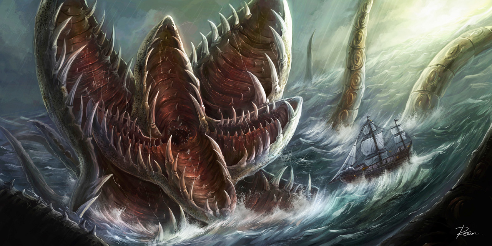

# Das Seevolk {#Seevolk}

Das Seevolk ist eine sehr große, sehr diverse Gruppe. Der Name "Seevolk" ist mehr ein Sammelbegriff als eine Fraktion mit politischen Zielen oder gar irgendeiner Form von Einigkeit. 
Die meisten Landbewohner sind dem Seevolk gegenüber sehr skeptisch. Das liegt vor allem daran, dass das Seevolk, dass nahe den Küsten operiert zumeist als Piraten agiert, Schutzgeld erpresst oder Küstenregionen überfällt.
Allerdings besteht das Seevolk nicht nur aus Piraten und Kriminellen, auch viele Abenteurer, Erforscher und Händler kommen aus den Reihen des Seevolks. 
Was wahrscheinlich niemanden Überrascht ist die Tatsache, dass die besten Seemänner der Welt aus dem Seevolk stammen. 

Das Seevolk ernährt sich zu großen Teilen ausschließlich von der Algenart Krüll, die an fast jedem Material wächst, welche zu lange im Meer ohne signifikante Störgrößen wie Beschleunigung treibt. Diese Pflanze ist anhand der Lebensumstände des Seevolks im Übermaß vorhanden, und obwohl sie den Hunger stillt fehlen ihr gewisse Nährstoffe - weswegen viele Leute aus dem Seevolk an Mangelerscheinungen und damit verbundenen Krankheiten leiden. 

Eine der wichtigsten Ressourcen für das Seevolk ist Baumaterial für Schiffe - meistens Holz - was sowohl für die Wartung als auch für den Bau neuer Schiffe und Städte verwendet wird. Aufgrund der chronischen Materialknappheit wird alles wiederverwendet was wiederverwendbar ist - weswegen man auch für Material welches man auf dem Festland als Schrott bezeichnen würde erstaunlich gute Preise erzielt werden können.

## Die Geschichte des Seevolks

Niemand weiß so genau wo das Seevolk herkommt - aber die aufgezeichnete Geschichte ist eng verwandt mit der Geschichte der Staatenschiffe. Die Staatenschiffe wurden knapp 100 Jahre nach der Ausbreitung der Rah Kari entdeckt - anfangs von den ersten Freiheitssuchenden Sklaven, die dem Asb'Kartes verfallen waren folgenden Jahren von allen möglichen interessierten, die genug Manneskraft und Mut aufbringen konnten um diese Schiffe zu bemannen. 

Das erste Staatenschiff das gefunden wurde, wurde von geflohenen Sklaven der Rah Kari entdeckt die mit gestohlenen Schiffen auf der Flucht vor den Rah Kari waren. Das Staatenschiff war relativ Ufernah für ein Staatenschiff und nur zwei Tagesreisen von der Küste entfernt. Die Sklaven steuerten es an im Glauben dass es sich um eine große Insel handelt, auf der sie sich verstecken könnten.

Doch das, was sie für eine Insel hielten entpuppte sich schnell als ein steuerbares und ressourcenreiches Vehikel, und damit als Asset von unschätzbarem Wert. Sie nannten es nach ihrem Gott Asb'Kartes und beherrschen das Schiff bis zum heutigen Tag. Mithilfe 

### Die Staatenschiffe

### Der Seekrieg

### Der Flottendiebstahl zu Sturmkap

## Bedeutsame Untergruppen des Seevolks 

### Kielhaif

Kielhaif ist eine besonders große Wasserstadt und die wohl größte Siedlung auf See, die kein Staatenschiff darstellt. Dieses Sammelsurium verschiedener Schiffe und mit Schwimmkörpern ausgestatter Gebäude wurde direkt über dem größten Schlachtfeld des Seekrieges gebaut, weswegen viele Schatzjäger von dort aus operieren und der Handel mit Wasseratmungstränken und Tauchglocken mehr als boomt.

### Arkus {#Arkus}

Arkus ist das größte bekannte Staatenschiff und untersteht Großadmiral "".
Es ist der weltweit größte Anbauplatz der Krüllalge und der größte Anlauf und Ablaufplatz für Schiffe. 

Arkus wird oft als das Herz des Seevolks bezeichnet und ist eine riesige Stadt, die aus dem Staatenschiff und daran angebauten Wassersiedlungen, Schiffen und Trümmern besteht. Die Stadt ändert sich ständig und ist daher kaum zu überblicken.
Die letzten Jahre hat sich Arkus kaum von der Stelle bewegt und wird von "" mehr wie eine Stadt geführt als wie ein Schiff. Als der Mittelpunkt des Seehandels gibt es kaum einen Kapitän, der Arkus noch nicht angesteuert hat oder ansteuern musste, und so gibt es nur wenige Güter die man im vollkommen unregulierten Arkus nicht kaufen kann.

Obwohl "" und seine Männer versuchen die Ordnung und Kontrolle in Arkus aufrecht zu erhalten gibt es viele Gangs in den verwinkelten Gassen die ihrerseits versuchen die Macht über verschiedene Territorien zu erlangen und auszuspielen. Manche dieser Gangs sind auch sehr erfolgreich dabei.

### Rahla' Asb'Kartes

Das erste Staatenschiff das gefunden wurde, wurde von geflohenen Sklaven der Rah Kari entdeckt die mit gestohlenen Schiffen auf der Flucht vor den Rah Kari waren. Das Staatenschiff war relativ Ufernah für ein Staatenschiff und nur zwei Tagesreisen von der Küste entfernt. Die Sklaven steuerten es an im Glauben dass es sich um eine große Insel handelt, auf der sie sich verstecken könnten.

Doch das, was sie für eine Insel hielten entpuppte sich schnell als ein steuerbares und ressourcenreiches Vehikel, und damit als Asset von unschätzbarem Wert. Sie nannten es ihrem Gott zu ehren Rahla' Asb'Kartes und beherrschen das Schiff bis zum heutigen Tag.

Mithilfe des Staatenschiffs war es den Sklaven möglich eine sehr schlagkräftige Flotte aufzubauen, die mit Unterstützung von Seiten der Rahla' Asb'Kartes durchaus in der Lage wäre die Flotte der Rah Kari zu gefährden oder sogar zu vernichten. 
Die ehemaligen Sklaven - die sich selbst die Sariva nennen - sind sich dessen sehr bewusst und machen geradezu Jagd auf alle Schiffe der Rah Kari, egal ob Kriegs- oder Handelsschiffe, die unter der Flagge der Rah Kari das Setra-Delta verlassen und aufs offene Meer hinaussegeln.

Aufgrund der Tatsache dass den Sariva jedes Mittel recht ist, um gegen die Rah Kari vorzugehen, werden sie von vielen anderen als gefährlich angesehen und gemieden. Sie selbst sehen sich alllerdings als Helden des neunten Gottes, die gegen das Übel der Sklaverei und der deterministischen Struktur der Gesellschaft der Rah Kari kämpfen. 

Obwohl die Sariva auf See den Rah Kari mehr als ebenbürtig sind, sind sie ihnen auf Land weit unterlegen. Schon viele Sariva sind beim Versuch Städte der Rah Kari oder gar den H'Abunapthra einzunehmen abgeschlachtet worden. Dennoch stellen die Sariva immer wieder Armeen zusammen um sich den Rah Kari zu stellen und den Krieg zu ihnen zu tragen.

Obwohl die Armeen der Sariva nur eine kleine, bestenfalls mittlere, Bedrohung für die Rah Kari darstellen ist der wirtschaftliche Schaden durch die schwere Passierbarkeit und Nutzbarkeit der Setra immens, und so sind die Sariva schon seit längerem ein Dorn im Auge des Reichs des Südens. 

### Sirkali

Die Sirkali wird seit Generationen von der Familie Kristof geführt. Sie hat eine Begleitflotte, die fast ausschließlich aus Langbooten besteht und befindet sich momentan nördlich der Ska'en, wo sie gerüchten Zufolge auf Monsterjagd ist.

[^desmonWOOTFlowerInTheOcean]

Die Familie Kristof ist eine Familie die schon seit jeher mit dem Steuern von Staatenschiffen assoziiert wird - ein Wissen, welches innerhalb der Familie sorgsam weitergegeben wird. So gilt der momentane Kapitän der Sirkali - Erin Kristof - als der beste Steuermann eines Staatenschiffes auf der ganzen Welt. 

Im Kampf gibt es kaum ein Staatenschiff, dass ähnlich gefürchtet ist wie die Sirkali. Diese Reputation hat sich die Sirkali im Seekrieg redlich verdient, als sie sowohl die [Flotte der Arkus](#Arkus) als auch die [Schwarzflamme](#Schwarzflamme) im Kampf stellte, beide Staatenschiffe stark beschädigte und den Begleitflotten schweren Schaden zufügte. So mussten sich beide Schiffe zurückziehen um nicht der Artillerie der Sirkali zum Opfer zu fallen.

> "Ich weiß dass ihr euch Ruhm verdienen wollt, aber sobald irgendeiner sieht, wie sich die Sirkali nähert gebt mir sofort ein Zeichen. Das ist kein Kampf auf den wir uns nochmal einlassen!"
>
> --- Soerf Garaug - Großadmiral der Schwarzflamme im großen Seekrieg

### Schwarzflamme {#Schwarzflamme}

Die Schwarzflamme ist ein weiteres Staatenschiff, das zentral gesteuert wird - und daher eine nicht zu unterschätzende Kampfkraft aufweißt. Zum unlieben jeder konstruktiven Kraft auf dem Meer ist die Schwarzflamme und ihre Begleitflotte allerdings durch und durch eine Piratenfraktion. 

Das Ziel der Schwarzflamme ist es, alle Piraten unter einem Banner zu vereinigen. Damit ist allerings kein Staat oder ähnliches gemeint, sondern einfach nur die Option von allen Piraten auf dem Meer eine Steuer oder eine Form von Tribut einzutreiben.
Allerdings ist es gar nicht so einfach, eine derartig große Aufgabe umzusetzen. Und oftmals vergessen Piraten, die einige Wochen davor Tribut und Folgsamkeit geschworen haben, ihre Versprechen in der Sekunde, in der sie sich nicht mehr in Reichweite der Schwarzflamme befinden. 
Trotz alledem ist die Schwarzflamme eine zurecht gefürchtete Macht auf dem Meer, mit der man sich im Regelfall besser nicht anlegen sollte. 
Die Schwarzflamme hat eine riesige, aber sehr weit verbreitete Flotte, kontrolliert mehrere Wasserstädte und hat mehrere große Galeonen als Flaggschiffe. Die Schwarzflammen-Flotte ist das wahrscheinlich größte stehende Heer des Seevolks.

Im Machtgebiet der Schwarzflamme gibt es auch normales Handwerk und normalen Handel, allerdings ist die Steuer - bzw das Schutzgeld - welches man den Piraten zahlen muss enorm - und so verlieren die meisten Geschäftstreibenden circa die hälfte ihres Einkommens an die Piraten. 

Die Führung der Schwarzflamme wurde vor drei Jahren von Großadmiral Agrin Bost übernommen. Allerdings gibt es ständig inneren Streit darüber wer den Vorsitz haben sollte, und so hat es schon Jahre gegeben, in denen fünf neue Großadmiräle gekürt wurden. So sieht sich Großadmiral Bost immer wieder Machtkonflikten ausgesetzt die es zu bekämpfen gibt, und das Vertrauen in seine Kapitäne und Untergebenen ist notgedrungen sehr klein.

### Die Tartarus

Die Tartarus ist ein Staatenschiff, das weder Zentral gesteuert wird noch effektiv bemannt ist. Dieses Schiff gilt als Schlachtfeld. Seit Jahren versuchen unzählige Fraktionen des Seevolks dieses Schiff für sich zu beanspruchen, und so herrscht ein konstanter Krieg um jeden Zentimeter. Sowohl auf dem das Meer umgebene Schiff als auch auf der Tartarus selbst wird gekämpft - und die Fraktionen versuchen sich jeden möglichen Vorteil zu ergattern.

## Die Gesellschaft der Faction

## Wirtschaftliche Lage

### Die Ressourcen der Faction

## Soziopolitische Lage 

### Herrschaftsystem/Organisation

### Die Beziehungen der Fakion

## Militär der Faktion

## Die Religion der Fraktion

### Totenkult

## Die Legenden der Fraktion

## Individuelle Eigenschaften (Umbennen für jew. Rasse)

Artefakte
Nutztiere
Beastman Beutetiere / Mutationen

[^desmonWOOTFlowerInTheOcean]: "Flower in the ocean" von [desmondWOOT](https://www.deviantart.com/desmondwoot/art/Flower-in-the-ocean-311247641). Dieses Bild steht unter einer Creative Commons Attribution-Noncommercial-No Derivative Works 3.0 License zur Verfügung.

