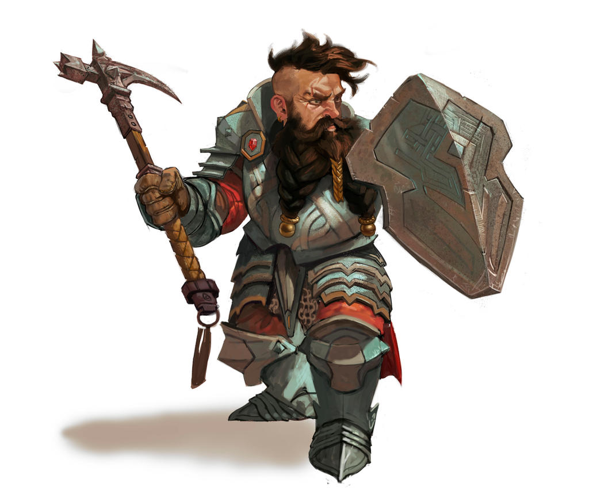

# Die Vulkanzwerge

Das erste und bis heute bekannteste wie größte Zwergenreich. Manche Zwerge mögen behaupten das ihre Tiefenstadt auf einem niveau mit dieser liegen mag, jedoch weis ein jeder im handwerk bewanderte das durch die natürliche Vorteile des Vulkans nur dort wahrhaft meisterliches geschaffen wird.

## Die Geschichte der Faction

[^Künstler]

## Die Gesellschaft der Faction

## Wirtschaftliche Lage

Bingo

### Die Ressourcen der Faction

Bergsalz

Nahrung der Unterschicht Pilze und gewächse die besonders unter wenig licht gedeihen.
Oberschicht trotz ihrer ansiedlung tief im Berg lieben einige Zwerge Nahrungs mittel die im Sonnenlicht gedeihen, diese werden entweder importiert, vor der Stadt angebaut oder sogar durch eine geschickte Spiegel Konstruktion im Berg angebaut. Außerdem werden einige Nutztiere gezüchtet die sich ihre Nahrung mit der Unterschicht teilt.

Heimat des berühmten Zwergenstahls auch wenn heute kaum noch Waffen aus diesem Material da dieses so selten geworden ist, sind sie dennoch die einzigen die es überhaupt zu bearbeiten Vermögen. 

## Soziopolitische Lage 

### Herrschaftsystem/Organisation

### Die Beziehungen der Fraktion
Zu den meisten Völkern Neutral eingestellt, haben sie keine direkten Feinde sind jedoch auch bei vielen nicht besonders beliebt, aufgrund ihrer neigung aus allem finanziellen erfolg erzielen zu wollen.

Wenn auch nicht militärisch verbündet so ist doch davon auszugehen das die Rah Kari den Zwergenclan unterstützen würden da er der Hauptlieferant eines ihrer wichtigsten Kampf utensilien darstellt, den Konstrukten.

## Militär der Faktion

Am heutigen Tag ist eine Zwergische Invasionsarmee kaum anzutreffen.

Die stärke liegt in der Verteidigung

ehrhebliche lokale kräfte in den großen Karawanen genug um jeder lokale machtgefüge ins wanken zu bringen.

Artefakte
Wächter?
Bürgerwehr bereit ihren besitz zu verteidigen

## Die Religion der Fraktion

### Totenkult

## Die Legenden der Fraktion

## Individuelle Eigenschaften (Umbennen für jew. Rasse)

Artefakte
Zwergenstahl

[^Künstler]: "Dwarf" von [Ncorva](https://www.deviantart.com/ncorva/art/Dwarf-764102740). Dieses Artwork steht unter einer Creative Commons Attribution-Noncommercial-No Derivative Works 3.0 License zur Verfügung.
