# Der Blutkult

Die Blutgötter oder oft auch den Blutkult als eine einzige Religion zu beschreiben ist eigentlich eine falsche Angewohnheit. Der Begriff des Blutkultes ist nur ein Sammelbegriff, der die vielen unterschiedlichen Kulte beschreibt, die den Blutgöttern willentlich oder unwillentlich folgen.

Im Gegensatz zu vielen anderen Göttern scheinen die Blutgötter deutlich älter zu sein, da Gelehrte behaupten, bereits in den Schriften der [Vorläufer](#Vorläufer) Hinweise auf den Blutkult gefunden zu haben. Der vehementeste dieser Vertreter war [Alfied Grimand](#Grimand), der letzten Endes auch einen Beweis dafür liefern konnte.

Die Blutkulte liegen grundsätzlich im Twist miteinander, das erstreckt sich vor allem auf ihre Kulte die sich auch gegenseitig Schaden zufügen oder es versuchen.

Während die meisten Blutgötter versuchen in der materiellen Welt Chaos anzurichten und ein Spiel zu spielen dass von sterblichen nicht verstanden werden kann, versuchen andere in die materielle Welt selbst als materielle Form einzudringen - und wieder andere Laben sich einfach am menschlichen Leid oder versuchen andere niedere Bedürfnisse zu befriedigen.

## Der Ruf des Blutes

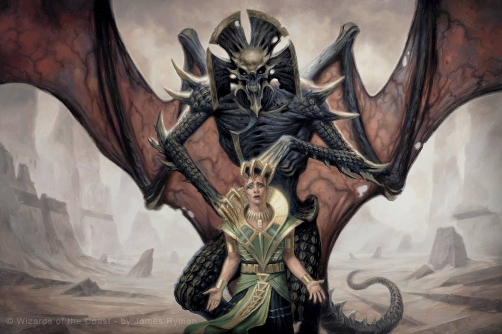

Im Gegensatz zu normalen Religionen können Blutkulte scheinbar aus dem nichts entstehen. Das liegt an einer Fähigkeit der Blutgötter, die mittlerweile als "der Ruf" bezeichnet wird. Der Ruf wird erst erforscht seitdem bekannt ist dass die Blutgötter hinter der ganzen Entwicklung stecken und somit seitdem die Inferata studiert wird. 

Der Ruf des Blutes kann jede Person ereilen, die sich der Blutgott aufgrund von gewissen Merkmalen oder rein zufällig aussucht. Beginnen tut er mit repetitiven träumen, die die Person über Monate verfolgen und nach und nach an den Blutgott heranführen. Später kommen Halluzinationen dazu, dann Schlafstörungen, da die Träume zu schrecklichen Albträumen werden und ein vollständiges Verschwimmen von Realität und Vision/Halluzination. 
Ab hier verfällt das Opfer normalerweise dem Wahnsinn aufgrund der Unfähigkeit diese Reize zu verarbeiten und verfällt dem Blutgott. 

> "Das wirkliche Problem sind nicht die Wahnsinnigen die auf dem Dorfplatz 5-6 Menschen töten, oder sich im Wald erhängen gehen, das wirkliche Problem sind die Kulte die unser Bürgertum und unsere Städte unterwandern, die wachsen und sich verschwören. Diese gilt es auszumerzen"
>
> --- Idran Steinmähre, Inquisitor

Je nach Blutgott verlässt der Gerufene nun sein Leben um sich zu opfern oder einem Kult anzuschließen, begeht mehrere Massakker (das ist der sog. dämonische Wahn) oder verweilt unauffällig in seinem Leben und bildet innerhalb der Gesellschaft Kulte um seinem Gott zu dienen oder der Gesellschaft zu schaden. Laut der Ekklesia ist die dritte Gruppe von Blutkulten die gefährlichste.

## Der dämonische Wahn

Der dämonische Wahn ist heute als die letzte "Stufe" des Rufs des Blutes bekannt. Obwohl der ausbruch dieses Phänomens plötzlich erscheint, geht ihm die lange Reihe an Träumen, Visionen und Halluzinationen vorraus, die man als den Ruf des Blutes kennt. 

> "Der dämonische Wahn ist ein seh auffälliges Phänomen: eine Person mit der man gestern noch reden konnte wird auf einmal unansprechbar und meistens gewalttätig gegenüber allem in seiner Nähe. Eine Vielzahl von gottesfeindlichen destruktiven Akten wird in diesem Zustand begangen."
>
> --- ein frühes Lehrbuch aus Darcy über den dämonischen Wahn

Da der dämonische Wahn aus seiner Natur heraus viele Opfer forderte und einiges an Chaos anrichtete beannen die Kirchen schon früh mit der Erforschung dieses Zustandes, was dazu führte dass - durch die Entdeckung von Grimand - einiges über die Blutgötter enthüllt werden konnte. 

## Die Inferata

Die Inferata ist das zentrale Werk der Blutkulte und gilt als das höchste Heiligtum welches ein Kult besitzen kann. Viele Kulte sind bereit alles zu geben um an eine Abschrift der Inferata zu kommen. Dieses Werk scheint alleine durch den Inhalt - und damit unabhängig von der Form und Sprache in der es vorliegt - bestimmt zu sein und hat damit bestimmte Eigenschaften, die im folgenden genauer beschrieben sind.

Laut der Forschungskommission der Ekklesia über die Inferata stellten sich folgende Dinge heraus:

* Personen, welche die Inferata lesen ohne spezielles Training oder einen außergewöhnlich starkem Willen verfallen beinahe direkt dem Wahnsinn. Selbst resistente Individuen können nur kleine Ausschnitte lesen und müssen dann eine längere Pause machen, ihre körperliche und geistige Gesundheit leidet darunter.

* Eine Abschrift der Inferata zu verfassen kostet außnahmslos den Verstand und verderben den Geist insoweit, dass jede Unterhaltung mit dem Verfasser der Abschrift unmöglich wird. 

* Die Abschriften der Inferata haben einen Einfluss auf ihre Umgebung, der sich in Personen, Natur und Geschehnissen widerspiegelt

Aufgrund dieser Eigenschaften der Inferata weiß niemand einen vollen oder nur signifikanten Teil ihres inhaltes. Dieser Inhalt kann nicht niedergeschrieben werden ohne dass man unabsichtlich eine Abschrift erstellt und damit der eigene Geist vernichtet wird, so können gelehrte nur aus ihrem Wissen zitieren. Nicht viele Gelehrte wagen es die Inferata zu studieren, da man seine Lebenszeit bei intensivem Studium mehr als halbiert - und selbst dann nicht mehr als ein zehntel der Inferata gelesen bekommt.

Obwohl also nur schemenhaftes Halbwissen über die Inferata vorliegt sind sich Gelehrte einig, dass die Inferata alles an Wissen enthält, was es über den Blutkult, den dämonischen Wahn und den Ruf des Kultes zu wissen gibt. Dennoch kann das Wissen kaum bis nicht extrahiert werden, und auch als Nachschlagewerk ist die Inferata nicht geeignet, da die Absenz von Gliederung und Struktur ein gezieltes Aufspüren von Informationen unmöglich macht und den Leser somit nur in den Bann zieht und die Gefahren des normalen Lesens zuschlagen. 

In den letzten 100 Jahren hat die Ekklesia unterstützt von vielen Eldrischen lokalen Kirchen Jagd auf die Inferata gemacht, und - bis auf ihre zwei Archivexemplare - jede Abschrift zerstört, die sie in die Finger bekommen konnten.

## Geschichte des Blutkults

Die Geschichte des Blutkults beginnt damit, dass er erst einmal als existent identifiziert werden musste. Am Anfang war alles was dafür sorgte dass sich Forscher und die Gesellschaft diesem Gebiet widmeten die hin und wieder stattfindenden Massakker, die aus dem dämonischen Wahn resultierten. Die Gelehrten suchten lange und vergebens nach den Gründen für den dämonischen Wahn, weder Ernährung, soziale Isolation oder Schlafmangel konnten identifiziert werden. Der Durchbruch in diesem Bereich kam erst durch einen Gelehrten namens Alfried Grimand.

### Die Entdeckung Alfried Grimands {#Grimand}

Alfried Grimand war ein von Darcy finanzierter Gelehrter, dessen Texte in der Fachwelt große Kreise zogen. Sein Forschungsbereich war die Heilung des "dämonischen Wahns" - wie die Eldrier den Einfluss des Blutkultes vor seinem Bekanntwerden nannten. 

Wie jeder gewissenhafte Forscher untersuchte er zunächst die Schriften nach instanzen und bald stellte sich raus, dass er tiefer graben musste. So kam er in das Forschungsfeld die Texte der Vorreiter zu studieren und wurde einer der wenigen, die in der Lage waren ihre zeichen rudimentär zu übersetzen. 

> "Die Zeichen der Altvorderen sind komplex zu deuten, da viele ihrer Worte, selbst wenn man sie übersetzten kann, keine uns bekannte Bedeutung haben. Dennoch gibt es gerade bei Texten, die den dämonischen Wahn betreffen, oftmals abweichende Zeichen oder Sprachen, die mit der Lingua der Altvorderen nicht übereinstimmen. Diese zu übersetzen ist deutlich schwerer"
>
> --- Alfried Grimand vor seiner Expedition ins Darada Uld

Im Jahre 120 vor Riga kam es zu einer gemeinsamen Expedition von Alfried Grimand und einigen Gelehrten aus dem Herzland. Gemeinsam erforschten sie eine Ruine der Vorläufer welche "Darada Uld" genannt wird. Nach einer knappen Woche von Ausgrabungen erreichten sie eine Kammer, welche sie aufgrund der roten Wände als "rote Kammer" beschrieben. 
Die rote Kammer war übersäht von obskuren Schriftzeichen, die sich von der üblichen Schriftweise der Vorläufer deutlich untersschieden, und Grimand und sein Kollege Konstelianus - einer der Gelehrten aus dem Herzland - widmeten sich sogleich der Übersetzung, während der Rest der Gesellschaft sich weiter den Ausgrabungen widmete. 

> "Anfangs konnten Konstelianus und Grimand keinen einzigen Buchstaben dieser Texte identifizieren, aber umso länger sie die Worte anstarrten, desto einfacher fiel ihnen die Übersetzung, bis sie sogar begannen sich in dieser fremdartigen Sprache zu unterhalten. Sie schrieben und übersetzten so schnell, wie es kaum menschenmöglich schien. Der Sprung von absolutem Unverständniss der Sprache ohne irgendeinen Ansatz zur flüssigen Benutzung ging so schnell dass man fast das Gefühl hatte, der Text wollte von sich aus übersetzt werden.
>
> --- Unbekannter Begleiter der Expedition von Darada Uld

Grimand und Konstelianus widmeten sich immer intensiver der Übersetzung, alsbald verzichteten sie sogar auf Schlaf und Speise - nur um mit ihrer Übersetzung, welche sie immer mehr fesselte, weiterzukommen. So kam es, dass sie innerhalb von zwei Wochen sämtliche Texte an den Wänden übersetzt und niedergeschrieben hatten. 

Als der Rest der Forschungsgruppe wieder zu Grimand und Kostelianus stieß, wurde sie mit einem grauenhaften Bild konfrontiert: Grimand war in einen Wahn verfallen und hatte Kostelianus mithilfe einer Spitzhacke erschlagen und labte sich an an seinem Fleisch, welches über den gesamten Grund drapiert war. Mit Kostelianus und seinem eigenen Blut hatte Grimand verstörende Zeichen an die Wände gemalt. 
Grimands Geist war derart zerrüttet, dass er die Forschungsgruppe bei Sichtkontakt attackierte. Die Eskorte der Herzländer machte allerdings kurzen Prozess mit ihm und beide Körper - oder was von ihnen übrig war - wurden nach den Riten des Allgottes begraben. 
Die Forscher schrieben die Geschehnisse in Darada Uld dem Schlaf- und Nahrungsmangel der Übersetzer zu, sie wussten nicht, dass soeben die erste Abschrift der Inferata geschaffen worden war.

Als die Expedition beendet war ging die Abschrift durch die Hände vieler Gelehrter  - und jedem der sie laß verfolgten Ablträume und Halluzinationen, bis sie schließlich vom Wahnsinn erfasst wurden. Ein Wahnsinn, der sich in vielen Punkten mit dem "dämonischen Wahn" deckt.

### Die Ekklesia und andere Gegenmaßnahmen

Nachdem die Inferata immer verbreiteter abgeschrieben und studiert wurde und die Folgen davon immer klarer wurden, begannen auch die Kirchen sich mit dem Werk zu beschäftigen. Schnell verstanden sie welche Bedrohung von der Ausbreitung der Inferata ausgingen und auch welche Bedrohung die Blutgötter im Hintergrund darstellten.

Die Kirchen reagierten unterschiedlich: Während die Ekklesia eine Privatarmee - die Inquisition - aus dem Boden stampfte und damit betraute, den Blutkult um alles in der Welt auszumerzen, versuchte Darcy eher sämtliche Machthaber und gelehrte in der bekannten Welt über die gefahren der neu entdeckten Sekten aufzuklären.

## Bekannte Blutgötzen

### Sakessa

Sakessa ist eine Blutgöttin, die sich vor allem durch ihre Eifersucht auszeichnet. Ihr ruf gilt fast immer attraktiven jungen Frauen, die sie ob ihrer Schönheit beneidet. Aber auch Männer sind vor ihr nicht sicher, wobei sie hier zumeit Künstler ruft.

Klassisch für den Ruf des Blutes beginnt der Ruf von Sakessa mit Träumen, die die Gerufenen plagen. Bei Sakessa läuft diese Phase allerdings anders ab als bei den meisten anderen Blutgöttern. Die Träume schlagen enorm schnell in Albträume um, in denen Sakessa versucht ihr Ziel mit Stärke und Bösartigkeit versucht zu brechen und zur Unterwerfung zu zwingen. Damit wird der Ruf der Sakessa zu einem geistigen Seilziehen, das solange andauert bis das Opfer von Sakessa aufgibt und sich Sakessas willen unterwirft. Durch den Prozess vernichtet Sakessa große Teile des Lebenswillens des Opfers und höhlt es innerlich aus.

> "Ich gehe in meinen Träumen immer wieder durch unser Haus und sehe die madenzerfressenen Leichen meiner Eltern... meines Bruders. Ich nähre mich von dem faulen Fleisch und es schmeckt so gut wie nichts was ich in meinem Leben bisher gegessen habe. Dann schaue ich mein Spiegelbild im Wassertrog an, doch ich habe nicht mein Gesicht. Das Gesicht das ich habe ist bläulich mit spitzen ekelhaften Zähnen und unvorstellbar hässlich. Und mein Spiegelbild lacht in der selben schrillen Stimme, in der es den ganzen Traum lang immer wieder "du gehörst mir" tönt. Du gehörst mir. Du gehörst mir. Du gehörst mir. 
>
> --- Eine unbekannte Gerufene über ihre Träume

Nachdem Sakessa ein Opfer für sich beansprucht ist der Weg des Opfers meistens sehr sehr kurz. Geführt von Sakessa sucht das Mädchen einen von mehreren geheimen Orten auf, einen Schrein der Sakessa. Dort liegt ein altes Messer. Das Mädchen nimmt dieses Messer und häutet sich damit das Gesicht - schneidet es weg, bis der Schädel frei liegt. Anschließend hängt das Mädchen ihr hübsches Gesicht zu den anderen an die Wand. Erst dann erlaubt Sakessa ihrem Opfer zu sterben. 

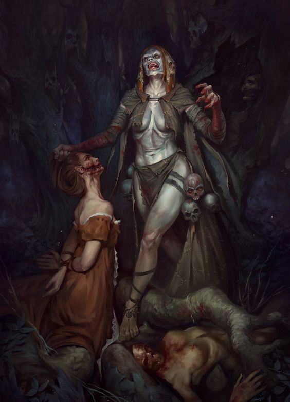

Manche Geschichten erzählen auch davon, dass die Gesichtslosen Frauen den Schrein bewachen und sauberhalten, allerdings wurde das nur selten von Personen, die einen derartigen Schrein entdeckt haben, bestätigt.

In der Folklore ist Sakessa bereits verwurzelt, allerdings weit entfernt von dem eigentlichen Grauen dieser Blutgottheit. In den Märchen des gemeinen Volkes ist Sakessa eine alte Frau, die zu eitle Mädchen nachts klaut und damit nicht mehr als eine Geschichte, mit der Mütter ihren Töchtern aus Erziehungszwecken Angst einjagen.

### Traumblutgott

Iwie sowas, menschen schlafen und dann leid oder tomate

### Jiraad der brennende Gott

Jiraad ist im Allgemeinen als Blutgott des Feuers und der Zerstörung bekannt. Anhänger, Auserwählte oder Opfer, je nach Ansicht, von Jiraad Interferenzen mit den Menschen enden, wie üblich bei Blutgöttern, in das Abdriften in den Wahnsinn und selbstzerstörerischem Verhalten. 

Jiraad ist der mit Abstand bekannteste Blutgott. Seine Kultisten und Anhänger bewahren ihren Verstand und ihre Fähigkeiten zur Wiedergabe von Sprache weitaus länger und bewahren für gewöhnlich ausreichend Verstand um lange unaufällige Bürger des Kaiserreichs zu sein. Dies macht die Anhänger des Kultes zu den vermutlich gefährlichsten Blutkultanhängern.

Jiraad selbst ruft seine Jünger in Träumen und auch häufig bei starkem Fieber. Der Beginn stellt meist einen Blick vor Jiraad dar. Hierbei gibt es immer leicht unterschiedliche Varianten der berichteten Darstellungen von Jiraad.
Teils als Fratze rein aus Feuer, teils als lavaartiger Golem und teils als beinahe Menschengestalt.
Je nach dauer der Rufe verändert sich Jiraads Gestalt hin zum immer flammenbehafteteren und verbrannterem Gesichtern und Landschaften.

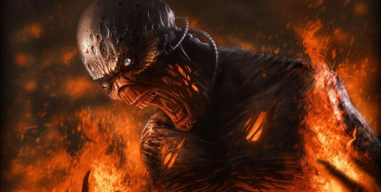

Diese können über die Monate, lebhafte Träume entstehen. Dies ermöglicht den Opfern von Jiraad sich die Zukunft lebhafts vorzustellen und diese Tag für Tag mehr herbei zu sehnen.
Interessanterweise erlernen viele Träumende, welche nicht durch selbst zugefügte Brandverletzungen sterben, wie man Schwarzpulver, Brandsätze und Moltovika herstellt. Die Herstellung erfolgt meist in einem tranceartigen Zustand und veranlasst die Gerufenen teils Tagelang ohne Unterbrechung im Labor zu stehen.
Dies konnte bereits mehrfach von der Ekklesia in Experimenten mit Gerufenen belegt werden.  Gehen die Alchemistischen Zutaten aus werden die Handbewegungen auch ohne Gerätschaften oder Ingridientien durchgeführt.

> "Teufelswerk sage ich euch. Seht ihn euch an. Er versucht ständig Moltovika zu brauen und füllt am Ende die Sprengglasflaschen mit nichts. Das ist doch absurd. Wie sollen wir gegen soetwas gewinnen, das den Menschen den Verstand raubt? Wie sollen wir solche Menschen aufhalten? Ich schlug einen mit einem Stock nieder. Dieser raffte sich einfach wieder auf und braute weiter ohne Zutaten. Ich stach ihm mit einen Dolch in das Bein. Er nahm einen Stuhl und braute weiter bis er ohnmächtig wurde durch den Blutverlust. Es ist als ob der die Inferata gelesen hätte."
>
> --- Hochinquisator Oranius Bahrenjaege bei der Beobachtung eines von Jiraad gerufenen.

Kultisten welche aus den Tranzen erwachen berichten meist von einem zufriedenen Gefühl und wohliger Wärme im gesamten Körper und merken Verletzungen erst im Lauf der folgenden Stunden.

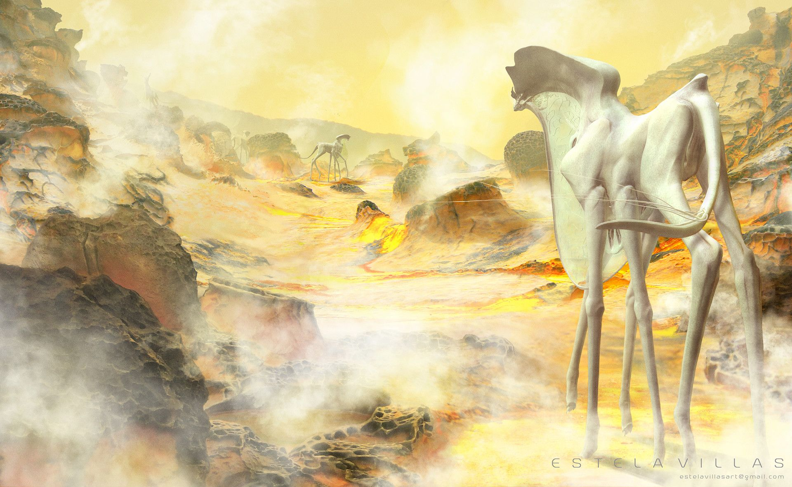 

Die Träume der Kultisten gipfeln meist im gleichen Bild. Hierbei handelt es sich um eine verbrannte Landschaft ohne lebende. Lediglich eine Gestalt welche laut den Träumenden Jiraad ist bleibt in der Umgebung und Sie hören immer wieder die selben Worte. 

> "Endlich hast du die Ruhe und den Frieden nachdem du strebtest meiner treuer Freund. Möge dir diese Welt bleiben."
>
> --- Jiraad zum Träumer

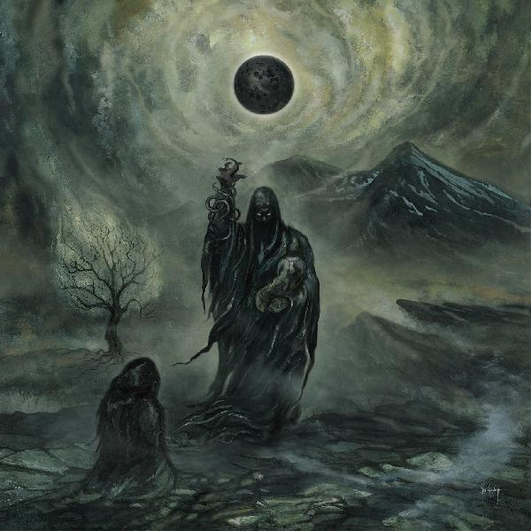

Menschen welche die Endivsion bzw der finale Traum von Jiraad erreichen begehen ausnahmslos Suizid. Häufig dadurch dass sich die Opfer selbst in Flammensetzen.

#### Umgang des Kaiserreiches mit Anhänger von Jiraad

Höhere Mitglieder der Jiraad Anhänger, im folgenden Sekte genannt, weisen meist hohe Alchemistische Fähigkeiten auf und sind, neben der Ekklesia, militärisch gesucht und werden öfters von Kaiserlichen Attentätern und Spionen infiltriert.
Der Grund hierfür ist, das Mitglieder der Sekte häufig Moltovika, oder Brandsätze lagern, wodurch für die Infrastruktur und relevante Gebäude eine massive Gefahr ausgeht.
Die Infiltrationen, welche die Ekklesia, die Kaiserliche Armee, oder in bisher 7 Fällen der Penitius Occulatus durchführte, zielen darauf ab Vorräte an Moltovika, Schwarzpulver oder Brandsätze zu entwenden, oder falls nicht anders möglich zu zerstören.
Hierbei werden, zumindest in früheren Jahren sämtliche Methoden benutzt welche die Zielerreichung, also die Sicherstellung der Spreng- und Brandmittel, ermöglichten.
Hierzu zählen unter anderem Erpressung, Folter, Raub, Inhaftierung, militärische Niederschlagung, Infiltrierung.

Die Erfolgsquote derartiger Aktionen ist nicht bekannt, ebenso wenig wie das tatsächliche Ausmaß der Anhänger von Jiraads in den Bevölkerungsgruppen.

Gelehrte meinen Wellen von Jiraads Träumen in den Bevölkerung zu erfassen welche periodisch alle 17 Jahre wiederkehren. Dementsprechend sind die Ekklesia und der Pentius Occulatus in diesen Jahren besonders aktiv.

Die bisher größte Terrorakt dieser Wahnsinnigen führte im Jahr 453 vor Riga zur kompletten Zerstörung 2er Städte. Hierbei wurden in einer Koordinierten und wettertechnisch günstigen Lage 2 Städte derart zerstört dass der Wiederaufbau nicht mehr möglich wardt.

> "Jiraad brennt. Er ist glaubt man der roten Kammer, der Teufel, er brennt. Er will alles brennen sehen, den nur durch das Feuer werden die Menschen geläutert. Schließlich erhellt er sich über Pyromanen welche nichteinmal durch ihn gerufen werden. Doch verbranntes lässt er nur zurück. Die Seelen seiner Jünger, die Körper seiner Jünger und die Hoffnungen derer welche sich dachten durch gehorsam und Erfüllung Jiraads Wünsche von seinem Fluch zu befreien. Schließlich will die Rote Kammer genau das. Befreien."
>
> --- Alfied Grimand über Jiraad, kurz vor seinem Ableben.

Al-Rumain, wovon die Überreste südlich des Heiligen Rah-Kari Berges H'abunaptra liegen sollen brannte vollständig aus und die Bevölkerung welche zu diesem Zeitpunkt rund 15000 Menschen ausmachte, wurde bis auf 12  Überlebende Familien vollständig ausgelöscht. Als Wüstenstadt, welche als der Fuß der Menschheit bezeichnet wurde, waren Löschaktionen vergeblich. Genaue Angaben über den Hergang dieses Terroraktes in den Ausläufern der grauen Ödnis, fehlen.  Seit der Zerstörung im Jahr 453 v. Riga wurden die Überreste der Stadt mehrmalig untersucht und es konnten weitere nicht detonierte Brand und Sprengsatz Überreste gefunden werden.  3 weitere Expeditionsteams verloren bei der Untersuchung der Stadt einen guten Teil ihrer Männer.

Alt-Haag, welche sich im heutigen Nebelhain befinden würde, wurde ebenfalls 453 v. Riga durch Anhänger Jiraads zerstört.
Alt-Haag war eine ehemalig militärisch befestigte, aber blühende Schwarzmarktmetropole in den damaligen Ebenen des heutigen Nebelhains.
Die Stadt wurde ein Jahrzehnt zuvor bereits mit einer Seuche an Rückenwarzenmaden stark ausgedünnt wodurch, ungünstigerweise vor allem die oberen Ränge der Ekklesia stark ausgedünnt wurden.
Alt- Haag wurde dann im Verlaufe von 3 Wochen derart zerstört, mit geschätzten 700kg Schwarzpulver wie rund 2300 Moltovika.
Eine Hand voll verantwortliche der Jiraad Sekte konnten der Beteiligung überführt und hingerichtet werden. Diese zeigten keine Desillusionierung trotz ihrer Gräueltaten und ihre Haut wies Brandsymbole am gesamten Rücken auf. 

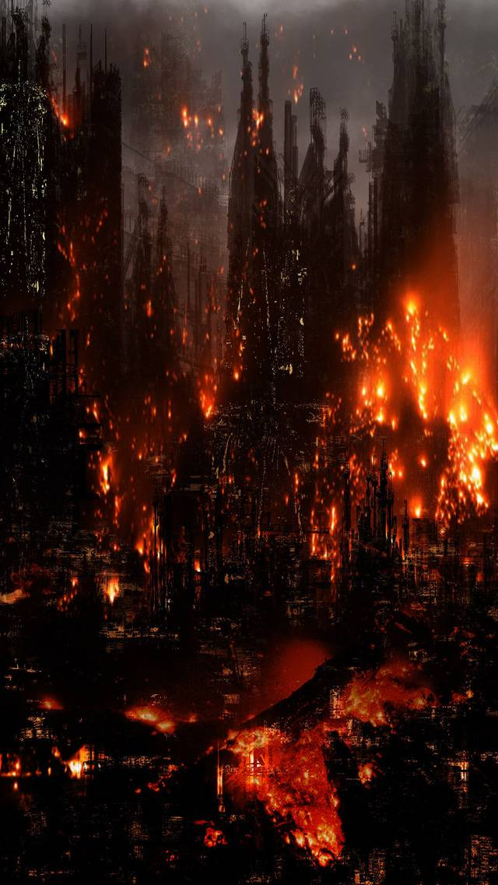

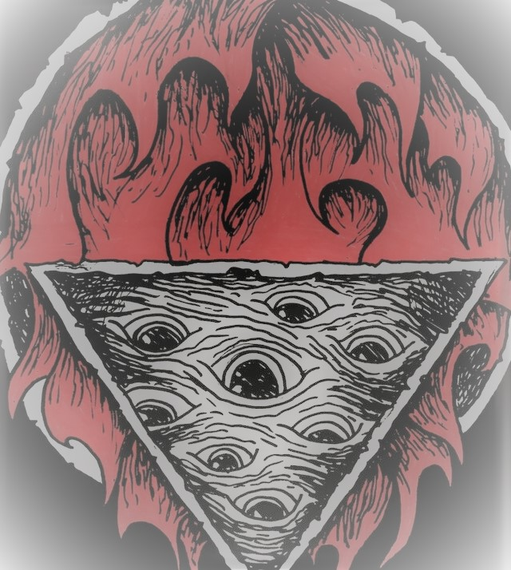  

Der Brand von Alt-Haag löste in Eldria und auch im Reiche der Rah-Kari eine derart große Entrüstung aus, dass sich beide "Reiche" ihre Geheimdiensttätigkeiten koordinierten, wodurch Jiraads Aktivitäten in den folgenden Jahrzehnten dadurch stark eingeschränkt wurden. So wurde effektiv die Aktivitäten Jiraads mittelfristig unterbunden.

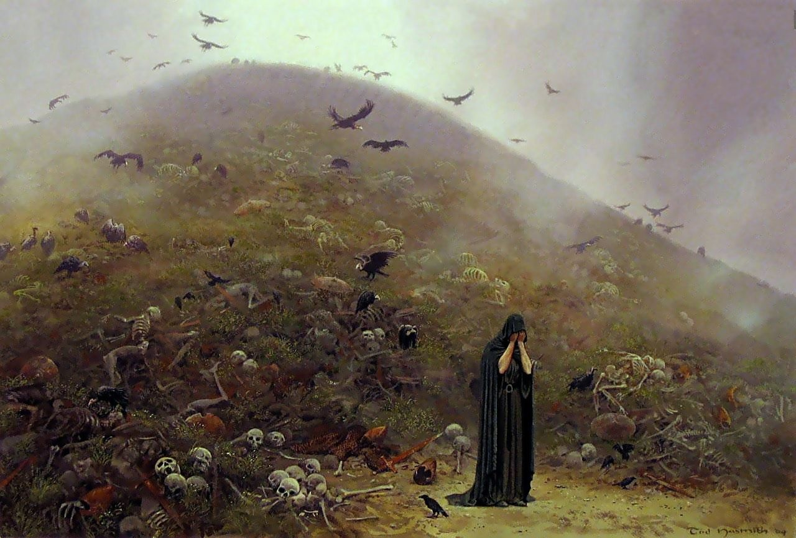

Seit diesem Vorfällen wurde die Ekklesia auf diese Gruppe aufmerksam, welche sich allerdings erst mehrere Jahrunderte später durch Alfred Grimand dezidiert der Auslöschung des Blutgkultes und seiner Abwandlungen widmten. Dadurch wurden die Aktivitäten der Jünger Jiraads auch deutlich reduziert und nebenbei eine günstige Quelle an Moltovika erschlossen.

### Pux-Haik  Herrscher der Pestilenz

Jeder kennt die erkrankten in den Armenvierteln der Städte. Die Armen leiden an allen möglichen Plagen welche der Allgott den weniger Frommen schickt. Jedoch leiden durchaus einige der Betroffenen an den Rufen des Blutgottes welcher als Pux-Haik bekannt ist.
Im Allgemeinen sind die Rufe von Pux-Haik immer an die ergangen welche schon als Kind bereits schwächlicher waren oder durch Krankheit beinahe die Reiche des Allgottes betreten hätten.

Die Rufe des Seuchengottes starten immer mit Träumen von Krankheit, oder Körperlichen Verfall. Hierbei werden die Nächtlichen Einmischungen über die Zeit immer realer und sind, wenn man der Minderheit an Gelehrten über Pux-Haik glauben schenkt, am Ende häufig in einer realen Erkrankung mündend.
Fachgelehrte von Krankheiten meinen hingegen, dass sich Krankheiten teils symptomslos übertragen können, wodurch der Eindruck einer blutgöttlichen Geißelung entstehen kann.

Pux-Haik's gestattet nur sehr wenigen Gerufenen die Möglichkeit die ersten Krankheiten zu überleben. Diese entwickeln nach einer kurzen Krankheitsfreien aber 

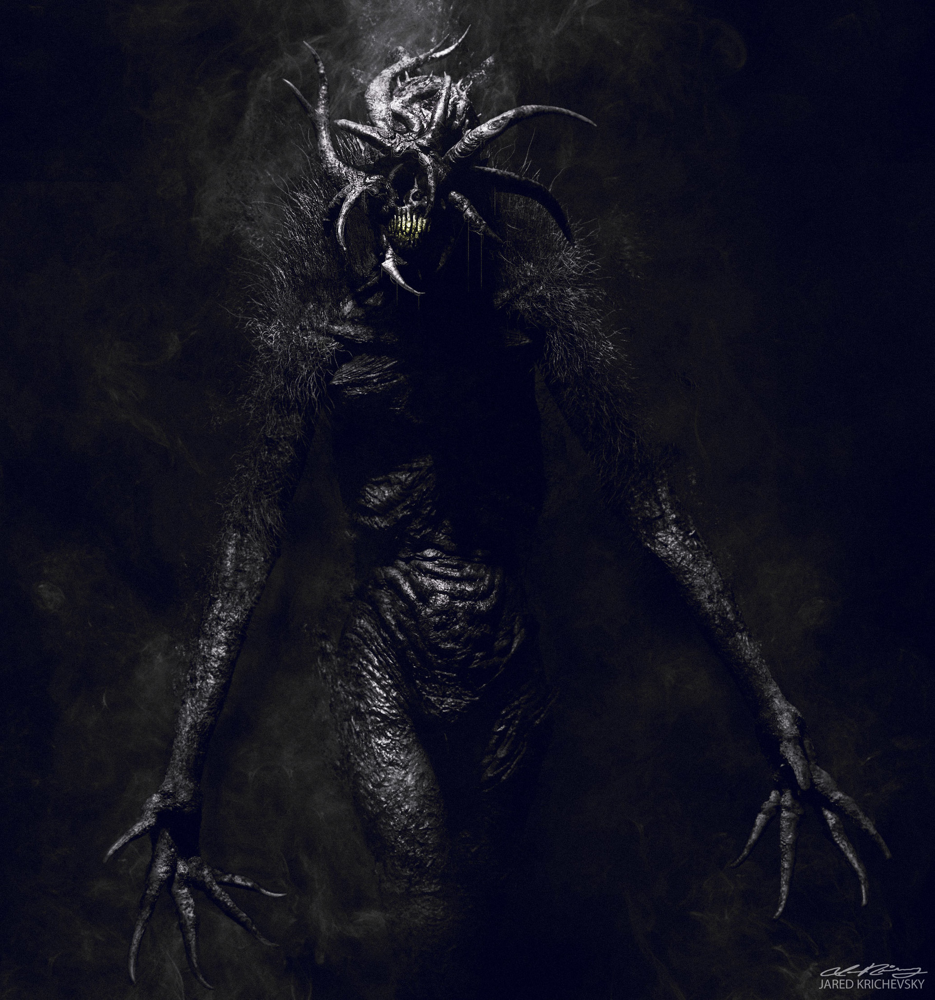 

#### Umgang des Kaiserreiches mit Anhängern Pux-Haik

Das Kaiserreich und die Ekklesia haben offiziell die Anhängerschaft an Pux-Haik, so wie bei allen Blutgöttern, verboten und unter den Strafttatbestand der Blasphemie gestellt, wodurch die Bekennung meist mit einer Todestrafe belegt wird.
Allerdings sind die Anhänger Pux-Haik nicht im herkömmlichen Sinne organisiert und organisieren keine Feste, Feiern oder teuflische Arten von Messen, sondern einige weniger Anhänger verbreiten das Wort Pux-Haik.
Deren Worte stellen allerdings meist für normale, dem Allgott hörigen Menschen, keine logische Struktur sondern treffen eher in Kerbe der normalen Schwachsinnigen.

Laut offiziellen Verlautbarungen der Ekklesia sind vor allem Menschen auffällig die Tiere um sich zu hegen scheinen welche nicht zu den Nutztieren zählen. Genannt werden hierbei Ratten, Fliegen und Schaben. 

Die wenigen Gerufenen welche die ersten Krankheiten überleben werden meist zum Wirt für ihr pestverbreitendes Getier. Hierbei wird der Körper von den Tieren zerfressen und je länger die Gerufenen so leben, desto eher verbreiten Sie ihr Getier, gewollt oder ungewollt.
Dadurch lassen sich rückblickend meist die Pfade der Pestverbreiter rückverfolgen. Am Ende der Pfade finden sich meist die beinahe gestorbenen Überreste der "Menschen". Diese Gegeißelten haben schon Körperteile ihrer Wirtstiere und sind dadurch meist nicht mehr in der Lage sich regulär fortzubewegen oder gewöhnliche Funktionen zu erfüllen.

Da früheren Stadien lassen sich äußerlich allerdings kaum von Gesunden unterscheiden. Die Untersuchung des Stuhles ermöglicht hingegen einen Hinweis auf die Erkrankung, da meist die Tiere, Maden, Fliegen, Käfer oder Schaben im Stuhl lebend vorkommen.
Da die Tätigkeit der Gedärme allerdings nach der rund einwöchigen Phase seinen Tätigkeit einstellt, wird von der Ekklesia meist der Bauch aufgeschnitten um so festzustellen, ob es sich tatsächlich um einen Jünger Pux-Haik's handelt.

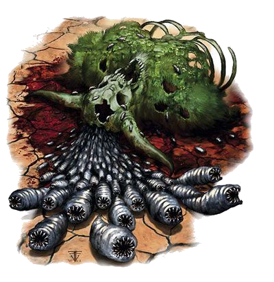 

Die regelrechten Hexenjagden welchen durchgeführt werden, wo meist Unschuldige ihre Leben lassen, zahlen sich aber tatsächlich aus da ein derartig Gerufener rund 200-300 Personen anstecken kann.

### Saath Valar

Saath Valar ist für viele ein Rätsel, im allgemeinen wird davon ausgegangen dass er die Inferata geschrieben hat, und dass er der Vater oder Erschaffer sämtlicher anderer Blutgötter ist. Nur diejenigen, die am tiefsten in der Forschung der Inferata stecken und schon kurz vor dem Wahn stehen wissen überhaupt irgendetwas von Saath Valar, er scheint der mächtigste der Blutgötter zu sein, doch sieht man ihn nirgendwo in der Welt aktiv handeln. 

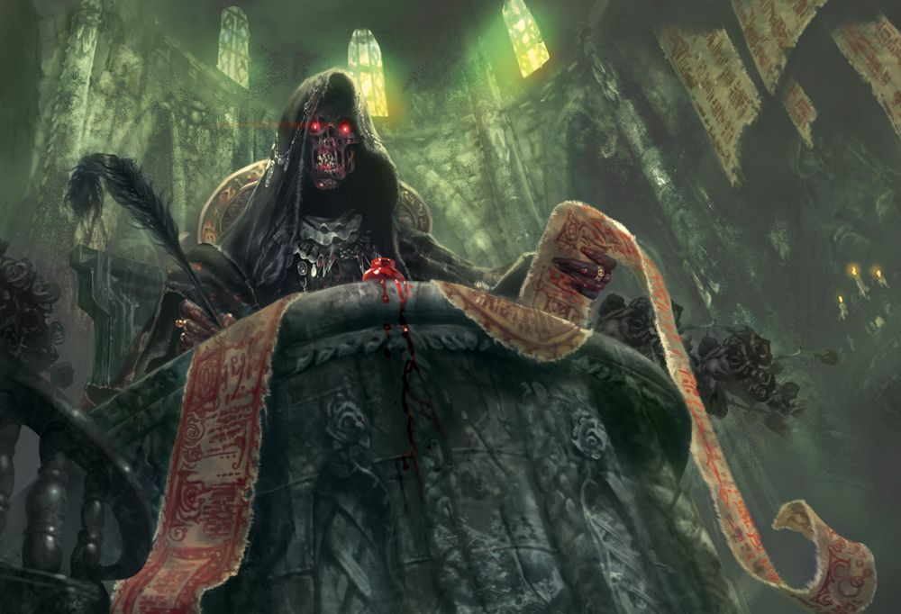

Auch sein Ruf ist sehr ungewöhnlich, er ruft Menschen nicht aktiv sondern passiv. Dies passiert beim Lesen der Inferata durch den Menschen selbst. Der sofort einsetzende Wahn ist nichts anderes als das zerspringen des menschlichen Verstandes an der beinahe unendlichen Menge an Wissen und verworrener Form von Erleuchtung, die in den Leser hineingepumpt wird - dies weiß man, da besonders Intelligente und Willensstarke Personen ein wenig länger brauchen, bis sie dem dämonischen Wahn verfallen. Bis heute ist allerdings kein Mensch bekannt, der dies in für Saath Valar nutzbarer Form überstanden hätte.
Auch ist kein aktiver Ruf durch Saath Valar bekannt, weswegen er außerhalb der Forschung über die Blutgötter keinerlei Rolle spielt. Er bedroht weder Städte noch Menschen, erschafft keine Gefahren und das einzige was man von ihm weiß sind schwer auffindbare Spuren in der Inferata, wo sein Name oft mit den Begriffen "Fall", "Neuerstehung" und "Verrat" in Verbindung gebracht wird.

Durch die erkennbare Abwesenheit Saath Valars in der Welt wird oft davon ausgegangen dass Saath Valar entweder tot oder machtlos ist, und die Inferata in diesem Punkt falsch übersetzt wurde.

### Blutgott der Illusionen

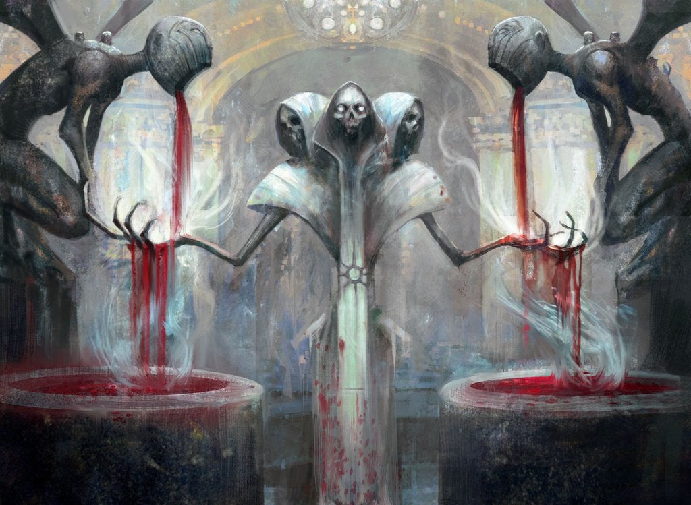

### Hartemus der Sammler

Hartemus ist ein kleinerer Blutgott ohne tatsächlichen Wirkungsbereich. Er wird der Sammler genannt, da er bekannt dafür ist, Mörder und Soldaten zu rufen, die er verwendet um gegen andere Blutgötter vorzugehen.

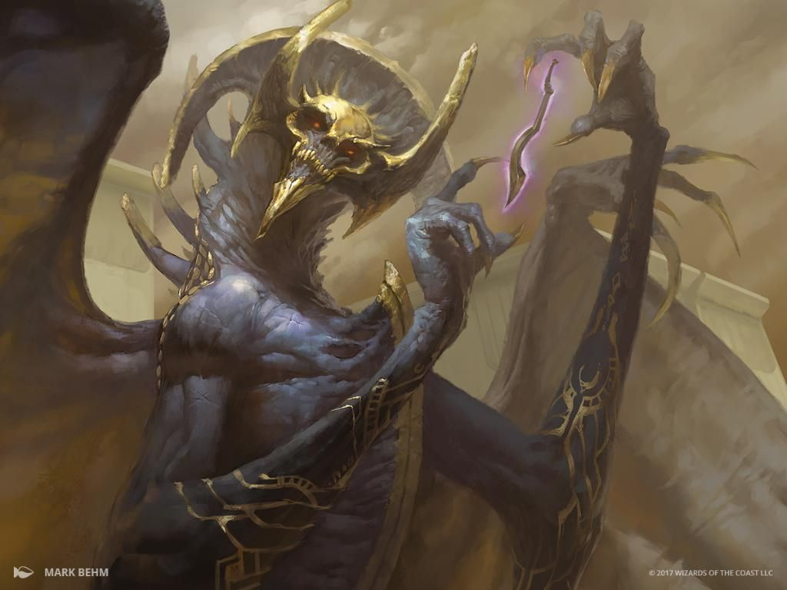

Hartemus ist bekannt für das rufen von Personen, wobei er mehr auf Masse statt auf Klasse setzt. Öfters versammelt er Gruppen seiner Gerufenen, um Schreine und Heiligtümer anderer Blutgötter zu vernichten. Bei derartigen Aktionen sterben oftmals einige seiner Gerufenen, aber Hartemus ist in der Lage schnell neues Kanonenfutter zu rufen. Besonders vielversprechende oder fähige Personen lässt Hartemus auch alleine solche Missionen bestreiten. Umso fähiger ein einzelner Gerufener sich erweist, desto höher wird er von Hartemus geschätzt und desto mehr seiner Gunst kommt dem Gerufenen zu gute. Seine Gaben sind zwar mit denen höherer Blutgötter nicht zu vergleichen, jedoch auch nicht zu verspotten. 

Hartemus Ruf kann man leichter widerstehen als dem anderer Blutgötter, weswegen die Ekklesia die Kulte des Hartemus weniger jagt als andere Blutgötter.

> Anfangs war er stark und das logische Ende für jeden der [Blutgötter], der sich auch nur einen Moment der Schwäche gewährt hat. Er erfüllte seinen Teil des Planes und sorgte dafür dass keiner der [Blutgötter] seinen Platz verließ. Doch schlossen sie sich zusammen und vernichteten alles, was Hartemus stark machte. Heute ist er ein Schatten seines früheren selbst - und die [Blütgötter] sind frei.
>
> --- Auszug aus der Inferata (Das Wort Blutgott kommt in der Inferata nicht vor und wurde deshalb eingefügt)

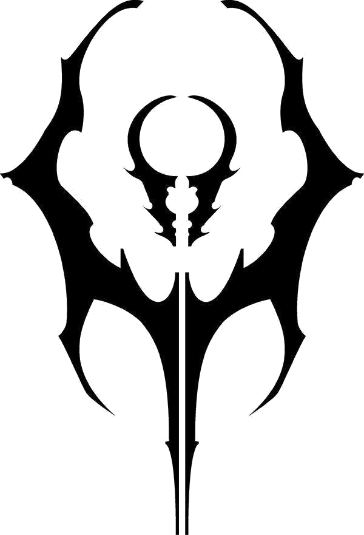

Gerufene des Hartemus werden für gewöhnlich von Hartemus mit seinem Zeichen markiert. Diese Markierung gleicht einem Tatoo und kommt einem Todesurteil gleich, sollte man in die Fänge der Inquisition oder der Hüter gelangen.

### Ga'ar - Mutter der Bestien {#Ga'ar}

Ga'ar ist eine der machtigsten Blutgöttinen, doch während andere Blutgöttinnen in den Träumen ihrer Gerufenen zumindest eine weibliche Form behalten erscheint Ga'ar als riesiges, massives Monster. 

Diese Darstellungsform ist für Ga'ar sehr passend, da sie die Mutter aller Monster ist. Vom kleinsten Ghul bis hin zum gewaltigsten Weltenwurm - sie alle sind Kinder der Ga'ar. Daher trifft Ga'ars Ruf nicht nur Menschen, sondern auch Monster.

> "Wir verfolgten einen Werwolf - so weit kein Problem. Doch bereits bei der ersten Konfrontation mit ihm überraschte und seine Geschwindigkeit und seine Kraft, er riss vier von uns in Stücke und verletzte zwei weitere. Die verletzten starben innerhalb des nächsten Tages an einer Vergiftung. Normalerweise haben Werwölfe kein Gift.
Da die Hälfte von uns - erfahrene Monsterjäger - erfolglos verreckt war, entschlossen wir uns zu flüchten. Doch auf der Flucht wurden wir aus dem Hinterhalt von mehreren Werwölfen unter der Führung unseres Ziels attackiert. Werwölfe sind normalerweise nicht im Rudel unterwegs, da alle von ihnen Alphas sind. Sie haben alle getötet, nur ich konnte in diese Höhle fliehen. Doch ich höre sie kommen, dies wird auch mein Ende sein."
>
> --- Tagebuch von Arug Kauk, Monsterjäger vom Stamm der Tans'end, gesammelt in "Die Düsterwaldlegende"

Diese von Ga'ar ausgewählten Monster entwickeln meist andere Fähigkeiten und Fertigkeiten als ihre Artgenossen, die sie um ein vielfaches gefährlicher und einzigartiger machen. Ein [Großlindwurm](#Großlindwurm)  erreicht seine unglaubliche Größe und Kraft beispielsweise nur aufgrund des Rufes durch Ga'ar - auf eine natürliche Art und Weise wäre dies unerreichbar.

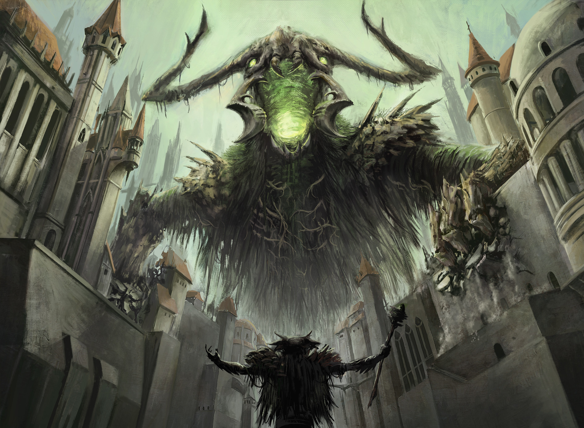

Doch auch die menschlichen Gerufenen Ga'ars sind nicht zu vernachlässigen, oft helfen sie Ga'ar dabei Terror zu verbreiten, indem sie Monster in Städte schleusen, beschützen oder sogar reiten. Manchmal geht der Ruf so weit dass sich Menschen - reversibel und irreversibel - in Bestien verwandeln können und versuchen Chaos in die Welt zu bringen.

Ga'ar ist eine höchst destruktive Göttin, die versucht die Zivilisationen der Menschen weitgehend zu zerstören, dabei hat sie eher einen "mit dem Kopf durch die Wand"-Ansatz, weswegen die meisten ihrer gerufenen Wesen, bei denen es zu Mutationen kommt, an ebenjenen sterben. Sie und ihre gerufenen sind die Gruppe, die von Hartemus und seinen Anhängern am meisten gejagt wird.

### Tunis der Verderber der Innovation

Nur jene die in ihrem Handwerk blühen vermögen dieses leise und schwache flüstern dieses Rufs zu hören, den der Drang nach neuen Ideen lässt sie tief in sich horchen doch was sie dort finden ist nicht immer das was sie erwarten und stammt auch nicht immer von ihnen. Tunis pflanzt den Schatten einer Idee in die Köpfe der unglücklichen. In ihrem Drang diese Idee zu erhaschen und zu erfassen vertiefen sie sich immer weiter in ihrer Arbeit bis diese eine Idee ihr ganzes sein Ausmacht. Erst dann enthüllt ihnen Tunis die Kreation die er ihnen angedacht hat.
Jedweger Logik beraubt bauen sie was auch immer er ihnen vorgibt. 
Nun gibt es zwei Ausgänge: Der erste, weit häufigere, lässt den Geist des Opfers zerbrechen und der damit kommende Wahnsinn zerstört fast jedes konstruktive Geschick des ehemaligen Handwerkermeisters. Tunis bestraft die in seinen Augen makelhaften Gefäße seines Willens damit ein Finales Projekt zu schaffen dessen einziger Daseins zweck darin besteht zu zerstören. Sei es eine Bombe oder ein schäbig zusammengewürfeltes Konstrukt das nicht zögert das Umfeld des Meisters zu töten während der letzte Funke seines Lebens im eigenen Geheul und gelächter erlischt.

Doch jene Gefäße die nicht zerbrechen, deren Wunsch nach Innovation größer ists als alles andere, werden belohnt im Stande seinen Willen wirklichkeit werden zulassen, erschaffen sie Projekte und Techniken die noch nie ein Handwerker dieser Epoche gesehen hat. Doch keine Seele überlebt diese fast direkte Verbindung mit einem Blutgott und so zerbrechen langfristig auch jene auserwählten Gefäße von Tunis letzten Endes an seinem Geist.

Tunis ist wohl einer der bösartigsten der Blutgötter. Der Verlauf seiner Verehrung und seines Rufes ist immer parabelförmig. Zuerst erfährt der Gerufene mehr Innovationskraft, mehr Energie und mehr feinmotorische Fähigkeiten. Doch langfristig pervertiert sich sein Geschick und der Zweck seiner Innovationen immer mehr und schadet alsbald seiner Umwelt. Tunis zu folgen führt allerdings immer ins Verderben. 

Glücklicherweise ruft Tunis sehr selten Personen, aber die die er ruft sind in der Lage großen Schaden anzurichten, und das ohne es selbst zu bemerken.

> "Dieser verdammte Handwerker hat uns alle beschwatzt dass der Bau einer Kanalisation das beste für Cerdem sein wird. Er war genial und hatte einen hervorragenden Ruf, so haben wir ihm vertraut. Als die Kanalisation nach 3 Jahren seiner unermüdlichen Arbeit fertig war waren wir voller Vorfreude - endlich weniger Seuchen in unserer schönen Stadt. Aber dann stürzte die Kanalisation ein, und nahm die ganze Stadt mit sich. Nun ist Cerdem nur noch ein Loch im Boden.
>
> --- Earl Hammond, Graf von Cerdem ca 60. nach Riga

## Die Ausbreitung großer Kulte

## Der Heilige des Kriegs

Das einzige das in dieser Welt zählt ist die eigene Stärke und mit dieser der Welt seinen Willen aufzuzwingen. Um dies zu tun gibt es nur einen Weg, der Stärkste zu sein, doch um dies zu werden gibt es nur einen Weg. Diese immer und immer wieder unter Beweis zu stellen. 

wanderer
kinder diebe (lena bild, darstellung im volksglauben)
Anwärter
wiedergeborene
Anwärter können den Gott wenn sie genug Anerkennung gesammelt haben herausfordern.

Berufung durch den Gott erfolgt durch seine Anwärter, diese Entführen die Kinder und bilden sie zu wahren Kriegern aus und erhalten die erinnierungen eines ihrer Vorgänger wenn sie genug anerkennung gesammelt haben.

Anwärter werden auch gerne von der Armee rekrutiert, jedoch unter dem Vorbehalt keiner einheit untergeordnet zu sein sondern auf dem schlachtfeld ihre gegner frei wählen zu können, doch dies kommt den hohen Militärs nur zu gute den die begehrte Ziele der Anwärter sind meist General oder andere feindliche Truppen die in vorangegangen Schlachten Ruhm erlangt haben.

