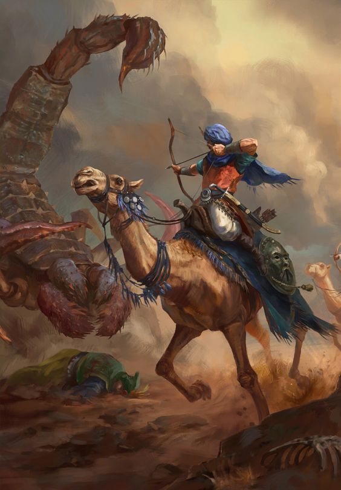
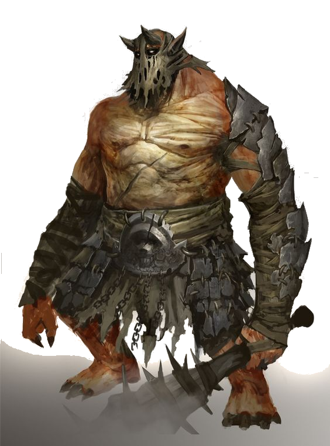
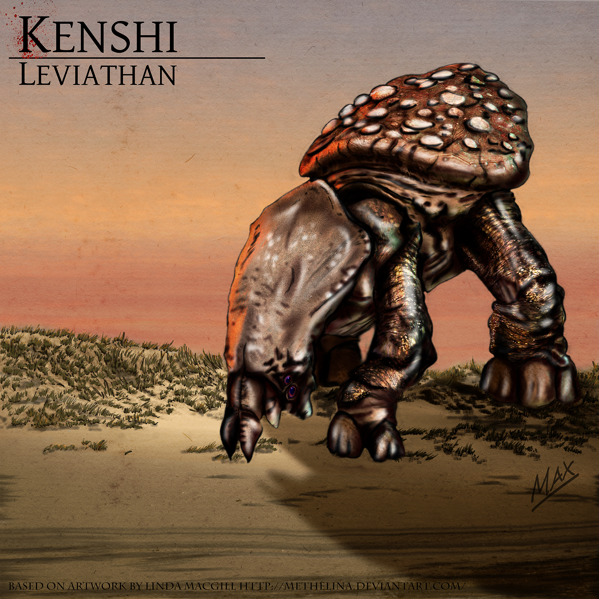

# Monster und andere Abscheulichkeiten

Monstrositäten und Ungeheuer sind für manche Städter bloß Seemannsgarn oder gar den geistigen Absonderlichkeiten so mancher Trinker entsprungen.
Nichts desto trotz gehören Monstrositäten und Ungeheuer - zum Leidwesen aller damit in Kontakt getretenen - zu der Realität in welche uns auch der Allgott gesetzt hat.

Insofern soll diese Abhandlung eine möglichst vollständige Liste der Monster sein welche sich in der bekannten Welt aufhalten.
Bestätigen können wir über etliche Abscheulichkeiten dieser Welt nicht alles. Die kleineren Übel wie Katakane, weibsgroßes Spinnengetier oder Werwölfe sind vielen bekannt, da so manche Monster Jäger schon Häute, Köpfe odr gar ganze Tiere ausgestellt haben.

Das mit der 21 Auflage versehe Buch inkludiert nun den definitiven Nachweis eines Usukats, wie auch den Nachweis eines Katakans und eines Werwolfs im Nordwesten von Nors.

Weiters konnten wir zum ersten Male Nachweise der Brutmutter in Nors Kanalisation aufzeigen durch das auffinden eines leicht verotteten leicht enthäuteten und enthaupteten Exemplars.

Insofern dient dieses Buch, neben Sammlern, Forschern und Reisenden als Sammelwerk.

Insofern eröffne ich mit den Worten von dem Sammler und Forscher welcher den mittlerweile größten Anteil dieses Buches lieferte, aber allerdings durch einen Lindwurm verbrannten Fisitius Lotharin

> "Monstrositäten sind die Strafe des Allgotts. Nur wer Sie studiert, versteht die Strafe des Allgotts dahinter. Inosfern studieret das Getier dieser Welt, auf dass ihr dem Allgott dadurch näher seien könnt!"
>
> ---  Fisitius Lotharin

## Einleitung

Monster gehören zum Alltag der Animali, ist doch ihre gesamte Kultur darauf ausgerichtet Monster zu Jagen, zu töten und zu ehren.

Diese Heiden, leben zwar nicht im Einklang mit dem Allgott, und können so auch nicht in den Himmel auffahren, jedoch haben diese geschickten Jäger, Gerüvhten zufolge Bücher über Monster angelegt und haben ein vermutlich weitaus älteres, umfangreicheres und womöglich korrekteres Wissen über die Abscheulichkeiten dieser Welt.

Um zu gewährleisten, dass die Söhne und Töchter des Allgotts nicht seinen Strafen herfallen helfen neben Gebeten auch das Wissen über diese Monster um vorbereitet zu sein, wenn man sich in deren Gebiete begibt.

Hierbei sei explizit angemerkt, dass Monster auch dem Militär unter Umständen schwere Verluste zufügen können.
So wurden rund 430 Soldaten durch Znitins (riesige, überraschend intelligente Jagdspinnen, beheimatet im großen Elfenwald) beim durchmarschieren durch den Wald getötet oder konnten nicht mehr gefunden werden.

Auch für Holzfäller ist dieses Wissens unentbehrlich, da Sie häufig in Gebiete vordringen welche für diese Monster Rückzugsorte bieten.

Explizit sei erwähnt, dass das Himmelsgebirge und die Graue Ödnis sehr schlecht erforscht sind. Das Wisssen über die dort lebenden Abscheulichkeiten beläuft sich primär auf Aussagen von einzelnen überlebenden Zwergen so wie auf Orkstämme welche regelmäßig in Gebirgen aus religiösen Gründen jagen.

Grob einteilen lassen sich Monster schwer. Zu unterschiedlichst sind die Bestrafungen des Allgotts in ihren Fähigkeiten, Stärken und Schwächen.
Die wichtigste Unterteilung erfolgt zwischen "Bewussten" und "Unbewussten" Monstern.

Erstere sind, der Einstufung der Fachgelehrten entsprechend teils intelligent wie Menschen bzw. jedenfalls so intelligent wie durchschnittliche Orks. Insofern werden "bewusste" Ungeheuer schlichtweg "Sentients" genannt um dies darzustellen. Alternativ, hier ist die Fachwelt geteilter Meinung ist der Begriff Abscheulichkeit als legitimer Ausdruck anwendbar, da "bewusste" Monster vor psychologischer Kriegsführung, Terror und schlichtweg vor absichtlicher Grausamkeit nicht zurück schrecken.

"Unbewusste" Monster agieren viel mehr nach Instinkten und können mit Fallen leicht  überwältigt werden, so man die benötigte Mannstärke und Waffen besitzt. "Unbewusste" Monster werden schlichtweg als Monster oder Ungeheuer bezeichnet.

Speziell erwähnt werden sollten Legenden. Diese Monster sind lediglich aus alten Überlieferungen von Orks, Zwerge oder Elfen belegt. Seit der Erstauflage dieses Werkes vor über dreizehn Jahrzehnten konnte von diesen Legenden kein Nachweis erbracht werden.

## Kraves

Kraves sind eine Plage, welche einem übergroßen Raben ähnelt und sowohl Städte als auch Höhlensysteme bewohnt. Obwohl der durchschnittliche Krave nicht fliegen kann, sorgen die vielen Variationen der Kraven - ebenso wie ihre Bosartigkeit - dafür 

> "Die Zerstörung von Wandia war in vielerlei Hinsicht grauenhaft, aber ebenso grauenhaft waren die Geschichten, welche sich im Nachhinein dort abspielten. Ich selbst sah die Verwandlung, welche einfache Aasvögel in Kraven verwandeln sollte: Krähen, die das verderbte Fleisch von Erwachten verspeißten und immer größer und aggressiver wurden. Alsbald waren sie zu schwer zum fliegen und entwickelten beinahe menschliche Gleidmaßen. Sie ergriffen Waffen und Werkzeuge und fielen über alles her, was sie an noch lebendigem Fleisch finden konnten."
>
> --- Hermetus Korak in "der Fall von Wandia"

## Katakhan

## Brutmutter

Brutmütter sind eine wahre Bestrafung der Augen. Man stelle sich einen bis zur Unkenntlichkeit überfressenen Kahlköpfigen bleichen Menschen vor. Dieser hat rund ein Dutzend Brüste. Gerüchtenzufolge besitzen Brutmütter mehrere Tentakel und nicht benutzbare Hände. die Fortbewegung folgt furchtbar langsam von rund 2 Meter mit einem Satz. Also jeder Mensch kann einfach diesem Monster aus dem weg gehen.

Die Hauptentakeln sind dick, worauf sich schließen lässt, dass man Brutmütter nicht im Nahkampf begegnen sollte. Bis zu 6 weitere Tentakel befinden sich, aus dem Boden ragend in der Nähe der Brutmutter und beschaffen entweder Futter oder verteidigen diese.

Brutmütter gebähren Ghule und können dadurch nach gewisser Zeit eine regelrechte Plage werden.

Über die Schwächen gegenüber Giften oder Feuer ist wenig bekannt.
Es wird empfohlen eine Brutmutter mit der Hilfe von Skorpionen zu erledigen und einer guten Hand voll schwer ausgerüsteter Soldaten.
Man Ziele einfach auf den Kopf der Brutmutter. 
Eventuell zur Verteidigung herbeistürmende Kinder, also die Ghule, sind mit Schwerter und Schilder kein Problem.

Alchemistisch ist keine Verwendung über Brutmutter Ingridientien bekannt.

## Werwolf

Der Werwölf gehören zu den mittelmäßig intelligenten Monstern welche sich, in leicht verschiedenen Varianten in der Welt verteilten und lediglich nicht in Wüstengebieten und der Grauen Ödnis anzutreffen sind.
Das Aussehen der Werwölfe ist meist eine menschenähnliche Statur. Die Körpergröße beträgt im Schnitt 2,2 Meter. Ihre Körpoerbehaarung welche am Rücken und Oberkörper am stärksten ist, ist für gewöhnlich grau bis graublau. Braune Varianten finden sich in Wäldern und Sumpfgebieten des Süden häufiger.

Ihre Körperliche Kraft und Schnelligkeit übersteigt die eines jeden trainierten Orks. Ausgestattet mit rund 5 cm langen Klauen, welche bei älteren Exemplaren häufig zum Teil gebrochen sind, reißen mühelos Menschen auf.

Die Vermehrung der Terretorialen Werwölfe erfolgt zufällig über das gesamte Jahr. Hierbei streifen meist Männchen auf der Suche nach Weibchen umher. Hierbei passiert es häufig, dass Werwölfe auch ihre angestammten Gebiete verlassen und teils in Dörfern gesichtet werden. Bis jetzt sind nur Sichtungen in der Nacht bekannt, wo die Werwölfe durch Dörfer zogen.
Weibchen werfen nach unbekannter Zeitlänge rund 3-6 Jungtiere, welche an ihren Zitzen aufgezogen werden. Die Aufzuchtsdauer beträgt meist mehrere Monate wo das Weibchen häufig von einem Männchen mit zusätzlicher Beute versorgt wird.

Sobald die Jungtiere  rund 11 Monate alt sind, was rund 1,3 Meter Körpergröße entspricht suchen Sie sich im Schutze der Dunkelheit neue Jagdgebiete.

Werwölfe sind anfällig gegenüber Feuer und Giften.

## Lindwurm

Irreführendesweise sind Lindwürmer, nicht mit den Würmern verwandt sondern sind vermutlich Abkömmlinge von Drachen.
Lindwürmer, teils bekannt als Panzerechsen oder Höhlendrachen können in vielen Fällen Feuer speien. Die meisten rezenteren Exemplare welche von Orks erlegt wurden speiten allerdings kein Feuer mehr.

Ihre Haut besteht auf der Oberseite und seitlichen Körperregionen aus dicken Knochenplatten.  Lindwürmer können Körperlängen von bis zu 8 Metern erreichen, alten Überlieferungen zufolge sind bis zu 15 Meter möglich, dies konnte allerdings siet nunmehr 136 Jahren nicht bestätigt werden.

Lindwürmer, sind, im Gegensatze zu den wahrhaftigen Drachen, weniger Intelligent und reagieren tendenziell mehr auf Instinkte. Dies mag geschichtlich auf ihre häufig unterirdische Lebensweise zurückuführen sein, wo wenig Sinn darin besteht vernünftig zu agieren.
Lindwürmer sind in der Lage, so wie viele Höhlenbewoner im dunkelen zu sehen.  Grelles Tageslicht hingegen blendet sie, wenn man den Berichten von Orks glauben schenkt.

Über die Reproduktion von Lindwürmern ist wenig bekannt. Jungtiere konnten bis jetzt nich gefunden werden, was an den vielfach unerforschten Steinwurmgängen liegt welche teils mehrere Meter senkrecht in die Tiefe führen. In der 136 jährigen Zeit seit der Erstaufalge dieses wunderbaren Werkes konnten lediglich 7 Fälle nachgewiesen werden wo Lindwürmer  mit Artgenossen kooperierten.

> "Die Bestrafung der gierigen Zwerge sollet der Lindwurm sein! Schmelzen soll er die, welche der Gier einherfallen und nicht im Antlitz der Sonne weilen."
>
> ---  Auszug aus dem Werk von Pater Sistan Erindan - Das Leben der Zwerge - eine nicht heretische Abhandlung

Orks, welche den Großteil der Lindwurmkenntnisse besitzen nutzen, falls es sich um Feuerspeiende Lindwürmer handelt, meist Lindwurm Haut zum Schutz und schnelle und gezielte Angriffe auf die Unterseite des Lindwurms. Vorzugsweise Nutzen Orks hierbei zweihändige Kriegshämmer und lange Knochenspeere aus den Knochen von Lindwürmern.
Zuerst provoziert man den Lindwurm zum Feuerspeien und versteckt sich hinter der Lindwurmhaut. Hat der Lindwurm seine Feuerreserven aufgebraucht, welche runde 30 Sekunden durchspeiendes Feuer  erlauben, versetzt man dem Lindwurm Speerstöße. Diese dienen den Lindwurm weiter zu provozieren. Anschließend können mehrere Orks mit Kriegshämmern auf den Lindwurm aufspringen und mit Hammerschlägen seinen Schädel bearbeitet. Dies tötet den Lindwurm nicht, jedoch desorientiert es den Lindwurm woraufhin mit Speeren dann tatsächlich die Unterseite des Kopfes und des Halses angegriffen werden können.

Speziell erwähnt werden sollte die beobachtete Tat eines Orkstammesführer Names Gra-Ash-Tark. Dieser war in der Lage mit einem einzigen Hieb seines 60 Kilo (!) schweren Kriegshammers einen Lindwurmschädel einzuschlagen- was den Lindwurm sofort tötete.

## Drache

Drachen sind seit jeher aus Sagen des gemeinen Volkes bekannt.
Es gibt, wenig über Drachen zu erzählen, da die meisten über die letzten Jahrhunderte fast vollständig verschwanden, 
was manche Gelehrten mit der Territorialität der Drachen in Verbindung bringen.

Drachen sind intelligente, mit teils 25 Meter Flügelspannweite fliegende Panzerechsen. Die Färbung von Drachen ist im allgemeinen extrem variabel. Lebende Exempalre waren in Farben von Obsidianschwarz hin zu beinahe weißen Varianten zu beobachten, wie man der Darstellung unten entnehmen kann.
Sie sind extremst territorial und Paarungen sind nicht beobachtet, jedoch konnten bisher insgesamt 14 Dracheier gefunden bzw entnommen werden. Das Ausbrüten dieser war in jedem Fall unerfolgreich.

Drachenjungtiere werden, laut dem uns spärlich bekannten Wissen, meist Jahrelang von ihrer Mutter beschützt - teils in extra aus Gestein geschmolzenen Nestern.

Drachen ernähren sich von beinahe allem was naiv genug ist sich ihm entgegen zu stellen. Hierzu zählen Lindwürmer, Steinwürmer wie auch  ein Kampf zwischen einem Aschwurm und einem Drachen bekannt war welche in einem unentschieden endete, da der Aschwurm sich zurück unter die Oberfläche zog.

### Wahre Drachen {#WahrerDrache}

Wahre Drachen sind mit bloßem Auge nicht von normalen Drachen zu unterscheiden, wobei ein wahrer Drache ungemein gefährlicher ist, da er in der Lage ist Feuer zu speien. 
Zum Glück sind wahre Drachen noch seltener als herkömmliche, so gibt es nur noch 4 bestätigte wahre Drachen in ganz Orbis Astea, wobei der bekannteste in [Vandia](#Vandia) wohnt, einer im Himmelsspitzen-Gebirge und man es bei den anderen nicht genau weiß.

Das Feuer eines wahren Drachen ist seine gefährlichste Waffe. So konnte ein einzlner Drache geschätzt 60 Sekunden durchgehend Feuerspeien, ehe dieser abzog. Die Flammen des Drachen sind unter Umständen in der Lage Eisen zu schmelzen. Insofern wird bei einer Begegnung mit einem wahren Drachen abgeraten mehr als umbedingt nötig mit sich zu tragen und am Besten die Beine in die Hand nehmen und das weite suchen statt zu kämpfen.

## Skrogan Skorpion {#Skrogan}

Ein Skrogan Skorpion ist eine große Bestie, ein große Skorpion, der in Eid' Rah Kari heimisch ist. Fast alle Fernkampfangriffe - ebenso wie viele Nahkampfangriffe - sind gegen seinen Panzer wirkungslos. Ebenjener Panzer wird von den Rah Kari oft benutzt, um Rüstungen für besondere Einheiten wie Helden oder Generäle zu fertigen.

Wilde Skrogan-Skorpione sind mittlerweile selten geworden, da die Rah Kari sie wegen ihrer Rüstungen jagen oder sie für den Dienst in ihren Einheiten domnestizieren. Skrogan Skorpione sieht man häufiger in den Armeen der Rah Kari. 

Skrogan Skorpione sind im Gegensatz zu ihren Verwandten, den Silurian-Skorpionen, aüßerst schwerfällig. So ist es für den durchschnittlichem Menschen möglich, einem Skrogan-Skorpion zu Fuß zu entfliehen. Deswegen schlagen diese Skorpione meistens in für sie vorteilhaftem Terrain zu. Sie bevorzugen es in Kuhlen oder sehr großen Löchern zu leben, in denen die Steigung oder die Wände ihre Opfer an der Flucht hindern. Sie verfolgen ihre Opfer über mittlere Distanzen, was sie anfällig für Köder-Strategien macht.

## Silurian Skorpion

Silurianskorpione, sind im eigentlichen Sinn keine Skorpione sondern eine scheinbar sehr alte Variante davon.

Die Siluriansskorione kommen beinahe ausschließlich in Wüstengebieten vor, sind jedoch teils in der Grauen Ödnis anzutreffen. Sie werden, je nach Alter bis zu 3,5 Meter lang.

Silurianskorpione sind Einzelgänger und treffen sich nur zur Paarung.  Die Eier werden nicht bewacht und sind gekocht genießbar.
Die Monster sind nicht intelligenter als allgemeines Insektoides Getier und können für gewöhnlich mit Fernkampfwaffen verletzt werden, so dass sich diese wieder in den Sand zurückziehen.
Ihre Färbung entspricht meist dem örtlichen Sand wo sich diese teils langsam grabend fortbewegen. Ihre Sicht ist schlecht, allerdings sind Sie extrem feinfühlig gegenüber Vibrationen.
Ihr Gift ist nicht besonders toxisch, allerdings sind die Mengen unheimlich hoch - bis zu einem halben Humpen Bier!

Die Skropinoe sind gegenüber Feuer quasi nicht verletzbar und können so NICHT mit Moltovika oder brenndem Öl bekämpft werden. Moltovika desorientieren allerdings die Skorpione wodurch es möglcih ist mit Speeren die Skorpione zu erlegen.
Ihr Fleisch ist, trotz Verhältnismäßig Rarität in den Städten der Rahkari extrem begehrt und kann pro Kilogramm umgerechnet 4000 Reiks kosten.
Ihr Körperpanzer kann hervorragend als mittlere Rüstung verwendet werden und ist fabelhaft leicht. Allerdings kann man ohne Ersatzpanzer diese Rüstung nicht warten.

Silurian Skorpione fallen primär einsam herumwandernde Wesen an und so empfiehlt sich mindestens zu viert oder zu fünft durch Siluriangebiet zu streifen.

 

## Gravis 

Ein Gravis ist eine nicht wirklich als Monster einordenbare Kreatur, da allerdings keine bessere Einordnung für sie gefunden werden kann stehen sie in diesem Buche.

Ein Gravis ist ein monströses Getier, das intelligent genug ist um in einer Sozialstruktur zu leben und einfache Kommentare und Anweisungen von Menschen zu verstehen. Dies geht so weit, dass teilweise wirkliche Konversationen mit Gravi geführt werden können. Allerdings trifft es Konversation nur so halbwegs, da die Stimmbänder eines Gravis nur unverständliche Brüllgeräusche erzeugen können und die Konversationen daher eher einseitig sind. Dennoch verstehen Gravis Menschen zum Teil, was man an ihren Reaktionen sieht. 

Ein Gravis zeichnet sich zurch zweierlei Dinge aus: Horrende Kraft und eine beinahe übernatürliche Reaktionsfähigkeit. Ihre ohnehin dicke und ledrige Haut erholt sich in kürzester Zeit sogar von tiefen schnitten und wunden, was sie zu unglaublich gefährlichen Feinden macht, die mit Keulen in übergröße ausgestattet ganze Battalione einfacher Soldaten zerschmettern können. 

Ein Gravis hat, wie bereits angemerkt, eine sehr dicke, fast rüstungsgleiche Haut. Aufgrund ihrer "Kommunikationsfähigkeit" und ihrer offensichtlichen Vorteile im Feld werden sie gerne von Söldnerkompanien eingesetzt, die die als Frontbrecher verwenden. Einen Gravis in der Kompanie zu haben ist ein seltener, aber mehr als entscheidender, taktischer Vorteil. Daher rüsten viele Kompanien einen Gravis mit zusätzlicher Ausrüstung aus, um noch mehr Nutzen aus ihm zu kitzeln.
Hierbei ist zu erwähnen, dass die Kaiserliche Armee keine Gravis in ihren Rängen erlaubt, da sie laut der Ekklesia "unheilige Kreaturen" sind.

Doch warum sollte ein Gravis in einer menschlichen Armee dienen? Laut der Forschung von Primus Lauthaus ist eine große Menge an funkelnden Objekten ein Paarungsgebot der Gravi. Ein potentieller Partner wird das Angebot eines anderen Gravis nur akzeptieren, wenn er genug funkelnde Objekte hat um ein guter potentieller Partner zu sein - und menschliche Münzen oder Schätze sind großartige funkelnde Objekte. Daher ging Leithaus davon aus, dass für viele Gravis sich eine Anstellung mehr ausgezahlt hat als andere Methoden um an "Funkelzeug" zu kommen. Interessant ist auch dass das Funkelzeug nach dem Paarungsgebot für Gravi jede Bedeutung verliert und daher einfach mitgenommen werden kann.
Die Theorie von Lauthaus fußt auf der Untersuchung gestohlener Objekte bei Gravis-Überfällen von Dörfern, die nahe ihrer Habitate liegen, ebenso wie von Beobachtungen von Gravi auss der Ferne. Allerdings ist diese Theorie eher umstritten und ihr steht die Theorie der Ekklesia gegenüber die besagt, dass Gravi ein zeichen des Allgott seien, dass der Mensch sich sogar große Monster zu Untertan machen kann (Aufgrund dieser theoretischen Differenzen wurde Leithaus schlussendlich auch der Häresie überführt und von der Inquisition hingerichtet).
Laut Lauthaus leben die Gravi als Einzelgänger, bis sie ihr Paarungsgebot an einen anderen Gravis richten. Sollte es angenommen werden leben Gravi den Rest ihres Lebens friedlich und Monogam zusammen. Aggresivität ist nur beobachtbar während sie in der Jugend - also auf Partnersuche - sind.
Geschlechtlicher Dimorphismus konnte bei Gravi nicht beobachtet werden und es ist fraglich ob es überhaupt Geschlechter gibt, da über ihre Fortpflanzung so gut wie nichts bekannt ist. 

Gravis-Habitate wurden vor allem in Wäldern mit nahen Flüssen und hoher Feuchtigkeit gefunden.

## Steinwurm

> "Brich Stock und Stein, 
wenn du fällst in ein Steinwurmloch hinein. 
>
Freu dich nicht,
denn bald hast du Steinwurmsäure im Gesicht."
>
> ---  Gedicht über den Steinwurm

Steinwürmer gehören zu den größeren Ende der Wurmartigen Monster.
Steinwürmer werden biszu 14 Meter lang und leben obligatorisch unter Tage.
Sie fressen keine Tiere sondern ernähren sich von speziellem Gestein welches sich als grün floureszierende Masse teils die Gänge von den Steinwürmern beleuchtet.
Steinwürmer sind selten anzutreffen und ihre Gänge meist älter als die Gründung des Kaiserreichs.

Sie besitzen keine Augen und graben sich mit ihren unheimlich Harten Vorderzähnen und der Zuhilfenahme ausgestoßener Säure erstaunlich rasch durch das Erdreich und Gestein.

Steinwürmer sind für einen guten Teil der Höhlen im Himmelspitzengebirge und in den Gebirgen um das Bermatal verantwortlich.
Es wird nicht empfohlen den Gängen dieser Würmer zu folgen, da man ab einer gewissen Tiefe auf schlafende Exemplare treffen kann, welche gereizt auf neugierge Forscher reagieren. 
Zumeist sind ihre Schlafkammern durch rund 12 Meter, beinahe senkrechte Tunnel gekennzeichnet. Dies dient, laut Lehrmeinung, dazu dass Lindwürmer hier keinen Zugang finden und so nicht deren Beute werden können.

Steinwürmer besitzen im allgemeinen weiche Körperoberflächen was ihnen das navigieren durch natürliche Höhlen oder engere Felsspalten erleichtert.

Über die Reproduktion ist nur bekannt dass sie lediglich 3 Eier großen gelege meist von 2 Muttertieren bewacht werden.

Ihre Intelligenz ist mangels wissen schwer zu beurteilen.

 

## Aschwurm

Aschwürmer sind endemisch in den Vulkanisch aktiven Gebieten von Wurmfall - welcher den Namen durch die Aschwürmer gefunden hat.
Aschwürmer sind die größten Monstrositäten in der gesamten bekannten Welt. Körperlängen von 40-50m wurden berichtet. exakte Vermessungen gibt es natürlich nicht. Knochenartige Überreste deuten jedoch auf teils weitaus längere Exemplare hin.
Aschwürmer haben ihren Namen durch ihre dunkle und überaus Dicke haut, welche ihnen erlaubt selbst durch flüssiges Gestein, Lava, zu kriechen. Obwohl sich die Wurmaktivität primär auf die Phasen vulkanischer Inaktivität beschränkt konnten mehrere unabhängige Berichte von geringer Wurmaktivität während der vulkanischen Phase Wurmaktivität an der Oberfläche beobachten.
Hierbei sind auch die 7 Beobachtungen von Angriffen durch Drachen auf Aschwürmer entstanden. Hierbei sollte angemerkt werden, dass die Drachen in lediglich einem Fall erfolgreich waren da es sich um ein Augenscheinlich bereits verletztes Tier handelte, welches durch eine nahegelegne Vulkanexplosion - untypisch für die Schildvulkane der Region - einen riesigen Gesteinbrocken von 15 Metern auf den "Kopf" des Wurmes schleuderte.

Aschwürmer sind jedoch, wie erwähnt, primär aktiv während der vulkanischen Ruhephasen. Hierbei durchfressen und durchwandern diese die ausgekühlten Lavagänge und Oberflächen. 
Die Nahrung der Würmer besteht, wie auch bei den Steinwürmer primär aus speziellen floureszierendem Gestein welche diese auf unbekannte Art und Weise verarbeiten.
Die rund alle 12 Jahre auftretenden stark Regenfälle von Wurmfall, vermutlich bedingt durch vulkanische Gase, veranlassen die Wurmaktivität zu steigern.
Hierbei können die Würmer häufig bei aufsaugen riesiger Wassermengen beobachtet werden. Hierbei wird auch meist die nach den Regenfällen blühende und sprießende Vegetation verzehrt.
Während dieser Zeit ist das durchwandern der Wüste ein Unterfangen, dass nur von Allgott verlassenen unternommen werden sollte.

Aschwürmer vermehren sich vermutlich über das ablegen von Eiern, jedoch sind bis jetzt keine Eier gefunden worden, geschweige denn Jungtiere. 
Aschwürmer besitzen am Kopf, in gewisserweiße ähnlich wie Steinwürmern "Zähne" mit welchem diese vermutlich Erdreich aufbrechen und Verspeisen. 
Aschwürmer sollte man, wenn man es überhaupt schafft, auf keinen Fall provozieren. Provokationen der Aschwürmer werden primär durch umhertramplende Massen an Lebewesen ausgelöst. So werden sich verirrende  Bermatalbüffelherden - welche beim Ergrünen der Vulaknischen Wüste hineinnwandern, meist von den Würmern erdrückt, erschalgen oder gefressen.

Dementsprechend wird abgraten mit Armeen größer als 20 Mann während der vulkanischen Ruhephase, also der Aktivitätsphase der Würmer zu durchwandern.

Es wird angenommen, dass Menschen keine Waffen besitzen welche den Aschwürmern Schaden zufügen könnte, da nichteinmal Drachen diese verletzen können.
Insofern ist es nicht verwunderlich das wir keine Belege für natürliche Fressfeinde von Aschwürmern vorliegen haben.

 

### Weltenwurm {#WeltenWurm}

Weltenwürmer sind mehr Legende als regelmäßig beobachtete Monster. Sie sind besonders riesige Aschwürmer, die deutlich tiefer graben und durch deren Tunnel ganze Kohorten nebeneinander hermarschieren können. Glücklicherweise kommen sie so gut wie nie an die Oberfläche.
 
## Znitins
riesige, überraschend intelligente Jagdspinnen, beheimatet im großen Elfenwald)

## Dunkleosteus

9 meter langer Panzerfisch

## Riesenkalmar

## Riesenvaran

## Usukats

## Leviathan

Ein Leviathan ist eine riesige, turmhohe Bestie von solcher größe, dass sie einen ganzen Trupp Männer unter ihren eisernen Füßen zerquetschen kann. Sie sind nicht-aggressive Wesen, die nur zur Selbstverteidigung oder zum Schutz ihres Partners und/oder ihrer Jungen angreifen.

Normalerweise greift kein geisti gesunder Mensch diese Monster an - bis auf einige Jäger, die sie wegen der wertvollen Perlen, die sich in ihren Köpfen befinden jagen.  Außerdem versuchen manche Animali-Stämme, diese Bestien für ihre Rituale zu töten.
 
Wenn man diese Kreaturen töten will, dann ist die beste Idee, sie in ein Gelände zu locken, wo ihre riesige Größe zu ihrem Nachteil gelangt. Da normale Bolzen oder Pfeile - aufgrund ihrer dicken Haut und der Menge an Fleisch, die durchbohrt werden müssten, um in die Nähe ihrer Organe zu gelangen - so gut wie keine Wirkung haben, ist die Jagd auf einen Leviathan selbst unter besten Bedingungen ein mehr als schwieriges Unterfangen.

Die Leviathane leben im Eisland, aber durch ihre geringe Reproduktionsrate in Verbindung mit der aggressiven Bejagung durch einige Stämme der Animali ist ihre Zahl über die Zeit geringer geworden.

> "Meine Männer und ich sollten uns um einige lästige Piraten kümmern, die in der Nähe unserer Küsten plünderten. Als wir sie endlich gefunden hatten, war die Hälfte der Piraten bereits abgeschlachtet, während die andere Hälfte versuchte, gegen einen Leviathan klarzukommen. Ich weiß nicht, was die Idioten dachten, vielleicht wollten sie die Perle in seinem Kopf, aber eines war sicher: Unsere Bemühungen waren nicht nötig. Der Leviathan würde den Job ohne unsere Hilfe zu Ende bringen."
>
> --- Titus Serenius, Quartiermeister von Sturmkap 

## Blood spider

Has the size of a typical giant rat, but the looks of a proper typical poisonous Appochis spider with blood red skin. These creatures will spit acid at their targets and if within range they will jump on them to suck their blood. They can be found in Nebelheim.

## Land bat

A mutated version of bats that have migrated out of caves. These creatures a still blind like their ancestors but have lost their ability of flight. However, to cope with their new surroundings have mutated into having multiple new and large muscle groups. They are mostly found outside near caves around the mountains of Himmelspitzen and will mostly be seen in groups. Unlike their predecessors have they grown to be hostile against most creatures that they deem a treat. 

## Acid raptors

These small raptors have large pockets of acid on their back and forehead, which can easily burst upon contact. They will aggressively run to any creature that enters their territory. They are mostly found around rivers in Grenzland and  the southern parts of the Herzland, where they will bath in the water to keep a neutral pH level.

## Legenden

