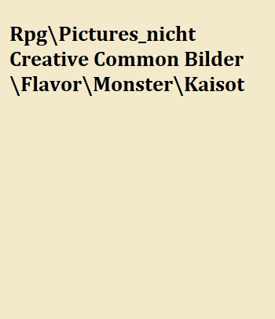
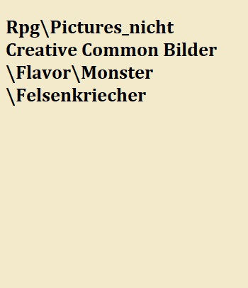
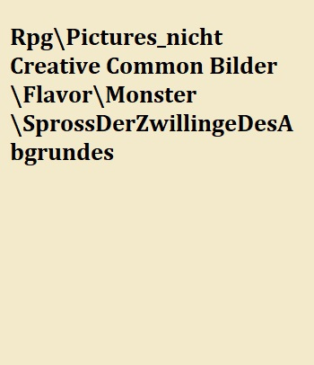

# Monster und andere Abscheulichkeiten {#Monster}

Monstrositäten und Ungeheuer sind für manche Städter bloß Seemannsgarn oder gar den geistigen Absonderlichkeiten so mancher Trinker entsprungen.
Nichts desto trotz gehören Monstrositäten und Ungeheuer - zum Leidwesen aller damit in Kontakt getretenen - zu der Realität in welche uns auch der Allgott gesetzt hat.

Insofern soll diese Abhandlung eine möglichst vollständige Liste der Monster sein welche sich in der bekannten Welt aufhalten.
Bestätigen können wir über etliche Abscheulichkeiten dieser Welt nicht alles.
Die kleineren Übel wie Katakane, weibsgroßes Spinnengetier oder Werwölfe sind vielen bekannt, da so manche Monster Jäger schon Häute, Köpfe odr gar ganze Tiere ausgestellt haben.

Das mit der 21 Auflage versehe Buch inkludiert nun den definitiven Nachweis eines Usukats, wie auch den Nachweis eines Katakans und eines Werwolfs im Nordwesten von Nors.

Weiters konnten wir zum ersten Male Nachweise der Brutmutter in Nors Kanalisation aufzeigen durch das auffinden eines leicht verotteten leicht enthäuteten und enthaupteten Exemplars.

Insofern dient dieses Buch, neben Sammlern, Forschern und Reisenden als Sammelwerk.

Insofern eröffne ich mit den Worten von dem Sammler und Forscher welcher den mittlerweile größten Anteil dieses Buches lieferte, aber allerdings durch einen Lindwurm verbrannten Fisitius Lotharin

> "Monstrositäten sind die Strafe des Allgotts. Nur wer Sie studiert, versteht die Strafe des Allgotts dahinter. Inosfern studieret das Getier dieser Welt, auf dass ihr dem Allgott dadurch näher seien könnt!"
>
> --- Fisitius Lotharin

## Einleitung

Monster gehören zum Alltag der Animali, ist doch ihre gesamte Kultur darauf ausgerichtet Monster zu Jagen, zu töten und zu ehren.

Diese Heiden, leben zwar nicht im Einklang mit dem Allgott, und können so auch nicht in den Himmel auffahren, jedoch haben diese geschickten Jäger, Gerüvhten zufolge Bücher über Monster angelegt und haben ein vermutlich weitaus älteres, umfangreicheres und womöglich korrekteres Wissen über die Abscheulichkeiten dieser Welt.

Um zu gewährleisten, dass die Söhne und Töchter des Allgotts nicht seinen Strafen herfallen helfen neben Gebeten auch das Wissen über diese Monster um vorbereitet zu sein, wenn man sich in deren Gebiete begibt.

Hierbei sei explizit angemerkt, dass Monster auch dem Militär unter Umständen schwere Verluste zufügen können.
So wurden rund 430 Soldaten durch Znitins (riesige, überraschend intelligente Jagdspinnen, beheimatet im großen Elfenwald) beim durchmarschieren durch den Wald getötet oder konnten nicht mehr gefunden werden.

Auch für Holzfäller ist dieses Wissens unentbehrlich, da Sie häufig in Gebiete vordringen welche für diese Monster Rückzugsorte bieten.

Explizit sei erwähnt, dass das Himmelsgebirge und die Graue Ödnis sehr schlecht erforscht sind.
Das Wisssen über die dort lebenden Abscheulichkeiten beläuft sich primär auf Aussagen von einzelnen überlebenden Zwergen so wie auf Orkstämme welche regelmäßig in Gebirgen aus religiösen Gründen jagen.

Grob einteilen lassen sich Monster schwer.
Zu unterschiedlichst sind die Bestrafungen des Allgotts in ihren Fähigkeiten, Stärken und Schwächen.

Die Welt der Monster und Abscheulichkeiten lässt sich dennoch in grobe Kategorien einteilen, wobei diese nicht immer Trennscharf sind.

Grob umfassend gibt es:

-   Höllenbrut/ Allgott verlassene - meist grob menschlicher Gestalt, zeichnen sich dadurch aus dass diese nur Menschenartige Wesen angreifen und gegenüber ihrer eigenen Art keinerlei Aggressionen zeigen.

-   Würmer - wie der name sagt, lang, rund, schlechtes Temperament, häufig blind.

-   Piscari - die Ungeheuer in den Flüssen, Seen und Meeren welche fischähnlich wirken

-   Abgrundbewohner - was die Tiefen der Meere an Abscheulichkeiten gebärt.
    Über diese Gruppe ist äußerst wenig bekannt.

-   Echsenartige - Drachen Lindwürmer, Panzerechsen.
    Zeichnen sich dadurch aus dass diese Jagd explizit auf andere Monster machen.
    Sind meist von höherer Intelligenz und haben beinahe alle Feuerfeste Haut welche mit Knochenschuppen übersäht ist.

-   Foedukulus - die als Hässliche Menschen übersetzte Gruppe umfasst Humanoide meist in größerer Statur als Mensch.
    Sind immer zweibeinig, meist neutral gegenüber Menschen wenn man deren Grenzen respektiert.
    Nutzen Waffen, schmeißen Felsbrocken und sind unter Umständen in sozialen Gruppen unterwegs.

-   Bestien - Werwölfe, Bleirücken und sonstiges welche man als Teile der gegebenen natürlichen Ordnung sehen kann.
    Die Fleischfressenden Varianten Jagen alles, die vegetarischen Arten stellen meist ein landwirtschaftliches Problem dar.

-   Vielbeiner - Monster welche mehr als 4 Beine haben zählen, überraschender weise, zu den Vielbeinern.
    Dazu zählen die unterschiedlichen Varianten der Skorpione, Spinnen und Rieseninsekten.
    Sie zeichnen sich im allgemeinen dadurch aus, dass die Gefährlichkeit für bewaffmete Menschen gegeben ist und meist harte Äußere Panzer als Haut tragen welche Sie gegenüber einfachen Schwertern und Bögen meist unverletzbar.

-   Knochenschädler - trotz ihrer relativen Seltenheit zählen Knochenschädler als eigene Monsterkategorie.
    Ihre Körperform, Anzahl und Form der Extremittäten, größe, Widerständigkeit sind hochvariabel.
    lediglich einheitlich ist das der Kopf eine knochartigen Platte ist- ähnlich einer Schädelform.
    Dort befinden sich weder Münder noch sichtbare Augen.
    Um den an anderen Positionen gelegenen Mündern entspringen meist mehrere Tentakel.
    Knochenschädler besitzen vermutlich eine Intelligenz welche im Hintergrund koordiniert.

-   Schleimer - Gebunden an Feuchtgebiete, wie Sümpfe, Flussauen und den dauerfeuchten Wäldern von Silva Nacia ist diese Gruppe durch eine häufig schleimige, teils mit Säure gefüllten Blasen ausgestattet.
    Die Körperform ist für gewöhnlich stark variabel.

-   Nebelhainii - Die sonderbaren Monster des Nebelhains werden in der Kategorie Nebelhainii zusammengefasst.
    Prinzipiell sind diese Abscheulichkeiten nur in den inneren Bereichen des Nebelhains anzutreffen und stellen neben den Knochenschädlern und den Abgrundbewohnern der Meere die unbekannste Gruppe dar.
    Wie die Knochenschädler ist davon auszugehen, dass die Nebelhainii von einer kollektiven Intelligenz gesteuert sind oder über ein kollektives Bewusstsein verfügen.
    Erschwert wird die Bestimmung und Kategorisierung durch die Tatsache, dass die Berichte aus dem Nebelhain vielfach durch die Maladria, der Ursache für ide geistige Verwirrung im Nebelhain, verzerrt sind.

-   Vampiridae - abgesehen von dem Hass gegenüber Schöllkraut eint alle Vampirdae das Trinken von Blutes.
    Blut wird hierbei von einer Vielzahl warmblütiger höherer Tiere getrunken.
    Weiters ist bei allen Vampiridae, dass die Krallen, Klauen und Zähne fähig sind Blut aufzunehmen, durch Muskeln welche die innen hohlen Klauen als Pumpen verwenden können.
    Dadurch können sich Vampiridae auch im Kampf schnell wieder regenieren.
    Zu den bekanntesten Vampiridae zählen Katakane und bilden das mittlere Spektrum in Gefährlichkeit der Vampiridae ab.

Speziell erwähnt werden sollten Legenden.
Diese Monster sind lediglich aus alten Überlieferungen von Orks, Zwerge oder Elfen belegt.
Seit der Erstauflage dieses Werkes vor über dreizehn Jahrzehnten konnte von diesen Legenden kein Nachweis erbracht werden.

-  Anomalien  - Anomalien sind Monster, die keiner der anderen Kategorien zugeordnet werden k?nnen. Sie sind alle einzigartig und verhalten sich anders als andere Monsterkategorien, in denen sich die Monster alle auf ?hnliche Weise verhalten.

## Höllenbrut

### Bermatalteufel

Über diese Monster der Verdammnis, Bermatalteufel, genannt herrscht weite Unsicherheit der Gelehrten über deren Eigenschaften.

So berichtet die alte Schrift "Von Hässlichkeiten und Monstern" von Sir Charles von Alt-Haag über Vorkommnisse der Invasionen von den früh-eldrischen Fürsten welches sich gen Bermatal richteten, von mehrere Attacken "gepanzerter Foedukuli" welche Axtschwingend und mit hoher Beweglichkeit sich durch Spähtruppen und Flanken eldrischer Armeen schlugen.

Beschrieben wurden Sie hierbei als *"[...] gepanzerte, übermanngroße menschenartige Gestalten ohne Augen und Zähnen lang wie Finger und Kräfte welche selbst Orks als lauchbrüstige Schwächlinge wirken lässt. "*

Mehrere Jahrzehnte später bei einem weiteren, weniger gehaltvollen, Versuch der eldrischen Fürsten wurde hingegen die Monster "*[...] als Echsen mit Haaren und hämischen Lachen, der Bewiglichkeit eines Hasen mit der Kraft eines Ochsen." beschrieben*."\
Dieser Gruppe gelang es auch einen verbrannten Bermatalteufel zu skizzieren und so etwas mehr über den Körper dieser Höllenbrut zu erfahren. Diese skizze ging jedoch verloren, lediglich die künstlerische Interpretation von Mangold von Straffeld blieb erhalten.

Abseits dieser Berichte blieb lediglich der eines Wanderers südlich von Austen der eine solche Kreatur mit "*hämischen Lachenn und hoher Beweglichkeit, größer als jeder bekannte Mensch"* beschrieb.

### Großer Aufspießer

Eine besondere Abscheulichkeit stellt der Große Aufspießer dar.
Sein Name, ist mit der Darstellung unten nachvollziehbar.

Aufspießer gehören zu den Monstern der Klasse der Höllenbrut und sind reichen in der Körpergröße vier Meter vom Boden in die Höhe.
Ausgestattatet mit sieben Armen und 3 Beinen ist die unnatürlichkeit dieser Abschleuchkeit sofort klar.
Die 7 Arme münden alle in langen Spitzen und stabilen Stacheln und haben messerscharfe Kanten.
Die 7 Arme können unabhängig voneinander bewegt werden wodurch es praktisch unmöglich ist, selbst für erfahrene Soldaten mit Schildern diese zu Blocken.
Aufspießer sind äußerst aggressiv und verhalten sich selten vorraussschauend wodurch es leicht ist diese in Hinterhalte zu locken.
Allerdings sind die belegten Angriffe der Aufspießer vorwiegend auf Abend und Nachtstunden beschränkt, wodurch die Koordination eines Hinterhaltes schwierig sein kann.
Auch ist es aufgrund der mangelnden Intelligenz, keinerlei Territorialität und der Moblität schwer in der Zeit organisierte militärische Gruppen abzustellen um diese Monster zu bekämpfen.

Die Bekämpfung von Großen Aufspießern erfolgt mit Speeren oder Hellebarden in Formation unter schwerer Rüstung.
Es ist quasi unmöglich die Arme des Aufspießers zu fixieren da diese meist mit deutlich mehr Kraft in den einzelnen Armen ausgestattet sind als ein Ork mit Händen aufbringen könnte.
Hingegen ist es hilfreich mit Wurfspeeren die Bewegungsmuster soweit ainzuschränken, dass die Infanterie die Attacken des Aufspießers blocken kann.

Brand und Sprengmittel sollten keines Falls verwendet werden, da dies zur Flucht des Aufspießers führen kann, wodurch er wieder sien Unwesen treiben wird.

Über die Verbreitung von Aufspießern ist eine zufällige Dispersion über die gesamte bekannte Welt nachgewiesen.
Berichte der Rah Kari, aus Eldria, von Orkstämmen und von Zwergenstädten legen genau dies nahe.
Die Bekämpfungsarten gleichen sich hierbei bei allen Kulturen.

Die Vermehrung läuft über das Abspalten eigener Körperhälften und augewachsene Exemplare sind an dem 2ten mund an der Flanke des Monsters sichtbar.
Es ist folglich immens wichtig beim Ausschalten des großen Aufspießers auch den kleinen Teil nochmals explizit zu töten.
Dieser stellt zwar unmittelbar keine BEdrohung dar, ernährt sich aber von der Muttertierleiche und vergräbt sich anschließend im Erdreich, wo nach kurzer Zeit dann ein neuer reifender Aufspießer herauskommt und dann nach, vermutlich wenigen Monaten, das Problem mit einem großen Aufspießer erneut besteht.

Das größte bekannte Exemplar eines Aufspießers wurde nach einem Scharmützel zwischen der Kaiserlichen Armee und den Rebellen von Eldria gesichtet, welcher durch den Verzehr von Erwachten eine grünliche Farbe angenommen hat und vermutlich um die 7 Meter an Körpergröße erreichte.
Er konnte nicht getötet, lediglich durch in Brand setzen vertrieben werden.

Kindergeschichten darüber gibt es in Eldria noch heute.

> "Kleines Kindlein sei brav und fein.
>
> seid bei Nacht sicher daheim
>
> stecket euch in euren Bettchen rein,
>
> sonst klopft und stopft der Aufspießer sich euch, an den Füßen voran, in sich hinein"
>
> Gedicht des Lyrikers Kasper von Gent

### Kaisot

Kaisots sind rund 10 Meter hohe und mit riesigen, menschenähnlichen Armen ausgestattete Monster welche der Höllenbrut zugeordnet werden.
Ihr Aussehen entspricht nichts was natürlich entstehen könnte.
Sie besitzen drei Köpfe, 6 Arme und 2 - 4 Beine was ihnen ein gewisses Spinnenähnliches aussehen verleiht.
Ihre Bewegungsgeschwindigkeit kann, wenn sich die drei Köpfe koordnieren mit Leichtigkeit auch die schnellsten Pferde einholen, wodurch es im klassischen Sinne unmöglich ist vor diesen Abscheulichkeiten zu fliehen.
Kaisote besitzen keinerlei bekannte Panzerung und sind am ganzen Körper von Fleisch umgeben, wodurch es möglich ist Kaisots mit unterschiedlichsten Taktiken zu bekämpfen, dazu mehr später.
Die drei Köpfe der Kaistos können untereinander über eine nicht entschlüsselte Sprache kommunizieren und so auch mit anderen Kaisots sprechen.
Dadurch kommt es gelegentlich vor, dass mehrere Kaistos einen koordinierten Angriff gegen Dörfer starten, sofern man 2 Berichten von Zwergen und 4 von Orks glauben schenken mag.

Die Verbreitung von Kaisots beschränkt sich in den meisten Fällen auf Gebirge, mit einer besonderen Häufung dort, wo sich viele Höhlensysteme erstrecken, welche sie zu zufälligen Zeiten zum schlafen oder ausruhen aufsuchen.
Es ist unbekannt was Kaisots im speziellen verzehren und Zwergengelehrte und Orkstammesoberhäupter behaupten, dass Sie alles wahllos fressen.
Dazu gehören Steine, Kühe, Orks, Menschen, Zwerge, Bäume oder auch mit Eisen verstärkte Pallisadenwälle.
Dadurch hat sich in den von Kaiserlichern besetzten Gebieten die Meinung breit gemacht, dass diese Höllenbrut Monster nur das sind um die humanoiden Zivilisationen zu zerstören.

Berichten zufolge sind westlich der Knochenfeldschlucht in den letzten Jahrhunderten mehrere dutzend Orksiedlungen durch Kaisots zerstört worden, wodurch einige Orkstämme eine tiefe Abneigung haben sich dort niederzulassen, obwohl die tieferen Täler und Flüsse eine beachtliche Nahrungsquelle darstellen würden.

Kaisots können allerdings erfolgreich mit mehreren Taktiken bekäpmft werden.
Kaisots, welche vermutlich alle beinahe blind sind, sind aufgrund fehlender schützender Hautschichten empfindlich gegenüber Feuer, wodurch eine Kombination aus Moltovika und größeren Mengen Öl sich rasch als hilfreich erweist.
Eine weitere Taktik, welche kostengünstiger aber waghalsiger ist, besteht darin Kadaver von Kühen oder Nutztieren mit Öl zu übergießen und anzuzünden und mit äußerst agilen und leichtfüßigen Kämpfern, in der nähe der brennenden Kadaver Lärm zu machen, wodurch diese meist dort rasch mit ihren Armen hingreifen und sich so stark verbrennen.
Diese Taktik ermöglicht es meist einen der drei Köpfe für die dauer des Kampfes davon abzuhalten Menschen zu zerquetschen.

Die allgemeine Taktik, sofern man über keine Großkanonen verfügt, besteht darin mit mindestens 4 kleinen Stoßtrupps die 3 Köpfe des Kaisots zu vewirren, wodurch diese nicht mehr koordiniert handeln können, was deren Agilität stark einschränkt.
Die 3 Köpfe können sich im Eifer des Gefechtes meist nicht hinreichend absprechen, wodurch es leichter wird diese zu Überwältigen.

Eine Spezialtaktik besteht darin, äußerst äußerst gute Steinschleuderer mit Moltovika auf die Köpfe der Kaistos zielen zu lassen und so schlichtweg ihre Schädel wegzusprengen.
Zwei Moltovika reichen meist, dass der letzte Kopf sich nur mehr schleifend oder gar nicht mehr fortbewegen kann, wodurch er von Fernkampfschützen bedenklos langsam getötet werden kann.
Hierbei empfiehlt es sich durch die Nasenöffnung am Kopf oder den meist geöffnten Mund zu schießen um so das Gehirn der Abscheulichkeiten auszuschalten.

Kaisots sind für adelige Kriegsveteranen ein besonders gefragtes gut, wo häufig nach Kriegen Jagd auf Kaistos ausgerufen wird.
Das Kaisotherz ist eine Zutat welche für einen Trank zum Nachwachsen von Gliedmaßen benötigt wird.
Der "Trank des Kaistots" ist ein extrem begehrtes Gut und eine Hand Voll Alchemisten Werben während und kurz nach Kriegszeiten explizit mit der Fähigkeit zur Herstellung von Kaisottränken, sofern das Herz mittels Staffellauf-Pferdekurier geliefert wird.

### Usukats

Usukats sind vermutlich die schlimmste Plage an Abescheulichkeiten welche Eldria seit den letzten 300 Jahren quälen.
Der Ursprung der Usukats ist nicht bekannt, jedoch ist es verwunderlich, dass es dass diese Abscheulichkeiten mit welcher der Allgott unseren Glauben prüft, scheinbar noch nicht so lange gibt.

Usukats zeichnen sich aus durch eine humanoide Gestalt, welchem am Kopf und Rücken weiß behaart ist.
Sie besitzen keine Erkennbaren Augen und sind komplett Geruchslos, wenn man die Erde von ihren Körpern entfernt.
Dies mag unbedeutend scheinen, führt jedoch dazu das Stämme der Animali keine wirkliche Jagd auf Usukats machen und dadurch es den Garden Eldrias unterliegt diese Abscheulichkeiten zurück in die brennende Verdammnis zu schicken aus denen sie scheinbar ausgestoßen wurden.

Usukats besitzen, unüberraschenderweiße, keine Sicht und orentierien sich vermutlich am Geruch-, Gehör- und Tastsinn.
Sie sind Nachtaktiv und verschwinden untertags scheinbar komplett vom Angesicht der Erde.
Usukats sind schneller als Menschen, was diese vor allem des Nachts zu Alpträumen von Überlebenden führt - medizinsch bekannt unter "Nachhall des Usukats".
Die Überlebenden verlieren schlaf und nach einigen Wochen entweder den Verstand oder die Alpträume lassen mit der Zeit nach, wodurch die Rückkehr in ein normales Leben möglich ist.
Schwächen der Usukats sind keine bekannt, jedoch berichten Überlebende des Massakers von Austen davon dass kreischende Kinder Usukats verschrecken können- was nach Meinung von Humboldt von Gent, ein Gelehrter in Sachen Abscheulichkeiten dieser Welt, Schwachsinn ist und lediglich Kinder dazu motivieren soll den Angriff eines Usukats anderen mitzuteilen bevor "die arme junge Seele aus dem Kind gerissen wird und seine Innerein gefressen werden".

Die Intelligenz des Usukats lässt sich vermutlich mit denen von gewiefteren Werwölfen vergleichen, jedoch hegen Usukats keinerlei Territorialansprüche.
Diese ungünstige Tatsache führte 156 n.
R.
zum Massaker von Austen wo eines Nachts mehrere Usukats vor und in Austen erschienen.

Hierbei wurde beinahe die gesamte Stadtwache getötet oder schwer verwundet und mindestens 17 Usukats getötet.

> "Es war eine Nacht wie alle anderen. Wie hatten die Ernte vor 2 Wochen eingefahren, sie war gut dieses Jahr. ein lauer Herbstabend, mondlos und man konnte das rascheln der Blätter hören wenn man etwas Abseits der gut besuchten Tavernen seine Notdurft verrichtete. Die Kinder waren im Bett und Priester spendeten jenen Trost welche durch die Fleischmadenplage ihre Angehörigen verloren hatten. Die Stadtwache war am patroullieren und der Graf von Austen erbrachte jene Leistung welche gefordert wurde, die bekämpfung der Korruption unter der Stadtwache und die Vertreibung und Erhängung derer welche von Narkotikan und Adrenalinikan sich nicht lossagen konnten. Am nächsten Sonnabend sollte die Ekklesia zum beten rufen und den Graf für seine Taten für die Kinder des Allgottes ehren.
>
> Die Männer tranken, manchen gaben sich den Dirnen hin und die Kinder wurden von ihren Müttern in den Schlaf gewogen.
> Irgendwann rund 1 - 2 Biere später kam ein kreidbleicher Jungermann in die Taverne gerannt und keuchte etwas von einer Stadtwache die von einem Riesen in der Mitte auseinandergerissen wurde.
> Viele Tavernenbesucher glaubten ihm nicht, jedoch folgten ihm 2 Soldaten welche gerade ihren Tagesdienst erfüllt gehabt hätten und der Hühne von Austen sowie zwei Jäger.
> Der Jüngling mit seiner durchnässten Hose führte die Wachen, den Hünen, und die Jäger zu der Stelle, während mir gesagt wurde ich solle den Hauptmann der Stadtwache kontaktieren- was ich auch tat.
> Nach rund 20 Minuten war ich an der Kaserne angelangt wo mir die Türwachen glauben schenkten, und darüber bin ich heute noch froh, und mir Entritt gewährten, woraufhin ich mit dem Hauptmann redete.
>
> Dieser entsandte mit mir 5 Wachen, die meisten in schwerer Rüstung und er selbst folgte auf einem Pferd- ebenfalls in schwerer Rüstung.
>
> Als wir näher kamen hörten wir von wo anders Schreie von Kindern, kreischend hell, wie man es sonst nicht hört.
> Der Hauptmann sandte daraufhin einen Armbrustschützen zurück zur Barracke wo er isch Männer holen sollte und dorthin gehen sollte wo das Kind Schrie.
>
> Als wir 6 Mann schließlich beim Ursprungsort in Hörreichweite waren herrschte Panik und Aufruhr als mehrere Stadtbewohner uns entgegen kamen und meinten der Teufel sei gekommen und der Allgott wird uns Sünder bestrafen.
>
> Immer mehr Dorfbewohner flohen, Mütter mit Kindern auf dem Arm, während die Kinder weinten.
> Als wir schließlich am Ort des Geschehen eintrafen sahen wir bereits Blut die Gasse hinterströmen, was ein merkwürdiger Anblick war, da hier sonst nur bei Regen klares Wasser hinunter strömte.
> Wir sahen Fackeln welche am Boden lagen und noch brannten und hörte das bersten von Knochen, was Abscheulich genug war, aber immer wieder ertönte als würde jemand die Knochen wie Kleinholz brechen um Sie in den Karmin zu werfen um so eine hungrige Flamme zu füttern welche die Leute wärmte.
>
> Doch anstatt eines Warmen Karmin sahen wir etwas groteskes.
> Eine 3 Meter hohe Kreatur, in Menschlicher Gestalt, welche die Knochen aus einem Haufen etwas herauszog.
>
> Die Worte des Hauptmanns werden mir noch heute in den Ohren schallen "Leg die Waffe nieder! Wir sind in der Überzahl, ergebt euch!" Daraufhin richtete sich das Monster komplett auf und warf etwas in Richtung des Kommandaten was er mit seinem Schild blockte.
> entsetzt merkten wir das unser aller Gesicht plötzlich nass und Blutüberströmt war.
> Dieses "Etwas" hat uns gerade die oberhälfte eines Menschens auf uns geworfen welcher einfach auseinandergerissen wurde.
> Nach einer gefühlten Ewigkeit Begriff der Kommandant dass dies nicht die Zeit für Verhaftungen war und befahl seinen Männer das Biest aunzugreifen.
> "Schicken wir es zurück in die Hölle!" Er gab seinem Pferd die Spornen woraufhin er als erstes Reinrannte und die Wachen ihm nach.
> Als er in der Nähe des Monstrums, nein dieses Dämons, war warf es erneut einen halben Leichnahm auf ihn, wodurch diesmal er kurz sein Gleichgewicht verlor und das Monster schlicht weg Pferd niederrammte mit dem Hauptmann darauf.
> Man hörte Knochen knacken und das Pferd wieherte Armseelig während der Hauptmann versuchte sich unter dem sterbenden Pferd hervorzukämpfen.
> Die anderen Wachen versuchten den Dämon anzugreifen.
> Der erste Wachmann wurde mit einem Hieb des Armrücken durch eine offene Tür in der Gasse geworfen und der Zweite hackte auf den Arm des Dämons ein, worauf dieser Lautschreiend seinen Arm herausgerissen bekam.
> Die 3 weiteren Wachen Hackten auf die Beine ein wodurch der Dämon kurz einknickte und er einem Soldaten vor ihm einem den Kopf, samt des Helms Abbiss und als ganzes schluckte.
> Ein Schwerthieb von hinten in den unteren Rücken, der Kopf war schlicht außer Reichweite, brachte den Dämon erneut zum einknicken.
> Der Dämon drehte sich um und erschlug mit dem Kopflosen Leichnahm der Wache den anderen Wachsoldaten zu Brei während der Soldat aus dem Haus hervorkam und sichtlich benommen auf das Biest zustürmte.
> Es trat den Soldaten einfach weg woraufhin dieser auf einem Hausdach landete und dort durch das Dach brach.
> Der Hauptmann konnte sich noch immer nicht unter dem sterbenden Pferd befreien und stönte und ächzte, als sich das Monster umdrehte und das Pferd von ihm hob und es in Stücke riss.
> Der Kommandant rührte sich keinen Zentimeter, selbst als er es konnte.
> Der Dämon, ich kann es nich andrs beschreiben, fächerte sich Luft zu.
> Da merkte ich es fehlte ihm an Augen.
> Ich hielt meinem Atem sah zum Kommandanten und der Befahl mir mit einer Kopfbewegung abzuhauen.
> Ich versuchte leisen Schrittes das weite zu Suchen und bewegte mich rückwarts so langsam, das ich das knistern der Fackeln hörte während der Dämon das Pferd weiter auseinander riss.
>
> Plötzlich hörte ich wieder das schreien der Menschen im Hintergrund und die Gasse hinab sah ich das huschen einer großen weißen Gestalt und Wachen welche von ihm Davon oder ihm Nachliefen.
> Ich versuchte die Tür zu öffenen vom dem Haus hinter mir was mir gelang, jedoch quietschte die Tür beträchtlich, woraufhin ich merkte wie der Dämon in sich in meine Richtung wandte.
> Ich blieb starr vor Schreck stehen.
> Es fühlte sich an als würde die Zeit stehen als man von dem Soldaten welcher durchs Haus brach pltzölich wieder ein Lebenszeichen hörte - woraufhin es sich in das Haus begab.
> Als der Dämon sich durch die enge Tür quetschte, dabei den Türrahmen mitriss sah ich den Hünen erneut während er seinen Zweihänder zum Stoß bereit ansetzte und langsam dem Monster näher kam.
> Er schaffte es und rammte den Zweihänder von unten, wo bei Menschen die Weichteile sind, in das Biest, woraufhin dies, erschrak, aufschrie und mit einem Tritt den Hünen an die Gassenmauer trat, woraufhin dieser zu Boden sank ohne sich zu bewegen.
> Der Hauptmann raffte sich zwischenzeitlich auf, mitten unter zerteilten Leichen von Kindern, Frauen und seiner Männer und hackte auf das Biest ein welches am Boden lag, bis es sich nicht mehr bewegte.
> Ich traute meinen Augen nicht und so blieb ich noch in dem Haus, blickte auf das Gemetzel des Teufels währen der Kommandant versuchte dem Hünen zu helfen.
>
> Ich blickte die Gasse hinunter und sah eine Mutter mit ihrem Baby auf den Arm die Gassen hinauflaufen.
> Plötzlich sah und hörte man einen weiteren Dämon ihr nachlaufen.
> Allgott bitte vergib mir, aber ich konnte die Tür nicht öffnen, ich konnte einfach nicht.
> Ich konnte das Baby und die Mutter nicht retten.
> Sie lief und schrie um Hilfe und das Baby schrie und als Sie das Gemetzel der Gasse sah, den Kommandanten sah, schrie sie in schriller Stimme "Tötet es. Tötet es! Los tötet es endlich!" Der Kommandant nah sein Schwert und rannte der Mutter entgegen und dem Kind.
> Plötzlich sah ich den Dämon, Blutverschmiert riss die Mutter im Lauf nieder.
> Man hörte wieder das Knacken von Knochen und, was auch immer der Allgott uns mit dieser Prüfung sagen will, es ist keine Liebe wenn man hört wie eine Mutter ihr eigenes Kindd zerquetscht und man die gedämpften Schreie eines Babies hört.
>
> Ich weiß nicht mehr was dann passierte, ich konnte es nicht mehr sehen, ich sah gar nichts mehr, es wurde alles Schwarz.
> Ich hörte draußen das scheppern der Rüstung des Kommandanten und das Biegen von Metall und das einstechen in Fleisch, aber kein Schrei des Monsters.
> Dann wieder zerbrechende Konchen, wie Zunder im Karmin.
> Zunder für das Feuer der Hölle welche sich in Austen in jener Nacht auftat.
>
> --- Bericht eines Überlebenden des Massakers von Austen

### Brutmutter

Brutmütter sind eine wahre Bestrafung der Augen.
Man stelle sich einen bis zur Unkenntlichkeit überfressenen Kahlköpfigen bleichen Menschen vor.
Dieser hat rund ein Dutzend Brüste.
Gerüchtenzufolge besitzen Brutmütter mehrere Tentakel und nicht benutzbare Hände.
die Fortbewegung folgt furchtbar langsam von rund 2 Meter mit einem Satz.
Also jeder Mensch kann einfach diesem Monster aus dem weg gehen.

Die Hauptentakeln sind dick, worauf sich schließen lässt, dass man Brutmütter nicht im Nahkampf begegnen sollte.
Bis zu 6 weitere Tentakel befinden sich, aus dem Boden ragend in der Nähe der Brutmutter und beschaffen entweder Futter oder verteidigen diese.

Brutmütter gebähren Ghule und können dadurch nach gewisser Zeit eine regelrechte Plage werden.

Über die Schwächen gegenüber Giften oder Feuer ist wenig bekannt.
Es wird empfohlen eine Brutmutter mit der Hilfe von Skorpionen zu erledigen und einer guten Hand voll schwer ausgerüsteter Soldaten.
Man Ziele einfach auf den Kopf der Brutmutter.
Eventuell zur Verteidigung herbeistürmende Kinder, also die Ghule, sind mit Schwerter und Schilder kein Problem.

Alchemistisch ist keine Verwendung über Brutmutter Ingridientien bekannt.

![Illustration einer schlafenden Brutmutter[^1]](Pictures/Flavor/Monster/by_taonavi_Brutmutter.jpg)

[^1]: "Abomination Knight (2019) Concept" von [Taonavi](https://www.deviantart.com/taonavi/art/Abomination-Knight-2019-Concept-800502298).Diese Conceptart steht unter einer Creative Commons Attribution-Noncommercial-No Derivative Works 3.0 License zur Verfügung.

## Würmer

### Steinwurm

> "Brich Stock und Stein, wenn du fällst in ein Steinwurmloch hinein.
>
> Freu dich nicht, denn bald hast du Steinwurmsäure im Gesicht."
>
> --- Gedicht über den Steinwurm

Steinwürmer gehören zu den größeren Ende der Wurmartigen Monster.
Steinwürmer werden biszu 14 Meter lang und leben obligatorisch unter Tage.
Sie fressen keine Tiere sondern ernähren sich von speziellem Gestein welches sich als grün floureszierende Masse teils die Gänge von den Steinwürmern beleuchtet.
Steinwürmer sind selten anzutreffen und ihre Gänge meist älter als die Gründung des Kaiserreichs.

Sie besitzen keine Augen und graben sich mit ihren unheimlich Harten Vorderzähnen und der Zuhilfenahme ausgestoßener Säure erstaunlich rasch durch das Erdreich und Gestein.

Steinwürmer sind für einen guten Teil der Höhlen im Himmelspitzengebirge und in den Gebirgen um das Bermatal verantwortlich.
Es wird nicht empfohlen den Gängen dieser Würmer zu folgen, da man ab einer gewissen Tiefe auf schlafende Exemplare treffen kann, welche gereizt auf neugierge Forscher reagieren.
Zumeist sind ihre Schlafkammern durch rund 12 Meter, beinahe senkrechte Tunnel gekennzeichnet.
Dies dient, laut Lehrmeinung, dazu dass Lindwürmer hier keinen Zugang finden und so nicht deren Beute werden können.

Steinwürmer besitzen im allgemeinen weiche Körperoberflächen was ihnen das navigieren durch natürliche Höhlen oder engere Felsspalten erleichtert.

Über die Reproduktion ist nur bekannt dass sie lediglich 3 Eier großen gelege meist von 2 Muttertieren bewacht werden.

Ihre Intelligenz ist mangels wissen schwer zu beurteilen.

### Aschwurm

Aschwürmer sind endemisch in den Vulkanisch aktiven Gebieten von Wurmfall - welcher den Namen durch die Aschwürmer gefunden hat.
Aschwürmer sind die größten Monstrositäten in der gesamten bekannten Welt.
Körperlängen von 40-50m wurden berichtet.
exakte Vermessungen gibt es natürlich nicht.
Knochenartige Überreste deuten jedoch auf teils weitaus längere Exemplare hin.
Aschwürmer haben ihren Namen durch ihre dunkle und überaus Dicke haut, welche ihnen erlaubt selbst durch flüssiges Gestein, Lava, zu kriechen.
Obwohl sich die Wurmaktivität primär auf die Phasen vulkanischer Inaktivität beschränkt konnten mehrere unabhängige Berichte von geringer Wurmaktivität während der vulkanischen Phase Wurmaktivität an der Oberfläche beobachten.
Hierbei sind auch die 7 Beobachtungen von Angriffen durch Drachen auf Aschwürmer entstanden.
Hierbei sollte angemerkt werden, dass die Drachen in lediglich einem Fall erfolgreich waren da es sich um ein Augenscheinlich bereits verletztes Tier handelte, welches durch eine nahegelegne Vulkanexplosion - untypisch für die Schildvulkane der Region - einen riesigen Gesteinbrocken von 15 Metern auf den "Kopf" des Wurmes schleuderte.

Aschwürmer sind jedoch, wie erwähnt, primär aktiv während der vulkanischen Ruhephasen.
Hierbei durchfressen und durchwandern diese die ausgekühlten Lavagänge und Oberflächen.
Die Nahrung der Würmer besteht, wie auch bei den Steinwürmer primär aus speziellen floureszierendem Gestein welche diese auf unbekannte Art und Weise verarbeiten.
Die rund alle 12 Jahre auftretenden stark Regenfälle von Wurmfall, vermutlich bedingt durch vulkanische Gase, veranlassen die Wurmaktivität zu steigern.
Hierbei können die Würmer häufig bei aufsaugen riesiger Wassermengen beobachtet werden.
Hierbei wird auch meist die nach den Regenfällen blühende und sprießende Vegetation verzehrt.
Während dieser Zeit ist das durchwandern der Wüste ein Unterfangen, dass nur von Allgott verlassenen unternommen werden sollte.

Aschwürmer vermehren sich vermutlich über das ablegen von Eiern, jedoch sind bis jetzt keine Eier gefunden worden, geschweige denn Jungtiere.
Aschwürmer besitzen am Kopf, in gewisserweiße ähnlich wie Steinwürmern "Zähne" mit welchem diese vermutlich Erdreich aufbrechen und Verspeisen.
Aschwürmer sollte man, wenn man es überhaupt schafft, auf keinen Fall provozieren.
Provokationen der Aschwürmer werden primär durch umhertramplende Massen an Lebewesen ausgelöst.
So werden sich verirrende Bermatalbüffelherden - welche beim Ergrünen der Vulaknischen Wüste hineinnwandern, meist von den Würmern erdrückt, erschalgen oder gefressen.

Dementsprechend wird abgraten mit Armeen größer als 20 Mann während der vulkanischen Ruhephase, also der Aktivitätsphase der Würmer zu durchwandern.

Es wird angenommen, dass Menschen keine Waffen besitzen welche den Aschwürmern Schaden zufügen könnte, da nichteinmal Drachen diese verletzen können.
Insofern ist es nicht verwunderlich das wir keine Belege für natürliche Fressfeinde von Aschwürmern vorliegen haben.

### Weltenwurm {#WeltenWurm}

Weltenwürmer sind mehr Legende als regelmäßig beobachtete Monster.
Sie sind besonders riesige Aschwürmer, die deutlich tiefer graben und durch deren Tunnel ganze Kohorten nebeneinander hermarschieren können.
Glücklicherweise kommen sie so gut wie nie an die Oberfläche.

## Piscari

### Nordmeerkrokodile

Krokidile sind seit den Bücher von Azai dem Weisen aus Atumpet vielen Belesen bekannt zumal einige Exemplare im Nebelhain wie auch in manchen Sümpfen Eldrias leben.
Eine lange mit dolchartigen Zähnen gespicktes Maul, Knochenplatten am Rücken, schltizförmige Augen als wäre es die Seele eines Dämons die im langezogenen Kopf lebt.
Dazu vier Beine und ein langer kräftiger Schwanz.
Die harte Haut mit den Knochenplatten macht es unbewaffneten schwer gegen eine derartige Bestie der Natur anzukämpfen.

Nun werden Nordmeerkrokodile in dieser Beschreibung auch wunderbar wiedergegeben, jedoch lassen die fischreichen Gewässer und Riffe diese Exemplare unheimlich groß, und alt werden.
So konnten mehrere Fischer über Generationen hinweg bestätigen, dass ein und das selbe Nordmeerkrokodil, erkennbar an der im Schädel steckenden Speerspitze, mindestens 170 Jahre alt ist.
Da wie bei anderen Krokodilen, die Nordmeervarianten nie aufhören zu wachsen, wird dieses Individium auf mindestens 17 Meter geschätzt, weshalb um dessen Riff nur mehr große Fischerboote versuchen Fischfang zu betreiben.

Obwohl die Meere im allgemeinen leer sind, sollte man doch davon absehen in dem kalten Wasser der Meere nördlich der Himmelsspitzengebirge, länger als nötig in kleinen Booten unterwegs zu sein, schließlich gibt es angenehmeres als von einem hungrigen hundertjährigen verschlungen zu werden.

### Dunkleosteus

Ungeheuer der Meere sind weitaus weniger erforscht und so kann ein jeder davon ausgehen dass die Tiefen der Meere mehr Abscheulichkeiten bewohnen als Bürger Eldrias treu dem Kaiserreich sind.

Dnkleosteus ist eines dieser Monster, benannt nach dem Fischer und Forscher Nixan Dunkleosteus, sind diese Ungetümer mehrere Meter lang und am Kopf mit einem Knochenpanzer direkt unter der Haut ausgestattet was es quasi unmöglich macht diese Monster schnell zu erlegen oder gar gegen diese anzukämpfen.
Ist man nicht mit ertrinken im Wasser alleine beschäftigt reißen Dunkleosteus in den Salzigen Wassern und den Brackwässern häufiger schwimmende Kühe und größere Fische und auch unvorsichtige Fischer.
Dunkleosteus können durch grelles Licht oder Lärm von z.b explodierenden Moltovikas abgeschreckt werden, jedoch empfiehlt sich zweiteres nicht da die Verletzungsgefahr hoch ist.

Dunkleosteus können , wenn diese an der Oberfläche schwimmen mittels Kanonen erlegt werden, jedoch hat man meist nur exakt einen einzigen Schuss bevor diese durch den Lärm abgeschreckt werden.

Alten Überlieferungen der ersten Seefahrer zufolge war dies ein entscheidender Mitgrund warum Seefahrer lauthals ihre Lieder brüllen um so zu verhindern das kleine Holzboote angegriffen werden.

Über die Fortpflanzung dieser Knochenfische ist leider noch nichts bekannt, allerdings können kleine Dunkleosteus in Brackwasser beobachtet werden, wo diese gelgentlich von Fischern gefangen werden.
Ihr Fleisch soll angeblich stark aphrodisierend wirken.

## Abgrundbewohner

### Bootfresser

Der Bootfresser ist der Spitzname für ein Ungeheuer welches mehrmals bis zu 35 Meter Schiffe der Kaiserlichen Marine angegriffen und zerstört hat.
Es handelt sich hierbei um eine Art Seeschlange welches im Gesicht mehrere knochengraue Schädelplatten besitzt aus welchen zahllose Tentakel entspringen.
Auf der Unterseite des Kopfes befindet ein sich mit Knochenplatten versehenes Maul, welches Dinge zerquescht.
Die Tentakel des Kopfes reißen Schiffe und andere Seeungeheuer in hinreichend kleine Happen, wo diese dann im Maul zermalmt werden.

Die Größe des Bootfresser ist nur schwer abzuschätzen, da nie der gesamte Körper aus dem Wasser ragt.

Seine rot glühende Haut auf den Tentakeln zeigt an, ob der Bootsfresser hungrig ist, oder einen schlechten Tag zu haben scheint.
Der restliche Körper dieses Scheusals ist von einer silbrig, glatten Haut umgeben und weißt eine gleichmäßig runde Form auf, wodurch es sich wie eine Schlange durch das Meer bewegt.
Wie es bei Seefahren ist, ranken sich auch diverse Mythen um dieses Getier.
So soll es wahlweise nur zu Vollmond in der Nacht oder zu Vollmond unter der Mittagssonne angreifen.

Andere Seefahrer schwören, dass das einreiben der Segel und des Rumpfes mit einer speziellen Alge hilft, dass diese Kreatur nicht die tausenden mühseligen Stunden Holzwerk welche in Schiffen stecken nicht innert weniger Minuten zerstört werden.

Obwohl es mittlerweile dutzende Berichte dieser Kreatur gibt, können aufgrund der geringen Anzahl überlebender wenige Rah-Kari und kaiserliche Quellen vernünftige Angaben machen, wodurch sich nur der Name "Bootsfresser" in allen Fällen bewahrheitet.

### Lagunenjungfer

> Bringen irgendwelche Bastarde wieder einmal eine Junge Frau weg um Sie zu vergewaltigen und anschließend abzustechen und den Kadaver in der Lagune zurückzulassen kommt irgendwann des nachts die Lagunenjungfer und stülpt sich den Kadaver über.
> Also was gibt es widerwärtigeres?
> Ein Insektenartiges Getier dass sich die halb verwesende Haut eines menschlichen Kadavers überzieht"
>
> Julius Schwarzherz zu Breitbart

Lagunenjungfern sind im allgemeinen eher als Wasser beziehungsweise Lagunen bewohnende Insektenartige Tiere, welche sich mit Überresten von Tieren, Fischen, Algen oder menschlichen Kadaver begünugen und die Innereien bis auf die Haut aufessen.
Es wird vermutet, dass dieses Getier vermutlich sich vor der Sonnenstrahlung schützt, da "Nackte" Lagunenjungfern nie bei Tags gesehen werden.

Die Lagunenjungfern werden bis zu zweieinhalb Metern lang, meist jedoch deutlich kürzer, da im Wasser Haie auf die schlecht schwimmenden Vielbeiner einen herzlichen Apptetit zu haben scheinen.
Die Vielbeiner gehüllt in verrottendem Zeug verströmen einen derart stark stechendend widerwärtigen Geruch das man meist lange vorgewarnt ist, bevor einem diese Getier zu nahe kommt.
Zusätzlich hört man am Strand das Schlürfen der Tiere, da die Kadaver für gewöhnlich mit der Zeit äußerst locker sitzen und so auch mal Fetzen der Haut oder Krüllalgenmatten abfallen.

Im Wasser sind die Lagunenjungfern zwar meist deutlicher schneller als Menschen und können so eine Bedrohung für unerfahrene darstellen, sind jedoch mit gezielten Speerstößen leicht zu bezwingen.
Im Wasser ernähren sich die Vielbeiner von Aas und Krabben und fangen ihre Beute dank ihres lähemnden Giftes schlussendlich.
Hierbei wird die Zunge wie ein Seil an oder um das künftige Festmahl geworfen.
Im Wasser merkt man meist den stechenden Schmerz woraufhin man umbedingt aus dem Wasser sollte, da das ertrinken aufgrund von Muskelkrämpfen eintreten kann.
Die Krämpfe klingen nach wenigen Stunden ab, sofern man keine Narkotika zur Verfügung hat.

Ist man durch die Krämpfe allerdings im Wasser und Land bewegungsunfähig merken die Lagunenjungfern diese bewegungen und beginnen das Opfer lebenden zu verspeisen.
Hierbei wird mit einer Bauchseitig liegenden Mundöffnung mit mahlenden Kiefern von Krabben der Panzer oder von Menschen die Haut aufgerieben oder gebrochen.
Dies ist ein äußerst langwirriger und unangenehmer Prozess - was allerdings dazu führte dass diese bei manchen Rah-Kari als Foltermethode verwendet wird.

Dieser Prozess, selbst wenn das Opfer gerettet wird führt aufgrund von der Übertragung von Krankheiten häufig zum Tod, sofern keine medizinische Versorgung geleistet wird.

Die Lagunenjungfern kommen vorwiegend an und in Inseln im Südmeer vor und sind im offenen Meer nicht anzutreffen.
Die Haupaktivitätszeit ist Nachts und Abends.
Über die Fortpflanzung dieser Tiere ist allerdings nichts bekannt.

Die Bekämpfung der Lagunenjungfern sollte mit Armbrüste oder Bögen erfolgen.
Die neuen Schwarzpulverwaffen können hierbei verwendet werden, was jedoch unnötig teuer ist.
Wagemutige können mit langen Lanzen oder Speeren ebenfalls gegen diese Tiere vorgehen.

Vorsicht ist zu Vollmond geboten, da hier die Tiere teils zu Scharen aus dem Wasser kriechen, was schnell bedrohlich wirken kann, sofern man im Kampfe nicht profizient ist.

![Eine Ausgewachsene Lagunenjungfer[^3]](Pictures/Flavor/Monster/treats_by_ninjatic.jpg)

[^3]: "Treats" von [Ninjatic](https://www.deviantart.com/ninjatic/art/Treats-712265465).Diese Conceptart steht unter einer Creative Commons Attribution-Noncommercial-No Derivative Works 3.0 License zur Verfügung.

Ein Detail am Rande, sind die Sammlungen der Lagunenjungfern für kriegerische Zwecke bzw zur Erpressung von Inseln oder Seefestungen, da diese Tiere schnell so hartnäckig wie Seepocken werden und quasi unmöglich auszurotten sind.

### Seerollenpest

Seerollenpest sind im eigentlichen Sinne mehrere Organismen.
Zum einen gibt es die Seerollenpestnester, welche neben den lästigen Plagen der Seerollenpestwürmer auch noch andere Wasserpflanzen und Würmer beherbergen.
Warum diese Nester ein derartiges Sammelsurium an Organismen enthalten ist nicht bekannt.

Seerollenpestnester sind im Südmeer in seichteren Meeren und dem Ausläufern des Deltas der Setra verbreitet und werden meist umfischt, oder sofern diese sich im seichten Gewässer befinden, mit langen Lanzen von der Sicherheit des Bootes aus bekämpft.
Die Nester sind äußerst widerstandsfähig und bestehen aus Knochenartigen Platten welche scheinbar zufällig über das Gesamte Gewebe verteilt sind.

Diese Nester, sofern belästigt, setzten Seerollenpestwürmer frei, welche dann extrem aggressiv im Wasser alles angreifen, was sich in der Nähe befindet.
Es ist nicht bekannt was die Nester Essen oder ob diese überhaupt eigene Organismen sind, oder vielmehr die Summe an Getier im Inneren.

![Ein Nest der Seerollenpest - Darstellung von Traxinus Juvian[^4]](Pictures/Flavor/Monster/the_fractal_wasp_troll_by_mandelwerk.png)

[^4]: "The Fractal Wasp Troll" von [Mandelwerk](https://www.deviantart.com/mandelwerk/art/The-Fractal-Wasp-Troll-195090947).Diese Conceptart steht unter einer Creative Commons Attribution-Noncommercial-No Derivative Works 3.0 License zur Verfügung.

Die Nester setzen zusätzlich noch Hallizunogene ins Wasser ab, welche auf Menschen und Orks wie einfache Madnika wirken.
Auf Elfen haben diese Drogen allerdings keine Effekte.
Die Darstellung der Nester ist im Allgemeinen nicht sehr zielführend, da die Nester von Nest zu Nest sehr unterschiedliche Morphologien aufweisen.
Einheitlich sind lediglich die Mischung aus Roten/Braunen und Knöchern, beigen Farbtönen.
Traxinus Juvian, ein wandernder Künstler welcher von Kaiserlichen Beamten für den Verkauf von Madnika gehängt wurde, lies sich hier von den Drogen im Wasser inspirieren und zeichnete das Bekannte Gemälde "Ein Nest der Seerollenpest", angeblich mit dem Blut der Innerein der Nester.

Die Nester stellen für Boote welche tagsüber durchreisen keine Bedrohung dar.
Allerdings sollten Fischer am Setradelta vemeiden in den Zwielichtsstunden zu fischen, da hier die Seerollenpestwürmer auf "Jagd" sind und so auch Boote hochkriechen und Fischer und manche Segler schon den Weg in die Reiche der Verstorbenen bereiteten.

Die Würmer können problemlos von Boot aus erschalgen oder zerhackt werden wenn diese den Rumpf hochklettern.
Wichtig ist, die Würmer von Bootsrümpfen zu befreien, wenn man in der Nähe eines Nestes gefischt hat.

Gerüchten zu Folge verursachen die Bisse, welche selten tödlich sind, eine Allergie was den Genuß von Weizen und Reis auf Lebenszeit verhindert.
Weiters sollten die Würmer nicht angezündet werden, da diese sehr brennbar sind und so gelegentlich zum abbrennen von Segeln oder kleinen Kuttern führten.

## Echsenartige

### Lindwurm

Irreführendesweise sind Lindwürmer, nicht mit den Würmern verwandt sondern sind vermutlich Abkömmlinge von Drachen.
Lindwürmer, teils bekannt als Panzerechsen oder Höhlendrachen können in vielen Fällen Feuer speien.
Die meisten rezenteren Exemplare welche von Orks erlegt wurden speiten allerdings kein Feuer mehr.

Ihre Haut besteht auf der Oberseite und seitlichen Körperregionen aus dicken Knochenplatten.
Lindwürmer können Körperlängen von bis zu 8 Metern erreichen, alten Überlieferungen zufolge sind bis zu 15 Meter möglich, dies konnte allerdings siet nunmehr 136 Jahren nicht bestätigt werden.

Lindwürmer, sind, im Gegensatze zu den wahrhaftigen Drachen, weniger Intelligent und reagieren tendenziell mehr auf Instinkte.
Dies mag geschichtlich auf ihre häufig unterirdische Lebensweise zurückuführen sein, wo wenig Sinn darin besteht vernünftig zu agieren.
Lindwürmer sind in der Lage, so wie viele Höhlenbewoner im dunkelen zu sehen.
Grelles Tageslicht hingegen blendet sie, wenn man den Berichten von Orks glauben schenkt.

Über die Reproduktion von Lindwürmern ist wenig bekannt.
Jungtiere konnten bis jetzt nich gefunden werden, was an den vielfach unerforschten Steinwurmgängen liegt welche teils mehrere Meter senkrecht in die Tiefe führen.
In der 136 jährigen Zeit seit der Erstaufalge dieses wunderbaren Werkes konnten lediglich 7 Fälle nachgewiesen werden wo Lindwürmer mit Artgenossen kooperierten.

> "Die Bestrafung der gierigen Zwerge sollet der Lindwurm sein! Schmelzen soll er die, welche der Gier einherfallen und nicht im Antlitz der Sonne weilen."
>
> --- Auszug aus dem Werk von Pater Sistan Erindan - Das Leben der Zwerge - eine nicht heretische Abhandlung

Orks, welche den Großteil der Lindwurmkenntnisse besitzen nutzen, falls es sich um Feuerspeiende Lindwürmer handelt, meist Lindwurm Haut zum Schutz und schnelle und gezielte Angriffe auf die Unterseite des Lindwurms.
Vorzugsweise Nutzen Orks hierbei zweihändige Kriegshämmer und lange Knochenspeere aus den Knochen von Lindwürmern.
Zuerst provoziert man den Lindwurm zum Feuerspeien und versteckt sich hinter der Lindwurmhaut.
Hat der Lindwurm seine Feuerreserven aufgebraucht, welche runde 30 Sekunden durchspeiendes Feuer erlauben, versetzt man dem Lindwurm Speerstöße.
Diese dienen den Lindwurm weiter zu provozieren.
Anschließend können mehrere Orks mit Kriegshämmern auf den Lindwurm aufspringen und mit Hammerschlägen seinen Schädel bearbeitet.
Dies tötet den Lindwurm nicht, jedoch desorientiert es den Lindwurm woraufhin mit Speeren dann tatsächlich die Unterseite des Kopfes und des Halses angegriffen werden können.

Speziell erwähnt werden sollte die beobachtete Tat eines Orkstammesführer Names Gra-Ash-Tark.
Dieser war in der Lage mit einem einzigen Hieb seines 60 Kilo (!) schweren Kriegshammers einen Lindwurmschädel einzuschlagen- was den Lindwurm sofort tötete.

### Drachen

Drachen sind seit jeher aus Sagen des gemeinen Volkes bekannt.
Es gibt, wenig über Drachen zu erzählen, da die meisten über die letzten Jahrhunderte fast vollständig verschwanden, was manche Gelehrten mit der Territorialität der Drachen in Verbindung bringen.

Drachen sind intelligente, mit teils 25 Meter Flügelspannweite fliegende Panzerechsen.
Die Färbung von Drachen ist im allgemeinen extrem variabel.
Lebende Exempalre waren in Farben von Obsidianschwarz hin zu beinahe weißen Varianten zu beobachten, wie man der Darstellung unten entnehmen kann.
Sie sind extremst territorial und Paarungen sind nicht beobachtet, jedoch konnten bisher insgesamt 14 Dracheier gefunden bzw entnommen werden.
Das Ausbrüten dieser war in jedem Fall unerfolgreich.

Drachenjungtiere werden, laut dem uns spärlich bekannten Wissen, meist Jahrelang von ihrer Mutter beschützt - teils in extra aus Gestein geschmolzenen Nestern.

Drachen ernähren sich von beinahe allem was naiv genug ist sich ihm entgegen zu stellen.
Hierzu zählen Lindwürmer, Steinwürmer wie auch ein Kampf zwischen einem Aschwurm und einem Drachen bekannt war welche in einem unentschieden endete, da der Aschwurm sich zurück unter die Oberfläche zog.

### Wahre Drachen {#WahrerDrache}

Wahre Drachen sind mit bloßem Auge nicht von normalen Drachen zu unterscheiden, wobei ein wahrer Drache ungemein gefährlicher ist, da er in der Lage ist Feuer zu speien.
Zum Glück sind wahre Drachen noch seltener als herkömmliche, so gibt es nur noch 4 bestätigte wahre Drachen in ganz Orbis Astea, wobei der bekannteste in [Wandia](#Wandia) wohnt, einer im Himmelsspitzen-Gebirge und man es bei den anderen nicht genau weiß.

Das Feuer eines wahren Drachen ist seine gefährlichste Waffe.
So konnte ein einzlner Drache geschätzt 60 Sekunden durchgehend Feuerspeien, ehe dieser abzog.
Die Flammen des Drachen sind unter Umständen in der Lage Eisen zu schmelzen.
Insofern wird bei einer Begegnung mit einem wahren Drachen abgeraten mehr als umbedingt nötig mit sich zu tragen und am Besten die Beine in die Hand nehmen und das weite suchen statt zu kämpfen.

## Foedukulus {#Foedukulus}

### Terrut

Der größte bekannte Vertreter der Foedukulus stellen die Terrut dar.
Mit rund 7 Metern Körpergröße lassen diese Abscheulichkeiten in humanoider Form selbst Gravis kleinwüchsig erscheinen.
Terrute sind Einzelgänger und fressen alles was Menschen auch schmackhaft finden, wodurch Konflikte vorprogrammiert sind.

> Ja da ging ich hin zum Stall von meinem Weidevieh, nichtsahnend und ein fröhliches Lied pfeifend als ich plötzlich einen Gestank vernahm welcher von keinem Misthaufen dieser Erde verursacht werden könnte.
> Ich sah eine meiner Tiere, Betzi vor der Hütte liegen und dachte, vielleicht hatte Sie sich eine Krankheit oder einen bösen Geist eingefangen.
> Als ich näher kam merkte ich dass Sie sich nicht bewegte und auch ihre Glocke dementsprechend nicht wo sonst immer bimmeld mir entgegen kam.
> Als ich näher trat merkte ich, dass die ganze zweite Hälfte der Kuh fehlte.
> Fein Sauberlich wär sie in der Mitte auseinander geschnitten wurden.
> Die ganze Sache war mir nicht geheuer und so holte ich die Mistgabel aus dem Stall, dabei sah ich diesen Terrut.
> Riesig sag ich euch.
> 6 Meter lang, mit einem Messer wo noch das Blut dran klebte.
> Der Terrut schlief zum Glück und ich versuchte so schnell und leise es ging das weite zu suchen.
> Dem Allgott war das wohl nicht genehm und so sandte er einen Windstoß und die Stalltür schepperte auf mich zu.
> Ich falle auf den Fuß des hässlichen Terrut und er fühlte sich gekitztelt und trat mich weg.
> Dabei flog ich auf den Heuboden.
> Der Terrut machte kurz ein Auge auf, kratzte sich an seinem riesigen Johannes und drehte sich erneut um.
> Ich wartete eine gefühlte Ewigkeit bis ich es wagte mich auch nur einen fingerbreit zu rühren.
> Ich stieg so leise es ging die Leiter hinab, und wusste, dass die letzte Sprosse immer knarzte.
> Ich versuchte also die letzten Sprosse abzuspringen und dabei nicht auf dem Schwert des Unholdes zu landen und auch nicht auf seiner Hand.
> Ich schaffte es und schlich zum Tor.
> Ich betete, dass der Allgott mir nicht wieder die Stalltür raufdonnert und ich hatte Glück dachte ich.
> Ich trat aus dem Stall und einen Augenblick später knallte die Stalltür erneut.
> Der Wind war aufgefrischt und ich konnte bereits Über den Berg die nahende Gewitterfront sehen.
> Die der zweite Knall der Stalltür weckte den Terrut auf.
> Er schnellte hoch, knallte mit dem Schädel gegen den Stützbalken, knallte wieder zu boden, griff sich in sein Gesicht mit dem Arm, riss dabei den Stützbalken übersich komplett ein, woraufhin im das gesamte Stalldach entgegenkam.
> Der Heuboden mit dem frischen Heu kam ihm entgegen, wodurch er plötzlich niesen musste, dabei sein Schwert wegtrat, wodurch es dann in der Stallwand steckte.
> Nun war der Terrut entgültig wach und offensichtlich sehr wütend über den ganzen Zustand.
> Er schlug mit der Hand auf den Boden, spießte sich dabei den mittlerweile gebrochenen aber noch stehenden Holzpfosten ein.
> Er schrie auf, Stand auf, mit den Resten des Daches und Heu auf sich, und ich sah wie er plötzlich mitten in der Silhouette des Stalls aufragte.
> Als er die Hand aus dem Holzpfosten befreite, stürzte er in den hinteren Stützbalken des Stalles.
> Für einen kruzen Moment hielt er dann inne, der Balken hielt ihn, er war aber in Schieflage.
> Als er sich aufrichten wollte, brach der Balken durch und stolptere 2 3 Sekunden herum, stützte sich ab, griff mit der verletzten Hand wieder auf den nun Blutigen holzpfosten, stolptere dann Rücklings durch die Holzwand.
> Dabei landete er im Misthaufen hinterm Stall.
> Ich glaube der Terrut war so durch mit seinem Tag.
> Plötzlich sah er mich und ich wusste, dass ich jetzt möglichst schnell Land gewinnen musste, denn er würde seine ganze Wut jetzt an mir Auslassen.
> Er versuchte aufzustehen, fiel wieder hin durch den rutschigen Boden des Misthaufen und ich rannte so schnell ich konnte den Bergrücken hinunter.
> Er schmieß mir Stücke des Stalles hinter her, welche mich nicht trafen und dann lief er mir nach.
> Normalerweise kommt man so einem Terrut nicht davon, jedoch hörte ich neben dem Trampel zwischen durch wieder wie er niesen musste und dann hinfiel.
> Rappelte sich allerdings wieder hoch.
> Es waren keine 150 Meter zwischen dem Ungetüm und mir.
> Er hatte sein Schwert dabei und lief mir nach.
> Ich beeilte mich um in den nahegelgenen Wald zu fliehen in der Hoffnung dass er im Unterholz langsamer war als ich.
> Ich hörte wie seine Schritte und sein schwerer schneller Atem immer näher kamen doch ich erreichte den Wald.
> Er lief mir noch immer hinter her.
> Während ich unter einem großen querliegenden Baum durchlief, sprang er darüber und knallte mit voller Gewalt auf den Waldboden und riss den Baum quasi mit.
> Ich lief tiefer in den Wald und einen Bach mit Steilhang.
> Der Terrut musste nicht weit sein und ich versuchte mich unter dem Bachufer zu verstecken.
> Seine Schritte kamen immer näher und er Sprang das Bachufer hinter und ich sah seine nach Misthaufenstinkende Rückseite während er weiter lief.
> Kurz darauf hielt er inne und dann blickte er nach links und nach rechts und hörte ein knacken im Wald.
> Er bewegte sich in die Richtung und folgte dem Geräusch.
> Ich hörte seine Schritte im leiser werdend.
> Ich war nicht sicher warum, aber in leisen Schritten folgte ich der Fährte.
> Ich hörte ein kurzes Aufschreien eines Tieres, vielleicht ein Kathakan oder soetwas.
> Ich kam näher und sah den Terrut wie er gerade den Kathakan in der Mitte auseinander riss und das halbe Viech in sich hineinsteckte.
> Ich verharrte hinter einem Baum, wagte nicht die erneute Stille zu durchbrechen und verfluchte meine Neugier.
> Ich merkte wie der Winde die armdicken Äste bereits beugte und merkte, dass das Gewitter da war.
> Das aufbrausende Wetter ermöglichte mir dann zu fliehen so leise und schnell es ging.\
> Nun ich sage euch: Ich hatte noch nie in meinem Leben eine derartige Angst.
> Jetzt darüber zu erzählen macht mir bewusst wie komisch dieser ganze Nachmittag war.
> Ein riesiger fleischberg, tollpatschig wie ein betrunkes Kind, reißt meinen Stall auseinander und zerteilt Betzi.
> Ich hoffe, dass ich diesem Terrut nie mehr wieder begegne.
> Ob der Terrut das Selbe denkt?
>
> Niedergeschriebene Geschichte des Bauer Joanis von Eisfall über das Antreffen eines Terrut.

Die Terrute sind unerwarteteter Weise keine einfachen Monster zum bezwingen.
Scheinbar nicht mit besonderer Intelligenz geprägt, aber dafür umso kräftiger in allen sonstigen belangen sollten Terrute am Besten ohne kleine Armee nicht bekämpft werden.
Terrute laufen teils mit einfachen Waffen bewaffnet, teils mit Baumstämmen hantierend herum.
Die Jagd auf den Fresser von Eisfall in Nors, welcher in obiger Geschichte beschrieben wurde, stellte sich als absolute Katastrophe heraus.
Ein damaliger Adeliger aus Nors scharrte rund 50 Männer um sich um so die Weide an den Nordhängen des Himmelsspitzengebirges sicher zu machen, da die vergangenen Jahren doch die Ernte schlechter als üblich.
Bis an die Zähne bewaffnete Söldner mit Armbrüsten, Bögen und Speeren und großen Turmschilden wurden einfach durch den Terrut umgebracht.
Am ersten Tag lief er mit einer Kuh im Arm herum und wurde durch die Bögen und Armbrüste kaum verletzt.
Am Abend verloren die Männer ihn.
Am nächsten Tag kam er mit einem Baumstamm und einem Schild, mindestens 5 meter lang, 3 Meter breit dahergelaufen.
Die Armbrustschützen feuerten 2 Salven ab , dann war der Terrut da, hämmerte 2 Soldaten wie Nägel in den Boden.
4 weitere schleuderte er mit dem Baumstamm den Hang hinunter.
Die restlichen Männer und der Adelige auf seinem Pferd flohen in alle Himmelsrichtungen.
Den ärmsten Seelen folgte er und rammt sie in den Boden oder schlug Sie den Berg hinunter.

Es ist folglich wenig über das Leben eines Terruts bekannt.
Es ist nicht klar wie alt diese werden, oder wie groß die Größten sind, wie diese sich Fortpflanzen und was sie antreibt.

Foglich vertreten alle befragten Gelehrten die Meinung, dass Terrute einfach gemieden werden sollten und Weidevieh frei gehalten werden sollte, damit Terrute nicht die ganze Herde auffressen.
Bei Nacht sind keine Terrutangriffe bekannt, was zumindest nicht den Schlaf der Menschen rauben sollte.
Angriffe von Terruten sind Verhältnismäßig selten, kommen aber in den bergigen Gebieten und den Vorländern gehäufter vor als in den erschlosseneren Gebieten.

### Gravis

Ein Gravis ist eine nicht wirklich als Monster einordenbare Kreatur, da allerdings keine bessere Einordnung für sie gefunden werden kann stehen sie in diesem Buche.

Ein Gravis ist ein monströses Getier, das intelligent genug ist um in einer Sozialstruktur zu leben und einfache Kommentare und Anweisungen von Menschen zu verstehen.
Dies geht so weit, dass teilweise wirkliche Konversationen mit Gravi geführt werden können.
Allerdings trifft es Konversation nur so halbwegs, da die Stimmbänder eines Gravis nur unverständliche Brüllgeräusche erzeugen können und die Konversationen daher eher einseitig sind.
Dennoch verstehen Gravis Menschen zum Teil, was man an ihren Reaktionen sieht.

Ein Gravis zeichnet sich zurch zweierlei Dinge aus: Horrende Kraft und eine beinahe übernatürliche Reaktionsfähigkeit.
Ihre ohnehin dicke und ledrige Haut erholt sich in kürzester Zeit sogar von tiefen schnitten und wunden, was sie zu unglaublich gefährlichen Feinden macht, die mit Keulen in übergröße ausgestattet ganze Battalione einfacher Soldaten zerschmettern können.

Ein Gravis hat, wie bereits angemerkt, eine sehr dicke, fast rüstungsgleiche Haut.
Aufgrund ihrer "Kommunikationsfähigkeit" und ihrer offensichtlichen Vorteile im Feld werden sie gerne von Söldnerkompanien eingesetzt, die die als Frontbrecher verwenden.
Einen Gravis in der Kompanie zu haben ist ein seltener, aber mehr als entscheidender, taktischer Vorteil.
Daher rüsten viele Kompanien einen Gravis mit zusätzlicher Ausrüstung aus, um noch mehr Nutzen aus ihm zu kitzeln.
Hierbei ist zu erwähnen, dass die Kaiserliche Armee keine Gravis in ihren Rängen erlaubt, da sie laut der Ekklesia "unheilige Kreaturen" sind.

Doch warum sollte ein Gravis in einer menschlichen Armee dienen?
Laut der Forschung von Primus Lauthaus ist eine große Menge an funkelnden Objekten ein Paarungsgebot der Gravi.
Ein potentieller Partner wird das Angebot eines anderen Gravis nur akzeptieren, wenn er genug funkelnde Objekte hat um ein guter potentieller Partner zu sein - und menschliche Münzen oder Schätze sind großartige funkelnde Objekte.
Daher ging Leithaus davon aus, dass für viele Gravis sich eine Anstellung mehr ausgezahlt hat als andere Methoden um an "Funkelzeug" zu kommen.
Interessant ist auch dass das Funkelzeug nach dem Paarungsgebot für Gravi jede Bedeutung verliert und daher einfach mitgenommen werden kann.
Die Theorie von Lauthaus fußt auf der Untersuchung gestohlener Objekte bei Gravis-Überfällen von Dörfern, die nahe ihrer Habitate liegen, ebenso wie von Beobachtungen von Gravi auss der Ferne.
Allerdings ist diese Theorie eher umstritten und ihr steht die Theorie der Ekklesia gegenüber die besagt, dass Gravi ein zeichen des Allgott seien, dass der Mensch sich sogar große Monster zu Untertan machen kann (Aufgrund dieser theoretischen Differenzen wurde Leithaus schlussendlich auch der Häresie überführt und von der Inquisition hingerichtet).
Laut Lauthaus leben die Gravi als Einzelgänger, bis sie ihr Paarungsgebot an einen anderen Gravis richten.
Sollte es angenommen werden leben Gravi den Rest ihres Lebens friedlich und Monogam zusammen.
Aggresivität ist nur beobachtbar während sie in der Jugend - also auf Partnersuche - sind.
Geschlechtlicher Dimorphismus konnte bei Gravi nicht beobachtet werden und es ist fraglich ob es überhaupt Geschlechter gibt, da über ihre Fortpflanzung so gut wie nichts bekannt ist.

Gravis-Habitate wurden vor allem in Wäldern mit nahen Flüssen und hoher Feuchtigkeit gefunden.

### Schratgärtner

Schratgärtner gehören aufgrund ihrer Gestalt und einer zumindest grundlegenden Intelligenz zu den Foedukulus.
Das besondere dieser rund 3,5 Meter großen Monster, ist dass diese eine Art Landwirtschaft betreiben, dazu später mehr.

Schratgärtner leben quasi das ganze Leben lang zurückgezogen in den Höhlen welche den Talkessel von Yondalla, die daran angrenzenden Bergketten so wie auch die Höhlen um die südlichen Hänge der Himmelsspitzen durchziehen.
Sie verlassen diese Höhlen äußerst selten und interagieren dadurch kaum mit der ansässigen Bevölkerung.

Schratgärtner verlassen ihre Höhlen gelegentlich um Feuerholz oder generell brennbares Material zu suchen um sich, trotz ihres Einzelgängerischen Lebensstil kleine Unterkünfte oder Schlafplätze mit Feuerstellen in den Höhlen zu bauen.

Alleine aufgrund ihrer Körpergröße können Sie selbst für bestens ausgebildete Kämpfer eine ernsthafte Bedrohung darstellen und es wird, sofern man nicht Schrat stehlen möchte geraten diese Foedukulus zu meiden.

Schratgärtner verwenden häufig rudimentäre Waffen welche aus Sehnen, Harzen Knochen und Steinen aus der Umgebung oder von Stein und Lindwürmern erstellen.

Ihre primäre Nahrungsquelle, obgleich Sie alles Fresser sind ist Schrat.
Schrat ist knorrige Mischung aus Pilz und Pflanze und wird in "Gärten" in den Höhlen angebaut und gepflegt.
Schrat selbst lässt, laut den Zungen der Rah Kari geschmacklich zu wünschen übrig eignet sich allerdings hervorragend getrocknet als Proviant für längere Wüstenreisen.
Schratgärtner lassen jedoch auch Schrat auf ihren Rücken wachsen und essen diesen bei Gelgenheit.
Schrat des Rücken ist Braun-Rot wird Gerant-Schrat genannt und eignet sich wie der an sich pechschwarze Schrat selbst zur Herstellung von Obvisker-Tränken.
Schrat oder Gerantschrat selbst verursacht weder gekocht noch Roh den selben Effekt wie wenn er von Alchemisten von den richtigen Zutaten erstellt wird.

Da Obviskertränke in Eldria und dem Kaiserreich so wie bei den Rah-Kari's verboten sind, erzielen Obvsikertränke hohe Preise.
Die hohen Preise bedingen sich dadurch dass der Schrat frisch sein muss, wie auch mit der Tatsache dass ein dreineinhalb Meter großer bewaffntes Monster einen versucht zu Schratdünger zu verarbeiten, sobald man seinem Garten oder ihn selbst zu Nahe kommt oder ihn zu ungünstigen Mondphasen ansieht.

Es gibt keine besonderen Tricks Schratgärtner zu bekämpfen oder zu erlegen und wird von der Hand Voll Spezialisten der Rah-Kari wie auch des Kaiserreiches nicht weiter gelehrt.
Preise auf dem Schwarzmarkt lassen vermuten, dass aus einem Schratgarten lediglich 4-8 Obviskertränke der Stufe 3 brauen lassen.\
\
Es wird für eine Nachhaltige Nutzung auch empfohlen Schratgärtner nicht zu töten, so legt es zumindest ein älteres Kaiserliches Dekret nahe.\
\
Anekdotisch lässt sich nur der übersetzte Bericht von Umag-Al-Orts-Top als Bekämpfungshandbuch wert
en.\

> "Zuerst stellt man sicher, dass sich in der Höhle tatsächlich Schratgärtner und nicht andere Monster befinden. Hierbei hilft es laut in die Höhlen zu brüllen. Kommt es darauf hin zu keinen geräuschen aus der Höhle hatm an mit Banditen, leeren Höhlen oder Stainwürmern zu rechnen. Banditen schlägt man mit dem Hammer das Gesicht ein. Stainwürmern läuft man davon und gegen Schratgärtner legt man vor der Höhle ein riesigen Feuer, platziert mehrere Säcke Gesteinsmehl davor und sprengt das ganze, sobald der Schratgärtner mit Steinen nach einem wirft die Gesteinsmehlsäcke mit einem Moltovika.\
> \
> Der Schratgärtner ist daraufhin Taub und durch das Gesteinsmehl eine Weile blind und meist in Atemnot, worauf hin man ihn mit schweren Kriegshämmern den Schädel brechen kann, sofern man Nachsichttränke konsumiert hat und kein schwächlicher Menschling ist.\
> Es wird davon abgeraten mit Speeren oder Schwertern gegen den Schrat vorzugehen, da er diese meist den Träger entwendet und gegen weitere Feinde einsetzt. Dadurch sind alle Höhlen im nördlichen Yondalla bereits mit schwer bewaffneten Schratgärtnern ein reines Selbstmordkommand
> o.
>
> Das Gehirn der Schratgärtner ist danach rasch gekocht zu fressen um so an seine Kräfte und sien Wissen zu gelangen."\
> \
> Bericht von Umag-Al-Orts-Top. Mein Monstergemetzl in Yondalla
> .

## Bestien

### Kraves

Kraves sind eine Plage, welche einem übergroßen Raben ähnelt und sowohl Städte als auch Höhlensysteme bewohnt.
Obwohl der durchschnittliche Krave nicht fliegen kann, sorgen die vielen Variationen der Kraven - ebenso wie ihre Bosartigkeit - dafür

> "Die Zerstörung von Wandia war in vielerlei Hinsicht grauenhaft, aber ebenso grauenhaft waren die Geschichten, welche sich im Nachhinein dort abspielten. Ich selbst sah die Verwandlung, welche einfache Aasvögel in Kraven verwandeln sollte: Krähen, die das verderbte Fleisch von Erwachten verspeißten und immer größer und aggressiver wurden. Alsbald waren sie zu schwer zum fliegen und entwickelten beinahe menschliche Gleidmaßen. Sie ergriffen Waffen und Werkzeuge und fielen über alles her, was sie an noch lebendigem Fleisch finden konnten."
>
> --- Hermetus Korak in "der Fall von Wandia"

### Werwolf

Der Werwölf gehören zu den mittelmäßig intelligenten Monstern welche sich, in leicht verschiedenen Varianten in der Welt verteilten und lediglich nicht in Wüstengebieten und der Grauen Ödnis anzutreffen sind.
Das Aussehen der Werwölfe ist meist eine menschenähnliche Statur.
Die Körpergröße beträgt im Schnitt 2,2 Meter.
Ihre Körpoerbehaarung welche am Rücken und Oberkörper am stärksten ist, ist für gewöhnlich grau bis graublau.
Braune Varianten finden sich in Wäldern und Sumpfgebieten des Süden häufiger.

Ihre Körperliche Kraft und Schnelligkeit übersteigt die eines jeden trainierten Orks.
Ausgestattet mit rund 5 cm langen Klauen, welche bei älteren Exemplaren häufig zum Teil gebrochen sind, reißen mühelos Menschen auf.

Die Vermehrung der Terretorialen Werwölfe erfolgt zufällig über das gesamte Jahr.
Hierbei streifen meist Männchen auf der Suche nach Weibchen umher.
Hierbei passiert es häufig, dass Werwölfe auch ihre angestammten Gebiete verlassen und teils in Dörfern gesichtet werden.
Bis jetzt sind nur Sichtungen in der Nacht bekannt, wo die Werwölfe durch Dörfer zogen.
Weibchen werfen nach unbekannter Zeitlänge rund 3-6 Jungtiere, welche an ihren Zitzen aufgezogen werden.
Die Aufzuchtsdauer beträgt meist mehrere Monate wo das Weibchen häufig von einem Männchen mit zusätzlicher Beute versorgt wird.

Sobald die Jungtiere rund 11 Monate alt sind, was rund 1,3 Meter Körpergröße entspricht suchen Sie sich im Schutze der Dunkelheit neue Jagdgebiete.

Werwölfe sind anfällig gegenüber Feuer und Giften.

## Vielbeiner

### Schlammtrommler

Zu den größten bekannten Vertretern der Vielbeinern zählen die nur in Silva Nacias Feuchtgebieten und den Untiefen des Nebelhains vorkommenden Schlammtrommler.
Sie halten über die kalten Wintermonate Winterruhe, werden allerdings in dieser Zeit kaum gefunden, da diese sich meist im Schlamm, Sediment oder Erdreich vergraben.

In den Frühlingsmonaten, nach den ersten warmen Tagen bewegen sich diese Vielbeiner noch äußerst langsam und sind folglich keine Bedrohung.
Diese Zeit ist ideal um diese großen Kreaturen der Feuchtgebiete auszuschalten bevor diese Siedlungen nahe kommen.

In der Praxis funktioniert dies äußerst schlecht da die kurze Phase häufig übersehen wird.
Insbesondere für die Reisen durch den Nebelhain, welche ohnehin nur von Wagemütigen und erfahrenen Karavanen bestritten wird, ist die Ruhe dieser Schlammtrommler ein großer Vorteil.

Ist man mit einem Schlammtrommler konfrontiert, ist es nicht empfehlenswert dieses zu bekämpfen, sondern sofern es möglich ist im Laufschritt zu fliehen.
Diese Vielbeiner sind zu Wasser schneller unterwegs als am Land.
Für Karawanen wird empfohlen Skorpione oder Musketen zu verwenden, da die Panzer diese Tiere äußerst dick sind.
Nahkämpfer sollten sich auf das Ablenken des Getier konzentrieren so, dass der Skorpion oder die Musketiere das Tier Töten können.
Explizit abzuraten ist von der Verwendung schwerer Rüstung, da diese Kreatur einfach Menschen zerdrückt oder samt Rüstung frisst.
Zusätzlich sollte klar sein dass in der Nähe von Wasser generell die Verwendung von beschwerenden Material unklug ist.

Das Wesen dieser Kreaturen ist schlicht.
Sie fressen was sich im Schlamm oder am Land verbirgt und nicht mehr wegläuft, oder dumm genug ist, diese Tiere zu konfrontieren.
Die Abscheulichkeiten des Nebelhains und von Silva Nacia scheinen allerdings hier ausreichend Nahrungs zur Verfügung zu stellen.

![Schlammtrommler mit dem Größenvergleich zu einem Menschen[^5]](Pictures/Flavor/Monster/000Fesbra000_Krebs.jpg)

[^5]: "Krebs" von [000Fesbra000](https://www.deviantart.com/000fesbra000/art/Krebs-375853600).
    Dieses Artwork steht unter einer Creative Commons Attribution-Noncommercial-No Derivative Works 3.0 License zur Verfügung.

> "Also standen wir, wissen sie, mit 10 Legionären, schwer bewaffnet an der Grenze zu diesem "Nebelhain". Jedenfalls sahen wir die Karawane kommen, und dachten, ja gut, die Vorhut, 2 Pferde und die Reiter drauf. Doch dann merkten wir, dass die Kutschen nicht dabei waren, und dass ein paar arme Socken hinter den 2 Pferden nachliefen. Naja ich orderte halt meine Männer denen entgegen zu laufen. Die Sicht war an dem Tag Verhältnismäßig gut für diese erbärmlichen Sümpfe vor Rintom. Vielleicht 400 Meter. Also liefen wir denen entgegen. Naja die schwere Rüstung, und der Regen der letzten Tage, Sie glauben nicht wie Weiberarsch dick es da unten regnen kann, machten das laufen nicht gerade leichter. Als die Reiter uns in gebrochenen Kaiserlich erklären wollten dass wir umkehren sollten. Ja, wissen sie, dass haben wir nich so ganz Verstanden. Was sollte 10 Legionären schon was anhaben? Naja wir liefen weiter den Händlern entgegen und im Nebel sahen wir dann dieses riesige Vieh. Hoch wie ein Turm. Man, das ding war breit wie die Villa vom alten Stadthalter von Wagenfurt. Wir sahen wie das Maul von dem Ding blutrot war und Rüstungsfetzen raushingen. Man wir nahmen die Beine in die Hand, ich kämpfte schon gegen eldrische Hhnterhältige Schweine. Aber da fiel mir echt das Herz in meinen Hintern. Scheiße, wir liefen und liefen und dieser Nebelhain nahm kein Ende. Da war ich echt froh meine Männer ständig in schwerer Rüstung laufen zu lassen. Flavius hats leider nicht geschafft wir hörten das quietschen von Rüstung wie wenn es dünnes Blech wär. Ein Schrei und es war still. Man wir liefen und liefen und dieses Ding wurde kleiner und kleiner. Ich sag euch. Selbst wenn der Kaiser persönlich hier aufkreuzt ich steck keinen Zeh mehr in den Nebelhain. Schlammtrommler hießen diese Dinger habe ich mir sagen lassen. Nein, nie wieder geh ich dort rein, wir wurden dann versetzt und da muss ich ihnen die Geschichte von meinem Neffen Maxian erzählen...."
>
> Geschichte eines Decimus über die Flucht vor einem Schlammtrommler.

### Knöcherner Wüstenschläger

Zu den dümmsten Vielbeinern zählen die beinahe humanoid wirkenden Knöchernen Wüstenschläger.

Die südlich der Himmelsspitzengebirge vorkommenden rund 2,5 Meter großen Vielbeiner sind mit 4 Hörnern am Schädel ausgestattet, besitzen 4 Arme und 2 Beine, sowie Flügel welche sich vermutlich nur zum regulieren der Körpertemperatur eignen, da keine fliegenden knöchernen Wüstenschläger bekannt sind.
Sie unterliegen in ihrer Häufigkeit einer jährlich hohen Variabilität und verursachen dadurch für Karawanen in Eid-Rah-kari und Apothis meist erhebliche Probleme wenn keine ausgebildeten Kämpfer dabei sind.

Das Verhalten dieser Vielbeiner ist tagsüber äußerst aggressiv und bei Nachts meist eine Ruhephase wo sie sich im warmen Wüstensand vergraben.
Diese Abscheulichkeiten stürmen tagsüber über große Distanzen auf Karawane, Wüstenskorpione oder alles was ihnen an diesem Tag nicht passt zu.
Hierbei wurde mehrmals beobachtet wie Wüstenschläger Bäume immer wieder rammten, da ein Stück Stoff sich in einem Baum verfing.

Die Bekämpfung der Wüstenschläger sollte über Speere und Schilde, ohne schwere Rüstung erfolgen.
Die Speere dienen dazu die Schwachstellen unter den Rückenpanzerplatten zu erreichen.
Die Schilde dienen dazu von den heranrasenden knöcherenen Wüstenschläger gefahrlos durch die Gegend geworfen zu werden.
Hierbei ist äußerst wichtig sich nach dem Aufschlagen am Grund regungslos zu verweilen bis ein weiterer Kämpfer den Vielbeiner ablenkt und dieser dann auf diesen zustürmt.
Gute Kämpfer beherrschen dieses Spiel so gut, dass sie zu zweit Wüstenschläger beseitigen können.

Beim Ansturm laufen die Wüstenschläger auf den Armen und den Beinen und sind so bedeutend schneller als Kamele oder Menschen.

Die Nahrung der Wüstenschläger besteht aus Sandwürmern und anderen Vielbeinern.

Das Exoskelett der Knöchernen Wüstenschläger dient als billige und schlecht sitzende mittelschwere Rüstung.
Die beiden Rückenplatten hingegen eignen sich zusammengefügt hervorragend als Schild welche teils den Wert von Eisernen Turmschilden gleicht.

Das Fleisch der Wüstenschläger ist nicht verzehrbar, brennt jedoch getrocknet äußerst heiß und wird von einigen Spezialschmieden in Atumpet als Brennmaterial verwendet.

### Felsenkriecher

Diese Vielbeiner Bevölkern die unwegsamen Gelände der Himmelsspitzengebirge.
Diese Tiere mit mehreren Metern Beinspannweite sind Nachaktiv und jagen häufig Ziegen und Rindern von Bergbauern und werden von der lokalen Bevölkerung als Bergsteigerschreck bezeichnet.

Sie sind äußerst agile und geschickte Kletterer und meist so lautlos unterwegs dass selbst hinter schlafenden Männern kaum einer das tapsen der stark behaarten Beinsohlen vernommen wird.
Über die Verbreitungs und Verhaltensmuster in den himmelsspitzengebirgen ist außerordentlich wenig bekannt, obwohl diese seit Jahrhunderten Bauern schlaflose Nächte bereiten.

Meist wird am nächsten Morgen von Ziegen oder Kuhkadavern berichtet welche in Steilhängen der Berge langsam verrotten und von Raben tagsüber angenagt werden.

Im Gegensatz zu den Wolfsrudeln, welche durch die Säuberung 180 n.
Riga stark dezimiert wurden, reissen Felsenkriecher nie mehr Tiere als tatsächlich gefressen oder entwendet werden, wodurch der Verlust an Weidetieren nicht an die Stückzahl heran kommt welche Wölfen zu Spitzenzeiten verursachten.

Felsenkreicher haben 2 äußerst gut entwickelte Augen und können sich so auch Nachts problemlos in den Berghängen bewegen.
Teils verharren diese dann Stundenlang absolut regungslos in Lauerposition bis ein unbedarftes Rind, oder ein einsamer Wanderer zu nahe kommen.
Dann springt oder sprintet der Felsenkriehcer auf seine Beute zu.
Injiziert sein Gift, wodurch es rasch gelähmt wird.
Anschließend stülpt es bei kleineren Opfern eine Art "Klebebein" um so das Opfer rasch in Sicherheit zu bringen, wo diese dann in steilen Berghängen verzehrt werden.

Die Bekämpfung der Felsenkriecher erweist sich aufgrund ihr Tarnung, ihrer uneinheitlich Struktur des Körpers und dem Verstecken in Felsenspalten als äußerst Schwierig.
Tagüber verstecken diese Vielbeiner sich meist in Felsspalten und Höhlen, wo Sie bie Störung schnell aggressiv agieren um anschließend zu flüchten - deshalb der Name Bergsteigerschreck.

Die Bekämpfung erfolgt im Idealfall über geübte Bogenschützen mit Thermosichttränken, wodurch diese Aktionen ein teures Unterfangn darstellen und sich nur einige Reiche Bauerngenossenschaften die finanziellen Mittel dafür aufwenden können.

Weniger Kostenintensiv zeigt sich hingegen die Unterstützung von Wald oder Stadtelfen mit Bogen ausgerüstet.
Einige geschickte Bogenschützen konnten so innerhalb eines Monats in den Bergen Gerüchten zu Folge 70.000 Reiks erwirtschaften (rund 2.000 Reiks Belohnung für einen getöteten Felsenkriecher).
Meist ist allerdings durch Ansäßige Jäger die Dichte zu gering als dass sich damit relevant mehr als in den Städten erwirtschaften lässt.

### Blauer Merkantolith

Blaue Merkantolithen sind in den Wälder von Silva Nacia heimisch und besitzen lediglich 4 Beine, gehören jedoch trotzdem zu den Vielbeinern.

Diese Jagendenden und mit Dutzenden Augen am Schädel ausgestatteten Vielbeiner wurden noch vor wenigen Jahrzehnten aufgrund der Knochenplatte am Kopf als Knochenschädler bezeichnet.
Jedoch ihre Biologie, Fortpflanzungs und Territorialverhalten legen den Schluss näher, dass es sich um normale große Vielbeiner handelt.

Ihre Körperlänge ist mit rund 4-5m zwar durchaus beträchtlich, jedoch erreicht ihre Statur nur in etwa Hüfthöhe.
Sie lassen sich durch Laute Geräusche Nachts rasch verschrecken, ebenso mit einem eingesetzten "Licht des Allgottes".
Tagsüber verschwinden diese Kreaturen meist in tiefere Spalten oder Baumhöhlen größerer Bäume, wo diese schnarchend und schwer zu weckend rasten.

Die Paarungssaison der blauen Merkantolithen ist meist im Spätsommer und hierbei finden sich mehrere Männchen in Brunftkämpfen in extra freigeräumten "Arenen" ein.
Diese Kämpfe laufen in den meisten Fällen nur über Drohgebärden und vorgetäuschten Angriffen und führen selten zur Verletzung beteiligter Individuen.

Bei der Paarung legen wird der mittlere klebrige Blaue Gewebefetzen am letzten Körpersegment an das mittlere obere Rückensegment des Weibchen geheftet, wo der Gewebsfetzn langsam zerrinnt und in die Geschlechtsöffnung des Weibchens fließt.

Die Weibchen lassen die Eier rund 4 Wochen reifen und legen dann rund 450 Eier in vermodernde Bäume im näheren Umkreis.
Die Weibchen bewachen diese Gelege nicht.
Die Eier selbst besitzen ein äußerst harte Schale, wodurch diese von nur wenigen Räubern verzehrt werden.

Die geschlüpften Jungen wachsen über mehrere Jahre hinweg und erreichen im Alter von rund 5 Jahren die Geschlechtsreife und die vollständige Körpergröße.

Die Nahrungs besteht aus einer Mischung von allem was nicht rechtzeitig flieht und kleiner ist als der Merkantolith selbst.
Kannibialismus kommt bei fremder Brut vor.

Die Bekämpfung der blauen Merkantolithen kann über unterschiedlichste Methoden erfolgen.
Die Elfen in Silva Nacia nutzen Fernkampfwaffen und kämpfen von Bäumen aus.
Die Kaiserliche Armee ließ diese Vielbeiner meist von der Ork Infanterie und Armbrustschützen erledigen und in Versorgung für die Soldaten umwandeln.

Sollte man naiverweise alleine in Silva Nacia unterwegs sein, sollte man laute Geräusche machen und eine Fackel schwingen.
Fliehen sollte man nur wenn man mindestens 50 Meter Abstand zu diesen Kreaturen hat, da diese über kurze Distanzen äußerst schnell sprinten können, aber dann meist Anhalten um wieder Luft zu bekommen.

In Gruppen sollten schwere Hämmer benutzt werden da nur ide Unterseite weniger gepanzert ist.
Fernkämpfer sollten gehärtete Pfeile oder Bolzen nehemn oder auf den ungepanzerten Hals Zielen.

### Skrogan Skorpion {#Skrogan}

Ein Skrogan Skorpion ist eine große Bestie, ein große Skorpion, der in Eid' Rah Kari heimisch ist.
Fast alle Fernkampfangriffe - ebenso wie viele Nahkampfangriffe - sind gegen seinen Panzer wirkungslos.
Ebenjener Panzer wird von den Rah Kari oft benutzt, um Rüstungen für besondere Einheiten wie Helden oder Generäle zu fertigen.

Wilde Skrogan-Skorpione sind mittlerweile selten geworden, da die Rah Kari sie wegen ihrer Rüstungen jagen oder sie für den Dienst in ihren Einheiten domnestizieren.
Skrogan Skorpione sieht man häufiger in den Armeen der Rah Kari.

Skrogan Skorpione sind im Gegensatz zu ihren Verwandten, den Silurian-Skorpionen, aüßerst schwerfällig.
So ist es für den durchschnittlichem Menschen möglich, einem Skrogan-Skorpion zu Fuß zu entfliehen.
Deswegen schlagen diese Skorpione meistens in für sie vorteilhaftem Terrain zu.
Sie bevorzugen es in Kuhlen oder sehr großen Löchern zu leben, in denen die Steigung oder die Wände ihre Opfer an der Flucht hindern.
Sie verfolgen ihre Opfer über mittlere Distanzen, was sie anfällig für Köder-Strategien macht.

### Silurian Skorpion

Silurianskorpione, sind im eigentlichen Sinn keine Skorpione sondern eine scheinbar sehr alte Variante davon.

Die Siluriansskorione kommen beinahe ausschließlich in Wüstengebieten vor, sind jedoch teils in der Grauen Ödnis anzutreffen.
Sie werden, je nach Alter bis zu 3,5 Meter lang.

Silurianskorpione sind Einzelgänger und treffen sich nur zur Paarung.
Die Eier werden nicht bewacht und sind gekocht genießbar.
Die Monster sind nicht intelligenter als allgemeines Insektoides Getier und können für gewöhnlich mit Fernkampfwaffen verletzt werden, so dass sich diese wieder in den Sand zurückziehen.
Ihre Färbung entspricht meist dem örtlichen Sand wo sich diese teils langsam grabend fortbewegen.
Ihre Sicht ist schlecht, allerdings sind Sie extrem feinfühlig gegenüber Vibrationen.
Ihr Gift ist nicht besonders toxisch, allerdings sind die Mengen unheimlich hoch - bis zu einem halben Humpen Bier!

Die Skropinoe sind gegenüber Feuer quasi nicht verletzbar und können so NICHT mit Moltovika oder brenndem Öl bekämpft werden.
Moltovika desorientieren allerdings die Skorpione wodurch es möglcih ist mit Speeren die Skorpione zu erlegen.
Ihr Fleisch ist, trotz Verhältnismäßig Rarität in den Städten der Rahkari extrem begehrt und kann pro Kilogramm umgerechnet 4000 Reiks kosten.
Ihr Körperpanzer kann hervorragend als mittlere Rüstung verwendet werden und ist fabelhaft leicht.
Allerdings kann man ohne Ersatzpanzer diese Rüstung nicht warten.

Silurian Skorpione fallen primär einsam herumwandernde Wesen an und so empfiehlt sich mindestens zu viert oder zu fünft durch Siluriangebiet zu streifen.

### Znitins

Die 5 meter Umspannenden Spinnen in Silva Nacia sind zwar Verhältnismäßig selten, jedoch haben diese in der Elfenkultur von Silva Nacia eine feste Bedeutung da man immer wieder in Spinnseide eingewickelten ausgesogenen Leichen findet.
Obwohl Elfen geschickt sind werden auch geschickte Späher von diesen Spinnen überlistet.
Prinzipiell sind die Znitins zwar äußerst geschickt und schnell, und erstaunlich kräftig wenn man sich denen im Nahkampf stellt, jedoch können Sie durch die Nutzungs von Fernkampfwaffen rasch unschädlich gemacht werden.
Dies bedeutet für das Dickicht von Silva Nacia dass gut einsehbare Bereiche obligatorisch sind um diese Monster zu überwältigen.

Im Nahkampf ist zum empfehlen schwere Schilder zu verwenden da die Schläge mit den langen Beinen sonst rasch zu Situationen führen wo das benötigte Schwert plötzlich zwischen den Beinen der Spinne liegt.
Die Beine selbst sind in den äußeren Segmenten äußerst stabil und feuerfest.
Der Hinterkörper ist hingegen leicht entzündlich und äußerst leicht verletzlich.

Zum gezielten Ausmerzen dieser Acht-Beiner empfiehlt sich die oben beschriebene offene Fläche und ein Hinterhalt aus mehreren Fernschützen und 3 unterstützenden Nahkämpfern.
Hierbei sollten die nicht als "Beute" ausgelegten Personen sich visuell tarnen und sich so gut es nicht bewegen.

Sobald die Znitins herauskommen und in Sichtweite sind sollte auf diese geschossen werden da der Nahkämpfer unter Umständen sehr rasch überwältigt werden kann.
Vor allem wenn keine Schilder verwendet werden.

Das Gift der Znitins lähmt extrem lange und lediglich die Elfen haben Gegenmittel.
Diese Mittel werden allerdings aus religiösen Gründen nur an andere Elfen weitergegeben.

Die Spinnen sind primär Tagsüber aktiv, sehen jedoch nachts noch immer besser als die meisten Elfen, wodurch das erledigen der Znitins am Tag die sichere Variante ist.

Die Spinnen sind überraschend intelligent und ziehen sich häufig einfach zurück sobald die Situation ihnen nicht geheuer erscheint.

## Schleimer

### Fungalit

Fungalit sind bekannt aus den Überresten Wandias und durchstreifen in Gruppen alle bekannten Bereiche von Wandia und sind nach Ansicht Gelehrter eine schreckliche Pilzerkrankung, welche die Opfer zuerst ins Koma stürzt und anschließend über Wochen in einen Art Pilz-Zombie verwandelt.
Der Biergeruch der Hierbei ständig stärker wird bleibt auch bei erneuten Erwachen bestehen.
Nachdem für die Pilzerkrankung keine Heilung gefunden und alle dokumentierten Fälle zu Pilz-Zombies werden sollte den Fungaliten mit Vorsicht begegnet werden.

Die Betroffenen verschmelzen äußerst rasch mit den Rüstungen und Waffen.
Unbewaffnete Opfer entwickeln meist eine rund 2 Meter lange Ranke welche toxische Effekte bei Treffern verursacht.

Fungaliten sind in ihrer Intelligenz deutlich über regulären Erwachten und kooperieren meist untereinander und sind zu Fuß durchaus schneller als so mancher gepanzerter Mensch.
Die eigentliche Gefahr geht allerdings von den Pestwirten aus, welche als quasi lebende Bombe sich häufig im Getümmel anschleichen und sich dann selbst sprengen.
Die dabei entstehenden Spore und Gase infizieren in einem beachtlichen Umkreis alle nahestehenden Humanoiden und vermutlich auch Foedukuluse.

Von daher sollte äußerste Obacht gelten wenn Gruppen von Fungaliten bekämpft werden.
Es empfiehlt sich die Fungaliten mit Bogen ausgeschaltet werden.
Fungaliten sind am Kopf äußerst leicht entzündlich.
Die dabei entstehenden Gase sind äußerst unangenehm stechend und verursachen in derr Nähe Vergiftungssymptome, welche mit Reingungsstufe 1 Tränken beseitigt werden können.

## Knochenschädler

### Zwillinge des Abgrundes

Die zu den Knochenschädlern zählenden Zwillingen des Abgrundes sind zwei, scheinbar idente und immer zu zweit auftrendte riesige, rund 15 Meter große, schlanke Kreaturen welche in Wandia durchstreifen.

Ihr Kopf ist von der bekannten Knochenplatte bedeckt und ihr Brusstbereich ist ebenfalls wie die Schultern von Knochenplatten bedeckt.
Die Arme teilen sich ab dem Ellenbogen in 2 Unterarme, welche unabhängig von einander bewegt werden können.
Die Beine bestehen aus wulstartigen Tentakeln und teilen sich am ende in mehrere kleinere Tentakel auf.
Dem Hinterkopf entspringen mehrere kleine Tentakel.
Die Funktion dieser ist unbekannt.

Ebenso unbekannt ist die Tatsache was die Zwillinge des Abgrundes als Nahrung zu sich nehmen, ob diese sich paaren oder verletzt werden können.

Berichtet wurde bis jetzt von 3 Expeditionstrupps welche die Zwillinge bekämpften oder beim kämpfen mit anderen Monstern beobachteten.
Die übersetzten Berichte des dritten Zwerg-Orkischen Expeditionsberichte aus ca.
1120 v. Riga sollten einen besseren Einblick gewähren.

> "Im unteren Ostbezirk von Wandia, nachdem wir die dritte Welle der Fungaliten ohne Verluste beseitigten kamen am Platz der Hohen Künste plötzlich diese riesiegen Tentakelkämpfer. Es wurde sofort ein 3 Meter großer Felsbrocken auf uns geschleudert und Hurak-Gro, einer 2 Meter großer Ork in schwerer Rüstung in eine Blutlache verwandelt, während 2 Zwergenschützen ihre fahrende Balliste verloren. Wir teilten uns wie üblich in 4 Trupps auf und versuchten hinter Häusern Schutz zu suchen. Das klappte genau so lange, bis die beiden plötzlich an den Häusern standen und einfach unsere teuer Rekrutierten Söldner wie Früchte herauspickten und zerdrückten wie Reife Pflaumen.

Wir waren alle Hartgesotten vom Kampf aber bei allem was ich kannte, es drehte sich mir der Magen um.

Die zweite Gruppe begann ihre Moltovika auf das Monstrum zu werfen während die Dritte Gruppe versuchte den zweiten abzulenken.

Die Moltovika brachten das Monstrum dazu sich umzudrehen und ginge mit 3 Schritten zum Platz- nahm die vergoldete Statue und nutzte diese als Knüppel.
Die Moltovika bewirkten dass es Fleisch regnete dass seinerseits wieder begann uns Anzugreifen.
Diese kleinen Knochenschädler zeigten auch die typische Knochenplatte und konnten von unseren Nahkämpfern erledigt werden.
Die Moltoivika schienen das Ungetüm aber nicht zu kümmern.

Der zweite Gigant zerdrückte ebenfalls einfach die Orks in der schweren Rüstung und hielt dann weitere einfach in seinen "zweiten" Händen und ging danach einfach wieder.
Der erste Zwilling , wlecher mit den Moltovikas beworfen wurde drehte sich darauf hin um, warf die Statue in das Dach der Schule der Sprengmeister und dann war der Ganze Spuck vorbei.
Pfeile und Bolzen welche wir nachschossen steckten dann zwar in den Körpern drinnen aber sie gingen einfach weiter zurück w Sie herkamen während wir versuchten die noch 3 lebenden Orks in deren Händen irgendwie zu befreien.
Doch deren Schreie wurden mit jedem gewaltigen Schritt der Zwillinge immer leiser da wir Sie nicht mehr einholen konnten.

Daraufhin versuchten wir noch die Statue im Dach der Sprengmeisterschule zu bergen um unsere fianziellen verluste auszugleichen und seit dem ging kein einziger aus unserem Expeditionstrupp je zurück nach Wandia.
Nie mehr wieder wollten wir diese Zwillinge sehen \> \> --- Auszug aus dem Bericht des dritten Zwerg-orkischen Expeditionstrupp nach Wandia.
ca 1120 v. Riga

Wie der Bericht eindrucksvoll beschreibt konnten Moltovika nichts gegen die Ungetüme anrichten und seither gilt der untere Ostbezirk von Wandia nur noch für Verrückte als Ort für Schatzssuchende.

Als die Zwillinge dann rund 2000 Jahre später plötzlich an der Oberfläche Wandias auftauchten errichteten diese mit mitgebrachten Steinpyramiden einen Altar oder ein Symbol.
Die Zwillinge waren mehrere Wochen an der Oberfläche Wandias und zerstörten dabei weitere Teile der Ruinen und schalteten einen Trupp der Elfen aus indem diese mit Brocken, Fleischschergen ihrerseits und einem Baumstamm angriffen.
Die eldrischen Fürsten versuchten daraufhin eine Armee zu sammeln, weigerten sich aber Schlussendlich die Zwillinge anzugreifen und ließen diese walten.
Nach den paar Wochen war der Spuk vorbei, jedoch blieb für alle Abenteurigen selbst Jahre später noch ein bitterer Nachgeschmack.

Prinzipiell wird geraten in den bekannten Gängen welche von den Ostbezirken von Ober- und Unterwandia ausgehen Abstand zu nehmen.

## Vampiridae

### Katakhan

Katakhane gehören zu den schwächeren Vampiridae und treten meist als Einzelgänger auf.
Sie erinnern in der Gestalt an hässliche Hybriden aus Fledermäusen und haarigen Goblins und sind in der Bevölkerung dementsprechend beliebt.
Wie alle Vampiridae saugen Kathakane Blut.
Das besondere hierbei ist, dass hierbei das Blut der Opfer über die Klauen aufgenommen werden und äußerst rasch verstoffwechselt werden.
Dies bedeutet, dass sich der Kathakan im Kampf an Opfern schnell hochheilen kann was ihnen unter Söldnern den Ruf von "Unsterblichen" Einbrachte.

Prinzipiell sind Katakhane nachtaktiv und hören und riechen dementsprechend gut.
Ihre Anfälligkeit ist gegenüber Feuer und Narkotika.
Falls es sich gerade nicht ziemt einen Forst nieder zu brennen wird empofhlen Schafe mit Honig eingeschmiert als Falle zu verwenden.
Dies sollte diesen beschränkt Intelligenten bärtigen Vampiridae meist aus verstecken hervorlocken.

### Fleischsauger

Obwohl alle Vampiridae im eigentlich Sinne Blut "saugen", sind die Fleischsauger hier eine Sonderform.
Ihr Habitus erinnert an einen breit gebauten Menschen, wobei der linke Arm in mehreren Tentakeln mündet.
Die Körperfarbe ist blau-grau und der untere Bauch meist mit kleinen Öffnungen versehen, wo Fleischstücke ausgepresst werden.

Fleischsauger sind nicht besonders zähe Kämpfer, aber erstaunlich agil und äußerst anfällig gegenüber Licht.
Zu finden sind Sie meist in der nähe von ehemaligen Schlachtfeldern wo Sie die Leichen und sterbende Aussaugen.
Da diese Monster zwar von geübten Nahkämpfern oder Schützen rasch erledigt werden können, ist die Tatsache, dass diese nur in der Nacht angreifen eine Erschwernis um diese Monster tatsächlich zu töten.

Durch das Dekret von 75 n.
Riga müssen von nun an auf Schlachtfeldern Verwundete versorgt werden um diese vom Schlachtfeld zu entfernen.
Tote sollten so rasch es möglich ist begraben werden, da Fleischsauger meist zahlreich aus mehreren dutzend Kilometern Umkreis angezogen werden, wodurch diese eine Bedrohung für die lokale Sicherheit darstellen können.
In Friedenszeiten nimmt die Anzahl der Sichtungen von Fleischsaugern häufig ab.
Vermutlich fallen diese in eine Art zwischenzeitlichen Winterschlaf, was durch mehrmalige Beobachtungen zumindest naheliegt.

Das Kaiserreich, alle Eldrischen Fürstentümer, außer Austen, bieten für einen geöteteten Fleischsauger ungefähr 5000-10.000 Reiks an Kopfgeld an.

## Riesenkalmar

## Riesenvaran

## Bleirücken

Elchgroßer Vierbeiniger Jäger mit extrem dichten & schweren fell - Gebirgsmonster mit Varianten in den Tundren

## Legenden

Einige wenige Monster sind so machtvoll oder berüchtigt dass sich eigene Legenden um sie ranken, im folgenden sind manche davon aufgeführt

## Anomalien

### Ricor

