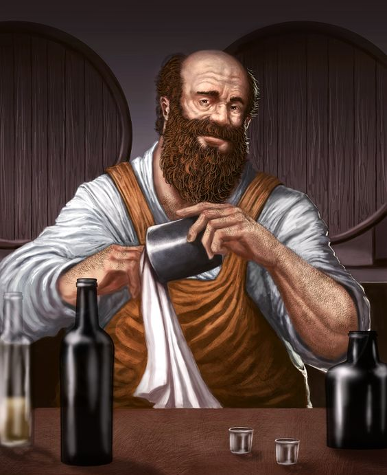

# Die Region Eldria

## Ortschaften der Region 

### Infrastruktur

## Die Geschichte der Region

## Wirtschaftliche Lage

### Die Ressourcen der Region

## Soziopolitische Lage 

### Herrschaftsystem/Organisation

## Klimatische Bedingungen

### Die Flora und Fauna

#### Monster in der Region

## Gerüchte der Region

## Sehenswürdigkeiten

### Ulias Spooners Taverne 

Ulias Spooner bezeichnet sich selbst als leidenschaftlicher Leistungstrinker und Lebemann, mit seiner Liebe zu schnellen Pferden und Wetten auf die Rennen ebenjener hat er meherere Vermögen er- und verspielt. Immer einen guten Spruch auf den Lippen und ein frisches Ale bei der Hand ist seine Taverne der Lieblingshalt vieler Reisender, Abenteurer, Glückssuchender und in der Gegend stationierter Soldaten.

