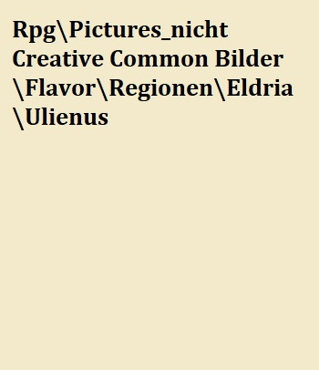

# Die Region Eldria

## Ortschaften der Region

Da auf die meisten Fürstentümer bereits im [Eldria Atikel](#EldriaFaction) eingegangen wurde sind hier die Verknüpfungen zu den jeweiligen Füstentümern. Die, die noch nicht näher beschrieben wurden sind im folgenden beschrieben:

* [Aearlham](#Aerlham)
* [Gent](#Gent)
* [Darcy](#Darcy)
* [Calvert](#Calvert)
* [Austen](#Austen)
* [Hasting](#Hasting)
* [Rintom und Haag](#Rintom und Haag)

### Statton

Statton used to be its own Führstentum however 500 years ago it was conquered by Aerlham and ever since Statton and its surrounding areas is under Aerlhams control. The Area around Statton used to be counted among the most peacefully areas in Eldria, were most people flourish, however after the empire attacked Eldria it saw a turn for the first. Prostitutes became very common und other crimes such as drug dealing and gangfights as well. Another important aspect of Statton is the massive empire Fort "". Here many new soldiers are trained and it is known for being one of the biggest recruit places for eldrian citizens. However there are 3 factions. The soldiers loyal to the empire, the soldiers loyal to Eldira and additional mercenaries from Grenzland that are brought into the cities to help with its various problems. These mercenaries are supposed to protect the city but are actually extremly corrupt. This doesn't help with the fact that the latter two groups often clash with each other in and around Statton, which in turn create negative efects for its citizens. SIMON: 6 groups that clash. Eldira drunkards, imperial Drunkards, City guards, Prositution and drug gangs, imperial petrol

### Infrastruktur

Eldria is known for being one of the most well connected regions in the world. Almost each city and town is connected to a road that leads to one of the major cities and each city has a road leading to another one. The biggest and most maintained road is the road from Aerlham leading to Gent. These two principalities are the most important and strongest in Eldria and as such many people and goods travel between them all year around. The next most safest and heavily guarded road is the one leading from Aerlham to ""(the city at the border of Eldria and Grenzland). Many Kaiserliche soldiers travel this road and they often accompany transporters carrying goods or people to the region. Another important destionation with many roads leading to it is Wandia. Wandia is a central part of ELdria and many people and armies travel to it. While Eldria is said to have many roads, they are not always the most safest for there are often wars being waged between the many principalities and they often cause a lot disarray. Futhermore many bandits and other unsavoury groups often roam eldria and attack people on the roads

## Die Geschichte der Region

[Die Geschichte von Eldria](#Die Geschichte von Eldria)
Simon hat gedanken dazu - We have to distinguish between North and South Eldria

## Wirtschaftliche Lage

Eldria is a place filled with a rich cutlture and numerous people however due to all these people and the many conflict that they create with each other, there is little room for consistant trade between all the factions. Moreover it is not uncommon for the armies to burn down villages and other trade installations, which has a negativ impact on the trade and production in the region. Because of this there are few profound and important resource hub but instead there are many smaller ones spread throughtout the entirety of Eldria. 

### Die Ressourcen der Region

he resources, which are most plentiful and important in Eldria are Holz, Zutaten, Felle, Stoffe. Eldria has a great love for hunting animals and many people creat allocated hunting spots for nobles to use. But killing animals is not only reserved for the Nobles. Many people have farms for collecting leather and pelts from animals in all parts of the region. Eldria even has a history of preparing mosnter hunting spots, however this practice is nowadays illegal but some nobles still search for the thrill of hunting monsters.

Eldria also has a lot of forests were they gather wood for building, heating and other areas were wood is acquired. Some of the most interesting wood can be found around Austen. Here yellow, orange and red trees can be found. These trees have special looks and properties and are loved by many of the nobles of Eldria

## Soziopolitische Lage 

Eldria is whirlpool of political plots and wars. Tension can be found throughout the entire region. Be it from the Kaiserreich and its soldier trying to occupy the region to the struggle between Gent and Aerlham or even the tension coming from Silva Nacia and the wood elfs. One thing is to be sure of though. If you are a noble in Eldria then there is never a moment of rest for you. War is the norm in Eldria and many factions and principalities  have a large history with each other that cause them to fight with each other and no corner of the region is outside of the reach of the sword and torch. 

 [Die kaiserliche Besatzung](#Die kaiserliche Besatzung)
 [Die Aufsplitterung](#Die Aufsplitterung)

### Herrschaftsystem/Organisation
Wir sollen wahrseinlich zusammen darüber reden, da du ein bessern Idee über das Herrschaftsystem hast und sonnst können wir Zusammen geile Idden dazu machen :D

## Klimatische Bedingungen

Overall, Edlria enjoys a temperate climate. The weather is often mild but there are big differences between the seasons, yet it is never too hot or too cold in the region 

### Die Flora und Fauna

#### Monster in der Region

Eldria is probably one of if not the region with the most monster in it. However it used to be even worse in the past as monsters could be found everywhere in the region but early on in Eldria's history its people began to hunt monsters down. This phenomenon happened even more after the Fall of Harschell. Nowadays people still hunt monsters and knights often seek them out for regognition and fame.

## Gerüchte der Region

### The green knight and the man Beast

throughout Eldria there exists a legend of two people who roam the land hunting down monsters that no other fighter is able to beat. This is the legend of the green knight whose real name is unknown and a animali called Satra Kra. These two fighters have been spotted around all the corners of Eldria and have been observed to fight the mightiest beast of Eldria. It is said that both of them are able to kill a werewolf in one shot. One time a peasant spotted them fighting Katakhan were Satra Kra had had his weapon stuck in its back as it was on fire. Satra Kra kept staying on its back even as it was furiously swinging side to side, tree to tree until it finally dropped dead on the ground. Another story tell of them killing a Gravis by themselves by lurking the monster into a cunning trap. Many people believe that these two people are the mightiest monster hunters in all of Eldria

### The Red Death knight

Almost everyone who has ever thought the undead are aware of how frighting they can be, especially if the undead happens to be a knight and it is well known that undead knights from Eldria are among the strongest undead that a person can face. Yet even among the undead knights there is one that stands out from the rest. Legends has it that a towering undead roams the land of Eldria since 107 years now. People believe that this knight used to be a man called Soloman Schwertun. Soloman used to belong to one of the old noble families of Eldria, however it fell to ruin along with Soloman himself. Rumors from over a hundred years ago said that the family and Soloman gto involved with the dark arts and with the bloodgods in order to gain more power. The family suddenly rose in wealth and influence but just as quickly as they gained it, it disappeared. Many people caught a wiff of their involvment with the blood gods and soon they were disregarded and disowned by the other families. While there power disappeared, one thing didn't and that was the strenght of Soloman. in the last few years before his death, he grew tremendously in strength and size and became a gruesome warrior that was said to have no regard for human life and after his family fell from power he swore revenge on all the people that had disowned his family. he soon began to hunt these people for their treachery. He managed to kill many people but finally after a few years the famous knight Joan Fraquis and his band managed to kill him, however Soloman killed every single person along with him. Sadly no one was able to bury their bodies and not after long Soloman became an undead knight. Ever since then his dead body has roamed the lands appearing randomly and killing mercilessly and until today no person has been able to rid the world of him

## Sehenswürdigkeiten

### Harschell

Harschell used to be one of the greatest cities to the east of Eldria ever since it came under the leadership of lord Louis, however after it was attacked by an army of monster it has been in ruins. People still live around the area but the city has never returned to its former glory

### The forest of Austen

Austen lays next to a very peculiar forest of yellow, orange and red trees. People say that entiring the forest is like entering a fairytale. The trees are like nothing most people have ever seen before and many people travel there just for this sight

### Ulias Spooners Taverne 

Ulias Spooner bezeichnet sich selbst als leidenschaftlicher Leistungstrinker und Lebemann, mit seiner Liebe zu schnellen Pferden und Wetten auf die Rennen ebenjener hat er meherere Vermögen er- und verspielt. Immer einen guten Spruch auf den Lippen und ein frisches Ale bei der Hand ist seine Taverne der Lieblingshalt vieler Reisender, Abenteurer, Glückssuchender und in der Gegend stationierter Soldaten.

## Notizen 

After the fall of Harschell most of the people of Eldria started hunt monsters so that it would never happened again. The nobles also joined and after many years it became a rival game/sport between them. Soon people started to raise monsters for the nobles to hunt. Nowadays this has been outlawed but it still happens in some parts of eldria

Statton
Statton used to be its own Führstentum however 500 years ago it was conquered by Aerlham and ever since Statton and its surrounding areas is under Aerlhams control. The Area around Statton used to be counted among the most peacefully areas in Eldria, were most people flourish, however after the empire attacked Eldria it saw a turn for the first. Prostitutes became very common und other crimes such as drug dealing and gangfights as well. Another important aspect of Statton is the massive empire Fort "". Here many new soldiers are trained and it is known for being one of the biggest recruit places for eldrian citizens. However there are 3 factions. The soldiers loyal to the empire, the soldiers loyal to Eldira and additional mercenaries from Grenzland that are brought into the cities to help with its various problems. These mercenaries are supposed to protect the city but are actually extremly corrupt. This doesn't help with the fact that the latter two groups often clash with each other in and around Statton, which in turn create negative efects for its citizens. SIMON: 6 groups that clash. Eldira drunkards, imperial Drunkards, City guards, Prositution and drug gangs, imperial petrol

