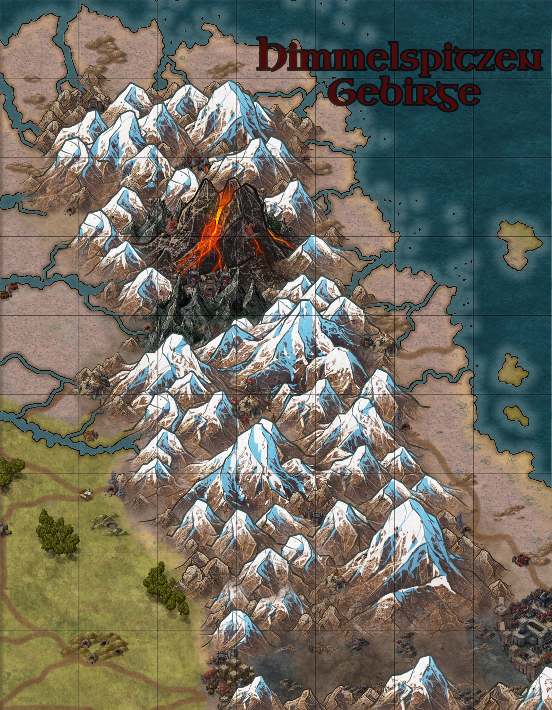
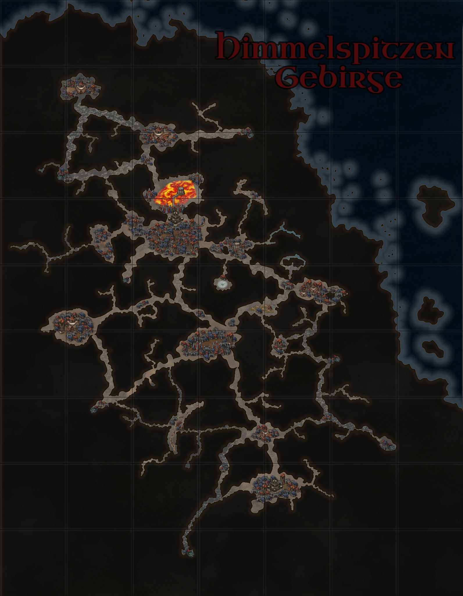

# Das Himmelsspitzen-Gebirge

On the surface Himmelspitzen Gebirge Is known for having the tallest mountains in the entire known world and it stands as a landmark for many surrounding regions. However, Himmelspitzen Gebirge is truly known for being the homeplace of the intellectual and money hungry dwarfs. While some traces of the dwarfen civilisation can be found on the surface in the form of dwarfen statues and remarkable entrances and hallways, the true wonder of the dwarfs is found beneath the ground in the tunnels and cave systems of Himmelspitzen Gebirge.

The dwarfs have lived here for many generations, cultivating the Karst landscape to their liking with their revered technology and constructs and today, Himmelspitzen Gebirge stands as a beacon of industry, hidden from the world above. As outsiders cautiously tread into this subterranean realm, they are met not only with the echoes of a fractured past but also with the meticulous and disciplined society that emerged from the past civil war.

 

## Ortschaften der Region

### Irnidormir

Nestled next to the embrace of the molten lakes of Vonmer lies the grand capital of the dwarves Irnidormir. Also known as the heart of the depths or the Volcanic city, Irnidormir was ones the home of the royal family Umgar, however this has not been the case since the civil of from a long time ago. Irnidormir is known for being one gigantic construct city that is ever growing and repairing itself almost as if it was a living organism. The only city which slightly come close to Irnidormir in magnitude and ingenuity and complexity is that of the cityships of the Seevolk. The city is further characterized by the sheer amount of constructs inhabiting the city and maintaining almost every aspect imaginable. Even some dwarfs are stunned by the mechanical beauty of the city when they first lay their eyes on the grand scenery. Many citizens of Irnidormir have often wondered as to what the function of the massive city and it's constructs is and while there are many differentiating theories, many of them link to the idea that the purpose of the city has something to do with the volcano, which the city is centred around. Additionally, the city functions as a hub for many of the clans and mega firms, which the dwarfs are so commonly known for. These companies have agreements and contracts with each other to allow stability and prosperity in the city, but conflicts can still rupture in the city streets and behind the scenes of many dealings, often leading to strife in the city for many inhabitants.

### Hineldur

A testament to the dwarves' unyielding dedication, this city hums with the vibrancy of commerce and the prowess of craftsmanship. Within the city's vast caverns, an intricate network of bustling markets and guild halls thrives, each echoing with the sounds of bargaining and the exchange of goods. Here, in the gateway into the dwarven empire, traders from all corners of Orbis Astea converge, drawn by the promise of quality craftsmanship and rare commodities.

Hineldur, though pulsates with an energy born of shrewd negotiations, even more so than what the dwarves are known for, and the mutual prosperity that transcends realms, embodying the unifying force of trade within the world's interconnected web of factions. Here each alley can be compared to an art gallery, where the art has been replaced by intriguing items of dwarven ingenuity, as each vendor might just have some sort of merchandise that will change your life for the better, but maybe also turn it around for the worse.

Although not rich in resources itself, is Hineldur the city that is in possession of the most natural material right after the capital Irnidormir. However, due to its strategic location will any trader who enters the city be able to find a wider range of sophisticated items as many of the rarer materials from around the world enter the dwarven realm through Hineldur and stay there indefinitely. Due to this unique condition of the city will you be able to find several mega firms that rely on these special materials for their various products.

### Thanahm

Thanahm - Nestled deep within the craggy embrace of the towering peaks, Thanahm stands resolute as a testament to the enduring legacy of dwarven heritage. As one of the oldest cities within the sprawling dwarven empire, it breathes life into ancient customs and rituals, preserving them within its sturdy stone walls. Its cobbled streets and towering spires whisper show tales of the long influence of the first mega firm that shaped dwarven craftsmanship, namely StoutCrafts, which lies at the heart of the city.

Because of StoutCrafts long hold believe in steadfast commitment to simplicity, durability and tradition can the same liveliness to the way of live be found in each corner of the city. Bustling energy pervades the air, a fervor unmatched in any other dwarven settlement as it holds onto old cultures and rituals more than any other city in the dwarven empire.

However, you shouldn't get fooled, just because the city can be old fashioned doesn't mean that it isnt rich in trade and the exchange of money. as one of the biggest dwarven cities is it no wonder that many of the older mega firms got their first inspirations from StoutCrafts and now also hold a firm grip over the economy of the city.

### Vigh Boldor

-   Vigh Boldor stands as the heart of dwarven innovation for combat prowess. Beyond the stout walls of this bustling city echoes the annual spectacle that ignites the passions of every dwarf worth their steel, namely Construct Brawl, the revered national dwarven sport. Here, amidst the thunderous clashes and roars of the crowd, the mighty creations of construct mega corps Elysian Exquisites, Emberglow, and the renowned Tahl clash in a mesmerizing display of engineering and strategy. The city's fervor intensifies as other aspiring groups sponsored by various mega firms also vie for glory, showcasing their ingenuity in combat technology. Yet, beyond the arena, lies the whispered secret of Eobroria---also known as the prized "construct's elixir". This rare plant's precious liquid, if extracted correctly, serves as the lifeblood of Vigh Boldor, coveted for its unparalleled prowess as hydraulic oil. As each drop is treasured, the city's craftsmen guard this resource fiercely, ensuring their machinery's peak performance and maintaining the city's unrivaled stature in the realm of technology. It is rarely found outside of the dwarven realm as almost every dropped is used in the city of Vigh Boldor itself.

### Infrastruktur

The Infrastructure of Himmelspitzen Gebirge has been called a marvel of engineering by almost all that have laid their eyes on it. The intricate network of the tunnels beneath the surface are sometimes known as the dream subspace tunnels for their seemingly fast and otherworldly transportation systems.

However it wasn't always like this. Many parts of the cave systems used to be paths simply created by Lindwurmen or various goblin tribes but with the creation of the Deeprock Astea company, the infrastructure of the dwarfs revolutionized and was turned into the what has been marked as the best subterranean infrastructure in the entire world.

These subterranean arteries serves as the lifeblood of the dwarven society, connecting the vast underground city and both the Rah Kari and the Empire with the dwarven outposts. Unlike the roads of the above world, the tunnels and cave systems of Himmelspitzen Gebirge are lit by luminescent waystones, which guide the caravans to the with the soft glow that ensures safe passage.

## Die Geschichte der Region

In the depths of Himmelspitzen Gebirge, the dwarves stake their claim as the oldest humanoid race on the continent. However, no one can confirm this, and skeptics believe it originated from a campaign around 270 years ago to elevate the dwarves' reputation. In this endeavor, the physically sturdy dwarves were portrayed as serious, wise, and, in a somewhat contentious choice of words, "all-knowing. But it is undoubtedly believed that the dwarves are an ancient race. Ruins of their once widely spread cities in Himmelspitzen Gebirge, crafted into the worm-ridden tunnels beneath, indisputably attest to longer traces of their existence.

Extracting information from dwarves is no easy task, as they universally demand payment for the one-sided exchange of information. According to ancient inscriptions and paid dwarven historians, the "first" Umgar royal lineage was known as "the Red." However, dating is impossible due to archives collapsing and burning during earthquakes. Presumably, the dwarves lived in strong cooperation under the iron hand of the Umgar lineage in the mountains and earth of Himmelspitzen Gebirge.

The dwarven folk, once united under the red banner of Clan Umgar, dedicated themselves to accumulating resources, exploring Orbis, and seizing all valuable things within reach. The dwarven folk, once united under the red banner of Clan Umgar, dedicated themselves to accumulating resources, exploring Orbis, and seizing all valuable things within reach. The Clan Umgar was even accused of hoarding all these treasures, suggesting that there was no actual task. With this thought, the revolution ignited. In each of the now numerous and well-connected dwarven cities, conflict erupted. "Progressives" against the Royalists proudly raising their royal red banners, with the latter significantly outnumbered. The dwarves' hearts were too deeply entrenched in greed. During this time, known among historians only as the End of Sharing, the tunnels filled with dwarven blood. Many dwarven cities did not survive this civil war and are now nothing but ruins, delving deep into the earth. Others collapsed entirely under the weight of war, burying entire clans, and still others were weakened to the point where the cities could no longer withstand attacks from other races that coveted their wealth. The Clan Umgar itself splintered into many small pieces scattered across all cities. However, the royal lineage survived, albeit stripped of its power.

After the civil war new ideas sprouted among the dwarves, and they became known as the "freshly hatched dwarves." This distinction caught the attention of orcs and Rah Kari, emphasizing the meticulous nature of the dwarves. Every word and action carried weight, and documentation became a cornerstone of their existence, a departure from the conventional ways of the Rah Kari merchant caste. This, inadvertently, led to restrictions on permits for dwarven traders moving outside the main cities, putting pressure on local "disorganized" traders. The Kaiserreich and the loose Eldrier alliance faced similar challenges, as dwarves, when tolerated, suddenly amassed the entire wealth of a village in their small hands.

As the dwarves turned inward, their economic system evolved. The drive for wealth, now confined by the limited space, pushed them to refine their skills and knowledge. In this crucible of scarcity, the dwarves became true masters of trade and craftsmanship. However, the Rah Kari, Eldria and even the Kaiserreich were cautious in their dealings with dwarven traders, who, despite their size, held immense economic power. Despite their civil war, the dwarves remained connected to the Empire and Rah Kari lands through an extensive tunnel system. This intricate infrastructure facilitated the movement of caravans, connecting the dwarven capital to major trade routes. The economic strength of Himmelspitzen Gebirge relied on the precious metals, ores, and salt found in abundance in their subterranean realm. This wealth, coupled with their mastery of trade, made the dwarves formidable players in the regional economic landscape.

For the first many years the socio-political landscape of Himmelspitzen Gebirge became marked by an everlasting competition between dwarven clans and corporations. Peaceful times were relatively rare, as the competitive nature of the dwarves spurred continual contests for dominance. Newly founded and already existing Mega-corporations took centre stage in most major actions, influencing not only the economy but also the political and social fabric of the region. Clashes, sometimes literal, among these mega-corporations defined the power dynamics in Himmelspitzen Gebirge.

## Wirtschaftliche Lage

The economy of Himmelspitzen Gebirge pulsates like no other in the world. Trade and goods flow through the veins of its intricate tunnels, creating a thriving tapestry of wealth and commerce.

The dwarves of Himmelspitzen Gebirge stand as masters of economic prowess, leveraging the expertise knowledge in haggling, crafting intricate artifacts, constructs and other goods, and of course producing dwarven steel. The caravans originating from Himmelspitzen Gebirge traverse the entire world, facilitating extensive trade with almost every faction imaginable. Many people throughout the world revere the dwarfs as the controllers of the world's economy.

However, at the core of the dwarven economy lies the mega corporations............

### Die Ressourcen der Region

Being a region, which is primarily located underground, Himmelspitzen Gebirge boast a bounty of resources that echoes through its tunnel and mines, being dug up by the dwarfs endlessly throughout the year. Veins of precious metals and gems lie in the most central mines of the dwarfs, being the backbone of many cities. These gems and prized metals are used in many industries and crafts throughout Himmelspitzen Gebirge and are even sought after outside of the dwarven lands.

Furthermore, ores such iron, goal, copper and many are the corner works of many cities. Dwarven miners delve deeper and deeper into the earth every day to extract these coveted ores to fuel their forges and provide the neighbouring regions with sought after resources.

Salt, in the intricate tapestry of dwarven lives, has transcended mere seasoning to become an indispensable need for every dwarf, man, and woman alike. Scattered abundantly across the region, both on the surface and in the subterranean depths, these salt sources stand as vital nodes in the dwarven landscape, rivalled only by the salt-rich expanse of the Nors region.

The Eobroria, a plant with blue glowing petals, known for its use in the most exquisite of dwarven engineering, is to craft perhaps the best hydraulic oil in all of Orbis Astea. It is located only in Vigh Boldor due the unknown conditions that allows it to grow there. Any merchant in outside of Himmelspitz Gebirge would be lucky to get their hands on it as it is mostly found inside the city of Vigh Boldor and rarely in other dwarven cities.

## Soziopolitische Lage

In the realm of Himmelspitzen Gebirge, the dwarven society unfolds, characterized by an enduring spirit of competition. Within the echoing chambers of the mines and vast underground halls, dwarven clans and corporations engage in an unceasing contest for supremacy, each dwarf wanting to out earn the other and to leave an indelible mark on the bedrock of their civilization. However despite this relentless drive for superiority, paradoxically, the cities of the dwarfs are not marked by endless conflicts and battles. The competition, once a potential source of conflict, has undergone a transformative shift. Amidst the resounding echoes of industry, the dwarfs have forged a unique harmony by signing treaties on trade, land, copyright and other necessities for cooperating in their unique way, nonetheless the dwarfs are all opportunist and behind the scenes conflicts take place, which never see the light of day.

At the forefront of this dynamic landscape are the mega corporations - colossal entities that wield influence akin to that of kings. These corporations, towering over the intricate web of clans, orchestrate significant actions that shape the economy of the dwarfs. From pioneering mining endeavors that delve into the very heart of the mountains to intricate trade negotiations that resonate across the vast caverns, these mega corporations are the architects of Himmelspitzen Gebirge's destiny.

### Herrschaftsystem/Organisation

## Klimatische Bedingungen

Beneath the craggy surface of Himmelspitzen Gebirge, a unique subterranean climate unfolds. In the ones natural order of caves, marked by cold and darkness, the industrious dwarves bring a paradoxical warmth through their ceaseless activities. Their forges and industries, scattered throughout the vast cave networks, act as subterranean furnaces, turning the underground world into a sanctuary of warmth.

At the heart of this heated labyrinth lies the capital, centered around the formidable volcano Vonmer. A source of constant warmth for the city. Vonmer's fiery exhalations create a microclimate, where the contrast between natural chill and dwarven warmth weaves a unique harmony

### Die Flora und Fauna

In the depths of Himmelspitzen Gebirge little live can survive or prosper without the dwarf's consent. Most the fauna in the cave systems of Himmelspitzen Gebirge consists of a variety of mushrooms. The dwarves have ingeniously cultivated mushrooms to serve multiple purposes. These subterranean fungi, carefully nurtured through generations, not only provide a perpetual, gentle glow, casting a warm light across the caverns, but also serve as a primary source of food for the dwarven community.

The soft luminescence of these mushrooms creates an enchanting atmosphere in the subterranean expanses, allowing the dwarves to navigate the depths without the need for many external light sources. Their skilled cultivation has turned the once-dark caves into a lively and thriving environment for the dwarfs.

#### Monster in der Region

## Gerüchte der Region

### Durin the Stoneforger

In the shadowy tunnels and bustling streets of Himmelspitzen Gebirge, a persistent rumor has been going around about the current whereabouts of Durin Stoneforge, a master craftsman who vanished mysteriously two decades ago. Whispers suggest that he hasn't met his demise, but rather embarked on a solitary journey to the mountain range. Legend has it that Durin stumbled upon a peculiar metal that descended from the sky in a fiery meteorite. Driven by an unyielding passion for his craft, he retreated into the heights, seeking solitude to unravel the mysteries of this extraterrestrial metal. For decades he has dedicated his spirit and time to mould and forge this metal into whatever it should desire, however to no avail.

Seemingly some have managed to track down Durin, drawn by the allure of his legendary craftsmanship. His name echoes in the ears of weapon enthusiasts and collectors alike, for he was known to forge some of the most exceptional personal weapons in the known world. However, those who dared to climb the treacherous paths to find him returned empty-handed. Rumor further suggests that Durin refuses all requests for weapons and artifacts until he unlocks the secrets of the celestial metal. Some claim to have glimpsed the glow of a forge amidst the craggy peaks, fueled not by earthly coals but by the ethereal essence of the meteoric metal. 

## Sehenswürdigkeiten

### The blades of Unity -- Telarin's bond and Elaita Embrace

Forged in the heart of Himmelspitzen Gebirge, the Blades of Unity stand as a testament to the unbreakable bond between the dwarven realm and the human empire. Crafted from the finest dwarven steel, these twin blades were meticulously shaped by the skilled hands of the dwarves' greatest craftsmen.

In a gesture of profound diplomacy, one blade Telarin found its home in Civis Primae, the heart of the human empire. Safeguarded by the royal family, it stands as a symbol of enduring friendship between the two races. Its twin Elaita resides in the heart of the dwarven capital, ensconced within the human embassy. Here, under the earth, protected by the stalwart guardians of Himmelspitzen Gebirge, the blade represents the dwarves' commitment to fostering goodwill and collaboration.

Its twin resides in the heart of the dwarven capital, ensconced within the human embassy. Here, under the earth, protected by the stalwart guardians of Himmelspitzen Gebirge, the blade represents the dwarves' commitment to fostering goodwill and collaboration. Legend tells of their intertwined fate. Elaita, daughter of a master blacksmith involved in the forging, ventured to the human empire, where she met and fell in love with Telarin. It was here that she ended up spending the rest of her life. Together, they established a maritime enterprise crucial to both realms, facilitating the exchange of sea goods that enriched the dwarven empire. When these blades, each bearing the face of one from the other's realm on the hilt, are united in a clash, they resonate with a harmonious hum, akin to bells that could be heard the day were the people from different lands were married.

### The dwarven Construct Brawl

In the depths of Himmelspitzen Gebirge, a true spectacle unfolds - the Dwarven Construct Brawl. This national sport, deeply ingrained in dwarven culture, transforms each major city into a host for thrilling competitions where mega corporations showcase their engineering prowess through their own unique constructs. Unlike traditional sports arenas, these Construct Brawl events are dynamic and ever-changing. Each dwarven city boasts a specially designed arena with its own unique features and form and the constructs, mammoth machines of destruction, navigate through intricate circuits.

Spectators from all corners of Himmelspitzen Gebirge converge to witness the spectacle, eager to see how each corporation adapts its construct to the unique challenges of a different arena. The arenas, diverse in their designs, add an extra layer of anticipation. Some feature tight turns and complex underground mazes, while others boast expansive caverns and towering obstacles. The ever-changing locations inject an element of unpredictability, keeping both competitors and spectators on the edge of their seats.

For tourists and battle enthusiasts, attending a Dwarven Construct Brawl is a dynamic journey into the heart of dwarven culture and technological innovation. The switch from arena to arena mirrors the high-stakes excitement of dynamic, cutting-edge competitions, making these events a thrilling addition to the vibrant tapestry of Himmelspitzen Gebirge.

### Brilglimmer Depths

Far deep in the caves of Himmelspitzen Gebirge lies the mystical wonders of Brilglimmer Depths, a subterranean sanctuary in Himmelspitzen Gebirge adorned with unique, breathtaking crystals that defy the ordinary spectrum of colors found on Earth's surface. These extraordinary formations, bathed in ethereal hues, create an enchanting spectacle unseen elsewhere.

Within the cavern's radiant embrace, the Lumina Weavers, a species of harmless crystal spiders, spin their delicate webs. These arachnids, with their iridescent crystalline bodies, add an otherworldly charm to Brilglimmer Depths. These spiders, admired for their exotic charm, have often become sought-after gifts, fostering goodwill beyond the cavern's confines.

### The Everlasting Crimson Sky of Gokhelin’s Camp

Deep within the subterranean expanse of the dwarven realm lies a point of fascination—the Everlasting Crimson Sky of Gokhelin’s Camp. Lady Gokhelin, an industrious and ambitious dwarven corporation owner, sought to establish her own thriving city fueled by her company's mastery over heat energy. However, tragedy struck when an accident caused by her pioneering technology ravaged the camp, consuming everything and snuffing out lives in its fiery embrace. Amidst the charred remains, a startling discovery unfolded—a vast reservoir of red gems, later named Gokhelin's Ember, lay concealed within the cave's towering ceiling. These gems, which radiate a haunting crimson glow when shrouded in darkness, were an uncharted marvel. As the dwarves always illuminated the cavern, the gems remained undiscovered until tragedy struck. Now, the cave stands as an everlasting testament to Gokhelin’s ambition, its ceiling adorned with the radiant red hue of the gems, casting an ethereal semblance of a crimson sky within the dark depths of the underground realm.