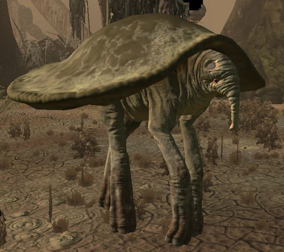
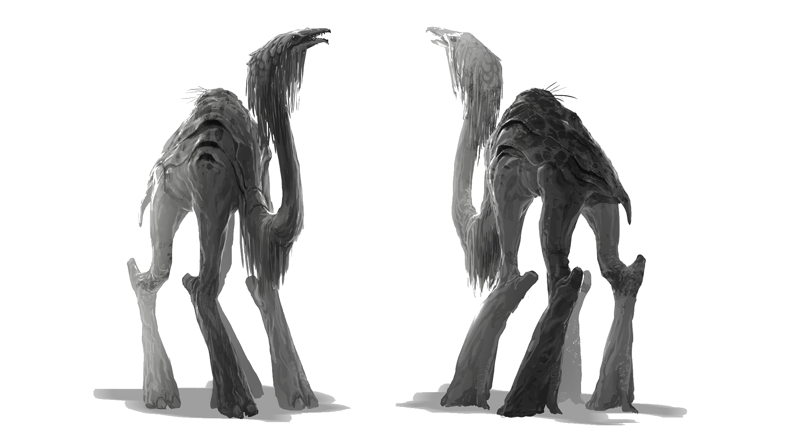

# Der Nebelhain

## Wissenswertes über den Nebelhain {#NebelhainHintergrund}

> "Wer durch den Nebelhain durch will der hat seinen Verstand schon verloren bevor ihn der Nebelhain holen konnte."
>
> --- Heiler Arhenius Kaltius

Die Geschichten über den Nebelhain reichen weit zurück. Die Entstehungsgeschichte ist unklar. Mündlichen Sagen von Orks und Zwergen zufolge war einst eine risiege Zwergenmetropole mit Sitz über den Ebenen des Nebelhains.  Als die Zwerge zu tief schürften Schmolz ihnen zuerst das Gold in den Kammern zu großen Klumpen und danach Verschlang ein Vulkan alle Lebenden in der Zwergenstatt, was von Forschern als Humbug abgetan wird.
Von den Forscher wird allerdings klar dargestellt, dass eine Zwergenstadt, welche sich auf das Gießen und Testen von Kanonen verstand. Durch die Explosion wurden allerdings unter Tage fließende Flüsse derart umgeleitet, dass die ehemaligen Weiten geflutet wurden.

Seit nunmehr 700 Jahren, als dieses Ereignis stattfand haben sich die einstiegen Ebenen mit teils Dichten Wäldern in ein riesiges sumpfartiges Gebiet verwandelt.

Die Wassertiefe ist teils unvorhersehbar und ermöglicht nur leichten Booten mit niedriegen Tiefgang das passieren.

Für Fußsoldaten ist es eine beschwerliche und anstrengende Marschroute.
Neben Mücken und Egeln und etlichen bis dahin unbekannten Krankheiten stechen auch die Berichte über den Verlust des Verstandes  hervor.

Bis jetzt konnte über diese Krankheit welche den Verstand der betroffenen Zeitweise beeinträchtigt wenig Erfolgsversprechendes vorweisen.
Die Symptome klingen für gewöhnlich nach dem verlassen des Nebelhaines rasch ab.
Madaria genannt macht diese auch Vorstöße in koordinierter weise rasch zu nichte.
Hierbei ist zu erwähnen, dass Madaria auch Tiere einherfällt. Ob Pferde Ziegen Hühner Hunde oder Wölfe - Berichte über seltsame Verhaltensweisen gibt es aus diversen Tiergruppen.

Versuche die Luft aus dem Nebelhain zu etrahieren um die Effekte der Krankheit zu erzeugen scheitern seit über 80 Jahren immer wieder ohne nennenswerte Fortschritte.

Visuell ist der Nebelhain geprägt von kleinen Flecken trockenen Landes auf denen Reste von Wäldern oder Häusern stehen. Die beinahe stehenden Wassermassen sind teils mehrere Meter tief wobei die Ursache für diese tiefen Risse im Boden nicht bekannt sind.
Daraus aufsteigendes Wasser ist für gewöhnlich angenehm warm, hat allerdings einen fauligen Geruch.

Bekannt ist auch, dass bereits im Laufe der Jahrhunderte unzählige Arme Seelen ihr Leben verloren haben. Sie wandern lange durch die Sümpfe bis ihnen ein waghalsiger Gläubiger die Ehre erteilt Sie zu begraben.

Bergbau findet, unüberrraschender Weise im Nebelhain nicht statt, so wie  es keine bewohnten Städte im Nebelhain gibt.

## Die Sumpfbewohner

Viele verschiedene Rassen und Gruppen haben sich im Nebelhein häuslich eingerichtet, Menschen, Orks und andere unbekannte Wesen richten dort primitive behausungen ein und leben und Sterben wie die Fliegen. 

## Flora und Fauna

### Swamp turtle
These creatures, as their names imply, look like giant green turtles with elements of elephants as well. Many travelers who see them often mistake them for walking trees due to the size and quiet nature. They are mostly found in pacts around swamps and will only attack when provoked.

### Cornelius

Cornelius sind friedliche Herbivoren, die die lichteren Gegenden des Nebelhain und die Vorläufe von Appothis bewohnen. Sie sind Rudeltiere, die in festen Familienverbänden aufwachsen, reisen und sich gegenseitig verteidigen. 
Sollten sie sich verteidigen, verwenden sie ihren Kopf - dank der verstärkten Schädelplatte - als überraschend effektiven Rammbock.

Durch ihre beeindruckende größe und ihrem langen Hals sehen sie mögliche Bedrohungen meistens sehr früh. Sie erreichen eine Hohe von bis zu drei Meter, und ihr Hals wird bis zu zwei Meter lang.

Um diese Kreaturen zu bekämpfen, ist es empfehlenswert, ihre größe zum eigenen Vorteil zu nutzen. Aufgrund des langen Halses des Cornelius und seiner geringen Intelligenz ist es nicht schwer sie mit Hilfe von Fallen auszuschalten.

