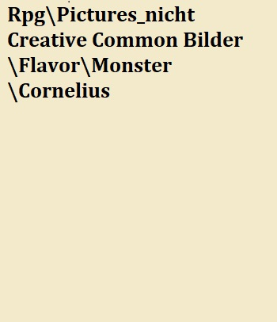

# Der Nebelhain

> "Wer durch den Nebelhain durch will der hat seinen Verstand schon verloren bevor ihn der Nebelhain holen konnte."
>
> --- Heiler Arhenius Kaltius

Die Geschichten über den Nebelhain reichen weit zurück. Die Entstehungsgeschichte ist unklar. Mündlichen Sagen von Orks und Zwergen zufolge war einst eine risiege Zwergenmetropole mit Sitz über den Ebenen des Nebelhains. Als die Zwerge zu tief schürften Schmolz ihnen zuerst das Gold in den Kammern zu großen Klumpen und danach Verschlang ein Vulkan alle Lebenden in der Zwergenstatt, was von Forschern als Humbug abgetan wird. Von den Forscher wird allerdings klar dargestellt, dass eine Zwergenstadt, welche sich auf das Gießen und Testen von Kanonen verstand. Durch die Explosion wurden allerdings unter Tage fließende Flüsse derart umgeleitet, dass die ehemaligen Weiten geflutet wurden.

Seit nunmehr 700 Jahren, als dieses Ereignis stattfand haben sich die einstiegen Ebenen mit teils Dichten Wäldern in ein riesiges sumpfartiges Gebiet verwandelt.

Die Wassertiefe ist teils unvorhersehbar und ermöglicht nur leichten Booten mit niedriegen Tiefgang das passieren.

Für Fußsoldaten ist es eine beschwerliche und anstrengende Marschroute. Neben Mücken und Egeln und etlichen bis dahin unbekannten Krankheiten stechen auch die Berichte über den Verlust des Verstandes hervor.

Bis jetzt konnte über diese Krankheit welche den Verstand der betroffenen Zeitweise beeinträchtigt wenig Erfolgsversprechendes vorweisen. Die Symptome klingen für gewöhnlich nach dem verlassen des Nebelhaines rasch ab. Madaria genannt macht diese auch Vorstöße in koordinierter weise rasch zu nichte. Hierbei ist zu erwähnen, dass Madaria auch Tiere einherfällt. Ob Pferde Ziegen Hühner Hunde oder Wölfe - Berichte über seltsame Verhaltensweisen gibt es aus diversen Tiergruppen.

Versuche die Luft aus dem Nebelhain zu extrahieren um die Effekte der Krankheit zu erzeugen scheitern seit über 80 Jahren immer wieder ohne nennenswerte Fortschritte.

Visuell ist der Nebelhain geprägt von kleinen Flecken trockenen Landes auf denen Reste von Wäldern oder Häusern stehen. Die beinahe stehenden Wassermassen sind teils mehrere Meter tief wobei die Ursache für diese tiefen Risse im Boden nicht bekannt sind. Daraus aufsteigendes Wasser ist für gewöhnlich angenehm warm, hat allerdings einen fauligen Geruch.

Bekannt ist auch, dass bereits im Laufe der Jahrhunderte unzählige Arme Seelen ihr Leben verloren haben. Sie wandern lange durch die Sümpfe bis ihnen ein waghalsiger Gläubiger die Ehre erteilt Sie zu begraben.

Bergbau findet, unüberrraschender Weise im Nebelhain nicht statt, so wie es keine bewohnten Städte im Nebelhain gibt.

## Ortschaften der Region

Eifrigen Chronisten Eldrias, vor allem aus den Fürstentümern Haag und Gent verdanken wir die Überlieferung der ehemals blühenden Städte Alt-Haag, Eiden und die Zwillingsstadt Ash-Main-Tahp / Hejning. Alle drei Städte wurden entweder durch den Felsturz von Istval oder durch Sekten zerstört.

### Alt-Haag

Alt-Haag wurde urkundlich zum ersten mal rund 950 v. Riga erwähnt. Es handelte sich Anfangs um eine Stadt welche sich klar in die Richtung des Lebhaften Mixes der Kultur der Rah-Kari und des typischen Eldrischen Kulturkonglomerates nach dem Vorbild von Ash-Main-Tahp / Hejning entwickelte. Die immer wieder kurzfristigen Verträge der Fürsten Eldrias beschränkten jedoch ab 857 v. Riga den Einfluss der Rah-Kari zunehmends. Die Gebäude im Stil der Rah-Kari waren zwar noch immer mit prunkvollen Tempeln geschmückt, jedoch verwaisten diese zusehends bis der Felsturz von Istval rund 700 v. Riga die Stadt immer weiter überflutete. 824 v. Riga unterließ der damalige Fürst der Stadt Earlham Thornville das Dekret "Rückbesinnung der Werte" und schaffte dadurch gesetzlich die Grundlage zur 2 Klassen Gesellschaft. Die Rah-Kari zogen den kürzern und das Verhältnis bewog sich immer mehr Richtung Eldrianer.

743 v. Riga wurde die Stadt, nach Jahren anschwellender Spannung zu einer massiven Festung umgebaut, welche nie von den Rah-Kari erobert werden konnte da die Festung in den neu entstanden Sümpfen zunehmends verschwand und seine Bedeutung dadurch verlor. Der kontiuierlche sterben Alt-Haags fand sein berüchtigtes Ende in den "roten Wochen" wo Anhänger eines Blutgottes den letzten glorreichen Antlitz Alt-Haags verbrannten.

Die Überreste Alt-Haags sind nur von wenigen dutzenden Bewohnern, welche nicht der Geistesseuch einherfallen bewohnt und fristen ihr dasein im sammeln von Beeren und jagen von Tieren und gelgentlichen Einnahmen aus Erzählungen für mutige Abenteurer oder akribischen Chronisten.

### Eiden

Eiden stellte das Sinnbild von aufgeschlossenen Eldrianern dar, welche sich allerdings ihrer langen Kultur, und ihrer Abscheu gegenüber Elfen mehr als bewusst waren. Eiden war eine Stadt mit einer blühenden Holzwirtschaft mit einigen der besten Handwerksstätten der ganzen bekannten Welt. Das bekannteste Kunstwerk oder Gebäude, oder Baumbehausung war die Zitadelle der Holzspanner- die größte und älteste Handwerksvereinigung Eidens.

Eiden zeichnete sich auch durch ausgezeichnete Weine, reges Verleihgeschäft und Goldschürferei im damaligen Perlfluss aus. Der Perlfluss stellte auch die Möglichkeit dar Holzwerkstücke und Holz als Rohstoff kostengünstig nach Eldria zu verschiffen. Die Gründung von Eiden ist Datumsmäßig nicht zu beziffern, da es bis heute keine Urkunde von Eiden gibt. Aus Tradition wurde immer die Stadtgrenze gezogen indem man alles zu Eiden zählte was eine Tagesreise vom Rosenbaum entfernt lag. Der Rosenbaum, an dessen Stelle nach einem Blitzeinschlag die Kaserne von Eiden errichtet wurde, war einer rund 70 Meter hoher Baum welcher jedes Jahr im Herbst seine Blätter Blass Rosa färbte und diese dann in der gesamten Stadt verteilte.

Eiden wurde ebenfalls durch den Felssturz von Istval rund 700 v. Riga überflutet und die Bewohner un die Handwerkergilden gaben nach rund 20 Jahren auf höhere und bessere Dämme zu errichten und so wurde die Stadt dem Zerfall überlassen.

### Ash-Main-Tahp / Hejning

Als Juwel aller Menschen bezeichnete Stadt Ash-Main-Tahp / Hejning war die religiös freieste und auch wohlhabendste Stadt an der Grenze von Eldria und Appothis. Die Stadt erwuchs über 300 Jahre lang friedlich unter einem Triumvirat aus Priester der Rah-Kari, dem Königspaar und dem Turm der Gelehrten - eine Vereinigung von Alchemisten, Forscher und Handwerkern. Diese Triumvirat zeigte sich beinahe unkorrumpierbar und so wurden über die Jahrzehnte hinweg Ash-Main-Tahp / Hejning zu einer Stadt welche den Haupstädten der großen Reiche in wenigen Aspekten nach Stand. Trotz bedeutend kleiner Bevölkerung war die Wirtschaftsmacht von Ash-Main-Tahp / Hejning derart groß, das der Friede von Eldria erzwungen werden konnte, welcher die Handelsbeziehung gesamt Eldrias für knapp ein Jahrhundert prägte und in Eldria als das goldene Zeitalter gilt.

Ash-Main-Tahp / Hejning wurde 2 mal von der Blaulungenpest heimgesucht und es war in dieser Stadt wo die Verwendung der vor Ort weit verbreiteten Uraninanblume als Mittel gegen die Blaulungenpest entdeckt wurde. Seither machte Ash-Main-Tahp / Hejning mit dem Verkauf fertiger Tinkturen hohe Gewinne und konnte sich als einzige bekannte Stadt die Ausbildung in Lesen und Schreiben für alle Bürger leisten.

Geschickte Diplomatie mit den Rah-Kari ermöglichte dem Triumvirat weitestgehend auf ein Militär zu verzichten und hatte lediglich eine größere Stadtwache, welche allerdings weitaus besser ausgerüstet war als gemeine Soldaten.

Schlussendlich wurde allerdings Ash-Main-Tahp / Hejning ebenfalls durch den Felststurz von Istval großteils unter Wasser gesetzt und so mussten einige Viertel ganz aufgegeben werden. Diese Viertel waren die Viertel der Rah-Kari wodurch es danach zu einer Machtverschiebung im Triumvirat kam welches schlussendlich die goldenenn Jahre in ganz Eldria beendeten.

### Infrastruktur

Der Nebelhain weist im eigentlichen Sinne keine Infrastruktur mehr auf. Einzelne Häuser und Überreste der 3 großen Städte Eldria (Alt-Haag, Eiden und Ash-Main-Tahp / Hejning ) haben in höher gelegennen Bereichen noch ausgetreten Pfade wo man mit Glück trockenen Fußes wandern kann, jedoch sind viele Pfade zumindest Knöcheldick von Wasser bedeckt welches mit derart vielen Egeln durchseucht ist, das man gesegneten Verstandes wäre wenn Geld in gute hohe Stiefel investiert wird.

Einige Pfade lassen sich Streckenweise nur mit Booten durchqueren welche allerdings in vielen Fällen seit ewigkeiten nicht mehr gewartet wurden, sodass Geld neben Stiefel in Handwerker investiert werden sollte.

## Die Geschichte der Region

Der Nebelhain war früher die Südlichen Ausläufer Eldrias und bilden eine natürliche Vertiefung ab, welche man früher an klaren Tagen vom Eldrias Berg "Raustein" Überblicken konnte. Es waren gemischt grüne Wälder, fischreiche Flüsse und mehrere Erzminen - vor allem an den Grenzen zu den Himmelsspitzen. Viehwirtschaft, Jagd, Holzhandwerk und Handel mit Gütern der Rah-Kari und Eldrias spielten eine bedeutsame Rolle.

Verhältnismäßig frei waren die Städte Eldrias auch, zumindest in die eine oder andere Richtung.

Der Felsturz von Istval, über dessen Ursache breit spekuliert wird, leitete den langsamen Zerfall der Region ein und mit dem schwinden der Menschen, schwand auch die Bedeutung der Städte und irgendwann war die Region der Bevölkerung nur mehr als Nebelhain bekannt.

Ab diesem Zeitpunkt wurde der Süden Eldrias, der Nebelhain von Jahrzehnt zu Jahrzehnt merkwürdiger. Gechichten von Menschen die den Verstand verlieren bekannt als Madaria, Egel welche so groß warden, dass Sie Männer als ganzes Verschlangen, und merkwürdigen Kreaturen welche scheinbar aus dem Wasser auftauchten und genausoplötzlich wieder verschwanden. Karawanen der Rah-Kari welche spurlos verschwanden, Nebel der so Dick wurde, das kein Licht mehr zu sehen wardt und auch Elfen des Nachts nur schwärze sahen fügten Stück für Stück die Geschichten um den Nebelhain welche irgendwann nicht mehr klar von der Realität zu trennen warden.

## Wirtschaftliche Lage

Die Wirtschaftliche Lage ist unbedeutend. Lediglich wenige waghalsige Händler durchqueren mit einer kleiner Entourage die zwei bekannten, und einigermaßen befahrbaren Routen zwischen Appothis, Rintom und Haag. Abenteurer hingegen können in den Ruinen der Städte wertvolle Überreste der alten Zeit finden welche dann auf Märkten in Haag oder Rintom verkauft werden.

### Die Ressourcen der Region

Holz wird aus den Grenzregionen gewonnen. Hierbei gewinnen Appothis, Haag und Rintom das Material für den Bau von Ballisten, Katapulten und Häusern.

## Soziopolitische Lage

Rechtlich war vor dem Verfall jede Region sich selbst beherrschend. Seit dem Felststurz von Istval, erhebt zwar das Reich der Rah-Kari wie auch, seit neuestem das Kaiserreich Anspruch auf den Nebelhain, jedoch gelingt es keiner Macht dort Grenzposten oder gar Städte zu errichten womit ide Ansprüche Totes-Recht in einer gestorbenen Region sind.

### Herrschaftsystem/Organisation

Recht des Stärkeren -es gibt keine Rechte durchsetzende Instanz im Nebelhain

## Klimatische Bedingungen

Seit dem Felssturz wurden die mild-Temperaten Bedingungen durch großteils kühl-feuchten Dauerzustand ersetzt. Gelegentlich frieren Teile des Nebelhains nahe den Himmelsspitzen oberflächlich zu, der überwiegende Teil bleibt aber konstant kühl und feucht. Der Nebel ist meist so dicht, das man die Sonne nur erahnen kann, an vielen Tagen überhaupt nicht erkennt und nachts ist er so dicht, dass nichteinmal Elfen etwas sehen können.

### Die Flora und Fauna

#### Monster in der Region

##### Gemeiner Mooshügel

Zu den vielleicht harmlosesten Monstern zählen Gemeine Mosshügel. Diese zeichnen sich durch rühiges Gemüt aus und folgen Häufig einsamen Wanderern durch den Nebelhain und bewahren diese des öfteren vor dem Ertrinken. Warum genau das der Gemeine Mosshügel macht ist unklar, womöglich verwechselt das Monster den Menschen mit einem großen Fisch lässt aber dann bei den schreienden Menschen von ihm ab. Generell können Mooshügel leicht durch lautes schreien verscheucht werden. Mosshügel stellen nur dann eine Bedrohung dar wenn sich die Männchen auf Partnersuche begeben. Dies merkt man an den nach Schwefel stinkenden Geruch un dem Knall Gelb gefärbten Rücken der Tiere. Mooshügel können hier von einer Handvoll bewaffneter Söldner mühelos überwältigt werden. Lediglich einzelne Kämpfer sollten sich vor ihnen in Acht nehmen.

Sie kommen in den Randbereichen des Nebelwaldes vor und sind meist für Holzfäller und Fischer das Omen zum umkehren um nicht zu tief in den Nebelhain vorzudringen. 

Im eigentlichen Sinne kennt jeder Bürger erwachte. Wiedergänger, welche nicht in die ewigen Reiche kehren durften und so zahllosen Wanderern und Abenteurer bereits den Tod bescherten. Es wird empfohlen des Nachts die Lager mit Zäunen zu umgrenzen - hierbei reichen meist schon auf unterschiedlichen Höhen gespannte Schnüre um die Zurückgekehrten Fern zu halten. Hierbei sollte beachtet werden möglichst leise zu sein, da sonst weitaus mehr dieser Erwachten angelockt werden und man sich dann schnell in brenzligen Situationen wieder findet.

#### Der Häuter von Eiden

Vermutlich mehr im Bereich der Legenden ist der Häuter von Eiden. Ehemals benannt nach der Gehäutete von Eiden handelt es sich angeblich um eine Monströsität welche vom Turm der Gelehrten geschaffen wurde um genug Muskelkraft zu besitzen um die Dämme höher zu bauen. Diese Anmaßung konnte jedoch nie bestätigt werden. Dadurch gilt es die Gebäude des Turm der Gelehrten zu meiden, denn sicher ist sicher.

## Gerüchte der Region

### Ernter der Seelen

Die Geschichte des Ernters der Seelen zirkuliert seit einigen Jahrzehnten in den Tavernen der Grenzstädte Eldiras, Haag und Rintom.

Der Geschichte nach zufolge soll der Ernter der Seelen, von der Gestalt her eines Menschen ähnelnd, die Seelen der Menschen einkassieren welche im Nebelhain wandern. Die Glücksritter, welche auf der Suche nach alten Schätzen oder neuen Wegen den Nebelhain bereisen, werden in der dritten Nacht, wo diese verirrt umher wandern von diesem besucht. Der Ernter der Seelen kommt meist zur finstersten Stunde der Nacht mit einer schimmernden Sense in der einen, und einem leuchtenden Buch in der anderen Hand auf die Verirrten zu und bittet ihnen einen Ausweg aus dem Labyrinths aus Bächen, Tümpeln, Mooren und Sümpfen des Nebelhains an. Sie müssen lediglich ihre schlimmsten Taten in das Buch schreiben oder vor der Gestalt auf den Knien ihre Taten offenbaren.

![Darstellung von Jochen Elderberry "Ernter der Seelen"[^FantasyArt0102TheReaper]](Pictures/Flavor/Regionen/Nebelhain/the_reaper_by_fantasyart0102.jpg)

[^FantasyArt0102TheReaper]: "The Reaper" von [FantasyArt0102](https://www.deviantart.com/fantasyart0102/art/The-Reaper-645575237). Dieses Artwork steht unter einer Creative Commons Attribution-Noncommercial-No Derivative Works 3.0 License zur Verfügung.

Dann bietet der Ernter der Seelen ihnen an sie zurück an den Ort ihrer Geburt zu bringen um dort ihre eigene Seele oder die eines weiteren Menschen ihm als Sold zu überlassen. Überlässt der Verirrte seine eigene Seele, so kommt er frei. Wird hingegen die Seele eines anderen geopfert, holt sich der Ernter der Seelen die Seele des genannten und schlägt den Kopf des Verirrten ab, woraufhin der Kopflose, Verirrte arme Glücksritter als Erwachter auf Ewig durch den Nebelhain streifen muss.

Worauf genau die Geschichte basiert, oder ob es diese Gestalt tatsächlich gibt, kann nicht zweifelsfrei gesagt werden. Zum einen ist diese Legende klassisch für allerlei Religionen, welche Selbstlosigkeit predigen, andererseits berichteten schon eine hand voll von diesen Begnungen, obwohl geschworen wurde nichts von der Geschichte zu kennen.

## Sehenswürdigkeiten

Die Überreste von Alt-Haag, Eiden & \#\#\# Ash-Main-Tahp / Hejning

## AB hier veraltetes Lore

## Wissenswertes über den Nebelhain {#NebelhainHintergrund}

## Die Sumpfbewohner

Viele verschiedene Rassen und Gruppen haben sich im Nebelhein häuslich eingerichtet, Menschen, Orks und andere unbekannte Wesen richten dort primitive behausungen ein und leben und Sterben wie die Fliegen.

## Flora und Fauna

### Swamp turtle

These creatures, as their names imply, look like giant green turtles with elements of elephants as well. Many travelers who see them often mistake them for walking trees due to the size and quiet nature. They are mostly found in pacts around swamps and will only attack when provoked.

### Cornelius

Cornelius sind friedliche Herbivoren, die die lichteren Gegenden des Nebelhain und die Vorläufe von Appothis bewohnen. Sie sind Rudeltiere, die in festen Familienverbänden aufwachsen, reisen und sich gegenseitig verteidigen. Sollten sie sich verteidigen, verwenden sie ihren Kopf - dank der verstärkten Schädelplatte - als überraschend effektiven Rammbock.

Durch ihre beeindruckende größe und ihrem langen Hals sehen sie mögliche Bedrohungen meistens sehr früh. Sie erreichen eine Hohe von bis zu drei Meter, und ihr Hals wird bis zu zwei Meter lang.

Um diese Kreaturen zu bekämpfen, ist es empfehlenswert, ihre größe zum eigenen Vorteil zu nutzen. Aufgrund des langen Halses des Cornelius und seiner geringen Intelligenz ist es nicht schwer sie mit Hilfe von Fallen auszuschalten.
