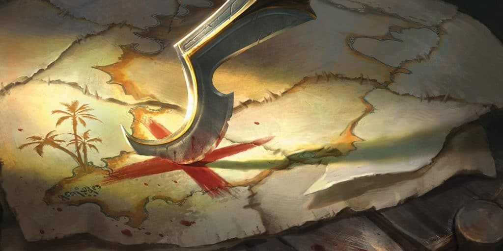

# Die Eisenrote Wüste {#EisenroteWueste}

Über kaum eine Region der uns bekannten Welt ist so wenig bekannt wie über die Eisenrote Wüste, die Gründe dafür sind vielfältig. Aber fangen wir mit dem an was wir wissen: Die Region liegt nahe des Rah Kari kontrollierten Gebietes und wir von einer Mischung aus Orks und Menschen bewohnt die sich als die **"Trattoi"** bezeichnen, das Gebiet besteht aus äußerst fruchtbaren Boden und bietet eine natürliche Grenze zu den Rah Kari, die Wurmfall genannt wird.

## Wurmfall

Der einzige Grund warum sich dieses Unorganisierte Volk ohne nennenswerte Militärische Stärke sich den Rah Kari Invasoren, über solange Zeit widersetzten konnte liegt einzig und allein in der sie umgegbenden Region. Wurmfall ist nicht nur der Albtraum eines jeden Wanderers sondern auch jeden Kartographen.
Wurmfall wird von den namensgebenden riesen Sandwürmern bewohnt diese reagieren auf Erschütterungen was eine durchquerung mit Transportwägen oder größeren Truppenverbänden schier unmöglich macht. Weiters sind dort viele andere gefährliche Kreaturen anzutreffen.

Das vorankommen wird zusätzlich durch Treibsandflüsse erschwert die sich durch die Ebenen ziehen.
Doch das was diese Region wirklich zur Hölle macht ist die Eigenschaft die ihr den Beinamen **Brennende Wüste** eingebracht hat, im etwa viertel Jährlichen Takt erbebt der Vulkan unter der Region, seine Eruptionen lassen die Gänge der Sandwürmer einstürzen, dies dafür das sich die ganze Karte und alle Landmarken verändern außerdem schießen Feuersäulen aus dem Boden deren Rauch den Himmel verdunkelt, sehr zur Freunde der Nachtaktiven Monster.
Jedoch ist es gerade diese Zeit in der die Rah Kari ihre Expeditionen durch die Region starten, denn durch die Erschütterungen können die Sandwürmer die Truppenzüge nicht wahrnehmen. Die Würmer selbst sind durch ihre Dickehaut kaum von der Hitze betroffen.

## Ortschaften der Region
Wurmfall hat keine nennenswerte Ortschaften aufgrund seiner dynamisch Verändernden Landschaft
Die Eisenrotewüste hingegen besitzt einige namenhafte Oasen die von den größten Fraktionen der Trattoi kontrolliert werden und eine unzahl weniger relevanter. 

### Infrastruktur
Die einzelnen Oasen stellen von einander unabhängige selbererhalter Systeme dar jedoch wird zwischen einzelnen Stämmen Handel betrieben, bevorzugt zwischen Verbündeten der eigenen Fraktion.

## Die Geschichte der Region

Die Geschichte der Region ist von kleinen Scharmützeln um die Vorherrschaft über einige Gebiete abgesehen lediglich geprägt durch die Regelmäßigen Expansionsversuche des Rah Kari Reiches. 

## Wirtschaftliche Lage

### Die Ressourcen der Region

Entgegen dem Bild das man von einer Wüste im Kopf hat ist die Eisenrotewüste voller werltvoller Resourcen. Diese stellen den Hauptgrund für die wiederholten Eroberungsexursionen der Rah Kari dar. Die Wüste bietet von  mit Nährstoff angereichertem Wasser zu Wertvollen Erzen alles was ein aufstrebendes Wüstenreich sich wünschen könnte.

Durch den unter Wurmfall gelegenen Vulkan gelangen die Nährstoffe regelmäßig ins Grundwasser, dieses sorgt an den Stellen an denen es wieder an die Oberfläche gelangt für reichen Bewuchs.

## Eroberungszüge der Rah Kari

Die Expeditionen der Rah Kari starten stehts zur Zeit der brennenden Wüste da sie in diesem Zeitraum die Transportwägen nutzen können ohne Furcht vor den Sandwürmern haben zu müssen, dies geht jedoch mit dem erhöhten Risiko von Attacken anderer Monster, einstürzen im Boden und Feuereruptionen einher.
Die Streitkräfte der Rah Kari werden dabei von Wüstenstämmen unterstützt. Während sich die Wüstenstämme rum in der Schlacht Beute in Form des Wassers erhoffen das ihre Oasen wachsen lässt, interessieren sich die Rah Kari für die Reichen erz vorkommen.
Jede Expedetion dauert in etwa 3 Monate in diesem Zeitraum muss das Heer den Wurmfall durchqueren nur um anschließend in nahe täglichen Gefechten mit den Trattoi verwickelt zu werden die alles daran setzten ihr Terrai zu schätzen. Sollten die Expeditionstruppen diese 3 Monate überleben und Beute gesichert worden sein steht der lange und Gefährliche Rückmarsch durch den Wurmfall an.

## Soziopolitische Lage 

### Herrschaftsystem/Organisation
Strukturen entstehen nur rund um die Oasen, nur wenige Stämme sind in der Lage mehr als eine Oase dauerhaft unter ihrer Kontrolle zu halten. Jedoch haben sich durch die wiederholten Angriffe der Rah Kari Fraktionen unter den Stämmen gebildetet die sich bei der Abwehr der Invasoren gegenseitig unterstützen. 

## Klimatische Bedingungen

### Die Flora und Fauna

#### Monster in der Region
Knochenreißer 
Wespen 
Schatten Schakale 
Silurian Skorpione sssss

## Gerüchte der Region

## Sehenswürdigkeiten

To Do:
 Perspektive der Rah Kari vorstöße
 Beschreibt Hölle von Wurmfall und wilde de in unerlässlichen angriffen stück für Stück die Truppenmoral brechen.
