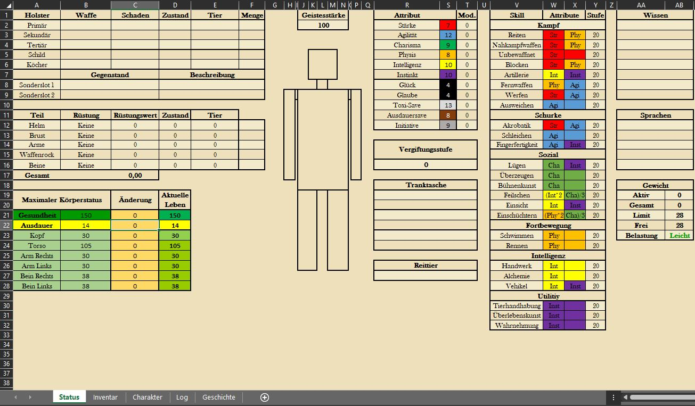
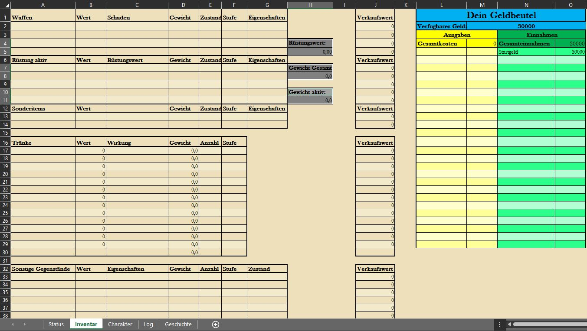
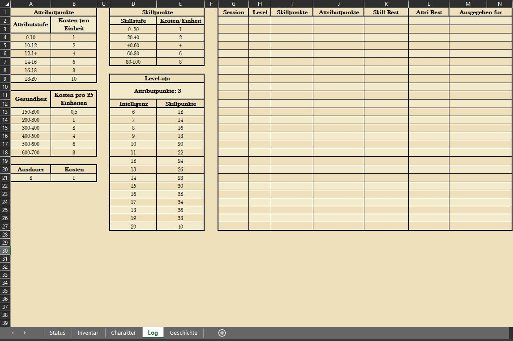
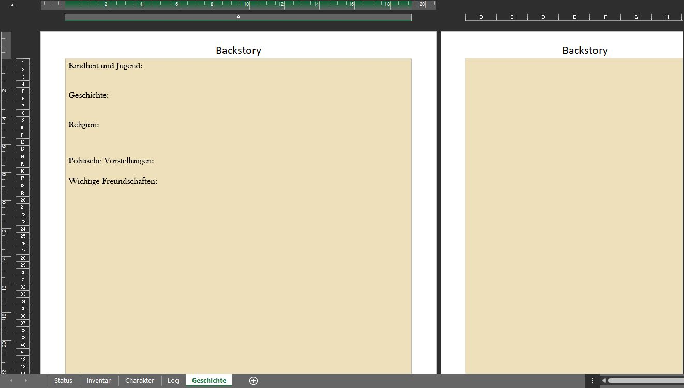

# (PART) Regeln und Items {-}

# Die Charaktererstellung

In Orbis Astea bietet eine Vielzahl von möglichen Geschichten, Charakteren und Möglichkeiten an. Die wichtigste Frage für die Erstellung eines Charakters ist "Worauf hast du Lust?"

## Die Excel-Datei

Orbis Astea ist ein System, in der der Charakter, sowie das Verfolgen der Entwicklung ebenjenes Charakters in einem Excel Sheet festgehalten wird. Dieses ist auf dieser Website unter "Download" in einer leeren Version herunterladbar. Im Folgenden wird erklärt, wie dieses Character Sheet aufgebaut ist, welche Attribute und Fähigkeiten in dieser Welt wie verstanden werden und daraus folgend, welche Aktionen mit welcher Fähigkeit möglich und nicht möglich sind.

Die Excel-Datei unterteilt sich in verschiedene Tabellenblätter, die in ihrer Funktionalität voneinander abhängig sind. Daher sind manche Bereiche schreibgeschützt.Aus diesem Grund können Verbesserungen der [Attribute](#Attribute) und [Fähigkeiten](#Fähigkeiten) nur im "Charakter"-Tabellenblatt durchgeführt werden.

Das ganze Sheet arbeitet allgemein viel mit Referenzen, daher gut darauf aufpassen was man überschreibt, aber die Logik dahinter wird man schnell verstehen.

### Das Charakter-Tabellenblatt {#CharacterSheet}

Wird ein Charakter erstellt, so sind alle Änderungen der Attribute und Fähigkeiten im Tabellenblatt "Charakter" vorzunehmen.


Das Charakter-Tabellenblatt ist so aufgebaut, dass in Spalte A und B die [Attribute](#Attribute) aufgeführt sind, die ein jeder Spieler in der Welt hat und weiterentwickeln kann. Ein jedes Attribut ist mit einer Farbe hinterlegt (B2:11), diese sind dafür da vereinfacht zu veranschaulichen, welche Attribute für das Ausführen einer [Fähigkeit](#Fähigkeiten) herangezogen werden. Somit ist beispielsweise leicht erkennbar, dass eine Person, die einen Nahkämpfer spielen möchte, unbedingt auf Stärke leveln sollte.

Wird sich im Rahmen der [Charaktererstellung](#Charaktererstellung) für eine Rasse entschieden, so kann diese über das Dropdown-Menü im Feld B1 ausgewählt werden. Auf diese Weise werden die Startattribute der Rasse automatisch in die Attributsfelder geladen, sodass keine Übertragungsfehler passieren.

Ebenfalls findet man in Spalte A und B in Zeile 13, 15 und 16 den Namen des Character, sowie dessen [Gesundheit](#Gesundheit) und [Ausdauer](#Ausdauer). Das Feld "Name" ist besonders für den DM wichtig, da dieser bei Ausführung der App angezeigt wird und der Zuordnung der Ergebnisse zu den Charakteren dient. Dieser ist somit immer anzupassen.

Die Felder E1:26 bis I1:26 umfassen die [Fähigkeiten](#Fähigkeiten) eines jeden Charakters. Spalte E listet alle Fähigkeiten auf, die ein Spieler erlernen und verbessern kann. Spalten E und F geben an, welche Attribute in welcher Form für die Wertberechnung herangezogen werden und Spalte I zeigt an, auf welchem Level die jeweilige Fähigkeit ausgeprägt ist.

In Spalte K gibt es die Möglichkeit die [Wissensfähigkeiten sowie die Sprachen](#Wissensfähigkeiten) einzutragen, die ein Charakter beherrscht. Spalte L bis O dient der Eintragung der [Kontaktpersonen](#Kontakte) eines Charakters. Diese können während einer Kampagne als Informationsquelle oder Verbündeter in schweren Zeiten dienen.

Die Tabelle unter O11 erleichtert bei der Charaktererstellung die Punktevergabe für die [Kontakte](#Kontakte) und die [Wissensfähigkeiten sowie die Sprachen](#Wissensfähigkeiten). Das Wissen und die Vernetzung eines Charakters hängt nämlich mit der anfänglichen Attributsausprägung eines Charakters zusammen.

### Der Status {#Status}

Das Tabellenblatt "Status" dient der Übersicht während einer Spielsession. Spalte A bis D Zeile 1 bis 5 zeigt dem Spieler an, welche Waffen aktuell ausgerüstet sind, wie viel Schaden diese [Waffen](#Waffen) machen und welche [Stufe](#Stufen) die Waffen haben. Zeile 7 bis 12 geben Raum für die Rüstung des Charakters. Hier können die Spiele über ein Menü auswählen, welche Rüstungsteile der Charakter trägt. Die [Rüstungssumme](#Rüstung) wird in Zeile 13 angegeben und wird im Kampf mit dem gemachten Schaden verrechnet.

Verliert ein Spieler während eines Kampfes [Gesundheit](#Gesundheit) oder durch eine Aktion [Ausdauer](#Ausdauer), so können diese Veränderungen in den Feldern C16 und C17 eingetragen und somit verfolgt werden.



Um einen Überblick über die eigene, potenziell zur Verfügung stehende, Ausrüstung zu behalten, können die Waffen im Holster (Spalte A-D; Zeile 25-32) eingetragen werden. Die [Geistesstärke](#Geistesstärke) kann ebenfalls in K2 mitdokumentiert werden. Die Darstellung der Figur kann individuell nach belieben gestaltet werden, um dem Tabellenblatt eine persönliche Note zu geben. Die Felder K28 und K29 sind wichtig, um das [Reiten](#Reiten) zu ermöglichen. Ein Reittier muss in diesem Feld eingetragen werden, damit ein Spieler dieses Tier auch nutzen kann.

Spalte Q ist ebenfalls aktuell zu halten. Q17 gibt dem Spieler einen Überblick über die konsumierten Tränke. Diese stellen im Zusammenhang mit der [Ohnmacht](#Ohnmacht) eine wichtige Rolle dar. Die [Tranktasche](#Tranktaschen) (Felder Q21-Q23, bei kleiner Tranktasche) gibt an, auf welche Tränke ein Spieler im Rahmen einer Neben-Aktion zugreifen kann. Ist diese leer, so muss ein Spieler seine Hauptaktionen dafür nutzen an einen Trank zu kommen. Im zweifelsfall retten die Tränke in der Tranktasche Leben.

Feld Z2 steht für [Resistenzen](#Resistenzen) gegenüber Mitteln, die ein Charakter mitbringt. Darüber hinaus gelten die anderen Felder Z bis AB der Übersicht für den Spieler, wie viel [Gewicht](#Gewicht) er trägt, um seine [Ausdauerkosten](#Ausdauer) im Blick zu behalten und über welche zusätzlichen Ressourcen er verfügt.

Wichtig ist, dass alle Attributs- und Fähigkeitspunkte ausschließlich im [Charakter-Tabellenblatt](#CharachterSheet) verändert werden können.

### Das Inventar

Das Inventar ist der kummulierte Besitz eines jeden Abenteurer, seine Habseligkeiten und seine wichtigen Gegenstände sind gut aufgeführt. Ein richtig geführtes Inventar ist Grundlage für ein schnelles und reibungslos ablaufendes Spiel.



In diesem Tabellenblatt können im Bereich "Geldbeutel" alle Einnahmen und Ausgaben eingetragen werden, ebenso wie Schulden, die andere Spieler noch tilgen müssen. Zusätzlich können hier auch die Gegenstände "verräumt" werden, die erbeutet wurden. Der Verkaufswert in Spalte J gibt an, für welchen Preis die Gegenstände aus dem Inventar heraus verkauft werden können.

### Das Veränderungslog

Um den Prozess des Levelns etwas übersichtlicher zu gestalten, gibt es das Tabellenblatt "Log". Hier findet man die Kosten, die für eine Verbesserung zu zahlen sind. Ebenso gibt es die Möglichkeit mitzudokumentieren, in welchen Sessions es eine Levelsteigerung gab, welche Attributs- und Fähigkeitspunkte für welche Verbesserungen ausgegeben wurden und wie viele Punkte noch zur Verfügung stehen, falls nicht alle Punkte direkt wieder vergeben und inverstiert werden.



Darüber hinaus kann nachgelesen werden, wie viele Fähigkeitspunkte einem Spieler pro Levelup zustehen, da diese im Zusammenhang mit dem [Intelligenzwert](#Intelligenz) stehen.

### Die Hintergrundgeschichte



## Attribute {#Attribute}

Attribute spielen eine elementare Rolle, da sie jede Aktion beeinflussen, die ein Spieler ausführen kann. Um dies besser zu verstehen, wird empfohlen, nachzuschauen, welche Skills mit welchem Attribut verbunden sind, da der Erfolg jeder einzelnen Aktion im Spiel durch die Skills eines Spielers erreicht wird. entscheidet z.B. ein Spieler sein Charisma Atrribut zu erhören, dann wird man hörere Werte bei die Social Skills erreichen.

Neben den Attributen, die man oft in anderen Spielen hat, gibt es auch noch Luck, Glaube, Würfel Toxi-Save und Würfel Ausdauersafe. Würfel Toxi-Save und Würfel Ausdauersafe geben an wie viele Würfeln man zur verfügung hat wenn ein Trank konsumiert wird (Toxikologie-Save CrossRef) und bei einer Aktion, was Ausdauer benötigt (Ausauersave CrossRef). Luck und Glaube wird häufig als Hilfswerkzeug für den DM verwendet, bei dem ein Save geworfen wird, um festzustellen, ob in einer bestimmten Situation eine positive eine negative Folge eintreten wird (Glaube/Glück Save CorssRef).

+---------------------------------+------------------------------------------------------------------------------------------------------------------------------------------------------------------------------------------------------------------------------------------------------------------------------------------------------------------------------------------------------------------------------------------------------------------------------------------------------------------------------------------------------------------------------------------------------------------------------------+----------------------------------------------------------------------------------------------+
| Name                            | Beschreibung                                                                                                                                                                                                                                                                                                                                                                                                                                                                                                                                                                       | Beispielanwendung                                                                            |
+=================================+====================================================================================================================================================================================================================================================================================================================================================================================================================================================================================================================================================================================+==============================================================================================+
| #### Stärke {#Stärke}           | Die potentielle Kraftsausübung eines Menschen                                                                                                                                                                                                                                                                                                                                                                                                                                                                                                                                      | Ein PC versucht, ein Schwert aus einen Stein zu heben.                                       |
+---------------------------------+------------------------------------------------------------------------------------------------------------------------------------------------------------------------------------------------------------------------------------------------------------------------------------------------------------------------------------------------------------------------------------------------------------------------------------------------------------------------------------------------------------------------------------------------------------------------------------+----------------------------------------------------------------------------------------------+
| #### Agilität {#Agilität}       | Die Kontrolle, die eine Person über ihren Körper hat und wie leicht sie sich bewegen kann.                                                                                                                                                                                                                                                                                                                                                                                                                                                                                         | Ein PC testet ihre Körperkoordination und Reflexe.                                           |
+---------------------------------+------------------------------------------------------------------------------------------------------------------------------------------------------------------------------------------------------------------------------------------------------------------------------------------------------------------------------------------------------------------------------------------------------------------------------------------------------------------------------------------------------------------------------------------------------------------------------------+----------------------------------------------------------------------------------------------+
| #### Charisma {#Charisma}       | Wie charmant und überzeugend eine Person sein kann, um andere zu beeinflussen.                                                                                                                                                                                                                                                                                                                                                                                                                                                                                                     | ein PC zieht Menschenmassen mit liebenswerter Körpersprache an.                              |
+---------------------------------+------------------------------------------------------------------------------------------------------------------------------------------------------------------------------------------------------------------------------------------------------------------------------------------------------------------------------------------------------------------------------------------------------------------------------------------------------------------------------------------------------------------------------------------------------------------------------------+----------------------------------------------------------------------------------------------+
| #### Physis {#Physical}         | Die Gesamte muskolöse Körperbau und Zustand des Körpers einer Person.                                                                                                                                                                                                                                                                                                                                                                                                                                                                                                              | ein PC beeindruckt einen Boxer mit hundert perfekten Burpees.                                |
+---------------------------------+------------------------------------------------------------------------------------------------------------------------------------------------------------------------------------------------------------------------------------------------------------------------------------------------------------------------------------------------------------------------------------------------------------------------------------------------------------------------------------------------------------------------------------------------------------------------------------+----------------------------------------------------------------------------------------------+
| #### Intelligenz {#Intelligenz} | Die Fähigkeit Wissen zu verstehen und anzuwenden.                                                                                                                                                                                                                                                                                                                                                                                                                                                                                                                                  | ein PC versucht kurz eine geheime Nachricht zu verschlüsseln, bevor die Soldaten auftauchen. |
+---------------------------------+------------------------------------------------------------------------------------------------------------------------------------------------------------------------------------------------------------------------------------------------------------------------------------------------------------------------------------------------------------------------------------------------------------------------------------------------------------------------------------------------------------------------------------------------------------------------------------+----------------------------------------------------------------------------------------------+
| #### Instinkt {#Instinkt}       | Erfahrung des Lebens und ein gutes Bauchgefühl.                                                                                                                                                                                                                                                                                                                                                                                                                                                                                                                                    | ein PC's Bauchgefühl sagt, dass der Händler versucht dich zu betrügen.                       |
+---------------------------------+------------------------------------------------------------------------------------------------------------------------------------------------------------------------------------------------------------------------------------------------------------------------------------------------------------------------------------------------------------------------------------------------------------------------------------------------------------------------------------------------------------------------------------------------------------------------------------+----------------------------------------------------------------------------------------------+
| #### Glück {#Glück}             | Kann nicht gelevelt werden und ist durch die Rassenwahl vorbestimmt.                                                                                                                                                                                                                                                                                                                                                                                                                                                                                                               |                                                                                              |
+---------------------------------+------------------------------------------------------------------------------------------------------------------------------------------------------------------------------------------------------------------------------------------------------------------------------------------------------------------------------------------------------------------------------------------------------------------------------------------------------------------------------------------------------------------------------------------------------------------------------------+----------------------------------------------------------------------------------------------+
| #### Glaube {#Glaube}           | Kann nicht gelevelt werden und ist durch die Rassenwahl vorbestimmt.                                                                                                                                                                                                                                                                                                                                                                                                                                                                                                               |                                                                                              |
+---------------------------------+------------------------------------------------------------------------------------------------------------------------------------------------------------------------------------------------------------------------------------------------------------------------------------------------------------------------------------------------------------------------------------------------------------------------------------------------------------------------------------------------------------------------------------------------------------------------------------+----------------------------------------------------------------------------------------------+
| #### Gesundheit {#gesundheit}   | Neben dem gesamten Gesundheit ist zu beachten, dass jeder körperteil seinen eigenen individuellen Healthpool hat (Spalte B, Zeile 17 bis 22). Diese Körperteile können direkt mit einem [gezielten Schuss](#GezielterSchuss) anvisiert werden. Sobald die Gesundheit eines Körperteils auf 0 reduziert wurde, ist es nicht mehr funktionsfähig und es tritt je nach Körperteil ein [besonderer Effekt](#Ohnmacht) auf. Spieler können ihre Gesundheit wiedererlangen, indem sie entweder einen Heiltrank konsumieren oder das [Pause und Rast-System](#PauseRastSystem) verwenden. |                                                                                              |
+---------------------------------+------------------------------------------------------------------------------------------------------------------------------------------------------------------------------------------------------------------------------------------------------------------------------------------------------------------------------------------------------------------------------------------------------------------------------------------------------------------------------------------------------------------------------------------------------------------------------------+----------------------------------------------------------------------------------------------+
| #### Ausdauer {#Ausdauer}       | Neben der Gesundheit ist die Ausdauer eine weitere Ressource, auf die der Spieler besonders achten sollte, da die meisten Aktionen den gesamten Ausdauerpool verringern. Sie verbraucht sich, wenn man die <font color="green">[Ausdauersaves](#Ausdauersave)</font> nicht schafft. Besonders während des Kampfes, da hier die meisten Aktionen die gesamte Ausdauer eines Spielers verbrauchen, bevor er es überhaupt bemerkt.                                                                                                                                                    |                                                                                              |
|                                 |                                                                                                                                                                                                                                                                                                                                                                                                                                                                                                                                                                                    |                                                                                              |
|                                 | Sobald man weniger als 4 Punkte Ausdauer übrig hat werden sämtliche Attribute außer Glück-, Glaube- und Ausdaueerwürfel halbiert. Kurz erklärt bedeutet es, dass alle Aktionen eines Spielers deutlich schwächer werden und man im Kampf mehr Schaden erleidet und selbst weniger austeilt Wenn man kein Ausdauer mehr übrig hat und ein weiterer Ausdauersave missglückt fällt man in Ohmacht. wie bei der Gesundheit ist es auch möglich Ausdauer wiederzuerlanden durch ein Ausdauertrank oder das [Pause und Rast-System](#PauseRastSystem).                                   |                                                                                              |
+---------------------------------+------------------------------------------------------------------------------------------------------------------------------------------------------------------------------------------------------------------------------------------------------------------------------------------------------------------------------------------------------------------------------------------------------------------------------------------------------------------------------------------------------------------------------------------------------------------------------------+----------------------------------------------------------------------------------------------+

: Die Attribute des eines jeden Charakters.

## Fähigkeiten {#Fähigkeiten}

Um den Charakterbogen und die Charaktererstellung zu vereinfachen, sind die Skills in verschiedene Gruppen eingeteilt.

+--------------------------------------------+---------------------------------------------------------------------------------------------------------------------------------------------+-------------------------------------------------------------------------------------------------------------------------------------------------------------------------------------------------------+
| Name                                       | Beschreibung                                                                                                                                | Beispielsaktionen                                                                                                                                                                                     |
+============================================+=============================================================================================================================================+=======================================================================================================================================================================================================+
| #### Reiten {#Reiten}                      | ermöglicht den [Kampf vom Reittier](#KampfVomReittier) und das Reiten von [Tieren](#AnimalHandling).                                        | Ein Gegner reitet auf seinem Pferd davon.                                                                                                                                                             |
+--------------------------------------------+---------------------------------------------------------------------------------------------------------------------------------------------+-------------------------------------------------------------------------------------------------------------------------------------------------------------------------------------------------------+
| #### Nahkampfwaffen {#BewaffneterNahkampf} | beeinflusst den potenziellen Schaden von Kurz-, Groß- und Stangenwaffen.                                                                    | Ein Angriff wird mit einem Großschwert ausgeführt.                                                                                                                                                    |
+--------------------------------------------+---------------------------------------------------------------------------------------------------------------------------------------------+-------------------------------------------------------------------------------------------------------------------------------------------------------------------------------------------------------+
| #### Unbewaffnet                           | ermöglicht all jene Kämpfe, die zum [Kampf ohne Waffen](#UnbewaffneterKampf) gehören. Zudem wird Armdrücken über diesen Skill gerollt.      | Der Gewinner des Armdrückens bekommt Recht im Streitfall.                                                                                                                                             |
+--------------------------------------------+---------------------------------------------------------------------------------------------------------------------------------------------+-------------------------------------------------------------------------------------------------------------------------------------------------------------------------------------------------------+
| #### Blocken                               | beeinflusst wie viel Schaden eines Angriffs durch eine [Abwehrhandlung](#BlockenAusweichen) geblockt wird.                                  | Ein PC nutzt sein Schild, um einen Angriff abzuwehren.                                                                                                                                                |
+--------------------------------------------+---------------------------------------------------------------------------------------------------------------------------------------------+-------------------------------------------------------------------------------------------------------------------------------------------------------------------------------------------------------+
| #### Artillerie {#Artillerie}              | beeinflusst wie effektiv Artillerie, wie z.B. ein Skorpion oder Balliste, eingesetzt werden kann.                                           | Ein PC meldet sich für das Abfeuern der Balliste.                                                                                                                                                     |
+--------------------------------------------+---------------------------------------------------------------------------------------------------------------------------------------------+-------------------------------------------------------------------------------------------------------------------------------------------------------------------------------------------------------+
| #### Fernwaffen {#Ranged}                  | ermöglicht den Schaden mit [Fernwaffen](#Fernwaffen).                                                                                       | Ein PC greift einen Gegner mit der Armbrust an.                                                                                                                                                       |
+--------------------------------------------+---------------------------------------------------------------------------------------------------------------------------------------------+-------------------------------------------------------------------------------------------------------------------------------------------------------------------------------------------------------+
| #### Werfen {#Werfen}                      | beeinflusst den Schaden von [Wurfwaffen](#Wurfwaffen).                                                                                      | Ein PC möchte ein Monster mit einer Bola bewegungsunfähig machen.                                                                                                                                     |
+--------------------------------------------+---------------------------------------------------------------------------------------------------------------------------------------------+-------------------------------------------------------------------------------------------------------------------------------------------------------------------------------------------------------+
| #### Ausweichen                            | beeinflusst wie viel Schaden einem Angriff durch eine [Abwehrhandlung](#BlockenAusweichen) ausgewichen werden kann.                         | Ein PC versucht dem Angriff eines Bogenschützen auszuweichen.                                                                                                                                         |
+--------------------------------------------+---------------------------------------------------------------------------------------------------------------------------------------------+-------------------------------------------------------------------------------------------------------------------------------------------------------------------------------------------------------+
| #### Akrobatik {#Akrobatik}                | ermöglicht das Hochklettern von Gebäuden, ebenso wie andere akrobatische Handlungen.                                                        | Die Spieler möchten über eine Mauer flüchten.                                                                                                                                                         |
+--------------------------------------------+---------------------------------------------------------------------------------------------------------------------------------------------+-------------------------------------------------------------------------------------------------------------------------------------------------------------------------------------------------------+
| #### Schleichen {#Schleichen}              | ermöglicht Attentate und andere Aktionen, ohne das ein Spieler gesehen wird.                                                                | Die Spieler möchten eine Kontrolle am Tor umgehen, indem sie an den Wachen vorbeischleichen.                                                                                                          |
+--------------------------------------------+---------------------------------------------------------------------------------------------------------------------------------------------+-------------------------------------------------------------------------------------------------------------------------------------------------------------------------------------------------------+
| #### Fingerfertigkeit {#Fingerfertigkeit}  | alle Aktivitäten, die zum Taschendiebstahl oder Schlossknacken gehören.                                                                     | Das der Spieler den Schlüssel zur Truhe nicht finden konnte, versucht er das massive Schloss zu knacken.                                                                                              |
+--------------------------------------------+---------------------------------------------------------------------------------------------------------------------------------------------+-------------------------------------------------------------------------------------------------------------------------------------------------------------------------------------------------------+
| #### Lügen {#Lügen}                        | ermöglicht Täuschungen in sozialen Interaktionen in denen die Wahrheit nicht hilfreich ist.                                                 | Ein Spieler möchte den Wachen weismachen, dass er besagtes Gut nicht gestohlen hat.                                                                                                                   |
+--------------------------------------------+---------------------------------------------------------------------------------------------------------------------------------------------+-------------------------------------------------------------------------------------------------------------------------------------------------------------------------------------------------------+
| #### Überzeugen {#Überzeugen}              | ermöglicht Personen und Gruppen von einem Standpunkt zu überzeugen.                                                                         | Ein Spieler stachelt einen Aufstand an, um Kämpfer für seine Mission zu akquirieren.                                                                                                                  |
+--------------------------------------------+---------------------------------------------------------------------------------------------------------------------------------------------+-------------------------------------------------------------------------------------------------------------------------------------------------------------------------------------------------------+
| #### Bühnenkunst {#Performanz}             | ermöglicht das Vorführen einer Darstellung.                                                                                                 | Ein Spieler stellt sich verletzt, um nicht ins Militär eingezogen zu werden.                                                                                                                          |
+--------------------------------------------+---------------------------------------------------------------------------------------------------------------------------------------------+-------------------------------------------------------------------------------------------------------------------------------------------------------------------------------------------------------+
| #### Feilschen {#Feilschen}                | ermöglicht Preisverhandlungen.                                                                                                              | Eine Händlerin und ein Spieler verhandeln über den Warenpreis.                                                                                                                                        |
+--------------------------------------------+---------------------------------------------------------------------------------------------------------------------------------------------+-------------------------------------------------------------------------------------------------------------------------------------------------------------------------------------------------------+
| #### Einsicht {#Einsicht}                  | ermöglicht einen Blick hinter die Kulissen, wenn Spieler den Eindruck haben, hier könnte gelogen werden, oder andere Täuschungen vorliegen. | Ein Spieler hat ein ungutes Gefühl bei einer gehörten Geschichte und möchte einen Einblick in die Wahrheit erhalten. Da sein Wert hoch genug ist, erkennt er, dass die Geschichte nicht stimmen kann. |
+--------------------------------------------+---------------------------------------------------------------------------------------------------------------------------------------------+-------------------------------------------------------------------------------------------------------------------------------------------------------------------------------------------------------+
| #### Einschüchtern {#Einschüchtern}        | ermöglicht die Beeinflussung sozialer Situationen aufgrund der Bedrohlichkeit eines Charakters.                                             | Der wortkarge Ork bäumt sich vor seinen Feinden auf und sein vor Stärke strotzendes Erscheinungsbild lässt deren Knie erweichen.                                                                      |
+--------------------------------------------+---------------------------------------------------------------------------------------------------------------------------------------------+-------------------------------------------------------------------------------------------------------------------------------------------------------------------------------------------------------+
| #### Schwimmen {#Schwimmen}                | ermöglicht das Schwimmen in Gewässern.                                                                                                      | Ein Spieler springt ins Wasser, um eine Katze vor dem Ertrinken zu retten.                                                                                                                            |
+--------------------------------------------+---------------------------------------------------------------------------------------------------------------------------------------------+-------------------------------------------------------------------------------------------------------------------------------------------------------------------------------------------------------+
| #### Laufen {#Laufen}                      | ermöglicht die Flucht oder das Einholen eines Spielers.                                                                                     | Ein Dieb läuft davon und die Gruppe entscheidet sich ihn zu jagen.                                                                                                                                    |
+--------------------------------------------+---------------------------------------------------------------------------------------------------------------------------------------------+-------------------------------------------------------------------------------------------------------------------------------------------------------------------------------------------------------+
| #### Handwerk {#Handwerk}                  | ermöglicht das Schaffen und Reparieren von Gegenständen.                                                                                    | Ein Spieler richtet seine Rüstung nach dem Kampf.                                                                                                                                                     |
+--------------------------------------------+---------------------------------------------------------------------------------------------------------------------------------------------+-------------------------------------------------------------------------------------------------------------------------------------------------------------------------------------------------------+
| #### Alchemie {#Alchemie}                  | ermöglicht das Brauen von Tränken und setzt Wissen über Pflanzen voraus.                                                                    | Ein Spieler sammelt Pflanzen auf der Wiese, um Tränke für seinen verletzten Kameraden zu brauen.                                                                                                      |
+--------------------------------------------+---------------------------------------------------------------------------------------------------------------------------------------------+-------------------------------------------------------------------------------------------------------------------------------------------------------------------------------------------------------+
| #### Vehikel {#Fahrzeuge}                  | ermöglicht das Steuern von Fahrzeugen wie Kutschen.                                                                                         | Die Gruppe begibt sich auf eine Kutschenreise und stellt fest, dass niemand die Kutsche lenken kann.                                                                                                  |
+--------------------------------------------+---------------------------------------------------------------------------------------------------------------------------------------------+-------------------------------------------------------------------------------------------------------------------------------------------------------------------------------------------------------+
| #### Tierhandhabung                        | ermöglicht das Zähmen und Befehligen von Tieren.                                                                                            | Ein Spieler zähmt einen Bären, der versucht hat die Gruppe anzugreifen.                                                                                                                               |
+--------------------------------------------+---------------------------------------------------------------------------------------------------------------------------------------------+-------------------------------------------------------------------------------------------------------------------------------------------------------------------------------------------------------+
| #### Überlebenskunst {#Überlebenskunst}    | ermöglicht das Umsorgen der Gruppe durch Nahrung und medizinische Erstversorgung.                                                           | Die Gruppe trifft auf einen verletzten Soldaten und entscheidet sich, seine Wunden zu versorgen. Im Camp kochen sie eine reichhaltige Mahlzeit, um seine Kräfte zu stärken.                           |
+--------------------------------------------+---------------------------------------------------------------------------------------------------------------------------------------------+-------------------------------------------------------------------------------------------------------------------------------------------------------------------------------------------------------+
| #### Wahrnehmung {#Wahrnehmung}            | ermöglicht das frühzeitige Erkennen von Eindrücken und Hinweisen.                                                                           | Eine Spielerin bemerkt, wie der Gruppe ein Schatten im Wald folgt. Sie warnt die Gruppe. Kurz darauf geraten sie in einen Hinterhalt.                                                                 |
+--------------------------------------------+---------------------------------------------------------------------------------------------------------------------------------------------+-------------------------------------------------------------------------------------------------------------------------------------------------------------------------------------------------------+

: Diese Fähigkeiten kann ein jeder Charakter beherrschen.

## Die Erstellung {#Charaktererstellung}

Als erstes ist es wichtig ungefähr eine Ahnung zu haben was und wen man spielen möchte. Obwohl sich das vollständige Bild eines Charakters erst am Schluss der Erstellung ergibt, ist es dennoch wichtig, dass man weiß wohin man will und was einem Spaß macht.

Auch wichtig ist zu wissen welche Defensivfähigkeit man verwenden will, <font color="green">[Blocken oder Ausweichen](#BlockenAusweichen)</font>, da diese Skillgruppe für Abenteurer unabhängig von der Spielweise eine der wichtigsten ist.

### Rasse und Startwerte {#RassenStartwerte}

Als erstes wählt man die Rasse aus, die man Spielen möchte. Der wichtigste Hinweis ist hierbei, dass verschiedene Rassen verschiednene Startvorraussetzungen und [Attribute](#Attribute) haben mit denen man arbeiten kann.

Des weiteren haben manche Rassen gewisse Fähigkeiten - wie zum Beispiel die Thermosicht der Goblins - die große Vorteile mit sich bringen können.

Mit diesen Base-Stats fängt man an:

<small> <small>

+----------------------+--------+------------+----------+-------------+----------+--------------+--------------+
| Wert                 | Mensch | Elf        | Zwerg    | Ork         | Animalus | Goblin       | Halbling     |
+:====================:+:======:+:==========:+:========:+:===========:+:========:+:============:+:============:+
| Stärke               | 10     | 8          | 10       | 13          | 12       | 7            | 7            |
+----------------------+--------+------------+----------+-------------+----------+--------------+--------------+
| Agilität             | 10     | 13         | 8        | 10          | 12       | 12           | 12           |
+----------------------+--------+------------+----------+-------------+----------+--------------+--------------+
| Charisma             | 10     | 11         | 8        | 6           | 8        | 9            | 13           |
+----------------------+--------+------------+----------+-------------+----------+--------------+--------------+
| Physis               | 10     | 9          | 10       | 12          | 11       | 8            | 9            |
+----------------------+--------+------------+----------+-------------+----------+--------------+--------------+
| Intelligenz          | 10     | 10         | 14       | 9           | 10       | 10           | 10           |
+----------------------+--------+------------+----------+-------------+----------+--------------+--------------+
| Instinkt             | 10     | 11         | 10       | 10          | 10       | 10           | 10           |
+----------------------+--------+------------+----------+-------------+----------+--------------+--------------+
| Glück                | 4      | 4          | 4        | 4           | 4        | 4            | 4            |
+----------------------+--------+------------+----------+-------------+----------+--------------+--------------+
| Glaube               | 4      | 4          | 4        | 4           | 4        | 4            | 4            |
+----------------------+--------+------------+----------+-------------+----------+--------------+--------------+
| Gesungheit           | 200    | 150        | 200      | 250         | 250      | 150          | 150          |
+----------------------+--------+------------+----------+-------------+----------+--------------+--------------+
| Ausdauer             | 12     | 16         | 10       | 12          | 14       | 14           | 10           |
+----------------------+--------+------------+----------+-------------+----------+--------------+--------------+
| Startgeld            | 30000  | 27000      | 66000    | 21000       | 24000    | 30000        | 36000        |
+----------------------+--------+------------+----------+-------------+----------+--------------+--------------+
| Rassenfähigkeiten    |        | Nachtsicht | Geldgeil | Kurzsichtig | Mutation | Thermo-sicht | Harter Magen |
+----------------------+--------+------------+----------+-------------+----------+--------------+--------------+
| Freie Attributpunkte | 30     | 21         | 15       | 27          | 25       | 20           | 20           |
+----------------------+--------+------------+----------+-------------+----------+--------------+--------------+
| Freie Skillpunkte    | 150    | 150        | 150      | 150         | 150      | 150          | 150          |
+----------------------+--------+------------+----------+-------------+----------+--------------+--------------+

</small> </small>

Alle Rassen starten mit ihrer Herkunftssprache auf Niveau 2.

#### Rassenfähigkeiten {#Rassenfähigkeiten .unnumbered}

-   Nachtsicht: Elfen können im Dunklen sehen.
-   Geldgeil: Zwerge bekommen bei [Einschüchterungs-Proben](#Einschüchtern) +3 Instinct wenn es um Geld geht.
-   Kurzsichtig: Die Kurzsichtigkeit von Orks macht es ihnen unmöglich Fernkampfwaffen zu verwenden.
-   Thermosicht: Goblins sehen die Wärmestruktur von Körpern. Normalerweise ist dies ein riesiger Vorteil, da sie sowohl im Dunklen als auch durch Wände Bedrohungen ausmachen können. Manche gefährliche Monster haben jedoch keine Wärmesignatur.
-   Harter Magen: Halblinge haben aufgrund Generationen von Drogenmissbrauch eine höhere Resistenz gegen Vergiftung durch Tränke.
-   Mutation: Die Mutation ist verbunden mit dem <font color="green">[Übergangsritual der Animali](#Mutation)</font>. Sie übernehmen dabei physiologische Marker des ersten Monsters, das sie erjagt haben. Davon abhängig ob der Charakter ein Jungtier oder bereits mutiert ist steht die Mutation noch aus, oder er hat mehrere individuelle Stärken und schwächen, die zur erjagten Beute passen. Im Falle eines Jungtiers wird die Mutation noch ausgespielt. Sollte man einen Mutierten Animalus spielen, wird die Mutation über das [Eigenheiten-System](#Eigenheiten) mit Attributpunkten gekauft, bei einem Jungtier wird die Mutation später hinzugefügt.

### Level- und Fähigkeitsverbesserungen {#Fähigkeitsverbesserungen}

Folgende Punkte gibt es bei Level-Steigerungen zu vergeben:

-   Attributpunkte - hiermit verbessert man Attribute, die Gesundheit und die Ausdauer
-   Fähigkeitspunkte - hiermit verbessert man Fähigkeiten

Um die Fähigkeiten und Attribute zu verbessern muss eine gewisse Menge an Attribut- und Fähigkeitspunkten vergeben werden. Höhere Werte kosten verhältnissmäßig mehr. Jeder Wert kann Zurückentwickelt werden, bringt aber nur einen Fähigkeits-/Attributpunkt pro Stufe. Wichtig ist allerdings, dass sowohl Glück als auch Glaube nicht aufgewertet werden können.

Bei einem Levelup bekommt man:

-   drei Attributpunkte
-   Fähigkeitspunkte abhängig von der Intelligenz des Charakters nach folgenden Schema:

| Intelligenz | Fähigkeitspunkte |
|:-----------:|:----------------:|
|      6      |        12        |
|      7      |        14        |
|      8      |        16        |
|      9      |        18        |
|     10      |        20        |
|     11      |        22        |
|     12      |        24        |
|     13      |        26        |
|     14      |        28        |
|     15      |        30        |
|     16      |        32        |
|     17      |        34        |
|     18      |        36        |
|     19      |        38        |
|     20      |        40        |

Bei der Charaktererstellung sind Attribute schon mit den Kosten nach dem untenstehenden Schema zu bezahlen. Fähigkeitspunkte können - im Gegensatz dazu - bei der Creation einfach addiert werden und müssen erst bei Levelups nach dem unten stehenden Schema bezahlt werden.

Sowohl Attribut- als auch Fähigkeitspunkte verfallen nicht wenn man im Level aufsteigt, man kann also für spätere Stufen "sparen". Des Weiteren kann man einen Attributpunkt einmal pro Level up zu zwei Fähigkeitspunkten umwandeln - dies gehr nicht in die andere Richtung.

Achtung: bei der Charaktererstellung dürfen Attribute maximal 15 betragen, Fähigkeiten maximal 45.

#### Kosten Attributsverbesserung {.unnumbered}

| Attribute | Kosten/Einheit |
|:---------:|:--------------:|
|   0-10    |       1        |
|   10-12   |       2        |
|   12-14   |       4        |
|   14-16   |       6        |
|   16-18   |       8        |
|   18-20   |       10       |

#### Kosten Gesundheitsverbesserung {.unnumbered}

| Gesundheit | Kosten/25 Einheiten |
|:----------:|:-------------------:|
|  150-200   |         0,5         |
|  200-300   |          1          |
|  300-400   |          2          |
|  400-500   |          3          |
|  500-600   |          4          |
|  600-700   |          5          |

Achtung: Gesundheit wird immer in 25er-Einheiten erhöht.

#### Kosten Fähigkeitsverbesserung {#Fähigkeitsverbesserung .unnumbered}

| Fähigkeiten | Kosten/Einheit |
|:-----------:|:--------------:|
|    0 -20    |       1        |
|    20-40    |       2        |
|    40-60    |       4        |
|    60-80    |       6        |
|   80-100    |       8        |

Die Fähigkeiten und ihre Wirkungen sind [hier](#Fähigkeiten) beschrieben.

#### Kosten Fähigkeitsgruppenverbesserung {#Fähigkeitsgruppen .unnumbered}

Neben der individuellen Fähigkeitsverbesserung haben die Spieler auch die Möglichkeit, eine Skill Gruppe auszuwählen. Dies hat den Vorteil, dass alle Fähigkeiten in der ausgewählten Gruppe gemeinsam zu einem durchschnittlich günstigeren Preis verbessert werden, als wenn sie einzeln aufgewertet werden würden. Die Gruppen haben unterschiedliche Fähigkeiten, die jeweils zu einem Berufsbild passen, nach welchem verschiedene Fähigkeiten zusammengefasst werden. Außerdem haben die Fähigkeitsgruppen auch unterschiedliche Kosten, die an die Menge und Stärke der Fähigkeiten angepasst sind. Investiert man in eine Skillgruppe, kann dies nur bis Level 40 erfolgen. Entscheidet sich ein Spieler zum Beispiel dafür, die Ritter Fähigkeitsgruppe (wobei [bewaffneter Nahkampf](#BewaffneterNahkampf) enthalten ist) bis Level 30 zu verbessern, kann man auch noch weitere Punkte in Söldner investieren (hier ist bewaffneter Nahkampf auch inkludiert) bis bewaffneter Nahkampf einen Wert von 40 erreicht. Investiert man mehr Punkte in Söldner, bleibt bewaffneter Nahkampf auf 40, die anderen Skills nehmen weiter zu.

Eine Übersicht über die möglichen Fähigkeitsgruppen findet sich hier:

```{r}
dfskillgruppe=read_xlsx(bookdownallgdatapfad, sheet="Gruppenskills")

dfskillgruppe = dfskillgruppe %>%
  unite("Skills",Skill1,Skill2, Skill3, Skill4,
        Skill5, Skill6, Skill7,Skill8,Skill9,Skill10, sep=", ", na.rm = T) %>% 
  relocate(Name,Skills)

reactable(dfskillgruppe,
          columns = list(
            
            Skills = colDef(
              filterable = TRUE,
              # Filter by case-sensitive text match
              filterMethod = JS("function(rows, columnId, filterValue) {
                                return rows.filter(function(row) {
                                return row.values[columnId].indexOf(filterValue) !== -1
                                })}")
            ),
            Name= colDef(
              filterable = TRUE),
            Kosten = colDef(format = colFormat(suffix = " Skillpunkte"))
          ), bordered = T, highlight = T, showPageSizeOptions = TRUE,
          striped=T,
          pageSizeOptions = c(5,10, 20, 50),
          defaultPageSize = 10,  paginationType = "jump",
          theme= overallThemeReactable)
```

#### Kosten Ausdauerverbesserung {.unnumbered}

Zwei Punkte Ausdauer kann man auf jedem Ausdauerlevel für einen Attributpunkt kaufen.

### Eigenheiten {#Eigenheiten}

#### Positive Eigenheiten {.unnumbered}

Positive Eigenschaften bringem dem Charakter meist Vorteile, kosten allerdings Attributpunkte. Bei der Charaktererstellung sind diese Eigenschaften günstiger zu kaufen, wenn man sie Nachkauft werden sie ein wenig teurer.

```{r PosEigenheiten}
dfeigenheiten=read_xlsx(bookdownallgdatapfad, sheet="Eigenschaften")

dfeigenheiten %>% 
  filter(str_to_lower(Valenz)=="p") %>% 
  select(-Valenz) %>% 
  relocate(Eigenschaft, Beschreibung, Regeln) %>% 
  arrange(Kosten) %>% 
  reactable(
    columns = list(
      
      Eigenschaft = colDef(
        filterable = TRUE,
        # Filter by case-sensitive text match
        filterMethod = JS("function(rows, columnId, filterValue) {
                                return rows.filter(function(row) {
                                return row.values[columnId].indexOf(filterValue) !== -1
                                })}")
      )
    ), bordered = T, highlight = T, showPageSizeOptions = TRUE,
    striped=T, searchable = T,
    pageSizeOptions = c(5,10, 20, 50),
    defaultPageSize = 10,  paginationType = "jump",
    theme= overallThemeReactable)
```

#### Negative Eigenheiten {.unnumbered}

Negative Eigenheiten schränken den Charakter ein, gewährem ihm allerdings Attributpunkte die er in andere Eigenheiten oder in Attribute investieren kann.

```{r NegEigenheiten}
dfeigenheiten %>% 
  filter(str_to_lower(Valenz)=="n") %>% 
  select(-Valenz) %>% 
  relocate(Eigenschaft, Beschreibung, Regeln) %>% 
  rename(Attributpunkte = Kosten) %>% 
  arrange(Attributpunkte) %>% 
  reactable(
    columns = list(
      
      Eigenschaft = colDef(
        filterable = TRUE,
        # Filter by case-sensitive text match
        filterMethod = JS("function(rows, columnId, filterValue) {
                                return rows.filter(function(row) {
                                return row.values[columnId].indexOf(filterValue) !== -1
                                })}")
      )
    ), bordered = T, highlight = T, showPageSizeOptions = TRUE,
    striped=T, searchable = T,
    pageSizeOptions = c(5,10, 20, 50),
    defaultPageSize = 10,  paginationType = "jump",
    theme= overallThemeReactable)
```

### Wissen und Sprachen {#Wissensfähigkeiten}

Die Welt von Orbis Astea ist gekennzeichnet von Komplexität. Hierbei haben, so wie in der realen Welt, einzelne Menschen nicht das gesammelte Wissen der Welt. Besonders schlaue und erfahrene Charaktere haben natürlich auch den einen weiteren geistigen Horizont, um mehr Aspekte ihrer Umwelt zu verstehen.

Um bei der Erstellung eines Charakters auch die Fähigkeiten im Bereich "Wissen der Welt" und Sprachen zu berücksichtigen wird diese durch die Startattribute Intelligenz und Instinkt errechnet.

Die Anzahl verfügbarer Punkte errechnet sich folgendermaßen:

$$\frac{Intelligenz \cdot 4 + Instinkt}{2}$$ Das Ergebnis wird aufgerundet. Diese Berechnung muss man nicht selbst machen, sie wird vom Excelsheet übernommen.

**Beispiel: Berechnung der Wissens- und Sprachpunkte**

Standardmensch: 10 Intelligenz & 10 Instinkt

Berechnung der Verfügbaren Punkte: $(10 \cdot 4 + 10)/2 = 25$

Folglich hat der Ersteller dieses Charakters 25 Punkte zur Verfügung.

Diese können nun für Wissens- und/oder Sprachenstufen vergeben werden.

+--------------------------------------------+----------------+----------------------------------+--------------------------------------------+
| Niveau/Stufe der Sprache oder des Wissens: | Kosten Punkte: | Wissensniveau                    | Sprachniveau                               |
+:==========================================:+:==============:+:================================:+:==========================================:+
| Stufe 0                                    | 0              | Kein Wissen im Bereich           | Keine Sprachfähigkeit                      |
+--------------------------------------------+----------------+----------------------------------+--------------------------------------------+
| Stufe 1                                    | 5              | Grundwissen                      | sehr einfache Gespräche möglich            |
+--------------------------------------------+----------------+----------------------------------+--------------------------------------------+
| Stufe 2                                    | 15             | Belesen & Erfahren im Fachgebiet | Verständigung umständlich aber vollständig |
+--------------------------------------------+----------------+----------------------------------+--------------------------------------------+
| Stufe 3                                    | 25             | Ausgewiesener Fachmensch         | Gesetzestext- und Muttersprachenniveau     |
+--------------------------------------------+----------------+----------------------------------+--------------------------------------------+

Diese Werte sind absolute - keine kummulativen Kosten.\

+----------------------------------+----------------------------------------------------------------------------------------------------------+
| Auswahloptionen an Wissenskills: | Beschreibung                                                                                             |
+==================================+==========================================================================================================+
| Kriegstaktiken                   | Flankierungmanöver, Guerillakrieg, Sabotage, Formationen im Kampf                                        |
+----------------------------------+----------------------------------------------------------------------------------------------------------+
| Medizin                          | Erkennen und Behandlen von Krankheiten                                                                   |
+----------------------------------+----------------------------------------------------------------------------------------------------------+
| Belebte Welt                     | Wissen über die natürliche Tier- und Pflanzenwelt                                                        |
+----------------------------------+----------------------------------------------------------------------------------------------------------+
| Religion                         | Riten, Bräuche, Traditionen, etc.                                                                        |
+----------------------------------+----------------------------------------------------------------------------------------------------------+
| Monster                          | Schwächen und Stärken von Monstern und Abscheulichkeiten                                                 |
+----------------------------------+----------------------------------------------------------------------------------------------------------+
| Geschichte                       | Wissen darüber, wie sich der rote Faden der Ereignisse, vermeintlich durch die Welt zieht                |
+----------------------------------+----------------------------------------------------------------------------------------------------------+
| Etiquette                        | Der soziale Kitt jeder Gesellschaft - Gesten, Bräuche, Traditionen                                       |
+----------------------------------+----------------------------------------------------------------------------------------------------------+
| Landwirtschaft                   | Unterjochung der Natur, um dieser Nahrung oder Materialien abzugewinnen                                  |
+----------------------------------+----------------------------------------------------------------------------------------------------------+
| Wirtschaft                       | Wissen, wer was braucht und wie man soetwas bereitstellt                                                 |
+----------------------------------+----------------------------------------------------------------------------------------------------------+
| Recht                            | Hilft dem Spieler den Mächtigen in Orbis Astea (nicht) auf die Füße zu treten                            |
+----------------------------------+----------------------------------------------------------------------------------------------------------+
| Schwarzmarkt                     | Elfengesichter, Drogen und Sprengmittel bekommt man nur wenn man Jemanden kennt der Jemanden kennt kennt |
+----------------------------------+----------------------------------------------------------------------------------------------------------+
| Seekunde                         | Leben auf dem offenen Meer ist erst möglich, wenn man die See kennt                                      |
+----------------------------------+----------------------------------------------------------------------------------------------------------+
| Kartografie                      | Wissen wo was ist und wer wo sein könnte                                                                 |
+----------------------------------+----------------------------------------------------------------------------------------------------------+
| Schriftlehre                     | Stufe 1: Lesen/Schreiben möglich                                                                         |
|                                  |                                                                                                          |
|                                  | Stufe 2: Lesen komplexer Literatur                                                                       |
|                                  |                                                                                                          |
|                                  | Stufe 3: Ermöglicht das Fälschen von Dokumenten                                                          |
+----------------------------------+----------------------------------------------------------------------------------------------------------+

| Auswahloptionen Sprachen:                     |
|-----------------------------------------------|
| Gob (Sprache der Goblins)                     |
| Orkisch                                       |
| Kaiserlich (Kaiserreich, Yondalla und Eldria) |
| RahKari                                       |
| Zwergisch                                     |
| Elfisch                                       |

**Beispiel mit einem normalen Charakter mit 50 Punkten:**

-   15 Punkte für die Sprache Rahkari auf Stufe 2
-   5 Punkte für Kartographie Stufe 1 der Gebiete der Rahkari Fraktion
-   5 Punkte für Religionskenntnisse Stufe 1 der Gebiete der Rahkari Fraktion

Wichtig ist es für DMs die Skills mit eigenem Gefühl einzubringen, was realistisch sein könnte.

Auch nach der Charaktererstellung kann man seine Wissensskills verbessern. Dies geht über das [sogenannte Studieren](#Studieren).

### Kontakte {#Kontakte}

Kontakte sind ein weiteres Stück der Welt - sozusagen das soziale Kapital des Spielers. Sie helfen an Aufträge, Informationen und andere Dinge zu kommen, für die Vitamin B nun mal nützlich ist oder sein könnte. Die Punkte, die man für Kontakte vergeben kann berechnen sich aus der Summe: $$(4 \cdot Charisma) + Instinct.$$

Diese Punkte können dann auf die Beziehung (Einfluss im [Charakter-Tabellenblatt](#CharacterSheet)), die ein Kontakt gegenüber eines Charakter empfindet, und den Einfluss (Power im [Charakter-Tabellenblatt](#CharacterSheet)), also den sozialen Stand und die Macht eines Kontaktes, verteilt werden.

Die Kosten beschreiben, wie viele Punkte ein Spieler ausgeben muss, um sich einen Kontakt eintragen zu können. Diese stellen die Summe der jeweiligen Stufen dar. Möchte man eine Liebesbeziehung zu einer Person aus dem Hochadel führen, so sind insgesamt 60 Punkte zu entrichten. 30 für die Stufe 7 Einfluss und nochmal 30 Punkte für die Stufe 7 Affection.

Beide Parameter können auf einer Skala von jeweils 1 - 10 vergeben werden. Die inhaltliche Bedeutung der jeweiligen Skalen-Stufe zeigt die nachfolgende Tabelle:

+-----------+-----------------------------------------------------+------------------------+-----------+
| Stufe     | Einfluss                                            | Affection              | Kosten    |
+:=========:+:===================================================:+:======================:+:=========:+
| 1         | Unterschicht                                        | Bekanntschaft          | 2         |
+-----------+-----------------------------------------------------+------------------------+-----------+
| 2         | Normale Person                                      | Gute Bekanntschaft     | 4         |
+-----------+-----------------------------------------------------+------------------------+-----------+
| 3         | Sozial gut vernetzte Person                         | Kollegen               | 7         |
+-----------+-----------------------------------------------------+------------------------+-----------+
| 4         | Stadtwache                                          | Gleicher Freundeskreis | 10        |
+-----------+-----------------------------------------------------+------------------------+-----------+
| 5         | Hohes Bürgertum                                     | Freunde                | 15        |
+-----------+-----------------------------------------------------+------------------------+-----------+
| 6         | Niederer Adel                                       | Familienmitglied       | 20        |
+-----------+-----------------------------------------------------+------------------------+-----------+
| 7         | Adel/Militärkommandant/Unterweltboss/Hoher Beamter  | Enge Freunde           | 25        |
+-----------+-----------------------------------------------------+------------------------+-----------+
| 8         | Hochadel                                            | Liebesbeziehung        | 30        |
+-----------+-----------------------------------------------------+------------------------+-----------+
| 9         | Höchste Beamte/Minister/Heerführer                  | Beste Freunde          | 40        |
+-----------+-----------------------------------------------------+------------------------+-----------+
| 10        | Kaiser/Hohepriester/Fürst eines Staatenschiffs/etc. | Wie das eigene Kind    | 45        |
+-----------+-----------------------------------------------------+------------------------+-----------+

: Kontakte und was sie ausmacht.

### Rucksack {#Rucksack}

Alle Gegenstände, die nicht sofort verfügbar sind, sind im Rucksack, der das [Inventar](#Inventar) beinhaltet. Ein durchschnittlich starker Mensch (Stärke 10) kann dabei 40kg tragen. Prinzipiell nimmt man den Durchschnitt aus Stärke und Physis mal 4 um die Traglast zu determinieren. Diese wird als Rucksackgröße benutzt.

Ein Objekt während einem Kampf aus dem Rucksack holen kostet die Hauptaktion. Sollte man sich allerdings nicht im Kampf/unter Zeitdruck befinden, kann man problemlos Objekte aus dem Rucksack rauskramen.

### Holster

Da man Waffen in gefährlichen Umgebungen schnell zur Hand haben will, und diese nicht erstmal ewig aus dem [Rucksack](#Rucksack) kramen will, wurden Holster erfunden. Diese Kosten pro Holster bei der Erstellung eines Charakters 1250 Reiks und man kann maximal über 5 davon verfügen. In verschiedene Holster passen nur bestimmte Waffentypen. Mehr dazu [hier](#Holster1).

### Ausrüstung

Nach der Charaktererstellung ist die richtige Startausrüstung von Bedeutung. Was ein Abenteurer unbedingt besitzen sollte ist eine Waffe, eine Tranktasche und möglicherweise Rüstung, da ohne eine solche die Überlebenschancen deutlich geringer werden.

Ausrüstung zum kaufen findet man hier:

-   Hier findet ihr [Waffen](#Waffen)
-   Hier findet ihr [Rüstung](#Rüstung)
-   Hier findet ihr [Reittiere](#Mounts)
-   Hier findet ihr [Übrige Gegenstände](#AndereGegenstände)
-   Hier findet ihr [Tränke](#Tränke)

Denkt beim Einkaufen aber daran, dass es sinnvoll sein kann sich etwas Geld überzuhalten. Schließlich bringt das Leben in Orbis Aestea <font color="green">[Lebenshaltungskosten](#Lebenshaltungskosten)</font> mit sich, und auch für Quests ist es immer sinnvoll etwas Geld übrig zu haben.

### Die Rolle des Gewichts {#Gewicht}

Gewicht spielt in Orbis Astea eine Große Rolle. Kein Charakter kann mehr mit sich tragen als seine eigene Tragfähigkeit erlaubt. Diese berechnet sich anhand der Stärke mal vier.

#### Das Aktive Gewicht {#AktivesGewicht}

Das Aktive Gewicht ist das Gewicht der Dinge, die am Körper getragen werden. Es besteht aus:

-   Waffen in Holstern
-   Rüstung
-   Schild
-   Wurfwaffen in Holstern

Die Summe des Gewichts dieser Items ist das Aktive Gewicht. Es wird durch 5 geteilt und danach vom Physis-Wert abgezogen um die <font color="green">[Ausdauerwürfel für den Ausdauersave](#Ausdauersave)</font> zu erhalten.

##### Die Belastungsstufen und ihre Debuffs {#Belastungsstufe}

+------------+-----------------+--------------------------------------------+-----------------+
| Belastung  | Aktives Gewicht | Acrobatics <br>Rennen \<br\>und Schleichen | Aufstehen       |
+============+:===============:+:==========================================:+:===============:+
| leicht     | Gewicht \< 18   |                                            | Bewegungsaktion |
+------------+-----------------+--------------------------------------------+-----------------+
| mittel     | Gewicht \< 30   | -1 Würfel                                  | single Action   |
+------------+-----------------+--------------------------------------------+-----------------+
| schwer     | Gewicht \> 30   | -2 Würfel                                  | main Action     |
+------------+-----------------+--------------------------------------------+-----------------+

#### Das passive Gewicht

Das Passive Gewicht ist die Summe des Gewichts der Items die sich im [Rucksack](#Rucksack) befinden. Zusammen mit dem Aktiven Gewicht darf es die Traglast nicht überschreiten. Darüber hinaus hat das passive Gewicht keinen Einfluss auf das Spiel.

##### Zusätzliches Gewicht {.unnumbered}

Manchmal trägt der Spieler zusätzliches Gewicht - bspw. eine ohnmächtige Person. Dies kann mit verschiedenen Nachteilen einhergehen, welche der DM festlegt. Ein Beispiel ist die Unfähigkeit auszuweichen oder zu rennen.

## Im Spiel

Einige Werte verändern sich dynamisch im Spiel. Die wichtigen sind hier aufgeführt und erklärt.

### Modifikatoren

Bestimmte Effekte (Tränke, Musik, Kälte, etc.) geben positive oder negative Modifikatoren, die nicht, wie externe Effekte (Schlechte Sicht), die Thresholds beeinflussen, sondern die Werte eines Characters ändern. Sie sind mit + oder - in der Spalte "Modifyer" rechts vom jeweiligen Attribut einzutragen.

### Glaube {#glaube}

> "Wenn man die Götter erzürnt richten sie einen, wenn man ihnen huldigt belohnen sie einen"
>
> --- Altes Sprichwort

Glaube ist an sich kein allein fungierendes Attribut, da Proben so gut wie immer zusammen mit Glück geworfen werden. Das besondere am Glauben ist allerdings, dass man ihn mit verschiedenen Aktionen beeinflussen kann. Wenn man sich im Einklang zu den eigenen Göttern verhält, epische Taten vollbringt, oder eine andere Aktion vollbringt bei der der DM denkt man hätte es verdient, steigt der Glaube-Wert. Bei gegenteiligem Verhalten sinkt der Wert. Dieser Wert stellt für der DM eine Möglichkeit dar, gutes Roleplay zu belohnen.

Dieser Wert soll die göttliche Gunst in entscheidenden Situationen darstellen.

### Glück {#glück}

Ebenso wie bei Glaube kann auch das Glück sinken und steigen. Wenn ein Charakter beispielsweise Aktionen durchzieht, die gegen seine eigenen Werte gehen, sinkt der Glückswert durch Ansage des DM. Bei Aktionen auf die ein Charakter besonders stolz sein kann, steigt dieser wieder. Die stärke von Senkung/Steigung liegt am DM.

Dieser Wert soll das persönliche Wachstum und Wohlbefinden widerspiegeln.

### Geistesstärke {#Geistesstärke}

Geistesstärke bezeichnet die Rate, in der der Charakter noch zurechnungsfähig ist. Sie geht vom Maximalwert 100 bis zum Wert Null. Geistesstärke sinkt jedes Mal, wenn man mit Blutgöttern in Kontakt kommt, Blutgöttern dient oder eine Blutgottwaffe verwendet. Solange die Geistesstärke über 20 ist gibt es noch nichts zu befürchten. Sinkt die Geistesstärke unter 20, hat der DM einmal pro Session die Möglichkeit einen Glück/Glaube-Save zu machen und - falls dieser nicht bestanden wird - übernimmt der DM kurzzeitig die Kontrolle über die Figur, die daraufhin höchstwahrscheinlich horrende Taten vollbringt. Sinkt die Geistesstärke unter 10, hat der DM zwei mal pro Session die Chance auf die Übernahme des Charakters. Sollte die Geistesstärke allerdings auf Null sinken, verliert der Spieler dauerhaft die Kontrolle über den Charakter - und der Charakter fällt langfristig dem blutigen Treiben eines <font color="green">[bösen Gottes](#Blutkult)</font> anheim.

Bei Interaktionen entscheidet der DM, um wie viel die Geistesstärke sinkt.

#### Verfluchte Artefakte

Es gibt ein paar sehr starke Artefakte (allesamt Tier 5), die ihren starken Effekt damit "bezahlen lassen" das man bei jeder Verwendung Geistesstärke verliert. Dies sind meistens Blutkultrelikte und können von Waffen über Amulette mit gewissen Wirkungen alles sein was einem fähigen DM einfällt.

## Längerfristige Verletzungen

Achtung, hier wird entgegen der Konventionen von Orbis Astera ab- statt aufgerundet.

### Verstümmelung {#Verstümmelung .unnumbered}

Eine Verstümmelung bedeutet, dass von einem Körperteil nur noch 20% der Gesundheit übrig ist. In diesem Falle ist es ratsam so schnell wie möglich ärztliche Hilfe aufzusuchen, um eine Verkrüppelung zu vermeiden. Der Verstümmelte kann Checks, die den verstümmelten Körperteil beinhalten, nicht mehr ausführen. Außerdem muss er einen Willpower-Save mit dem Threshold 3 bestehen, ansonsten fällt er in <font color="green">[Ohnmacht](#Ohnmacht)</font>.

Ein Charakter kann einen Verband machen, der vorübergehend den "verkrüppelt" Status-Debuff aufhebt. Dies kann der Charakter auch selbst machen,wenn er den Check, um nicht in Ohnmacht zu fallen, überstanden hat. Der zu erreichende Value liegt bei 3.

### Verkrüppelung {#Verkrüppelung .unnumbered}

Eine Verkrüppelung bedeutet, dass die Gesundheit eines Körperteils auf Null gesunken ist. Damit verliert der Charakter besagten Körperteil. Er ist nicht mehr in der Lage Checks auszuführen, die diesen Körperteil beinhalten und muss unbedingt zu einem Arzt. Die Langzeitfolgen einer Verkrüppelung sind nicht zu unterschätzen und viele Abenteurer müssen sich zur Ruhe setzen, wenn ihnen eine Verkrüppelung widerfährt.

Bei einer Verkrüppelung muss ein Charakter einen Willpower-Save bestehen, ansonsten fällt er in <font color="green">[Ohnmacht](#Ohnmacht)</font>. Der Threshold liegt bei 5.

## Ohnmacht und Tod {#Ohnmacht}

Wenn man in Ohnmacht fällt hat man zwei Optionen - entweder man wartet drei Stunden bis man von selbst wieder aufwacht, oder man bekommt ein <font color="green">[Epinephrinika](#Epinephrin)</font> verabreicht. In beiden Fällen hat ein Charakter das Kopfweh seines Lebens und es wird sobald möglich Rast und Ruhe empfohlen.

Es gibt mehrere Methoden in Ohnmacht zu fallen, die wichtigsten sind:

-   Missglückter Toxi-Save
-   Narkotika
-   Gesundheit fällt auf unter Null
-   Die Ausdauer erreicht den Wert Null und man hat einen missglückten Ausdauer-Save
-   Willpower-Save bei Verstümmelung oder Verkrüppelung nicht geschafft.

Sterben kann man im Gegenzug dazu nur auf zwei Weisen:

-   Man erreicht einen Gesunheitswert von -100
-   Man verliert seine Gesundheit im ohnmächtigen Zustand
