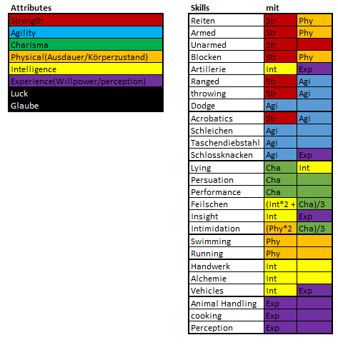
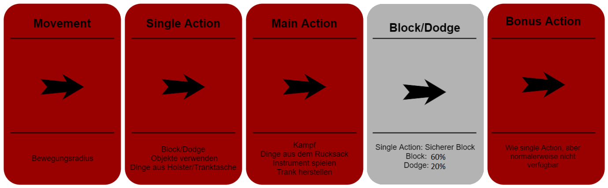

# (PART) Regeln und Items {-}

# Grundlagen des Spiels

Hier startet der technischere Teil des Buches. Im Folgenden wird erklärt wie gespielt wird, was wichtig ist und wie man sich das Spiel so angenehm wie möglich macht.

## Checks und Proben

In Orbis Aestea wird - wie in jedem anderen Pen and Paper Rpg - gewürfelt. Bei uns wird dies durch ein Programm übernommen, daher gibt es hier nichts selbst zu rechnen. Trotzdem ist es sehr relevant zu wissen wie welche Probe gewürfelt wird. 
Für jede Probe gibt es einen sogenannten Skill, der auf die Aktion passt - bspw. "armed" für das Zuschlagen mit einer Waffe oder "sneak" für das Schleichen. Die passende Probe zur Aktion wird dann mit dem Skill und dem verbundenen Attribut geworfen - für das Beispiel Schleichen wäre dieses "Agility". 

Attribute stellen hierbei immer körperliche Eigenschaften dar, z.B. hätte ein Spitzensportler einen Wert in seinem spezialisierten Attribut von 17-18, ein Attribut von 20 käme einem Halbgott gleich.
Gleiches zählt auch bei den Skills, bei denen die "Besten" zwischen 75 und 85 liegen. 
Der Durchschnitt der Skills liegt bei 20 und der der Attribute bei 10.

Hier eine schematische Darstellung über die Skills und die damit Verbundenen Attribute: 



Wie man sieht, passiert es manchmal, dass einem Skill mehrere Attribute zugeordnet sind. In diesem Fall nimmt man den Durchschnitt der Attribute und rundet auf die nächste ganze Zahl auf.

### Die einfache Probe

Die einfache Probe ist zu Würfeln, wenn es keinen direkten Gegenspieler gibt. Sie ist meistens mit einem Threshold in Value[^1] oder Damage verknüpft, den der DM beliebig festlegt. Sollte man bspw. versuchen ein Schloss zu knacken, wird der DM festlegen, dass der Value über 3 sein soll, um das zu erreichen. Bei härteren/leichteren schlössern ist der Value natürlich anzupassen.

Welche Werte hierbei welcher Größenordnung entsprechen findet sich <font color="green">[hier](#Abstufungen)</font>.

[^1]: Value ist eine Form von Gütekriterium eines Wurfes - je höher der Value, desto besser der Wurf.

### Die Differenzprobe 

Eine Differenzprobe ist zu werfen, wenn es einen direkten Gegenspieler gibt. Beispielsweise, wenn 2 Leute in einer Taverne anfangen Armzudrücken. Hier werden demnach die jeweiligen Skills und Attribute gegeneindander gewürfelt und die Differenz der Values wird interpretiert.

Welche Werte hierbei welcher Größenordnung entsprechen findet sich <font color="green">[hier]()</font>.

#### Untypische Proben {- #UntypischeProben}

Normalerweise werden Proben normal Skill und Attribut gegen die selbe Skill/Attribut-Kombination geworfen. Beim Armdrücken-Beispiel würde man z.b. Stärke und Unarmed der einen Person gegen Stärke und Unarmed der anderen Person werfen.
Dieses Prinzip zählt jedoch nicht für alle Proben. Folgende Proben werden anders geworfen:

* Schleichen: Sneak gegen Perception
* Lügen/Persuation: Lying/Persuation gegen Insight
* Angriff: Armed/Unarmed/Ranged/throwing gegen Dodge/Block
* Einschüchtern: Intimidation gegen Insight mit Instinct als Attribut
* Taschendiebstahl: Taschendiebstahl gegen Perception


### Der Save

Ein Save ist nochmal etwas anderes als eine Probe, auch er wird üblicherweise gegen einen Threshold geworfen und ist ein Weg sich vor etwas Schlimmen zu bewahren. Allerdings wird der Save nur mit den Attributen geworfen, Skills haben hierbei keinen Einfluss.
Der Threshold ist üblicherweise 3, kann aber vom DM je nach Situation angepasst werden. 

### Advantage/disatvantage

In manchen Situationen ist man at advantage oder at disatvantage, das bedeutet prinzipiell nur, dass derselbe Wurf mehrmals (üblicherweise 3 mal) geworfen wird. Ist der Spieler at atvantage wird das für den Spieler günstigste Ergebnis, at disatvantage wird das für den Spieler nachteiligste Ergebnis, ausgewählt.

### Momentane Modifikatoren 

Manchmal gibt es Modifikatoren auf Attributes oder Skills, diese sind nur für kurze Zeit (Maximal die Session) aktiv und werden im Character-Sheet auf der Status Page bei Modifikator eingetragen. Sie sind für den Wert des Attributs/Skills zu addieren bzw. abzuziehen.

## Typische Saves

Diese Saves sind typisch und werden euch immer wieder begegnen:

### Ausdauersave {#Ausdauersave}

Der Ausdauersave passiert automatisch bei jeder Kampfrunde und bei jeder Aktion die körperliche Ausdauer verbraucht. Er wird mit dem Physical-Wert abgezogen dem <font color="green">[Aktiven Gewicht/5](#AktivesGewicht)</font> gewürfelt. Die negative Differenz wird der Ausdauer abgezogen.
Warum Ausdauer und dieser Save wichtig sind steht <font color="green">[hier](#Ausdauer)</font>.

### Toxikologie-Save

Der Toxikologie-Safe wird mit den Würfeln der Attribute Physical, Instinct, Luck und Glaube gewürfelt - Achtung hierbei wird die Summe, nicht der Durchschnitt gebildet.

Da jeder Trank toxisches Potential hat, wird immer, nachdem ein Trank konsumiert wird, ein Toxi-Save gegen den Threshold aus allen kummulierten Trankstufen der genommenen Tränke gewürfelt.
Sollte man diesen nicht schaffen fällt man in <font color="green">[Ohnmacht](#Ohnmacht)</font>.

### Glaube/Glück Save

Dies ist mit Abstand der häufigste und wichtigste Save. Hierbei wird die Summe (wieder nicht der Durchschnitt) der Attribute Luck und Glaube als Threshold gebildet. Dieser Save wird immer geworfen, wenn der DM nicht sicher ist ob positive oder negative Folgen eintreten. Hierbei wirft der DM einen D20 Würfel, wenn der geworfene Wert unter dem Threshold liegt tritt die positive Folge ein, andernfalls die negative. 

Dieser Save kommt auch zum Tragen, falls ein Spieler seine gesamte Health verliert. Dann wird gegen den Threshold 3 geworfen. Wenn der Save bestanden wird fällt der Spieler nur in <font color="green">[Ohnmacht](#Ohnmacht)</font>, andernfalls stirbt der Charakter.

## Das Reiten {#Reiten}

Beim Reiten sind ein paar Dinge zu beachten. Neben der Tatsache, dass Reittiere extra <font color="green">[Unterhalt](#Lebenserhaltungskosten)</font> kosten sind zwei Skills notwendig um ihr volles Potential zu nutzen - Reiten und Animal Handling. Reiten determiniert wie gut man sich auf dem Reittier halten und agieren kann, bzw. das Reittier steuern kann. Animal Handling determiniert wozu man das Reittier sonst bringen kann. Dies kann vor allem für spezielle Aktionen notwendig sein.
Nach einer Aktion, die ein Reittier erschreckt ist ein Reiten-Check notwendig, ob der jeweilige Charakter abgeworfen wird. Den Threshold entscheidet der DM. 
Auch andere Checks sind möglich, beispielsweise:

* Animal Handling gegen Fluchtreflex oder aggressive Natur des Tiers
* Reiten bei bestimmten besonderen Aktionen eines berittenen Spielers

Bei Reittieren ist es wichtig, dass man einen minimalen Reiten-Wert überschreitet, um sie überhaupt besteigen zu können.
Reisen sind mit Reittieren schneller und angenehmer, allerdings wird man mit teueren Reittieren (außer es sind angsteinflößende Tiere) auch öfter Überfallen. Tiere können auf Reisen sowohl Transportmittel als auch Träger für Gepäck sein.

## Der Kampf

Der Kampf ist wie in jedem Pen- and Paper-System einer der komplizierteren Vorgänge. In Orbis Astea läuft viel über ein Programm, was alles deutlich erleichtert und schneller macht. Im Allgemeinen versucht das System das Spiel so flüssig wie möglich zu halten. 


### Die Initiative {#Initiative}

Am Anfang des Kampfes findet die Initiative statt, d.h. jeder wirft Initiative (Instinct + Physical)/2. Die Werte werden nach größe geordnet und der mit dem höchsten Wert darf angreifen, dann der mit dem zweithöchsten und so weiter. Manchmal legt der DM diese Reihenfolge sinngemäß fest (bspw. bei Schleichangriffen oder Distanz und Fernkämpfern).
Im Allgemeinen bekommen Fernkämpfer +1 Würfel auf die Initiative-Probe. Bei Gleichstand in den Werten werden Armbrüste und Musketen vorgezogen, da sie einfach nur abdrücken müssen. Diese Vorteile fallen weg, falls die Distanz sehr gering ist.

### Die Kampfrunde und die Kampfaktionen

In jeder Kampfrunde gibt es 4 Aktionen:

* Die <font color="green">[Bewegung](#Bewegung)</font>
* Die <font color="green">[Single Action](#SingleAction)</font>
* Die <font color="green">[Main Action](#MainAction)</font>
* Die <font color="green">[Bonus Action](#BonusAction)</font>

#### Die Bewegung {- #Bewegung}

Die Bewegung steht am Anfang einer Kampfphase, der Spieler kann sich seinen Bewegungsradius entsprechend bewegen, allerdings hat der DM hier das letzte Wort.

#### Die Single Action {- #SingleAction}

Als Single Action zählen Aktionen, die klein genug sind um keine Main Action zu sein. Was genau als Single Action gilt entscheidet der Dm, aber einige Single/Main Actions sind fest definiert.

Übersicht über Main und Single Actions:

|        Main Actions       |         Single Actions        |
|:-------------------------:|:-----------------------------:|
|          Angriff          | Trank in Tranktasche Benutzen |
|     Verbündetem helfen    |  Blocken/Ausweichen/Parieren  |
| Sache ausm Rucksack holen |           Aufstehen           |
|     Instrument Spielen    |      Laden einer Armbrust     |
|      Trank Herstellen     |       Sache Ausm Holster      |
|       Mount/Dismount      |   Trank herstellen (Stufe 1)  |
|   Improvisierte Handlung  |        Objekt benutzen        |
|       Laden Muskete       | Improvisierte kleine Handlung |
|    Laden der Artillerie   |   Angriff Unarmed/Dual Wield  |
| Entwaffnen mancher Fallen |       In Deckung Hechten      |
|                           |        Kleine Wurfwaffe       |

Die Single Action kann - genauso wie die Bonus Action - für die Runde des Gegners gespart und jederzeit eingesetzt werden. Meistens um zu blocken/auszuweichen oder für das Verwenden von Wurfwaffen.

#### Die Main Action {- #MainAction}

In der Main Action kann jede Handlung durchgeführt werden, allerdings ist es empfohlen die Main Action gut zu verwenden, da dies der entscheidende Teil des Kampfes ist.

#### Die Bonus Action {- #BonusAction}

Die Bonus Action ist eine weitere Single Action, diese ist jedoch normalerweise nicht verfügbar und wird nur selten durch gewisse Buffs oder den DM gewährt.

Die Bonus Action kann - genauso wie die Single Action - für die Runde des Gegners gespart und jederzeit eingesetzt werden.

#### Blocken, Parieren und Ausweichen {- #BlockenAusweichen}

Alle diese "Abwehrhandlungen" verringern den Schaden, den ein Charakter von gegnerischen angriffen abbekommt, denn auf jeden Angriff kann mit Blocken, Parieren oder Ausweichen reagiert werden, es sei denn man sieht den Angriff nicht kommen.
Blocken ist dabei ohne zweifel die stärkste Wahl, allerdings verliert man dabei eine Hand an einen Schild und kann keine Großwaffen mehr benutzen oder Dual Wielden, denn ohne einen Schild ist das Blocken nicht möglich.

Das parieren ist die schwächste Abwehrform und hat - neben der Tatsache dass nur Nahkampfwaffen richtig parieren können - den zusätzlichen Nachteil, dass ein kritischer Treffer des Gegners oder ein eigener Kritischer Fail die Waffe um Zustand 1 verringert. Bei gegnerischem Nat 20/eigenem Nat 1 geht der Zustand sogar um 2 nach unten.
Der Vorteil des Parierens liegt allerdings daran, dass man keine zusätzlichen einbußen von Optionen hat (wie bspw beim Schild, wo man eine Hand auf den Schild verwendet). Das Parieren ist also eine "kostenfreie" Option, dort wo ein Block unmöglich wird. Allerdings kann nur ein Nahkampfangriff pariert werden. 

Obwohl das Parieren grundsätzlich nur für Nahkampfangriffe möglich ist und eine Nahkampfwaffe erfordert, können im Notfall auch Fernkämpfer mit ihrer Waffe Parieren - allerdings zu einem höheren Preis. Die Fernkampfwaffe verliert immer 2 Zustand, bei kritischen Ereignissen 5 und bei einem Nat1 10. Diese hohen Kosten können allerdings mit der <font color="green">[Modifikation](#Modifizieren)</font> "Bayonett" verhindert werden, dann wird die Fernkampfwaffe bei der Parade wie eine Nahkampfwaffe behandelt.  

Parieren wird wie ein Angriff geworfen, als Shield Value gilt der Waffenschaden mal dem Parierwert der Jeweiligen Waffe. Sollte der Schaden des Abwehrenden höher sein als der des Angreifers spricht man von einem "Konter". Ein Konter ermöglicht einen kostenfreien Gegenangriff - den sogenannten Konterschlag. Falls der Verteidiger (also derjenige der erfolgreich Pariert hat und den Konter bekommen hat) <font color="green">[Dual Wielding](#Dual Wielding)</font> betreibt, hat er die Wahl auf einen direkten Gegenangriff ad Atvantage. In sämtlichen anderen Fällen wirft der Verteidiger den Angreifer zu Boden und dieser muss in seiner nächsten Runde wieder aufstehen (Das kann auch beim Dual Wield passieren, dort hat man ein Wahlrecht).

Wenn man noch eine Single/Bonus Action übrig hat kann man einen Angriff mit einer Wahrscheinlichkeit von 100% blocken, parieren oder ausweichen. 

Wenn man keine Action mehr hat, kann man mit einer Wahrscheinlichkeit von 60% blocken, mit 40% parieren und von 20% ausweichen.




#### Deckung {-}

Die Deckung stellt eine Alternative zum Blocken/Ausweichen dar. Deckung kann nur Fernkampfangriffe abwehren, Nahkampfgegner werden von Deckung nicht berührt/berücksichtigt, da sie einfach außen herum gehen können. In Deckung gehen kostet eine Single Action. Sollte die Deckung vor dem Feindlichen angriff nicht deklariert sein, braucht man einen Acrobatics-Check, um in Deckung zu gelangen. Ansonsten tritt der normale Ablauf ein (Block/dodge, mit Chance bei keiner freien Action).

Es gibt zwei Arten von Deckung - die natürliche und die aufbaubare Deckung. Jede aufbaubare Deckung braucht eine Single und eine Main Action. 

Die Deckung hat eine prozentuelle Chance den Angriff vollständig zu anulieren. Je umfangreicher die Deckung, desto höher diese Chance. Denn die Wahrscheinlichkeit nicht getroffen zu werden ist ungefähr wieviel % vom Körper durch die Deckung verdeckt wird mal 0.75. Damit haben kleinere Charaktere einen Vorteil, um diesen nicht allzusehr zu erhöhen wird dabei immer von einem normalgroßen Körper ausgegangen (Mensch) und kleine Rassen bekommen eine 5% höhere Wahrscheinlichkeit, während große Rassen eine 5% niedrigere bekommen.

Sobald man in Deckung ist, hat man keinen direkten Überblick über das Schlachtfeld mehr, was einem das strategische Handeln durchaus erschweren kann. Der DM entscheidet wie genau das zu implementieren ist, empfehlenswert ist, davon auszugehen, dass der Spieler gewisse Infos nicht hat.

Bei genügend Schaden, der auf die Deckung trifft, wird die Wirkung der Deckung aufgehoben. Die Schadensmenge ist abhängig vom Material und der Breite der Deckung. Im Regelfall gilt diese Tabelle:

|        | Leben |                 Beispiele                 |
|--------|:-----:|:-----------------------------------------:|
| Tier 1 |  350  | Schlechte Holzdeckung/Dreckshaufen/Pavese |
| Tier 2 |  3500 |     Steinhaufen/Bessere Holzdeckungen     |
| Tier 3 |  9000 |         Massive Steinmauern/Felsen        |

Werte können im Spezialfall auch abweichen

Sollte der Schadenswert einer Deckung überschritten sein, gilt die Deckung als zerstört und ist damit nicht mehr wirkungsvoll. Angriffe "schlagen" durch. 

Deckung kann auch negiert werden. Dies findet entweder durch Artillerie statt, oder durch hinter die Deckung geworfene Explosivstoffe (Hierbei ist der Threshold an die Größe der Deckung und die Umstände anzupassen).
Eine weitere Strategie gegen Deckung ist das "ansitzen". Hierbei deklariert ein Angreifer als Main Action eine Deckung und achtet genau auf sie. Dies führt dazu, dass er auf ein beliebiges Ziel, dass hinter der Deckung hervorkommt oder hervorschaut einen Angriff in der gegnerischen Runde ausführen kann, die Verteidigung wird at Disatvantage geworfen. Sollte ein Wesen während dem ansitzen allerdings einen anderen Check werfen müssen wirft es diesen ad Disatvantage und verliert den Fokus auf die Deckung (damit ist das ansitzen beendet). Während man ansitzt kann man nicht mithilfe einer single action eine Abwehraktion (Block,Dodge,Parieren) starten, sondern der Würfel entscheidet.

### Instrumente und ihre Wirkung im Kampf {#InstrumenteRules}

Mit einem guten Rhythmus kämpft man besser. Bestimmte Instrumente bringen Power Ups oder Debuffs im Kampf und können auf Gruppen und Einzelpersonen (Targets) angewandt werden.

Instrumente haben Slots für Buffs und Debuffs. In jeden Slot passt ein Effekt. Ein Effekt hält zwei Runden an und muss dann erneuert werden. Zum Erneuern muss zuerst als Main Action eine Probe auf Performance gespielt werden, je nach Effekt ist der Threshold ein anderer.

Das Instrument zu spielen ist auch wieder eine Main Action. Die möglichen Buffs der Instrumente <font color="green">[ist hier gelistet](#WirkungBuffs)</font>.

In bessere Instrumente passen mehrere Buffs, diese können also direkt nacheinander eingesetzt werden, da der Buff - nicht das Instrument - einen Cooldown hat.

### Dual Wielding

Ganz mutige Wesen versuchen mit zwei Waffen zu kämpfen. Dies kann vor und nachteile mit sich bringen. Ein Nachteil dabei ist, dass man nicht blocken kann. Ein Vorteil ist, dass man auch in der Single Action mit einer Waffe zuschlagen kann. 

Des weiteren gibt es die Chance auf einen Optionsangriff von 20% nach einem Angriff auf einen Zweithandangriff. Für diesen gilt:
Der Schaden mit der Sekundärwaffe (außer Dolch und unbewaffnetem Angriff) wird nur zu 80% umgesetzt.
Bei Dolchen kommt 90% des Schadens durch, bei unbewaffneten Angriffen sind es 100%.


### Andere Angriffe während Single Actions

Auch andere Angriffe können als Single Action durchgeführt werden. Dazu zählen <font color="green">[kleine Wurfwaffen](#WurfWaffen)</font> und unbewaffnete Angriffe wie bspw. ein Faustschlag. 

### Schleichangriffe

Unerwartete Angriffe können unheimlich effektiv sein und laufen nach einem gewissen Schema ab. Zuerst wirft man eine <font color="green">[Sneak-Probe](#UntypischeProben)</font> gegen das Ziel oder andere Personen, die einen sehen könnten. Wenn diese fehlschlägt wird normal <font color="green">[Initiative](#Initiative)</font> geworfen. Wenn nicht kommt es zum Schleichangriff. Dieser kann mit allem durchgeführt werden, was nicht als Großwaffe gilt. 

Beim Schleichangriff wird immer at advantage geworfen, wobei 3 mal geworfen wird. Außnahme davon ist der Dolch und die Armbrust - bei der Armbrust wird 4 mal gewürfelt, beim Dolch kommt es zum Attentat.

Nach einem Schleichangriff wird eine weitere Sneak-Probe geworfen, um zu entscheiden, ob der Charakter entdeckt wurde oder nicht. Bei einem Schleichangriff mit einer Nahkampfwaffe bekommt man für die Probe einen -5 Modifyer auf das Attribut Agility, mit dem Schleichen geworfen wird.
Bei einem Schleichangriff mit einer Fernkampfwaffe liegt dieser Modifyer nur bei -2.
Dieser Modifyer bleibt bestehen solange der Schleichvorgang andauert, und bei jedem weiteren Schleichangriff, der im Rahmen dieser Aktion durchgeführt wird, kommt ein weiterer Modifyer dazu, diese Modifyer verfallen bei Entdeckung oder Flucht sofort.

Beispiel: Ein Charakter (mit 12 Agility und 43 Sneak) legt einen Hinterhalt mit einem Bogen. Er besteht den ersten Sneak-Check (mit 12 Agility und 43 Sneak) und kann einen Schleichangriff landen. Danach muss er einen weiteren Sneak-Check machen (mit 10 Agility und 43 Sneak - Aufgrund der Fernkampfwaffe bekommt er einen -2 Modifyer). Er besteht und macht einen zweiten Schleichangriff. Nun kommt ein weiterer Sneak-Check (mit 8 Agility und 43 Sneak - Aufgrund der Fernkampfwaffe bekommt er einen weiteren -2 Modifyer). Er besteht und macht einen zweiten Schleichangriff - dieses mal mit seinem Dolch. Nun kommt ein weiterer Sneak-Check (mit 3 Agility und 43 Sneak - Aufgrund der Nahkampfwaffe bekommt er einen -5 Modifyer). Dieses mal wird er entdeckt und die Ziele greifen ihn an, jetzt hat er wieder 12 Agility und 43 Sneak.

Beim Schleichen sind außerdem die <font color="green">[Modifikatoren durch Überladung](#Belastungsstufe)</font> zu beachten.

#### Das Attentat {-}

Wenn eine Sneak Attack mit einem Dolch stattfindet, wird es bei geringeren Gegnern zum Attentat. Das Attentat tötet den Gegner direkt. 
Sollte der DM da was dagegen haben, wird das normale Prozedere mit Advantage 5 geworfen. Dies trifft vor allem auf Monster und bestimmte Charaktere zu bei denen es nicht glaubhaft ist, dass ein Attentat ausreichend ist, um sie zu töten. Sollte der DM das Attentat verneinen, wird der Schaden der Versuche stattdessen kummuliert.

### Called Shots

Manchmal will man einen speziellen Teil des Gegners angreifen. Das nennt man einen Called Shot. Hierbei wird allerdings die Trefferwahrscheinlichkeit - und dadurch der Schaden - stark verringert, je nachdem was man zu treffen plant.
Hierbei gibt es fünf Bereiche: 

* Kopf  - Dies hat die Chance einen Gegner zu betäuben
* Torso - Innere Verletzungen nach Entscheidung des DM (empfohlen Luck/Glaube-Roll)
* Arme  - Dies hat die Chance zu entwaffnen
* Beine - Dies hat die Chance einen Gegner umzuwerfen
* Waffe - Dies hat die Chance zu entwaffnen

Diese Bereiche haben jeweils auch eigene Health-Werte und können nach und nach runtergebracht werden, um die Effekte sicher zu erzielen.

### Objekte während des Kampfes

Objekte können während des Kampfes als Single Action verwendet werden. Wichtig ist hierbei allerdings, dass man sie bereits in der Hand, im Holster (bei Waffen) oder in der Tranktasche (bei Tränken) trägt. Alles, was aus dem Rucksack - also dem übrigen Inventar - geholt werden muss, kostet eine Main Action.

#### Holster {- #Holster1}

es gibt 5 mögliche Holster:

* Hauptholster - Hier kann man eine Nahkampfwaffe, einen Dolch oder Wurfwaffen platzieren
* Sekundärholster - Hier kann man eine Nahkampfwaffe, einen Dolch oder Wurfwaffen platzieren
* Rückenholster - Hier ist Platz für einen Schild, eine Fernwaffe oder eine Großwaffe
* Köcher 1 - Hier kann man Munition (essentiell für Fernwaffen) oder Wurfwaffen unterbringen
* Köcher 2 - Gleich wie Köcher eins, aber bei Benutzung verliert man einen Ausdauerwürfel

Ein Holster erlaubt einem, Waffen mit einer Single Action zu ziehen bzw. zu tauschen.
Ein einziges <font color="green">[Faustmesser oder ein Schlagring](#Faustwaffen)</font> kann auch in einer Hosentasche versteckt werden. Somit kann der Gegenstand auch mit einer Single Action gezogen werden.

#### Tranktaschen {-}

### Kämpfen in Formation {#Formation}

Wenn man 5 Leute oder mehr zur Verfügung hat kann man in Formation kämpfen. Eine Formation hat mehrere Vorteile: Zum einen wird der Schaden von <font color="green">[Stangenwaffen](#Stangenwaffen)</font> nicht halbiert, zum anderen sind gewisse Aktionen - wie gemeinsames Blocken - möglich. Bei gemeinsamen Aktionen kann eine Person stellvertretend für die ganze Gruppe die Probe übernehmen.
Eine Formation ist nur möglich, wenn das Terrain dies auch zulässt.

#### Der gemeinsame Block {-}

Eine der stärksten Fähigkeiten für das Kämpfen in Formation ist der gemeinsame Block. Hierbei werden die Attribute des Charakters mit dem zweithöchsten Blocken-Wert der Formation und der Skill des Charakters mit dem höchsten Blocken-Wert in der Formation für den Check herangezogen. Es muss also nur einmal geworfen werden, dieser Check wird als Check für alle herangezogen.

### Kampf vom Reittier

Sollte man von einem Reittier kämpfen gibt es mehrere Besonderheiten:

1. Der <font color="green">[Bewegungsradius](#BewRadius)</font> ist nicht mehr der des Charakters, sondern der des Reitieres 
2. Man zählt als großes Ziel, d.h. man sollte sich von <font color="green">[Stangenwaffen](#Stangenwaffen)</font> in Acht nehmen.
3. Vor dem Angriffswurf wird eine Probe auf Reiten geworfen, die entscheidet wieviel vom Mount-Multiplikator des Reittieres durchkommt.
4. Ansonsten Zählen die <font color="green">[Regeln des Reitens](#Reiten)</font>.

### Artillerie

Gegner mit Artillerie anzugreifen ist immer eine gute Idee - sollte die Artillerie verfügbar sein. 
Artillerieproben funktionieren kummulativ - je nachdem wieviele Leute an dem Gerät Besatzung sind - wird der Value addiert. Des Weiteren wird der Damage im Ganzen beim Hit vollstreckt. Sollte die Besatzung den Threshold der Waffe nicht überschreiten, verfehlt der Schuss.

Stats und Arten der Artillerie:

| Artillerie | Schaden | Reichweite | Gewicht | Threshold |   Preis  | Preis/Schuss |
|:----------:|:-------:|:----------:|:-------:|:---------:|:--------:|:------------:|
|  Skorpion  |   300   |    100m    |  30 kg  |     2     |   90000  |      100     |
|  Balliste  |   1000  |    250m    |  250 kg |     5     | verboten |      300     |
| Handkanone |   400   |     80m    |  50 kg  |     3     | verboten |      200     |
| Großkanone |   3600  |    400m    |  900 kg |     5     | verboten |      750     |
|  Katapult  |   600   |    350m    |  300 kg |     6     | verboten |      200     |
| Trebouchet |   2900  |    350m    |  600 kg |     8     | verboten |      600     |

| Artillerie | Minimale Besatzung | Maximale Besatzung | Negiert Deckung |  Größe |                                     Zusatz                                     |
|:----------:|:------------------:|:------------------:|:---------------:|:------:|:------------------------------------------------------------------------------:|
|  Skorpion  |          1         |          2         |        –        |  Klein | Aufbau im Kampf: 3 Runden wenn nur 1 Mann Besatzung: Nachladen als Main Action |
|  Balliste  |          2         |          3         |      Tier 1     | Mittel | Nachladen 1 Runde minimum, 2 Runden, wenn Besatzung <2                         |
| Handkanone |          1         |          1         |      Tier 1     |  Klein | Nachladen 1 Runde                                                              |
| Großkanone |          2         |          3         |      Tier 2     |  Groß  | Nachladen 1 Runde minimum, 2 Runden, wenn Besatzung <3                         |
|  Katapult  |          2         |          3         |      Tier 1     | Mittel | Nachladen 1 Runde minimum, 2 Runden, wenn Besatzung <3, Area Damage 2m         |
| Trebouchet |          4         |          8         |      Tier 2     |  Groß  | Nachladen 1 Runde minimum, 2 Runden, wenn Besatzung <6 , Area Damage 8m        |

### Die Schadensverrechnung

Schaden wird relativ einfach verrechnet:

1. Das Programm gibt den Schaden aus 
2. Abzug von Block/Dodge - Wirkungen (Auch über das Programm bei nrun=2)
3. Abzug des Rüstungswertes
4. Damage von Leben abziehen

## Die Ausdauer {#Ausdauer}

Ausdauer ist elementar für anstrengende Situationen. Sie verbraucht sich, wenn man die <font color="green">[Ausdauersaves](#Ausdauersave)</font> nicht schafft. Sobald man weniger als vier Punkte Ausdauer übrig hat werden sämtliche Attribute außer Glück und Glaube - und die Ausdauerwürfel - halbiert. 
Wenn man keinen Punkt Ausdauer mehr übrig hat und ein weiterer Ausdauersave missglückt fällt man in <font color="green">[Ohnmacht](#Ohnmacht)</font>.

## Die Tiers (oder Stufen) {#Tiers}

Sämtliche Ausrüstung, Tränke, Waffen, Instrumente, etc. kommen in Orbis Astea in sogenannten "Tiers" oder Stufen. Umso höher die Tier, desto besser und wertvoller die Ausrüstung. 
In einer Tier können Ausrüstungsstücke verschiedenen Materials sein, d.h. die Tier entscheidet darüber, was die Werte der Waffe sind, während das Aussehen und das Material, solange es Tier-konform ist, meistens vom Spieler bestimmt werden darf. Genauer wird dieses Konzept in <font color="green">[Items](#Items)</font> behandelt.

Welche Materialien gehören zu welchen Tiers?

| Tier 1 | Tier 2 |      Tier 3      |          Tier 4          |       Tier 5       |
|:------:|:------:|:----------------:|:------------------------:|:------------------:|
|  Eisen |  Stahl | Gehärteter Stahl |      Zwergenmaterial     | Vorreiter-Material |
|  Buche | Lärche |       Esche      | Silva-Nacia-Spinnenseide |                    |
|  Stoff |  Leder |  Kettenbeschlag  |                          |                    |

Während Tier 1 recht verbreitet ist und Tier 2 dem erfahrenem oder reichem Abenteurer zur Verfügung steht ist Tier 3 bereits ausrüstung, die man sehr selten sieht und absoluten Eliteeinheiten vorbehalten ist. Tier 4 haben noch legendäre Krieger und prestigegeile Herrscher, die sich eine Garde leisten können die groß genug ist dass nicht jede Banditengruppe oder jeder Meuchelmörder und Dieb in einer Taverne versucht einem ein derart seltenes und mächtiges Objekt abzunehmen.

Tier 5 ist eine Vollständig andere Liga, diese Items besitzen Gottgleiche Mächte und können entfesselt und kontrolliert ganze Armeen vernichten und wahre Drachen wie kleine Hunde aussehen lassen. Sie zu kontrollieren und zu bedienen ist allerdings noch schwieriger als sie zu finden oder zu erkennen. Sie haben vollständig eigenständige Effekte und jeder DM sollte sich genau überlegen was er tut bevor er sie einführt.

## Geld und Wechselkurse {#Währung}

In Orbis Astea gibt es verschiedene Währungen, während im Kaiserreich Reiks die bezeichnende Währung ist, sind es bei den Rah Kari die Tempelmünzen. Zwergenkronen ist selbstverständlich die normierte Währung der Zwerge. Das Seevolk und die Bürger der Skaen verwenden die Währung der Thaler.

Umrechnungskurse:

| Währung       | Kurs Reiks | DnD Silver   (10s=1g) | Zwergenkronen | Tempelmünzen | Thaler |
|---------------|:----------:|:---------------------:|:-------------:|:------------:|:------:|
| Reiks         |      1     |          0,02         |      0,5      |       2      |    4   |
| DnD Silver    |     50     |           1           |       25      |      100     |   200  |
| Zwergenkronen |      2     |          0,04         |       1       |       4      |    8   |
| Rah Kari      |     0,5    |          0,01         |      0,25     |       1      |    2   |
| Thaler        |    0,25    |       kein Kurs       |     0,125     |      0,5     |    1   |


## Die Alchemie {#Alchemie}

Die Alchemie ist eine der Herstellungsdisziplinen. Mithilfe von zwei unterschiedlichen Pflanzen können Alchemisten hierbei verschiedenste Tränke brauen. 

### Herstellung von Tränken {#HerstellungTränke}

Tränke müssen immer aus zwei Ingridienzien hergestellt werden. Hierbei ist die maximal entstehbare Stufe des Trankes die aufaddierten Effektgrößen der Pflanzen/2. Davon abgesehen werden die Tränke die stärkstmöglichen, die ein Threshold hergibt.

Pflanzen haben bis zu vier Effekte, steht der Name eines Tranks in diesen Effekten dabei kann man den Trank mit dieser Zutat (und einer anderen mit passendem Effekt) brauen.

Um Übersicht über die Pflanzen zu erlangen schau <font color="green">[hier](#App)</font> für die genauen <font color="green">[Wirkungen hier](#Tränke)</font>

Hier sind die jeweiligen Thresholds und Informationen was die Stufen der Pflanzen angeht, die Abklingzeit beschreibt wie lange die Toxische Wirkung im Körper aktiv ist:

|         | Threshold |  Herstellung  | Abklingzeit | Toxikologie |
|---------|:---------:|:-------------:|:-----------:|:-----------:|
| Stufe 1 |     1     |   On the run  |    30 min   |      1      |
| Stufe 2 |     3     |   On the run  |    90 min   |      2      |
| Stufe 3 |     5     |     Lager     |      4h     |      3      |
| Stufe 4 |    6,50   |     Lager     |     10h     |      4      |
| Stufe 5 |     8     | Alchemietisch |     24 h    |      5      |
| Stufe 6 |     10    | Alchemielabor |    3 Tage   |      6      |

Sollte man zum Beispiel einen Ausdauertrank brauen, der von den Zutaten her Stufe 5 erreichen könnte, hat aber nur einen Threshold von 7 wird es ein Stufe 4 Trank.
Des weiteren ist wichtig welche Tränke wo hergestellt werden können. Während Stufe 1 & Stufe 2 überall und spontan hergestellt werden können, braucht man für Tränke der Stufen 3 und 4 schon mehr Zeit und muss diese im Lager herstellen. Tränke der Stufe 5 brauchen einen Alchemietisch (einen solchen findet man bei den meisten Alchemisten) und Stufe 6 braucht eine Alchemielabor, welches nur in Großstädten verfügbar ist.

Des weiteren braucht ein Alchemist eine Flasche, in die er sein Gebräu einfügen kann. Bei Bomben kommt dabei nur eine Bombshellflasche in betracht. Für sämtliche anderen Tränke kann man sich zwischen einer teueren Metall und einer billigen Glasflasche entscheiden - wobei Glasflaschen gerne mal bei Belastung kaputt gehen. Aber wann und wobei sie kaputt gehe Obliegt dem DM, wobei das schon begründbar sein sollte (verknüpfen mit einem Lucksafe und angepasstem Treshold).

Hier die Preise für die verschiedenen Flaschen:

|     Flaschen     | Preis |
|:----------------:|:-----:|
|    Glasflasche   |   50  |
|   Metallflasche  |  200  |
| Bombshellflasche |  1000 |

### Epinephrinika {#Epinephrin}

Epinephrinika sind besondere Tränke. sie wecken einen Ohnmächtigen sofort aus (+100 Health falls die Health davor auf null war). Allerdings müssen Epinephrinika on the run hergestellt werden, weil es nach fünf Minuten seine Wirkung verliert. Kluge Gruppen haben daher die Zutaten für Epinephrinika immer dabei.

## Das Handwerksystem

Ein weiterer Herstellungsskill in Orbis Astea ist das Handwerk.
Handwerk ist wichtig um Waffen zu pflegen, zu verbessern und zu Modifizieren. Das sind Dinge die man teuer vom Schmied machen lassen muss, oder eben selbst machen kann, wenn man die passenden Skills hat.

Jede Aktion des Handwerkskills braucht ein Material des entsprechenden <font color="green">[Tiers](#Tiers)</font>, schlägt die versuchte Aktion fehl wird das Material verbraucht. Für jede dieser Aktionen braucht man einen Amboss oder eine Schmiede.

### Reparieren

Ausrüstung verliert über die Zeit Zustand. Mit der Aktion Reparieren stellt man den Zustand vollständig wieder her, dies steht im Gegensatz zur Aktion <font color="green">[Wartung](#Wartung)</font>, in der nur ein Teil des Zustandes wiederhergestellt wird.

Thresholds und Kosten der Aktion Reparieren:

| Reparieren | Threshold | Materialkosten | Kosten Schmied |
|:----------:|:---------:|:--------------:|:--------------:|
| Stufe 1    |     1     |      1500      |      4000      |
| Stufe 2    |     2     |      6750      |      14850     |
| Stufe 3    |     3     |      27000     |      60000     |
| Stufe 4    |     5     |      90000     |     200000     |
| Stufe 5    |     10    |     180000     |     400000     |

### Verbessern

Die Aktion "Verbessern" erhöht den Damage-Wert eines Ausrüstungsgegenstandes um 1. Dies geht bis zu der Grenze des gleichen Ausrüstungsgegenstandes des nächsthöheren Tiers. bspw. kann man eine Eisenwaffe die einen Damage ohne Verbesserung von 30 hat bis zum Wert 41 verbessern, da das nächste Tier - Stahl - bei 42 anfängt.

Thresholds und Kosten der Aktion Verbessern:

| Verbessern | Standartwert | Threshold | Kosten Material | Höchster Wert | Kosten Schmied |
|:----------:|:------------:|:---------:|:---------------:|:-------------:|:--------------:|
|   Stufe 1  |      30      |     2     |       1500      |       41      |      6000      |
|   Stufe 2  |      42      |     4     |       6750      |       51      |      27000     |
|   Stufe 3  |      52      |     6     |      27000      |       62      |     108000     |
|   Stufe 4  |      63      |     9     |      90000      |       74      |     360000     |
|   Stufe 5  |      75      |     20    |      180000     |       85      |     720000     |

### Modifizieren

Das modifizieren ist die kreative Komponente des Handwerks. Modifikationen sind grundsätzlich mit dem DM abzusprechen, dieser hat sich davor gut zu überlegen wie das Balancing möglich ist. Sollte sich das Objekt als zu stark erweisen muss es gegebenenfalls nachträglich genervt werden.
Bei jeder Modifikation geht der maximale Zustand des Ausrüstungsgegenstandes herunter. Um wie viel er runtergeht entscheidet der DM. 

#### Waffenfremde Modifikationen/Schaffungen

Auch nicht-Waffen können modifiziert/erschaffen werden. Sollte ein Spieler auf die Idee kommt ein eigenes Gadget oder ein eigenes Objekt herzustellen ist das wie im Oberkapitel Modifikationen zu prüfen.

#### Typische Modifikationen

* Haarspangendolch: Dieser nicht kampffähige Dolch verliert drei Zustand und kann nur für Attentate eingesetzt werden - dafür ist die Versteckchance bei 90% und es wird kein Holster zum tragen benötigt. Manchmal ist er auch zum Attentat im Kampf einsetzbar (Entscheidung des DM)
* Armbrustwinde: minus 3 Zustand, verringert die Chance die Single Action zu verlieren auf 25%.

## Downtime-Aktivitäten

In der Downtime können Charaktere alles mögliche machen, die Klassiker sind: 

* Sich mit Kontakten und Npcs austauschen
* Einkaufen gehen und besorgungen erledigen
* Pflanzen sammeln (Dies wird am Anfang der Session über das Tool gewürfelt)
* Einer Arbeit nachgehen
* Kriminelle Aktivitäten (Hier besteht die Chance von negativen Folgen)
* Besuch von Tavernen und anderen Etablissments

Bei Downtime-Aktivitäten können Extra-Proben stattfinden, diese entscheiden über Verlauf und mögliche Folden der Aktion. Manches davon wird auch ausgespielt werden.

Durch das verwenden von Skills in der Downtime gibt es (bei einem Skill) eine 5% Chance auf Verbesserung des relevanten Skills um 1. Bei mehreren Skills muss der Player einen auswählen.

### Training

Ein Character kann seine komplette Downtime auch opfern um einen dedizierten Skill zu verbessern dabei gibt es zwei formen: entweder das Training alleine oder das Training mit einer Lehrperson (Achtung auch die Lehrperson verliert ihre volle Downtime).

Training funktioniert folgendermaßen: 

1. Man wählt einen dezidierten Skill aus den man trainieren will (Natürlich müssen die äußeren Vorraussetzungen gegeben sein, man kann persuation nicht in voller Isolation trainieren)

2. Man entscheidet ob alleine oder mit Lehrperson

3. Man würfelt den Trainingserfolg aus und interpretiert ihn

Das Interpretieren ist stark abhängig davon wie man lernt beziehungsweise wie gut der Lehrer ist. Lehrer kommen in verschiedenen Stufen. Dabei ist die Stufe des Lehrers an der Differenz zwischen Schüler und Lehrer im relevanten Skill festzumachen:

```{r,echo=F}
Differenz<-seq(10,70,20)
Stufe<-c(1,2,3,4)
ll<-data.frame(Differenz,Stufe)
knitr::kable(ll,align = "cc")
```

Den Wurf interpretiert man nun folgendermaßen:

Ohne Lehrperson:

* 75% Fail-Chance (50% wenn Skill der Person unter 30)
* sonst +1 Skill
* +2 Skill bei Nat 20

Mit Lehrperson:

* 50% Fail-Chance
* bis 16: + Halbe Lehrerstufe Skill
* Ab 16: + Lehrerstufe Skill
* Nat 20: + Lehrerstufe*1.5 Skill

Da Lehren Zeitintensiv ist, wollen die meisten Charaktere eine Gegenleistung dafür. Dennoch haben auch Lehrer eine Chance beim Lehren selbst etwas zu lernen. 
Diese ist umso höher, desto kleiner die Differenz ist. Die Wahrscheinlichkeiten dafür sind in folgender Tabelle aufgeführt:

```{r,echo=F}
Differenz<-c(10,20,30,40,50)
Wahrscheinlichkeit<-c(20,15,10,5,0)
ll<-data.frame(Differenz,Wahrscheinlichkeit)
colnames(ll)[2]<-"Wahrscheinlichkeit in %"
knitr::kable(ll,align = "cc")
```

### Studieren

Wie man Skills Trainieren kann, so kann man auch Wissen oder Sprachen lernen. Hierfür braucht man zuerst einmal ein Buch oder einen Lehrer - da man sich solche Inhalte nicht selbst erarbeiten kann. Natürlich sind Sachbücher oder Unterricht bei Gelehrten nicht billig. 

Wie beim Training muss man zuerst spezifizieren was man studieren will - also in welchem Bereich man sich weiterbilden will. 

Studieren ist ein langwieriger Prozess. Man verbraucht beim studieren jedes Mal eine volle Downtime. 

Studieren funktioniert folgendermaßen: Jeder Wissensskill braucht einen Wert von 50 um erworben zu werden - bei Sprachen ist es ähnlich, allerdings ein bisschen anders, da man Sprachen auch schlecht beherrschen kann. Hier sieht die Verteilung folgendermaßen aus:

```{r, echo=F}
Wert<-seq(0,50,5)
Sprachkenntniss=0:10

ll<-data.frame(Wert,Sprachkenntniss)
knitr::kable(ll,align = "cc")
```

Was bedeutet nun dieser Wert von 50? in der Regel ist es ein kummulativer Threshold. Jede spezifizierte Downtime wird ein D20 geworfen. Ist der erreichte Wert über dem Intelligenzwert zählt das lernen als gescheitert. Ist er unter dem Intelligenzwert wird die Differenz zwischen Wurf und Intelligenz als Wert aufgerechnet. 

> Ein Charakter mit Intelligenz 14 will elfisch lernen. Er wirft den D20 und bekommt eine 2. Die Differenz +1 beträgt 13. Also hat er seinen Wert in Elfisch von 0 auf 13 verbessert. Dies entspricht Elfisch 2. Würde er eine 15 werfen statt eine 2 hätte er bei dieser Sitzung nichts gelernt.
>
> --- Beispiel

Eine (kleine) Werterhöhung in einem gewissen Wissens/Sprachskill kann der DM auch während der Session für "Durchbruchhandlungen" mit einem Skill geben. 
Des weiteren kann man auch mithilfe von "Mittelchen" lernen, die Einnahme von Intelligenztränken für einen Lernvorgang ist also vollkommen in Ordnung. Man braucht allerdings 2 Tränke statt einen, da eine Downtime zeitlich etwas länger ist. Der Wert der Intelligenztränke wird gemittelt.

## Lebenshaltungskosten {#Lebenserhaltungskosten}

Sowohl in der Downtime als auch per Session sind die Lebenshaltungskosten bei Minimum 150 Reiks/Tag. In individuellen Fällen können diese auch höher sein und laufende Kosten beinhalten. 
Laufende Kosten sind beispielsweise:

* Wartung Konstrukte/Atrillerie/Waffen
* Unterhalt für Reittiere
* Bezahlung für mögliche Bedienstete

Was die laufenden Kosten sind legt der DM fest.

Mit gewissen Aktionen können Kosten auch reduziert werden, hierbei sind die typischen:

* Wartung
* Jagen/Fischen
* Dienstleistungen für Tavernenbesitzer
