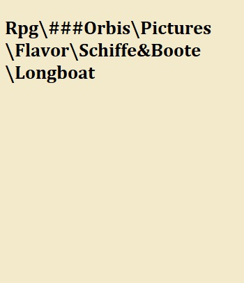

# Grundlagen des Spiels

Hier startet der technischere Teil des Buches. Im Folgenden wird erklärt wie gespielt wird, was wichtig ist und wie man sich das Spiel so angenehm wie möglich macht.

## Checks und Proben

In Orbis Aestea wird - wie in jedem anderen Pen and Paper Rpg - gewürfelt. Bei uns wird dies durch ein Programm übernommen, daher gibt es hier nichts selbst zu rechnen. Trotzdem ist es sehr relevant zu wissen wie welche Probe gewürfelt wird. Für jede Probe gibt es einen sogenannten [Skill](#Skills), der auf die Aktion passt - bspw. ["Bewaffnet"](#Bewaffnet) für das Zuschlagen mit einer Waffe oder ["Schleichen"](#Schleichen) für das Heranschleichen an eine Situation. Die passende Probe zur Aktion wird dann mit dem Skill und dem verbundenen Attribut geworfen - für das Beispiel Schleichen wäre dieses "Agility".

Attribute stellen hierbei immer körperliche Eigenschaften dar, z.B. hätte ein Spitzensportler einen Wert in seinem spezialisierten Attribut von 17-18, ein Attribut von 20 käme einem Halbgott gleich. Gleiches zählt auch bei den Skills, bei denen die "Besten" zwischen 75 und 85 liegen. Der Durchschnitt der Skills liegt bei 20 und der der Attribute bei 10.

Hier eine schematische Darstellung über die Skills und die damit Verbundenen Attribute:

{width="697"}

Wie man sieht, passiert es manchmal, dass einem Skill mehrere Attribute zugeordnet sind. In diesem Fall nimmt man den Durchschnitt der Attribute und rundet auf die nächste ganze Zahl auf.

### Die einfache Probe

Die einfache Probe ist zu Würfeln, wenn es keinen direkten Gegenspieler gibt. Sie ist meistens mit einem Threshold in Value[^regeln-1] oder Damage verknüpft, den der DM beliebig festlegt. Sollte man bspw. versuchen ein Schloss zu knacken, wird der DM festlegen, dass der Value über 3 sein soll, um das zu erreichen. Bei härteren/leichteren schlössern ist der Value natürlich anzupassen.

[^regeln-1]: Value ist eine Form von Gütekriterium eines Wurfes - je höher der Value, desto besser der Wurf.

Welche Werte hierbei welcher Größenordnung entsprechen findet sich <font color="green">[hier](#Abstufungen)</font>.

### Die Differenzprobe

Eine Differenzprobe ist zu werfen, wenn es einen direkten Gegenspieler gibt. Beispielsweise, wenn 2 Leute in einer Taverne anfangen Armzudrücken. Hier werden demnach die jeweiligen Skills und Attribute gegeneindander gewürfelt und die Differenz der Values wird interpretiert.

Welche Werte hierbei welcher Größenordnung entsprechen findet sich <font color="green">[hier]()</font>.

#### Untypische Proben {#UntypischeProben .unnumbered}

Normalerweise werden Proben normal Skill und Attribut gegen die selbe Skill/Attribut-Kombination geworfen. Beim Armdrücken-Beispiel würde man z.b. Stärke und Unarmed der einen Person gegen Stärke und Unarmed der anderen Person werfen. Dieses Prinzip zählt jedoch nicht für alle Proben. Folgende Proben werden anders geworfen:

-   Schleichen: Sneak gegen Perception
-   Lügen/Persuation: Lying/Persuation gegen Insight
-   Angriff: Armed/Unarmed/Ranged/throwing gegen Dodge/Block
-   Einschüchtern: Intimidation gegen Insight mit Instinct als Attribut
-   Taschendiebstahl: Taschendiebstahl gegen Perception
-   Performance: Performance gegen Perception

### Der Save

Ein Save ist nochmal etwas anderes als eine Probe, auch er wird üblicherweise gegen einen Threshold geworfen und ist ein Weg sich vor etwas Schlimmen zu bewahren. Allerdings wird der Save nur mit den Attributen geworfen, Skills haben hierbei keinen Einfluss. Der Threshold ist üblicherweise 3, kann aber vom DM je nach Situation angepasst werden.

### Advantage/disatvantage

In manchen Situationen ist man at advantage oder at disatvantage, das bedeutet prinzipiell nur, dass derselbe Wurf mehrmals (üblicherweise 3 mal) geworfen wird. Ist der Spieler at atvantage wird das für den Spieler günstigste Ergebnis, at disatvantage wird das für den Spieler nachteiligste Ergebnis, ausgewählt.

### Momentane Modifikatoren

Manchmal gibt es Modifikatoren auf Attributes oder Skills, diese sind nur für kurze Zeit (Maximal die Session) aktiv und werden im Character-Sheet auf der Status Page bei Modifikator eingetragen. Sie sind für den Wert des Attributs/Skills zu addieren bzw. abzuziehen.

### Kritische Werte {#Critical}

Bei jedem Safe wird auch ein D20 geworfen - der sogenannte kritische Wurf (wie beinahe alles passiert dies automatisiert über das Programm). Wenn dieser eine 20 ist spricht man von einem Nat 20 - dem bestmöglichen Ergebnis, bei einer 1 spricht man von einer Nat 1 - dem schlechtesten möglichem Ergebnis. Des weiterem hat jeder Charakter eine positive und eine negative Kritische Grenze, die kritische Erfolge oder Fails wahrscheinlicher machen.

## Typische Saves

Diese Saves sind typisch und werden euch immer wieder begegnen:

### Ausdauersave {#Ausdauersave}

Der Ausdauersave passiert automatisch bei jeder Kampfrunde und bei jeder Aktion die körperliche Ausdauer verbraucht. Er wird mit dem Physical-Wert abgezogen dem <font color="green">[Aktiven Gewicht/5](#AktivesGewicht)</font> gewürfelt. Die negative Differenz wird der Ausdauer abgezogen. Warum Ausdauer und dieser Save wichtig sind steht <font color="green">[hier](#Ausdauer)</font>.

### Toxikologie-Save

Der Toxikologie-Safe wird mit den Würfeln der Attribute Physical, Instinct, Luck und Glaube gewürfelt - Achtung hierbei wird die Summe, nicht der Durchschnitt gebildet.

Da jeder Trank toxisches Potential hat, wird immer, nachdem ein Trank konsumiert wird, ein Toxi-Save gegen den Threshold aus allen kummulierten Trankstufen der genommenen Tränke gewürfelt. Sollte man diesen nicht schaffen fällt man in <font color="green">[Ohnmacht](#Ohnmacht)</font>.

### Glaube/Glück Save {#Lucksave}

Dies ist mit Abstand der häufigste und wichtigste Save. Hierbei wird die Summe (wieder nicht der Durchschnitt) der Attribute Luck und Glaube als Threshold gebildet. Dieser Save wird immer geworfen, wenn der DM nicht sicher ist ob positive oder negative Folgen eintreten. Hierbei wirft der DM einen D20 Würfel, wenn der geworfene Wert unter dem Threshold liegt tritt die positive Folge ein, andernfalls die negative.

Dieser Save kommt auch zum Tragen, falls ein Spieler seine gesamte Health verliert. Dann wird gegen den Threshold 3 geworfen. Wenn der Save bestanden wird fällt der Spieler nur in <font color="green">[Ohnmacht](#Ohnmacht)</font>, andernfalls stirbt der Charakter.

Bei der Charakter erstellung ist ein ungenaues Ziel des Charakters zu formulieren, bei Erfüllung steigt das Luck lvl. Dies hilft dem DM die Sessions langfristig zu planen. Diese Ziele können sich im Laufe der Kampange auch verändern.

Auch allgemein können Ergebnisse die den Charakter langfristig glücklich machen den Glückwert steigern.

## Der Kampf

Der Kampf ist wie in jedem Pen- and Paper-System einer der komplizierteren Vorgänge. In Orbis Astea läuft viel über ein Programm, was alles deutlich erleichtert und schneller macht. Im Allgemeinen versucht das System das Spiel so flüssig wie möglich zu halten.

### Die Initiative {#Initiative}

Am Anfang des Kampfes findet die Initiative statt, d.h. jeder wirft Initiative (Instinct + Physical)/2. Die Werte werden nach größe geordnet und der mit dem höchsten Wert darf angreifen, dann der mit dem zweithöchsten und so weiter. Manchmal legt der DM diese Reihenfolge sinngemäß fest (bspw. bei Schleichangriffen oder Distanz und Fernkämpfern). Im Allgemeinen bekommen Fernkämpfer +1 Würfel auf die Initiative-Probe. Bei Gleichstand in den Werten werden Armbrüste und Musketen vorgezogen, da sie einfach nur abdrücken müssen. Diese Vorteile fallen weg, falls die Distanz sehr gering ist.

### Die Kampfrunde und die Kampfaktionen

In jeder Kampfrunde gibt es 4 Aktionen:

-   Die <font color="green">[Bewegung](#Bewegung)</font>
-   Die <font color="green">[Single Action](#SingleAction)</font>
-   Die <font color="green">[Main Action](#MainAction)</font>
-   Die <font color="green">[Bonus Action](#BonusAction)</font>

#### Die Bewegung und der Radius {#Bewegungsradius .unnumbered}

Die Bewegung steht am Anfang einer Kampfphase. Der Spieler kann sich seinem Bewegungsradius entsprechend bewegen, allerdings hat der DM hier das letzte Wort. Der Bewegungsradius berechnet sich durch den Agilitäts-Wert durch 2 abgerundet. So kann sich eine normal agile Person 5 Meter pro Runde bewegen. Durch [Reiten](#Reiten) kann dieser Wert natürlich deutlich höher sein.

Bei einem Laufen-check wird der Fähigkeitswert mal dem Bewegungsradius in einer Runde umgesetzt.
Der Bewegungsradius von Tieren oder Monstern kann daher deutlich höher sein als der der Spieler.

#### Die Single Action {#SingleAction .unnumbered}

Als Single Action zählen Aktionen, die klein genug sind um keine Main Action zu sein. Was genau als Single Action gilt entscheidet der Dm, aber einige Single/Main Actions sind fest definiert.

Übersicht über Main und Single Actions:

|       Main Actions        |             Single Actions             |
|:-------------------------:|:--------------------------------------:|
|          Angriff          |     Trank in Tranktasche Benutzen      |
|    Verbündetem helfen     |      Blocken/Ausweichen/Parieren       |
| Sache ausm Rucksack holen |               Aufstehen                |
|    Instrument Spielen     |          Laden einer Armbrust          |
|     Trank Herstellen      |           Sache Ausm Holster           |
|      Mount/Dismount       |       Trank herstellen (Stufe 1)       |
|  Improvisierte Handlung   |            Objekt benutzen             |
|       Laden Muskete       |     Improvisierte kleine Handlung      |
|   Laden der Artillerie    | Angriff Unarmed/Dual Wield/Zweite Hand |
| Entwaffnen mancher Fallen |           In Deckung Hechten           |
|                           |               Wurfwaffe                |
|                           |               Schildstoß               |

Die Single Action kann - genauso wie die Bonus Action - für die Runde des Gegners gespart und jederzeit eingesetzt werden. Meistens um zu blocken/auszuweichen oder für das Verwenden von Wurfwaffen.

#### Die Main Action {#MainAction .unnumbered}

In der Main Action kann jede Handlung durchgeführt werden, allerdings ist es empfohlen die Main Action gut zu verwenden, da dies der entscheidende Teil des Kampfes ist.

#### Die Bonus Action {#BonusAction .unnumbered}

Die Bonus Action ist eine weitere Single Action, diese ist jedoch normalerweise nicht verfügbar und wird nur selten durch gewisse Buffs oder den DM gewährt.

Die Bonus Action kann - genauso wie die Single Action - für die Runde des Gegners gespart und jederzeit eingesetzt werden.

#### Blocken, Parieren und Ausweichen {#BlockenAusweichen .unnumbered}

Alle diese "Abwehrhandlungen" verringern den Schaden, den ein Charakter von gegnerischen Angriffen abbekommt, denn auf jeden Angriff kann mit Blocken, Parieren oder Ausweichen reagiert werden, es sei denn, man sieht den Angriff nicht kommen. Blocken ist dabei ohne Zweifel die stärkste Wahl, allerdings verliert man dabei eine Hand an einen Schild und kann keine Großwaffen mehr benutzen oder Dual Wielden, denn ohne einen Schild ist das Blocken nicht möglich.

Das Parieren ist die schwächste Abwehrform und hat - neben der Tatsache, dass nur Nahkampfwaffen richtig parieren können - den zusätzlichen Nachteil, dass ein kritischer Treffer des Gegners oder ein eigener Kritischer Fail die Waffe um Zustand 1 verringert. Bei gegnerischem Nat 20/eigenem Nat 1 geht der Zustand sogar um 2 nach unten. Der Vorteil des Parierens liegt allerdings darin, dass man keine zusätzlichen Einbußen von Optionen hat (wie bspw beim Schild, wo man eine Hand auf den Schild verwendet). Das Parieren ist also dort eine "kostenfreie" Option, wo ein Block unmöglich wird. Allerdings kann nur ein Nahkampfangriff pariert werden.

Obwohl das Parieren grundsätzlich nur für Nahkampfangriffe möglich ist und eine Nahkampfwaffe erfordert, können im Notfall auch Fernkämpfer mit ihrer Waffe parieren - allerdings zu einem höheren Preis. Die Fernkampfwaffe verliert immer 2 Zustand, bei kritischen Ereignissen 5 und bei einem Nat1 10. Diese hohen Kosten können allerdings mit der <font color="green">[Modifikation](#Modifizieren)</font> "Bayonett" verhindert werden, dann wird die Fernkampfwaffe bei der Parade wie eine Nahkampfwaffe behandelt.

Parieren wird wie ein Angriff geworfen, als Shield Value gilt der Waffenschaden mal dem Parierwert der jeweiligen Waffe. Sollte der Schaden des Abwehrenden höher sein als der des Angreifers spricht man von einem "Konter". Ein Konter ermöglicht einen kostenfreien Gegenangriff - den sogenannten Konterschlag. Falls der Verteidiger (also derjenige der erfolgreich pariert hat und den Konter bekommen hat) <font color="green">[Dual Wielding](#Dual%20Wielding)</font> betreibt, hat er die Wahl auf einen direkten Gegenangriff at advantage. In sämtlichen anderen Fällen wirft der Verteidiger den Angreifer zu Boden und dieser muss in seiner nächsten Runde wieder aufstehen (Das kann auch beim Dual Wield passieren, dort hat man ein Wahlrecht).

Wenn man noch eine Single/Bonus Action übrig hat, kann man einen Angriff mit einer Wahrscheinlichkeit von 100% blocken, parieren oder ausweichen.

Wenn man keine Action mehr hat, kann man mit einer Wahrscheinlichkeit von 60% blocken, mit 40% parieren und von 20% ausweichen.


#### Schwerer Angriff {.unnumbered}

Anstelle die Single Action für eine weitere Aktion einzusetzen ist es möglich einen einzigen schweren Nahkampfangriff zu kosten der Main und der Single action einzusetzten. Diese besondere Art des Angriffs erhöht des Dice Pool aus den Attributen für einen Armed angriff um 50%, erhöht also die Attribute des Spielers für diese Aktion um 50%. Diese Aktion ist nicht parallel zum Reiten möglich.

#### Deckung {.unnumbered}

Die Deckung stellt eine Alternative zum Blocken/Ausweichen dar. Deckung kann nur Fernkampfangriffe abwehren, Nahkampfgegner werden von Deckung nicht berührt/berücksichtigt, da sie einfach außen herum gehen können. In Deckung gehen kostet eine Single Action. Sollte die Deckung vor dem feindlichen Angriff nicht deklariert sein, braucht man einen Acrobatics-Check, um in Deckung zu gelangen. Ansonsten tritt der normale Ablauf ein (Block/dodge, mit Chance bei keiner freien Action).

Es gibt zwei Arten von Deckung - die natürliche und die aufbaubare Deckung. Jede aufbaubare Deckung braucht eine Single und eine Main Action.

Die Deckung hat eine prozentuelle Chance den Angriff vollständig zu anulieren. Je umfangreicher die Deckung, desto höher diese Chance. Denn die Wahrscheinlichkeit nicht getroffen zu werden ist ungefähr wieviel % vom Körper durch die Deckung verdeckt wird mal 0.75. Damit haben kleinere Charaktere einen Vorteil, um diesen nicht allzusehr zu erhöhen wird dabei immer von einem normalgroßen Körper ausgegangen (Mensch) und kleine Rassen bekommen eine 5% höhere Wahrscheinlichkeit, während große Rassen eine 5% niedrigere bekommen.

Sobald man in Deckung ist, hat man keinen direkten Überblick über das Schlachtfeld mehr, was einem das strategische Handeln durchaus erschweren kann. Der DM entscheidet wie genau das zu implementieren ist, empfehlenswert ist, davon auszugehen, dass der Spieler gewisse Infos nicht hat.

Bei genügend Schaden, der auf die Deckung trifft, wird die Wirkung der Deckung aufgehoben. Die Schadensmenge ist abhängig vom Material und der Breite der Deckung. Im Regelfall gilt diese Tabelle:

|        | Leben |                 Beispiele                 |
|--------|:-----:|:-----------------------------------------:|
| Tier 1 |  350  | Schlechte Holzdeckung/Dreckshaufen/Pavese |
| Tier 2 | 3500  |     Steinhaufen/Bessere Holzdeckungen     |
| Tier 3 | 9000  |        Massive Steinmauern/Felsen         |

Werte können im Spezialfall auch abweichen

Sollte der Schadenswert einer Deckung überschritten sein, gilt die Deckung als zerstört und ist damit nicht mehr wirkungsvoll. Angriffe "schlagen" durch.

Deckung kann auch negiert werden. Dies findet entweder durch Artillerie statt, oder durch hinter die Deckung geworfene Explosivstoffe (Hierbei ist der Threshold an die Größe der Deckung und die Umstände anzupassen). Eine weitere Strategie gegen Deckung ist das "ansitzen". Hierbei deklariert ein Angreifer als Main Action eine Deckung und achtet genau auf sie. Dies führt dazu, dass er auf ein beliebiges Ziel, dass hinter der Deckung hervorkommt oder hervorschaut einen Angriff in der gegnerischen Runde ausführen kann, die Verteidigung wird at Disatvantage geworfen. Sollte ein Wesen während dem ansitzen allerdings einen anderen Check werfen müssen wirft es diesen ad Disatvantage und verliert den Fokus auf die Deckung (damit ist das ansitzen beendet). Während man ansitzt kann man nicht mithilfe einer single action eine Abwehraktion (Block,Dodge,Parieren) starten, sondern der Würfel entscheidet.

### Instrumente und ihre Wirkung im Kampf {#InstrumenteRules}

Mit einem guten Rhythmus kämpft man besser. Bestimmte Lieder bringen Power Ups oder Debuffs im Kampf und können auf Gruppen und Einzelpersonen angewandt werden.

Um ein Lied im Kampf zu singen wird wie normalerweise ein Performace-Check gemacht. Die Wirkung hält vier Aktionen an und es kann nur ein Genre gleichzeitig auf eine Person wirken. Lieder können motivierend sein oder demotivierend sein, also als Buffs oder Debuffs wirken. Versucht man ein Lied auf eine Gruppe Ziele wirken zu lassen, ist es deutlich schwerer - der Theshold verdoppelt sich. Lieder können - wie fast alles in unserem System - eine Stufe (Tier) von 1 bis 4 besitzen. Diese Stufe macht ein Lied zwar schwerer zu spielen, allerdings wird die Wirkung auch stärker.

Lieder können - je nach Genre - von unterschiedlichen instrumenten begleitet und unterstützt werden, wobei das passende Hauptinstrument einen +6 Würfelmodifyer und das passende Nebeninstrument einen +3 Würfelmodifyer gibt.

Hier sieht man eine Übersicht über die Genres:

|     Genre     |       Wirkung       | Hauptinstrument | Begleitinstrument |
|:-------------:|:-------------------:|:---------------:|:-----------------:|
|   Minnesang   |      Charisma       |      Laute      |       Geige       |
|     Rock      | Kritische<br>Chance |    Dudelsack    |      Trommel      |
|     Folk      |      Physical       |    Trompete     |       Horn        |
| Tavernenmusik |      Agilität       |      Flöte      |       Geige       |
|     Metal     |       Stärke        |     Trommel     |       Horn        |
|     Polka     |    Angriffsziel     |      Laute      |       Flöte       |
|     Hymne     |    Bonus Action     |    Dudelsack    |     Trompete      |

Angriffsziel bedeutet dass man von einem oder mehreren Zielen auswählen kann wer wen ihrer/seiner Gegner angreift. Bonus Action gibt den Zielen eine bonus Action.

Lieder bekommt man indem man selbst viel Übt und spielt. Worum sich diese lieder drehen legt der spieler fest, wobei ihm aber Genre, Tier und ob es sich um ein motivierendes oder demotivierendes lied handelt vorgegeben wird. Dies kann bei Performance-Checks oder beim [Training](#Training) passieren.

### Dual Wielding

Ganz mutige Wesen versuchen mit zwei Waffen zu kämpfen. Dies kann Vor- und Nachteile mit sich bringen. Ein Nachteil dabei ist, dass man nicht blocken kann. Ein Vorteil ist, dass man auch in der Single Action mit einer Waffe zuschlagen kann.

Des weiteren gibt es die Chance auf einen Optionsangriff von 20% nach einem Angriff auf einen Zweithandangriff. Für diesen gilt: Der Schaden mit der Sekundärwaffe (außer Dolch und unbewaffnetem Angriff) wird nur zu 80% umgesetzt. Bei Dolchen kommt 90% des Schadens durch, bei unbewaffneten Angriffen sind es 100%. Sollte es zu einem Optionsangriff kommen, fällt die Option auf einen normalen Doppelangriff weg. Egal wie, man kann auch mit dual Wield nur maximal zwei Angriffe pro Runde werfen.

### Der Schildstoß

Charaktere mit Schilden können auch einen Schildstoß vollführen. Hierbei wird mit dem Blocken-Skill angegriffen und der Schildwert als Waffenwert verwendet (das Programm macht das automatisch). Wenn der Value dabei um 2 größer ist als jener der Verteidigungsaktion des anderen wird dieser umgeworfen und muss aufstehen (auch das zeigt das Programm an)

### Andere Angriffe während Single Actions

Auch andere Angriffe können als Single Action durchgeführt werden. Dazu zählen <font color="green">[kleine Wurfwaffen](#WurfWaffen)</font> und unbewaffnete Angriffe wie bspw. ein Faustschlag.

### Schleichangriffe {#Schleichangriffe}

Unerwartete Angriffe können unheimlich effektiv sein und laufen nach einem gewissen Schema ab. Zuerst wirft man eine <font color="green">[Sneak-Probe](#UntypischeProben)</font> gegen das Ziel oder andere Personen, die einen sehen könnten. Wenn diese fehlschlägt wird normal <font color="green">[Initiative](#Initiative)</font> geworfen. Wenn nicht kommt es zum Schleichangriff. Dieser kann mit allem durchgeführt werden, was nicht als Großwaffe gilt.

Beim Schleichangriff ist keine Abwehraktion des Gegners möglich, sonst läuft der Schleichangriff wie ein normaler Angriff. Außnahme davon ist der Dolch und die Armbrust - bei der Armbrust wird 4 mal gewürfelt, beim Dolch kommt es zum Attentat.

Nach einem Schleichangriff wird eine weitere Sneak-Probe geworfen, um zu entscheiden, ob der Charakter entdeckt wurde oder nicht. Bei einem Schleichangriff mit einer Nahkampfwaffe bekommt man für die Probe einen -5 Modifyer auf das Attribut Agility, mit dem Schleichen geworfen wird. Bei einem Schleichangriff mit einer Fernkampfwaffe liegt dieser Modifyer nur bei -2, beziehungsweise bei -1 mit der Armbrust. Dieser Modifyer bleibt bestehen solange der Schleichvorgang andauert, und bei jedem weiteren Schleichangriff, der im Rahmen dieser Aktion durchgeführt wird, kommt ein weiterer Modifyer dazu, diese Modifyer verfallen bei Entdeckung oder Flucht sofort.

Beispiel: Ein Charakter (mit 12 Agility und 43 Sneak) legt einen Hinterhalt mit einem Bogen. Er besteht den ersten Sneak-Check (mit 12 Agility und 43 Sneak) und kann einen Schleichangriff landen. Danach muss er einen weiteren Sneak-Check machen (mit 10 Agility und 43 Sneak - Aufgrund der Fernkampfwaffe bekommt er einen -2 Modifyer auf die Schleichprobe). Er besteht und macht einen zweiten Schleichangriff. Nun kommt ein weiterer Sneak-Check (mit 8 Agility und 43 Sneak - Aufgrund der Fernkampfwaffe bekommt er einen weiteren -2 Modifyer auf die Schleichprobe). Er besteht und macht einen zweiten Schleichangriff - dieses mal mit seinem Dolch. Nun kommt ein weiterer Sneak-Check (mit 3 Agility und 43 Sneak - Aufgrund der Nahkampfwaffe bekommt er einen -5 Modifyer auf die Schleichprobe). Dieses mal wird er entdeckt und die Ziele greifen ihn an, jetzt hat er wieder 12 Agility und 43 Sneak.

Beim Schleichen sind außerdem die <font color="green">[Modifikatoren durch Überladung](#Belastungsstufe)</font> zu beachten.

#### Das Attentat {.unnumbered}

Wenn eine Sneak Attack mit einem Dolch stattfindet, wird es bei geringeren Gegnern zum Attentat. Das Attentat tötet den Gegner direkt. Sollte der DM da was dagegen haben, wird das normale Prozedere mit Advantage 5 geworfen. Dies trifft vor allem auf Monster und bestimmte Charaktere zu bei denen es nicht glaubhaft ist, dass ein Attentat ausreichend ist, um sie zu töten. Sollte der DM das Attentat verneinen, wird der Schaden der Versuche stattdessen kummuliert.

### Waffen werfen und Wurfwaffen

Jede Waffe kann auch für ein wenig Schaden geworfen werdem. Hierbei wird der Schaden der Waffe mit dem Wurfwert multipliziert und als Waffenschaden verwendet. Werfen einer Waffe wird mit dem Skill throwing geworfen und kann gedodged oder geblockt werden.

Wurfwaffen funktionieren für gewöhnlich genauso. Im Notfall kann man sie als normale Nahkampfwaffen verwenden, allerdings bringt das kaum etwas. Ansonsten werden Wurfwaffen für eine single Action geworfen. Sie haben eine Chance gegnerische Aktionen zu unterbrechen, sie haben allerdings auch bei jeder Verwendung eine Chance, kaputtzugehen. Eine <font color="green">[Liste von Wurfwaffen ist hier](#Belastungsstufe)</font> einzusehen.

### Gezielte Schüsse {#GezielterSchuss}

Manchmal will man einen speziellen Teil des Gegners angreifen. Das nennt man einen gezielten Schuss. Hierbei wird allerdings die Trefferwahrscheinlichkeit - und dadurch der Schaden - stark verringert, je nachdem was man zu treffen plant. Hierbei gibt es vier Bereiche:

-   Kopf - Dies hat die Chance einen Gegner zu betäuben
-   Torso - Innere Verletzungen nach Entscheidung des DM (empfohlen Luck/Glaube-Roll)
-   Arme - Dies hat die Chance zu entwaffnen
-   Beine - Dies hat die Chance einen Gegner umzuwerfen

Diese Bereiche haben jeweils auch eigene Health-Werte und können nach und nach runtergebracht werden, um die Effekte sicher zu erzielen. Wird einem Teil schaden gemacht, sinkt auch die allgemeine Gesundheit eines Zieles.

Es wird empfohlen einen gezielten Schuss nur zu setzen, wenn der Gegner nicht garantiert Blocken, Parieren oder Ausweichen kann.

### Objekte während des Kampfes

Objekte können während des Kampfes als Nebenaktion verwendet werden. Wichtig ist hierbei allerdings, dass man sie bereits in der Hand, im Holster (bei Waffen) oder in der Tranktasche (bei Tränken) trägt. Alles, was aus dem Rucksack - also dem übrigen Inventar - geholt werden muss, kostet eine Hauptaktion.

#### Holster {#Holster1 .unnumbered}

es gibt 5 mögliche Holster:

-   Hauptholster - Hier kann man eine Nahkampfwaffe, eine Fernwaffe oder einen Dolch platzieren
-   Sekundärholster - Hier kann man eine Nahkampfwaffe, eine Fernwaffe oder einen Dolch platzieren
-   Rückenholster - Hier ist Platz für eine Fernwaffe, eine Großwaffe oder eine Stangenwaffe
-   Zusatzzlot - Hier kann man einen zusätzlichen Köcher oder seinen Schild tragen
-   Köcher - dies ist der Standardköcher für Wurfwaffen/Spezialmunition den jeder haben kann

Ein Holster erlaubt einem, Waffen mit einer Single Action zu ziehen bzw. zu tauschen.

#### Köcher {.unnumbered}

In einem Köcher kann entweder Spezialmunition oder Wurfwaffen mitgeführt werden. Dies hat den Vorteil, dass die Spezialmunition direkt in einem Ranged-angriff verwendet werden kann (dieser kostet wie ein normaler Ranged-angriff die Main Action), während Wurfwaffen im Köcher für die Side Action geworfen werden können.

Diese Regel trifft allerdings nicht für Dual Wielder/Benutzer eines Turmschildes zu. Diese brauchen um ein Item aus dem Köcher zu verwenden die Main Action - da ihre Hände entweder voll sind oder der große Schild zu sperrig ist um gut hinzukommen.

#### Tranktaschen {.unnumbered}

Mit einer Tranktasche kann man Tränke und Bomben mit einer Single-Action verwenden, solange sie in der jeweiligen Tranktasche sind. Ein Charakter kann nur eine Tranktasche mitführen. Mehr über Tranktaschen kann man <font color="green">[hier lesen](#TranktascheItems)</font>.

### Kämpfen in Formation {#Formation}

Wenn man 5 Leute oder mehr zur Verfügung hat kann man in Formation kämpfen. Eine Formation hat mehrere Vorteile: Zum einen wird der Schaden von <font color="green">[Stangenwaffen](#Stangenwaffen)</font> nicht halbiert, zum anderen sind gewisse Aktionen - wie gemeinsames Blocken - möglich. Bei gemeinsamen Aktionen kann eine Person stellvertretend für die ganze Gruppe die Probe übernehmen. Eine Formation ist nur möglich, wenn das Terrain dies auch zulässt.

#### Der gemeinsame Block {.unnumbered}

Eine der stärksten Fähigkeiten für das Kämpfen in Formation ist der gemeinsame Block. Hierbei werden die Attribute des Charakters mit dem zweithöchsten Blocken-Wert der Formation und der Skill des Charakters mit dem höchsten Blocken-Wert in der Formation für den Check herangezogen. Es muss also nur einmal geworfen werden, dieser Check wird als Check für alle herangezogen.

### Kampf vom Reittier und das Reiten {#KampfVomReittier}

Sollte man von einem Reittier kämpfen gibt es mehrere Besonderheiten:

1.  Der <font color="green">[Bewegungsradius](#BewRadius)</font> ist nicht mehr der des Charakters, sondern der des Reitieres
2.  Man zählt als großes Ziel, d.h. man sollte sich von <font color="green">[Stangenwaffen](#Stangenwaffen)</font> in Acht nehmen.
3.  Vor dem Angriffswurf wird eine Probe auf Reiten geworfen, die entscheidet wieviel vom Mount-Multiplikator des Reittieres durchkommt.
4.  Ansonsten Zählen die <font color="green">[Regeln des Reitens](#Reiten)</font>.

Beim Reiten sind ein paar Dinge zu beachten. Neben der Tatsache, dass Reittiere extra <font color="green">[Unterhalt](#Lebenserhaltungskosten)</font> kosten, sind zwei Skills notwendig, um ihr volles Potential zu nutzen - [Reiten](#Reiten) und [Animal Handling](#AnimalHandling). Reiten determiniert wie gut man sich auf dem Reittier halten und agieren kann, bzw. das Reittier steuern kann. Animal Handling determiniert wozu man das Reittier sonst bringen kann. Dies kann vor allem für spezielle Aktionen notwendig sein. Nach einer Aktion, die ein Reittier erschreckt ist ein Reiten-Check notwendig, ob der jeweilige Charakter abgeworfen wird. Den Threshold entscheidet der DM.

-   Animal Handling gegen Fluchtreflex oder aggressive Natur des Tiers

-   Reiten bei bestimmten besonderen Aktionen eines berittenen Spielers

Bei Reittieren ist es wichtig, dass man einen minimalen Reiten-Wert überschreitet, um sie überhaupt besteigen zu können. Reisen sind mit Reittieren schneller und angenehmer, allerdings wird man mit teueren Reittieren (außer es sind angsteinflößende Tiere) auch öfter Überfallen. Tiere können auf Reisen sowohl Transportmittel als auch Träger für Gepäck sein.

### Der Unbewaffnete Kampf {#UnbewaffneterKampf}

Der unbewaffnete Kampf hat zwei Anwendungen - den Pugilismus und das Grappling. Pugilismus beschreibt den "herkömmlichen" Kampf mit Fäusten oder Faustwaffen. Man bleibt in Verteidigungsposition, schlägt bedacht zu und macht Schaden. Der Pugilismus läuft wie der normale Kampf - nur eben mit dem Schaden der Faust oder Faustwaffe und mit dem Skill "Unarmed".

Grapple läuft ebenso wie Pugilismus mit Unarmed - macht allerdings keinen Schaden sondern ist dazu da den Gegner umzuwerfen oder festzuhalten. Beim Grapple wird eine Differenzprobe im Skill unarmed geworfen und der Gewinner bringt den Gegner zu Boden oder hält ihn fest. Will man einen Gegner weiter Festhalten muss jede Runde ein weiterer Unarmed Check geworfen werden, mit Value - 1\*Runde die man den Gegner aktiv am Boden hält. Achtung: Grappling ist risikoreich, da man auch selbst niedergerungen werden kann. Auch andere Gegenmaßnahmen wie Dolche können sehr effektiv sein gegen einen Festhalteversuch.

### Artillerie {#ArtillerieOverall}

Gegner mit Artillerie anzugreifen ist immer eine gute Idee - sollte die Artillerie verfügbar sein. Artillerieproben funktionieren kummulativ - je nachdem wieviele Leute an dem Gerät Besatzung sind - wird der Value addiert. Des Weiteren wird der Damage im Ganzen beim Hit vollstreckt. Sollte die Besatzung den Threshold der Waffe nicht überschreiten, verfehlt der Schuss.

Stats und Arten der Artillerie:

<small>

| Artillerie | Schaden | Reichweite | In Kästen | Gewicht | Threshold |  Preis   | Preis/Schuss |
|:----------:|:-------:|:----------:|:---------:|:-------:|:---------:|:--------:|:------------:|
|  Skorpion  |   300   |    150m    |     3     |  30 kg  |    2,3    |  90000   |     100      |
|  Balliste  |  1000   |    300m    |     6     | 250 kg  |    3,3    | verboten |     300      |
| Handkanone |   400   |    50m     |     1     |  50 kg  |     3     | verboten |     200      |
| Großkanone |  3600   |    400m    |     8     | 900 kg  |    3,6    | verboten |     750      |
|  Katapult  |   600   |    200m    |     4     | 300 kg  |     4     | verboten |     200      |
| Trebouchet |  2900   |    350m    |     7     | 600 kg  |    4,7    | verboten |     600      |

</small>

+------------+--------------------+--------------------+-----------------+--------+--------------------------------------------------------------------------------+
| Artillerie | Minimale Besatzung | Maximale Besatzung | Negiert Deckung | Größe  | Zusatz                                                                         |
+:==========:+:==================:+:==================:+:===============:+:======:+:==============================================================================:+
| Skorpion   | 1                  | 2                  | --              | Klein  | Aufbau im Kampf: 3 Runden wenn nur 1 Mann Besatzung: Nachladen als Main Action |
+------------+--------------------+--------------------+-----------------+--------+--------------------------------------------------------------------------------+
| Balliste   | 2                  | 3                  | Tier 1          | Mittel | Nachladen 1 Runde minimum, 2 Runden, wenn Besatzung \<2                        |
+------------+--------------------+--------------------+-----------------+--------+--------------------------------------------------------------------------------+
| Handkanone | 1                  | 1                  | Tier 1          | Klein  | Nachladen 1 Runde                                                              |
+------------+--------------------+--------------------+-----------------+--------+--------------------------------------------------------------------------------+
| Großkanone | 2                  | 3                  | Tier 2          | Groß   | Nachladen 1 Runde minimum, 2 Runden, wenn Besatzung \<3                        |
+------------+--------------------+--------------------+-----------------+--------+--------------------------------------------------------------------------------+
| Katapult   | 2                  | 3                  | Tier 1          | Mittel | Nachladen 1 Runde minimum, 2 Runden, wenn Besatzung \<3, Area Damage 2m        |
+------------+--------------------+--------------------+-----------------+--------+--------------------------------------------------------------------------------+
| Trebouchet | 4                  | 8                  | Tier 2          | Groß   | Nachladen 1 Runde minimum, 2 Runden, wenn Besatzung \<6 , Area Damage 8m       |
+------------+--------------------+--------------------+-----------------+--------+--------------------------------------------------------------------------------+

### Die Schadensverrechnung

Schaden wird relativ einfach verrechnet:

1.  Das Programm gibt den Schaden aus
2.  Abzug von Block/Dodge - Wirkungen (Auch über das Programm bei nrun=2)
3.  Abzug des Rüstungswertes
4.  Damage von Leben abziehen

### Damage Over Time

Damage over Time - sogenannte Statuseffekte - können durch eine vielzahl von Dingen ausgelöst werden. Sowohl Waffenmods, als auch besondere Munitionstypen bis hin zu Monstern können für Gift, Blutungen oder Brennen sorgen. Hierbei gibt es mehrere Konzepte zu Verstehen: ein Dot wird über eine gewisse "Dauer" an Runden applied und verursacht jede Runde einen gewissen Debuff (fast immer "Schaden"). Des weiteren wird ein Dot nur mit einer gewissen "Wahrscheinlichkeit" ausgelöst und auch nur, wenn der Gegnet, der den Dot verursachen will, Schaden verursacht.

Wenn ein Dot mit einer Nahkampfwaffe ausgelöst wird, geht üblicherweise eine "Ladung" verloren - bspw. verbraucht sich Gift oder die Zacken einer gezackten Klinge stumpfen ab.

Dots können sich auch häufen, so verursacht jede erfolgreiche Applikation eines Dots einen "Stack" des jeweiligen Statuseffektes - womit sich der Damage natürlich mit der Anzahl der Stacks multipliziert.

Gegen jeden Dot gibt es eine Kontermöglichkeit,

Dieses System mag am Anfang sehr kompliziert erscheinen, wird allerdings zu 100% von unserem Programm übernommen.

#### Gift {.unnumbered}

Gift ist die Wildcard unter den Statuseffekten, oftmals wird eine Vergiftung erst bemerkt, wenn sie sich bereits durch einen Teil der Gesundheit des Ziels gefressen hat - denn jedes mal, wenn ein stack Gift wirkt, wird ein Perception-check gegen einen damageabhängigen Threshold geworfen - der geschafft werden muss, damit der Charakter seine Vergiftung merkt.

Gift kann in 2 bis 9 Ladungen verabreicht werden und ein Stack Gift hält in der Regel 10 Runden. Der Schaden, der pro Runde gemacht wird hängt von der Stufe des Gifts ab, und kann über folgende Formel ermittelt werden: $$SchadenProRunde = \frac{Minschaden}{Ladungen}\cdot ((\frac{Minschaden}{100}) \cdot Ladungen \cdot 1,1)$$ Mehr Ladungen machen mehr Schaden insgesamt und auf möglicherweise mehrere Gegner, müssen allerdings öfter applied werden - sind daher also langsamer. (Der Minschaden für eine Stufe Gift ist <font color="green">[in der Trankliste einsehbar](#Tränke)</font>)

```{r,echo=F}
library(ggplot2)

Maxschaden=200
Ladungen=c(2:9)
ll=data.frame(Maxschaden,Ladungen)
ll$SchadenRunde=Maxschaden/Ladungen+((Maxschaden/100)*Ladungen*1.1)
ll$SchadenGesamt=ll$SchadenRunde*c(2:9)

ll=tidyr::pivot_longer(ll,c(-Ladungen,-Maxschaden))

ggplot(ll,aes(x=Ladungen,y=value,col=name))+geom_line(size=1) + theme_bw() +
  theme(panel.grid.major = element_line(linetype = "blank"), 
    panel.grid.minor = element_line(linetype = "blank"), 
    panel.background = element_rect(fill = "#F3EACB"), 
    plot.background = element_rect(fill = "#F3EACB"),
    legend.key = element_rect(fill = "#F3EACB"), 
    legend.background = element_rect(fill = "#F3EACB"))+
  labs(y="Schaden",title="Darstellung für Tier 1") + scale_colour_manual(name="",labels=c("Schaden insgesamt", "Schaden pro Ladung"),values=c("black","red"))

```

Als Gegenmaßnahme gegen Gift helfen leider nur andere Tränke - beispielsweise Gegengift.

#### Bluten {.unnumbered}

Beim Bluten verliert das Opfer für gewöhnlich jede Runde einen Prozentsatz seiner maximalen Gesundheit - üblicherweise 6% pro Stack - womit das Bluten sehr Effektiv gegen starke Einzelziele ist. Standartmäßig blutet man für 3 Runden und kann als Gegenmaßnahme gegen das Bluten mithilfe eines Survival-Checks die Wunden verbinden.

#### Brennen {.unnumbered}

Der Schaden eines Brennen Statuseffektes ist üblicherweise 50 pro Runde, jedoch kann die Dauer dieses Effekts variieren. Brennen kann gekontert werden, indem sich brennende Charaktere eine Runde auf dem Boden wälzen. Auch Wasser oder andere Mittel gegen Brände können dabei hilfreich sein.

Sollte der Brand beispielsweise mit Öl entstanden sein, kann der DM gewisse Konteraktionen - wie auf dem Boden wälzen - für nicht möglich erklären.

#### Andere Statuseffekte {.unnumbered}

Andere Statuseffekte mit

### Der Krieg auf See

Die Meere in Orbis Astea sind ein ebenso gefährliches und umkämpftes Gebiet wie das Land und so ist es nützlich sich mit dem Kampf auf See auszukennen.

Da das Meer, die Seen und Flüsse sowohl für den Handel als auch für militärische Operationen essentiell sind, ist eine gute Flotte aus der Machtpolitik der Fraktionen kaum herauszudenken.

#### Allgemeines

Der Kampf auf See unterscheidet sich signifikant vom Kampf auf dem Festland, während schwere Rüstungen auf dem Festland zu den mächtigsten Waffengattungen gehören, sieht man in Metall bekleidete Soldaten nur selten auf See. Egal wie gut man schwimmen kann, das enorme Gewicht einer Rüstung zieht einen in den sicheren Tod sollte man über Bord gehen.

Stattdessen sieht man vor allem leichte Rüstung, da diese kaum beeinträchtigend ist, wenn man überleben will - wobei gute schwimmer sich auch in mittlerer Rüstung auf Schiffe begeben können ohne um ihr Leben fürchten zu müssen.

Auch Fernkampfwaffen sind auf See deutlich häufiger vertreten - dabei allen vorran Armbrüste und Musketen, deren größter Nachteil, die Nachladezeit, von der Distanz von Schiff zu Schiff relativ gut negiert wird.

##### Kapern und Versenken

Es gibt zwei Möglichkeiten eine Auseinandersetzung mit einem anderen Schiff zu gewinnen: das Kapern und das Versenken.

Beim Versenken wird dem Schiff genügend Schaden zugefügt, dass es untergeht (Also die Haltbarkeit auf Null sinkt). Beim Kapern übernimmt man das Schiff des Gegners, indem man die Crew gefangen nimmt oder tötet und die Steuerung über das Schiff übernimmt.

Für jede dieser Optionen gibt es verschiedene Werkzeuge, die entwickelt wurden, um das Ziel besser zu erreichen.

##### Schiffsarten

Es gibt drei große Übertypen, in die sich Schiffe unterteilen lassen. Zwei dieser Schiffstypen sind relevant, da kaum wer ein Staatenschiff steuern oder bekämpfen wird. Die relevanten Schiffstypen sind Ruder und Segelschiffe.

###### Ruderschiffe {#RuderGeneral .unnumbered}

Ruderschiffe existieren deutlich länger als Segelschiffe und stellen, vor allem im Flussverkehr, die häufigste Schiffsart dar. Ihr niedriges Profil und ihr niedriger Schwerpunkt, in Verbindung mit der Manövrierbarkeit, macht sie zur perfekten Schiffsklasse für einen Kampfstil, der seinen Schwerpunkt aufs Rammen legt. Allerdings macht es das niedrige Profil auch schwerer Segelschiffe zu entern, sowie Personen auf Deck eines Schiffes mit niedrigen Profil wenig Chancen haben sich vor den Schützen auf einer vöher liegenden Anhöhe (beispielsweise ein höheres Schiff) zu decken.

Die Crews auf Ruderschiffen sind aufgrund der Rudercrew meist größer und brauchen daher mehr Vorräte, weswegen lange Reisen nur in Küstennähe möglich sind, außer es liegt Unterstützung von Segelschiffen vor. Auch Ruderschiffe können für Reisen Segel haben, sind damit aber kaum Manöverfähig. So muss das Segel bei jedem Richtungswechsel eingeholt werden.

Vorteile:

-   Weniger bis keine Abhängigkeit von Wind
-   Einfach manövrierbar
-   Braucht wenig erfahrene Seemänner
-   Schnelle Beschleunigung
-   Niedriges Profil
-   Billiger

Nachteile:

-   Brauchen mehr Versorgung
-   Deutlich mehr Personen zur Fortbewegung
-   Niedriges Profil
-   Nur in Küstennähe alleine nutzbar
-   Schlechter für große Distanzen
-   Anfälliger für Stürme

###### Segelschiffe {#SegelGeneral .unnumbered}

Vorteile:

-   Brauchen weniger Personen zur Fortbewegung
-   Können viel Ladung und Vorräte mitnehmen
-   Hohes Profil
-   Hochseetauglich
-   Schnell

Nachteile:

-   Windabhängig
-   schwerer manövirierbar
-   Braucht kompetente Seemänner
-   Teuer
-   Hohes Profil

###### Staatenschiffe {.unnumbered}

Niemand weiß so genau woher die Staatenschiffe kommen, aber diese maritimen Kolosse gelten als unbezwingbar. Die größe alleine reicht aus, um Flotten in den Schatten zu stellen und in die Flucht zu jagen, da ein Staatenschiff kleinere Schiffe, bei ausreichender Beschleunigung, mühelos überfahren kann. Staatenschiffe scheinen sich selbst wie durch Wunderhand mit allen möglichen zur Verfügung stehenden Materialien zu reparieren, sei es Treibgut oder andere Schiffe. Daher gibt es bis heute keinen bekannten Fall in dem ein Staatenschiff gesunken ist.

Die schiere Größe, das riesenhafte Profil und die Widerstandskraft eines Staatenschiffs macht es zum idealen Objekt um massig Artillerie darauf zu stellen oder es als eine Maritime Stadt zu verwenden.

Staatenschiffe haben eine komplexe zentrale Steuereinheit und nur wenige sind in der Lage ein Staatenschiff damit zu steuern - sollte man allerdings eine derartige steuerung gemeistert bekommen sind die Möglichkeiten enorm. Doch auch ohne geeignete Steuermänner haben die Bewohner dieser Kolosse Wege gefunden, um sie zu steuern. durch den Aufbau hunderter kleiner Segel sind die Staatenschiffe etwas steuerbar, obwohl es immernoch eine Herausforderung ist und um ein vielfaches weniger effektiv als die zentrale Steuerung. Eine gezielte Steuerung eines Staatenschiffs ohne Steuereinheit gilt als unmöglich.

#### Schiffstypen

Verschiedenste Schiffstypen mit eigenen Charakteristiken, Vor. und Nachteilen, Besonderheiten und Verwendungszwecken können in Orbis Astea gefunden werden.

##### Ruderschiffe

###### Barke {.unnumbered}

Barken sind meist kleine Boote ohne Mast, die bis zu 8 Leuten Platz bieten. Sie sind nicht hochseetauglich und werden meist für kleinere Transporte oder von Hafennahen Fischern eingesetzt. Eine Barke ist sehr billig, allerdings nur bedingt von Bedeutung. Auf größeren schiffen werden sie als Beiboote eingesetzt.

###### Bireme {.unnumbered}

Eine Bireme ist ein Ruderboot mit zwei Ruderreihen. Es ist das kleinste Ruderboot dass wirklich eine Bedeutung hat. Mit einer Mindestbesatzung von 40 Mann und Kapazität für 40 weitere Soldaten ist die Bireme eine kostengünstige Option, die fast überall Anwendung findet. Voll hochseetauglich wird sie alleine durch die Kapazität an Nahrung ausgebremst.

Biremen kommen sowohl mit offenem Deck, als auch mit einem geschlossenem Kampfdeck.

###### Galeeren {.unnumbered}

Galeeren haben ein breites, meist offenes Deck und sind eher auf Artillerie als auf Truppentransport ausgelegt. Da viele Galeeren umfunktionierte oder immer noch im Dienst seinende Handelsschiffe sind, haben sie auch häufiger Lagerräume und das typische - oft nachteillige offene Deck.

![Eine umfunktionierte Handelsgaleere[^regeln-2]](Pictures/Flavor/SchiffeBoote/Wikimedia_Galeere_Transparent.png)

[^regeln-2]: Diese Abbildung wurde der Seite [wikimedia](https://commons.wikimedia.org/wiki/File:Galley-knightshospitaller.jpg) entnommen und steht unter einer Creative Commons Attribution-Share Alike 3.0 Unported license zur Verfügung.

Dennoch sind Galeeren weit verbreitet und sowohl im zivilen als auch im militärischen Gebrauch üblich. Und sind vor allem durch ihre Vielseitigkeit charakterisiert. Kaum ein Schiffstyp ist so vielseitig und anpassungsfähig.

###### Trireme {.unnumbered}

Die Trireme ist mit 130 Ruderern und Platz für 150 Soldaten ein gefürchteter Anblick in jeder Seeschlacht. Ihre immense Beschleunigung macht sie zum idealen Schiff zum rammen und zum kapern anderer Schiffe, und so sind sie eigentlich nur im militärischen Gebrauch anzutreffen.

![Eine Trireme auf Patroullie[^regeln-3]](Pictures/Flavor/SchiffeBoote/wikimedia_Trireme.png)

[^regeln-3]: Diese Abbildung wurde der Seite [wikimedia](https://commons.wikimedia.org/wiki/File:Trireme_1.jpg) entnommen und steht unter einer Creative Commons Attribution-Share Alike 2.0 France license zur Verfügung.

Obwohl Triremen eher teuer sind, sind sie aufgrung ihrer Kampfkraft und der Schnelligkeit, mit der neue Seefahrer eingearbeitet sind, weit verbreitet. Trieren haben außerdem Platz für Artillerie und sind standartmäßig mit einer Ramme ausgerüstet, sie werden immer mit einem geschlossenem Kampfdeck gebaut.

##### Segelschiffe

###### Kutter {.unnumbered}

Ein Kutter ist meist ein kleines Fischerboot, in das bis zu 8 Personen hineinpassen. Es ist weder hochseefähig, noch besonders geräumig und ist das Segelschiff-Gegenstück zur Barke mit dem Vorteil höherer Reichweite und Geschwindigkeit und das man nicht ständig rudern muss.

###### Brigg {.unnumbered}

Die Brigg ist das kleinste hochseefähige Schiff und kommt mit einem bis zwei Masten und Segeln. Je nach größe können verschiedene Mengen an Personen und Artillerie aufgenommen werden. Wärend auf kleine Briggs nur 1-2 Skorpione passen können auf größere Briggs sogar Katapulte oder Ballisten installiert werden.

###### Langschiff {.unnumbered}

Das Langschiff ist ein Design der Ska'en und ist mit kaum Artillerie oder einer Ramme ausgestattet, dennoch ist das Schiff aufgrund seiner Geschwindigkeit und Wendigkeit gefürchtet. Es kombiniert Vorteile aus beiden Welten der Schifffahrt damit dass es sowohl Segel als auch Ruder besitzt und schnell und zuverlässig eine große Menge Krieger transportieren kann, die sowohl fürs Kapern anderer Schiffe als auch für Landungen auf dem Festland eingesetzt werden können.



Ohne die Krieger ist das Langboot im Kampf jedoch relativ aufgeschmissen, da das niedrige Profil und die Abwesenheit von Artillerie das Schiff alleine kaum Aktionsfähig macht.

###### Fregatte {.unnumbered}

Die Fregatte ist ein großes Segelschiff mit Platz für zwei bis drei Ballisten oder Katapulte. Sie braucht 25 Seemänner um gesteuert zu werden und kann in etwa 80 zusätzliche Personen Transportieren. Fregatten sind sowohl in ziviler als auch als militärischer Nutzung häufig - werden jedoch in beiden Fällen meist bewaffnet, da sie beliebte Ziele für Piraten sind. Sie können lange Zeit reisen und sind oft der Hauptteil maritimer Flotten.

![Eine Fregatte kreuzt gegen den Wind[^regeln-4]](Pictures/Flavor/SchiffeBoote/Fregatte_Pixaby.jpg)

[^regeln-4]: Diese Abbildung wurde der Seite [Pixaby](https://pixabay.com/es/illustrations/vela-barco-mar-1506158/) entnommen und steht zur kommerziellen Nutzung zur Verfügung.

Fregatten gelten als das kleinste der großen Segelschiffe.

###### Karavelle {.unnumbered}

Die Karavelle ist das mittlere der großen Segelschiffe und ein nicht zu unterschätzendes Schiff. Sie ist (obwohl sie an Beschleunigung nicht mit Ruderschiffen mithalten kann) die wahrscheinlich schnellste Schiffsklasse auf dem Meer und wird in Puncto Feuerkraft nur von der Galeone übertroffen. Ihr hohes Deck sorgt dafür dass hoher Wellengang und leichte Stürme ihr kaum was anhaben können.

Bereits 35 Mann reichen aus um eine Karavelle voll Fahr- und Funktionsfähig zu halten, jedoch haben bis zu 140 Passagiere auf der Karavelle Platz.

###### Galeone {.unnumbered}


Galeonen sind oft die Flaggschiffe von Flotten. Diese enormen Kreutzer kosten ganze Vermögen und sind mit einer Menge an Artillerie und Soldaten ausgestattet. Die 60 Seemänner die es braucht um das Boot zu bemannen lassen noch Platz für bis zu 320 andere Passagiere - die meist die Leibgarde einer sehr reichen und mächtigen Person sind.

Die Galeone fährt für gewöhnlich mit einer Begleitflotte und ist trotz ihrer größe ein bisschen langsamer als eine Fregatte.

##### Werte und Übersicht

|   Kampf    |  Art  | Haltbarkeit | Bewegungspunkte | Manövrierbarkeit | Beschleunigung |
|:----------:|:-----:|:-----------:|:---------------:|:----------------:|:--------------:|
|   Barke    | Ruder |    1500     |        2        |        20        |       10       |
|   Kutter   | Segel |    2000     |        1        |        18        |       6        |
|   Bireme   | Ruder |    10000    |        2        |        17        |       14       |
|   Brigg    | Segel |    8000     |        2        |        14        |       13       |
| Langschiff | Segel |    15000    |        3        |        16        |       17       |
|  Galeere   | Ruder |    18000    |        3        |        13        |       15       |
|  Fregatte  | Segel |    15000    |        2        |        9         |       12       |
|  Trireme   | Ruder |    25000    |        4        |        10        |       20       |
| Karavelle  | Segel |    18000    |        2        |        7         |       11       |
|  Galeone   | Segel |    30000    |        1        |        5         |       5        |

<small> <small>

+------------+-------+------------------+-----------+---------------+----------+-----------------+------------+
| Fahrt      | Art   | Mannschaftsgröße | Vorrat    | Passagierzahl | Tiefgang | Geschwindigkeit | Profilhöhe |
+:==========:+:=====:+:================:+:=========:+:=============:+:========:+:===============:+:==========:+
| Barke      | Ruder | 1                | 0 Tage    | 7             | 20 cm    | 7               | 40cm       |
+------------+-------+------------------+-----------+---------------+----------+-----------------+------------+
| Kutter     | Segel | 1                | 1 Tag     | 9             | 40cm     | 9               | 70cm       |
+------------+-------+------------------+-----------+---------------+----------+-----------------+------------+
| Bireme     | Ruder | 40               | 4 Tage    | 40            | 80cm     | 10              | 2m         |
+------------+-------+------------------+-----------+---------------+----------+-----------------+------------+
| Brigg      | Segel | 10               | 2 Wochen  | 80            | 1.2 m    | 15              | 5m         |
+------------+-------+------------------+-----------+---------------+----------+-----------------+------------+
| Langschiff | Segel | 40               | 8 Tage    | 110           | 80cm     | 17              | 3m         |
+------------+-------+------------------+-----------+---------------+----------+-----------------+------------+
| Galeere    | Ruder | 80               | 5 Tage    | 90            | 1m       | 12              | 4m         |
+------------+-------+------------------+-----------+---------------+----------+-----------------+------------+
| Fregatte   | Segel | 30               | 8 Wochen  | 80            | 3m       | 18              | 7m         |
+------------+-------+------------------+-----------+---------------+----------+-----------------+------------+
| Trireme    | Ruder | 130              | 6 Tage    | 160           | 1.5m     | 14              | 5m         |
+------------+-------+------------------+-----------+---------------+----------+-----------------+------------+
| Karavelle  | Segel | 45               | 10 Wochen | 140           | 4.5m     | 20              | 9m         |
+------------+-------+------------------+-----------+---------------+----------+-----------------+------------+
| Galeone    | Segel | 60               | 8 Wochen  | 320           | 6m       | 16              | 20m        |
+------------+-------+------------------+-----------+---------------+----------+-----------------+------------+

</small> </small>

#### Schiffsbewaffnung

##### Artillerie {#SegelArtillerie}

| Waffenslots | Klein | Mittel | Groß |
|:-----------:|:-----:|:------:|:----:|
|    Barke    |   0   |   0    |  0   |
|   Kutter    |   1   |   0    |  0   |
|   Bireme    |   2   |   0    |  0   |
|    Brigg    |   2   |   1    |  0   |
| Langschiff  |   2   |   0    |  0   |
|   Galeere   |   4   |   1    |  0   |
|  Fregatte   |   6   |   2    |  0   |
|   Trireme   |   4   |   1    |  1   |
|  Karavelle  |   6   |   2    |  2   |
|   Galeone   |  10   |   6    |  4   |

Welche <font color="green">[Artillerieoptionen es gibt kann man hier nachschauen](#ArtillerieOverall)</font>.

##### Rammen

Sämtliche Ruderboote können Rammen beesitzen. Um erfolgreich zu Rammen wird ein Vehicle-Check geworfen.

##### Kaperequipment

Um ein Schiff zu kapern gibt es folgende Hilfsmittel:

-   Seile
-   Wurfhaken
-   Brücken

##### Sonstige Waffen

###### Saldisches Feuer {.unnumbered}

Saldisches Feuer stammt von der Insel Saldis, auf der ein Erfinder einen Weg gefunden hat mithilfe eines entzündbaren Pulvers ein Flammenstrahl zu erzeugen, den man gerichtet aus einem Rohr feuern konnte. Schnell übernahmen die Kapitäne diese, auf See enorm nützliche, Erfindung und benutzten sie als Waffe gegen mit Soldaten gefüllte Oberdecks.

Saldisches Feuer ist in der Lage in kürzester Zeit enormen Schaden an der Crew anzurichten, so ist diese einfach zu versteckende Waffe enorm gefürchtet.

#### Schiffe im Gefecht

Eine Seeschlacht ab zwei beteiligten Schiffen findet auf einer speziellen "Battlemap" statt diese ist Karte ist in Kästchen untergliedert die bestimmte Längemaße angeben. Schiffe bewegen sich während der Schlacht abhängig von ihrer Beschleunigung, je höher diese ist desto mehr Felder können pro Runde zurück gelegt werden. Die Bewegung auf der Battlemap kann in 2 Aktionen unterteilt werden: das schiff fährt entweder nach vorne oder dreht sich in eine Richtung. Jede dieser Aktionen kostet einen Bewegungspunkt.

Zusätzlich kann ein Beschleunigungswurf gemacht werden um einen zusätzliches Kästchen zurückzulegen. Die Chance hierfür hängt wiederum auch vom Beschleunigungswert ab, je höher desto besser. Auch spielt die Qualität des Kapitäns und der Mannschaft zu gleichen Teilen eine Rolle.

Das Wetter spielt hierbei auch eine Rolle je nachdem woher der Wind weht. Gibt es keinen Wind, gelten die normalen Bewegungspunkte, wenn man sich gegen den Wind bewegt werden diese Punkte halbiert(minimum eins) - mit dem Wind werden sie verdoppelt.

Ziel in diesen Seeschlachten ist es den Gegner zu versenken oder Kampfunfähig zu machen dies ist durch gezielte Schüsse auf Masten oder Steuerruder möglich, da die Zerstörung des jeweiligen Teils die Kampffähigkeit des Schiffes stark einschränkt. Dies wird erreicht in dem man sein eigenes Schiff in möglichst klugen Taktischen Manövern in Position bringt und mit den Geschützen den Gegner attackiert. Alternativ kann das feindliche Schiff auch geentert werden um die Kontrolle zu übernehmen oder es zu sabotieren. Beispielsweise können die Geschützbatterien entzündet oder vielleicht der Pulvervorrat hochgejagt werden.

Geschütze in den jeweiligen den Schiffsprofilen entsprechenden Slots können einer von vier Stellungen auf dem Schiff zugewiesen werden. Diese Stellungen sind Backbord vorne hinten und Steuerbord vorne hinten. Diese vier Stellungen können mit einem gezielten Schuss anvisiert werden und besitzen Leben entsprechend der Anzahl der in der Stellung plazierten Geschütze, somit haben viel besetzte Stellungen mehr Leben als solche mit wenig bis keinem Geschütz. Desweiteren besitzen diese vier Stellungen Schussfelder die in etwa 180° groß sind, dies führt an den Seiten zu überlappenden Schussfeldern. Für die Vorder-und Rückseite gilt, nur jeweilse eine Seite kann gerade nach vorne oder hinten schießen, diese wird durch einen Luck Throw des Ziels bestimmt.

Durch schlaues platzieren der Geschütze auf dem Schiff sind verschiedene Taktiken möglich, so zum Beispiel eine Seite mit besonders vielen Geschützen zu versehen und den Gegner nur auf eine Seite zu lassen um ihn so mit überlegener Waffengewalt zu bewzingen, diese Strategien gehen aber mit einem gewissen Risiko einher.

Den Gegnerischen Artillerie beschuss wird automatisch ausgewichen, der erfolg dieser Aktion hängt von Manövrierfähigkeit des Schiffs, als auch von Käpitän und Mannschaft ab..

## Reiserouten

Der reisenden Spielergruppe in der Downtime stehen stehts 3 Entscheidungsmöglichkeiten für ihre Reise offen. Zum einen die Überlandroute die durch kleine Dörfer und Natur führt und die Stadtroute entlang Hauptstraßen, durch ummauerte Städte mit Märkten und Großsädte. Alle Optionen haben Vor- und Nachteile, also sollte sich die Gruppe überlegen welche Option sie vorzieht.

+----------------------------+------------------------------------------------------+----------------------------------------------------------------------------------+
|                            | Überland / Dorf                                      | Hauptstraße / Stadt                                                              |
+============================+======================================================+==================================================================================+
| Versorgung / Unterbringung | Camping, gegessen wird was gejagt und gesammelt wird | Neben Zöllen fallen auch kosten für Herbergen und Essen an in Höhe von 350 Reiks |
+----------------------------+------------------------------------------------------+----------------------------------------------------------------------------------+
| Markt                      | kleiner Dorfmarkt\                                   | Großer Markt mit exotische Waren\                                                |
|                            | Waffen T1, Material T2\                              | Waffen T2, Material T3\                                                          |
|                            | viele Blumenmädchen                                  | Tiermarkt\                                                                       |
|                            |                                                      | Konstrukte bis T2                                                                |
+----------------------------+------------------------------------------------------+----------------------------------------------------------------------------------+
| Schmiede                   | Ein Schmied zufälliger Qualität                      | Drei verschiedene Schmiede zur Auswahl                                           |
+----------------------------+------------------------------------------------------+----------------------------------------------------------------------------------+
| Pflanzen                   | Reichlich                                            | wenig und begrenzt auf Stadtauswahl                                              |
+----------------------------+------------------------------------------------------+----------------------------------------------------------------------------------+
| Jobs                       | normal möglich                                       | normal möglich                                                                   |
+----------------------------+------------------------------------------------------+----------------------------------------------------------------------------------+

Großstadt T4 Material, Alle Schmiede, Waffen T3, nur wenn in relativer Map nähe möglich, downside gleiche wie Stadt (im grunde upgrade zur stadt da nicht immer verfügbar denk ich okay wenn als eigetnlich immer als alternative zur stadt genommen wird = keine kosten erhöhung => macht sonst längere session in der stadt auch zu teuer (vllt mit sonderunterkunft erklärbar! (die letzten sätze müssen nicht hier ins bookdown sondern waren als anmerkung für dich gedacht)

Als Dritte Reiseoption gibt es Großstädte. Ein Großstadt wird grundsätzlich sehr ähnlich wie ein normaler Stadt behandelt, nur gibt es hier die Möglichkeit T4 Material zu kaufen und alle Schmiede zu verwenden. Ein Großstadt kann aber nur erreicht warden, wenn die Spieler sich geographisch in der Nähe von ein Großstadt auf der Weltkarte befinden.

Als Sonderoption beim Reisen gibt es auch ein 1/3 Chance, dass die Spieler ein bestimmten Enklave finden, wo besondere Gegenstände gekauft warden können, die man normalerweise nicht kaufen kann. Kommt dies tatsächlich vor, dann wird eins der Folgenden Enklaven zufällig ausgewählt: Zwergenenklave (Konstrukte), Waldelfenenklave (Tiere), Meisterschmied (Waffen) und Zwergenkarawane (alles was das Herz begehrt).

Mit ein passendes knowledgeskill können spieler gezielt nach ein bestimmten Enklave bei der Reise suchen.

## Pause und Rast {#PauseRastSystem}

Wenn ein Charakter in einem Kampf oder durch andere Aktivitäten entweder Gesundheit oder Ausdauer verliert, ist es möglich, diese Werte bis zu einem bestimmten Punkt mit Hilfe des Pausensystems zu regenerieren. Dieses System umfasst 3 verschiedene Pausen, die verfügbar sind, nämlich:

Kurze Pause: Lange Pause: Downtime:

|    Länge    |                           Dauer                           |
|:-----------:|:---------------------------------------------------------:|
| Kurze Pause |                        3-4 Stunden                        |
| Lange Pause |                        7-8 Stunden                        |
|  Downtime   | Zeit zwischen 2 Sessions <br>(üblicherweise mehrere Tage) |

Wenn sich Spieler zwischen zwei Sitzungen befinden (Downtime), regenerieren sich ihre Ausdauer und Gesundheit immer bis zu 100%, es sei denn, der Dungeon Master kündigt eine größere Wunde an, die von einem Profi behandelt werden muss oder streicht die Downtime vollständig. Bei kurzen oder langen Pausen ist wichtig zu beachten, dass der Dungeon Master entscheiden kann, wie lange die Pause dauern soll, jedoch sollten die angegebenen Zeiträume als allgemeines Maß für die Dauer der Pausen verwendet werden. Außerdem müssen die spielbaren Charaktere die gesamte Pause ohne anstrengende Aktivitäten oder Unterbrechungen beenden, sonst ist keine Regeneration möglich. Ein weiterer wichtiger Faktor sind die Umstände, in dem sich Spieler ausruhen, diese können schlecht, durchschnittlich oder gut sein. Als schlecht kann man eine Pause auf der Straße bei kaltem Wetter bezeichnen, als mittelmäßig, wenn man in einer Kutsche schläft, die für lange Reisen geeignet ist (Dach, windfeste Wände usw.), und als gut, wenn man in einer Taverne mit einem warmen Raum und einem gut vorbereiteten Zimmer ruht. Der Dungeon Master hat die Verantwortung zu entscheiden, in welchen Umständen sich die Spieler befinden, wenn sie versuchen, das Pausensystem zu nutzen. Die folgende Tabelle zeigt, wie der Zustand durch die Qualität der Pause beeinflusst wird:

| Umstände | Kurz | Lang |
|:--------:|:----:|:----:|
| Schlecht | 10%  | 30%  |
|  Mittel  | 20%  | 40%  |
|   Gut    | 40%  | 60%  |

Bei den werten handelt es sich um eine Prozentuale Erholung gemessen an den Maximalwerten des Spielers. Beispiel: Eine kurze schlechte Rast stellt 10% der maximale Fehlenden Ausdauer und Leben wieder her. Die Werte werden im Zweifel aufgerundet.

Eine weitere Möglichkeit, den Wert einer Pause zu erhöhen, ist sich von einem fähigen Mitglied der Gruppe pflegen zu lassen - indem dieser Nahrung zubereitet und wunden versorgt. Hierzu hat der Spieler die Möglichkeit, einen Survival check durchzuführen. Es ist empfehlenswert, dass nur diejenigen, die tatsächlich in Überlebensexperten sind, dies versuchen, da ein schlechter Wert dazu führen kann, dass die Spieler während der Pause auch Gesundheit und Ausdauer verlieren - indem schlechtes essen serviert wird oder sich die Wunden durch falsche Versorgung infizieren. Der Survival check betrifft alle Spieler einer Gruppe und nicht nur eine einzelne Person.

## Downtime-Aktivitäten

In der Downtime können Charaktere alles mögliche machen, die Klassiker sind:

Diese Aktivitäten werden in zwei Kategorien unterteilt, Hauptaktvitäten die effektiv den Charakter bereichern und Nebenaktivitäten für alles andere.

Jeder Charakter kann je eine Haupt und eine Nebenaktivität pro Downtime ausüben, ausgeschlossen sind dabei Gespräche mit anderen Charakteren und Organisatorische Aktionen diese sind unbegrenzt möglich.

### Hauptaktivitäten

```{r , echo=F}
library(readxl)

DFActivity= read_excel("Container/Data/AllaroundDataStorage.xlsx", sheet="DowntimeActs")

colnames(DFActivity)[1:3]=c("Tätigkeit","Mittelwert","Standardabweichung")
knitr::kable(DFActivity)
```

*Das sammeln von Pflanzen (Dies wird am Anfang der Session über das Tool gewürfelt)*

Lernen entweder in Selbststudium, durch Lehrer oder Bücher

*Diverse Verdienstmöglichkeiten diese umfassen zum Beispiel:*

Diebstahl => zwei Optionen, hohes Risiko und niedriges Risiko jeweils mit der Basis 500 und 300 x Value mit hohem SD ( hohes Risiko SD=275, niedriges Risiko SD=)

, sollte der Wert negativ werden bedeutet dass das der Dieb erwischt wurde und diese Strafzahlungen in Kauf nehmen muss, bei hohen Risiko Jobs besteht zusätzlich die möglichkeit anschließend für die Session Polizei bekannt zu sein.

*Staßenauftritt => Basis 200 x Value hohe SD* (SD=65)

Handwerksdienste => Qulaifizierte Arbeiter Basis 250 x Value niedrige SD (SD=15)

*Hilfsarbeiten => unqualifizierter Arbeiter Basis 200 x Value niedrige SD* (SD=15)

Wettkämpfe => Faustkämpfe, Armdrücken

Würfelspiel => Einsatzabhängig Maximal Verlust Einsatz, Maximal Gewinn 2-fach

### Nebenaktiväten

-   Einkaufen gehen und besorgungen erledigen
-   Brauen von Tränken
-   Handwerks aktionen => Schmieden, Basteln
-   Besuch von Tavernen und anderen Etablissments

### Andere Aktvitäten

Sich mit Kontakten und Npcs austauschen oder andere Tätigkeiten in Absprache mit dem DM sind auch möglich, hierbei gibt der DM die Möglichkeiten, die Kosten und den Nutzen vor.

### Training {#Training}

Ein Character kann seine komplette Downtime auch opfern um einen dedizierten Skill zu verbessern dabei gibt es zwei formen: entweder das Training alleine oder das Training mit einer Lehrperson (Achtung auch die Lehrperson verliert ihre volle Downtime).

Training funktioniert folgendermaßen:

1.  Man wählt einen dezidierten Skill aus den man trainieren will (Natürlich müssen die äußeren Vorraussetzungen gegeben sein, man kann persuation nicht in voller Isolation trainieren)

2.  Man entscheidet ob alleine oder mit Lehrperson

3.  Man würfelt den Trainingserfolg aus und interpretiert ihn

Das Interpretieren ist stark abhängig davon wie man lernt beziehungsweise wie gut der Lehrer ist. Lehrer kommen in verschiedenen Stufen. Dabei ist die Stufe des Lehrers an der Differenz zwischen Schüler und Lehrer im relevanten Skill festzumachen:

```{r,echo=F}
Differenz<-seq(10,70,20)
Stufe<-c(1,2,3,4)
ll<-data.frame(Differenz,Stufe)
knitr::kable(ll,align = "cc")
```

Den Wurf interpretiert man nun folgendermaßen:

Ohne Lehrperson:

-   75% Fail-Chance (50% wenn Skill der Person unter 30)
-   sonst +1 Skill
-   +2 Skill bei Nat 20

Mit Lehrperson:

-   50% Fail-Chance
-   bis 16: + Halbe Lehrerstufe Skill
-   Ab 16: + Lehrerstufe Skill
-   Nat 20: + Lehrerstufe\*1.5 Skill

Da Lehren Zeitintensiv ist, wollen die meisten Charaktere eine Gegenleistung dafür. Dennoch haben auch Lehrer eine Chance beim Lehren selbst etwas zu lernen. Diese ist umso höher, desto kleiner die Differenz ist. Die Wahrscheinlichkeiten dafür sind in folgender Tabelle aufgeführt:

\`\`\`{r,echo=F} Differenz\<-c(10,20,30,40,50) Wahrscheinlichkeit\<-c(20,15,10,5,0) ll\<-data.frame(Differenz,Wahrscheinlichkeit) colnames(ll)\[2\]\<-"Wahrscheinlichkeit in %" chen findet man bei den meisten Alchemisten) und Stufe 6 braucht eine Alchemielabor, welches nur in Großstädten verfügbar ist.

Des weiteren braucht ein Alchemist eine Flasche, in die er sein Gebräu einfügen kann. Bei Bomben kommt dabei nur eine Bombshellflasche in betracht. Für sämtliche anderen Tränke kann man sich zwischen einer teueren Metall und einer billigen Glasflasche entscheiden - wobei Glasflaschen gerne mal bei Belastung kaputt gehen. Aber wann und wobei sie kaputt gehe Obliegt dem DM, wobei das schon begründbar sein sollte (verknüpfen mit einem Lucksafe und angepasstem Treshold).

Hier die Preise für die verschiedenen Flaschen:

|     Flaschen     | Preis |
|:----------------:|:-----:|
|   Glasflasche    |  50   |
|  Metallflasche   |  200  |
| Bombshellflasche | 1000  |

### Inhibitoren

Nicht immer will man, dass Trankwirkungen gleich einsetzen. Manchmal ist es sinnvoll lange aus dem Gebäude zu sein bevor das vergiftete Ziel stirbt. Für diesen Fall gibt es sogenannte Inhibitoren. Inhibitoren werden wie normale Tränke hergestellt und sorgen dafür, dass ein Spieler im vorhinein bestimmen kann mit welcher Verzögerung ein Trank wirkt.

### Epinephrinika {#Epinephrin}

Epinephrinika sind besondere Tränke. sie wecken einen Ohnmächtigen sofort aus (+100 Health falls die Health davor auf null war). Allerdings müssen Epinephrinika on the run hergestellt werden, weil es nach fünf Minuten seine Wirkung verliert. Kluge Gruppen haben daher die Zutaten für Epinephrinika immer dabei.

### Downtime Alchemieaktionen

Die Anzahl an Alchemiechecks pro Downtime wird durch die Effektivität des Brauers bestimmt, diese erhöht sich mit seinen Werkzeugen, je mehr verschiedene Hilfsutensielien desto mehr Checks sind in der gleichen Zeit möglich. Manche Utensilien können sowohl die Anzahl für Handwerkschecks sowie Alchemie Checks erhöhen.

+-------------------+-----------------+---------+---------------------------+-------+-----------------------------------------------------------------------------------------------+
| Werkzeug          | Checkzahl Bonus | Gewicht | Für Alechmie und Handwerk | Preis | Anmerkung                                                                                     |
+===================+=================+=========+===========================+=======+===============================================================================================+
| Retorte           | 1               | 1       |                           |       |                                                                                               |
+-------------------+-----------------+---------+---------------------------+-------+-----------------------------------------------------------------------------------------------+
| Mörser und Stößl  | 2               | 2       |                           |       |                                                                                               |
+-------------------+-----------------+---------+---------------------------+-------+-----------------------------------------------------------------------------------------------+
| Destillierkolben  | 3               | 10      |                           |       |                                                                                               |
+-------------------+-----------------+---------+---------------------------+-------+-----------------------------------------------------------------------------------------------+
| Messer            | 1               | 0.5     | X                         |       |                                                                                               |
+-------------------+-----------------+---------+---------------------------+-------+-----------------------------------------------------------------------------------------------+
| Feuerkatalysator  | 1               | 1       | X                         |       |                                                                                               |
+-------------------+-----------------+---------+---------------------------+-------+-----------------------------------------------------------------------------------------------+
| Drachenatem       | 3               | 3       | X                         |       | Ersetzt Feuerkatalysator                                                                      |
+-------------------+-----------------+---------+---------------------------+-------+-----------------------------------------------------------------------------------------------+
| Antike Mörser     | 4               | 2       |                           | --    | Ersetzt Mörser; Verwertbar zu T4 Material                                                     |
+-------------------+-----------------+---------+---------------------------+-------+-----------------------------------------------------------------------------------------------+
| Mörser der Götter | 4               | 2       |                           | --    | Ersetzt Mörser steigert für Alchemiechecks Intelligenz, jeder Check geht zu lasten der Sanity |
+-------------------+-----------------+---------+---------------------------+-------+-----------------------------------------------------------------------------------------------+

: Werkzeuge der Alchemie

## Das Handwerksystem {#Handwerksystem}

Ein weiterer Herstellungsskill in Orbis Astea ist das Handwerk. Handwerk ist wichtig um Waffen zu pflegen, zu verbessern und zu Modifizieren. Das sind Dinge die man teuer vom Schmied machen lassen muss, oder eben selbst machen kann, wenn man die passenden Skills und Material hat.

Wie die Ausrüstung untergliedert sich das Material in Stufen, um eine beispielsweise eine Waffe der Stufe 1 zu verbessern benötigt man ebenfalls Material der Stufe 1.

Material wird in Kilogramm bemessen und in Einheiten von je 1kg verkauft. Der Materialverbrauch hängt stets vom Kaufpreis der jeweiligen Waffe oder Rüstung ab so kostet beispielsweise das herstellen eines Schwertes genau 1kg Material jedoch das herstellen eines Dolches nur 0,3kg. Gleich verhält es sich beim verbessern, je niedriger der Preis desto weniger Material wird benötigt.

### Werkzeug

Die meisten Anwendungen des Handwerkskills finden sich in der Downtime in der es möglich ist neue Gegenstände zu schaffen, zu verbessern, zu modifizieren, zu reparieren und zu Verwerten.

Die Anzahl der möglichen Checks wird dabei vom Werkzeug des Handwerkers bestimmt, je besser das Werkzeug desto mehr Checks sind möglich. Ein Hobby Handwerker ohne Werkzeug schafft einen Handwerkscheck pro Downtime während ein Profi mit bestem Gerät in der gleichen Zeit bis zu 10 checks ausführen kann.

**Fehlt: auflistung werkzeuge und Boni**

### Reparieren

Ausrüstung verliert über die Zeit Zustand. Mit der Aktion Reparieren stellt man den Zustand vollständig wieder her. Thresholds und Kosten der Aktion Reparieren:

| Reparieren | Threshold | Materialkosten | Kosten Schmied |
|:----------:|:---------:|:--------------:|:--------------:|
|  Stufe 1   |    1,5    |      1500      |                |
|  Stufe 2   |    2,3    |      6750      |                |
|  Stufe 3   |     3     |     27000      |                |
|  Stufe 4   |     4     |     90000      |                |

eine Reperatur verbraucht pro reperierten Zustand 0,1 Material unabhängig von Wert der Ausrüstung.

### Modifizieren / Besondere Ausrüstung {#modifizieren}

Beim modifizieren sowie bei der Herstellung von Besonderer Ausrüstung handelt es sich um einen besonderen Teil des Handwerks da hierbei kein normales Material verbraucht wird sondern Stattdessen Monstermaterialien. Diese können auf der Jagd oder von bestimmten Händlern erworben werden.

**überarbeiten** Zu unterscheiden ist Monstermaterial einer bestimmten Stufe dass direkte herstellen einer Waffe höheren Tiers ohne vorherige Verbesserung ermöglicht und den besonderen Monstermaterialien für Modifitation und Sonderausstattung.

In diese Rubrik fallen Beispielsweise die Verwendung eines Giftzahns um Beispielsweise einen Dolch endlos mit etwas gift zu versorgen um vergiftungen im Kampf zu ermöglichen ohne es jedesmal selbst auftragen zu müssen. Aber genauso gut könnte ein Tarnmantel hergestellt werden der anschließend vom Spieler in einen der beiden Besonderen Ausrüstungsslots im Profil eingetragen wird.

Es ist nur möglich Waffen zu modifizieren, Mods die in die Rubirk Rüstung fallen würden sind über die besondere Ausrüstung zu regelen.

Neben der Jagt als übliche möglichkeit zum aquirieren von besonderem Monstermaterial ist es auch möglich auf kuriositäten Händler zu stoßen die ein sehr wechslendes Inventar zu noch wechselnderen Preisen bieten, jedoch unter anderem auch besondere Monstermaterialien. Wie bereits erwähnt wechseln die Preise für diese Produkte stark da es niemandem wirklich gelingen mag einen wirklichen Wert festzulegen da die Nachfrage schwer zu definieren und das Material manchmal schwer zu beschaffen manchmal auf Grund hoher Population massig vorhanden ist.

### Herstellen, verbessern und Stufe erhöhen {#Stufen}

Jede Ausrüstung wird auf Stufe 1 hergestellt und ab diesem Punkt weiter verbessert. (Mit der Ausnahme von Monstermaterial dies ermöglicht die Herstellung einer Waffe direkt auf die Stufe des Materials). Jedes Ausrüstsungsteil hat zwei verbesserungen Stufen bevor es die nächst höhere Stufe erreicht, jede dieser Verbesserungen erhöht des Schaden um 25% der Differenz zur nächst höheren Stufe. Nach zwei verbesserungen ist ein neuschmieden möglich welches die Stufe der Ausrüstung erhöht, hierfür ist nicht das aktuelle Tier für den Materialverbrauch heranzuziehen sondern ein Material der nächsts höheren Stufe. Ein Beispiel: Stufe 1 Schwert mit zwei verbesserungen (die Material Stufe 1 benötigt haben) benötigt für den Aufstieg auf Stufe 2 ein Material der Stufe 2.

| Herstellen | Standartwert | Threshold | Materialkosten |
|:----------:|:------------:|:---------:|:--------------:|
|  Stufe 1   |     2,4      |   1500    |                |
|  Stufe 2   |     3,3      |   6750    |                |
|  Stufe 3   |      4       |   27000   |                |
|  Stufe 4   |      5       |   90000   |                |

Bei Fehlschlag geht abhängig vom erfolgten Handwerkscheck Material verloren, so führen besonders schlechte Checks zum Verlust des ganzen Materials jedoch beinahe erfolgreiche Checks nur teile des Materials. Bestimmend dafür ist die Protzentuale erreichung des Zielwertes, erreicht der Spieler 90% des Wertes der für den Check notwendig war erhählt er auch 90% des Materials zurück. Zusätzlich wird der Zustand der Ausrüstung die Verbessert werden sollte um 1 reduziert.

Die Verbesserung von *Rüstungen* überspringen die zwischen Schritte unter können direkt mit dem nächst höheren Material auf die nächste Stufe verbessert werden.

### Verwertung

Ermöglicht das Zerlegen von Ausrüstung zu Material der jeweiligen Ausrüstungsstufe. Wie viel Material dabei gewonnen wird ist abhängig vom Preis der Ausrüstung. Beispiel $Standartwert \cdot 1,3$ ergibt 1,3 Material.

### Schmiede

Neben der eigenen Tätigkeit ist es möglich für Spieler die Handwerkschecks an professionelle Schmiede auszulagern, für einen Preis versteht sich. Je Talentierter der Schmied desto höher der Preis aber auch seine Erfolgsaussicht. Es ist möglich einem Schmied direkt Material für den Anstehenden Check zu geben oder statdessen es bei ihm zu erwerben. In dörfern stehen weniger Schmiede als in Städten zur Auswahl.

### Downtime Handwerksaktionen

Die Anzahl an Handwerkschecks pro Downtime wird durch die Effektivität des Handwerkers bestimmt, diese erhöht sich mit seinen Werkzeugen, je mehr verschiedene Hilfsutensielien desto mehr Checks sind in der gleichen Zeit möglich. Manche Utensilien können sowohl die Anzahl für Handwerkschecks sowie Alchemie Checks erhöhen.

+-----------------------+-----------------+---------+---------------------------+-------+-------------------------------------------------------------------------------------------------+
| Werkzeug              | Checkzahl Bonus | Gewicht | Für Alechmie und Handwerk | Preis | Anmerkung                                                                                       |
+=======================+=================+=========+===========================+=======+=================================================================================================+
| Zange                 | 1               | 1       |                           |       |                                                                                                 |
+-----------------------+-----------------+---------+---------------------------+-------+-------------------------------------------------------------------------------------------------+
| Hammer                | 2               | 2       |                           |       |                                                                                                 |
+-----------------------+-----------------+---------+---------------------------+-------+-------------------------------------------------------------------------------------------------+
| Amboss                | 3               | 10      |                           |       |                                                                                                 |
+-----------------------+-----------------+---------+---------------------------+-------+-------------------------------------------------------------------------------------------------+
| Messer                | 1               | 0.5     | X                         |       |                                                                                                 |
+-----------------------+-----------------+---------+---------------------------+-------+-------------------------------------------------------------------------------------------------+
| Feuerkatalysator      | 1               | 1       | X                         |       |                                                                                                 |
+-----------------------+-----------------+---------+---------------------------+-------+-------------------------------------------------------------------------------------------------+
| Drachenatem           | 3               | 3       | X                         |       | Ersetzt Feuerkatalysator                                                                        |
+-----------------------+-----------------+---------+---------------------------+-------+-------------------------------------------------------------------------------------------------+
| Antiker Zwergenhammer | 4               | 2       |                           | --    | Ersetzt Hammer; Verwertbar zu T4 Material                                                       |
+-----------------------+-----------------+---------+---------------------------+-------+-------------------------------------------------------------------------------------------------+
| Hammer der Götter     | 4               | 2       |                           | --    | Ersetzt Hammer; steigert für Handwerkschecks Intelligenz, jeder Check geht zu lasten der Sanity |
+-----------------------+-----------------+---------+---------------------------+-------+-------------------------------------------------------------------------------------------------+

: Werkzeuge des Handwerks

# Konstrukte {#Konstrukte}

## Allgemeines

Diese Wunder mechanischer Handwerkskunst stellen den Zenit der zwergischen Innovation dar. Sie sind aufgrund ihrer religösen Ansichten als einziges Volk in der Lage diese teils tonnenschweren Kollosse zum Leben zu erwecken. Die Konstrukte existieren in allen Formen und Farben und decken jeden nur möglichen Arbeitsbereich ab. So stellen sie zum Beispiel einen der schlagkräftigsten Teile des Rahkari Heeres dar, werden von Zwergenkarawanen zum Transport von tonnenschweren Waren benutzt und sind gleichzeitig mit schweren Ballisten bestückt. Fast jede Tätigkeit die ein Konstrukt übernimmt könnte genauso gut durch ein Tier, eine schlichte Mechanik oder einfach nur durch eine Person übernommen werden. Doch Konstrukte bieten neben vielen anderen Vorteilen einen bestimmten, bedinungslose Loyalität. Dies macht sie für Personen mit dem richtigen "kleingeld" im Beutel zu attraktiven begleitern.

## Erstellung durch Spieler

Zum besseren und einfachen Verständnis der Erstellung eines Konstruktprofil ist ein Blick in die Excel empfohlen. Da mit nur wenigen Eingaben das Konstrukt Session ready ist. Zu beachten ist das die Linke seit des Profil

## Kontrolle

Kein Konstrukt wird seinen Meister Willentlich hintergehen denn sie sind in Ermangelung von eben diesem. Wer einem Konstrukt befehle geben kann wird klar geregelt durch einen so genannten Meisterstein dieser wird zusammen mit dem Konstruktkern erschaffen und erhält dabei ein einmaliges Muster. Dieses Muster steht in Resonanz mit dem Kern, der das gleiche Muster trägt. Die Reichweite dieser Resonanz ist dabei jedoch begrenzt, doch innerhalb dieser Reichweite führt das Konstrukt jeden Befehl aus der vom Besitzer des Meistersteins gegeben wird, dabei muss dieser Befehl nicht laut gesagt werden, ein explizieter Gedanke reicht bereits aus. So wichtig die Reichweite ist, als Meister sollte man sich da nichts so viele Sorgen machen, sollte ein Konstrukt die Reichweite verlassen so durchläuft das Konstrukt die aktuelle Routine fertig / den Befehl anschließend startet das Konstrukt automatisch eine vorher bestimmte Verhaltensroutine, wie Rückkehr zum Besitzer des Meistersteins, kämpfen oder Flucht. Der Meisterstein kann, trotz seines namens vielerlei Form haben, da das Muster erst bei der Erschaffung des Kerns aufgeprägt wird. Mögliche Meistersteine wären so zum Beispiel ein Amulett, Armreif oder tatsächlich ein verzierter Stein oder in seltenen Fällen kann von Meistern ihres Handwerks das Muster sogar auf die Haut als Tattoo aufgetragen werden. Solche Tattoos bringen Vorteile wie Nachteile, so ist es quasi unmöglich die Kontrolle über das Konstrukt zu übertragen im Gegenzug ist es jedoch auch quasi unmöglich den Meisterstein von seinem Besitzer zu entwenden, dies wird also nur von den Misstrauischten Zwergen genutzt. Zu beachten ist jedoch das die Nutzung von Konstrukten pro Meister limitiert ist denn zu viele Meistersteine unter einem Meister stören sich bei der Resonanz gegenseitig.

## Essenzen

Essenzen sind gewisse Extrakte aus vor kurzem verstorbenen Humanoiden. Die Herstellung dieser Essenzen ist allerdings aufwändig und die Lagerung nur mit speziellen sehr teuren Materialen, welche dem Preis von Zwergenstahl entsprechen, möglich.

In diesen Gefäßen können dann die verbrannten Körper geschüttet werden, was in Realität ein komplizierter Vorgang ist und einige zusätzliche Stoffe benötigt.

In diesem Gefäß, ermöglicht, mittels dem was die Zwerge als Resonanzkreise bezeichnen, dass sich plötzlich ein Öl-artige Substanz in dem Gefäß bildet. Diese Substanz wird vermutlich wie Wasserdampf aus der Luft gesogen. Menschliche Gelehrte betrachten diesen Vorgang, inklusive der Resonanzkreise als Blasphemie und Totenschändung und stehen somit in allen menschlichen Gebieten unter Strafe.

Das besondere der substanz ist auch, dass diese brennbar ist allerdings dabei eine kalte Flamme entsteht, was eben von den geistlichen Gelehrten als "Werke eines Teufels" bezeichnet werden. Versuche von menschlichen Gelehrten und Alchemisten dies umzusetzen führten nie zum Erfolg sondern meist zu einem wütenden Mob an Menschen welchen diese Experimentatoren lynchten oder einkerkerten.

Der zweite Resonanzkreis wird hierbei als der Vorgang bezeichnet, der die Asche des Verstorbenen an das Gefäß bindet. Ein Trennung davon ist zwar mit Gewalt möglich, führt jedoch zu giftigen Dämpfen und dem unwiderbringlichen Zerstören des Gefäßes.

Leere Gefäße im kleinsten Format lassen sich von Zwergenhändlern, welche Außenstehende vertrauen zu einem Preis ab 10.000 Reiks erwerben. Der Besitz davon ist allerdings auf Drängen der Lehre das Allgotts als Blasphemie bestraftbar.

Obwohl sich viele Zwerge rühmen Essenzen und Meistersteine herstellen zu können haben Zwerge auch eine geringe Erfolgsquote in der Herstellung dieser Gefäße und Meistersteine. Dadurch können die Kosten relativ unbezahlbar für Normalsterbliche werden.

\[HIDDEN LORE\]

Forerunner nutzten das Virus um Essenzen aus lebendem Gewebe zu extrahieren.

## Im Kampf / Befehle

Konstrukte Modus Operandi: Ein Konstrukt führt den aktuellen Befehl solange aus bis es einen anderen erhält. Durch Übermittlungszeit ist es nicht möglich reaktionär zu agieren (als Beispiel schütze mich vor diesem angriff) anders sieht es aus wenn der Befehl vorher schon geäußert wurde

Die erste Möglichkeit einen Befehl zu äußern liegt vor sobald der Spieler Charakter initiative hat Die Aktion des Konstruktes erfolgt zeitlich parallel mit der des Spielers außer der Befehl tritt erst zeit versetzt in kraft. Dem Konstrukt stehen wie jedem Char zwei Aktionen zur Verfügung eine Anwendung die Ladungen verbraucht pro Runde zur Verfügung

Beispiel Befehle: Im Grunde alle Aktionen die eine Ladung erfordern. Greif diesen Gegner an beschütze mich / diesen Verbündeten, blockiere diesen Gegner, ansitzen (zielen) auf diese Deckung etc.

### Ladungen

Jede aktive Anwendung verbraucht Ladungen des Akkus, je nach Art der Anwendung können auch mehrere Ladungen für eine Anwendung verbraucht werden.

## Aufbau / Preiskatalog

### Gliedmaßen / Schwachpunkt

Konstrukt Teile: Jedes Konstrukt bestehlt aus 6 angreifbaren Teilen seinen 4 Gliedmaßen einer Kernabdeckung und dem Kernselbst. Der Kern für sich ist nahezu ungepanzert, kann jedoch erst angegriffen werden nach dem die Kernabdeckung zerstört wurde. Der Kern ersetzt beim gezielten Schussangriff den Kopf und die Kernabdeckung den Torso.

### Kern

Der Konstruktkern stellt sowohl das Herz als auch das Hirn eines jeden Konstruktsdar.\
Das Level des Kern wird durch das Anwenden von Essenzen in einer kleinen Downtime erhöht.\
Dieses Level beinflusst viele Bereiche des Konstrukts:

-   Die maximalen Attribute die effektiv eingesetzt werden können, sollten mehr Punkte in ein Attribut geflossen sein als die Stufe des Kerns so werden nur die Attributspunkte bis zur Kernstufe angewendet.

-   Neben der Begrenzung durch die Maximalattribute, leveln auch zwei Attribute direkt mit der Kernstufe nämlich Intelligenz im Faktor 1 zu 1 und Instinkt im Faktor 1 zu 0,75.

-   Die Maximalen Leben des Konstrukts entsprechen der 15fachen Kernstufe und verteilen sich unter den Gliedmaßen folgendermaßen: 50% Kern(Kopf), 50% Kernabschiermung (Torso) Alle anderen teile je 30%

-   Das Skillgrundlevel, mit jeder Kernstufe erhöht sich auch das Grundlevel eines jeden Skills. Sollte dieses höher sein als das geskillte Level des Skills wird für die Berechnung stadessen das Grundlevel herangezogen.

-   Skilllevel, durch die Verwendung von Essenzen (unabhängig von der Stufe des Kerns) können einzelne Skills aufgelevelt werden.

#### Skills {#skills}

Nicht alle Skills können von Konstrukten gelevelt werden, da auch diese Grenzen haben.\
Folgende Skills können erhöht werden.

-   Block

-   Armed

-   Ranged

-   Unarmed

-   Running

-   Sneak

-   Perception

-   Dodge

-   Acrobatics

-   *Artillerie => läuft über Ranged*

#### Preis des Kerns

**Grundpreis des Kerns: 10.000**

weitere 500 Reiks Pro Essenz Investiert

//alternativ (Essenz Investment) 10 (1-10) je 1\
4 (11-12) je 2\
8(13-14) je 4\
12(15-16) je 6\
16(17-18) je 8\
20(19-20) je 10 (=70)\
125(21-25) je 25 =195

| Kernstufe | Preis je Level | Gesamtpreis (Essenzen) |
|-----------|----------------|------------------------|
| 1-10      | 1              | 10                     |
| 11-12     | 2              | 14                     |
| 13-14     | 3              | 20                     |
| 15-16     | 4              | 28                     |
| 17-18     | 5              | 38                     |
| 19-20     | 6              | 50                     |
| 21-30     | 15             | 200                    |
| 31-40     | 30             | 500                    |

// alternativ Skills (Essenz Investment) => Vergleich Skillpunkte 20 40 80 120 200 =460

| Skilllevel | Preis je Level | Gesamtpreis (Essenzen) |
|------------|----------------|------------------------|
| 0-20       | 1              | 20                     |
| 21-40      | 2              | 60                     |
| 41-60      | 3              | 120                    |
| 61-80      | 4              | 200                    |
| 81-100     | 5              | 300                    |

### Corpus

Grundattribute Attribute Skills Rüstung Utility Größe Grundtragekapazität

Corpus: Bestimmt zum Teil spätere Anwendung, kann nur gekauft werden / bei Zwergen geschmiedet, kann verkauft / umgetauscht werden

Klein=> Preis \* 0,5 => Stats\**0,5*

*Mittel(groß)=> Preis Standart => Stats\**1

Groß(sehr groß)=>Preis *2 => Stats\**1,5, Rüstung\*1,3

+------------+------------+------------+---------------+---------------+
|            | Armor      | Attribute  | Preis (Reiks) | Utility Preis |
+============+============+============+===============+===============+
| Tier 1\    | 100        | 10         | 10.000        | 5000          |
| klein      |            |            |               |               |
+------------+------------+------------+---------------+---------------+
| Tier 2\    | 130        | 15         | 25.000        | 12.500        |
| klein      |            |            |               |               |
+------------+------------+------------+---------------+---------------+
| Tier 3\    | 145        | 20         | 40.000        | 20.000        |
| klein      |            |            |               |               |
+------------+------------+------------+---------------+---------------+
| Tier 4\    | 160        | 25         | 60.000        | 30.000        |
| klein      |            |            |               |               |
+------------+------------+------------+---------------+---------------+
| Tier 1\    | 100        | 20         | 20.000        | 15.000        |
| mittel     |            |            |               |               |
+------------+------------+------------+---------------+---------------+
| Tier 2\    | 130        | 30         | 50.000        | 37.500        |
| mittel     |            |            |               |               |
+------------+------------+------------+---------------+---------------+
| Tier 3\    | 145        | 40         | 80.000        | 60.000        |
| mittel     |            |            |               |               |
+------------+------------+------------+---------------+---------------+
| Tier 4\    | 160        | 50         | 120.000       | 90.000        |
| mittel     |            |            |               |               |
+------------+------------+------------+---------------+---------------+
| Tier 1\    | 130        | 30         | 40.000        | 30.000        |
| groß       |            |            |               |               |
+------------+------------+------------+---------------+---------------+
| Tier 2\    | 169        | 45         | 100.000       | 75.000        |
| groß       |            |            |               |               |
+------------+------------+------------+---------------+---------------+
| Tier 3\    | 189        | 60         | 160.000       | 120.000       |
| groß       |            |            |               |               |
+------------+------------+------------+---------------+---------------+
| Tier 4\    | 208        | 75         | 240.000       | 180.000       |
| groß       |            |            |               |               |
+------------+------------+------------+---------------+---------------+

Tiers: 1-4 Je höher das Tier desto mehr Attribut Punkte können verteilt werden, entweder auf:\
Str, Agi, Phys

Panzerungsteil: 20, 26, 29, 32 pro Teil\
im Durchschnitt In Prozent des Gesamt aufteilt: Helm 5% Brust 20% Arme 20% Gürtel 35% Beine 20%

Nutzungskonstrukt: Billiger um Faktor 0,25 von Ursprungswert, Skill des Konstruktes: maximal 50

Hierzu zählen beispielsweise: Transportkonstrukte, Spähkonstrukte, Landwirtschaftskonstrukte, Bergbaukonstrukte etc.\

#### Attribute

Jeder Stat standartmäßig auf 1 jeder weitere durch Corpus / Addons!

durch Kern automatisch gelevelte Attribute: Instinkt und Intelligenz

Durch Gliedmaßen(addons) und Corpus: Sträke, Agilität, Kondition (Physical)

Konstrukte besitzen kein Charisma.

### Batterie

Batterie: Preis nach Ladungen gestaffelt. Wird bei Kauf bestimmt, keine nachträgliche Erhöhung\
Kann Verkauft werden oder umgetauscht

Grundpreis: 5.000

| Ladungsanzahl | Preis pro Ladung (Reiks) | Gesamt (inklusive Grundpreis) |
|---------------|--------------------------|-------------------------------|
| 1-5           | 2.000                    | 15.000                        |
| 6-10          | 3.000                    | 30.000                        |
| 11-15         | 4.000                    | 50.000                        |
| 16-20         | 5.000                    | 75.000                        |
| 21-30         | 7.500                    | 150.000                       |
| 31-50         | 10.000                   | 350.000                       |

### Preiskalkulation

Zusammensetzung aus Kern,

### Addons / Waffen

Upgrades / Funktionen / Addons: Begrenzte Anzahl auf 5\
Bringen entweder Stats oder Funktionen

Addons sind selbst herstellbar. Schaden richtet sich nach Tier des Materials\
Stats richten sich nach Level/Tier des Materials

Statboosts:

Material Tiers 1-4 Stats 3, 5, 8, 12

Panzerungsaufrüstung / Lebenspunkteaufrüstung

Konstrukt Waffen:

-Bohrer

-Schwert

-Fernwaffen

| Stufe | Standartwert | Fernkampfwert | Großwaffenwert |
|-------|--------------|---------------|----------------|
| 1     | 30           | 23            | 40             |
| 2     | 42           | 35            | 52             |
| 3     | 48           | 41            | 58             |
| 4     | 53           | 46            | 63             |

Utlity:

Transport :75, 125, 200, 300

Panzermodus (Bonusrüstung nach tier (50,60,70,80)), blockiert die meisten anderen Anwendungen

Wachmodus = Immer vorhanden, läuft über Perception

Schützenplatz (1,2,3,4 Personen Platz)

Verbaute Attilerie (nur durch Schützenplatz nutzbar) (Tier abhängig wie groß montierbare Waffe) (einklappbar)

Attelerienachlader (automatisch, tiers entsprechend nutzbar für Tier der verbauten Attilerie

Deckungsmodul

Stun / Interrupt\

Anwendungen für Ladungen:\
Gratis: Gehen, Wachmodus, Panzermodus

1 Ladung :

Sprinten Blocken / Ausweichen / Schützen (für jemanden blocken) Angriff Nah Angriff Fern Sicht gewähren (gedanken) Rammen / umwerfen

Verbaute Attilierienutzung durch Person

Klettern

Seilwerfer

Rauchwerfer

2 oder mehr Ladungen:

Flammenwerfer (fester schaden pro tier, kein skill?)

Schwerer Angriff / Lade Attacke / Atillerie Musketen / Schrappanel Attacke (multi hit mega attacke)

## Wiederbelebung

Natürlich kommt es vor das Konstrukte im Kampf zerstört werden, in diesem Fall muss es in Nebendowntime Aktivitäten repariert werden.

Je nach größe des Konstrukts müssen zwischen eine bis drei Nebendowntime Aktivitäten aufgewendet werden.

Der Schwierigkeitsgrad des Checks orientiert sich dabei an dem Tier des Corpus und den entsprechenden Reperatur Values des Materials

Jedoch benötigen diese Reperaturen keine Materialien.

| Reparieren | Threshold |
|:----------:|:---------:|
|  Stufe 1   |    1,5    |
|  Stufe 2   |    2,3    |
|  Stufe 3   |     3     |
|  Stufe 4   |     4     |

## Vehicle Skill {#Vehicleskills}

Dem Besitzer des Konstrutks ist es möglich kurzzeitig die Kontrolle über ein Konstukt zu übernehmen, dies äußert sich in einer zusätzlichen Aktion für das Konstrukt. Diese Aktion hängt von einem Vehicel Check ab dessen schwierigkeit auf dem Kern und der Größe des Konstrukts basiert, je stärker das Konstrukt desto schwieriger die Kontrolle. Bei Erfolg wird die Main Action des Characters aufgebraucht, bei Misserfolg die Singleaction da weniger Zeit verbraucht wird.

## Batterie in Session Aufladen

Zum aufladen des Akkus ohne Pausen. Hierfür wird der Essenzsammler verwendet, Eine Ladung entspricht 10 Essenzen, jedoch ist es schwer abzuschätzen wann man die Sammler abziehen muss weshalb es öfter zu ungenauen Abzügen kommt,was im schlimmsten Fall zum Verlust aller gesammelten Seelen im Sammler führen kann. Aufgrund des hohen Preises dieser Anwedung wird diese nur im absoluten Notfall empfohlen.

## Wo zu finden und Typische Vertreter

Zwerge

Rah Kari

Wanderer

Wandia


### Die Völkerbeziehungen der Rasse

Während die meisten Völker Zwerge nur als Fahrende Händler oder an deren Wohnsitzen als Marktplatz kennen, pflegen die Rah Akari einen besonderen Handel insofern das eine ihre Hauptverteidigungen ,die Konstrukte, von den Zwergen kommen.


## Einsatzfelder von Konstrukten {#KonstruktAnwendung}

### Kontrolle über Konstrukte

### Die vielfalt der Möglichkeiten

Konstrukte unterscheiden in vielerlei Art. dabei werden grundsätzlich nur Grenzen durch die Handwerkskunst und die Kreativität seines Erbauers gesetzt. Angefangen beim **Konstruktkern**, dieses Herzstück eines jeden Konstrukts bestimmt die späteren Anwendungsgebiete eines Konstrukts denn im gegensatz zu anderen Teilen des Konstrukts ist dieser später nicht mehr zu verändern. In die Kerne wird dabei nicht direkt ihre Aufgabe eingeprägt viel mehr stellt der Kern den möglichen Speicher und die Energiequelle dar, je besser der Kern desto mehr und Komplizierte Befehlte kann das spätere Konstrukt ausführen. Sogar selbst ständig mehrere Funktionen aneinander Reihen um den Befehl erfolgreich auszuführen. Konstruktkerne unterscheiden sich generell in ihrer Größe und ihrer Reinheit, generell gilt je größer ein Kern ist desto aufnahmerfähiger ist er benötigt aber auch entsprechend mehr Essenzen, sollte der Platz der für den Kern zur Verfügung steht limitiert sein so gäbe es ein weiterers Stellrad das bedient werden kann die Reinheit diese ermöglicht einen Kern bei gleicher Aufnahmefähigkeit zu verkleinern jedoch benötigt dieser Prozess deutlich mehr Essenz. Weiters existieren unterschiede in der Panzerung, wie man sich gut vorstellen kann ist ein Wesen dass auf Grund seiner Natur bereits ausschließlich aus Metallen besteht bereits gut gepanzert was bereits zu einem hohen Verteidigungswert führt, jedoch sind Teile des innenleben der Konstrukte aufgrund ihrer Filigranen und Präzisen Struktur leicht zu zerstören. Dies kann durch zusätzliche Panzerung an den Empfindlichen Stellen des Konstrukts verhindert werden, erhöht aber auch das Gewicht und den Preis. Neben diesen Merkmalen gibt es natürlich noch zwei Offensichtliche, die Ausstattung und der Grundaufbau. die Ausstattung ist maßgeblich dafür welche Aufgaben überhaupt vom Konstrukt erledigt werden können und diese wird weiter durch den Aufbau des Konstrukts unterstützt.

### Konstruktarten

Grundsätzlich werden Konstrukte in fünf Klassen sortiert.

#### Utility:

Konstrukte dieser Klasse sind hauptsächlich in Reichen Zwergen Haushalten anzutreffen, sie erfüllen Zwecke die auch ein Angestellter hätte verrichten können sind dabei aber deutlich Diskreter. Aufgabenfelder reichen hierbei von Handwerklichenaufgaben wie der Errichtung und Pfelge von Gebäuden bishin zu Verwaltungsaufgaben. Generell dienen sie zur Verbesserung der Lebensqualität. Die verwendenten Kerne sind meist nicht sehr groß und auch nicht sehr rein. Sie sind der Ausdruck purer Dekadenz. 

#### Transport:

Sowohl über als auch unter der Erde müssen oft größere Menge Ware oder große Lasten bewegt werden, hier für gibt es allerlei Möglichkeiten, die beste stellt natürlich auch hier wieder ein Konstrukt dar, hier ein Beispiel wo würden sie ihr Bargeld lieber aufbewahren, in einer Satteltasche eines Tieres das bereits für seine Sturheit und widerwilligkeit bekannt ist oder im Tresor im inneren ihres Loyalen Gefährten der ihnen ohne zu zögern in den Wurmfall folgen würde. Diese Konstruktklasse unterscheidet sich stark in ihren Ausführungen obwohl sie doch alle das gleiche Ziel haben, von der Anzahl der Beine, Panzerung und nützliche Gadgets ist allen voran natürlich die mögliche Traglast ausschlaggebend. Diese Konstrukte werden oft von den Oberflächen Zwergenkarawanen genutzt, in ihnen kann alles von mystischen Bestien bis Edelsteinen alles sicher Transportiert werden, oft werden diese dabei neben nützlichen Gadgets auch mit Waffen ausgestattet die dann von der Besesatzung genutzt werden können.


#### Kampf:

> Ich dachte nach Jahren auf all den Schlachtfeldern hätte ich alles gesehen, doch als meine Jungs von diesen vierarmigen Teufeln zerrissen wurden lief mir ein Schauer über den Rücken, kein Zucker überkam dieses Ungetüm als der alte Joshua es mit dem Kriegshammerschlug und keiner als es ihn in der Mitte Teilte.
>
> --- Abiter Kox Söldner Kapitän über eine Vorstoß Schlacht gegen die Rah Kari

Nichts ist auf einem Schlachtfeld effizienter als ein Nahkampf Konstrukt mit dem einfachen Befehl den Feind zu töten. Jeder weis nie ist der Mensch kreativer als im Krieg, die effektive zerstörung anderer scheint die Kreativität zu beflügeln und nichts ist effizienter als ein Konstrukt für diese Aufgabe. Die Panzerung scheint für viele Gegner oft undurchdringlich doch kaum ist man durch diese Panzerung gebrochen sind die meisten Konstrukte sehr zerbrechlich, doch dies stellt bereits eine Mammut Aufgabe dar. So hart der Kampf gegen sie ist so sehr kann sich die Belohnung auch sehen lassen, sollte der Konstruktkern unbeschädigt bleiben und der Meisterstein ergattert können beide auch ohne das Konstrukt zu einem hohen Preis an Zwergenclans verkauft werden, da diese ja wiederverwendbar sind.


Ein Fernkampf Konstrupt ist weit weniger adaptiert für den Nahkampf jedoch nicht zu unterschätzen zwar langsamer aber immer noch schlagkräftig, bestückt mit Ballisten oder Armbrüsten sind sie selbst auf große entfernung Tödlich. Zu beachten ist das beim Fernkampf deutlich mehr Ressourcen des Konstruktkerns beansprucht werden als es beim Nahkampf der Fall ist, schlicht auf Grund der höheren Komplexität.


#### Titan klasse Konstrukt:

Diese Klasse ist die seltenste von ihr existieren selbst in den Aufzeichnungen nur eine handvoll Modelle. Diese teils riesigen Schöpfungen Tragen Kerne unglaublicher Ausmaße und immenser Reinheit in sich. Man möchte sich nicht ausmalen wie viel Essenz in die Erschaffung eines solchen Kernes gefloßen sein müssen, ganze Völker vom Angesicht der Erde getilgt. Was diese Konstrukte Gefährlich macht ist nicht Primär ihre Größe, Schlagkraft oder "Intelligenz" von denen alles in Maße vorhanden ist sondern viel mehr die Ausdauer. Ein jeder Militärstratege weis das Konstrukte gefährlich sind aber auch zerstört werden können wenn man ihre Rüstung durch dringt, dass mag auch hier Wahr sein, doch haben die gewitzten Erfinder dafür eine Lösungen gefunden. Die Konstrukte werden von vielen kleinen Konstrukten bewohnt, alle mit nur einem einzigen permaneten Befehl programmiert das Titanklasse Artefakt zu reparieren. Doch selbst diese benötigen auf Grund ihrer geringen größe, Kerne von großer Reinheit zwar wird Kapazität gespart durch die permanent Installation des Befehls jedoch ist dieser immer noch hoch Komplex und erfordert stets mehrere Schritte.

### Bau

Was diese Konstrukte antreibt ist ein sogennanter Konstruktkern diese existieren in verschiedenen Größen und Reinheiten und werden mithilfe der Seelen von empfindsamen Wesen erschaffen. Je größer und reiner desto mehr Essenz wird benötigt, von diesen Stellschrauben hängt die spätere "Intelligenz" der Konstrukte ab da diese quasi die Speichergröße festlegen. Man munkelt die reinsten und größten Kerne können ein Bewusstsein entwickeln doch diese Theorie konnte bisher nicht bewiesen werden.

Um die Seelen für die teure Schaffung von Konstrukten zu besorgen gibt es für Oberflächenzwerge ein besonderes Werkzeug -- den Seelenfänger -- im Prozess die Seelen einzufangen müssen die Körper verbrannt werden. Dies stellt in einer Zwergenstadt mit einem Vulkan oder einer Schmiede kein Problem dar, für unterwegs ist das allerdings eher schwer zu bewerkstelligen. Daher kommt der Seelenfänger mit einer Phiole gefüllt mit einem hochbrennbaren spezial Öl zur schnellen Einäscherung von Leichen. Dieses Öl wird von Enzymen des Feuerorgans der Linddrachen gewonnen, es produziert stetig neues Öl, diese verbrauchen sich jedoch auch mit der Zeit.


Die Inspiration für diese Wunderwerke fanden die Zwerge in den Überbleibseln von Forrunner Technologie, jedoch können selbst ihre heutigen meisterwerke den damaligen nicht das Wasser reichen.

## Aufbau Ingame

Konstrukt Kern gibt die Maximalen Stats die ein Konstrukt erreichen kann vor Akku gibt die Ladungsmenge an die ein Konstrukt speichern kann Gließmaßen / Bauteile geben die tatsächlichen Stats an bis zum Cap durch den Kern Konstrukt waffen / Optionen diese sind die möglichkeiten des Konstrukts seine Akku Ladungen zu verbrauchen

### Akku

### Batterie

### Vehicel Skill

## Geld und Wechselkurse {#Währung}

In Orbis Astea gibt es verschiedene Währungen, während im Kaiserreich Reiks die bezeichnende Währung ist, sind es bei den Rah Kari die Tempelmünzen. Zwergenkronen ist selbstverständlich die normierte Währung der Zwerge. Das Seevolk und die Bürger der Skaen verwenden die Währung der Thaler.

Umrechnungskurse:

| Währung       | Kurs Reiks | DnD Silver (10s=1g) | Zwergenkronen | Tempelmünzen | Thaler |
|---------------|:----------:|:-------------------:|:-------------:|:------------:|:------:|
| Reiks         |     1      |        0,02         |      0,5      |      2       |   4    |
| DnD Silver    |     50     |          1          |      25       |     100      |  200   |
| Zwergenkronen |     2      |        0,04         |       1       |      4       |   8    |
| Rah Kari      |    0,5     |        0,01         |     0,25      |      1       |   2    |
| Thaler        |    0,25    |      kein Kurs      |     0,125     |     0,5      |   1    |

### Einordnung der Größenverhältnisse von Geldbeträgen

Das Einkommen eines durchschnittlichen unqualifizierten Arbeiters beträgt 5.000 Reiks, dieses Einkommen reicht um eine drei Köpfige Familie für einen Monat zu ernähren. Ein Qualifizierter Arbeiter sei es ein Handwerksmeister oder Händler kann in etwa 7.500 Reiks am Ende des Monats erwarten.

Ein einfaches fleischloses Abendessen kostet in etwa 30 Reiks. Ein Stüch Fleisch hat den Luxeriösen Preis von 100 Reiks. Eine Übernachtung in einem Inn kostet zwischen 80 und 100 Reiks.

## Handelssystem (to be implemented) {#Handelssystem}

## Lebenshaltungskosten {#Lebenserhaltungskosten}

Sowohl in der Downtime als auch per Session sind die Lebenshaltungskosten bei Minimum 150 Reiks/Tag. In individuellen Fällen können diese auch höher sein und laufende Kosten beinhalten. Laufende Kosten sind beispielsweise:

-   Reparatur Konstrukte/Atrillerie/Waffen
-   Unterhalt für Reittiere
-   Bezahlung für mögliche Bedienstete

Was die laufenden Kosten sind legt der DM fest.

Mit gewissen Aktionen können Kosten auch reduziert werden, hierbei sind die typischen:

-   Jagen/Fischen
-   Dienstleistungen für Tavernenbesitzer
