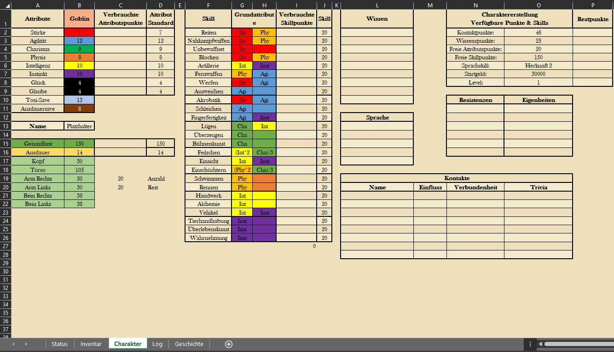

# (PART) Regeln und Items {.unnumbered}

# Character Creation

In Orbis Astea bietet eine Vielzahl von möglichen Geschichten, Charakteren und Möglichkeiten an.
Die wichtigste Frage für die Erstellung eines Charakters ist "Worauf hast du Lust?"

## Das Character Sheet

Orbis Astea ist eine Welt, in der die Character Creation, sowie das Tracken der Entwicklung eines Character in einem Excel Sheet festgehalten wird.
Dieses ist auf dieser Website unter "Download" in einer leeren Version herunterladbar.
Im Folgenden wird erklärt, wie dieses Character Sheet aufgebaut ist, welche Attribute und Skills in dieser Welt wie verstanden werden und daraus folgend, welche Aktionen mit welchem Skill möglich und nicht möglich sind.

Die Excel-Datei unterteilt sich in verschiedene Tabellenblätter, die in ihrer Funktionalität voneinander abhängig sind.
Daher sind manche Bereiche schreibgeschützt.

Wird ein Character erstellt, so sind alle Änderungen der Attribute und Skills im Tabellenblatt "CharacterSheet" vorzunehmen.



Das CharacterSheet ist so aufgebaut, dass in Spalte A und B die [Attribute](#Attribute) aufgeführt sind, die ein jeder Spieler in der Welt hat und weiterentwickeln kann.
Ein jedes Attribut ist mit einer Farbe hinterlegt (B2:11), diese sind dafür da vereinfacht zu veranschaulichen, welche Attribute für das Ausführen eines [Skills](#Skills) herangezogen werden.
Somit ist beispielsweise leicht erkennbar, dass eine Person, die einen Nahkämpfer spielen möchte, unbedingt auf Stärke (Strength im CharacterSheet) leveln sollte.

Ebenfalls findet man in Spalte A und B in Zeile 13, 15 und 16 den Namen des Character, sowie dessen [Gesundheit](#Gesundheit) und [Ausdauer](#Ausdauer).
Das Feld "Name" ist besonders für den DM wichtig, da dieser bei Ausführung der App angezeigt wird und der Zuordnung der Ergebnisse zu den Charakteren dient.
Dieser ist somit immer anzupassen.

#### Gesundheit {#Gesundheit}

Neben dem gesamten Gesundheit ist zu beachten, dass jeder körperteil seinen eigenen individuellen Healthpool hat (Spalte B, Zeile 17 bis 22).
Diese Körperteile können direkt mit einem called shot (CrossRef) anvisiert werden.
Sobald die Gesundheit eines Körperteils auf 0 reduziert wurde, ist es nicht mehr funktionsfähig und es tritt je nach Körperteil ein besonderer Effekt auf (CrossRef).
Spieler können ihre Gesundheit wiedererlangen, indem sie entweder einen Heiltrank konsumieren oder das Pause und Rast System (CrossRef) verwenden.

#### Ausdauer {#Ausdauer}

Neben der Gesundheit ist die Ausdauer eine weitere Ressource, auf die der Spieler besonders achten sollte, da die meisten Aktionen den gesamten Ausdauerpool verringern.
Sie verbraucht sich, wenn man die <font color="green">[Ausdauersaves](#Ausdauersave)</font> nicht schafft.
Besonders während des Kampfes, da hier die meisten Aktionen die gesamte Ausdauer eines Spielers verbrauchen, bevor er es überhaupt bemerkt.

Sobald man weniger als 4 Punkte Ausdauer übrig hat werden sämtliche Attribute außer Glück-, Glaube- und Ausdaueerwürfel halbiert.
Kurz erklärt bedeutet es, dass alle Aktionen eines Spielers deutlich schwächer werden und man im Kampf mehr Schaden erleidet und selbst weniger austeilt Wenn man kein Ausdauer mehr übrig hat und ein weiterer Ausdauersave missglückt fällt man in Ohmacht.
wie bei der Gesundheit ist es auch möglich Ausdauer wiederzuerlanden durch ein Ausdauertrank oder das Pause und Rast System (crosRef).

### Attribute {#Attribute}

Attribute spielen eine elementare Rolle, da sie jede Aktion beeinflussen, die ein Spieler ausführen kann.
Um dies besser zu verstehen, wird empfohlen, nachzuschauen, welche Skills mit welchem Attribut verbunden sind, da der Erfolg jeder einzelnen Aktion im Spiel durch die Skills eines Spielers erreicht wird.
entscheidet z.B.
ein Spieler sein Charisma Atrribut zu erhören, dann wird man hörere Werte bei die Social Skills erreichen.

Neben den Attributen, die man oft in anderen Spielen hat, gibt es auch noch Luck, Glaube, Würfel Toxi-Save und Würfel Ausdauersafe.
Würfel Toxi-Save und Würfel Ausdauersafe geben an wie viele Würfeln man zur verfügung hat wenn ein Trank konsumiert wird (Toxikologie-Save CrossRef) und bei einer Aktion, was Ausdauer benötigt (Ausauersave CrossRef).
Luck und Glaube wird häufig als Hilfswerkzeug für den DM verwendet, bei dem ein Save geworfen wird, um festzustellen, ob in einer bestimmten Situation eine positive eine negative Folge eintreten wird (Glaube/Glück Save CorssRef).

+---------------------------------+--------------------------------------------------------------------------------------------------------------------------------------------------------------------------------------------------------------------------------------------------------------------------------------------------------------------------------------------------------------------------------------------------------------------------------------------------------------------+-------------------+
| Name                            | Beschreibung                                                                                                                                                                                                                                                                                                                                                                                                                                                       | Beispielanwendung |
+=================================+====================================================================================================================================================================================================================================================================================================================================================================================================================================================================+===================+
| #### Stärke {#Stärke}           |                                                                                                                                                                                                                                                                                                                                                                                                                                                                    |                   |
+---------------------------------+--------------------------------------------------------------------------------------------------------------------------------------------------------------------------------------------------------------------------------------------------------------------------------------------------------------------------------------------------------------------------------------------------------------------------------------------------------------------+-------------------+
| #### Agilität {#Agilität}       |                                                                                                                                                                                                                                                                                                                                                                                                                                                                    |                   |
+---------------------------------+--------------------------------------------------------------------------------------------------------------------------------------------------------------------------------------------------------------------------------------------------------------------------------------------------------------------------------------------------------------------------------------------------------------------------------------------------------------------+-------------------+
| #### Charisma {#Charisma}       |                                                                                                                                                                                                                                                                                                                                                                                                                                                                    |                   |
+---------------------------------+--------------------------------------------------------------------------------------------------------------------------------------------------------------------------------------------------------------------------------------------------------------------------------------------------------------------------------------------------------------------------------------------------------------------------------------------------------------------+-------------------+
| #### Physical {#Physical}       |                                                                                                                                                                                                                                                                                                                                                                                                                                                                    |                   |
+---------------------------------+--------------------------------------------------------------------------------------------------------------------------------------------------------------------------------------------------------------------------------------------------------------------------------------------------------------------------------------------------------------------------------------------------------------------------------------------------------------------+-------------------+
| #### Intelligenz {#Intelligenz} |                                                                                                                                                                                                                                                                                                                                                                                                                                                                    |                   |
+---------------------------------+--------------------------------------------------------------------------------------------------------------------------------------------------------------------------------------------------------------------------------------------------------------------------------------------------------------------------------------------------------------------------------------------------------------------------------------------------------------------+-------------------+
| #### Instinkt {#Instinkt}       |                                                                                                                                                                                                                                                                                                                                                                                                                                                                    |                   |
+---------------------------------+--------------------------------------------------------------------------------------------------------------------------------------------------------------------------------------------------------------------------------------------------------------------------------------------------------------------------------------------------------------------------------------------------------------------------------------------------------------------+-------------------+
| #### Glück {#Glück}             |                                                                                                                                                                                                                                                                                                                                                                                                                                                                    |                   |
+---------------------------------+--------------------------------------------------------------------------------------------------------------------------------------------------------------------------------------------------------------------------------------------------------------------------------------------------------------------------------------------------------------------------------------------------------------------------------------------------------------------+-------------------+
| #### Glaube {#Glaube}           |                                                                                                                                                                                                                                                                                                                                                                                                                                                                    |                   |
+---------------------------------+--------------------------------------------------------------------------------------------------------------------------------------------------------------------------------------------------------------------------------------------------------------------------------------------------------------------------------------------------------------------------------------------------------------------------------------------------------------------+-------------------+
| #### Gesundheit {#gesundheit}   | Gesundheit (Health) für verschiedene Bodyparts                                                                                                                                                                                                                                                                                                                                                                                                                     |                   |
+---------------------------------+--------------------------------------------------------------------------------------------------------------------------------------------------------------------------------------------------------------------------------------------------------------------------------------------------------------------------------------------------------------------------------------------------------------------------------------------------------------------+-------------------+
| #### Ausdauer {#ausdauer}       | Ausdauer ist elementar für anstrengende Situationen. Sie verbraucht sich, wenn man die <font color="green">[Ausdauersaves](#Ausdauersave)</font> nicht schafft. Sobald man weniger als vier Punkte Ausdauer übrig hat werden sämtliche Attribute außer Glück und Glaube - und die Ausdauerwürfel - halbiert. Wenn man keinen Punkt Ausdauer mehr übrig hat und ein weiterer Ausdauersave missglückt fällt man in <font color="green">[Ohnmacht](#Ohnmacht)</font>. |                   |
+---------------------------------+--------------------------------------------------------------------------------------------------------------------------------------------------------------------------------------------------------------------------------------------------------------------------------------------------------------------------------------------------------------------------------------------------------------------------------------------------------------------+-------------------+
|                                 |                                                                                                                                                                                                                                                                                                                                                                                                                                                                    |                   |
+---------------------------------+--------------------------------------------------------------------------------------------------------------------------------------------------------------------------------------------------------------------------------------------------------------------------------------------------------------------------------------------------------------------------------------------------------------------------------------------------------------------+-------------------+

: Die Attribute des eines jeden Charakters.

### Skills {#Skills}

Um den Charakterbogen und die Charaktererstellung zu vereinfachen, sind die Skills in verschiedene Gruppen eingeteilt.

+--------------------------------------------+----------------------------------------------------------------------------------------------------------------------------------------+-------------------------------------------------------------------+
| Name                                       | Beschreibung                                                                                                                           | Beispielsaktionen                                                 |
+============================================+========================================================================================================================================+===================================================================+
|                                            | Combat Skills                                                                                                                          |                                                                   |
+--------------------------------------------+----------------------------------------------------------------------------------------------------------------------------------------+-------------------------------------------------------------------+
| #### Reiten {#Reiten}                      | ermöglicht den [Kampf vom Reittier](#KampfVomReittier) und das Reiten von [Tieren](#AnimalHandling).                                   |                                                                   |
+--------------------------------------------+----------------------------------------------------------------------------------------------------------------------------------------+-------------------------------------------------------------------+
| #### Bewaffneter Nahkampf / Armed {#Armed} | beeinflusst den potenziellen Schaden von Kurz-, Groß- und Stangenwaffen.                                                               |                                                                   |
+--------------------------------------------+----------------------------------------------------------------------------------------------------------------------------------------+-------------------------------------------------------------------+
| #### Unbewaffneter Nahkampf / Unarmed      | ermöglicht all jene Kämpfe, die zum [Kampf ohne Waffen](#UnbewaffneterKampf) gehören. Zudem wird Armdrücken über diesen Skill gerollt. | Der Gewinner des Armdrückens bekommt Recht im Streitfall.         |
+--------------------------------------------+----------------------------------------------------------------------------------------------------------------------------------------+-------------------------------------------------------------------+
| #### Blocken                               | beeinflusst wie viel Schaden eines Angriffs durch eine [Abwehrhandlung](#BlockenAusweichen) geblockt wird.                             |                                                                   |
+--------------------------------------------+----------------------------------------------------------------------------------------------------------------------------------------+-------------------------------------------------------------------+
| #### Artillerie {#Artillerie}              | beeinflusst wie effektiv Artillerie, wie z.B. ein Skorpion oder Balliste, eingesetzt werden kann.                                      | Ein PC meldet sich für das Abfeuern der Balliste.                 |
+--------------------------------------------+----------------------------------------------------------------------------------------------------------------------------------------+-------------------------------------------------------------------+
| #### Fernkampf / Ranged {#Ranged}          | ermöglicht den Schaden mit [Fernwaffen](#Fernwaffen).                                                                                  | Ein PC greift einen Gegner mit der Armbrust an.                   |
+--------------------------------------------+----------------------------------------------------------------------------------------------------------------------------------------+-------------------------------------------------------------------+
| #### Werfen / Throwing {#Werfen}           | beeinflusst den Schaden von [Wurfwaffen](#Wurfwaffen).                                                                                 | Ein PC möchte ein Monster mit einer Bola bewegungsunfähig machen. |
+--------------------------------------------+----------------------------------------------------------------------------------------------------------------------------------------+-------------------------------------------------------------------+
| #### Ausweichen / Dodge                    | beeinflusst wie viel Schaden einem Angriff durch eine [Abwehrhandlung](#BlockenAusweichen) ausgewichen werden kann.                    | Ein PC versucht dem Angriff eines Bogenschützen auszuweichen.     |
+--------------------------------------------+----------------------------------------------------------------------------------------------------------------------------------------+-------------------------------------------------------------------+
| #### Acrobatics {#Acrobatics}              | ermöglicht das Hochklettern von Gebäuden, ebenso wie andere akrobatische Handlungen.                                                   |                                                                   |
+--------------------------------------------+----------------------------------------------------------------------------------------------------------------------------------------+-------------------------------------------------------------------+
| #### Schleichen {#Schleichen}              |                                                                                                                                        |                                                                   |
+--------------------------------------------+----------------------------------------------------------------------------------------------------------------------------------------+-------------------------------------------------------------------+
| #### Fingerfertigkeit {#Fingerfertigkeit}  |                                                                                                                                        |                                                                   |
+--------------------------------------------+----------------------------------------------------------------------------------------------------------------------------------------+-------------------------------------------------------------------+
| #### Lying {#Lying}                        |                                                                                                                                        |                                                                   |
+--------------------------------------------+----------------------------------------------------------------------------------------------------------------------------------------+-------------------------------------------------------------------+
| #### Persuation {#Persuation}              |                                                                                                                                        |                                                                   |
+--------------------------------------------+----------------------------------------------------------------------------------------------------------------------------------------+-------------------------------------------------------------------+
| #### Performance {#Performance}            |                                                                                                                                        |                                                                   |
+--------------------------------------------+----------------------------------------------------------------------------------------------------------------------------------------+-------------------------------------------------------------------+
| #### Feilschen {#Feilschen}                |                                                                                                                                        |                                                                   |
+--------------------------------------------+----------------------------------------------------------------------------------------------------------------------------------------+-------------------------------------------------------------------+
| #### Insight {#Insight}                    |                                                                                                                                        |                                                                   |
+--------------------------------------------+----------------------------------------------------------------------------------------------------------------------------------------+-------------------------------------------------------------------+
| #### Intimidation {#Intimidation}          |                                                                                                                                        |                                                                   |
+--------------------------------------------+----------------------------------------------------------------------------------------------------------------------------------------+-------------------------------------------------------------------+
| #### Swimming {#Swimming}                  |                                                                                                                                        |                                                                   |
+--------------------------------------------+----------------------------------------------------------------------------------------------------------------------------------------+-------------------------------------------------------------------+
| #### Running {#Running}                    |                                                                                                                                        |                                                                   |
+--------------------------------------------+----------------------------------------------------------------------------------------------------------------------------------------+-------------------------------------------------------------------+
| #### Handwerk {#Handwerk}                  |                                                                                                                                        |                                                                   |
+--------------------------------------------+----------------------------------------------------------------------------------------------------------------------------------------+-------------------------------------------------------------------+
| #### Alchemie {#Alchemie}                  |                                                                                                                                        |                                                                   |
+--------------------------------------------+----------------------------------------------------------------------------------------------------------------------------------------+-------------------------------------------------------------------+
| #### Vehicles {#Vehicles}                  |                                                                                                                                        |                                                                   |
+--------------------------------------------+----------------------------------------------------------------------------------------------------------------------------------------+-------------------------------------------------------------------+
| #### Animal Handling                       |                                                                                                                                        |                                                                   |
+--------------------------------------------+----------------------------------------------------------------------------------------------------------------------------------------+-------------------------------------------------------------------+
| #### Survival {#Survival}                  |                                                                                                                                        |                                                                   |
+--------------------------------------------+----------------------------------------------------------------------------------------------------------------------------------------+-------------------------------------------------------------------+
| #### Perception {#Perception}              |                                                                                                                                        |                                                                   |
+--------------------------------------------+----------------------------------------------------------------------------------------------------------------------------------------+-------------------------------------------------------------------+

: Diese Skills kann ein jeder Charakter beherrschen.

## Die Charaktererstellung

Als erstes ist es wichtig ungefähr eine Ahnung zu haben was und wen man spielen will.
Obwohl sich das vollständige Bild eines Charakters erst am Schluss der Erstellung ergibt ist es dennoch wichtig, dass man weiß wohin man will und was einem Spaß macht.

Oben im Download-Menü liegt ein Vorlage-File, mit dem die Character-Creation in Excel gut und Schnell vorgenommen werden kann.
Das "Status"-Blatt ist besonders wichtig, da es einen schnellen Überblick verleiht und man die größten Teile jeder Session nur über das Status-Blatt Spielen kann.
Hier bitte die Attribute und Skills nicht direkt verändern, sie müssen im Arbeitsblatt "Character Sheet" angepasst werden und werden dann mit Referenzen automatisch in Status aktualisisert.
Das ganze Sheet arbeitet allgemein viel mit Referenzen, daher gut darauf aufpassen was man überschreibt, aber die Logik dahinter wird man schnell verstehen.
Das Sheet ist für einen Beispielcharakter aufgebaut, seine Werte und sein Inventar ist natürlich nach und nach mit den eigenen zu ersetzen.

Auch wichtig ist zu wissen welchen Defensivskill man verwenden will, <font color="green">[Blocken oder Ausweichen](#BlockenAusweichen)</font>, da diese Skillgruppe für Abenteurer unabhängig von der Spielweise eine der wichtigsten ist.

### Rasse und Startwerte

Als erstes wählt man die Rasse aus, die man Spielen möchte, am wichtigsten hierbei ist, dass verschiedene Rassen verschiednene Werte und Attribute haben mit denen man arbeiten kann.
Des weiteren haben manche Rassen gewisse Fähigkeiten - wie zum Beispiel die THermosicht der Goblins - die große Vorteile mit sich bringen können.

mit diesen Base-Stats fängt man an:

<small> <small>

+----------------------+------------+------------+------------+-------------+------------+--------------+--------------+
| Wert                 | Mensch     | Elf        | Zwerg      | Ork         | Animalus   | Goblin       | Halbling     |
+:====================:+:==========:+:==========:+:==========:+:===========:+:==========:+:============:+:============:+
| Strength             | 10         | 8          | 10         | 13          | 12         | 7            | 7            |
+----------------------+------------+------------+------------+-------------+------------+--------------+--------------+
| Agility              | 10         | 13         | 8          | 10          | 12         | 12           | 12           |
+----------------------+------------+------------+------------+-------------+------------+--------------+--------------+
| Charisma             | 10         | 11         | 8          | 6           | 8          | 9            | 13           |
+----------------------+------------+------------+------------+-------------+------------+--------------+--------------+
| Physical             | 10         | 9          | 10         | 12          | 11         | 8            | 9            |
+----------------------+------------+------------+------------+-------------+------------+--------------+--------------+
| Intelligence         | 10         | 10         | 14         | 8         | 9          | 10           | 10           |
+----------------------+------------+------------+------------+-------------+------------+--------------+--------------+
| Instinct             | 10         | 11         | 10         | 10          | 10         | 10           | 10           |
+----------------------+------------+------------+------------+-------------+------------+--------------+--------------+
| Luck                 | 4          | 4          | 4          | 4           | 4          | 4            | 4            |
+----------------------+------------+------------+------------+-------------+------------+--------------+--------------+
| Glaube               | 4          | 4          | 4          | 4           | 4          | 4            | 4            |
+----------------------+------------+------------+------------+-------------+------------+--------------+--------------+
| Health               | 200        | 150        | 200        | 250         | 250        | 150          | 150          |
+----------------------+------------+------------+------------+-------------+------------+--------------+--------------+
| Ausdauer             | 12         | 16         | 10         | 12          | 14         | 14           | 10           |
+----------------------+------------+------------+------------+-------------+------------+--------------+--------------+
| Startgeld            | 30000      | 27000      | 66000      | 21000       | 24000      | 30000        | 36000        |
+----------------------+------------+------------+------------+-------------+------------+--------------+--------------+
| Rassenfähigkeiten    |            | Nachtsicht | Geldgeil   | Kurzsichtig | Mutation   | Thermo-sicht | Harter Magen |
+----------------------+------------+------------+------------+-------------+------------+--------------+--------------+
| Freie Attributpunkte | 30         | 21         | 15         | 27          | 17         | 20           | 20           |
+----------------------+------------+------------+------------+-------------+------------+--------------+--------------+
| Freie Skillpunkte    | 150        | 150        | 150        | 150         | 150        | 150          | 150          |
+----------------------+------------+------------+------------+-------------+------------+--------------+--------------+
| Sprachen             | Herkunft 2 | Herkunft 2 | Herkunft 2 | Herkunft 2  | Herkunft 2 | Herkunft 2   | Herkunft 2   |
+----------------------+------------+------------+------------+-------------+------------+--------------+--------------+

</small> </small>

#### Rassenfähigkeiten {.unnumbered}

-   Nachtsicht: Elfen können im Dunklen sehen.
-   Geldgeil: Zwerge bekommen bei Intimidation-Proben +3 Instinct wenn es um Geld geht.
-   Kurzsichtig: Die Kurzsichtigkeit von Orks macht es ihnen unmöglich Fernkampfwaffen zu verwenden
-   Thermo-sicht: Goblins sehen die Wärmestruktur von Körpern. Normalerweise ist dies ein riesenhafter Vorteil, da sie sowohl im Dunklen als auch durch Wände Bedrohungen ausmachen können. Manche gefährliche Monster haben aber keine Wärmesignatur.
-   Harter Magen: Halblinge werden aufgrund Generationen von Drogenmissbrauch eine höhere Resistenz gegen Vergiftung durch Tränke.
-   Mutation: Die Mutation ist verbunden mit dem <font color="green">[Übergangsritual der Animali](#Mutation)</font> sie übernehmen physiologische Marker des ersten Monsters, das sie erjagt haben. Davon abhängig ob der Charakter ein Jungtier oder bereits mutiert ist steht die Mutation noch aus, oder er hat mehrere individuelle Perks und schwächen, die zur erjagten Beute passen. Im Falle eines Jungtiers wird die Mutation noch ausgespielt.

### Level und Skillverbesserungen

Folgende Punkte gibt es bei Level-ups oder Character-Creation zu vergeben:

-   Attributpunkte - hiermit verbessert man Attribute, die Health und die Ausdauer
-   Skillpunkte - hiermit verbessert man Skills

Um die Skills und Attribute zu verbessern muss eine gewisse Menge an Attribut- und Skillpunkten vergeben werden.
Höhere Werte kosten Verhältnissmäßig mehr.
Jeder Wert kann Zurückentwickelt werden, bringt aber nur einen Skill/Attributpunkt pro Stufe.
Wichtig ist allerdings, dass sowohl Luck als auch Glaube nicht aufgewertet werden können.

Bei einem Level up bekommt man:

-   drei Attributpunkte
-   Skillpunkte abhängig von der Intelligenz des Charakters nach folgenden Schema:

| Intelligenz | Skillpunkte |
|:-----------:|:-----------:|
|      6      |     12      |
|      7      |     14      |
|      8      |     16      |
|      9      |     18      |
|     10      |     20      |
|     11      |     22      |
|     12      |     24      |
|     13      |     26      |
|     14      |     28      |
|     15      |     30      |
|     16      |     32      |
|     17      |     34      |
|     18      |     36      |
|     19      |     38      |
|     20      |     40      |

Bei der Character-Creation sind Attribute schon mit den Kosten nach dem untenstehenden Schema zu bezahlen.
Skillpunkte können - im Gegensatz dazu - bei der Creation einfach addiert werden und müssen erst bei Level-ups nach dem unten stehenden Schema bezahlt werden.

Sowohl Attribut- als auch Skillpunkte verfallen nicht wenn man im Level aufsteigt, man kann also für spätere Stufen "sparen".
Des weiteren kann man einen Attributpunkt einmal pro Level up zu zwei Skillpunkten umwandeln - dies gehr nicht in die andere Richtung.

Achrung bei der Charakter Creation dürfen Attribute maximal 15 betragen, Skills maximal 45.

#### Kosten Attributverbesserung {.unnumbered}

| Attributes | Kosten/einheit |
|:----------:|:--------------:|
|    0-10    |       1        |
|   10-12    |       2        |
|   12-14    |       4        |
|   14-16    |       6        |
|   16-18    |       8        |
|   18-20    |       10       |

#### Kosten Health-verbesserung {.unnumbered}

| Health  | Kosten/25 einheiten |
|:-------:|:-------------------:|
| 150-200 |         0,5         |
| 200-300 |          1          |
| 300-400 |          2          |
| 400-500 |          3          |
| 500-600 |          4          |
| 600-700 |          5          |

Achtung: Gesundheit wird immer in 25er Chunks erhöht.

#### Kosten Skillverbesserung {.unnumbered}

| Skills | Kosten/einheit |
|:------:|:--------------:|
| 0 -20  |       1        |
| 20-40  |       2        |
| 40-60  |       4        |
| 60-80  |       6        |
| 80-100 |       8        |

Die Skills und ihre Wirkungen sind [hier]() beschrieben.

Neben der individuellen Skill Verbesserung haben die Spieler auch die Möglichkeit, eine Skill Gruppe auszuwählen.
Dies hat den Vorteil, dass alle Skills in der ausgewählten Gruppe gemeinsam zu einem durchschnittlich günstigeren Preis verbessert werden, als wenn sie einzeln aufgewertet werden würden.
Die Gruppen haben unterschiedliche Skills, diejeweils zum Berufsbild passen.
Außerdem haben die Skill Gruppen auch unterschiedliche Kosten, die an die Menge und Stärke der Skills angepasst sind.
Investiert man in eine Skillgruppe, kann dies nur bis Level 40 erfolgen.
Entscheidet sich ein Spieler zum Beispiel dafür, die Ritter Skillgruppe (wobei Armed enthalten ist) bis Level 30 zu verbessern, kann man auch noch weitere Punkte in Söldner investieren (hier ist Armed auch inkludiert) bis Armed einen Wert von 40 erreicht.
Investiert man mehr Punkte in Söldner, bleibt Armed auf 40, die anderen Skills nehmen noch zu.

Eine Übersicht über die möglichen Skillgruppen findet sich hier:

```{r}
dfskillgruppe=read_xlsx("Container/Data/AllaroundDataStorage.xlsx", sheet="Gruppenskills")

dfskillgruppe = dfskillgruppe %>%
  unite("Skills",Skill1,Skill2, Skill3, Skill4,
        Skill5, Skill6, Skill7,Skill8,Skill9,Skill10, sep=", ", na.rm = T) %>% 
  relocate(Name,Skills)

reactable(dfskillgruppe,
          columns = list(
            
            Skills = colDef(
              filterable = TRUE,
              # Filter by case-sensitive text match
              filterMethod = JS("function(rows, columnId, filterValue) {
                                return rows.filter(function(row) {
                                return row.values[columnId].indexOf(filterValue) !== -1
                                })}")
            ),
            Name= colDef(
              filterable = TRUE),
            Kosten = colDef(format = colFormat(suffix = " Skillpunkte"))
          ), bordered = T, highlight = T, showPageSizeOptions = TRUE,
          pageSizeOptions = c(5,10, 20, 50),
          defaultPageSize = 10,  paginationType = "jump",
          theme= overallThemeReactable)
```

#### Kosten Ausdauerverbesserung {.unnumbered}

Zwei Punkte Ausdauer kann man auf jedem Ausdauerlevel für einen Attributpunkt kaufen

### Wissen und Sprachen {#Wissensskills}

Die Welt von Orbis Astea ist gekennzeichnet von Komplexität.
Hierbei haben, so wie in der realen Welt, einzelne Menschen nicht das gesammelte Wissen der Welt.
Besonders schlaue und erfahrene Charaktere haben natürlich auch den einen weiteren geistigen Horizont um mehr ihrer Umwelt zu verstehen.

Um bei der Erstellung eines Charakters auch die Fähigkeiten im Bereich "Wissen der Welt" und Sprachen zu berücksichtigen wird diese durch die Startattribute Intelligenz und Instinkt errechnet.

Die Anzahl verfügbarer Punkte errechnet sich folgendermaßen:

$$Intelligenz \cdot 4 + Instinkt$$

**Beispiel Berechnung der Wissens- und Sprachpunkte:**

Standardmensch: 10 Intelligenz & 10 Instinkt

Berechnung der Verfügbaren Punkte: $10 \cdot 4 + 10 = 50$

Folglich hat der Ersteller dieses Charakters 50 Punkte zur Verfügung.

Diese können nun für Wissens- und/oder Sprachenstufen vergeben werden.

+--------------------------------------------+----------------+----------------------------------+--------------------------------------------+
| Niveau/Stufe der Sprache oder des Wissens: | Kosten Punkte: | Wissensniveau                    | Sprachniveau                               |
+:==========================================:+:==============:+:================================:+:==========================================:+
| Stufe 0                                    | 0              | Kein Wissen im Bereich           | Keine Sprachfähigkeit                      |
+--------------------------------------------+----------------+----------------------------------+--------------------------------------------+
| Stufe 1                                    | 5              | Grundwissen                      | sehr einfache Gespräche möglich            |
+--------------------------------------------+----------------+----------------------------------+--------------------------------------------+
| Stufe 2                                    | 15             | Belesen & Erfahren im Fachgebiet | Verständigung umständlich aber vollständig |
+--------------------------------------------+----------------+----------------------------------+--------------------------------------------+
| Stufe 3                                    | 25             | Ausgewiesener Fachmensch         | Gesetzestext- und Muttersprachenniveau     |
+--------------------------------------------+----------------+----------------------------------+--------------------------------------------+

Diese Werte sind absolute - keine kummulativen Kosten.\

+----------------------------------+----------------------------------------------------------------------------------------------------+
| Auswahloptionen an Wissenskills: | Beschreibung                                                                                       |
+==================================+====================================================================================================+
| Kriegstaktiken                   | Flankierungmanöver, Guerillakrieg, Sabotage, Formationen im Kampf                                  |
+----------------------------------+----------------------------------------------------------------------------------------------------+
| Medizin                          | Erkennen und Behandlen von Krankheiten                                                             |
+----------------------------------+----------------------------------------------------------------------------------------------------+
| Belebte Welt                     | Wissen über die natürliche Tier- und Pflanzenwelt                                                  |
+----------------------------------+----------------------------------------------------------------------------------------------------+
| Religion                         | Riten, Bräuche, Traditionen etc.                                                                   |
+----------------------------------+----------------------------------------------------------------------------------------------------+
| Monster                          | Schwächen und Stärken der Monster und Abscheulichkeiten                                            |
+----------------------------------+----------------------------------------------------------------------------------------------------+
| Geschichte                       | Wissen über wie sich der rote Faden der Ereignisse, vermeintlich durch die Welt zieht              |
+----------------------------------+----------------------------------------------------------------------------------------------------+
| Etiquette                        | Der soziale Kitt jeder Gesellschaft - Gesten, Bräuche, Traditionen                                 |
+----------------------------------+----------------------------------------------------------------------------------------------------+
| Landwirtschaft                   | Unterjochung der Natur um dieser Nahrung oder Materialien abzugewinnen                             |
+----------------------------------+----------------------------------------------------------------------------------------------------+
| Wirtschaft                       | Wissen wer was braucht und wie man soetwas bereitstellt                                            |
+----------------------------------+----------------------------------------------------------------------------------------------------+
| Recht                            | Hilft dem Spieler den Mächtigen in Orbis Astea (nicht) auf die Füße zu treten.                     |
+----------------------------------+----------------------------------------------------------------------------------------------------+
| Schwarzmarkt                     | Elfengesichter, Drogen und Sprengmittel bekommt man nur wenn man Jemanden kennt der Jemanden kennt |
+----------------------------------+----------------------------------------------------------------------------------------------------+
| Seekunde                         | Leben auf dem offenen Meer ist erst möglich wenn man die See kennt                                 |
+----------------------------------+----------------------------------------------------------------------------------------------------+
| Kartografie                      | Wissen wo was ist und wer wo sein könnte                                                           |
+----------------------------------+----------------------------------------------------------------------------------------------------+
| Schriftlehre                     | Stufe 1: Lesen/Schreiben möglich                                                                   |
|                                  |                                                                                                    |
|                                  | Stufe 2: Lesen komplexer Literatur                                                                 |
|                                  |                                                                                                    |
|                                  | Stufe 3: Ermöglicht das Fälschen von Dokumenten                                                    |
+----------------------------------+----------------------------------------------------------------------------------------------------+

| Auswahloptionen Sprachen:                     |
|-----------------------------------------------|
| Gob (Sprache der Goblins)                     |
| Orkisch                                       |
| Kaiserlich (Kaiserreich, Yondalla und Eldria) |
| Rahkari                                       |
| Zwergisch                                     |
| Elfisch                                       |

**Beispiel mit einem normalen Charakter mit 50 Punkten:**

-   15 Punkte für die Sprache Rahkari auf Stufe 2
-   15 Punkte für Medizin auf Stufe 2
-   5 Punkte für Kartographie Stufe 1 der Gebiete der Rahkari Fraktion
-   15 Punkte für Religionskenntnisse Stufe 2 der Gebiete der Rahkari Fraktion

Wichtig ist es für DMs die Skills mit eigenem Gefühl einzubringen was realistisch ist.

Auch nach der Character-Creation kann man seine Wissensskills verbessern.
Dies geht über das <font color="green">[sogenannte Studieren](#Studieren)</font>.

### Kontakte

Kontakte sind ein weiteres Stück der Welt - sozusagen das soziale Kapital des Spielers.
Sie helfen an Aufträge, Informationen und andere Dinge zu kommen, für die Vitamin B nun mal nützlich ist oder sein könnte.
Die Punkte, die man für Kontakte vergeben kann berechnen sich aus der Summe: $$(4 \cdot Charisma) + Instinct.$$

Diese Punkte können dann auf die Affection, die ein Kontakt gegenüber eines Charakter empfindet, und die Power, also den sozialen Stand und Einfluss, eines Kontaktes verteilt werden.

Die Kosten beschreiben, wie viele Punkte ein Spieler ausgeben muss, um sich einen Kontakt eintragen zu können.
Diese stellen die Summe der jeweiligen Stufen dar.
Möchte man eine Liebesbeziehung zu einer Person aus dem Hochadel führen, so sind insgesamt 60 Punkte zu entrichten.
30 für die Stufe 7 Power und nochmal 30 Punkte für die Stufe 7 Affection.

Beide Parameter können auf einer Skala von jeweils 1 - 10 vergeben werden.
Die inhaltliche Bedeutung der jeweiligen Skalen-Stufe zeigt die nachfolgende Tabelle:

+-----------+-----------------------------------------------------+------------------------+-----------+
| Stufe     | Power                                               | Affection              | Kosten    |
+:=========:+:===================================================:+:======================:+:=========:+
| 1         | Unterschicht                                        | Bekanntschaft          | 2         |
+-----------+-----------------------------------------------------+------------------------+-----------+
| 2         | Normale Person                                      | Gute Bekanntschaft     | 4         |
+-----------+-----------------------------------------------------+------------------------+-----------+
| 3         | Sozial gut vernetzte Person                         | Kollegen               | 7         |
+-----------+-----------------------------------------------------+------------------------+-----------+
| 4         | Stadtwache                                          | Gleicher Freundeskreis | 10        |
+-----------+-----------------------------------------------------+------------------------+-----------+
| 5         | Hohes Bürgertum                                     | Freunde                | 15        |
+-----------+-----------------------------------------------------+------------------------+-----------+
| 6         | Niederer Adel                                       | Familienmitglied       | 20        |
+-----------+-----------------------------------------------------+------------------------+-----------+
| 7         | Adel/Militärkommandant/Unterweltboss/Hoher Beamter  | Enge Freunde           | 25        |
+-----------+-----------------------------------------------------+------------------------+-----------+
| 8         | Hochadel                                            | Liebesbeziehung        | 30        |
+-----------+-----------------------------------------------------+------------------------+-----------+
| 9         | Höchste Beamte/Minister/Heerführer                  | Beste Freunde          | 40        |
+-----------+-----------------------------------------------------+------------------------+-----------+
| 10        | Kaiser/Hohepriester/Fürst eines Staatenschiffs/etc. | Wie das eigene Kind    | 45        |
+-----------+-----------------------------------------------------+------------------------+-----------+

: Kontakte und was sie ausmacht.

### Der Bewegungsradius {#BewRadius}

Der Bewegungsradius stellt die Strecke dar, die ein Charakter in einer Runde mit dem Movement zurücklegen kann.
Sie beträgt bei Menschen zwei Meter.
Bei einem Running check wird der Value mal dem Bewegungsradius in einer Runde umgesetzt.
Der Bewegungsradius von Tieren oder Monstern kann deutlich höher sein.

### Das Inventar

Das Inventar ist der kummulierte Besitz eines jeden Abenteurer, seine Habseligkeiten und seine wichtigen Gegenstände sind gut aufgeführt.
Ein richtig geführtes Inventar ist Grundlage für ein schnelles und reibungslos ablaufendes Spiel.

#### Rucksack

Alle Gegenstände, die nicht sofort verfügbar sind, sind im Rucksack.
Ein durchschnittlich starker Mensch (Stärke 10) kann dabei 40kg tragen.
Prinzipiell nimmt man den Durchschnitt aus Stärke und Physical mal 4 um die Traglast zu determinieren.
Diese wird als Rucksackgröße benutzt.

Ein Objekt während einem Kampf aus dem Rucksack holen kostet die Main Action, sollte man sich allerdings nicht im Kampf/unter Zeitdruck befinden kann man problemlos Objekte aus dem Rucksack rauskramen.

#### Holster

Da man Waffen in gefährlichen Settings schnell zur Hand haben will - und diese nicht erstmal ewig aus dem Rucksack kramen will wurden Holster erfunden.
Diese Kosten pro Holster bei der Erstellung eines Charakters 1250 Reiks und man kann maximal 5 davon haben.
In verschiedene Holster passen nur bestimmte Waffentypen.
Mehr dazu <font color="green">[hier](#Holster1)</font>.

#### Tranktasche

Auch Tränke will man im Kampf schnellstmöglich verfügbar haben.
Dafür wurde die Tranktasche entwickelt.
Für viele Soldaten und Abenteurer ist die Tranktasche nicht wegzudenken - Bomben, Power ups und Heilungen einfach mit einer single Action zu verwenden ist auch ein gutes Argument, denn genau dies erlaubt die Tranktasche.

Es gibt Tranktaschen mit verschiedenen Mengen an Slots:

| Tranktasche | Preis | Slots |
|:-----------:|:-----:|:-----:|
|    Klein    | 2500  |   2   |
|   Normal    | 15000 |   4   |
|    Groß     | 45000 |   6   |

### Ausrüstung

Nach der Charakter-Creation ist die richtige Startausrüstung von Bedeutung.
Was ein Abenteurer unbedingt haben sollte ist eine Waffe, eine Tranktasche und möglicherweise Rüstung, da ohne eine solche die Überlebenschancen deutlich kleiner werden.

Ausrüstung zum kaufen findet ihr hier:

-   Hier findet ihr <font color="green">[Waffen](#Waffen)</font>
-   Hier findet ihr <font color="green">[Rüstung](#Rüstung)</font>
-   Hier findet ihr <font color="green">[Reittiere](#Mounts)</font>
-   Hier findet ihr <font color="green">[Übrige Gegenstände](#AndereGegenstände)</font>
-   Hier findet ihr <font color="green">[Tränke](#Tränke)</font>

Denkt beim Einkaufen aber daran, dass es sinnvoll sein kann sich etwas Geld überzuhalten.
Schließlich bringt das Leben in Orbis Aestea <font color="green">[Lebenshaltungskosten](#Lebenshaltungskosten)</font> mit sich, und auch für Quests ist es immer sinnvoll etwas Geld übrig zu haben.

### Die Rolle des Gewichts

Gewicht Spielt natürlich eine Große Rolle - kein Charakter kann mehr mit sich tragen als seine eigene Tragfähigkeit.
Diese berechnet sich anhand der Stärke mal vier.

#### Das Aktive Gewicht {#AktivesGewicht}

Das Aktive Gewicht ist das Gewicht der Dinge, die am Körper getragen werden.
Das besteht aus:

-   Waffen in Holstern
-   Rüstung
-   Schild
-   Wurfwaffen in Holstern

Die Summe des Gewichts dieser Items ist das Aktive Gewicht.
Es wird durch 5 geteilt und danach vom Physical-Wert abgezogen um die <font color="green">[Ausdauerwürfel für den Ausdauersave](#Ausdauersave)</font> zu erhalten.

##### Die Belastungsstufen und ihre Debuffs {#Belastungsstufe}

| Belastung      | Aktives Gewicht | Schleichen | Acrobatics <br>und running |  Aufstehen  |     Reisen     |
|----------------|:---------------:|:----------:|:--------------------------:|:-----------:|:--------------:|
| leicht Beladen |  Gewicht \< 18  |     --     |             --             |     --      |       --       |
| mittel Beladen |  Gewicht \< 30  |  -2 Dice   |          -1 Dice           |     --      | -1 Phy / Länge |
| Schwer Beladen |  Gewicht \> 30  |  -3 Dice   |          -2 Dice           | main Action | -1 Phy / Länge |

#### Das passive Gewicht

Das Passive Gewicht ist die Summe des Gewichts der Items die sich im Rucksack befinden.
Zusammen mit dem Aktiven Gewicht darf es die Traglast nicht überschreiten.
Ansonsten gibt es keine spezielle Relevanz

##### Zusätzliches Gewicht {.unnumbered}

Manchmal trägt der Spieler zusätzliches Gewicht - bspw.
eine ohnmächtige Person.
Dies kann mit verchiedenen Nachteilen kommen, welche der DM festlegt.
Ein Beispiel ist die Unfähigkeit auszuweichen oder zu rennen.

### Wo nachschauen?

## Im Spiel

Einige Werte verändern sich dynamisch im Spiel.
Die wichtigen sind hier aufgeführt und erklärt.

### Modifikatoren

Bestimmte Effekte (Tränke, Musik, Kälte, etc.) geben positive oder negative Modifikatoren, die nicht, wie externe Effekte (Schlechte Sicht), die Thresholds beeinflussen, sondern die Werte eines Characters ändern.
Sie sind mit + oder - in der Spalte "Modifyer" rechts vom jeweiligen Skill einzutragen.

### Glaube {#glaube}

> "Wenn man die Götter erzürnt richten sie einen, wenn man ihnen huldigt belohnen sie einen"
>
> --- Altes Sprichwort

Glaube ist an sich kein Allein fungierendes Attribut, da Proben so gut wie immer zusammen mit Glück geworfen werden.
Das besondere am Glauben ist allerdings dass man ihn mit verschiedenen Aktionen beeinflussen kann.
Wenn man sich im Einklang zu den eigenen Göttern verhält, Epische Taten vollbringt, oder eine aandere Aktion macht bei der der DM denkt man hätte es verdient, steigt der Glaube-Wert.
Bei gegenteiligem Verhalten sinkt der Glaube wert.
Dieser Wert stellt für der DM eine Möglichkeit dar gutes Roleplay zu belohnen.

Dieser Wert soll die Göttliche Gunst in entscheidenden Situationen darstellen.

### Glück {#glück}

Ebenso wie bei Glaube kann auch das Glück sinken und steigen.
Wenn ein Charakter beispielsweise Aktionen bringt die gegen seine eigenen Werte gehen, sinkt der Glückswert durch Ansage des DM's.
Bei Aktionen auf die ein Charakter besonders Stolz sein kann steigt dieser wieder.
Die stärke von Senkung/Steigung liegt am DM.

Dieser Wert soll das persönliche Wachstum und Wohlbefinden wiederspiegeln.

### Sanity

Sanity bezeichnet die Rate, in der der Charakter noch Zurechnungsfähig ist.
Sie geht vom Maximalwert 100 bis zum Wert Null.
Sanity sinkt jedes Mal, wenn man mit Blutgöttern in Kontakt kommt, Blutgöttern dient oder eine Blutgottwaffe verwendet.
Solange die Sanity über 20 ist gibt es noch nichts zu befürchten.
Sinkt die Sanity unter 20, hat der DM einmal pro Session die Möglichkeit einen Glück/Glaube-Save zu machen und - falls dieser gefailt wird - übernimmt der DM kurzzeitig die Kontrolle über die Figur, die daraufhin Wahrscheinlich horrende Taten vollbringt.
Sinkt die Sanity unter 10, hat der DM zwei mal pro Session die Chance auf die Übername des Charakters.
Sollte die Sanity allerdings auf Null sinken, verliert der Spieler dauerhaft die Rolle über den Charakter - und der Charakter fällt langfristig dem blutigen Treiben eines <font color="green">[bösen Gottes](#Blutkult)</font> anheim.

Bei Interaktionen entscheidet der DM um wie viel die Sanity sinkt.

#### Verfluchte Artefakte

Es gibt ein paar sehr starke Artefakte (allesamt Tier 5), die ihren starken Effekt damit "bezahlen lassen" das man bei jeder Verwendung Sanity verliert.
Dies sind meistens Blutkultrelikte und können von Waffen über Amulette mit gewissen Wirkungen alles sein was einem fähigen DM einfällt.

### Lagern und Ruhen

Es gibt immer die Möglichkeit eine Pause einzulegen und ein Lager aufzuschlagen.
Dabei Regenerieren sich Leben und Ausdauer zum Teil.
Pro Nacht stellt man 5 Punkte Ausdauer wieder her, oder 100 Punkte leben.
Allerdings stellt ein Lager auch ein gutes Ziel für mögliche Gegner dar.

### Längerfristige Verletzungen

Achtung, hier wird entgegen der Konventionen von Orbis Astera ab- statt aufgerundet.

#### Verstümmelung {.unnumbered}

Eine Verstümmelung bedeutet, dass von einem Körperteil nur noch 20% der Gesundheit übrig ist.
In diesem Falle ist es ratsam so schnell wie möglich Ärztliche Hilfe aufzusuchen, um eine Verkrüppelung zu vermeiden.
Der Verstümmelte bekommt einen Attribut-Debuff von 50% auf alle Checks die den verstümmelten Körperteil beinhalten.
Außerdem muss er einen Willpower-Save bestehen, ansonsten fällt er in <font color="green">[Ohnmacht](#Ohnmacht)</font>.

Ein Charakter der einen Survival-Wert von 50 oder höher aufweist kann einen Verband machen, der vorübergehend den "verkrüppelt" Status-Debuff auf 20% verringert.
Dies kann der Charakter auch selbst machen wenn sein Survival hoch genug ist und er den Check um nciht in Ohnmacht zu fallen überstanden hat.
Der Threshold liegt bei 5.

#### Verkrüppelung {.unnumbered}

Eine Verkrüppelung bedeutet, dass die Gesundheit eines Körperteils auf Null gesunken ist.
Damit verliert der Charakter den besagten Körperteil.
Er ist nicht mehr in der Lage Checks auszuführen, die diesen Körperteil beinhalten und muss unbedingt zu einem Arzt.
Die langzeitfolgen einer Verkrüppelung sind nicht zu unterschätzen und viele Abenteurer müssen sich zur Ruhe setzen, wenn ihnen eine Verkrüppelung widerfährt.

Bei einer Verkrüppelung muss ein Charakter einen Willpower-Save bestehen, ansonsten fällt er in <font color="green">[Ohnmacht](#Ohnmacht)</font>.
Der Threshold liegt bei 8.

### Ohnmacht und Tod {#Ohnmacht}

Wenn man in Ohnmacht fällt hat man zwei Optionen - entweder man wartet drei Stunden, oder man bekommt ein <font color="green">[Epinephrinika](#Epinephrin)</font>.

Es gibt mehrere Methoden in Ohnmacht zu fallen, die Wichtigsten sind:

-   Missglückter Toxi-Save
-   Narkotika
-   Health auf Null und bestandener Luck - Save
-   Die Ausdauer erreicht den Wert Null und man hat einen missglückten Ausdauer-Save
-   Willpower-Save bei Verstümmelung oder Verkrüppelung nicht geschafft.

Sterben kann man im Gegenzug dazu nur auf zwei weisen:

-   der Luck-Save wenn man keine Health mehr hat missglückt
-   Man verliert seine Health im Ohnmächtigen Zustand

