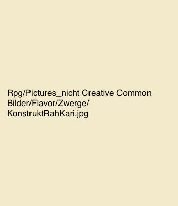

# Besondere Regeln

Natürlich bildet der Regel-Artikel nicht jede Besonderheit ab, daher finden sich in diesem Artikel seltenere Charakterbedingte oder Kampagnenbedingte Anwendungsbereiche.

## Instrumente und ihre Wirkung im Kampf {#InstrumenteRules}

Mit einem guten Rhythmus kämpft man besser. Bestimmte Lieder bringen Power-Ups oder Debuffs im Kampf und können auf Gruppen und Einzelpersonen angewandt werden.

Um ein Lied im Kampf zu singen wird wie normalerweise ein Performace-Check gemacht. Die Wirkung hält vier Aktionen an und es kann nur ein Genre gleichzeitig auf eine Person wirken. Lieder können motivierend sein oder demotivierend sein, also als Buffs oder Debuffs wirken - mit einem Lied des Genres Folk kann man also den Physis-Wert einer Person steigern wenn es motivierend ist und senken wenn es demotivierend ist. Versucht man ein Lied auf eine Gruppe Ziele wirken zu lassen, ist es deutlich schwerer - der Theshold verdoppelt sich. Lieder können - wie fast alles in unserem System - eine Stufe (Tier) von 1 bis 4 besitzen. Diese Stufe macht ein Lied zwar schwerer zu spielen, allerdings wird die Wirkung auch stärker.

Lieder können - je nach Genre - von unterschiedlichen instrumenten begleitet und unterstützt werden, wobei das passende Hauptinstrument einen +6 Würfelmodifyer und das passende Nebeninstrument einen +3 Würfelmodifyer gibt. Ein Lied kann mit einem Instrument, welches sich in einem [Holster](#Holster1) befindet für eine main Action gespielt werden.

Hier sieht man eine Übersicht über die Genres:

+---------------+---------------------+-----------------+-------------------+
| Genre         | Wirkung             | Hauptinstrument | Begleitinstrument |
+:=============:+:===================:+:===============:+:=================:+
| Minnesang     | Charisma            | Geige           | Laute             |
+---------------+---------------------+-----------------+-------------------+
| Rock          | Kritische<br>Chance | Trommel         | Dudelsack         |
+---------------+---------------------+-----------------+-------------------+
| Folk          | Physis              | Flöte           | Trommel           |
+---------------+---------------------+-----------------+-------------------+
| Tavernenmusik | Agilität            | Laute           | Geige             |
+---------------+---------------------+-----------------+-------------------+
| Metal         | Stärke              | Dudelsack       | Trompete          |
+---------------+---------------------+-----------------+-------------------+
| Polka         | Angriffsziel        | Horn            | Flöte             |
+---------------+---------------------+-----------------+-------------------+
| Hymne         | Single Action       | Trompete        | Horn              |
+---------------+---------------------+-----------------+-------------------+

Angriffsziel bedeutet dass man von einem oder mehreren Zielen auswählen kann, wer wen ihrer/seiner Gegner angreift.

Single Action gibt den Zielen eine zusätzliche single Action, falls das Lied motivierend war und nimmt die single Action, falls das Lied demotivierend war - die zufallsbasierte Verteidigungschance bleibt dabei unberührt.

Lieder bekommt man indem man selbst viel übt und spielt. Worum sich diese Lieder drehen legt der Spieler fest, wobei ihm aber Genre, Tier und ob es sich um ein motivierendes oder demotivierendes Lied handelt vorgegeben wird. Dies kann bei Performance-Checks oder beim [Training](#Training) passieren. Zusätzlich können Lieder ab und zu in der lokalen Taverne gegen eine Aufwandsentschädigung erlernt werden.

## Der Krieg auf See

Die Meere in Orbis Astea sind ein ebenso gefährliches und umkämpftes Gebiet wie das Land und so ist es nützlich sich mit dem Kampf auf See auszukennen.

Da das Meer, die Seen und Flüsse sowohl für den Handel als auch für militärische Operationen essentiell sind, ist eine gute Flotte aus der Machtpolitik der Fraktionen kaum herauszudenken.

### Allgemeines

Der Kampf auf See unterscheidet sich signifikant vom Kampf auf dem Festland, während schwere Rüstungen auf dem Festland zu den mächtigsten Waffengattungen gehören, sieht man in Metall bekleidete Soldaten nur selten auf See. Egal wie gut man schwimmen kann, das enorme Gewicht einer Rüstung zieht einen in den sicheren Tod sollte man über Bord gehen.

Stattdessen sieht man vor allem leichte Rüstung, da diese kaum beeinträchtigend ist, wenn man überleben will - wobei gute schwimmer sich auch in mittlerer Rüstung auf Schiffe begeben können ohne um ihr Leben fürchten zu müssen.

Auch Fernkampfwaffen sind auf See deutlich häufiger vertreten - dabei allen vorran Armbrüste und Musketen, deren größter Nachteil, die Nachladezeit, von der Distanz von Schiff zu Schiff relativ gut negiert wird.

#### Kapern und Versenken

Es gibt zwei Möglichkeiten eine Auseinandersetzung mit einem anderen Schiff zu gewinnen: das Kapern und das Versenken.

Beim Versenken wird dem Schiff genügend Schaden zugefügt, dass es untergeht (Also die Haltbarkeit auf Null sinkt). Beim Kapern übernimmt man das Schiff des Gegners, indem man die Crew gefangen nimmt oder tötet und die Steuerung über das Schiff übernimmt.

Für jede dieser Optionen gibt es verschiedene Werkzeuge, die entwickelt wurden, um das Ziel besser zu erreichen.

#### Schiffsarten

Es gibt drei große Übertypen, in die sich Schiffe unterteilen lassen. Zwei dieser Schiffstypen sind relevant, da kaum wer ein Staatenschiff steuern oder bekämpfen wird. Die relevanten Schiffstypen sind Ruder und Segelschiffe.

##### Ruderschiffe {#RuderGeneral .unnumbered}

Ruderschiffe existieren deutlich länger als Segelschiffe und stellen, vor allem im Flussverkehr, die häufigste Schiffsart dar. Ihr niedriges Profil und ihr niedriger Schwerpunkt, in Verbindung mit der Manövrierbarkeit, macht sie zur perfekten Schiffsklasse für einen Kampfstil, der seinen Schwerpunkt aufs Rammen legt. Allerdings macht es das niedrige Profil auch schwerer Segelschiffe zu entern, sowie Personen auf Deck eines Schiffes mit niedrigen Profil wenig Chancen haben sich vor den Schützen auf einer vöher liegenden Anhöhe (beispielsweise ein höheres Schiff) zu decken.

Die Crews auf Ruderschiffen sind aufgrund der Rudercrew meist größer und brauchen daher mehr Vorräte, weswegen lange Reisen nur in Küstennähe möglich sind, außer es liegt Unterstützung von Segelschiffen vor. Auch Ruderschiffe können für Reisen Segel haben, sind damit aber kaum Manöverfähig. So muss das Segel bei jedem Richtungswechsel eingeholt werden.

Vorteile:

-   Weniger bis keine Abhängigkeit von Wind
-   Einfach manövrierbar
-   Braucht wenig erfahrene Seemänner
-   Schnelle Beschleunigung
-   Niedriges Profil
-   Billiger

Nachteile:

-   Brauchen mehr Versorgung
-   Deutlich mehr Personen zur Fortbewegung
-   Niedriges Profil
-   Nur in Küstennähe alleine nutzbar
-   Schlechter für große Distanzen
-   Anfälliger für Stürme

##### Segelschiffe {#SegelGeneral .unnumbered}

Vorteile:

-   Brauchen weniger Personen zur Fortbewegung
-   Können viel Ladung und Vorräte mitnehmen
-   Hohes Profil
-   Hochseetauglich
-   Schnell

Nachteile:

-   Windabhängig
-   schwerer manövirierbar
-   Braucht kompetente Seemänner
-   Teuer
-   Hohes Profil

##### Staatenschiffe {.unnumbered}

Niemand weiß so genau woher die Staatenschiffe kommen, aber diese maritimen Kolosse gelten als unbezwingbar. Die größe alleine reicht aus, um Flotten in den Schatten zu stellen und in die Flucht zu jagen, da ein Staatenschiff kleinere Schiffe, bei ausreichender Beschleunigung, mühelos überfahren kann. Staatenschiffe scheinen sich selbst wie durch Wunderhand mit allen möglichen zur Verfügung stehenden Materialien zu reparieren, sei es Treibgut oder andere Schiffe. Daher gibt es bis heute keinen bekannten Fall in dem ein Staatenschiff gesunken ist.

Die schiere Größe, das riesenhafte Profil und die Widerstandskraft eines Staatenschiffs macht es zum idealen Objekt um massig Artillerie darauf zu stellen oder es als eine Maritime Stadt zu verwenden.

Staatenschiffe haben eine komplexe zentrale Steuereinheit und nur wenige sind in der Lage ein Staatenschiff damit zu steuern - sollte man allerdings eine derartige steuerung gemeistert bekommen sind die Möglichkeiten enorm. Doch auch ohne geeignete Steuermänner haben die Bewohner dieser Kolosse Wege gefunden, um sie zu steuern. durch den Aufbau hunderter kleiner Segel sind die Staatenschiffe etwas steuerbar, obwohl es immernoch eine Herausforderung ist und um ein vielfaches weniger effektiv als die zentrale Steuerung. Eine gezielte Steuerung eines Staatenschiffs ohne Steuereinheit gilt als unmöglich.

### Schiffstypen

Verschiedenste Schiffstypen mit eigenen Charakteristiken, Vor. und Nachteilen, Besonderheiten und Verwendungszwecken können in Orbis Astea gefunden werden.

#### Ruderschiffe

##### Barke {.unnumbered}

Barken sind meist kleine Boote ohne Mast, die bis zu 8 Leuten Platz bieten. Sie sind nicht hochseetauglich und werden meist für kleinere Transporte oder von Hafennahen Fischern eingesetzt. Eine Barke ist sehr billig, allerdings nur bedingt von Bedeutung. Auf größeren schiffen werden sie als Beiboote eingesetzt.

##### Bireme {.unnumbered}

Eine Bireme ist ein Ruderboot mit zwei Ruderreihen. Es ist das kleinste Ruderboot dass wirklich eine Bedeutung hat. Mit einer Mindestbesatzung von 40 Mann und Kapazität für 40 weitere Soldaten ist die Bireme eine kostengünstige Option, die fast überall Anwendung findet. Voll hochseetauglich wird sie alleine durch die Kapazität an Nahrung ausgebremst.

Biremen kommen sowohl mit offenem Deck, als auch mit einem geschlossenem Kampfdeck.

##### Galeeren {.unnumbered}

Galeeren haben ein breites, meist offenes Deck und sind eher auf Artillerie als auf Truppentransport ausgelegt. Da viele Galeeren umfunktionierte oder immer noch im Dienst seinende Handelsschiffe sind, haben sie auch häufiger Lagerräume und das typische - oft nachteillige offene Deck.

![Eine umfunktionierte Handelsgaleere[^1]](Pictures/Flavor/SchiffeBoote/Wikimedia_Galeere_Transparent.png)

[^1]: Diese Abbildung wurde der Seite [wikimedia](https://commons.wikimedia.org/wiki/File:Galley-knightshospitaller.jpg) entnommen und steht unter einer Creative Commons Attribution-Share Alike 3.0 Unported license zur Verfügung.

Dennoch sind Galeeren weit verbreitet und sowohl im zivilen als auch im militärischen Gebrauch üblich. Und sind vor allem durch ihre Vielseitigkeit charakterisiert. Kaum ein Schiffstyp ist so vielseitig und anpassungsfähig.

##### Trireme {.unnumbered}

Die Trireme ist mit 130 Ruderern und Platz für 150 Soldaten ein gefürchteter Anblick in jeder Seeschlacht. Ihre immense Beschleunigung macht sie zum idealen Schiff zum rammen und zum kapern anderer Schiffe, und so sind sie eigentlich nur im militärischen Gebrauch anzutreffen.

![Eine Trireme auf Patroullie[^2]](Pictures/Flavor/SchiffeBoote/wikimedia_Trireme.png)

[^2]: Diese Abbildung wurde der Seite [wikimedia](https://commons.wikimedia.org/wiki/File:Trireme_1.jpg) entnommen und steht unter einer Creative Commons Attribution-Share Alike 2.0 France license zur Verfügung.

Obwohl Triremen eher teuer sind, sind sie aufgrung ihrer Kampfkraft und der Schnelligkeit, mit der neue Seefahrer eingearbeitet sind, weit verbreitet. Trieren haben außerdem Platz für Artillerie und sind standartmäßig mit einer Ramme ausgerüstet, sie werden immer mit einem geschlossenem Kampfdeck gebaut.

#### Segelschiffe

##### Kutter {.unnumbered}

Ein Kutter ist meist ein kleines Fischerboot, in das bis zu 8 Personen hineinpassen. Es ist weder hochseefähig, noch besonders geräumig und ist das Segelschiff-Gegenstück zur Barke mit dem Vorteil höherer Reichweite und Geschwindigkeit und das man nicht ständig rudern muss.

##### Brigg {.unnumbered}

Die Brigg ist das kleinste hochseefähige Schiff und kommt mit einem bis zwei Masten und Segeln. Je nach größe können verschiedene Mengen an Personen und Artillerie aufgenommen werden. Wärend auf kleine Briggs nur 1-2 Skorpione passen können auf größere Briggs sogar Katapulte oder Ballisten installiert werden.

##### Langschiff {.unnumbered}

Das Langschiff ist ein Design der Ska'en und ist mit kaum Artillerie oder einer Ramme ausgestattet, dennoch ist das Schiff aufgrund seiner Geschwindigkeit und Wendigkeit gefürchtet. Es kombiniert Vorteile aus beiden Welten der Schifffahrt damit dass es sowohl Segel als auch Ruder besitzt und schnell und zuverlässig eine große Menge Krieger transportieren kann, die sowohl fürs Kapern anderer Schiffe als auch für Landungen auf dem Festland eingesetzt werden können.


Ohne die Krieger ist das Langboot im Kampf jedoch relativ aufgeschmissen, da das niedrige Profil und die Abwesenheit von Artillerie das Schiff alleine kaum Aktionsfähig macht.

##### Fregatte {.unnumbered}

Die Fregatte ist ein großes Segelschiff mit Platz für zwei bis drei Ballisten oder Katapulte. Sie braucht 25 Seemänner um gesteuert zu werden und kann in etwa 80 zusätzliche Personen Transportieren. Fregatten sind sowohl in ziviler als auch als militärischer Nutzung häufig - werden jedoch in beiden Fällen meist bewaffnet, da sie beliebte Ziele für Piraten sind. Sie können lange Zeit reisen und sind oft der Hauptteil maritimer Flotten.

![Eine Fregatte kreuzt gegen den Wind[^3]](Pictures/Flavor/SchiffeBoote/Fregatte_Pixaby.jpg)

[^3]: Diese Abbildung wurde der Seite [Pixabay](https://pixabay.com/es/illustrations/vela-barco-mar-1506158/) entnommen und steht zur kommerziellen Nutzung zur Verfügung.

Fregatten gelten als das kleinste der großen Segelschiffe.

##### Karavelle {.unnumbered}

Die Karavelle ist das mittlere der großen Segelschiffe und ein nicht zu unterschätzendes Schiff. Sie ist (obwohl sie an Beschleunigung nicht mit Ruderschiffen mithalten kann) die wahrscheinlich schnellste Schiffsklasse auf dem Meer und wird in Puncto Feuerkraft nur von der Galeone übertroffen. Ihr hohes Deck sorgt dafür dass hoher Wellengang und leichte Stürme ihr kaum was anhaben können.

Bereits 35 Mann reichen aus um eine Karavelle voll Fahr- und Funktionsfähig zu halten, jedoch haben bis zu 140 Passagiere auf der Karavelle Platz.

##### Galeone {.unnumbered}


Galeonen sind oft die Flaggschiffe von Flotten. Diese enormen Kreutzer kosten ganze Vermögen und sind mit einer Menge an Artillerie und Soldaten ausgestattet. Die 60 Seemänner die es braucht um das Boot zu bemannen lassen noch Platz für bis zu 320 andere Passagiere - die meist die Leibgarde einer sehr reichen und mächtigen Person sind.

Die Galeone fährt für gewöhnlich mit einer Begleitflotte und ist trotz ihrer größe ein bisschen langsamer als eine Fregatte.

#### Werte und Übersicht

+------------+-------+-------------+-----------------+------------------+----------------+
| Kampf      | Art   | Haltbarkeit | Bewegungspunkte | Manövrierbarkeit | Beschleunigung |
+:==========:+:=====:+:===========:+:===============:+:================:+:==============:+
| Barke      | Ruder | 1500        | 2               | 20               | 10             |
+------------+-------+-------------+-----------------+------------------+----------------+
| Kutter     | Segel | 2000        | 1               | 18               | 6              |
+------------+-------+-------------+-----------------+------------------+----------------+
| Bireme     | Ruder | 10000       | 2               | 17               | 14             |
+------------+-------+-------------+-----------------+------------------+----------------+
| Brigg      | Segel | 8000        | 2               | 14               | 13             |
+------------+-------+-------------+-----------------+------------------+----------------+
| Langschiff | Segel | 15000       | 3               | 16               | 17             |
+------------+-------+-------------+-----------------+------------------+----------------+
| Galeere    | Ruder | 18000       | 3               | 13               | 15             |
+------------+-------+-------------+-----------------+------------------+----------------+
| Fregatte   | Segel | 15000       | 2               | 9                | 12             |
+------------+-------+-------------+-----------------+------------------+----------------+
| Trireme    | Ruder | 25000       | 4               | 10               | 20             |
+------------+-------+-------------+-----------------+------------------+----------------+
| Karavelle  | Segel | 18000       | 2               | 7                | 11             |
+------------+-------+-------------+-----------------+------------------+----------------+
| Galeone    | Segel | 30000       | 1               | 5                | 5              |
+------------+-------+-------------+-----------------+------------------+----------------+

<small> <small>

+------------+-------+------------------+-----------+---------------+----------+-----------------+------------+
| Fahrt      | Art   | Mannschaftsgröße | Vorrat    | Passagierzahl | Tiefgang | Geschwindigkeit | Profilhöhe |
+:==========:+:=====:+:================:+:=========:+:=============:+:========:+:===============:+:==========:+
| Barke      | Ruder | 1                | 0 Tage    | 7             | 20 cm    | 7               | 40cm       |
+------------+-------+------------------+-----------+---------------+----------+-----------------+------------+
| Kutter     | Segel | 1                | 1 Tag     | 9             | 40cm     | 9               | 70cm       |
+------------+-------+------------------+-----------+---------------+----------+-----------------+------------+
| Bireme     | Ruder | 40               | 4 Tage    | 40            | 80cm     | 10              | 2m         |
+------------+-------+------------------+-----------+---------------+----------+-----------------+------------+
| Brigg      | Segel | 10               | 2 Wochen  | 80            | 1.2 m    | 15              | 5m         |
+------------+-------+------------------+-----------+---------------+----------+-----------------+------------+
| Langschiff | Segel | 40               | 8 Tage    | 110           | 80cm     | 17              | 3m         |
+------------+-------+------------------+-----------+---------------+----------+-----------------+------------+
| Galeere    | Ruder | 80               | 5 Tage    | 90            | 1m       | 12              | 4m         |
+------------+-------+------------------+-----------+---------------+----------+-----------------+------------+
| Fregatte   | Segel | 30               | 8 Wochen  | 80            | 3m       | 18              | 7m         |
+------------+-------+------------------+-----------+---------------+----------+-----------------+------------+
| Trireme    | Ruder | 130              | 6 Tage    | 160           | 1.5m     | 14              | 5m         |
+------------+-------+------------------+-----------+---------------+----------+-----------------+------------+
| Karavelle  | Segel | 45               | 10 Wochen | 140           | 4.5m     | 20              | 9m         |
+------------+-------+------------------+-----------+---------------+----------+-----------------+------------+
| Galeone    | Segel | 60               | 8 Wochen  | 320           | 6m       | 16              | 20m        |
+------------+-------+------------------+-----------+---------------+----------+-----------------+------------+

</small> </small>

### Schiffsbewaffnung

#### Artillerie {#SegelArtillerie}

| Waffenslots | Klein | Mittel | Groß |
|:-----------:|:-----:|:------:|:----:|
|    Barke    |   0   |   0    |  0   |
|   Kutter    |   1   |   0    |  0   |
|   Bireme    |   2   |   0    |  0   |
|    Brigg    |   2   |   1    |  0   |
| Langschiff  |   2   |   0    |  0   |
|   Galeere   |   4   |   1    |  0   |
|  Fregatte   |   6   |   2    |  0   |
|   Trireme   |   4   |   1    |  1   |
|  Karavelle  |   6   |   2    |  2   |
|   Galeone   |  10   |   6    |  4   |

Welche <font color="green">[Artillerieoptionen es gibt kann man hier nachschauen](#ArtillerieOverall)</font>.

#### Rammen

Sämtliche Ruderboote können Rammen beesitzen. Um erfolgreich zu Rammen wird ein Vehicle-Check geworfen.

#### Kaperequipment

Um ein Schiff zu kapern gibt es folgende Hilfsmittel:

-   Seile
-   Wurfhaken
-   Brücken

#### Sonstige Waffen

##### Saldisches Feuer {.unnumbered}

Saldisches Feuer stammt von der Insel Saldis, auf der ein Erfinder einen Weg gefunden hat mithilfe eines entzündbaren Pulvers ein Flammenstrahl zu erzeugen, den man gerichtet aus einem Rohr feuern konnte. Schnell übernahmen die Kapitäne diese, auf See enorm nützliche, Erfindung und benutzten sie als Waffe gegen mit Soldaten gefüllte Oberdecks.

Saldisches Feuer ist in der Lage in kürzester Zeit enormen Schaden an der Crew anzurichten, so ist diese einfach zu versteckende Waffe enorm gefürchtet.

### Schiffe im Gefecht

Eine Seeschlacht ab zwei beteiligten Schiffen findet auf einer speziellen "Battlemap" statt diese ist Karte ist in Kästchen untergliedert die bestimmte Längemaße angeben. Schiffe bewegen sich während der Schlacht abhängig von ihrer Beschleunigung, je höher diese ist desto mehr Felder können pro Runde zurück gelegt werden. Die Bewegung auf der Battlemap kann in 2 Aktionen unterteilt werden: das schiff fährt entweder nach vorne oder dreht sich in eine Richtung. Jede dieser Aktionen kostet einen Bewegungspunkt.

Zusätzlich kann ein Beschleunigungswurf gemacht werden um einen zusätzliches Kästchen zurückzulegen. Die Chance hierfür hängt wiederum auch vom Beschleunigungswert ab, je höher desto besser. Auch spielt die Qualität des Kapitäns und der Mannschaft zu gleichen Teilen eine Rolle.

Das Wetter spielt hierbei auch eine Rolle je nachdem woher der Wind weht. Gibt es keinen Wind, gelten die normalen Bewegungspunkte, wenn man sich gegen den Wind bewegt werden diese Punkte halbiert(minimum eins) - mit dem Wind werden sie verdoppelt.

Ziel in diesen Seeschlachten ist es den Gegner zu versenken oder Kampfunfähig zu machen dies ist durch gezielte Schüsse auf Masten oder Steuerruder möglich, da die Zerstörung des jeweiligen Teils die Kampffähigkeit des Schiffes stark einschränkt. Dies wird erreicht in dem man sein eigenes Schiff in möglichst klugen Taktischen Manövern in Position bringt und mit den Geschützen den Gegner attackiert. Alternativ kann das feindliche Schiff auch geentert werden um die Kontrolle zu übernehmen oder es zu sabotieren. Beispielsweise können die Geschützbatterien entzündet oder vielleicht der Pulvervorrat hochgejagt werden.

Geschütze in den jeweiligen den Schiffsprofilen entsprechenden Slots können einer von vier Stellungen auf dem Schiff zugewiesen werden. Diese Stellungen sind Backbord vorne hinten und Steuerbord vorne hinten. Diese vier Stellungen können mit einem gezielten Schuss anvisiert werden und besitzen Leben entsprechend der Anzahl der in der Stellung plazierten Geschütze, somit haben viel besetzte Stellungen mehr Leben als solche mit wenig bis keinem Geschütz. Desweiteren besitzen diese vier Stellungen Schussfelder die in etwa 180° groß sind, dies führt an den Seiten zu überlappenden Schussfeldern. Für die Vorder-und Rückseite gilt, nur jeweilse eine Seite kann gerade nach vorne oder hinten schießen, diese wird durch einen Luck Throw des Ziels bestimmt.

Durch schlaues platzieren der Geschütze auf dem Schiff sind verschiedene Taktiken möglich, so zum Beispiel eine Seite mit besonders vielen Geschützen zu versehen und den Gegner nur auf eine Seite zu lassen um ihn so mit überlegener Waffengewalt zu bewzingen, diese Strategien gehen aber mit einem gewissen Risiko einher.

Den Gegnerischen Artillerie beschuss wird automatisch ausgewichen, der erfolg dieser Aktion hängt von Manövrierfähigkeit des Schiffs, als auch von Käpitän und Mannschaft ab..

## Konstrukte {#Konstrukte}

### Allgemeines

Diese Wunder mechanischer Handwerkskunst stellen den Zenit der zwergischen Innovation dar. Sie sind aufgrund ihrer religösen Ansichten als einziges Volk in der Lage diese teils tonnenschweren Kollosse zum Leben zu erwecken. Die Konstrukte existieren in allen Formen und Farben und decken jeden nur möglichen Arbeitsbereich ab. So stellen sie zum Beispiel einen der schlagkräftigsten Teile des Rahkari Heeres dar, werden von Zwergenkarawanen zum Transport von tonnenschweren Waren benutzt und sind gleichzeitig mit schweren Ballisten bestückt. Fast jede Tätigkeit die ein Konstrukt übernimmt könnte genauso gut durch ein Tier, eine schlichte Mechanik oder einfach nur durch eine Person übernommen werden. Doch Konstrukte bieten neben vielen anderen Vorteilen einen bestimmten, bedinungslose Loyalität. Dies macht sie für Personen mit dem richtigen "kleingeld" im Beutel zu attraktiven begleitern.

### Kontrolle

Kein Konstrukt wird seinen Meister Willentlich hintergehen denn sie sind in Ermangelung von eben diesem. Wer einem Konstrukt befehle geben kann wird klar geregelt durch einen so genannten Meisterstein dieser wird zusammen mit dem Konstruktkern erschaffen und erhält dabei ein einmaliges Muster. Dieses Muster steht in Resonanz mit dem Kern, der das gleiche Muster trägt. Die Reichweite dieser Resonanz ist dabei jedoch begrenzt, doch innerhalb dieser Reichweite führt das Konstrukt jeden Befehl aus der vom Besitzer des Meistersteins gegeben wird, dabei muss dieser Befehl nicht laut gesagt werden, ein explizieter Gedanke reicht bereits aus. So wichtig die Reichweite ist, als Meister sollte man sich da nichts so viele Sorgen machen, sollte ein Konstrukt die Reichweite verlassen so durchläuft das Konstrukt die aktuelle Routine fertig / den Befehl anschließend startet das Konstrukt automatisch eine vorher bestimmte Verhaltensroutine, wie Rückkehr zum Besitzer des Meistersteins, kämpfen oder Flucht. Der Meisterstein kann, trotz seines namens vielerlei Form haben, da das Muster erst bei der Erschaffung des Kerns aufgeprägt wird. Mögliche Meistersteine wären so zum Beispiel ein Amulett, Armreif oder tatsächlich ein verzierter Stein oder in seltenen Fällen kann von Meistern ihres Handwerks das Muster sogar auf die Haut als Tattoo aufgetragen werden. Solche Tattoos bringen Vorteile wie Nachteile, so ist es quasi unmöglich die Kontrolle über das Konstrukt zu übertragen im Gegenzug ist es jedoch auch quasi unmöglich den Meisterstein von seinem Besitzer zu entwenden, dies wird also nur von den Misstrauischten Zwergen genutzt. Zu beachten ist jedoch das die Nutzung von Konstrukten pro Meister limitiert ist denn zu viele Meistersteine unter einem Meister stören sich bei der Resonanz gegenseitig.

### Essenzen

Diese Mysteriöse Energiequelle wird durch die Extration mit einem Nadelähnlichen Mechanismus aus frisch verstorbenen Gewonnen. Diese Energiequelle benötigt besondere Aufbewahrung und kann derzeit nur für bestimmte Dinge verwendet werden. Jedoch was mit ihr erreicht werden kann scheint weit über den Entwicklungsstand der akutellen Zivilisation hinauszugehen.

Mit ihr können Konstruktkerne Konstruiert werden und sogar weiterverbessert. Desweiteren nutzen Konstrukte sie je nach Anwendung als Antrieb sei es Langfristig in Batterien oder als Kurzfristiger Ladungsboost.

Das "Absaugen" aus den Leichen noch nicht Erwachter, ermöglicht das enthaupten der Verstorbenen ohne ein Erwachen fürchten zu müssen. Da dass enthaupten von verstorbenen jedoch als in vielen Reichen als Kapitalsünde angesehen wird, geht damit nur beschränkter nutzen einher.

$$HIDDEN LORE$$

Forerunner nutzten das Virus um Essenzen aus lebendem Gewebe zu extrahieren.


#### Die Völkerbeziehungen der Rasse

Während die meisten Völker Zwerge nur als Fahrende Händler oder an deren Wohnsitzen als Marktplatz kennen, pflegen die Rah Akari einen besonderen Handel insofern das eine ihre Hauptverteidigungen ,die Konstrukte, von den Zwergen kommen.



### Einsatzfelder von Konstrukten {#KonstruktAnwendung}

Konstrukte unterscheiden in vielerlei Art. dabei werden grundsätzlich nur Grenzen durch die Handwerkskunst und die Kreativität seines Erbauers gesetzt. Angefangen beim **Konstruktkern**, dieses Herzstück eines jeden Konstrukts, mit der beschädigung von diesem endet auch die aktivität. In die Kerne wird dabei nicht direkt ihre Aufgabe eingeprägt viel mehr stellt der Kern den möglichen Speicher und die Energiequelle dar, je besser der Kern desto mehr und Komplizierte Befehlte kann das spätere Konstrukt ausführen. Sogar selbstständig mehrere Funktionen aneinander Reihen um den Befehl erfolgreich auszuführen. Weiters existieren unterschiede in der Panzerung, wie man sich gut vorstellen kann ist ein Wesen dass auf Grund seiner Natur bereits ausschließlich aus Metallen besteht bereits gut gepanzert was bereits zu einem hohen Verteidigungswert führt, jedoch sind Teile des innenleben der Konstrukte aufgrund ihrer Filigranen und Präzisen Struktur leicht zu zerstören.

#### Konstruktarten

Grundsätzlich werden Konstrukte in fünf Klassen sortiert.

##### Utility:

Konstrukte dieser Klasse sind hauptsächlich in Reichen Zwergen Haushalten anzutreffen, sie erfüllen Zwecke die auch ein Angestellter hätte verrichten können sind dabei aber deutlich Diskreter. Aufgabenfelder reichen hierbei von Handwerklichenaufgaben wie der Errichtung und Pfelge von Gebäuden bishin zu Verwaltungsaufgaben. Generell dienen sie zur Verbesserung der Lebensqualität. Sie sind der Ausdruck purer Dekadenz.


##### Transport:

Sowohl über als auch unter der Erde müssen oft größere Menge Ware oder große Lasten bewegt werden, hier für gibt es allerlei Möglichkeiten, die beste stellt natürlich auch hier wieder ein Konstrukt dar, hier ein Beispiel wo würden sie ihr Bargeld lieber aufbewahren, in einer Satteltasche eines Tieres das bereits für seine Sturheit und widerwilligkeit bekannt ist oder im Tresor im inneren ihres Loyalen Gefährten der ihnen ohne zu zögern in den Wurmfall folgen würde. Diese Konstruktklasse unterscheidet sich stark in ihren Ausführungen obwohl sie doch alle das gleiche Ziel haben, von der Anzahl der Beine, Panzerung und nützliche Gadgets ist allen voran natürlich die mögliche Traglast ausschlaggebend. Diese Konstrukte werden oft von den Oberflächen Zwergenkarawanen genutzt, in ihnen kann alles von mystischen Bestien bis Edelsteinen alles sicher Transportiert werden, oft werden diese dabei neben nützlichen Gadgets auch mit Waffen ausgestattet die dann von der Besesatzung genutzt werden können.


> Ich dachte nach Jahren auf all den Schlachtfeldern hätte ich alles gesehen, doch als meine Jungs von diesen vierarmigen Teufeln zerrissen wurden lief mir ein Schauer über den Rücken, kein Zucker überkam dieses Ungetüm als der alte Joshua es mit dem Kriegshammerschlug und keiner als es ihn in der Mitte Teilte.
>
> --- Abiter Kox Söldner Kapitän über eine Vorstoß Schlacht gegen die Rah Kari

Nichts ist auf einem Schlachtfeld effizienter als ein Nahkampf Konstrukt mit dem einfachen Befehl den Feind zu töten. Jeder weis nie ist der Mensch kreativer als im Krieg, die effektive zerstörung anderer scheint die Kreativität zu beflügeln und nichts ist effizienter als ein Konstrukt für diese Aufgabe. Die Panzerung scheint für viele Gegner oft undurchdringlich doch kaum ist man durch diese Panzerung gebrochen sind die meisten Konstrukte sehr zerbrechlich, doch dies stellt bereits eine Mammut Aufgabe dar. So hart der Kampf gegen sie ist so sehr kann sich die Belohnung auch sehen lassen, sollte der Konstruktkern unbeschädigt bleiben und der Meisterstein ergattert können beide auch ohne das Konstrukt zu einem hohen Preis an Zwergenclans verkauft werden, da diese ja wiederverwendbar sind.


Ein Fernkampf Konstrukt ist weit weniger adaptiert für den Nahkampf jedoch nicht zu unterschätzen zwar langsamer aber immer noch schlagkräftig, bestückt mit Ballisten oder Armbrüsten sind sie selbst auf große entfernung Tödlich. Zu beachten ist das beim Fernkampf deutlich mehr Ressourcen des Konstruktkerns beansprucht werden als es beim Nahkampf der Fall ist, schlicht auf Grund der höheren Komplexität.


##### Titan klasse Konstrukt:

Diese Klasse ist die seltenste von ihr existieren selbst in den Aufzeichnungen nur eine handvoll Modelle. Diese teils riesigen Schöpfungen Tragen Kerne unglaublicher Ausmaße und immenser Reinheit in sich. Man möchte sich nicht ausmalen wie viel Essenz in die Erschaffung eines solchen Kernes gefloßen sein müssen, ganze Völker vom Angesicht der Erde getilgt. Was diese Konstrukte Gefährlich macht ist nicht Primär ihre Größe, Schlagkraft oder "Intelligenz" von denen alles in Maße vorhanden ist sondern viel mehr die Ausdauer. Ein jeder Militärstratege weis das Konstrukte gefährlich sind aber auch zerstört werden können wenn man ihre Rüstung durch dringt, dass mag auch hier Wahr sein, doch haben die gewitzten Erfinder dafür eine Lösungen gefunden. Die Konstrukte werden von vielen kleinen Konstrukten bewohnt, alle mit nur einem einzigen permaneten Befehl programmiert das Titanklasse Artefakt zu reparieren. Doch selbst diese benötigen auf Grund ihrer geringen größe, Kerne von großer Reinheit zwar wird Kapazität gespart durch die permanent Installation des Befehls jedoch ist dieser immer noch hoch Komplex und erfordert stets mehrere Schritte.

#### Bau

Was diese Konstrukte antreibt ist ein sogennanter Konstruktkern diese existieren in verschiedenen Größen und Reinheiten und werden mithilfe der Seelen von empfindsamen Wesen erschaffen. Je größer und reiner desto mehr Essenz wird benötigt, von diesen Stellschrauben hängt die spätere "Intelligenz" der Konstrukte ab da diese quasi die Speichergröße festlegen. Man munkelt die reinsten und größten Kerne können ein Bewusstsein entwickeln doch diese Theorie konnte bisher nicht bewiesen werden.

Um die Seelen für die teure Schaffung von Konstrukten zu besorgen gibt es für Oberflächenzwerge ein besonderes Werkzeug -- den Seelenfänger -- im Prozess die Seelen einzufangen müssen die Körper verbrannt werden. Dies stellt in einer Zwergenstadt mit einem Vulkan oder einer Schmiede kein Problem dar, für unterwegs ist das allerdings eher schwer zu bewerkstelligen. Daher kommt der Seelenfänger mit einer Phiole gefüllt mit einem hochbrennbaren spezial Öl zur schnellen Einäscherung von Leichen. Dieses Öl wird von Enzymen des Feuerorgans der Linddrachen gewonnen, es produziert stetig neues Öl, diese verbrauchen sich jedoch auch mit der Zeit.


Die Inspiration für diese Wunderwerke fanden die Zwerge in den Überbleibseln von Forrunner Technologie, jedoch können selbst ihre heutigen meisterwerke den damaligen nicht das Wasser reichen.

### Verbreitung von Konstrukten

Aus vielerlei Gründen sind Konstrukte eher selten Anzutreffen, dann jedoch meist in der Begleitung von Zwergen, Rah Kari oder einigen gewieften Geschäftsmännern und Handwerkern anzutreffen. In seltenen Fällen trifft man aber auch auf allein herumsträunende Konstrukte, sogenannte Wanderer diese durchstreifen das Land oft schon seit Jahrhunderten mit dem einzigen Ziel den letzten Befehl ihrer jeweiligen Meister zu folgen, welche diese sind ist jedoch unbekannt. Besonders gehäuft trifft man Wanderer in der unterirdischen Stadt Wandia und in vergessenen Zwergenstädten an.

## Konstrukte Regeln {#konstrukte}

### Kampf

Ein Konstrukt folgt den Befehlen seines Meisters im Kampf, sollte dieser nicht zur Verfügung stehen folgt es entweder dem letzten geäußerten Befehl oder einer einfachen Standartroutine. Befehle können entweder Verbal oder sogar Gedanklich übermittelt. Ist also nicht zu komplexen eigenständigem Denken fähig.

Ein Konstrukt hat wie PCs zwei Aktionen pro Runde vorrausgesetzt genügend Ladungen sind verfügbar, es besteht die Chance auf eine dritte Aktion pro Runde (siehe Vehicel Check).

Beispiel Befehle: Im Grunde alle Aktionen die eine Ladung erfordern. Greif diesen Gegner an beschütze mich / diesen Verbündeten, blockiere diesen Gegner, ansitzen (zielen) auf diese Deckung etc.

#### Gliedmaßen / Schwachpunkt

Jedes Konstrukt bestehlt aus 6 angreifbaren Teilen seinen 4 Gliedmaßen einer Kernabdeckung und dem Kern selbst. Der Kern für sich ist nahezu ungepanzert, kann jedoch erst angegriffen werden *nachdem* die Kernabdeckung zerstört wurde. Der Kern ersetzt beim gezieltenangriff den Kopf und die Kernabdeckung den Torso.

#### Ladungen

Jede aktive Aktion verbraucht Ladungen der Batterie, je nach Art der Anwendung können auch mehrere Ladungen für eine Anwendung verbraucht werden. Normale Handlungen wie gehen oder Ausschau halten sind Gratis.

#### Anwendungen für Ladungen

*1 Ladung :*

-   Angriff

<!-- -->

-   Sprinten

-   Blocken

-   Ausweichen

-   Schützen (für jemanden blocken)

-   Rammen (Stun)

-   umwerfen (Grappling)

-   Verbaute Attilierienutzung durch Person

-   Klettern

-   Seilwerfer

-   Rauchwerfer

-   Bolawerfer

-   Alle weiteren Funktionen die nicht expliziet mehrere Ladungen erfordern

*2 Ladungen*

-   Besondere Waffentypen (Flammenwerfer)

-   Schwerer Angriff mit jeder Nahkampfwaffe erlaubt

### Vehicle Skill {#Vehicleskills}

Dem Besitzer des Konstrukts ist es möglich kurzzeitig die Kontrolle über ein Konstukt auch aus der Entfernung zu übernehmen, dies äußert sich in einer zusätzlichen Aktion für das Konstrukt. Diese Aktion hängt von einem Vehicel Check ab dessen schwierigkeit auf dem Kern und der Größe des Konstrukts basiert, je stärker das Konstrukt desto schwieriger die Kontrolle. Bei Erfolg wird die Main Action des Characters aufgebraucht, bei Misserfolg die Singleaction da weniger Zeit verbraucht wird.

Die Schwierigkeit des Checks wird im Konstruktprofil automatisch berechnet. Die Schwierigkeit kann durch einen Pilotensitz im Konstrukt halbiert werden.

### Batterie in Session Aufladen

Zum aufladen des Akkus ohne Pausen. Hierfür wird der Essenzsammler verwendet, Eine Ladung entspricht 10 Essenzen, jedoch ist es schwer abzuschätzen wann man die Sammler abziehen muss weshalb es öfter zu ungenauen Abzügen kommt,was im schlimmsten Fall zum Verlust aller gesammelten Seelen im Sammler führen kann. Aufgrund des hohen Preises dieser Anwedung wird diese nur im absoluten Notfall empfohlen.

### Reperatur

Natürlich kommt es vor das Konstrukte im Kampf demoliert werden also die Leben des Konstrukts auf 0 fallen, in diesem Fall muss es in der Downtime repariert werden.

Je nach größe des Konstrukts müssen zwischen eine bis drei downtime Handwerkaktionen aufgewendet werden.

Der Schwierigkeitsgrad des Checks orientiert sich dabei an dem Tier des Corpus und den entsprechenden Reperatur werten des Materials

Jedoch benötigen diese Reperaturen *keine* Materialien.

| Reparieren | Threshold |
|:----------:|:---------:|
|  Stufe 1   |    1,5    |
|  Stufe 2   |    2,3    |
|  Stufe 3   |     3     |
|  Stufe 4   |     4     |

### Aufbau und Herstellung

Ein Konstrukt ist im Aufbau einem PC nicht unähnlich unterscheidet sich jedoch in der Quelle der Attributs und Skillpunkte, neben einigen weiteren Zusätzen.

Ein Konstrukt besteht aus:

-   Konstrukt Kern das Herz und Hirn des Konstrukts bestimmt Leben und Skillpunkte.

-   Akku gibt die Ladungsmenge also die Anzahl an möglichen Aktionen des Konstrukts vor

-   Corpus gibt die Verfügbaren Attribute und Rüstung vor.

Alle müssen für ein funktionierendes Konstrukt vorhanden sein, können jedoch auch beliebig zwischen ihnen getauscht werden.

Zum besseren und einfachen Verständnis der Erstellung eines Konstrukts empfiehlt sich ein Blick in die Excel Datei. Da mit nur wenigen Eingaben das Konstrukt Spiel bereit ist. Zu beachten ist das die Linke seit des Profil nicht bearbeitet werden sollte da sich diese Werte selbst vervollständigen.

#### 

##### Skills {#skills}

Nicht alle Skills können von Konstrukten gelevelt werden, da auch diese Grenzen haben.\
Folgende Skills können erhöht werden:

-   Block

-   Armed

-   Ranged

-   Unarmed

-   Running

-   Sneak

-   Perception

-   Dodge

-   Acrobatics

#### Kern

Der Konstruktkern stellt sowohl das Herz als auch das Hirn eines jeden Konstruktsdar das Level des Kerns wird durch das Anwenden von Essenzen in der nebenbei Downtime erhöht dieses Level beinflusst viele Bereiche des Konstrukts:

-   Die maximalen Attribute die effektiv eingesetzt werden können, sollten mehr Punkte in ein Attribut geflossen sein als die Stufe des Kerns so werden nur die Attributspunkte bis zur Kernstufe angewendet.

-   Neben der Begrenzung durch die Maximalattribute, leveln auch zwei Attribute direkt mit der Kernstufe nämlich Intelligenz im Faktor 1 zu 1 und Instinkt im Faktor 1 zu 0,75.

-   Die Maximalen Leben des Konstrukts entsprechen der 15-fachen Kernstufe und verteilen sich unter den Gliedmaßen folgendermaßen: 50% Kern(Kopf), 50% Kernabschiermung (Torso) Alle anderen teile je 30%

-   Das Skillgrundlevel, mit jeder Kernstufe erhöht sich auch das Grundlevel eines jeden Skills. Sollte dieses höher sein als das geskillte Level des Skills wird für die Berechnung sttatdessen das Grundlevel herangezogen.

-   Skilllevel, durch die Verwendung von Essenzen (unabhängig von der Stufe des Kerns) können einzelne Skills aufgelevelt werden.

*Grundpreis des Kerns: 5.000 Reiks*

*Der Kern Startet auf Stufe 10*

| Kernstufe | Preis je Level (Essenzen) | Gesamtpreis (Essenzen) |
|-----------|---------------------------|------------------------|
| 11-15     | 1                         | 5                      |
| 16-20     | 2                         | 15                     |
| 21-25     | 3                         | 30                     |
| 26-30     | 4                         | 50                     |
| 31-35     | 5                         | 75                     |
| 36-40     | 6                         | 105                    |
| 41-45     | 7                         | 140                    |
| 46-50     | 8                         | 180                    |

Skill Level erhöhen nach Herstellung:

| Skilllevel | Preis je Level | Gesamtpreis (Essenzen) |
|------------|----------------|------------------------|
| 0-20       | 1              | 20                     |
| 21-40      | 2              | 60                     |
| 41-60      | 3              | 120                    |
| 61-80      | 4              | 200                    |
| 81-100     | 5              | 300                    |

*Essenzen können beim Kauf des Kerns direkt erworben werden für einen Preis von 500 Reiks pro Essenz.*

Jeder Kern kommt mit passenden Resonazkreis, entweder als Schmuckstück der Wahl oder als Tattoo für einen Aufpreis von 3.000 Reiks.

#### Corpus

Der Corpus bestimmt folgende Eigenschaften eines Konstrukts.

-   Größe: Klein, Mittel Groß

-   Attributhöhe: je höher die Stufe desto mehr Attribute können auf Str, Agi, Phys verteilt werden

-   Rüstungswert 20/ 26/ 29/ 32 pro Teil im Durchschnitt In Prozent des Gesamt aufteilt: Kern 5%, Kernabdeckung 20% Arme 20%, Gürtel 35%, Beine 20%

-   Grundtragekapazität

-   Skill Maximum: die Eigenschaft Utility reduziert den Preis um den Faktor 0,25 jedoch wird das Skilllevel auf 50 limitiert

+------------+------------+------------+---------------+---------------+
|            | Armor      | Attribute  | Preis (Reiks) | Utility Preis |
+============+============+============+===============+===============+
| Tier 1\    | 100        | 10         | 10.000        | 7500          |
| klein      |            |            |               |               |
+------------+------------+------------+---------------+---------------+
| Tier 2\    | 130        | 15         | 30.000        | 22500         |
| klein      |            |            |               |               |
+------------+------------+------------+---------------+---------------+
| Tier 3\    | 145        | 20         | 60.000        | 45.000        |
| klein      |            |            |               |               |
+------------+------------+------------+---------------+---------------+
| Tier 4\    | 160        | 25         | 120.000       | 90.000        |
| klein      |            |            |               |               |
+------------+------------+------------+---------------+---------------+
| Tier 1\    | 100        | 20         | 20.000        | 15.000        |
| mittel     |            |            |               |               |
+------------+------------+------------+---------------+---------------+
| Tier 2\    | 130        | 30         | 60.000        | 45.000        |
| mittel     |            |            |               |               |
+------------+------------+------------+---------------+---------------+
| Tier 3\    | 145        | 40         | 120.000       | 90.000        |
| mittel     |            |            |               |               |
+------------+------------+------------+---------------+---------------+
| Tier 4\    | 160        | 50         | 240.000       | 180.000       |
| mittel     |            |            |               |               |
+------------+------------+------------+---------------+---------------+
| Tier 1\    | 130        | 30         | 30.000        | 22.500        |
| groß       |            |            |               |               |
+------------+------------+------------+---------------+---------------+
| Tier 2\    | 169        | 45         | 90.000        | 67.500        |
| groß       |            |            |               |               |
+------------+------------+------------+---------------+---------------+
| Tier 3\    | 189        | 60         | 180.000       | 135.000       |
| groß       |            |            |               |               |
+------------+------------+------------+---------------+---------------+
| Tier 4\    | 208        | 75         | 360.000       | 270.000       |
| groß       |            |            |               |               |
+------------+------------+------------+---------------+---------------+

Alternativ zum Kauf ist es möglich mit dem richtigen Handwerklichengeschick ein Konstrukt selbst zu bauen. Hierfür sind Konstruktteile, diese bestehen aus je zwei Material des passenden Materials, es wird 1 Konstruktteil pro größe benötigt.

##### Attribute

Jedes Attribut startet Standartmäßig auf 1 und kann durch den Corpus oder durch Addons erhöht werden. Addons sind jedoch auf Stärke, Agilität und Physis beschränkt. Mit dem aufsteigen des Konstruktkernlevels erhöht sich außerdem der Wert von Instinkt und Intelligenz.

#### Batterie

Der Preis einer Batterie erhöht sich mit der Anzahl der Ladungen und kann nach dem Kauf nicht weiter erhöht werden, jedoch können Batterien gebraucht verkauft werden, wenn ein Upgrade gewünscht ist.

Außerdem können während der Session Essenzen genutzt werden um die Batterie neu zu befüllen. (siehe Batterie in Session Aufladen)

*Grundpreis: 1.000*

+---------------+--------------------------+-------------------------------+
| Ladungsanzahl | Preis pro Ladung (Reiks) | Gesamt (inklusive Grundpreis) |
+===============+==========================+===============================+
| 1-5           | 500                      | 3500                          |
+---------------+--------------------------+-------------------------------+
| 6-10          | 1.000                    | 8500                          |
+---------------+--------------------------+-------------------------------+
| 11-15         | 1.500                    | 16.000                        |
+---------------+--------------------------+-------------------------------+
| 16-20         | 2.000                    | 26.000                        |
+---------------+--------------------------+-------------------------------+
| 21-30         | 5000                     | 150.000                       |
+---------------+--------------------------+-------------------------------+
| 31-50         | 6000                     | 350.000                       |
+---------------+--------------------------+-------------------------------+

*Batterien können für 75% ihres Kaufpreises wieder gebraucht verkauft werden.*

#### Erweiterungen: Addons / Waffen / Upgrades

Ein Konstrukt kann bis zu 5 erweiterungen gleichzeitig ausrüsten.

Diese können entweder Käuflich erworben werden oder sogar selbst hergestellt werden.

##### Upgrades:

Upgrades erhöhen die Attribute eines Konstrukts solange diese ausgerüstet sind.

| Stufe | Attribute | Lebenspunkte | Panzerung |
|-------|-----------|--------------|-----------|
| 1     | 3         | 30           | 5         |
| 2     | 5         | 50           | 10        |
| 3     | 8         | 70           | 15        |
| 4     | 12        | 90           | 20        |

##### Konstrukt Waffen:

Ein Konstrukt kann das vollständige Waffenarsenal von PCs verweden, und zusätzlich noch einige weitere besondere Waffen wie den Kampfbohrer und den Flammenwerfer.

##### Addons:

-   Transport : erhöht die Belastungsgrenze von Konstrukten für Transportgewicht

-   Panzermodus: 100% Block Chance; Tiers erhöhen den Schildblockwert; deaktiviert Angriffs funktion

-   Wachmodus = Standartmäßig vorhanden benötigt dennoch einen Erweiterungsslot, läuft über Perception

-   Schützenplatz: Zur bedienung der Montierten Attelerie

-   Pilotensitz: ermöglicht den Vehicel Check mit halben Schwierigkeitsgrad, und das Reiten auf dem Konstrukt, kleine Rassen können bereits auf mittleren Konstrukten reiten, normale Rassen benötigen große Konstrukte

-   Verbaute Attilerie (nur durch Schützenplatz nutzbar) (Tier abhängig wie groß montierbare Waffe) (einklappbar)

-   Attelerienachlader: automatisch Nachladen 1 mal pro Runde der Attelerie

-   Deckungsmodul

-   Bolawerfer: Wirft Bolas

-   Werfer: Seil oder Rauch

-   Überladungsblendmodul: Funktioniert wie Licht des Allgotts, benötigt jedoch 5 Ladungen für Anwendungen und kann nur einmal pro Kampf eingesetzt werden

+-------------+----------------+----------------+----------------+----------------+
| Addons      | Stufe 1        | Stufe 2        | Stufe 3        | Stufe 4        |
+=============+================+================+================+================+
| Transport   | +75KG          | +125KG         | +200KG         | +300KG         |
+-------------+----------------+----------------+----------------+----------------+
| Panzermodus | Schildwert +10 | Schildwert +15 | Schildwert +20 | Schildwert +30 |
+-------------+----------------+----------------+----------------+----------------+
|             |                |                |                |                |
+-------------+----------------+----------------+----------------+----------------+

### Beispiel Konstrukt Erstellung

Als Beispiel wird ein Mittleres Konstrukt erstellt das als Frontkämpfer die Gruppe erweitern soll.

Kern: Grundpreis 5000R+ 10 Essenzen für Kernstufe ... = Kernstufe 10

Corpus: Mittel, Utility, T1 15.000R= 20 Attribute, 100 Armor

Batterie: 10 Ladungen 8500R

28.500 + Schwert + Schild

## Tiere als Begleiter {#AnimalHandling}

Tiere stellen nicht nur einen wichtigen Bestandteil des Ökosystems dar, sie können auch für die Charaktere von großem Nutzen sein. Denn sie können nicht nur nützlich im Sinne der Lebensmittelproduktion sein , sondern auch treue Wegbegleiter werden.

### An Tieren zu beachten

Was Tiere im System einmalig macht sind einige Werte und Funktionen, die sonst nirgends im Spiel zu finden sind. So besitzten Tiere einen *Zähmungs-/Tamingwert,* welcher zeigt wie leicht sich ein Tier überzeugen lässt sich dem Spieler unterzuordnen und anzuschließen. Dem *Trainingswert,* welcher angibt wie leicht es ist einem Tier neue Befehle beizubringen. Dieser ehöht die Chance der Ausführung im chaotischen Schlachtengetümmel deutlich. Der *Loyalität,* dieser Wert wird erst nach der Zähmung relevant und startet Anfangs bei Null und wächst mit der Zeit. Parallel steigt dadurch ebenfalls der Gehhorsam, welcher dem jeweiligen Spieler entgegengebracht wird.

### Erlernbare Fähigkeiten

Tierische Begleiter können in allerlei Situationen nützlich sein, indem sie verschiedene Fähigkeiten erlernen, die ein Charakter gewinnbringend während einer Session einbringen kann. Die folgende Liste gibt einen Überblick über mögliche Kommandos.

Da nicht alle möglichen Ereignisse abgedeckt werden können, empfiehlt es sich für Kommandos außerhalb der Liste eine ähnliche Verhaltensaufforderung zu wählen und den DM einen Schwierigkeitsgrad bestimmen zu lassen. Dies bietet die Möglichkeit neue und spannende Interaktionsmöglichkeiten mit Tieren während einer Kampagne, sei es beispielsweise im Kampf oder einer Rettungsmission, zu schaffen.

Nicht jedes Tier kann alle Fähigkeiten erlernen, da dies ihnen gemäß ihrer Natur nicht immer möglich ist. So sind manche Aktionen beispielsweise nur fliegenden Tieren möglich, während andere lediglich von großen Tieren ausgeführt werden können. Zusätzlich gibt es auch noch besondere Fähigkeiten ausschließlich bestimmten Fabelwesen möglich sind.

Die Anzahl der erlernbaren Fähigkeiten hängt von der Intelligenz des Tieres ab. Pro Intelligenzpunkt ist es möglich einem Tier eine Fähigkeit beizubringen. Ein Hund, der beispielsweise 5 Intelligenz hat, kann somit 5 Fähigkeiten erlernen.

Je nach Tier können Fähigkeiten der folgenden Tabelle erlernt werden:

```{r}
dft = read_excel(allgdatapfad, sheet = "Tierfähigkeiten")

colnames(dft) = c("Fähigkeit","Schwierigkeitsgrad", "Ausführungsgrenzwert","Beschreibung","Check", "Zusatz")

dft %>% relocate("Fähigkeit", "Beschreibung", "Schwierigkeitsgrad","Ausführungsgrenzwert") %>% 
  select("Fähigkeit", "Beschreibung", "Schwierigkeitsgrad","Ausführungsgrenzwert") %>% 
  replace_na(list(Beschreibung="")) %>% 
  knitr::kable(align = c('c', 'c', 'c',"c"))
```

### Das Zähmen eines Wildtiers

Trifft man ein wildes Tier in der Natur, selbst wenn es einem feindlich gesonnen scheint, so muss das nicht schlecht sein, da ein guter Zähmer in dieser potenziell gefährlichen Situation stattdessen die Gelegenheit sieht einen neuen Verbündeten zu finden.

Dabei kommt der Skill des [Animal Handlings](#AnimalHandling) beim Umgang mit Tieren ins Spiel. Er kann sowohl in der Downtime angewandt werden, um ein Tier zu trainieren, als auch aktiv in der Session, um Tiere zu zähmen, oder gezähmten Tieren Befehle zu erteilen.

Um einem Tier einen Befehl geben zu können, muss es vorher gezähmt werden. Dies funktioniert indem der DM vier Mal (plus Bonus Chancen) Animal Handling Checks wirft, deren Values akkumuliert einen Festwert, je nach Tier, überschreiten müssen. Versucht ein PC ein Tier außerhalb des Kampfes zu zähmen, so werden die vier Checks aufeinanderfolgend geworfen. Es steht dem Spieler offen die eigenen Chancen zur erfolgreichen Zähmung zu erhöhen, wenn beispielsweise Köder ausgelegt werden, oder sich andere Ideen ausgedacht werden, um das Tier positiv auf einen Charakter einzustimmen. Befindet sich der Spieler im Kampf und möchte ein Tier zähmen, so können die vier Würfe nicht in einer einzigen Kampfrunde rerfolgen. Der Spieler hat nun die Möglichkeit zu wählen, ob er jede Runde jeweils die Main- und Side-Action für einen Check hergeben möchte, oder aber die Checks über mehrere Runden aufteilt. Es kann je ein Check pro Haupt- oder Nebenaktion geworfen werden, jedoch ist somit kein Angriff oder eine Verteidigung je nach Action Wahl mehr möglich. Versucht ein Tier während des Zähmungsprozesses zu fliehen, haben die Charaktere die Möglichkeit den Versuch zu unterbrechen, indem sie eine Bola werfen, oder das Tier verwunden [(gezielte Schüsse)](#CalledShots).

Bei erfolgreichen Zähmen wird ein Tier Status(Profil) in das Profil des Besitzers eingetragen in dem die weitere Verwaltung des Tieres erfolgt. Dies funktioniert, indem das Standardprofil des Tieres aus der Tier-Excel-Datei als eigenes Tabellenblatt in das PC-Profil kopiert wird. Nun wird dem Tabellenblatt ein gewünschter Name gegeben und der DM kann das Tierprofil initialisieren.

### Training {#TierTraining}

Nach der erfolgreichen Zähmung eines Tieres, sollte der Zähmer in den darauffolgenden Downtimes das Training des Tieres starten, um optiomalen Nutzen aus dem Tier ziehen zu können. Durch das Training werden Fähigkeitspunkte gewonnen die gegen erlernte Befehle eingetauscht werden können desweiteren wird an Loyalität gewonnen beide Effekte sorgen dafür dass das Tier auch schwierige Befehle im Schlachtengetümmel bedingungslos ausführt.

Für das verdienen von Trainingspunkten steht der Trainingswert des Tieres im Mittelpunkt dieser gibt an wie schnell das Tier bereit ist neue Befehle zu erlernen. Zum Beispiel lernt ein Hund sehr schnell eine Katze wird sich jedoch mehr sträuben. Für das Training wird ein einfacher Animal Handling wurf vom DM geworfen und der Wert mitgeteilt, dieser Wert wird dann in das Profil des Tieres (im Spieler Profil) eingetragen und auf addiert (akkumulierter Wert) mit allen davor geworfenen Trainingswürfen wenn diese aufsummierten Werte den Traingswert erreichen wird ein Trainingspunkt verdient und die Loyalität steigt um 1 (bis zu einem Maximum von 6 durch Training). Anschließend wird das Training fortschritt gelöscht, jedoch alles was an erreichtem Wert über den Traingswert hinausging wird wieder hinzu gezählt. Die Trainingspunkte können also über mehrere Sessions langsam erworben werden und kein Check ist verschwendet.

#### Preis

Die erhaltenen Fähigkeitspunkte können nun für das Erlernen verschiedener Fähigkeiten eingetauscht werden. Die oben in der Tabelle dargestellten Fähigkeiten geben zugleich den Preis an Fähigkeitspunkten an, die dafür gezahlt werden müssen.

### Loyalität

Die Ausführung der Fähigkeit hängt mit der Loyalität zusammen. Je loyaler ein Tier dem Befehlsgeber ist, desto leichter folgt dieses den Befehlen. Dies funktioniert so, dass die Schwierigkeit eines auszuführenden Befehls um den Wert der Loyalität reduziert wird, womit der Value des Checks lediglich den Differenzwert übersteigen muss. Die Loyalität kann einem Wert von 0 bis 10 entsprechen, wobei 0 für ein fremdes Tier und 10 für Treue bis zum Tod steht.

*Wie bekommst du Loyalität?*

Trainingsloyalität: Für jedes Mal, das sich die Progressionsbar füllt erhält das Trainer-Tier-Gespann einen Loyalitätspunkt. Dies funktioniert maximal sechs Mal, sodass sich die Beziehung aufgrund des reinen Trainings gut festigen kann.

Weiters können bis zu 4 Punkte durch Interaktion im Gameplay erreicht werden. Dies gilt jedoch nicht nur für den Trainer. Kümmern sich, nebem dem Trainer, beispielsweise auch andere Spieler um die Tiere, ohne diese jedoch aktiv zu trainieren, so können diese über die Game-Play Loyalität ebenfalls bis zu vier Loyalitätspunkte erhalten. Diese kann der DM nach ermessen vergeben, wenn PCs die Tiere aktiv in das Game-Play einbeziehen, indem sie die Tiere füttern, sie explizit pflegen oder ihnen Zuwendung in der Downtime schenken. Zu beachten ist die Loyalität jedes Tieres wird Spieler abhängig verfolgt (Im Status-Tabellenblatt des Tieres im jeweiligen Profil des Spielers, der mit dem Tier interagiert).

### Ausführung

Jedem tierischen Begleiter kann jeder Befehl gegeben werden, jedoch haben Tiere ihren eigenen Kopf und nicht jeder Befehl wird ausgeführt. Je komplexer der Befehl, desto unwahrscheinlicher wird dieser verstanden. Jedoch gibt es einige Möglichkeiten die Chance zu erhöhen: Primär durch erhöhen des Animal Handling Skills des Spielers, sekundär kann das dir die Fähigkeit erlernen, sodass eine Ausführung durch den Trainer des Tiers schon bekannt ist, abschließend durch die Loyalität zu dem/den Begleiter(n) des Tieres.

Als Formel dargestellt sieht die Ausführungswahrscheinlichkeit folgendermaßen aus:

$$Schwierigkeit < erlernte\; Fähigkeit - \frac{Loyalität}{2} - Animal\; Handling\; Check$$

### Maximale Tieranzahl

Die Anzahl der Tiere, die man mit sich führt, sollte realsitisch bleiben. Was dies genau bedeutet ist durch den DM in der jeweiligen Situation der Gruppe zu beurteilen. So fallen zum Beispiel eine Horde Hühner wenig, bis gar nicht ins Gewicht, jedoch wird es einem Spieler schwerfallen eine Herde Elefanten zu versorgen.

Darüber hinaus ist die Anzahl der Tiere, die ein Spieler im Kampf einsetzen kann ebenfalls begrenzt, da sowohl das Ausgewogenheit berücktsichtigt werden muss, als auch die Tatsache, dass nur eine gewisse Anzahl an Kommandos im Kampfgeschehen gegeben werden können.

### Tierschaden

Kleine und Mittlere Tiere weichen grundsätzlich jedem Angriff aus, grundsätzlich Gilt je kleiner das Tier desto höher der Ausweichwert aber auch geringer die Leben. Große Tiere hingegen haben aufgrund ihrer Schwerfälligkeit wie Spieler 2 Aktionen aber auch entsprechend mehr Leben.
