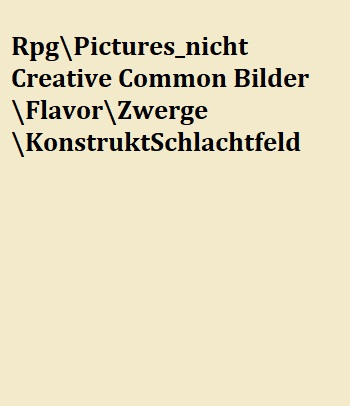

# Konstrukte

### Die Völkerbeziehungen der Rasse

Während die meisten Völker Zwerge nur als Fahrende Händler oder an deren Wohnsitzen als Marktplatz kennen, pflegen die Rah Akari einen besonderen Handel insofern das eine ihre Hauptverteidigungen ,die Konstrukte, von den Zwergen kommen.

## Konstrukte

Diese Wunder Mechanischer Handwerkskunst stellen den Zenit der Zwergischen Innovation dar. Sie sind aufgrund ihrer Religösen Ansichten als einziges Volk in der Lage diese teils Tonnenschweren Kollosse zum Leben zu erwecken. Die Konstrukte existieren in allen Formen und Farben und decken jeden nur möglichen Arbeitsbereich ab. So stellen sie zum Beispiel einen der schlagkräftigsten Teile des Rah Akari Heeres dar, Werden von Zwergenkarawanen zum Transport von tonnenschweren Waren benutzt und sind gleichzeitig mit schweren Ballisten bestückt. Fast jede Tätigkeit die ein Konstrukt übernimmt könnte genauso gut durch ein Tier, eine schlichte Mechanik oder einfach nur durch eine Person übernommen werden. Doch Konstrukte bieten neben vielen anderen Vorteilen einen bestimmten, bedinungslose Loyalität.

### Kontrolle über Konstrukte

Kein Konstrukt wird seinen Meister Willentlich hintergehen denn sie sind in ermangelung von eben diesem. Wer einem Konstrukt befehle geben kann wird klar geregelt durch einen so genannten Meisterstein dieser wird zusammen mit dem Konstruktkern erschaffen und erhält dabei ein rein zufälliges und einmaliges Muster. Dieses Muster steht in Resonanz mit dem Kern, der das gleiche Muster trägt. Die Reichweite dieser Resonanz ist dabei jedoch begrenzt, doch innerhalb dieser Reichweite führt das Konstrukt jeden Befehl aus der vom besitzer des Meistersteins gegeben wird, dabei muss dieser Befehl nicht laut gesagt werden, ein explizieter Gedanke reicht bereits dafür, dies erfordert jedoch einiges an Übung, weshalb viele Nutzer es bevorzugen dem Konstrukt akkustische Befehle zu geben. So wichtig die Reichweite ist, als Meister sollte man sich da nichts so viele Sorgen machen, sollte ein Konstrukt die Reichweite verlassen so durchläuft das Konstrukt die aktuelle Routine fertig / den Befehl anschließend startet das Konstrukt automatisch eine vorher bestimmte "AFK Routine" die "Away From Konstruct Routine". Der Meisterstein trotz seines namens kann vielerlei Form haben, da das Muster erst bei der Erschaffung des Kerns aufgeprägt wird. Mögliche Meistersteine wären so zum Beispiel ein Amulett, Armreif oder tatsächlich ein verzierter Stein oder in ganz seltenen Fällen kann von Meistern ihres Handwerks das Muster sogar auf die Haut als Tattoo aufgetragen werden. Solche Tattoos bringen Vorteile wie Nachteile, so ist es quasi unmöglich die Kontrolle über das Konstrukt zu übertragen im Gegenzug ist es jedoch auch quasi unmöglich den Meisterstein von seinem Besitzer zu entwenden, dies wird also nur von den Misstrauischten genutzt. Zu beachten ist jedoch das die Nutzung von Konstrukten pro Meister limitiert ist denn zu viele Meistersteine unter einem Meister stören sich bei der Resonanz gegenseitig.

### Die vielfalt der Möglichkeiten

Konstrukte unterscheiden in vielerlei Art. dabei werden grundsätzlich nur Grenzen durch die Handwerkskunst und die Kreativität seines Erbauers gesetzt. Angefangen beim **Konstruktkern**, dieses Herzstück eines jeden Konstrukts bestimmt die späteren Anwendungsgebiete eines Konstrukts denn im gegensatz zu anderen Teilen des Konstrukts ist dieser später nicht mehr zu verändern. In die Kerne wird dabei nicht direkt ihre Aufgabe eingeprägt viel mehr stellt der Kern den möglichen Speicher und die Energiequelle dar, je besser der Kern desto mehr und Komplizierte Befehlte kann das spätere Konstrukt ausführen. Sogar selbst ständig mehrere Funktionen aneinander Reihen um den Befehl erfolgreich auszuführen. Konstruktkerne unterscheiden sich generell in ihrer Größe und ihrer Reinheit, generell gilt je größer ein Kern ist desto aufnahmerfähiger ist er benötigt aber auch entsprechend mehr Essenzen, sollte der Platz der für den Kern zur Verfügung steht limitiert sein so gäbe es ein weiterers Stellrad das bedient werden kann die Reinheit diese ermöglicht einen Kern bei gleicher Aufnahmefähigkeit zu verkleinern jedoch benötigt dieser Prozess deutlich mehr Essenz. Weiters existieren unterschiede in der Panzerung, wie man sich gut vorstellen kann ist ein Wesen dass auf Grund seiner Natur bereits ausschließlich aus Metallen besteht bereits gut gepanzert was bereits zu einem hohen Verteidigungswert führt, jedoch sind Teile des innenleben der Konstrukte aufgrund ihrer Filigranen und Präzisen Struktur leicht zu zerstören. Dies kann durch zusätzliche Panzerung an den Empfindlichen Stellen des Konstrukts verhindert werden, erhöht aber auch das Gewicht und den Preis. Neben diesen Merkmalen gibt es natürlich noch zwei Offensichtliche, die Ausstattung und der Grundaufbau. die Ausstattung ist maßgeblich dafür welche Aufgaben überhaupt vom Konstrukt erledigt werden können und diese wird weiter durch den Aufbau des Konstrukts unterstützt.

### Konstruktarten

Grundsätzlich werden Konstrukte in fünf Klassen sortiert.

#### Utility:

Konstrukte dieser Klasse sind hauptsächlich in Reichen Zwergen Haushalten anzutreffen, sie erfüllen Zwecke die auch ein Angestellter hätte verrichten können sind dabei aber deutlich Diskreter. Aufgabenfelder reichen hierbei von Handwerklichenaufgaben wie der Errichtung und Pfelge von Gebäuden bishin zu Verwaltungsaufgaben. Generell dienen sie zur Verbesserung der Lebensqualität. Die verwendenten Kerne sind meist nicht sehr groß und auch nicht sehr rein. Sie sind der Ausdruck purer Dekadenz. 

#### Transport:

Sowohl über als auch unter der Erde müssen oft größere Menge Ware oder große Lasten bewegt werden, hier für gibt es allerlei Möglichkeiten, die beste stellt natürlich auch hier wieder ein Konstrukt dar, hier ein Beispiel wo würden sie ihr Bargeld lieber aufbewahren, in einer Satteltasche eines Tieres das bereits für seine Sturheit und widerwilligkeit bekannt ist oder im Tresor im inneren ihres Loyalen Gefährten der ihnen ohne zu zögern in den Wurmfall folgen würde. Diese Konstruktklasse unterscheidet sich stark in ihren Ausführungen obwohl sie doch alle das gleiche Ziel haben, von der Anzahl der Beine, Panzerung und nützliche Gadgets ist allen voran natürlich die mögliche Traglast ausschlaggebend. Diese Konstrukte werden oft von den Oberflächen Zwergenkarawanen genutzt, in ihnen kann alles von mystischen Bestien bis Edelsteinen alles sicher Transportiert werden, oft werden diese dabei neben nützlichen Gadgets auch mit Waffen ausgestattet die dann von der Besesatzung genutzt werden können.

#### Kampf:

> Ich dachte nach Jahren auf all den Schlachtfeldern hätte ich alles gesehen, doch als meine Jungs von diesen vierarmigen Teufeln zerrissen wurden lief mir ein Schauer über den Rücken, kein Zucker überkam dieses Ungetüm als der alte Joshua es mit dem Kriegshammerschlug und keiner als es ihn in der Mitte Teilte.
>
> --- Abiter Kox Söldner Kapitän über eine Vorstoß Schlacht gegen die Rah Kari

Nichts ist auf einem Schlachtfeld effizienter als ein Nahkampf Konstrukt mit dem einfachen Befehl den Feind zu töten. Jeder weis nie ist der Mensch kreativer als im Krieg, die effektive zerstörung anderer scheint die Kreativität zu beflügeln und nichts ist effizienter als ein Konstrukt für diese Aufgabe. Die Panzerung scheint für viele Gegner oft undurchdringlich doch kaum ist man durch diese Panzerung gebrochen sind die meisten Konstrukte sehr zerbrechlich, doch dies stellt bereits eine Mammut Aufgabe dar. So hart der Kampf gegen sie ist so sehr kann sich die Belohnung auch sehen lassen, sollte der Konstruktkern unbeschädigt bleiben und der Meisterstein ergattert können beide auch ohne das Konstrukt zu einem hohen Preis an Zwergenclans verkauft werden, da diese ja wiederverwendbar sind.

Ein Fernkampf Konstrupt ist weit weniger adaptiert für den Nahkampf jedoch nicht zu unterschätzen zwar langsamer aber immer noch schlagkräftig, bestückt mit Ballisten oder Armbrüsten sind sie selbst auf große entfernung Tödlich. Zu beachten ist das beim Fernkampf deutlich mehr Ressourcen des Konstruktkerns beansprucht werden als es beim Nahkampf der Fall ist, schlicht auf Grund der höheren Komplexität.

#### Ornate Krieger:

Diese Konstrukte sind im Grunde nur Kampfkonstrukte jedoch nicht mit den herkömmlichen zu vergleichen, ihre Geschmeidigkeit und fließenden Bewegungen ohne Verluste in ihrer Stärke. Die Kerne dieser Konstrukte sind deutlich größer und auch reiner als die ihrer weit häufiger anzutreffenden Verwandeten. Durch die höheren Kapazitäten können genauere Bewegungsabläufe programmiert werden und den Konstrukten sogar eine art gefühl für Taktik geben um sich der aktuellen Kampf situation anzupassen.

Das bekannteste Beispiel für die Verwendung dieser Klasse stellen die Tempelwachen der Rah Kari dar.

#### Titan klasse Konstrukt:

Diese Klasse ist die seltenste von ihr existieren selbst in den Aufzeichnungen nur eine handvoll Modelle. Diese teils riesigen Schöpfungen Tragen Kerne unglaublicher Ausmaße und immenser Reinheit in sich. Man möchte sich nicht ausmalen wie viel Essenz in die Erschaffung eines solchen Kernes gefloßen sein müssen, ganze Völker vom Angesicht der Erde getilgt. Was diese Konstrukte Gefährlich macht ist nicht Primär ihre Größe, Schlagkraft oder "Intelligenz" von denen alles in Maße vorhanden ist sondern viel mehr die Ausdauer. Ein jeder Militärstratege weis das Konstrukte gefährlich sind aber auch zerstört werden können wenn man ihre Rüstung durch dringt, dass mag auch hier Wahr sein, doch haben die gewitzten Erfinder dafür eine Lösungen gefunden. Die Konstrukte werden von vielen kleinen Konstrukten bewohnt, alle mit nur einem einzigen permaneten Befehl programmiert das Titanklasse Artefakt zu reparieren. Doch selbst diese benötigen auf Grund ihrer geringen größe, Kerne von großer Reinheit zwar wird Kapazität gespart durch die permanent Installation des Befehls jedoch ist dieser immer noch hoch Komplex und erfordert stets mehrere Schritte.

### Bau

Was diese Konstrukte antreibt ist ein sogennanter Konstruktkern diese existieren in verschiedenen Größen und Reinheiten und werden mithilfe der Seelen von empfindsamen Wesen erschaffen. Je größer und reiner desto mehr Essenz wird benötigt, von diesen Stellschrauben hängt die spätere "Intelligenz" der Konstrukte ab da diese quasi die Speichergröße festlegen. Man munkelt die reinsten und größten Kerne können ein Bewusstsein entwickeln doch diese Theorie konnte bisher nicht bewiesen werden.

Um die Seelen für die teure Schaffung von Konstrukten zu besorgen gibt es für Oberflächenzwerge ein besonderes Werkzeug -- den Seelenfänger -- im Prozess die Seelen einzufangen müssen die Körper verbrannt werden. Dies stellt in einer Zwergenstadt mit einem Vulkan oder einer Schmiede kein Problem dar, für unterwegs ist das allerdings eher schwer zu bewerkstelligen. Daher kommt der Seelenfänger mit einer Phiole gefüllt mit einem hochbrennbaren spezial Öl zur schnellen Einäscherung von Leichen. Dieses Öl wird von Enzymen des Feuerorgans der Linddrachen gewonnen, es produziert stetig neues Öl, diese verbrauchen sich jedoch auch mit der Zeit.

Die Inspiration für diese Wunderwerke fanden die Zwerge in den Überbleibseln von Forrunner Technologie, jedoch können selbst ihre heutigen meisterwerke den damaligen nicht das Wasser reichen.

##Aufbau Ingame

Konstrukt Kern gibt die Maximalen Stats die ein Konstrukt erreichen kann vor
Akku gibt die Ladungsmenge an die ein Konstrukt speichern kann
Gließmaßen / Bauteile geben die tatsächlichen Stats an bis zum Cap durch den Kern
Konstrukt waffen / Optionen diese sind die möglichkeiten des Konstrukts seine Akku Ladungen zu verbrauchen

### Akku

### Batterien
zum aufladen des Akkus ohne Pausen, one use consumable
in verschiedenen Größen verfügbar

benötigt Material und Essenzen

chassis / corpus stats, nicht lvl / austausch
kern levelbar in downtime, max stats, skills
batterie / akku nicht lvl / austausch
attachments, nicht tauschbar, gliedmaßen
konstrukt waffen verbrauch ladungen

exponentiell steigende kosten

Vehicel Skill
