---
---
---

# Installation und Nutzung von Orbis Astea

```{r, eval=FALSE}
dfDMAppArgs = read_excel("BookdownData/DMAppParameter.xlsx")


getargs = function(Tab){
  
  tab = dfDMAppArgs %>% filter(Tab == Tab) %>% 
    arrange(Position) %>% 
    select(Befehl, Parameter, Beschreibung) %>% 
    reactable(groupBy = "Befehl",
              columns = list(
                
                Befehl = colDef(
                  grouped = JS("function(cellInfo) {
                            return cellInfo.value
                          }")
                  
                )
              ), bordered = F,
              highlight = T, showPageSizeOptions = F,
              defaultPageSize = 17,
              theme= overallThemeReactable, 
              defaultColDef = colDef(
                align = "center"
              ), outlined = T,
              striped=T, filterable = T)
  
  return(tab)
  
}
```

Das nachfolgende Kapitel gibt einen Überblick und eine Einführung in die Funktionalität des Orbis Launchers und somit der gesamten Bandbreite des Erlebenisses von Orbis Astea. Hierbei wird eine jede Person an die Hand genommen, welche die ehrenvolle Aufgabe übernimmt, als DM fungieren zu wollen.

Bei der Anwendung des Orbis Launchers handelt es sich um ein Programm, welches es ermöglicht, eine Pen&Paper Kampagne zum Leben zu erwecken. Das Programm bietet die Möglichkeit die Spieler-charaktere vollumfassend einzuladen, die Spieler gegen Monster aller Art kämpfen zu lassen, Tiere zu zähmen, Gegenstände zu schmieden, Pflanzen zu sammeln und daraus Tränke zu brauen, auf hohe Seefahrt zu gehen und Schiffe zu lenken, ebenso wie soziale Überzeugungsarbeit und andere intrigante Vorgehensweisen, wie das Vergiften von Charakteren oder deren Tod durch ein Attentat zu ermöglichen. Da die Funktionalität teilweise so breit aufgestellt ist, wie es Handlungsmöglichkeiten in der Realität gibt, soll dieser Artikel ein Verständnis dafür geschaffen, welche Möglichkeiten das Programm bietet und Anleitungen dafür bieten, wie diese genutzt werden können.

Am Ende dieses Guides sollen sich alle DMs und jene, die es werden möchten, darin auskennen, den Orbis Launcher zu bedienen und ebenso wissen, wo sie gezielt Informationen finden können, um die eigene Kampagne zum Leben zu erwecken.

Sollten auch nach Lesen dieser Anleitung noch Fragen oder Anmerkungen offen sein, freuen wir uns über Deinen Input zur Verbesserung unseres Spielerlebnisses mit einer Mail an [orbisastea\@gmail.com](mailto:orbisastea@gmail.com){.email}.

Für alle Interessierten, die mehr darüber erfahren möchten, wie der Orbis Launcher programmiert wurde, gibt es [hier](#TechnischerHintergrund) die Möglichkeit dazu.

## Installation {#DMAppDownload}

Beginnend beim Zugang zum Orbis Launcher, also der Anwendung, die das Spielen Orbis Asteas ermöglicht. Die Installation von Orbis ist an sich eine leichte Sache. Auf der [Homepage](https://svalv.github.io/Orbis/index.html) von Orbis Astea, gibt es oben links die Möglichkeit über den Download-Button eine Zip-Datei herunterzuladen. Alternativ kann man [hier klicken](https://svalv.github.io/Orbis/DownloadContainer/OrbisGame.zip).


Diese Zip-Datei kann in einen beliebigen Zielordner verschoben werden, wo sie auch entpackt wird. Dazu die Zip-Datei mit einem Rechtsklick auswählen und "Hier entpacken" wählen. Danach sollten zwei Ordner im Zielordner erscheinen: *OrbisGame* und *Orbis Launcher*.

### Ordner OrbisGame {#OrbisGame}

Der Ordner "OrbisGame" sollte die drei Ordner *Container*, *SessionOrganisation* und *ZZZ Character Sheets* enthalten. Der "Container"-Ordner enthält alle Excel-Dateien, die die App benötigt, um später richtig zu funktionieren. Dazu gehört die Liste aller Gegenstände im Spiel, Waffen, Rüstungen, aber ebenso die vorgefertigten Profile, die später in diesem Guide noch ausführlich erklärt werden. Der "SessionOrganisation"-Ordner enthält den Ordner, in dem die [Session Backups](#SessionBackup) geladen werden, den Ordner Pflanzen, welcher die Excel-Liste der gesammelten Pflanzen der Blumenmädchen enthält, sowie die Excel-Datei ["lootliste"](#DMAppLootliste). Werden im Verlauf einer Session [Städte](#DMAppStädteHändler) erstellt, so werden diese ebenfalls in diesem Ordner als Excel-Datei ausgegeben.

Zum vereinfachten [Einladen der Spielercharaktere in das Programm](#DMAppPersonen) ist es ratsam, den Ordner *ZZZ Character Sheets* für alle Spieler zugänglich zu machen. Dies kann bspw. durch die Nutzung einer Cloud - bspw [Dropbox](https://www.dropbox.com) - oder eines geteilten Laufwerks geschehen. Somit hat der DM zu jedem Zeitpunkt Zugriff auf die aktuellste Version der Excel-Datei des Spielers und alle Excel-Dateien werden am gleichen Ort gespeichert.

### Ordner Orbis Launcher und App-Ausführung {#OrbisDMApp}

Um die DM App ausführen zu können, muss die Anwendung im "Orbis Launcher" Ordner gesucht werden. Es handelt sich hierbei in der Spalte Typ um die einzige Anwendung im Ordner:


Diese Anwendung wird mittels Doppelklick gestartet. Hier öffnet sich nun ein Fenster, welches auffordert, einen Ordner auszuwählen. Hier kommt der "OrbisGame" Ordner ins Spiel. Diesen bitte auswählen.

Da es sich bei der App um eine privat programmierte App handelt, kann es zu folgender Fehlermeldung kommen: XXXX

BILD EINFÜGEN

Hier auf "Mehr Informationen" klicken und die Ausführung freigeben.

Um diesen Schritt des Suchens der Anwendung künftig überspringen zu können, empfiehlt es sich, eine Verknüpfung zur Anwendung herzustellen.

Sollten die eben beschriebenen Schritte ausgeführt worden sein und die App lässt sich dennoch nicht öffnen, schaue bitte in das Kapitel [Bekannte Fehler](#BekannteFehler) für weitere Hilfestellungen.

## Nutzung der DM-App

Wenn die App gestartet wird, solltet ihr beim Umgebungs-Tab rauskommen. Wichtig ist, dass der nachfolgende Guide eine Übersicht darstellt, die zugleich jeden Tab mit den Subtabs erklärt. Er dient somit einem Überblick und einer fundierten Einführung in die Nutzung der DM-App. Aus diesem Grund wird die Erklärung der Tabs entsprechend der Nutzung der DMApp erläutert und entspricht nicht der Tab-Reihenfolge innerhalb der App selbst. Hilfreich ist auch die, in die Benutzeroberfläche integrierte, Funktion, dass mit dem Maus-Pfeil über ein Element drüber gehovert werden kann, wodurch Hinweise darauf gegeben werden, welche Einstellung mit diesem Element getroffen werden kann.


### Erstellung {#DMAppErstellung}

Am Anfang der Anwendung steht der Erstellungs-Tab: Damit Ritter, Orks und Riesenspinnen gegeneinander kämpfen oder miteinander tanzen können, müssen sie erstmal in die DM-App eingelesen werden. Dies kann im Tab "Erstellung" gemacht werden. Hier werden alle Personen, Tiere, Monster und alle weiteren Akteure initialisiert, die im Rahmen der Session zum Einsatz kommen. Dazu gehören auch [Fahrzeuge](#Fahrzeuge), [Konstrukte](#Konstrukte), [Strukturen](#Strukturen) und Listen.

#### Personen {#DMAppPersonen .unnumbered}

Im ersten SubTab "Personen" können bereits vorgefertigte *Profile* aus dem [OrbisGame Ordner](#OrbisGame) und die Excel-Dateien der Spieler eingeladen oder ein NPC spontan selbst erstellt werden.

##### *Profile* {#DMAppPersonenProfile .unnumbered}


Es empfiehlt sich den Profilen Namen zu geben, die eindeutig, aber kurz sind. Diese Namen müssen für verschiedene Aktionen händisch eingetragen werden. Es empfehlen sich daher beispielsweise für einen Adligen Namen wie "a". Namen wie "Adel", die einer vermeintlich klaren Kennzeichnung der Profile dienen, können im späteren Spielverlauf dafür sorgen, dass der administrative Aufwand, besonders bei vielen verschiedenen Akteuren, stark steigt. Aus diesem Grund lohnt es sich auch, sich vorab Gedanken darüber zu machen, wie welcher Akteur benannt werden soll. Im Zweifelsfalls ist es jedoch auch nicht allzu schlimm, wenn vergessen wird, welches Profil oder Monster wie benannt wurde, da dies jederzeit im [Elemente-Tab](#DMAppElementeShow) eingesehen werden kann.

Unter "Profil" kann aus der gesamten Profil-Datenbank geschöpft werden. Diese kann im [OrbisGame Ordner](#OrbisGame) eingesehen und ergänzt werden, indem die Ordner "Container" --\> "Data" ausgewählt und die Excel-Datei "Profiles" geöffnet wird. (Details zur Erstellung eigener vorgefertigter Profile gibt es [hier](#ProfilErstellungDatenbank) eine Anleitung.) Wird ein spezielles Profil, wie ein Gastwirt, gesucht, so kann der Anfangsbuchstabe des Profils eingegeben werden, während das Dropdown-Menü ausgewält wurde. Die Anzahl bestimmt, wie viele der Profile erstellt werden. Somit kann Zeit gespart werden, wenn die Spieler bspw. auf eine Gruppe Ritter oder Banditen stößt. Wird eine Vielzahl von Akteuren eines Profils initialisiert, so nummeriert das Programm die Namen automatisch durch.


Die Check-Box *Zufallsfaktor* steht dabei für die Möglichkeit, eine zufällige Abweichung der Charakter-Ausprägungen hinsichtlich der Attribute, Fähgikeiten und Ausrüstung einzuführen. Wird diese Box nicht ausgewählt, so verfügen alle reingeladenen Profil über jene Merkmalsausprägungen, wie sie in der Excel-Datei festgelegt wurden. Wird der Zufallsfaktor gewählt, so variieren die Ausprägungen nach oben und unten. Dies hat den Vorteil, dass eine Gruppe geladener Profile so diversifiziert dargestellt werden kann, wie sie es in der Realität vermutlich auch wäre.

Durch das betätigen des "Erstellen"-Buttons, wird das Profil initialisiert. In der Box auf der rechten Seite gibt das Programm die Meldung aus, ob die Initialisierung erfolgreich verlief.

##### *PC* - Spielbare Charaktere {#DMAppPersonenPC .unnumbered}

Der SubTab *PC* steht für die spielbaren Charaktere. Hier können also die Profile der Spieler der Session eingelesen werden. Auch hier lohnt es sich, die Namen kurz und prägnant zu wählen. Wird ein Name eingegeben und der "Erstellen"-Button gedrückt, so öffnet sich ein neues Fenster, welches dazu auffordert die Excel-Datei des Spielers im *ZZZ Character Sheets*-Ordner auszuwählen.


Wird eine Excel-Datei ausgewählt, so wird der Charakter automatisch eingeladen. Auch hier wird in der Box auf der rechten Seite eine Meldung ausgegeben, die "*Name* erfolgreich initialisiert" lautet, wenn alles funktioniert hat.

##### *Npc* - nichtspielbare Charaktere {#DMAppPersonenNpc .unnumbered}

Möchte ein DM selbst auf die Schnelle eine Person erstellen, welche über bestimmte Fähigkeits- und Attributsausprägungen verfügen soll, so gibt es die Möglichkeit einen *Npc* (non-player character) zu erstellen.

Die Auswahlmöglichkeiten die Fähigkeiten festzulegen orientiert sich an den Sub-Tabs des Spiele-Tabs. Während die [Attribute](#Attribute) einzeln eingestellt werden können, werden die [Fähigkeiten](#Fähigkeiten) in Bereiche zusammengefasst.


Als Erinnerung: Der Name "Beispiel" dient hierbei nur der Veranschaulichung des Beispiels und wird nicht als Akteur-Name im Spiel empfohlen.

*Kampf* umfasst alle Fähigkeiten, die mit dem Kämpfen zu tun haben und wie im Tabellenblatt [Status](#Status) unter Kampf aufgeführt sind. Hierzu gehören das Reiten, Nahkampfwaffen, Unbewaffnet, Blocken, Artillerie, Fernwaffen, Werfen und Ausweichen.

Eine Übersicht darüber, welche Fähigkeiten zur jeweiligen Übergruppe (Schurke, Sozial, Fortbewegung, Intelligenz und Utility) zugehörig sind, findet sich in der nachfolgenden Abbildung.


*sigmaSkills* steht für die Abweichung der einzelnen Skills innerhalb der Überkategorien. *sigmaAttr* sorgt für eine Variation innerhalb der Attributpunkte. Dies ist besonders hilfreich, wenn mehrere NPCs erstellt werden sollen oder allgemein ein Zufallsfaktor von Interesse ist.

Soll ein NPC über ein Reittier verfügen, so kann dieses im zugehörigen Dropdown-Menü ausgewählt werden. Dies ermöglicht beispielsweise den [Kampf vom Reittier](#KampfVomReittier), oder Vorteile in der Fortbewegung durch einen größeren [Bewegungsradius](Bewegungsradius) mit sich bringen. Soll ein Rettier-loser NPC erstellt werden, so ist unter Rettier die Dropdown-Menü-Option *None* zu wählen.

Unter *Waffe* kann eine Auswahl aus allen zur Verfügung stehenden Waffen getroffen werden. Zur vereinfachten Suche ist es möglich, den Anfangsbuchstaben der Waffe einzugeben und somit direkt im Alphabet dorthin zu gelangen. Das *Schild* bietet die Auswahlmöglichkeiten für die Verteidungsoption des Blockens.

#### Monster {#DMAppMonster .unnumbered}

Alle weiteren Kreaturen, Strukturen und Objekte lassen sich erstellen, indem der jeweilige Tab durch das Anklicken ausgeklappt wird.


Für Monster einfach den *Monster*-Tab auswählen. Hier muss lediglich der Name des Monsters im Namensfeld eingegeben, im Dropdown-Menü bei Monster-Profil das gewünschte [Monster](#Monster) ausgewählt und die Anzahl der zu erstellenden Monster eingegeben werden. Ob die Initialisierung des Monsters erfolgreich verlief, ist dem Kasten auf der rechten Seite zu entnehmen. Es empfiehlt sich vorab mit den Eigenheiten der vereinzelten [Monster](#Monster) vertraut zu machen, um diese optimal nutzen zu können und Spielern, mit eventuellen [Wissensfähigkeiten](#Wissensfähigkeiten), wertvolle Hinweise geben zu können.

Sollen eigene Monster Teil des Spiels sein, so müssen diese in der Datenbank ergänzt werden. Wie das geht kann [hier](#ProfilErstellungDatenbank) nachgelesen werden.

#### Tiere {#DMAppTiere .unnumbered}

Die Erstellung von Tieren gleicht der der [Monster](#DMAppMonster), bis auf den Unterschied, dass es hierbei die Möglichkeit gibt, einen Besitzer einzutragen. Dieses Feld ist auszufüllen, wenn ein Spieler beispielsweise ein Tier kauft, oder mittels [Tierhandhabung](#tierhandhabung) zähmt. Entscheidet sich ein Spieler für diese Option, so muss er das dazugehörige Tierprofil-Tabellenblatt in seine Charakter-Excel-Datei integrieren. Besitzt ein Spieler ein eigenes Tier,

XXXX überlegen, wo wir diese Anleitung einbauen, um sie hier zu verlinken XXXX

#### Konstrukte {#DMAppKonstrukte .unnumbered}

[Konstrukte](#Konstrukte) können zum einen eingelesen werden, wenn ein Spieler oder DM bereits ein eigenes Konstrukt-Profil erstellt hat, oder ein neues Konstrukt kann für die Session erstellt werden soll.

Zum Einlesen muss ein Name für das Konstrukt, sowie des Spielers (unter Besitzer) eingetragen werden, wenn dieses einem Spieler gehört. Ebenso ist ein Konstrukt-Proil einzulesen. Für die Erstellung eines Konstrukts können alle Details selbst bestimmt werden. Auch hier gibt es die Möglichkeit einen Besitzer zuzuordnen. Das Core-Level gibt die Stärke des Konstruktkerns an. Die Ladungen stehen für die Anzahl an Aktionen, die ein Konstrukt ausführen kann.

Eine Erklärung der einzelnen anderen Auswahlmöglichkeiten findet sich im Abschnitt [Npc](#DMAppPersonenNpc) oder durch drüber hovern über das jeweilige Feld.

#### Schiffe, Wägen und sonstige Fahrzeuge {#DMAppFahrzeuge .unnumbered}

Schiffe, Wägen und andere Fahrzeuge können unkompliziert aus der Liste ausgewählt und benannt werden. Wichtig ist zu verstehen, dass der Erfolg des Manövrierens von den [Vehikel-Fähigkeiten](#VehikelFähigkeit) des Kapitäns/Fahrers abhängt. Ebenso ist für manche Fahrzeuge, wie Schiffe, relevant, wie gut die Crew an Board ist. Eine schlechte Crew, wird einige Probleme haben Manöver auszuführen und somit geringere Erfolge verbuchen als eine Crew, die mittelgut oder vielleicht auch schon erfahren ist. Eine meisterliche Crew ist ein eingespieltes Team, wo ein Handgriff in den anderen übergeht und sich die Crew-Mates blind vertrauen.

#### Strukturen {#DMAppStrukturen .unnumbered}

Strukturen umfassen Mauern, Wände und andere Vorrichtungen, die zum Schutz sowie zur Deckung gegen [Fernkampfangriffe](#DMAppKampfFernkampf), oder Angriffe gegen [Wurfwaffen](#DMAppKampfWurfwaffen) herangezogen werden können. Diese können aus der vorgegebenen Liste gezogen, oder aber auch selbst erstellt werden. Eigene Strukturen verfügen über ein Gesundheitsmaximum (Leben) und eine Rüstung. Die Rüstung blockt einen gewissen Schaden durch Angriffe und verringert somit, wie viel Leben die gewählte Struktur verliert. Verliert eine Struktur ihr gesamtes Leben, so gilt diese als zerstört und kann keinen weiteren Schutz für Spieler zur Deckung bieten. Das Programm entfernt das erstelle Profil bei Zerstörung automatisch aus den geladenen Listen.

#### Listen {#DMAppListen .unnumbered}

XXXX ist noch zu überarbeiten

### DM-Übersicht {#DMAppDMUebersicht}

Die DM-Übersicht gibt die wichtigsten Informationen zu den Akteuren, die im Erstellungs-Tab eingeladen wurden und erlaubt es, sie gleichzeitig diese bis zu einem gewissen Grad zu modifizieren.

Dabei ist die DM-Übersicht so aufgebaut, dass auf der linken Seite die vier Tabs *Beschreiben*, *Status*, *Zurücksetzen* und *Löschen* aufgeführt sind. Auf der rechten Seite befinden sich die beiden Tabs *Elemente* und *Show-Tab*, wie der nachfolgenden Abbildung zu entnehmen.

#### Elemente- und Show-Tab {#DMAppElementeShow .unnumbered}


Der Elemente-Tab zeigt dabei an, welche Akteure bereits eingeladen wurden. Hier gibt es zur Übersicht Informationen zum Namen, einer Beschreibung, um welches Profil es sich handelt, und dem Typ des Akteurs. Im oben gezeigten Beispiel handelt es sich um verschiedene Profile, die im Rahmen eines Testlaufs eingelesen wurden. Der Show-Tab übernimmt eine wichtige Rolle im Zusammenhang mit dem Tab *Beschreiben*.

#### Beschreiben {#DMAppBeschreiben .unnumbered}

Der Beschreiben-Tab bietet die Möglichkeit die wichtigsten Werte eines Charakters und seiner Excel-Datei angezeigt zu bekommen. Bei Objekt wird ausgewählt welcher Akteur genauer angeschaut werden soll. Hier kann man alle Objekte auswählen, die im Programm mittels Erstellungs-Tab bereits eingeladen wurden. Dafür kann im Dropdown-Menü der jeweilige Akteur ausgewählt werden, der von Interesse ist. Unter *Unterobjekt* kann ausgewählt werden, was im Detail angeschaut werden soll. Hier kann man das Objekt selber auswählen, was alle Informationen umfasst, die es zu einem Akteur gibt, oder alle aktive Waffen wie Rüstung oder Waffen. Besitzt ein Akteur ein Tier, so gibt es auch die Möglichkeit die [Loyalität](#loyalität) sowie die [Tier-Fähigkeiten](#erlernbare-fähigkeiten) anzuschauen. Nach Festlegung der Details, die ausgegeben werden sollen sowie des Klickens des *Show*-Buttons, werden die geforderten Informationen im Show-Tab auf der rechten Seite ausgegeben.


#### Status {#DMAppStatus .unnumbered}

Möchte der DM schnell prüfen, wie viel Gesundheit und Ausdauer ein Charakter hat, oder ob es irgendwelche [Statuseffekte](#damage-over-time), wie Vergiftungen, gibt, so gibt es die Möglichkeit den gewünschten Akteur unter Objekt auszuwählen und sich diese Informationen im darunter liegenden Feld ausgeben zu lassen.


#### Zurücksetzen {#DMAppZuruecksetzen .unnumbered}

Wurde beispielsweise ein Angriff unbeabsichtigt ausgeführt, so kann mittels *Zurücksetzen* dieser Fehler rückgängig gemacht werden. Wichtig ist jedoch, dass diese Funktion nur ein Objekt zurücksetzt! Bei einem fehlerhaften Angriff müssen die beteiligten Objekte separat zurückgesetzt werden. Wichtig ist, dass alle beteiligten Akteure einzeln zurückgesetzt werden müssen. Dies bedeutet im Falle eines Angriffs des Akteurs A auf ein Opfer B, dass sowohl das Objekt A als auch B separat ausgewählt werden müssen, um verlorene Ausdauer und Gesundheit wieder zurück zu gewinnen.


Um zu überprüfen, ob die Gesundheit eines Spieler wiederhergestellt wurde, kann zusätzlich unter [Status](#DMAppStatus) oder [Beschreiben](#DMAppBeschreiben) überprüft werden, welche Werte dem Akteur zugeschrieben werden.

#### Löschen {#DMAppLoeschen .unnumbered}

Sollen ein oder mehrere Objekte gelöscht werden, so können diese im Löschen-Tab entfernt werden. Hierfür müssen lediglich die Namen der betroffenen Objekte *händisch* in das Eingabefeld eingefügt werden. Jedes Eingabefeld, das ein *(L)* hinter dem Elementnamen enthält, umfasst die Möglichkeit mehrere Akteure aufzuzählen. Diese sind mit einem Komma voneinander zu trennen.


In der nachfolgenden Abbildung ist zu sehen, wie mehrere Objekte in eine Liste eingetragen werden können und dass deren Löschung automatisch zu einer Entfernung der Objekte aus dem Elemente-Tab führt.


### Umgebung {#DMAppUmgebung}

Die Umgebung ermöglicht es dem DM, die Spielumgebung von Orbis Astea mitzugestalten und spezielle Charaktere zu erstellen, mit denen Spieler interagieren können. Meistens werden die Umgebungsfunktionen zu Beginn einer Sitzung verwendet, um Szenarien für die Spieler vorzubereiten. Hierzu gehört das Bestimmen der Wetterbedingungen.

Damit der DM generell mit den verschiedenen Umgebungs-Tabs starten kann, muss zunächst eine Region ausgewählt werden, da sich dies auf einige Tabs auswirkt. Bei der Bestimmung des Wetters macht es zum Beispiel einen großen Unterschied, ob sich das Gebiet im Norden, wie dem Eisland, oder im Süden, wie die Eisenrote Wüste, befindet.

#### Wetter {#DMAppWetter .unnumbered}

Wurde bereits ein Gebiet ausgewählt, muss nur noch die Tageszeit und die gewünschte Jahreszeit bestimmt werden. Im Anschluss muss man lediglich das Kästchen auf der rechten Seite auslesen, um zu sehen, wie das Wetter ist.


#### Städte und Händler {#DMAppStädteHändler .unnumbered}

Städte und Händler sind im Vergleich zum Wetter etwas informativer, aber nicht viel schwerer zu verstehen. Bei Stadt wird die Voreinstellung als allgemeine Variable angesehen, die alle Optionen bei verschiedenen Händlern betrifft. Wenn beispielsweise ein Dorf ausgewählt wird, gibt es nur einen allgemeinen Verkäufer, 2 Gastwirte und 6 Blumenmädchen, die jeweils einen kleinen Bestand an Gegenständen haben, die sie an die Spieler verkaufen können. Im Vergleich dazu hat eine Stadt viel mehr verschiedene Händler mit größerem Inventar, aber weniger Blumenmädchen. Es ist jedoch wichtig zu beachten, dass die Voreinstellungen zur Bestandsgröße und die Anzahl der Anbieter immer verändert werden können, indem man einfach auf das Kästchen daneben klickt und die gewünschten Einstellungen auswählt. Wenn alle Einstellungen gewählt wurden, kann der *Go*-Button gewählt werden. Sobald die Erstellung fertiggestellt ist, zeigt das Kontrollkästchen und dem Button *Fertig* an.


Danach sind alle Händler im Ordner „OrbisGame" unter „SessionOrganisation" in der Excel-Datei „downtimestadt" zu finden.


Wenn man nur einen einzelnen Händler generieren möchte, ist dies auch im *Händler*-Tab möglich. Hier muss lediglich die Art des Händlers und die Menge der Gegenstände ausgewählt werden. Die ermöglicht es zum einen direkt einen Einblick in die Inhalte des Inventars des Händlers zu bekommen:


Anschließend ist der Händler ebenfalls im Ordner "SessionOrganisation" zu finden. Somit ist die Excel-Datei auch für die Spieler zugänglich.


#### Ereignisse {#DMAppEreignisse .unnumbered}

Der Ereignisse-Tab ermöglicht es zufällige Begegnungen zu generieren, ohne, dass der DM diese selbst erfinden muss. Hierfür muss lediglich ausgewählt werden, ob das Ereignis in einer Stadt oder auf dem Weg zwischen zwei Orten stattfinden soll. Das Szenario wird vom Programm in der Box auf der rechten Seite ausgegeben und wird aus einer Datenbank verschiedener Ereignisse gezogen.


Es lohnt sich vor dem Vorlesen des Ereignisses, den Text kurz durchzulesen. Wie im Beispiel obendrüber besteht durchaus die Möglichkeit, dass der DM mit der Situation spielen kann. So kann eine Verfolgung der Spieler inszeniert werden, ohne dass dies wirklich der Fall ist. Auf diese Weise können sich neue Handlungsstränge ergeben.

#### Lagern {#DMAppLagern .unnumbered}

Unter Lagern versteht man die Umsetzung des [Pause und Rast Systems](#PauseRastSystem). Wichtig ist, dass unter *Personen (L)* händisch eingetragen wird, welche Profile beim Versuch zu Lagern berücksichtigt werden. Es empfiehlt sich immer, dass der Spieler mit der höchsten Ausprägung der Fähigkeit [Überlebenskunst](#Überlebenskunst) den Versuch für die ganze Gruppe ausführt. Gibt es zum Beispiel Streit zwischen den Spielern in der Gruppe, so kann jede Person für sich selbst ein Lager aufschlagen. Einzustellen sind die Länge, Qualität und Versorger. Der DM kann, aufgrund der Umgebungsvariablen, eigenmächtig entscheiden, welche Qualität verfügbar ist, z.B. schlafen die Spieler draußen im Regen ohne Zelte und Schlafmatratze, dann sind die Bedingungen eindeutig schlecht. Das Ergebnis des Lagerns ist den Spielern durch den DM mitzuteilen, da es hierbei zu einer Verbesserung oder Verschlechterung der Gesundheit und Ausdauer kommen kann.


Die Zustandsveränderung wird vom Programm automatisch für die Profile übernommen. Es empfiehlt sich den Spielern ihre neuen Werte mittels [Status](#DMAppStatus) oder [Beschreiben](#DMAppBeschreiben) im [*DM-Übersicht*-Tab](#DMAppDMUebersicht) zu nennen, damit sie diese im [Status-Tabellenblatt](#Status) vermerken können.

#### Pflanzensammeln {#DMAppPflanzensammeln .unnumbered}

Will ein Spieler zu Beginn einer Session selbst Pflanzen sammeln, muss der DM lediglich definieren, wie gut die Bedingungen dafür sind. Befindet sich der Spieler zum Beispiel in einem Wald in Yondalla, wo die Einheimischen die natürlichen Ressourcen nicht sammeln, dann sind die Bedingungen sehr gut. Befindet sich der Spieler jedoch in einer Wüste, sind die Bedingungen schlecht. Auch steht es dem DM frei, das Pflanzensammeln zu untersagen.


Die Blumen, die der Spieler gefunden hat, sind im *OrbisGame*-Ordner unter *SessionOrganisation* in der Excel-Datei *Pflanzen* zu finden. Dabei wird der Name des Akteurs im Namen des Pflanzenfiles vermerkt, um diese auseinanderhalten zu können, wenn mehrere Spieler Pflanzen sammeln.


#### Textgenerator {#DMAppTextgenerator .unnumbered}

Der Textgenerator ermöglicht es dem DM spontan Geschichten und andere Szenarien zu erstellen. Hierbei wird sich die Funktionalität ChatGPTs zu Nutzen gemacht. In das Feld *Anweisung* muss eingegeben werden, welcher Text generiert werden soll. Ein Beispiel hierfür ist "XXXX". Über die Einstellungsmöglichkeiten kann darüber hinaus gesteuert werden, wie lange und kreativ der Text werden soll. Unter *Model* kann ausgewählt werden, wie viel Zeit in die Textgenerierung fließen soll. "Bestes" ist dabei am zeitaufwendigsten, wenn auch die Qualität am höchsten ausfällt.

Darüber hinaus gibt es die Möglichkeit, den generierten Text durch eine Computerstimme vorlesen zu lassen. Hierfür muss nach Generierung des Textes lediglich der *read*-Button ausgewählt werden.

XXXX Seed und Beispiel einfügen XXXX

### Einstellungen {#DMAppEinstellungen}

Die Einstellungen ermöglichen es dem DM verschiedene globale Spieleinstellungen zu treffen, die die Handhabung des Orbis Launchers individualisiert. Darüber hinaus gibt es in desem Tab die Möglichkeit ein Design für die App auszuwählen, welches den eigenen Präferenzen entspricht, ein Session-Backup zu laden und eine Identifikationsnummer für den [Textgenerator](#DMAppTextgenerator) einzugeben.


Das Programm speichert beim Schließen der App eine Momentaufnahme der Einstellungen, Zustände von Personen, Umgebungsvariablen und weiteres. XXXX

#### *Session Backup* {#DMAppSessionBackup .unnumbered}

Sollte es beispielsweise zu einem Bedienungsfehler, wie das versehentliche Schließen des Fensters, kommen, so kann über diese Option eines der automatischen Backups geladen werden. Diese werden automatisch vom Programm in den Ordner *Orbis Game*, *SessionOrganisation* im Ordner *backupsSession* gespeichert. Hier befinden sich ca. 40 Backups, welche eingeladen werden können. Die Dateien werden regelmäßig überschrieben, wenn eine maximale Backup-Anzahl erreicht wird. Eine manuelle Löschung ist dementsprechend nicht notwendig.

Für das Laden eines Backups muss lediglich der Button *Load Backup* betätigt und die Datei des gewünschten Backup-Zeitpunkts gewählt werden. Dabei ist zu beachten, dass der aktuellste Zeitpunkt nicht zwangsläufig jener ist, der ganz oben angeführt wird.


Nach Auswahl der Datei wird das Backup automatisch geladen. Es empfiehlt sich den Erfolg mittels [DM-Übersicht](#DMAppDMUebersicht) zu überprüfen.

#### *Spieleinstellungen* {#DMAppSpieleinstellungen .unnumbered}

Zur vereinfachten Veranschaulichung werden die Spieleinstellungen in tabellarischer Form erklärt.

| Option                                        | Auswirkung                                                                                                                                 | Standard |
<<<<<<< Updated upstream
|------------------|-------------------------------------|------------------|
=======
|-----------------|--------------------------------------|-----------------|
>>>>>>> Stashed changes
| Called/Advantage nach Angriff zurücksetzen    | Soll nach dem Angriff das Feld für Called Shots und Advantage zurückgesetzt werden?                                                        | Ja       |
| Schwerer Angriff nach Angriff zurücksetzen    | Soll nach dem schweren Angriff die Option schwerer Angriff auf nein zurückgesetzt werden?                                                  | Ja       |
| Setze die Anzahl nach Erstellung auf 1 zurück | Soll nach dem Initialisieren von mehr als einem Objekt gleichzeitig der Anzahl-Counter für das nächste Objekt wieder auf 1 gesetzt werden? | Nein     |
| Limitiere Value and Damage                    | Soll der Damage bei 550 und der Value bei 13 nach oben begrenzt werden? Das ist sozusagen der "safety-mode"                                | Nein     |
| Maximale Rundenbackups                        | Wieviele Aktionen soll man ein Objekt zurücksetzen können? Höhere Anzahl braucht minimal mehr Arbeitsspeicher                              | 6        |
| Initiativtabelle Aktionen zum Weiterschalten  | XXXX                                                                                                                                       | 1        |
| Design                                        | Welches Design soll verwendet werden                                                                                                       | Arcade   |

: Optionen und ihre Bedeutung

#### *Openai Identifikation* {#DMAppEinstellungOpenAI .unnumbered}

Möchte der DM die Möglichkeit des [Textgenerators](DMAppTextgenerator) im [Umgebungs-Tab](DMAppUmgebung) nutzen, so kann in diesem Feld die Identifikationsnummer eingegeben werden, die das Erstellen der Texte ermöglicht. Diese Option hängt mit der Bezahlung von ChatGPT XXXX Link zur Website zusammen, sodass die marginalen Kosten seitens der Gruppe selbst getragen werden können.

### Spiel {#DMAppSpiel}

Der Spiel-Tab ist jener Tab, der die Welt von Orbis Astea zum Leben erweckt. Hier geschehen die Aktionen, die die Kampagnen für DM und Spieler interessant werden lassen. Die SubTabs sind aufgebaut, wie es in der Charakter-Excel-Datei der Spieler der Fall ist.


Wie bereits bei der [Erstellung](#DMAppErstellung) der Objekte, gibt es auch im Spiel-Tab verschiedene SubTabs in den SubTabs. Diese sind sehr leicht zu bedienen. Bei Unklarheiten zu den einzelnen Elementen der Benutzeroberfläche, gibt es die Möglichkeit, über den jeweiligen Begriff zu hovern, sodass angezeigt wird, wofür dieses steht.


Zur Ausführung der Würfe des Spieletabs, ist es unbedingt notwendig vorab alle relevanten Objekte im [Erstellungs-Tab](#DMAppErstellung) zu erstellen.

Auf der rechten Seite gibt es vier zusätzliche Tabs. Die Initiative zeigt an, welches Objekt als nächstes in der Reihenfolge eine Aktion ausführen kann. Diese kann [hier](#DMAppKampfInitiative) erstellt werden. Das [Wetter](#DMAppWetter) dient der Erinnerung des DMs an die festgelegten Umgebungsvariablen.


Die *Console* zeigt immer den zuletzt ausgegebenen Wert an. Das klingt etwas kryptisch, hilft dem DM aber dabei, nachvollziehen zu können, welchen Check er zuletzt durchgeführt hat. Dies kann ein Angriff im Spiel-Tab oder das Überprüfen eines Status in der [DM-Übersicht](#DMÜbersicht) gewesen sein. Man könnte als auch sagen, der Console-Tab dient als Gedächtnisstütze.

Ein Punkt, der für alle folgenden Sub-Tabs relevant ist sind die [Abstufungen zur Einschätzungen der gewürfelten Werte](#Abstufungen). Diese helfen dem DM einzuordnen, wo der wert, den die App ausgibt, zwischen sehr schlecht gelaufener oder unglaublich guter Versuch eine Aktion auszuführen, zu verorten ist. Das bedeutet, aufgrund dieser Abstufung kann der DM einschätzen, ob es einem Akteur gelungen ist, eine Aktion auszuführen und wie gut/schlecht er dabei abgeschnitten hat. Diese Einordnung ist somit auch fürs Storytelling des DMs unglaublich hilfreich.

Der Spiel-Tab ist, für alle Spieler und DMs, die das klassische Würfeln der Aktionen gewöhnt sind und kennen, der Tab, in dem alle Aktionen ausgeführt werden, die innerhalb einer Session realisiert werden sollen. Hierzu zählen alle [Fähigkeiten](#Fähigkeiten), die ein Spieler erlernen kann.

Wie eine derartige Probe, oder auch Check oder Wurf genannt, durchgeführt wird, folgt in den nachfolgenden Abschnitten. Es wird also eine mehr oder weniger Schritt-für-Schritt Anleitung dafür folgen, was angeklickt werden muss, um eine Handlung für die Spieler durchzuführen.

Anhand verschiedener Beispiele im [Überzeugen-SubTab](#DMAppSozialUeberzeugen) wird veranschaulicht, wie der Output der DM-App verstanden werden kann. *(Für alle Interessierten: Die ausgegebenen Werte orientieren sich an einer Modellierung der Normalverteilung der Häufigkeit eines Wertes unter Berücksichtigung der Fähigkeiten und Attribute eines Akteurs. Daher ist es wichtig zu verstehen, was ein Wert aussagt.)*

#### Sozial {#DMAppSozial .unnumbered}

Der Tab Sozial umfasst alle Checks für die sozialen Fähigkeiten. Hierzu gehört das charismatische Stimmung machen, ebenso wie das diebische Lügen oder das Feilschen um einen besseren Preis. Die Auswahlmöglichkeiten im Sozial-Tab sind dabei grundlegend immer gleich:


Es muss immer ein Akteur bestimmt werden, zusätzlich meistens ein Ziel oder Opfer. Wird hinter dem Begriff *Opfer* oder *Ziele* eine "(L)" angeführt, so kann hier eine Liste an Personen aufgeführt werden, die durch den Versuch der Handlung beeinflusst werden. Bei einer Auflistung mehrerer Objekte ist die Trennung dieser mittels Komma notwendig (wird später veranschaulicht). Prinzipiell gilt "probieren geht über studieren" - das schlimmste, was passieren kann, ist, dass "*Fehler geschehen*" als Output angezeigt wird.

Nachfolgend werden die einzelnen Checks erklärt, um ein Bild davon zu zeigen, wie der Output der App im jeweiligen Tab aussieht sowie wie dieser gelesen und interpretiert werden kann.

##### *Überzeugen* {#DMAppSozialUeberzeugen .unnumbered}

Möchte ein Akteur einen oder mehrere andere argumentativ vom eigenen Standpunkt überzeugen, so kann dies unter *Überzeugen* ausgeführt werden. Die Benutzungsoberfläche sieht dabei so aus, nur dass das Ziel/die Ziele noch eingetragen und ein Akteur ausgwählt werden muss:


*Amod* steht hierbei für einen durch den DM festgelegt Modifikator für den Akteur, während der *Pmod* einen Modifikator für die Zielobjekte darstellt. Dieser Modifikator ermöglicht einen Vorteil für den Wurf für das jeweils ausgewählte Objekt. Werden mehrere Objekte sozial beeinflusst, so ist es wichtig, dass diese, ebenso wie im Feld darüber, durch ein Komma voneinander getrennt aufgezählt werden.

Die Differenz aus Sicht der Opfer gibt an, wie sehr die Überzeugten durch die Aussage des Akteurs überzeugt wurden. Eine negative Zahl, wie im Beispiel von gs mit -4,84, steht für eine große Überzeugung für das, durch den Akteur, gesagte. Je kleiner eine Zahl ist, desto überzeugter sind die Opfer.

Möchte beispielsweise ein Akteur eine andere Person oder eine Gruppe an Personen überzeugen, die dafür bekannt ist, nicht zuverlässig zu sein, so kann der DM ein *Pmod* für jedes Zielobjekt einzeln festlegen. Das nachfolgende Bild veranschaulicht, wie die Verteilung des Pmods dabei aussehen könnte. Ein höherer Wert bedeutet dabei bessere Chancen für das Zielobjekt einen hohen Wert zu würfeln und dem Überzeugungsversuch damit standzuhalten.


Die [Abstufungen](#Abstufungen) der Werte, die Akteure erreichen können, werden an Beispielen erklärt, in denen ein Akteur Einfluss auf nur eine Person nimmt. Beginnend mit einem sehr schlechten Wert mit *\< 1*:


Zu sehen ist, dass der Akteur a1 einen Wert (=Value unter *Actor*) von 0.83 erzielt hat. Dieser Wert steht für einen sehr schlechten Versuch und bedeutet somit, dass die Aktion, in den meisten Fällen, erfolglos verlaufen wird. In diesem Fall hat der Ziel-Akteur (=Value unter *Opfer*) mit 1.61 lediglich einen schlechten Wert von \< 2 geworfen. Dies bedeutet im vorliegenden Fall, dass a1 a2 nicht überzeugen konnte, da a2 den höheren Wert hat. Aus diesem Grund wird die Differenz für die passive Seite, also die zu überzeugende Person, ausgegeben. Inhaltlich könnte der DM die Situation so auslegen, dass a2 nicht von a1 überzeugt wurde, aber auch nicht in seinen eigenen Argumenten bestärkt wurde. Es war ein erfolgloser Überzeugungsversuch.

Gefolgt von einem schlechten Wert mit *\< 2*:


Zu sehen ist, dass der Akteur a1 einen Wert (=Value unter *Actor*) von 1.79 erzielt hat. Dieser Wert steht für einen schlechten Versuch und bedeutet somit, dass die Aktion, in den meisten Fällen, erfolglos verlaufen wird. In diesem Fall hat der Ziel-Akteur (=Value unter *Opfer*) mit 2.63 einen mittleren Wert von \< 3 geworfen. Dies bedeutet im vorliegenden Fall, dass a1 a2 nicht überzeugen konnte, da a2 den höheren Wert hat. Aus diesem Grund wird die Differenz für die passive Seite, also die zu überzeugende Person, ausgegeben. Inhaltlich könnte der DM die Situation so auslegen, dass a2 nicht von a1 überzeugt wurde. a2 könnte dabei aber durch seinen mittleren Versuch seine Argumente vorzubringen, a1 in seinen Argumenten verunsichert haben.

Gefolgt von einem schlechten bis mittleren Wert mit *\< 2.5*:


Zu sehen ist, dass der Akteur a1 einen Wert (=Value unter *Actor*) von 1.79 erzielt hat. Dieser Wert steht für einen schlechten Versuch und bedeutet somit, dass die Aktion, in den meisten Fällen, erfolglos verlaufen wird. In diesem Fall hat der Ziel-Akteur (=Value unter *Opfer*) mit 2.63 einen mittleren Wert von \< 3 geworfen. Dies bedeutet im vorliegenden Fall, dass a1 a2 nicht überzeugen konnte, da a2 den höheren Wert hat. Aus diesem Grund wird die Differenz für die passive Seite, also die zu überzeugende Person, ausgegeben. Inhaltlich könnte der DM die Situation so auslegen, dass a2 nicht von a1 überzeugt wurde. a2 könnte dabei aber durch seinen mittleren Versuch seine Argumente vorzubringen, a1 in seinen Argumenten verunsichert haben. \##### *Lügen* {#DMAppSozialLuegen .unnumbered}

Möchte ein Akteur ein oder mehrere Opfer belügen, so kann dies im Lügen-Tab ausgeführt werden. Dieser gleicht vom Aufbau exakt dem Sub-Tab des Überzeugens.


Wie der App-Output es bereits ausgibt, werden die Differenzen aus Sicht der Opfer ausgegeben, wobei kleinere Werte schlechter für die Opfer sind. Dies bedeutet, dass a1 erfolgreich alle vier Opfer angelogen hat, da hier vier negative Werte vorliegen. Inhaltlich könnte der DM nun sagen, dass sich der dieb noch am wenigsten sicher ist, ob er dem von a1 Gesagten glauben schenken soll. Da ein Wert von -1.62 jedoch immer noch recht hoch ist, zweifelt er nicht wirklich daran, ob a1 lügen könnte. a3 hingegen ist vollkommen von dem überzeugt, was a1 erzählt.

Der Output sieht etwas anders aus, wenn ein Täter nur ein Opfer belügt. Hier werden die einzelnen Werte der Involvierten angegeben. Sodass auch nachvollziehbaerer ist, wie sich die Differenz aus dem vorherigen Beispiel berechnet.


Während a1 mit einem Wert von 2.73 recht gut lügt, ist die Einsicht von t aufgrund eines Critical Fails im Check mit 1.49 deutlich niedriger. Aufgrund der recht eindeutigen Differenzen zwischen den Werten der beiden Akteure, kann dieses Ergebnis so interpretiert werden, dass *a1* *t* erfolgreich belügt.

##### *Bühnenkunst* {#DMAppSozialBuehnenkunst .unnumbered}

##### *Feilschen* {#DMAppSozialFeilschen .unnumbered}

##### *Einschüchtern* {#DMAppSozialEinschuechtern .unnumbered}

#### Kampf {#DMAppKampf .unnumbered}

Der Kampf-SubTab gestaltet sich etwas komplizierter als der Sozial-SubTab. Aus diesem Grund werden hier jene Untertabs gesondert in ihrer Besonderheit beschrieben, die Elemente enthalten, die bisher noch nicht beschrieben wurden.

##### *Bewaffnet* {#DMAppKampfBewaffnet .unnumbered}

Dieser Untertab ermöglicht den bewaffneten Nahkampf. Besonders ist hierbei die Möglichkeit einen [schweren Angriff](#schwerer-angriff) auszuführen. Hierbei verwendet der Spieler seine [Main- und Single-Action](#SingleAction), um den verursachten Schaden zu erhöhen. Dafür muss der DM einen Haken in der Box *Schwer* setzen.

Darüber hinaus kann ein [gezielter Angriff](#GezielterSchuss) ausgeführt werden, indem unter *Called* jenes Körperteil ausgewählt wird, welches der Spieler angreifen möchte.

Der [*Dot*](#damage-over-time) steht für einen Statuseffekt, wie Vergiftung oder Bluten, welcher durch den Angriff bei ausreichender Schadenshöhe entstehen kann. Dieser ist standardmäßig ausgewählt und muss durch den DM entfernt werden.

Das Feld *Advantage* gibt dem DM die Möglichkeit den Angriff zum Vorteil, oder Nachteil des Angreifers auszuführen. Läuft ein Gegner an einem Spieler vorbei, so ergibt sich ein Attack of Opportunity. Hierbei hat der Verteidiger keine Möglichkeit sie selbst zu verteidigen und sieht den Angriff nicht kommen. Hier wäre die Auswahl *Advantage* zu treffen. Liegt ein Spieler jedoch am Boden, da er gestolpert ist, und möchte dennoch angreifen, so ist dies eine unvorteilhafte Ausgangssituation für den Angriff. In diesem Fall wäre *Disadvantage* auszuwählen.

##### *Fernkampf* {#DMAppKampfFernkampf .unnumbered}

Beim Fernkampf-Tab ist wichtig zu wissen, dass die Spieler die Möglichkeit haben, verschiedene [Munitionstypen](#Ammo) zu kaufen und anzuwenden, welche verschiedene Dots auslösen können. Diese ist unter *Muni* auszuwählen.

Gegen Fernkampfangriffe können Verteidiger zusätzlich zum Ausweichen, Schilde und andere Deckungsmöglichkeiten nutzen, um dem Schaden zu negieren. Hierfür gibt es die Möglichkeit die Deckung zu erschaffen. Diese kann spontan erstellt werden, oder aber über den [Erstellungs-Tab](#DMAppErstellung) unter [Strukturen](#DMAppStrukturen) vorab erschaffen werden. Bei der spontanen Erstellung, muss der DM der Deckungsmöglichkeit noch einen Deckungswert unter *Custom Deckung* vergeben, um welche diese Möglichkeit den Schaden bei Erfolg verringern kann.

##### *Wurfwaffen* {#DMAppKampfWurfwaffen .unnumbered}

##### *Unbewaffnet* {#DMAppKampfUnbewaffnet .unnumbered}

Der Untertab Unbewaffnet umfasst den Nahkampf ohne Waffen und unterteilt sich in den unbewaffneten Kampf und die Möglichkeit des Grapplens. Der unbewaffnete Kampf dient dem klassischen Faustkampf. Das Grapplen allerdings, ermöglicht es dem Spieler ein anderes Objekt zu fixieren oder zu Boden zu ringen. Aus diesem Grund gibt unter *Abwehr* im Grapple-SubTab die Möglichkeit des Handgemenges sowie des Ausweichens. Im Handgemenge werden die [Unbewaffnet-Fähigkeiten](#unbewaffnet) gegeneinander verglichen, während das Ausweichen dem Entgehen des Angriffs dient.

##### *Geräte* {#DMAppKampfGeraete .unnumbered}

Im Vehikel-Rammen-Tab ist der Angreifer immer ein Vehikel. Dieses muss vorab im [Erstellungs-Tab](#DMAppErstellung) initialisiert werden.

Im Fallen-Tab gibt es die Möglichkeit unter *Aktion* auszuwählen, inwiefern ein Objekt mit einer Falle der Wahl interagiert. Wichtig ist, dass die interagierende Person im ersten Feld ausgewählt wird, egal ob diese in eine Falle tappt, sich aus dieser befreit oder diese entschärft.

##### *Konstrukte* {#DMAppKampfKonstrukte .unnumbered}

In diesem Untertab hat ein Akteur die Möglichkeit die Batterie eines [Konstruktes](#Konstrukte) aufzuladen oder dessen Steuerung zu übernehmen.

XXXX Max-Seelen & Zielseelen XXXX

##### *Initiative* {#DMAppKampfInitiative .unnumbered}

Die [Initiative](#Initiative) gibt an, in welcher Reihenfolge die Beteiligten des Kampfes eine Aktion ausführen können. Aus diesem Grund ist es wichtig, vor Beginn eines Kampfes eine Initiativliste zu erstellen. Hierfür müssen alle Beteiligten Objekte händisch und mittels Komma getrennt in das Feld *Erstelle Initiativtabelle* eingefügt werden.

XXXX Bild einfügen was wie der Output aussieht, wenn die Liste erstellt wird --\> Verweis auf die Konsole rechts, in der die verschieden SubSubSub-Tabs erklärt und erläutert werden.

Kommen weitere Objekte zu einem späteren Zeitpunkt hinzu, so können diese im Feld *Füge zur Initiativtabelle hinzu* ergänzt werden.

##### Utility {#DMAppUtility .unnumbered}

EINFÜHRUNGSTEXT FEHLT

##### *Wahrnehmung* {#DMAppUtilityWahrnehmung .unnumbered}

XXXX Thres

##### *Überlebenskunst* {#DMAppUtilityUeberlebenskunst .unnumbered}

Hier gibt es die Möglichkeit einen Verband anzuwenden, den der Spieler vorab erworben hat. Dieser verbessert die Chance auf eine erfolgreiche Wundversorgung, indem es eine Modifizierung des ausgegebenen Wertes gibt.

##### *Werfen* {#DMAppUtilityWerfen .unnumbered}

Möchte ein Spieler ein Objekt werfen, so kann dies in diesem Tab durchgeführt werden. Dabei ist primär irrelevant, was geworfen wird.

XXXX Warum hier Dot Auswahlmöglichkeit?

#### Schurke {#DMAppSchurke .unnumbered}

Mit dem SubTab Schurke kann der DM alle Funktionen des SPiels nutzen, die ein typischer Roque-Charakter verwenden würde, wie z.B. die Geldbörse eines Adligen Mit Fingerfertigkeit zu stehlen, oder jemanden im Schlaf mit Attentat heimlich zu töten.

##### Schleichen {#DMAppSchurkeAttentat .unnumbered}

auf den Tab Schleichen können Spieler oder NPCs versuchen, sich unbemerkt an aderen Personen vorbeizubewegen. Damit ein Schleichversuch stattfinden kann, müssen zunächst ein oder mehrere Akteure ausgewählt werden, die dann versuchen zu schleichen. auch ein Beobachter, also die Person, an der sich die Akteure unbemerkt vorbeibewegen wollen, muss ausgewählt werden.

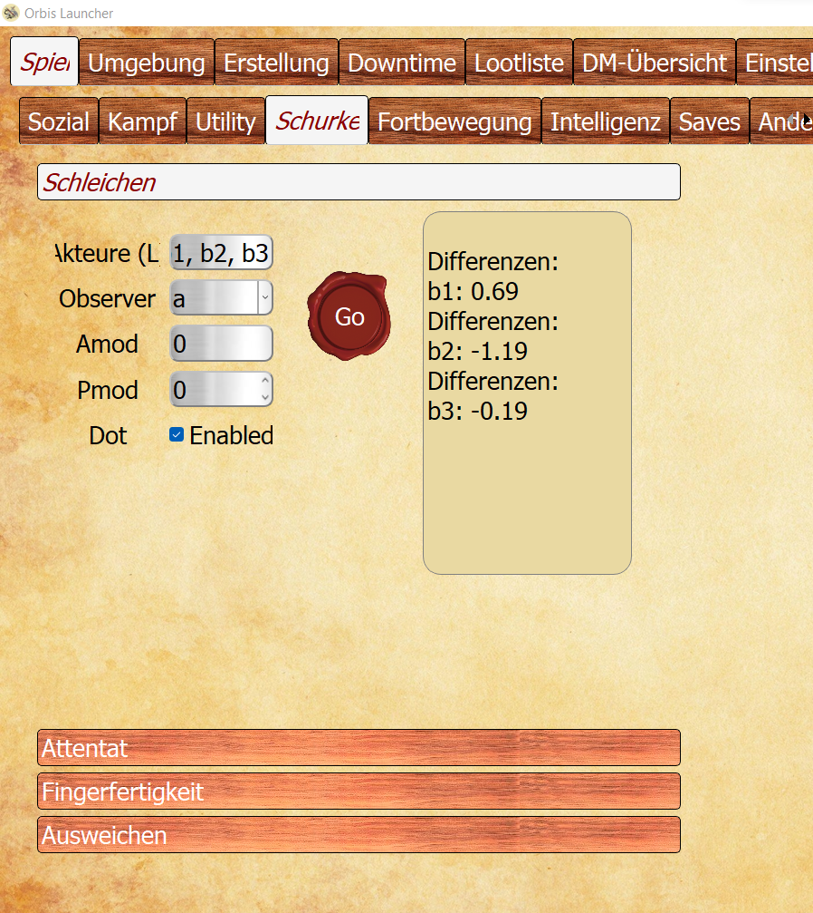

Die Differenz, die neben den Akteuren angezeigt wird, zeigt an, ob der Schleichversuch erfolgreich ist. Wenn die Differenz positiv ist, haben sich die Akteure vorbeigeschlichen, aber wenn sie negativ ist, wurden sie erwischt.

Im obigen Beispiel können wir sehen, dass b1 es geschafft hat, einen Differenzwert zu haben, der über 0 liegt, aber seine Freunde b2 und b3 wurden erwischt, da ihre Werte kleiner als 0 sind. Da nicht alle Akteure den Schleichversuch bestanden haben, kann der DM entscheiden, wie der Observer auf die Situation reagiert.

##### *Attentat* {.unnumbered}

Das [Attentat](#das-attentat) ermöglicht den direkten Tod eines Ziels, wenn es sich um ein *normales Attentat* handelt. Aus diesem Grund muss der DM diesen Box auswählen, wenn ein Spieler ein anderes Objekt ermorden möchte. Ist der Versuch erfolgreich, stirbt der Verteidiger sofort.

Verweigert der DM ein normales Attentat aufgrund der Wichtigkeit eines Objektes, so kann ein Attentatsangriff ausgeführt werden. Dieser ist auch dann sinnvoll, wenn ein Spieler hohen Schaden auf ein Monster oder ähnliches machen möchte. Hierfür lässt der DM die Box *Normales Attentat* unausgewählt.

Es ist wichtig zu beachten, dass normale Waffen wie Schwerter oder Äxte nicht für ein Attentat verwendet werden können. Um erfolgreich zu sein, muss der Angreifer mit einem Dolch ausgerüstet sein.

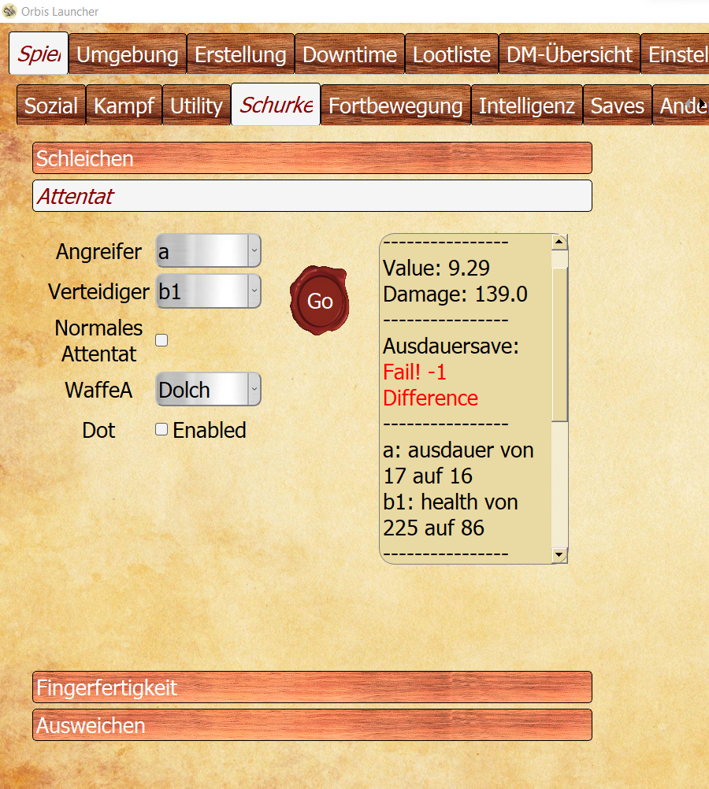

Wie oben zu sehen ist, sieht ein Attentatsversuch, wo der Box Normales Attentat unausgewählt ist, ähnlich aus wie ein normaler Angriff mit einem Dolch. Der einzige Unterschied besteht darin, dass der durchschnittliche Schaden aufgrund des positiven Modifikators eines Attentatsversuchs viel höher ist.

##### Fingerfertigkeit {#DMAppSchurkeFingerfertigkeit .unnumbered}

Fingerfertigkeit ist sehr einfach in der Durchführung, da nur ein Akteur und ein Modifikator gewählt werden muss, wenn der DM es für notwendig erachtet.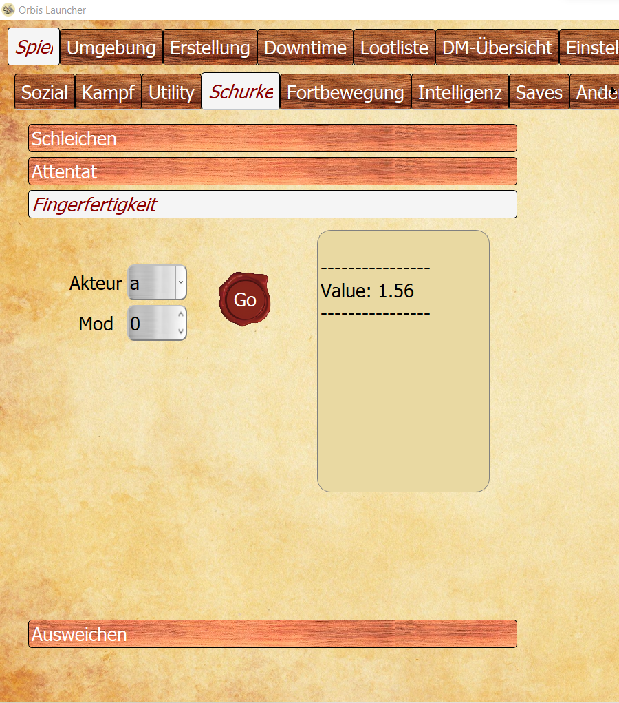

<<<<<<< Updated upstream
Nach dem Versuch muss der DM den angezeigten Wert interpretieren und wählen, wie die Welt auf den Fingerfertigkeit-Versuch reagieren wird. Da ein Wert zwischen 1 und 2 als schlechter Versuch gilt, war Akteur A erfolglos. Wenn beispielsweise ein Dieb versucht, mit seinem Messer einen Trick zu machen und einen Wert von 1,56 erhält, dann könnte er aufgrund der schlechten Ausführung seines Tricks so aussehen, als wüsste er nicht, was er tut
=======
Nach dem Versuch muss der DM den angezeigten Wert interpretieren und wählen, wie die Welt auf den Fingerfertigkeit-Versuch reagieren wird. Da ein Wert zwischen 1 und 2 als schlechter Versuch gilt, war Akteur A erfolglos. Wenn beispielsweise ein Dieb versucht, mit seinem Messer einen Trick zu machen und einen Wert von 1,56 erhält, dann könnte er aufgrund der schlechten Ausführung seines Tricks so aussehen, als wüsste er nicht, was er tut.
>>>>>>> Stashed changes

##### Ausweichen {#DMAppSchurkeAusweichen .unnumbered}

Ausweichen funktioniert sehr ähnlich wie Schleichen, mit dem einzigen Unterschied, dass der Akteur bei seinen Versuchen Ausdauer verlieren kann.

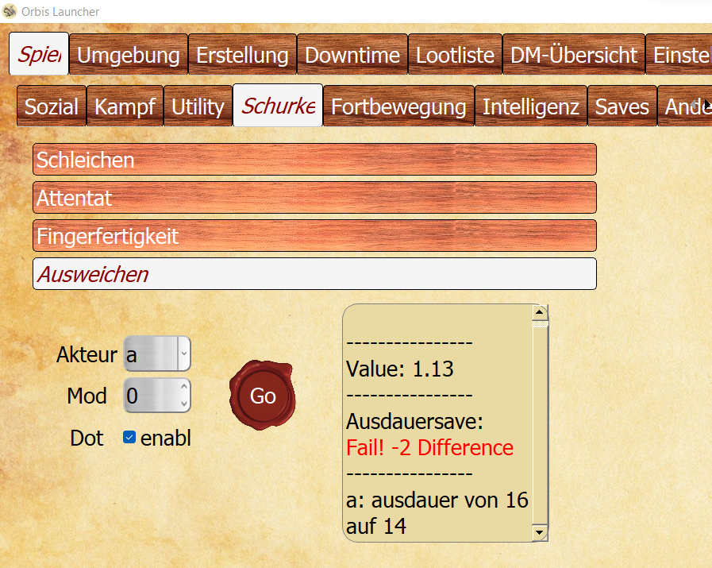

Die unter Shurke zu findende Ausweichmechanik soll nicht in einer Kampfsituation verwendet werden, sondern als Möglichkeit für den DM gesehen werden, einen Wert für das Ausweichen in Situationen zu erhalten, die nicht mit dem Kampf zu tun haben. Wenn zum Beispiel ein Barde mit faulen Tomaten beworfen wird, kann der DM einen Ausweichcheck machen, um zu sehen, wie gut er es vermeiden wird, von den Tomaten getroffen zu werden

#### Fortbewegung {#DMAppFortbewegung .unnumbered}

Bewegung bedeutet alle Aktionen eines sich bewegenden Spielers. Darunter ist nicht nur zu verstehen, wie man von Punkt a nach Punkt b kommt, sondern auch Bewegungen wie das Aufstehen, nachdem man von einem Angreifer im Nahkampf umgeschubst wurde oder eine akrobatische Bewegung.

##### Rennen

Neben dem normalen [Bewegungsradius](#Bewegungsradius), der jedem Spieler einmal pro Runde zur Verfügung steht, kann auch ein single action genutzt werden, um die Möglichkeit zu haben, sich weiter zu bewegen. Das Programm ermöglicht dem DM zwei verschiedene Lauffunktionen, eine, bei der ein Spieler alleine läuft, und eine andere, bei der eine Person eine andere Person jagt.

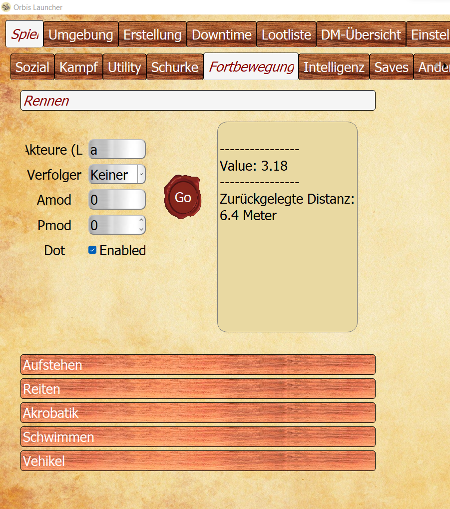

wird der Runningcheck ohne Verfolger durchgeführt, dann wird ein Wert und die gelaufene Distanz angezeigt.


<<<<<<< Updated upstream
kommt ein Verfolger zur Check hinzu, so werden beide Teilnehmer einen Wert und einen Distanzlauf im Programm angezeigt.
=======
kommt ein Verfolger zur Check hinzu, so werden beide Teilnehmer einen Wert und einen Distanzlauf im Programm angezeigt, mit der der DM dann sehen kann, ob es dem Akteur gelingt, vor dem Verfolger davonzulaufen.
>>>>>>> Stashed changes

##### Aufstehen

wie erwähnt ist es möglich eine Person auf dem Boden zu werfen, indem, dass man die Handgemenge Funktion in dem Sub-Tag [unbewaffnet](#DMAppKampfUnbewaffnet) verwendet, was sich in die Kampf Sektion des Programmes befindet. Wenn der Handgemenge-Versuch erfolgreich ist, muss die Person, die zu Boden geworfen wurde, die Aufstehen-Funktion verwenden, um wieder normal in einem Kampf aufstehen und kämpfen zu können.

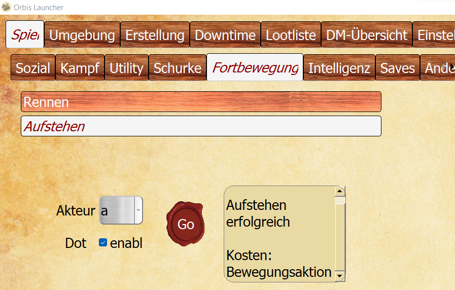

Je nachdem, wie schwer die Rüstung der Person ist, muss eine andere Aktion verwendet werden. a ist mit leichten Rüstungsteilen ausgestattet, was bedeutet, dass nur die Bewegungsaktion benötigt wird, um wieder aufzustehen. Wenn a jedoch mittelschwere Rüstungsteile tragen würden, müssten man die single action verwenden, um aufzustehen, und für schwere Rüstungen bräuchten man die main action.

##### Reiten

<<<<<<< Updated upstream
#####  Akrobatik

##### Schwimmen

=======
##### Akrobatik

Akrobatik folgt fast den gleichen Prinzipien wie das Rennen, was die Ausführung und das Verständnis der Werte betrifft. Ein Akteur ist erforderlich, um den akrobatischen Versuch zu starten.

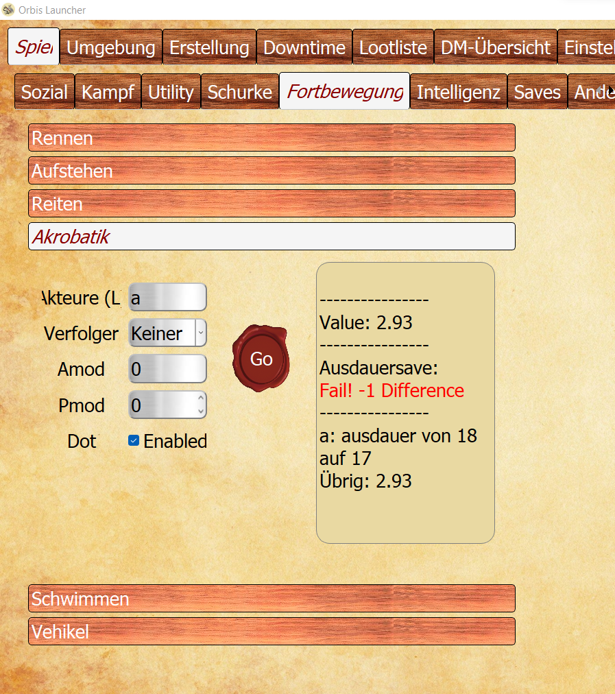

Nach dem Versuch muss der DM interpretieren, ob der Wert hoch genug ist für das, was der Spieler beabsichtigt. Wenn es um etwas ganz Einfaches geht, wie zum Beispiel über eine Pfütze zu springen, reicht ein Wert von 2,93 aus. Wenn ein Spieler jedoch versucht, ein Haus hochzuklettern, ist es fraglich, ob der Wert ausreicht. Um dies besser einschätzen zu können, wird empfohlen, den Abschnitt "[wie interpretiere ich Values und Würfe](#Abstufungen)" zu Rate zu ziehen.

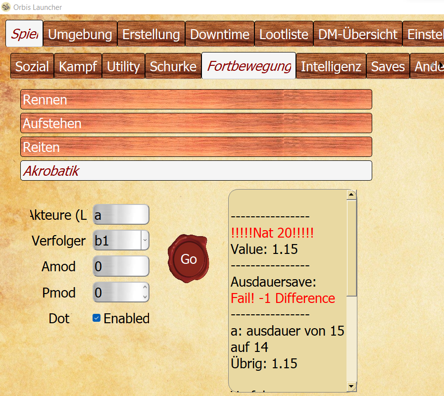

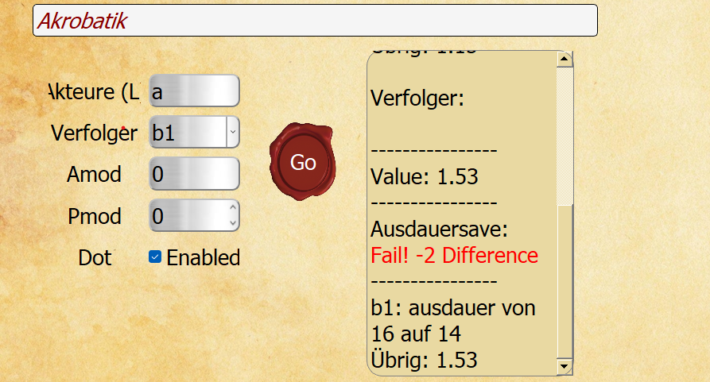 Wenn ein Verfolger hinzugefügt wird, erhält der DM einen Wert, den er interpretieren kann, für jeden, der die Akteure jagt. Nehmen wir als Beispiel an, dass a versucht, vor b wegzulaufen, indem er auf ein Gebäude springt. a hat einen Wert von 1,15, was niedriger ist als der von b, der 1,53 beträgt. deshalb hat b es geschafft, a einzuholen, da sein Wert höher ist.

##### Schwimmen

Wie beim Sub-Tag Rennen steht dem DM auch der Sub-Tag Schwimmen zur Verfügung, der besonders in Seekampagnen nützlich ist. Hier bietet das Programm dem Benutzer zwei verschiedene Funktionen, eine mit Verfolger und eine ohne Verfolger.

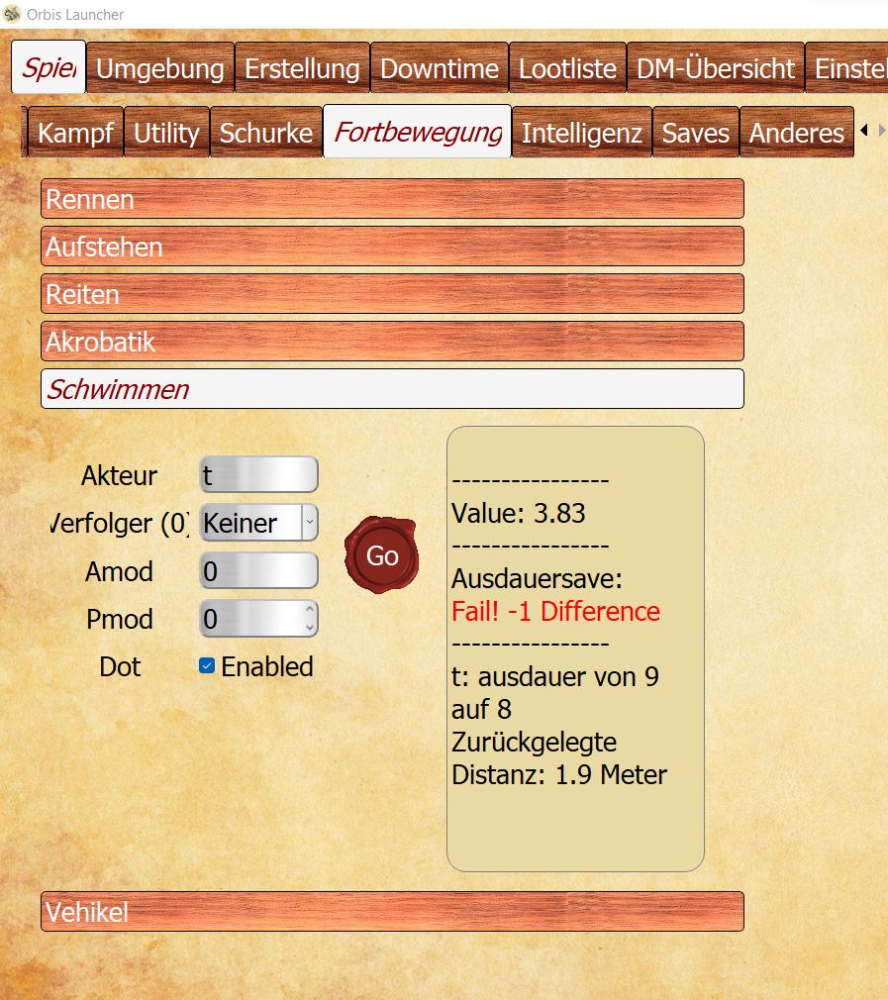

wie im obigen Beispiel zu sehen ist, ist es recht einfach zu interpretieren. a erzielte einen guten Wert von 4,46 und damit eine zurückgelegte Distanz von 2,2 Metern.

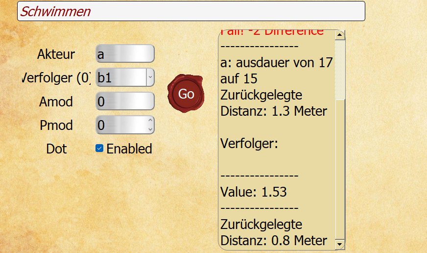

wenn ein Verfolger hinzugefügt wird, muss nur die Differenz interpretiert werden. in unserem Fall sehen wir, dass a 1.3 Meter schwimmen kann, b1 als Verfolger aber nur 0.8 Meter. so kommt a damit erfolgreich davon.

>>>>>>> Stashed changes
##### *Vehikel* {#DMAppFortbewegungVehikel .unnumbered}

#### Intelligenz {#DMAppIntelligenz .unnumbered}

<<<<<<< Updated upstream
##### Alchemie 
=======
Auf den Tab Intelligenz kann der DM einige der komplexeren Systeme von Orbis Astea verwenden, wie z. B. das Handwerkssystem oder das Brauen von Tränken. Da dieser Abschnitt nur zeigt, wie das Programm für diese spezifischen Systeme verwendet wird, wird empfohlen, die Regeln für die Funktionsweise [hier](#AlchemieSystem) nachzuschlagen.

##### Alchemie
>>>>>>> Stashed changes

Die Herstellung von Alchemietränken ist sehr einfach zu verstehen, da die einzige Interpretation, die benötigt wird, darin besteht, zu wissen, ob der Wert des Versuchs hoch genug für die Zutaten des Tranks ist, den ein Spieler herzustellen versucht. Wie im Abschnitt [Alchemie](#AlchemieSystem) erklärt wird, werden 2 Pflanzen für die Herstellung eines Tranks benötigt. Wenn die höchste erreichbare Stufe der 2 Zutaten als Beispiel 4 ist, muss der DM nur den vom Programm angezeigten Wert vergleichen.

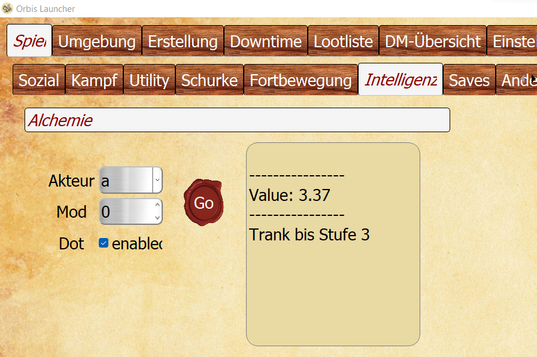

Wie im obigen Beispiel gezeigt wird, hat a es geschafft, einen Wert von 3,37 zu erreichen. Das bedeutet, dass solange die im Trank verwendeten Zutaten eine maximale Stufe von 3 oder höher haben, wird ein Trank der Stufe 3 hergestellt. Wenn die Zutaten nur eine maximale Stufe von 2 haben, dann wird ein Trank nicht besser sein, als es die Zutaten zulassen. Wenn dies der Fall ist, muss der DM auf die Zutaten achten, da das Programm unabhängig von den verwendeten Zutaten die höchstmögliche Stufe des Tranks anzeigt.

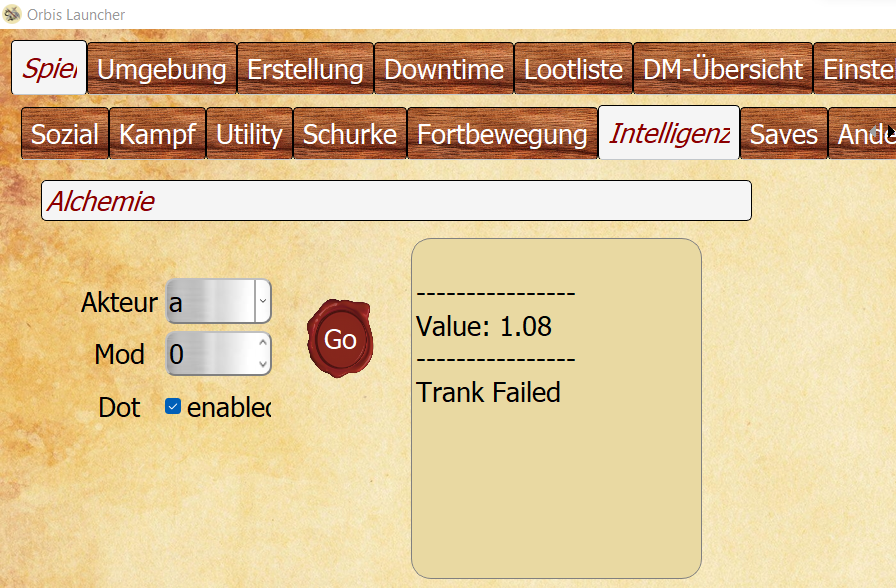

ist der vom Akteur erreichte Wert jedoch zu gering für Stufe 1 (Wert 1.7), dann scheitert der versuch und alle verwendeten Zutaten gehen verloren.

##### Handwerk

<<<<<<< Updated upstream
Handwerk ist in 4 verschiedene Abschnitte eingeteilt: Reparieren, Verbessern, Modifizieren und Herstellen, dabei macht es keinen Unterschied, ob es sich um eine Waffe oder ein Rüstungsteil handelt.
=======
wie im Abschnitt Handwerk erklärt wird, kann ein Spieler in die Downtime durch das verwenden von Werkzeuge mehrere Versuche haben Handwerkchecks zu machen. Wichtig ist jedoch, dass die Werkzeuge im Orbis-Programm nicht berücksichtigt werden, weshalb der DM selbst darauf achten muss, wie viele Handwerkschecks ein Spieler in die Downtime hat. Die mögliche Handwerkchecks werden in 4 verschiedene Abschnitte eingeteilt: Reparieren, Verbessern, Modifizieren und Herstellen, dabei macht es keinen Unterschied, ob es sich um eine Waffe oder ein Rüstungsteil handelt.

###### Reparieren {#reparieren}

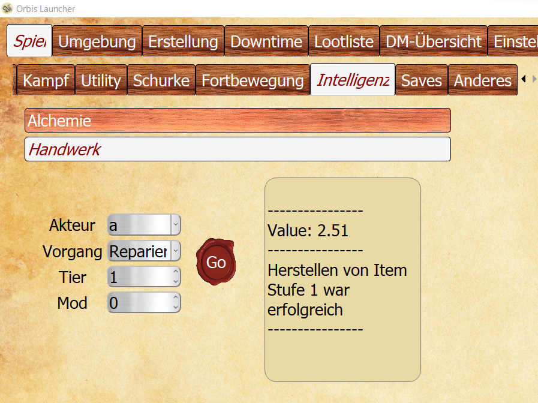

will ein Spieler einen gewünschten Gegenstand reparieren, muss man nur darauf achten, welches Tier er hat. Als Beispiel möchte a sein Schwert der Stufe 1 reparieren, weil es nur einen Zustand von 4 hat. Damit sein Reparaturversuch erfolgreich ist, muss ein Wert von mindestens 1.5 erreicht werden. Da ein Wert von 1.93 erreicht wurde, wurde sein Schwert erfolgreich repariert und hat nun einen Zustand von 5 statt 4.

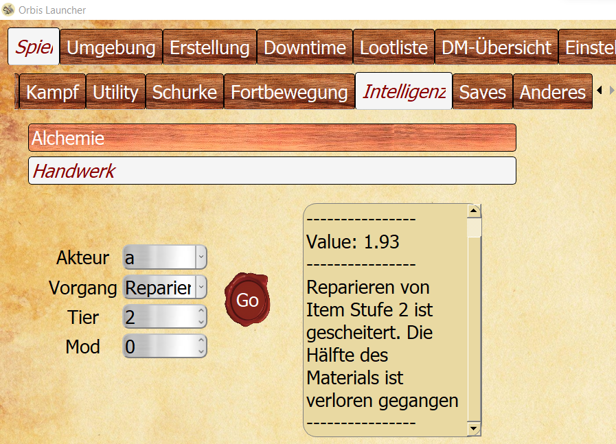

Will a allerdings seine Stufe 2 Axt reparieren, muss ein Wert von 2,3 oder höher erreicht werden. Im obigen Fall hat a nur einen Wert von 1,93 erreicht, was bedeutet, dass der Reparaturversuch der Axt gescheitert ist und die Hälfte des Materials verloren gegangen ist. Den genauen Schwellenwert für eine erfolgreiche Reparatur für jede Stufe findet man im Abschnitt [Reparieren](#Reparieren).

###### Verbessern

Wie beim Reparieren von Gegenständen gibt es auch beim Verbessern eine Schwelle für jede Stufe, die für einen erfolgreichen Versuch erreicht werden muss. Darüber hinaus ist es auch wichtig, sich daran zu erinnern, dass eine Verbesserung von einer Stufe zur nächsten 3 verschiedene und erfolgreiche Versuche erfordert. Wie im Abschnitt „Verbesserungen" angegeben, werden die ersten 2 erfolgreichen Versuche einen Schadenswert hinzufügen, der 25 % der Differenz zur nächsten Stufe entspricht.

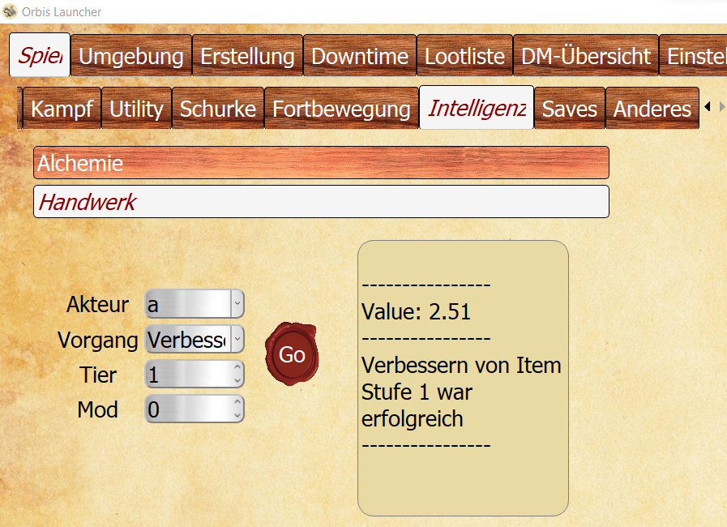

Wenn zum Beispiel Akteur a sein Stufe 1 Schwert verbessern möchte, muss er zuerst sein Versuch machen. Wie oben zu sehen ist, war er Erfolgreich. Die Differenz zwischen dem Schadenswert eines Stufe-1-Schwerts und eines Stufe-2-Schwerts beträgt 12 (42-30). Jetzt wo wir wissen, dass die Differenz zwischen den 2 Stufen 12 beträgt, müssen wir nur die 25% berechnen, die dann zum Schadenswert des Schwertes hinzugefügt werden können. die 25% von 12 beträgt 3, also darf Akteur a den Schaden seines Schwertes von 30 auf 33 erhöhen. Wenn a sein Schwert nochmal verbessert, kann er den Schadenswert wieder um 3 Punkte erhöhen, also hat sein Schwert den Schaden von 36. Nach dem 3. erfolgreichen Versuch wird das Schwert auf Stufe 2 umgewandelt, das dann den Schadenswert 42 hat. Die genauen Werte für jede Stufe findet man [hier](#Items).

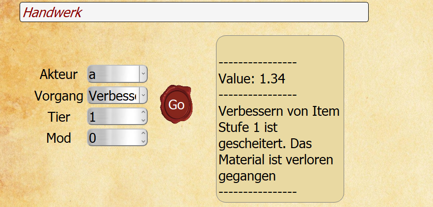

das Programm teilt dem Akteur mit, wenn er keinen Wert hat, der hoch genug für die Schwelle der spezifischen Stufe ist. In diesem Fall geht das für das Upgrade verwendete Material verloren.

Das Orbis Astea-Programm berücksichtigt nur, ob der Upgrade-Versuch erfolgreich war oder nicht, was bedeutet, dass der DM und die Spieler selber nachverfolgen müssen, wie viele erfolgreiche Versuche sie haben.

###### Herstellung
>>>>>>> Stashed changes

##### Einsicht

#### Saves {#DMAppSaves .unnumbered}

<<<<<<< Updated upstream
##### *Willenskraft* {#DMAppSavesWillenskraft .unnumbered}

Über das Element *Thres* legt der DM fest, welchen Wert ein Wurf des Spielers erreichen muss, um die Überprüfung der Willenskraft zu bestehen.
=======
Wie im Abschnitt „[Der Save](#Der Save)" erklärt, sind die Saves keine normalen Proben, sondern Proben wo nur Attribute verwendet werden, was bedeutet, dass sie sehr einfach auszuführen und zu verstehen sind.

##### *Willenskraft* {#DMAppSavesWillenskraft .unnumbered}

Über das Element *Thres* legt der DM fest, welchen Wert ein Wurf des Spielers erreichen muss, um die Überprüfung der Willenskraft zu bestehen. Außerdem muss der DM entscheiden, wer den Willenskraft-Check machen muss.

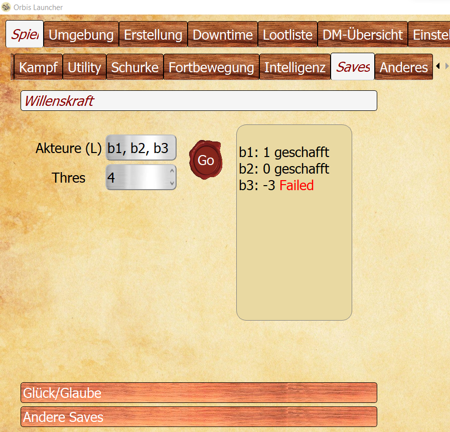 Als Beispielsituation gibt es die 3 Banditen b1, b2 und b3. Ihr Banditenanführer wurde gerade von einem Spieler getötet und so müssen sie nun einen Willenscheck bestehen, um weiterkämpfen zu können. für diesen Fall hat der DM entschieden, die Schwelle auf 4 zu setzen. b1 und b2 haben dem Willenskraft-Check erfolgreich widerstanden, aber b3 ist gescheitert und hat daher seine Waffen fallen gelassen und den Kampf gegen den Spieler aufgegeben.

Der DM muss immer einen realistischen Schwellenwert für die Situation definieren, in der sich die Spieler befinden. In diesem Fall kann 4 als akzeptabler Schwellenwert angesehen werden. Wenn der DM jedoch sagt, dass die Banditen alle einen starken Willen haben, dann kann ein Schwellenwert von 3 oder vielleicht sogar 2 verwendet werden. Wenn jedoch ein 4 Meter großes Monster vor den 3 Banditen stand, konnte der threshold 5 oder sogar 6 betragen.

##### Glück/Glaube

Glücks/Glaube Checks werden durchgeführt, wenn der DM unsicher ist, ob positive oder negative Konsequenzen eintreten werden. Wichtig ist, dass der DM feststellen muss, ob ein Glücks/Glaube Checks erforderlich ist oder nicht. Wenn sich beispielsweise eine Krankheit in dem Dorf ausbreitet, in dem sich die Spieler befinden, kann der DM ein CHeck machen, ob die Spieler krank werden oder nicht.

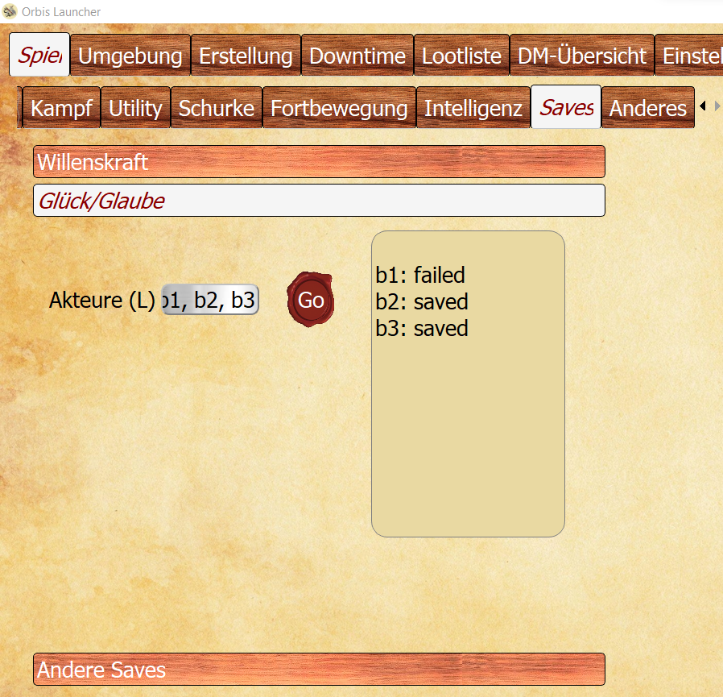

wie man oben sieht hat b1 sein Check nicht geshafft und ist damit krank geworden. b2 und b3 haben es aber bestanden und sind damit von der Krankheit im Dorf nicht betroffen.
>>>>>>> Stashed changes

##### *Andere Saves* {#DMAppSavesAndereSaves .unnumbered}

Dies bietet dem DM die Möglichkeit einzelne [Attribute](#Attribute) der Akteure zu überprüfen. Beispielsweise, ob ein Akteur stark oder agil genug ist, um eine Handlung auszuführen.

<<<<<<< Updated upstream
=======
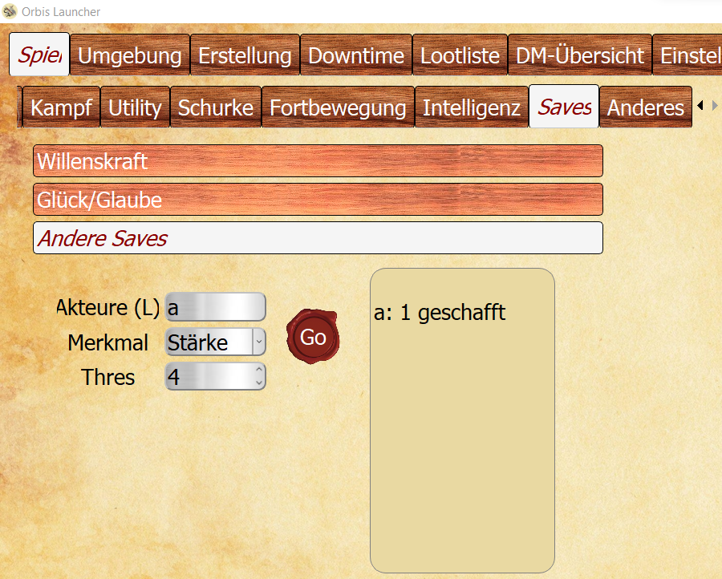

als beispiel ist amit seinem Karawane unterwegs, jedoch versperrt ihm ein umgestürzter Baum den Weg. a sagt dem DM, dass er versuchen möchte, den Baum zu entfernen, was bedeutet, dass der DM ihm einen Stärke Check geben wird, um zu sehen, ob er stark genug ist. Es ist wichtig, dass der DM entscheidet, wie hoch der Threshold sein sollte. Da es sich um einen nicht zu großen Baum handelt, hat er einThreshold von 4 und schafft es, den Baum zu entfernen.

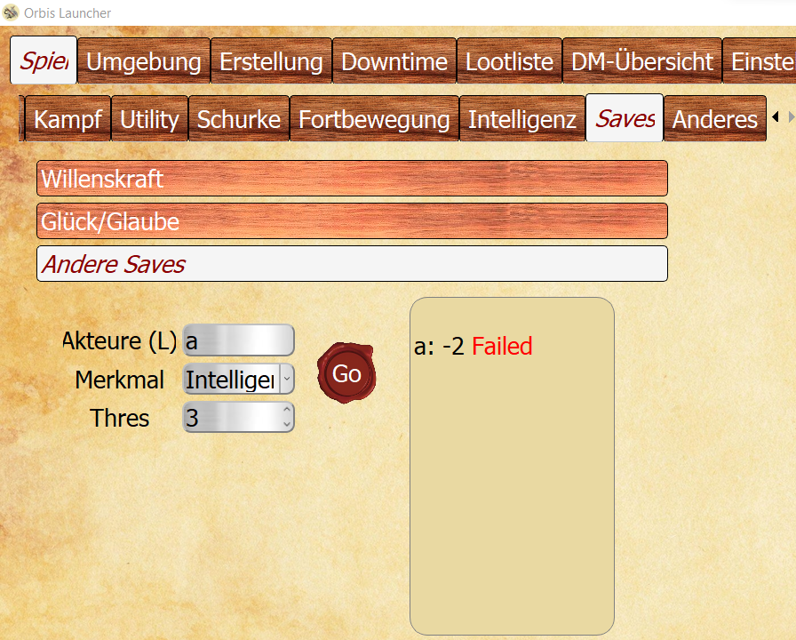

Wenn zum Beispiel a gebeten wird, sich an den Namen des Schmieds zu erinnern, von dem er sein Schwert gekauft hat, kann der DM einen Intelligenz Check machen, um sich an den Namen zu erinnern. Wie zu sehen, ist er aber dabei nicht erfoglreich.

>>>>>>> Stashed changes
#### Anderes {#DMAppAnderes .unnumbered}

Der Anderes-Tab ermöglicht es dem DM das Trinken von Tränken, das Löschen von Bränden an Akteuren sowie das Ändern, Aus-/Abrüsten sowie vergiften von Waffen und Rüstungsteilen auf eine erfolgreiche Durchführung zu überprüfen.

Wird etwas an der Ausrüstung geändert, so kann diese Änderung in der [DM-Übersicht](#DMAppDMUebersicht) unter [Beschreiben](#DMAppBeschreiben) angezeigt werden. Hierfür muss das Objekt ausgewählt und das geänderte Unterobjekt bestimmt oder das gesamte Objekt ausgewählt werden.

### Downtime {#DMAppDowntime}

[Downtime](#downtime-aktivitäten) umfasst alle Aktivitäten, die während eines längeren Zeitraums zwischen zwei Sessions möglich sind. Diese Aktivitäten können den Spielern verschiedene Vorteile wie Geld, bessere Skills oder mehr Wissenspunkte bringen. Wenn eine der Downtime-Aktivitäten ausgeführt wird, sind keine anderen Aktionen möglich, die viel Zeit in Anspruch nehmen. Aktionen, die nur eine kurze Zeit erfordern, wie z.B. mit anderen Charakteren zu sprechen, sind jedoch weiterhin möglich

Damit eine Downtime Aktivität beginnen kann, muss der Spieler zuerst einen Charakter in der Erstellung-Tab erstellen und danach in den Downtime-Tag entweder bei Arbeit, Training oder Studieren unter Person einladen.

#### Arbeit {#DMAppArbeit .unnumbered}

Arbeit ermöglicht es dem Spieler, während der Downtime Geld zu verdienen. Alle Arbeitsformen sind mit Skills verknüpft. Wenn ein Spieler beispielsweise versucht, sich auf Faustkämpfe einzulassen, wird empfohlen, ein hohes Unarmed-Level zu haben. Man benötigt auch die Akrobatik-Fähigkeit für z.B. akrobatikauftritt. Sobald der Charakter und die Aktivität ausgewählt wurden, müssen Sie nur noch die Go-Taste drücken und das Ergebnis im Feld unten ablesen. Das verdiente Geld kann dann direkt in das Inventar des Spielers eingetragen werden.

#### Ausbildung {#DMAppAusbildung .unnumbered}

Wie bei der Arbeit muss ein Charakter ausgewählt werden. Darüber hinaus muss der Spieler auswählen, welche Skill er trainieren möchte, und einen Lehrer, falls einer verfügbar ist. Wenn der Spieler im Training erfolgreich ist, zeigt das Feld unten, wie sehr sich die Fähigkeit verbessert hat.

#### Studieren {#DMAppStudieren .unnumbered}

Letztlich muss beim studieren nur eine Person ausgewählt werden. Der Grund dafür ist, dass die Wissenskills abstrakt ausgewählt werden können und daher keine definierte Liste haben, aus der sie ausgewählt werden können. Wenn Wissensfertigkeitspunkte erfolgreich erworben wurden, kann der Spieler die erhaltenen Punkte in sein Charakterblatt eintragen.

### Lootliste

Die Lootliste ermöglicht es dem DM eine Liste zu generieren, welche Gegenstände umfasst, die Profile an sich getragen haben als sie gestorben sind. Hierfür muss lediglich eingetragen werden, welche Personen Gegenstände, wie Rüstung und Waffen, von den Verstorbenen aufklauben und wie viel Prozent der Gegenstände als potenzieller Loot zur Verfügung steht. Mit betätigen des *Go*-Buttons wird zudem automatisch eine Lootliste in Form einer Excel-Datei ausgegeben. Diese findet sich im *OrbisGame*-Ordner im Unterordner *SessionOrganisation* unter dem Namen "lootliste". Natürlich steht es jedem DM darüber hinaus offen, den Spielern Loot darüberhinaus zukommen zu lassen.

Wichtig ist, dass die Spieler den Loot der Liste händisch in ihr eigenes Inventar übertragen müssen.

## Die Welt von Orbis mitgestalten {#OrbisDIY}

Da die Welt von Orbis viele Möglichkeiten bietet, eigene Elemente zu erschaffen und eine eigene Version davon zu entwickeln, gibt es nachfolgend einen Einblick in die Funktionsweise des Programms, sodass eigene Kreaturen, Profile, Pflanzen und weiteres erschaffen werden können.

### Die Arbeiten mit den Excel-Datenbanken {#DMAppExcelDatenbanken}

Die Funktionalität Orbis Asteas gründet auf der Arbeit mit Excel-Dateien. Der Teufel steckt hierbei im Detail. Wird ein neues Tabellenblatt nur minimal abweichend von den originalen formatiert oder ausgefüllt, so kann das Programm keine ordnungsgemäße Abfrage ausführen. Die Folge: Fehler geschehen und die Anwendbarkeit der neuen Ideen ist nicht gegeben. Aus diesem Grund wird nachfolgend erklärt, worauf besonders geachtet werden muss.

#### Profile {#ProfilErstellungDatenbank}

Personen-Profile:

Monster-Profile: Wenn eigene Monster erfunden werden, müssen diese in die "ProfilesMonster"-Excel Datei in einem neuen Tabellenblatt eingetragen werden. Diese findet sich im *OrbisGame*-Ordner unter OrbisGame\Container\Data\ProfilesMonster. Wichtig ist hierbei, dass das Tabellenblatt dem exakten Aufbau der anderen Tabellenblätter folgt. Dieser Aufbau dient einer korrekten Abfrage der Werte für die DM App.

## Bekannte Fehler {#BekannteFehler}

### Mein Fenster ist verschwunden

Das ist ein Problem das aufgrund der Implementation vorkommen kann. Mit der Taste *F11* auf der Tastatur wird das Fenster automatisch auf deinen Hauptbildschirm zentriert, danach kann man es wieder verschieben wie man will.

### Layout ist verbugged

Wenn die Schrift komisch aussieht, oder die Begriffe der einzelnen Tabs nicht richtig angezeigt werden, wie im Beispiel BILD EINFÜGEN, dann kann dies daran liegen, dass ....

Wenn neue Version heruntergeladen wird, sollten die Ordner des alten Downloads gelöscht werden

125% Zoom auf Laptop - optimiert auf 100% Zoom

### Der OrbisGame Ordner ist nicht zu finden

Bei mehrfachen Downloads der ZIP-Datei, werden die alten OrbisGame Ordner nicht überschrieben. Einer der Ordner ist vom Veränderungsdatum etwas älter und kann daher weiter unten in den Downloads zu finden sein

### *Fehler geschehen*

Diese Meldung kann aufgrund verschiedener Probleme zustande kommen. Hier werden ein paar mögliche Erklärungsansätze aufgeführt. Im schlimmsten Fall gibt es die Möglichkeit, den Entwickler der App zu kontaktieren und ihm ein Ticket aufzugeben.

## Der technische Hintergrund des Orbis Launchers {#TechnischerHintergrund}
