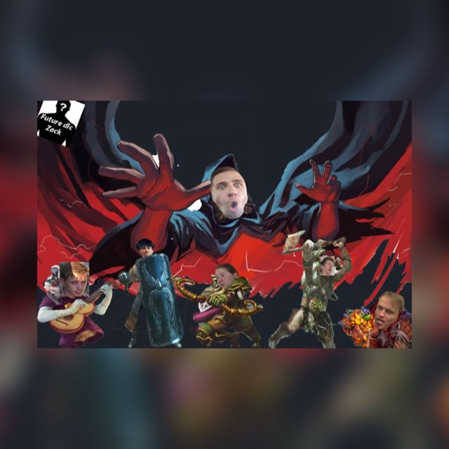
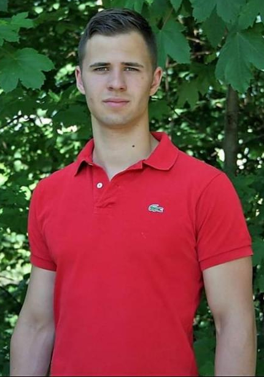
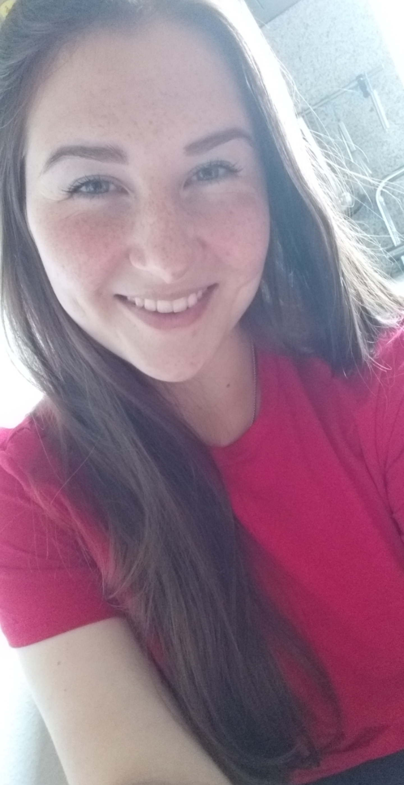
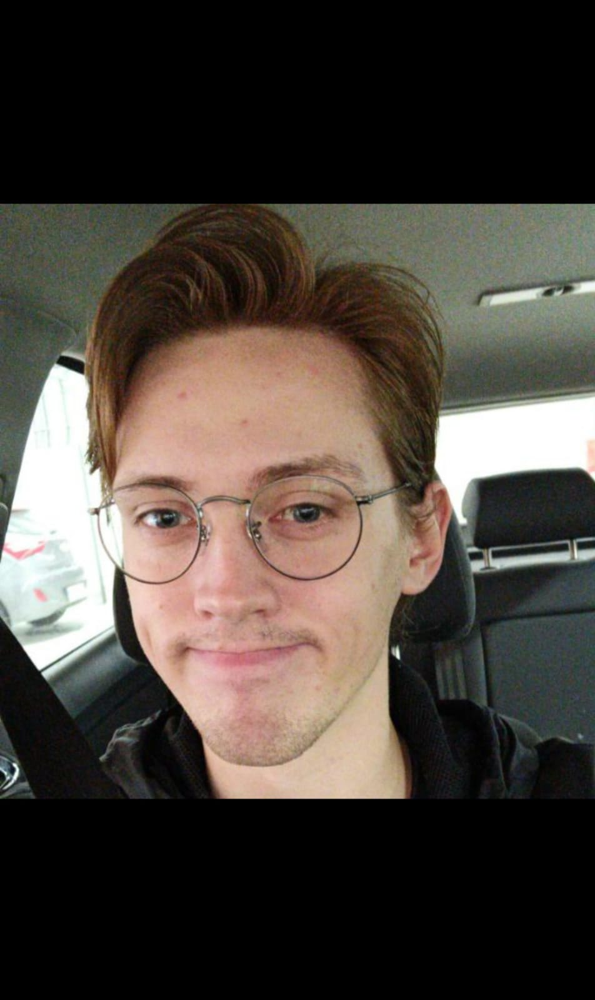
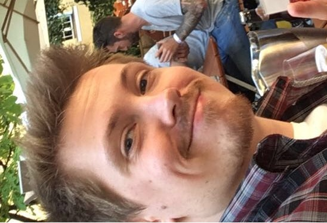
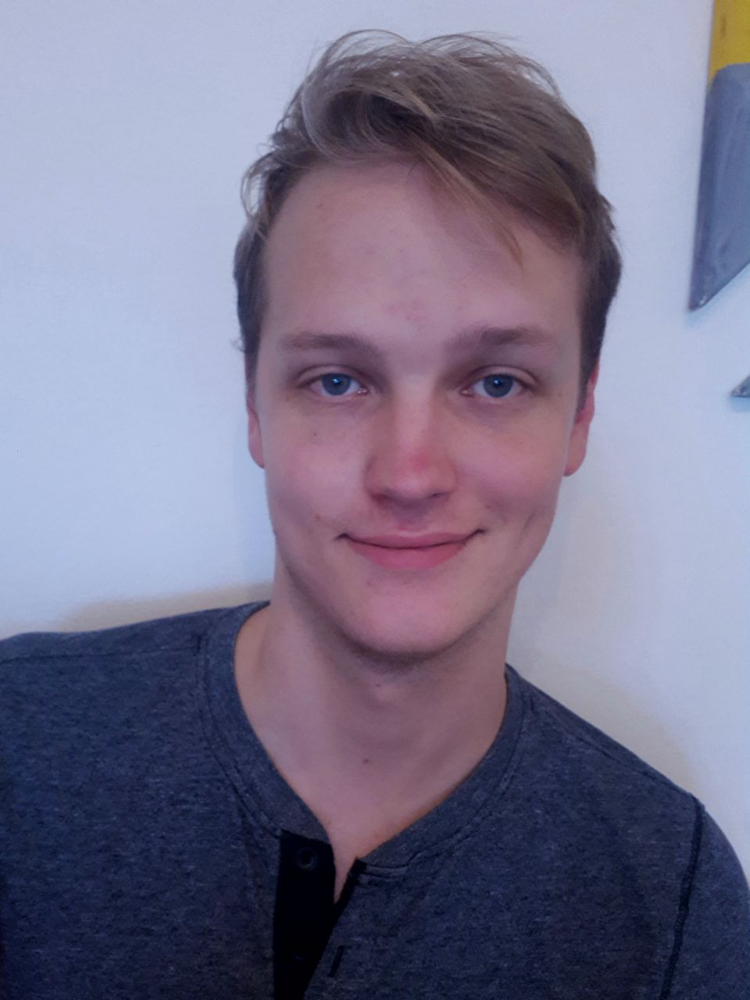
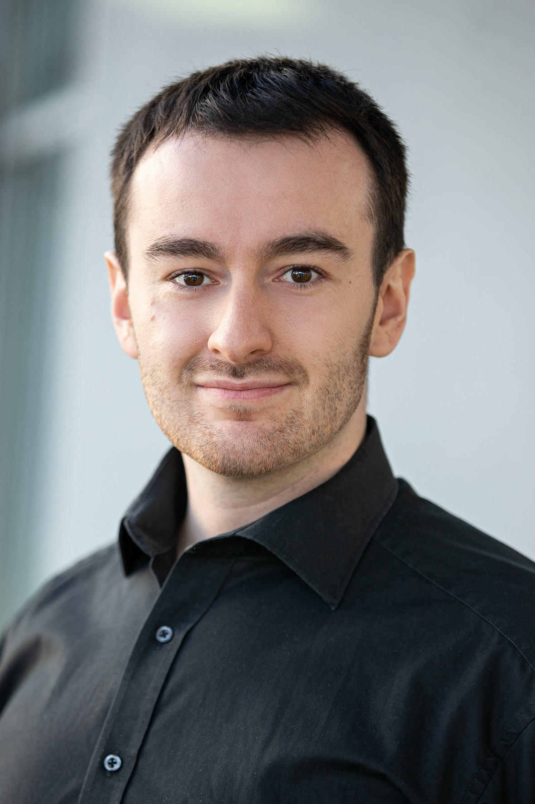

# (PART) Das Team hinter Orbis Astea {-} 

# Zum Projekt

Orbis Astea wurde am 4.12.2019 erfunden. Schon bald wurde die erstversion der Karte gezeichnet und alle arbeiteten fleißig an der Welt.
Die Highlights der Geschichte von Orbis Astea sind hier aufgeführt:

* 04.12.19 Ideestart
* 12.03.20 erste Session
* 11.04.20 Orbis Astea 1.1.2
* 29.05.20 Start Bookdown
* 08.08.20 Veröffentlichung Bookdown
* 24.11.20 Orbis Astea 1.2
* 15.04.21 Orbis Astea 2.0

## Die Autoren {-}

Orbis Astea wurde vom folgendem Team geschrieben:
 
### Simon Valverde {-}

* studiert Psychologie, Wirtschaftswissenschaften und Data Science in Salzburg
* ursprünglich aus Deutschland
* 24 Jahre alt
* Gründungsmitglied von Orbis Astea
* zockt viel zu viel

Simon ist der Gründer, das Brain und der Papa des Projekts. Er schaut, dass der Tisch reichlich mit Möglichkeiten gedeckt ist, dass jeder die Chance hat die eigenen Ideen miteinbringen zu können. Er steckt mit Abstand am meisten Liebe, Schweiß und „Tränen“ in die Entstehung der Geschichte, sowie der Automatisierung der Spielabläufe. Gerne motiviert er die Truppe immer wieder aufs Neue sich einen Aufgabenbereich zuzuwenden, damit das Projekt weiterwachsen und Tiefgang entwickeln kann. 
Bei allen Sessions und privaten Unterredungen integriert er die genannten Ideen vor dem Gesamthintergrund unserer Welt. Denn niemand kennt die Orbis Astea so gut wie er! Daher muss eine Idee, die in unsere Welt aufgenommen werden soll, seine kritischen Augen passieren. Da er besonders im Blick hat, dass niemand sich Vorteile in der Geschichte verschaffen kann und alles seinen gerechten Platz findet. Er ist jedoch immer offen für Diskussionen und Erklärungen, warum eine neue Idee eine Bereicherung für Orbis Astea sein könnte. 
Simon ist aber auch das Brain der Gruppe. Vor allem, wenn es um Regeln oder die Automatisierung der Abläufe geht (so ist das Programm, welches die ganzen Würfe berechnet und auswertet von ihm), wird er besonders ehrgeizig, denn man kann den Prozess des DMs immer weiter automatisieren und somit den Fokus des Spielens wirklich auf die Spielerfahrung InCharacter legen. Sein größter Kontrahent: Die Run Times. 
Neben allem Arbeitswillen und dem Ansporn der Gruppe vergisst er eins jedoch nicht: Es geht um den Spaß, den die InGame Charaktere auf ihren Abenteuern gemeinsam erleben können.
Es sind seine Kreativität, sein Herzblut und seine Disziplin, die das Projekt auf Hochtouren voranbringen. 

### Lena Pfeiffer {-}

* studiert Psychologie in Salzburg
* 24 Jahre alt
* Gründungsmitglied von Orbis Astea
* Ursprünglich aus Deutschland
* Zockt am liebsten Monster Hunter World

Lena sorgt dafür, dass Organisation, Deadlines und wichtige Ideen im Projekt nicht in Vergessenheit geraten. Des Weiteren ist sie auch der soziale Pol des Teams, der Mediator spielt sollte irgendwas im Argen liegen. Sie hat einen Blick auf die Bedürfnisse und Laune aller und unterstützt in Lore-Sessions fleißig mit Ideen und Snacks.  

### Kasper Mortensen {-}

* studiert Recht und Wirtschaft in Salzburg
* ursprünglich aus Dänemark
* Gründungsmitglied von Orbis Astea

Kasper ist ein starker Befürworter und Unterstützer des Projekts von Anfang an. Besonders im Beginn der Entwicklung unserer Welt hat er Ideen eingebracht und die Gestaltung von Orbis beeinflusst. Seine Bereiche liegen aktuell in seiner Position als Side-DM. Insbesondere durch diese Funktion hilft er viel weiter, da er auf diesem Wege Simon die notwendige Auszeit und Freude am Spiel durch eigenes Charakterplay ermöglicht.

### Emil Mortensen {-}

* studiert Recht und Wirtschaft in Salzburg
* ursprünglich aus Dänemark
* wie die ganze Crew begeistert am Zocken
* Gründungsmitglied von Orbis Astea

Emil geht voll und ganz in der Gestaltung unserer großartigen Maps auf. Mit viel Liebe zum Detail und in ständiger Aktualisierung setzt er die neue Lore in den Karten um, welche die Welt als teilnehmender Charakter nochmal viel greifbarer und anschaulicher macht. Die optisch wunderschöne Gestaltung der Welt rundet das Spielerlebnis ab. 
Seine treue Seele ist Teil einer jeden Lore-Session, die abgehalten wird. Er stellt kritische Rückfragen und fördert damit zusätzlich die akkurate Weiterentwicklung unserer Lore, sowie der Spielmechaniken. Darüber hinaus entwickelt er neue Lore – vor allem im Bereich der Animali.

### Florian Berger {-}

* studiert Recht und Wirtschaft in Salzburg
* ursprünglich aus Deutschland
* 25 Jahre alt
* leidenschaftlicher Zocker
* Gründungsmitglied von Orbis Astea

Flo ist ein bisschen der zweite Allrounder in der Gruppe. Er hat ein Auge für das, was den InGame Charakteren auf ihrer Reise große Freude, oder eine Erleichterung, sein könnten. Durch ihn gibt es viele Denkanstöße, wie das Spiel on the Run verbessert werden kann. 
Seine Königsdisziplin ist jedoch das Regelwerk, welches er regelmäßig mit neuen Ideen erweitert und hier viele Impulse für Diskussionen, Verbesserungen und Neuentwicklungen einbringt. 
Die Vergangenheit der Zwerge sind dabei ebenfalls ein großer Punkt, die seine Zuwendung bekommt. 

### Andreas Fellner {-}

* Hat Biologie in Salzburg mit Schwerpunkt Ecology & Evolution studiert
* Seit er 17 ist im Bereich Gamedevelopment aktiv
* Leidenschaftlicher Klugscheißer
* Liest in der Freizeit Fachpublikationen, um im Internet Recht zu haben
* Aktiv im Umwelt und Nachhaltigkeitsbereich
* Gründungsmitglied von Orbis Astea
* Spielt gerne Computerspiele

Durch seinen Hintergrund als Biologe hat er viele Ideen für Pflanzen, die uns InGame auf unseren Reisen begleiten und viele neue Möglichkeiten schaffen, die weit über die Erstellung normaler Heiltränke hinausgehen. Gerne widmet er sich auch der Entwicklung von Monstern, dem Nebelhain und verschiedenen Orkstämmen, sowie deren Geschichte. Sein Motto könnte man nennen „Je abscheulicher die Kreatur, desto besser!“. 
Bei Lore Sessions hält er sich mit Kritik und Ideen zu neuen Entscheidungen nicht zurück. Auch hier findet der biologische Hintergrund immer wieder Einzug, da es hier zum ein oder anderen Fact-Check kommt, der es der Gruppe ermöglicht einen gewissen Realitätsbezug zu wahren. 

## Impressum und rechtliche Hinweise {-}
