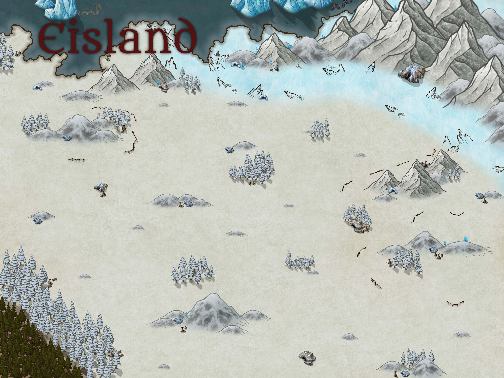

--- 
title: "Orbis Astea"
date: "Version vom: `r format(Sys.Date(),'%d.%m.%Y')`"
site: bookdown::bookdown_site
output: bookdown::gitbook
---
--- 
title: "Orbis Astea"
date: "Version vom: `r format(Sys.Date(),'%d.%m.%Y')`"
site: bookdown::bookdown_site
output: bookdown::gitbook
---

# (PART) Orbis Astea {-} 

# Einführung in Orbis Astea

Wir schreiben das Jahr 426 seit Gründung des Kaiserreichs.
Der Große Krieg zwischen den Rah Kari und dem Kaiserreich liegt 5 Jahre zurück, seitdem befinden sich die beiden Großen Reiche im Krieg miteinander.

Sämtliche Karten in Orbis Astea sind nach Westen ausgerichtet, das bedeutet das der Süden auf der Karte links, der Norden rechts und der Osten unten liegt.

<!--chapter:end:index.Rmd-->

# Allgemeines {#Allgemeines}

## Das Erwachen

> "Das Erwachen stellt eine der größten Konstanten in unserer Welt dar, egal ob Mensch, Elf oder Ork - die Leiche steht wieder auf und dürstet nach dem Blute der Unschuldigen!"
>
> --- Harnod Cowell III, Eldrischer Gelehrter

Seit Anbeginn der Chroniken ist das Erwachen ein fester Teil von Aestea. Ein Gestorbener - wenn nicht ordentlich bestattet - steht binnen 2-6 Tagen wieder auf, die meisten jedoch im Rahmen von 3-4 Tagen. Die Erwachten - wie die lebenden Toten weithin genannt werden - sind feindlich gegenüber fast jeder intelligenten Lebensform, die nicht auch erwacht ist. Sie zu töten ist nicht immer einfach, da man große Teile ihres Körpers zerstören muss bis sie endlich wieder erschlaffen. Sie einzudämmen ist allerdings möglich, da sie kein taktisches oder logisches Verständnis zu besitzen scheinen. Am besten umgeht man sie großflächig und meldet jede Infestion umgehend der Armee oder der Ekklesia.
Am besten ist es jedoch, sie gar nicht erst entstehen zu lassen. Religiöse Rituale verhindern die Erweckung. So hat jedes Volk seine eigene Methode gefunden mit der Gefahr umzugehen - manche davon besser, andere wiederum weniger geeignet.

Die Art und Weise des Umgangs mit der Erweckung ist identitätsstiftend, da sie den Charakter und die Systeme aller Völker geprägt hat und die Zivilisation grundlegend beeinflusst.

## Die Rolle der Religion

In Orbis Aestea ist es die Energie des Glaubens der Leute, die dem übernatürlichem Macht verleiht. Sollten nur genug Leute an eine übernatürliche Macht oder einen Gott glauben, wird man sehr schnell deren Hand und Spuren in der Welt feststellen. Umso fester der Glaube an gewisse Begräbnissrituale, desto sicherer ist es, dass die Leichen, die auf diese Art und Weise bestattet werden auch bestattet bleiben. Auch in anderen Bereichen kann der Glaube Berge versetzen: Tödlich verletzte Soldaten, deren Willen im Kampf trotzdem nicht bricht, Seuchenkranke, die ihre Krankheit abschütteln, nur weil sie intensiv genug beten, und Monster, die die Gläubigen verschonen, während sie Ketzer erbarmungslos zur Strecke bringen. 

Die besondere Rolle der Religion sorgt auch dafür, dass religiöse Institutionen bei den meisten Völkern eine tragende Rolle spielen - oder zumindest sehr mächtig sind. Im Kaiserreich beispielsweise steht die Inquisition - der militärische Arm der Ekklesia - de facto über dem Gesetz. Bei den Rah-Kari ist das ganze System in Form einer Theologie aufgebaut, in der die Hohepriester der Kulte über das Reich herrschen.

## Die Geschichte Orbis Asteras

<!--chapter:end:001Allgemeines.Rmd-->

# (PART) Die Rassen in Orbis Astea {-} 

<!--chapter:end:002Rassen.Rmd-->

# Menschen

Da die menschliche Rasse an sich den meisten Lesern bereits vertraut ist, wird dieser Eintrag des Buches eher kurz gehalten.
Menschen stellen die mit Abstand dominanteste Rasse in Orbis Astea dar. Ihre größte Stärke ist die Fähigkeit, sich an jede Situation anzupassen. Ein Mensch kann fast alles lernen und ist körperlich nicht wirklich eingeschränkt - aber auch nicht sonderlich begabt.

Dies führt zu einer Situation, in der Menschen zwar in jedem Bereich oben mitspielen, aber in kaum einem Bereich zu den Besten gehören. Für die Spezies selbst scheint sich die Durchschnittlichkeit jedoch auszuzahlen. Sie besetzen die größte Fläche, sind zahlenmäßig allen anderen Rassen überlegen und mit Abstand die mächtigste Rasse.

## Die Geschichte der Rasse

Die Geschichte der Menschen ist zu vielfältig, um wirklich von einer Rassengeschichte sprechen zu können. Dies liegt vor allem an der enormen Heterogenität zwischen den Gesellschaften. Das Kaiserreich, Rah Kari und Eldria, bezeichnen beispielsweise ganz unterschiedliche Kulturen, obwohl der gleichen Rasse zugehörig.

Was man allerdings weiß, ist, dass die Menschen wohl mit eine der älteren Rassen sein müssen. Die deutlich länger dokumentierende Geschichtsschreibung der Zwerge (bzw. ihre Geschäftsbücher) weisen von Anfang an auf Außenhandel mit Menschen hin. 

## Bekannte Kulturen der Menschen

Hier eine Auflistung von reinen Menschenkulturen bzw. Kulturen, in denen Menschen einen hohen Bevölkerungsanteil haben:

* Das [Kaiserreich](#Kaiserreich)
* Die [Rah Kari](#RahKari)
* Das [Fürstentümer von Eldria](#EldriaFaction)
* Die [Skaen](#Skaen)
* Die [Kultisten des Berma-Tals](#BermaTal)
* Die [Seekulturen](#Seevolk)
* Die [Eisenrote Wüste](#EisenroteWueste)

<!--chapter:end:003Menschen.Rmd-->

# Die Elfen

Placeholder

## Die Legenden der Elfen
## Die Stadtelfen
### Die Geschichte
### Die Gesellschaft
### Die Religion
### Individuelle Eigenschaften (Umbennen für jew. Rasse)
## Die Waldelfen
### Die Geschichte der Rasse {#DieEntwurzelung}
### Die Gesellschaft der Rasse
### Die Völkerbeziehungen der Rasse
### Die Religion der Rasse
#### Totenkult
### Die Legenden der Rasse
### Die Eigenbegriffe der Rasse
### Ausrüstung
### Die Jagdstrategien
### Das Waldbiom
## Die Elfen untereinander

<!--chapter:end:004Elfen.Rmd-->

# Die Rasse der Orks

Placeholder

## Die Geschichte
## Die Gesellschaft
## Die Religion
## Die Legenden
### Themadorc - Verehrer der Götzen
### Umchrug-Hal  - der Riese von Grimgrod
## Individuelle Eigenschaften der Orks (Umbennen für jew. Rasse)
## Die Eigenbegriffe der Orks
## Ausrüstung
## Jagdstrategien
## Die Orks untereinander

<!--chapter:end:005Orks.Rmd-->

# Goblins

Placeholder

## Die Geschichte der Rasse
## Die Gesellschaft der Rasse
### Die Völkerbeziehungen der Rasse
## Fortpflanzung
## Misc.
## Die Religion der Rasse
### Totenkult
## Die Legenden der Rasse
## Die Eigenbegriffe der Rasse
## Stammesstruktur

<!--chapter:end:006Goblins.Rmd-->

# Creatura Animali

Placeholder

## Überlick über die Animali
## Die Geschichte der Animali
## Herkunft der Rasse 
### Der Erstkontakt mit dem Kaiserreich
### Die große Jagd auf den Weltenwurm
## Die Gesellschaft der Animali
### Der Ritus der Reife {#Mutation}
### Die Völkerbeziehungen der Rasse
## Die Religion der Rasse
## Die Legenden der Rasse
### Über Mantikore
## Die Eigenbegriffe der Rasse

<!--chapter:end:007Animali.Rmd-->

# Die Zwerge

Placeholder

## Die Geschichte der Rasse
## Die Gesellschaft der Rasse
### Clans
### Jobs
### Die Völkerbeziehungen der Rasse
## Die Religion der Rasse
### Totenkult
## Die Legenden der Rasse
## Die Eigenbegriffe der Rasse
## Karawanen
## Konstrukte
### Kontrolle über Konstrukte
#### Vehicel Skill zur Kontrolle
### Die vielfalt der Möglichkeiten
### Konstruktarten
#### Utility: 
#### Transport: 
#### Kampf:
#### Ornate Krieger:
#### Titan klasse Konstrukt: 
### Bau
## Die Donnerwächter
## Bekannte Zwerge in der Oberwelt

<!--chapter:end:008Zwerge.Rmd-->

# Die Halblinge

Placeholder

## Die Geschichte der Rasse
## Die Gesellschaft der Rasse
### Völkerbeziehungen
## Die Religion der Rasse
### Totenkult
## Die Legenden der Rasse
## Die Eigenbegriffe der Rasse
## Individuelle Eigenschaften der Halblinge
## Änderungen: 

<!--chapter:end:009Halblinge.Rmd-->

# Mischlinge

Obwohl es nur selten vorkommt, schaffen es immer wieder Wesen unterschiedlicher Rasse Nachkommen zu zeugen. Diese Kinder stellen für die Eltern jedoch nur selten ein Grund zur Freude dar, da an den meisten Orten in Orbis Astea gemischtrassige Familien nicht sonderlich akzeptiert sind. Ein schwer nachvollziehbares Faktum, da sexuelle Verbindungen weitestgehend als unproblematisch empfunden werden. 
Da eine erfolgreiche Befruchtung zwischen den Rassen unwahrscheinlicher ist als eine gleichrassige Befruchtung ist die grundlegende Zahl an Mischlingen schon eher selten. Diese Zahl wird noch weiter verringert, da viele Mischlingskinder als Folge sozialer oder Körperlicher Misshandlung entweder durch sich selbst, ihre Eltern oder ihre Mitmenschen sterben bevor sie voll ausgewachsen sind. 

Nicht alle Rassen sind in der Lage Mischlinge zu zeugen, so sind Zwerge und Orks beispielsweise absolut nicht in der Lage sich mit anderen Rassen fortzupflanzen. Ebenso wurden noch keine Mischlinge gezeugt, die selbst Fortpflanzungsfähig gewesen wären - die Mischlingslinie stirbt also immer mit dem Mischling selbst. Menschen und Elfen scheinen am kompatibelsten zu sein, da die meisten Mischlinge Halbelfen sind. 

<!--chapter:end:010Mischlinge.Rmd-->

# (PART) Die Fraktionen in Orbis Astea {-} 

<!--chapter:end:012Fraktionen.Rmd-->

# Das Kaiserreich {#Kaiserreich}

Placeholder

## Die Geschichte des Kaiserreichs {#GeschichteKaiser}
### Die Vorgeschichte - Nors und das Herzland
### Der Anfang des Reichs
### Die Versklavung der Elfen 
### Die Goldenen Jahre
### Die Strafe des Allgotts {#SchleifungRiga}
### Die Eroberung Eldrias
### Der große Krieg {#KaisGroKrieg}
## Die Kaiserliche Gesellschaft
### Der Adel
### Der Kaiser
### Die Allgemeinbevölkerung
### Die Ekklesia
#### Die Inquisiton
#### Totenkult
### Die Stadtelfen {#StadtElfen}
### Orks im Kaiserreich
## Die Kaiserliche Armee
### Waffengattungen Der Imperialen Armee
#### Infanterie {- #KaisInfanterie}
##### Speerträger {-}
##### Hellebardisten {-}
##### Militates {-}
##### Schwere Infanterie {-}
#### Fernkampf-Infanterie {- #KaisFernkampf}
##### Armbrustschützen {-}
##### Musketiere {-}
#### Kavallerie {- #KaisKavallerie}
##### Leichte Kavallerie {-}
##### Schwere Kavallerie {-}
#### Artillerie {- #KaisArtillerie}
##### Balliste {-}
##### Großkanone {-}
## Die Wirtschaft des Kaiserreichs

<!--chapter:end:104Kaiserreich.Rmd-->

# Die Fürstentümer von Eldria {#EldriaFaction}

Placeholder

## Die Geschichte von Eldria
### Das Königreich Eldrias
### Die Aufsplitterung
### Die Wirkung des Felssturzes
### Die kaiserliche Besatzung
## Eldrias Gesellschaft
### Die Fürsten
### Die Ritterschaft
## Die Fürstentümer
### Aerlham {#Aerlham}
### Gent {#Gent}  
### Austen
### Hasting
### Darcy
### Calvert 
### Rintom und Haag
## Das eldrische Militär
## Eldrische Legenden
### Die Ritter des grauen Ringes

<!--chapter:end:105Eldria.Rmd-->

# Rah Kari {#RahKari}

Placeholder

## Die Geschichte der Rah Kari
### Aus Blut wächst Treue
### Der Wanderer und der Träumende
### Die Oase und die nördliche Wüste
### Der graue Berg
### Die ersten Schritte
### Die Belagerung von Atumpet
### Die Suche nach dem Schlüssel
### Der Tod eines Traumes
### Das Reich des Südens
### Der Krieg der unteren Wüste
### Die Expeditionen
#### Die Expeditionen in die eisenrote Wüste {-}
#### Die Expedition ins Himmelsspitzen-Gebirge {-}
#### Andere Expeditionen {-}
### Der Aufstand der Sklaven
### Der große Krieg
## Die Gesellschaft der Rah Kari
## Wirtschaftliche Lage der Rah Kari
### Die Ressourcen der Rah Kari
## Soziopolitische Lage 
### Herrschaftsystem/Organisation
### Die Beziehungen der Rah Kari
## Militär der Rah Kari
### Die Waffengattungen der Rah Kari
#### Infanterie {- #RahInfanterie}
##### Wüstenschilde {-}
##### Wüstenspeere {-}
##### Schwere Speerträger {-}
#### Fernkämpfer {- #RahFernkämpfer}
##### Wüstenschleuderer {-}
##### Plänkler {-}
##### Kurzbögen {-}
#### Kavallerie {- #RahKavallerie}
##### leichte Wüstenreiter {-}
##### Berittene Kurzbögen {-}
##### Dromedarreiter {-}
##### Skrogan-Reiter {-}
##### Kriegselefanten {-}
#### Konstrukte der Rah kari {-}
### Besondere Einheiten
#### Fre'dan Rah {-}
#### Tempelwächter {-}
## Die Religion der Rah Kari
### Totenkult
## Die Legenden der Rah Kari

<!--chapter:end:106RahKari.Rmd-->

# Die Elfen von Silva Nacia {#SilvaNacia}

Placeholder

## Die Geschichte von Silva Nacia
## Die Gesellschaft von Silva Nacia
## Wirtschaftliche Lage
### Die Ressourcen von Silva Nacia
## Soziopolitische Lage 
### Herrschaftsystem/Organisation
### Die Beziehungen von Silva Nacia
## Militär von Silva Nacia
## Die Religion von Silva Nacia
### Totenkult
## Die Legenden von Silva Nacia
## Individuelle Eigenschaften (Umbennen für jew. Rasse)

<!--chapter:end:107Silva-Nacia.Rmd-->

# Die Orks vom Grimgrod

Placeholder

## Die Geschichte der Faction
## Die Gesellschaft der Faction
## Wirtschaftliche Lage
### Die Ressourcen der Faction
## Soziopolitische Lage 
### Herrschaftsystem/Organisation
### Die Beziehungen der Fakion
## Militär der Faktion
## Die Religion der Fraktion
### Totenkult
## Die Legenden der Fraktion
## Individuelle Eigenschaften (Umbennen für jew. Rasse)

<!--chapter:end:108Grimgrod.Rmd-->

# Das Seevolk {#Seevolk}

Placeholder

## Die Geschichte des Seevolks
### Die Staatenschiffe
### Der Seekrieg
### Der Flottendiebstahl zu Sturmkap
## Bedeutsame Untergruppen des Seevolks 
### Kielhaif
### Arkus {#Arkus}
### Rahla' Asb'Kartes
### Sirkali
### Schwarzflamme {#Schwarzflamme}
### Die Tartarus
## Die Gesellschaft der Faction
## Wirtschaftliche Lage
### Die Ressourcen der Faction
## Soziopolitische Lage 
### Herrschaftsystem/Organisation
### Die Beziehungen der Fakion
## Militär der Faktion
## Die Religion der Fraktion
### Totenkult
## Die Legenden der Fraktion
## Individuelle Eigenschaften (Umbennen für jew. Rasse)

<!--chapter:end:109Piraten.Rmd-->

# Die Vulkanzwerge

Placeholder

## Die Geschichte der Faction
## Die Gesellschaft der Faction
## Wirtschaftliche Lage
### Die Ressourcen der Faction
## Soziopolitische Lage 
### Herrschaftsystem/Organisation
### Die Beziehungen der Fraktion
## Militär der Faktion
## Die Religion der Fraktion
### Totenkult
## Die Legenden der Fraktion
## Individuelle Eigenschaften (Umbennen für jew. Rasse)

<!--chapter:end:109Vulkanzwerge.Rmd-->

# (PART) Religionen {-}

<!--chapter:end:109Z1Religion.Rmd-->

# Die Lehre des Allgottes

Placeholder

## Organisation {#Ekklesia}
### Oberhaupt
## Geschichte
## Glaubenssätze
## Gebote und Verbote
## Wichtige Orte
## Riten
### Totenkult 
## Symbolik

<!--chapter:end:109Z2Allgott.Rmd-->

# Die Lehre des Rah' Kas

Placeholder

## Organisation {#HoheKulte}
### Oberhaupt
## Geschichte
## Glaubenssätze
## Gebote und Verbote
## Wichtige Orte
## Riten
### Totenkult
## Symbolik

<!--chapter:end:109Z3RahKas.Rmd-->

# Die Lehre des Lichts von Darcy

Placeholder

## Organisation {#KircheDarcy}
### Oberhaupt
## Geschichte
## Glaubenssätze
## Gebote und Verbote
## Wichtige Orte
## Riten
### Salbung
### Befreiung {#ZeremonieDerBefreiung}
## Symbolik

<!--chapter:end:109Z4Darcy.Rmd-->

# Der Blutkult {#Blutkult}

Placeholder

## Der Ruf des Blutes
## Der dämonische Wahn
## Die Inferata
## Geschichte des Blutkults
### Die Entdeckung Alfried Grimands {#Grimand}
### Die Ekklesia und andere Gegenmaßnahmen
## Bekannte Blutgötzen
### Sakessa
### Traumblutgott
### Jiraad der brennende Gott
#### Umgang des Kaiserreiches mit Anhänger von Jiraad
### Pux-Haik  Herrscher der Pestilenz
#### Umgang des Kaiserreiches mit Anhängern Pux-Haik
### Saath Valar
### Blutgott der Illusionen
### Hartemus der Sammler
### Ga'ar - Mutter der Bestien {#Gaar}
### Tunis der Verderber der Innovation
## Die Ausbreitung großer Kulte
## Der Heilige des Kriegs

<!--chapter:end:109Z5Blutkult.Rmd-->

# Die Lehre von Zamrak

Placeholder

<!--chapter:end:109Z6ReligionAnimali.Rmd-->

# (PART) Anderes {-}

<!--chapter:end:110Anderes.Rmd-->

# Die Vorreiter

<big> Achtung hierbei handelt es sich um nicht spiel- aber verständnisrelevante Deep-Lore. Während es für DM's sinnvoll ist sie zu verstehen kann es für spieler schlecht sein - je nach spielerlebnis. Lesen also auf eigene "Gefahr". </big>

> "Nicht viel ist bekannt über die Rasse, welche wir Vorläufer nennen. Außer ihre Ruinen und manche ihrer Mechanismen ist nicht viel über sie bekannt. Wir wissen, dass sie die Welt vor uns besiedelt haben und wahrscheinlich der Magie mächtig waren. Im Bunde mit bösen Göttern und mit fauler Zauberei musste ihre Welt untergehen um Platz für eine bessere, reinere Welt zu machen. So sehen wir, wie Gott wirkt und waltet, und wie das gute immer gewinnt, egal wie sehr das Böse zu strampeln versucht"
>
> --- Paniac Larren, Hohepriester von Darcy

die Vorreiter waren ein Volk, welches lange vor unserer Zeitrechnung existierte. Aufgrund ihres enormen Fokus im Bereich Wissenschaft und Technik erschufen sie eine Gesellschaft, in der einzelne Individuen eine beinahe unendliche Fülle an Möglichkeiten hatten. Der technologische Fortschritt machte die Vorreiter unsterblich – so dass weder Krankheiten noch die Zeit sie vernichten konnten. Die Gesellschaft der Vorreiter ergab sich dem Luxus – und so wurden immer weniger Kinder geboren. Als die Population so verkleinert war, dass es nur mehr 10000 Vorreiter gab. Sie wurden immer unvernünftiger und in ihrem Wahn sich selbst zu verwirklichen stießen sie immer öfter aufeinander – allerdings hatte durch die Technologische Macht der Vorreiter jedes einzelne Individuum die Macht, ganze Armeen aus Robotern oder biologischen Abominationen zu schaffen.  Ausgestattet mit dieser macht wurde aus Streit schnell ein Krieg, in den nach und nach jeder der Vorreiter hineingezogen wurde. Obwohl die Vorreiter selbst kaum kämpften, und das großteils ihren Kreaturen und Schöpfungen überließen waren diese Kriege so riesig, dass bis heute viel von ihnen erkennbar ist. Die meisten Monster sind Schaffungen von einer Vorreiterin namens Ga’ar, welche sie im Krieg einsetzte - die Erweckung war eine Waffe der Vorreiterin Thanif – und Vorreiter wie Flos Maschinengott erschufen Konstrukte, die heute Staatenschiffe genannt werden.

## Das Ende der Vorreiterkriege

Der Krieg der Vorreiter ging viele Jahre und kostete eine Menge an Leben – viele Teile der Welt wurden zerstört und bis heute sind Zeichen oder Überbleibsel des Krieges eine enorm prägende Seite von Orbis Astea, die viel der Geschichte und Eigenheiten dieser Welt erklären.

<!--chapter:end:111Vorlaufer.Rmd-->

# Monster und andere Abscheulichkeiten {#Monster}

Placeholder

## Einleitung
## Höllenbrut
### Bermatalteufel
### Großer Aufspießer
### Kaisot
### Usukats
### Brutmutter
## Würmer
### Steinwurm
### Aschwurm
### Weltenwurm {#WeltenWurm}
## Piscari
### Dunkleosteus
## Abgrundbewohner
## Echsenartige
### Lindwurm
### Drachen
### Wahre Drachen {#WahrerDrache}
## Foedukulus {#Foedukulus}
### Terrut
### Gravis
### Schratgärtner
## Bestien
### Kraves
### Werwolf
## Vielbeiner
### Schlammtrommler
### Knöcherner Wüstenschläger
### Felsenkriecher
### Blauer Merkantolith
### Skrogan Skorpion {#Skrogan}
### Silurian Skorpion
### Znitins
## Schleimer
### Fungalit
## Knochenschädler
### Zwillinge des Abgrundes
## Vampiridae
## Katakhan
## Fleischsauger
## Riesenkalmar
## Riesenvaran
## Bleirücken
## Leviathan
## Blood spider
## Land bat
## Acid raptors
## Legenden

<!--chapter:end:112Monster.Rmd-->

# Drogen und Pflanzen {#DrogenPflanzen}

Placeholder

## Wirkung verschiedener Drogen:
### Euphorika  {#Euphorika}
### Madnika  {#Madnika}
### Narkotika  {#Narkotika}
### Sedativika {#Sedativika}
### Adrenalinika {#Adrenalinika}
## Drogen und ihre Zutaten {#App}
## Drogen in verschiedenen Zivilisationen
### Umgang des Kaiserreiches mit Drogen {#DrogenKaiser}
## Verwendung der Pflanzen
### Nutzpflanzen
### Nutzung von Pflanzen für allgemeine Gebrechen und Leiden
### Krankheiten und Plagen:
### Bekannte Erkrankungen & Leiden der Humanoiden und ihrer Gefährtentiere
#### Parasitisten:
##### Parasitisten der Haut
##### Parasitisten der Lenden
##### Parasitisten der Innereien
##### Parasitisten der Knochen
##### Parasitisten des Kopfes
#### Körperschwächen:
##### Körperschwächen der Haut
##### Körperschwächen der Lenden
##### Körperschwächen der Innereien
##### Körperschwächen der Knochen
##### Körperschwächen des Kopfes
#### 

<!--chapter:end:113Drogen.Rmd-->

# (PART) Regionen in Orbis Astera {-} 

# Übersicht

<!--chapter:end:114Regionen.Rmd-->

# Das Eisland

## Ortschaften der Region 

### Infrastruktur

## Die Geschichte der Region

## Wirtschaftliche Lage

### Die Ressourcen der Region

## Soziopolitische Lage 

### Herrschaftsystem/Organisation

## Klimatische Bedingungen

### Die Flora und Fauna

#### Monster in der Region

## Gerüchte der Region

## Sehenswürdigkeiten

<!--chapter:end:120Eisland.Rmd-->

# Die Ska'en {#Skaen}

## Ortschaften der Region 

### Infrastruktur

## Die Geschichte der Region

## Wirtschaftliche Lage

### Die Ressourcen der Region

## Soziopolitische Lage 

### Herrschaftsystem/Organisation

## Klimatische Bedingungen

### Die Flora und Fauna

#### Monster in der Region

## Gerüchte der Region

## Sehenswürdigkeiten

<!--chapter:end:120SkaenRegion.Rmd-->

# Das Herzland

Placeholder

## Ortschaften der Region
#### **Civis Primae** {.unnumbered}
#### **Riga** {.unnumbered}
#### **Wagenfurt** {.unnumbered}
#### **Agiontum** {.unnumbered}
#### **Farriontum** {.unnumbered}
#### **Meantum** {.unnumbered}
#### **Arstior-Farm** {.unnumbered}
#### **Licinius-Farm** {.unnumbered}
#### **Castellum-Reik** {.unnumbered}
#### **Hadrius-Farm** {.unnumbered}
#### **Minor-Civis** {.unnumbered}
#### **Lirundum** {.unnumbered}
#### **Orantium** {.unnumbered}
#### **Vaichatum** {.unnumbered}
#### **Vaichatum-Farm** {.unnumbered}
#### **Thraxium** {.unnumbered}
#### **Meapontenum** {.unnumbered}
#### **Viscutum** {.unnumbered}
#### **Piscaim-Farm** {.unnumbered}
#### **Tantum-Farm** {.unnumbered}
#### **Groß-Tantium** {.unnumbered}
####  {.unnumbered}
#### **Muranum-Farm** {.unnumbered}
####  {.unnumbered}
#### **Grimgrod** {.unnumbered}
### Infrastruktur
## Die Geschichte der Region
## Wirtschaftliche Lage
### Die Ressourcen der Region
## Soziopolitische Lage
### Herrschaftsystem/Organisation
## Klimatische Bedingungen
### Die Flora und Fauna
#### Monster in der Region
## Gerüchte der Region
## Sehenswürdigkeiten

<!--chapter:end:121Herzland.Rmd-->

# Nors

Placeholder

## Ortschaften der Region 
### Nors 
### Infrastruktur
## Geschichte von Nors
### Jaronson Nors - die Gründer einer Stadt
## Wirtschaftliche Lage in Nors
## Soziopolitische Lage 
### Herrschaftsystem/Organisation
## Klimatische Bedingungen
### Die Flora und Fauna
#### Monster in der Region
## Gerüchte der Region
## Sehenswürdigkeiten

<!--chapter:end:122Nors.Rmd-->

# Yondalla

## Ortschaften der Region 

### Infrastruktur

## Die Geschichte der Region

## Wirtschaftliche Lage

### Die Ressourcen der Region

## Soziopolitische Lage 

### Herrschaftsystem/Organisation

## Klimatische Bedingungen

### Die Flora und Fauna

#### Monster in der Region

## Gerüchte der Region

## Sehenswürdigkeiten

<!--chapter:end:123YondallaRegion.Rmd-->

# Das Grenzland

Placeholder

## Ortschaften der Region 
### Infrastruktur
## Die Geschichte der Region
## Wirtschaftliche Lage
### Die Ressourcen der Region
## Soziopolitische Lage 
### Herrschaftsystem/Organisation
## Klimatische Bedingungen
### Die Flora und Fauna
#### Monster in der Region
## Gerüchte der Region
## Sehenswürdigkeiten
## Besonderheiten der Region
### Die Hammerer von Alt-Greifenstadt

<!--chapter:end:124Grenzland.Rmd-->

# Die Region Oberreik

Placeholder

## Ortschaften der Region
### Infrastruktur
## Die Geschichte der Region
### Die Geschichte der Region vor der Kolonialisierung
## Wirtschaftliche Lage
### Die Ressourcen der Region
## Soziopolitische Lage
### Herrschaftsystem/Organisation
## Klimatische Bedingungen
### Die Flora und Fauna
#### Monster in der Region
## Gerüchte der Region
## Sehenswürdigkeiten
### Die Hauptstadt Kreuzburg
## Ein wertvolles Gut - das Eisenholz
## Das Zusammenleben der verschiedenen Rassen
## Die Zobel-Fäule
## Die Armee in Oberreik

<!--chapter:end:125Oberreik.Rmd-->

# Die brennenden Länder

Placeholder

## Ortschaften der Region
### Infrastruktur
## Die Geschichte der Region
## Wirtschaftliche Lage
### Die Ressourcen der Region
## Soziopolitische Lage
### Herrschaftsystem/Organisation
## Klimatische Bedingungen
### Die Flora und Fauna
#### Monster in der Region
## Gerüchte der Region
## Sehenswürdigkeiten

<!--chapter:end:126BrennendenLänder.Rmd-->

# Die Region Eldria

Placeholder

## Ortschaften der Region 
### Infrastruktur
## Die Geschichte der Region
## Wirtschaftliche Lage
### Die Ressourcen der Region
## Soziopolitische Lage 
### Herrschaftsystem/Organisation
## Klimatische Bedingungen
### Die Flora und Fauna
#### Monster in der Region
## Gerüchte der Region
## Sehenswürdigkeiten
### Ulias Spooners Taverne 

<!--chapter:end:130EldriaRegion.Rmd-->

# Wandia {#Wandia}

Placeholder

## Die Geschichte der Region
### Der Fall von Wandia
### Der Kampf der Kolosse
## Klimatische Bedingungen
### Die Flora und Fauna
#### Monster in der Region
## Gerüchte der Region
## Sehenswürdigkeiten

<!--chapter:end:132Vandia.Rmd-->

# Silva Nacia {#RegionSilvaNacia}

Placeholder

## Ortschaften der Region 
### Infrastruktur
## Die Geschichte der Region
## Wirtschaftliche Lage
### Die Ressourcen der Region
## Soziopolitische Lage 
### Herrschaftsystem/Organisation
## Klimatische Bedingungen
### Die Flora und Fauna {#SilvaNaciaWald}
#### Monster in der Region
## Gerüchte der Region
## Sehenswürdigkeiten

<!--chapter:end:135RegionSilvaNacia.Rmd-->

# Das Himmelsspitzen-Gebirge

## Ortschaften der Region 

### Infrastruktur

## Die Geschichte der Region

## Wirtschaftliche Lage

### Die Ressourcen der Region

## Soziopolitische Lage 

### Herrschaftsystem/Organisation

## Klimatische Bedingungen

### Die Flora und Fauna

#### Monster in der Region

## Gerüchte der Region

## Sehenswürdigkeiten

<!--chapter:end:140Himmelsspitzen.Rmd-->

# Der Nebelhain

Placeholder

## Ortschaften der Region 
### Alt-Haag
### Eiden
### Ash-Main-Tahp / Hejning
### Infrastruktur
## Die Geschichte der Region
## Wirtschaftliche Lage
### Die Ressourcen der Region
## Soziopolitische Lage 
### Herrschaftsystem/Organisation
## Klimatische Bedingungen
### Die Flora und Fauna
#### Monster in der Region
##### Gemeiner Mooshügel
#### Der Häuter von Eiden
## Gerüchte der Region
## Sehenswürdigkeiten
## AB hier veraltetes  Lore
## Wissenswertes über den Nebelhain {#NebelhainHintergrund}
## Die Sumpfbewohner
## Flora und Fauna
### Swamp turtle
### Cornelius

<!--chapter:end:141Nebelhain.Rmd-->

# Das Berma-Tal {#BermaTal}

## Ortschaften der Region 

### Infrastruktur

## Die Geschichte der Region

## Wirtschaftliche Lage

### Die Ressourcen der Region

## Soziopolitische Lage 

### Herrschaftsystem/Organisation

## Klimatische Bedingungen

### Die Flora und Fauna

#### Monster in der Region

## Gerüchte der Region

## Sehenswürdigkeiten

<!--chapter:end:142BermaTal.Rmd-->

# Appothis

## Ortschaften der Region 

### Infrastruktur

## Die Geschichte der Region

## Wirtschaftliche Lage

### Die Ressourcen der Region

## Soziopolitische Lage 

### Herrschaftsystem/Organisation

## Klimatische Bedingungen

### Die Flora und Fauna

#### Monster in der Region

## Gerüchte der Region

## Sehenswürdigkeiten

<!--chapter:end:150Appothis.Rmd-->

# Eid' Rah Kari

## Ortschaften der Region 

### Infrastruktur

## Die Geschichte der Region

## Wirtschaftliche Lage

### Die Ressourcen der Region

## Soziopolitische Lage 

### Herrschaftsystem/Organisation

## Klimatische Bedingungen

### Die Flora und Fauna

#### Monster in der Region

## Gerüchte der Region

## Sehenswürdigkeiten

<!--chapter:end:151EidRahKari.Rmd-->

# Die Eisenrote Wüste {#EisenroteWueste}

Placeholder

## Wurmfall
## Ortschaften der Region
### Infrastruktur
## Die Geschichte der Region
## Wirtschaftliche Lage
### Die Ressourcen der Region
## Eroberungszüge der Rah Kari
## Soziopolitische Lage 
### Herrschaftsystem/Organisation
## Klimatische Bedingungen
### Die Flora und Fauna
#### Monster in der Region
## Gerüchte der Region
## Sehenswürdigkeiten

<!--chapter:end:152EisenroteWueste.Rmd-->

# Die Graue Ödnis

## Ortschaften der Region 

### Infrastruktur

## Die Geschichte der Region

## Wirtschaftliche Lage

### Die Ressourcen der Region

## Soziopolitische Lage 

### Herrschaftsystem/Organisation

## Klimatische Bedingungen

### Die Flora und Fauna

#### Monster in der Region

## Gerüchte der Region

## Sehenswürdigkeiten

<!--chapter:end:153GraueOednis.Rmd-->

# Die Grenze der Welt

Placeholder

## Ortschaften der Region 
### Infrastruktur
## Die Geschichte der Region
## Wirtschaftliche Lage
### Die Ressourcen der Region
## Soziopolitische Lage 
### Herrschaftsystem/Organisation
## Klimatische Bedingungen
### Die Flora und Fauna
#### Monster in der Region
## Gerüchte der Region
## Sehenswürdigkeiten

<!--chapter:end:154EndederWelt.Rmd-->

# (PART) Regeln und Items {.unnumbered}

Placeholder

## Checks und Proben
### Die einfache Probe
### Die Differenzprobe
#### Untypische Proben {#UntypischeProben .unnumbered}
### Der Save
### Advantage/disatvantage
### Momentane Modifikatoren
### Kritische Werte {#Critical}
## Typische Saves
### Ausdauersave {#Ausdauersave}
### Toxikologie-Save
### Glaube/Glück Save {#Lucksave}
## Das Reiten {#Reiten}
## Der Kampf
### Die Initiative {#Initiative}
### Die Kampfrunde und die Kampfaktionen
#### Die Bewegung {#Bewegung .unnumbered}
#### Die Single Action {#SingleAction .unnumbered}
#### Die Main Action {#MainAction .unnumbered}
#### Die Bonus Action {#BonusAction .unnumbered}
#### Blocken, Parieren und Ausweichen {#BlockenAusweichen .unnumbered}
#### Deckung {.unnumbered}
### Instrumente und ihre Wirkung im Kampf {#InstrumenteRules}
### Dual Wielding
### Andere Angriffe während Single Actions
### Schleichangriffe
#### Das Attentat {.unnumbered}
### Called Shots
### Objekte während des Kampfes
#### Holster {#Holster1 .unnumbered}
#### Tranktaschen {.unnumbered}
### Kämpfen in Formation {#Formation}
#### Der gemeinsame Block {.unnumbered}
### Kampf vom Reittier
### Der Unbewaffnete Kampf
### Artillerie
### Die Schadensverrechnung
### Damage Over Time
#### Gift {.unnumbered}
#### Bluten {.unnumbered}
#### Brennen {.unnumbered}
#### Andere Statuseffekte {.unnumbered}
## Die Ausdauer {#Ausdauer}
## Die Tiers (oder Stufen) {#Tiers}
## Geld und Wechselkurse {#Währung}
## Einordnung der Größenverhältnisse von Geldbeträgen
## Die Alchemie {#Alchemie}
### Herstellung von Tränken {#HerstellungTränke}
### Inhibitoren
### Epinephrinika {#Epinephrin}
## Das Handwerksystem
### Reparieren
### Verbessern
### Modifizieren {#modifizieren}
### Herstellen
#### Waffenfremde Modifikationen/Schaffungen
#### Typische Modifikationen
## Downtime-Aktivitäten
### Hauptaktivitäten umfassen:
### Nebenaktiväten umfassen:
### Andere Aktvitäten: \* Sich mit Kontakten und Npcs austauschen
### Training
### Studieren
## Lebenshaltungskosten {#Lebenserhaltungskosten}

<!--chapter:end:200Regeln.Rmd-->

# Wer willst du sein?

Placeholder

## Die Charakter Creation
### Rasse und Startwerte
#### Rassenfähigkeiten {.unnumbered}
### Level und Skillverbesserungen
#### Kosten Attributverbesserung {.unnumbered}
#### Kosten Health-verbesserung {.unnumbered}
#### Kosten Ausdauerverbesserung {.unnumbered}
#### Kosten Skillverbesserung {.unnumbered}
### Wissen-Skills
### Sprachen
### Kontakte
## Der Bewegungsradius {#BewRadius}
## Das Inventar
### Rucksack
### Holster
### Tranktasche
## Ausrüstung
## Die Rolle des Gewichts
### Das Aktive Gewicht {#AktivesGewicht}
#### Die Belastungsstufen und ihre Debuffs {#Belastungsstufe}
### Das passive Gewicht
#### Zusätzliches Gewicht {.unnumbered}
## Wo nachschauen?
## Im Spiel
### Modifikatoren
### Glaube
### Glück
### Sanity
### Lagern und Ruhen
### Längerfristige Verletzungen
#### Verstümmelung {.unnumbered}
#### Verkrüppelung {.unnumbered}
### Ohnmacht und Tod {#Ohnmacht}

<!--chapter:end:220CharCreation.Rmd-->

# Ausrüstung und Gegenstände {#Items}

Placeholder

## Zustand
## Waffen {#Waffen}
### Fernwaffen
#### Munitionstypen {#Ammo}
### Kurzwaffen
### Großwaffen
### Stangenwaffen {#Stangenwaffen}
### Wurfwaffen {#WurfWaffen}
### Faustwaffen {#Faustwaffen}
## Rüstung {#Rüstung}
### Schild
## Tranktaschen {#TranktascheItems}
## Tränke {#Tränke}
### Wirkungen von Tränken:
## Reittiere {#Mounts}
## Andere Gegenstände {#AndereGegenstände}
## Instrumente
### Buffs durch Instrumente {#WirkungBuffs}
## Fallen
### Typische Fallen
#### Bärenfalle {.unnumbered}
#### Schlingenfalle {.unnumbered}
#### Stolperfalle {.unnumbered}
#### Krähenfüße {.unnumbered}
#### Alternative Fallen {.unnumbered}

<!--chapter:end:222Items.Rmd-->

# Besondere Items und Modifikationen {#BesondereItems}

Placeholder

## Regeln
## Waffen Mods
### Leichtbau
## Waffen Mods Nahkampf
### Das Brennende Schweret
## Waffen Mods Fernkampf
### Baqonett 
### Armbrust
#### Nachlade Bonus: 
#### Ersatz Bolzen: 
#### Zielstab Akebuse
## Rüstungs Mods
## Andere Items und Ausrüstung
### Fackel
### Versteckter Dolch / Haarspange
### Schmuggel Fach Dolch
### Zoombrille & Blendschutz
### Enterhaken
### Strickleiter
### Tarnnetz
### Weihwasser
### Licht des Allgotts
### Pavese
### Verstecker Dolch
### Giftring
### Bärenfalle
### Krähenfüße

<!--chapter:end:223BesondereItems.Rmd-->

# Der Krieg auf See

Placeholder

## Allgemeines
### Kapern und Versenken
### Schiffsarten
#### Ruderschiffe {- #RuderGeneral}
#### Segelschiffe {- #SegelGeneral}
#### Staatenschiffe {-}
## Schiffstypen
### Ruderschiffe
#### Barke {-}
#### Bireme {-}
#### Galeeren {-}
#### Trireme {-}
### Segelschiffe 
#### Kutter {-}
#### Brigg {-}
#### Langschiff {-}
#### Fregatte {-}
#### Karavelle {-}
#### Galeone {-}
### Werte und Übersicht
## Schiffsbewaffnung
### Artillerie {#SegelArtillerie}
### Rammen
### Kaperequipment
### Sonstige Waffen
#### Saldisches Feuer {-}

<!--chapter:end:225Seekrieg.Rmd-->

# (PART) DM-Sektion {-} 

# Für DM's und die, die es werden Wollen

## Wie intepretiere ich Values und Würfe {#Abstufungen}

### Was machen kritische Würfe

## Queststufen

| Queststufe | Beschreibung                                                                                                                                                                                                 | Standartdpreis |
|:----------:|--------------------------------------------------------------------------------------------------------------------------------------------------------------------------------------------------------------|:--------------:|
|      1     | Keine großen Folgen und nur ein Pet-peeve für Auftragsgeber                                                                                                                                                  |       500      |
|      2     | Kleine Aufträge, möglicherweise gefährlich, wenig bis keine Auswirkungen                                                                                                                                     |      1000      |
|      3     | Mittlere Aufträge, etwas Gefährlich, keine Auswirkungen auf Standing mit großen Fraktionen, geringe lokale Auswirkungen                                                                                      |      2500      |
|      4     | Mittlere Aufträge, etwas Gefährlich, meist keine Auswirkungen auf Standing mit großen Fraktionen, mittlere lokale Auswirkungen                                                                               |      6000      |
|      5     | Mittlere Aufträge, kleine regionale/ große Lokale Auswirkungen, gefährlich, beeinflusst Standing mit Fraktionen (v.a. mit kleineren)                                                                         |      14000     |
|      6     | Mittlere Aufträge, mittlere regionale Auswirkungen, gefährlich, beeinflusst Standing mit Fraktionen (v.a. mit kleineren)                                                                                     |      28000     |
|      7     | Große Aufträge, große regionale Auswirkungen, beeinflusst Standing mit Fraktionen                                                                                                                            |      50000     |
|      8     | Große Aufträge, Leichte Globale Auswirkungen, ändert Standing mit Fraktionen                                                                                                                                 |     100000     |
|      9     | Große Aufträge, Globale Auswirkungen, ändert Standing mit Fraktionen stark.                                                                                                                                  |     600000     |
|     10     | Quests mit enormen Gefahren, Politisch gravierenden Konsequenzen und extremen langfristigen Folgen für Charaktere und Welt. BSP: Kaiser töten, Land übernehmen etc, Kann Fraktionen zum Teil ganz vernichten |    3.000.000   |

<!--chapter:end:230DMStuff.Rmd-->

# Nutzung des Programmes

Placeholder

## Benutzung von Jupyter
## Klassen und Npc's erstellen
### Initialisierte einen Npc mit gleichen Methoden wie char oder monster - Klassen
### Methoden
### Waffen
### Munitionsobjekt
## Schnellfunktionen
## Gruppenfähige Proben
## Proben
### Option 1:
## Übriges
### Dot-Bezogenes

<!--chapter:end:231DMProgramm.Rmd-->

# (PART) Das Team hinter Orbis Astea {-} 

Placeholder

## Die Autoren {-}
### Simon Valverde {-}
### Lena Pfeiffer {-}
### Kasper Mortensen {-}
### Emil Mortensen {-}
### Florian Berger {-}
### Andreas Fellner {-}
## Impressum und rechtliche Hinweise {-}

<!--chapter:end:400Autoren.Rmd-->

